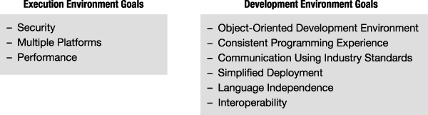
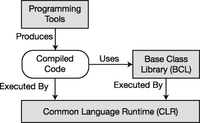
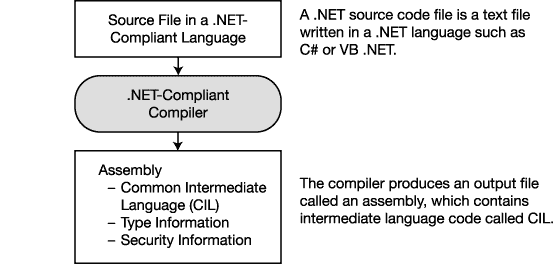
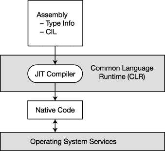
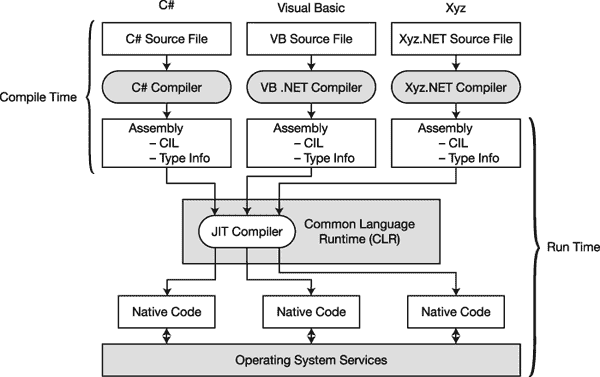
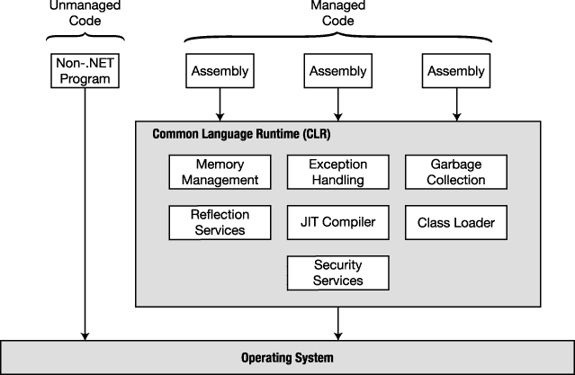
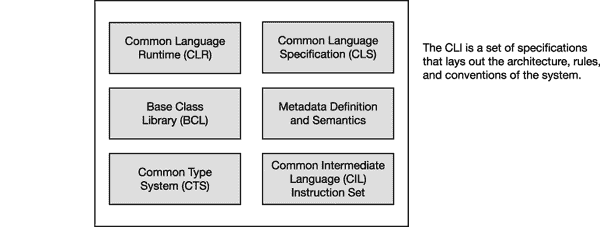
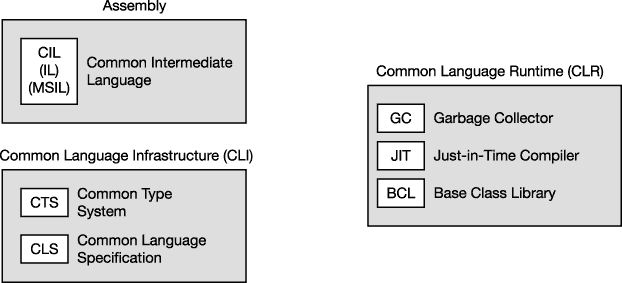
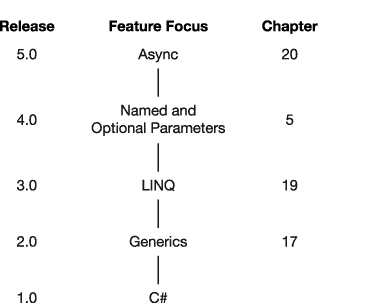

# 一、C# 和 .NET 框架

### 以前。网

C# 编程语言是为微软开发程序而设计的 .NET 框架。本章简要介绍了 .NET 的起源及其基本架构。首先，让我们把名字弄对:C# 读作“see sharp” [1](#CHP-1-FN-1)

#### 20 世纪 90 年代末的 Windows 编程

在 20 世纪 90 年代后期，使用微软平台的 Windows 编程已经分裂成许多分支。大多数程序员使用 Visual Basic、C 或 C++。一些 C 和 C++程序员使用原始的 Win32 API，但大多数使用微软基础类(MFC)。其他人已经转向组件对象模型(COM)。

所有这些技术都有自己的问题。原始的 Win32 API 不是面向对象的，使用它比 MFC 需要更多的工作。MFC 是面向对象的，但是不一致而且越来越老了。虽然概念上很简单，但实际编码很复杂，需要大量丑陋、不优雅的管道。

所有这些编程技术的另一个缺点是，它们的主要目标是为桌面而不是互联网开发代码。当时，网络编程是事后的想法，似乎与桌面编程非常不同。

#### 下一代平台服务的目标

我们真正需要的是一个新的开始——一个集成的、面向对象的开发框架，它将把一致性和优雅带回编程。为了满足这种需求，微软着手开发代码执行环境和满足这些目标的代码开发环境。图 1-1 列出了这些目标。

***图 1-1。**下一代平台的目标*

### 进入微软。网

2002 年，微软发布了 .NET 框架，它承诺解决老问题并满足下一代系统的目标。那个。与 MFC 或 COM 编程技术相比，NET Framework 是一个更加一致和面向对象的环境。它的一些特性包括:

____________

有一次，我参加了一个 C# 合同职位的面试，人力资源面试官问我在“see pound”(而不是“see sharp”)有多少编程经验！我过了一会儿才意识到他在说什么。

> *   *Multi-platform:* This system runs on a wide range of computers, from servers and desktops to PDAs and mobile phones.
> *   *Industry standard:* The system uses industry standard communication protocols, such as XML, HTTP, SOAP, JSON, WSDL, etc.
> *   *Security* : Even if there is code obtained from suspicious sources, the system can provide a safer execution environment.

#### 的组成部分 .NET 框架

那个 .NET 框架由三个组件组成，如图[图 1-2](#fig_1_2) 所示。执行环境称为公共语言运行时(CLR)。CLR 在运行时管理程序执行，包括以下内容:

> *   Memory management and garbage collection
> *   Code security verification
> *   Code execution, thread management and exception handling

编程工具包括编码和调试所需的一切，包括:

> *   Visual Studio integrated development environment. NET compatible compiler (for example, C#, Visual Basic. NET, F#, IronRuby, managed C++)
> *   debugger
> *   Web development server-side technologies, such as ASP.NET and WCF

基类库(BCL)是一个大型类库，由 .NET Framework，也可供您在自己的程序中使用。

***图 1-2。**的组成部分 .NET 框架*

#### 一个改进的编程环境

那个。与以前的 Windows 编程环境相比，NET Framework 为程序员提供了相当大的改进。以下部分简要概述了它的功能和优点。

##### 面向对象的开发环境

CLR、BCL 和 C# 被设计成完全面向对象的，并作为一个良好集成的环境。

该系统为本地程序和分布式系统提供了一致的、面向对象的编程模型。它还为桌面应用编程、移动应用编程和 web 开发提供了软件开发接口，在从服务器到手机的广泛目标上保持一致。

##### 自动垃圾收集

CLR 有一个称为垃圾收集器(GC)的服务，它会自动为您管理内存。

> GC 自动从内存中移除你的程序不再访问的对象。T3】

GC 将程序员从传统上必须执行的任务中解放出来，例如释放内存和寻找内存泄漏。这是一个巨大的改进，因为寻找内存泄漏可能很困难且耗时。

##### 互用性

那个 .NET Framework 是为不同的 .NET 语言、操作系统或 Win32 DLLs 以及 COM。

> *   This. NET language interoperability allows different. NET language seamless interaction.
>     *   A program written by one person. NET language can use or even inherit classes written in another language. Internet, as long as you follow certain rules.
>     *   Because it can easily integrate modules generated by different programming languages. The. NET Framework is sometimes described as language agnostic.
> *   This. The. NET Framework provides a feature named *platform call (p/invoke)* , which allows for It can use the original C functions imported from standard Win32 DLLs, such as Windows APIs.
> *   This. The. NET Framework also allows interoperability with COM. . NET framework software COMponents can call COM components, and com components can call. NET components as if they were COM components themselves.

##### 不需要 COM

那个 .NET Framework 将程序员从 COM 传统中解放出来。如果您来自 COM 编程环境，您会很高兴知道，作为一名 C# 程序员，您不需要使用以下任何一项:

> *   *`IUnknown` *Interface* : In COM, all objects must implement interface `IUnknown`. By contrast, all. NET object comes from a class named `object`. The interface is still programmed. NET, but this is no longer the central theme.*
> **   *Type library* : In COM, type information is stored in the type library as a `.tlb` file, which is separate from executable code. NET, the type information of the program is bundled with the code in the program file.*   *Manual reference counting* : In COM, programmers must record the number of references to an object to ensure that it is not deleted at the wrong time. NET, GC tracks references and removes objects only when appropriate.*   `HRESULT`: com used the `HRESULT` data type to return the runtime error code. . NET does not use `HRESULT` s, on the contrary, all unexpected runtime errors will generate exceptions.*   *Registry* : COM applications must be registered in the system registry, which stores the configuration information of the operating system and applications. . NET applications do not need to use the registry. This simplifies the installation and deletion of programs. (However, there is a similar thing called *Global Assembly Cache* , which I will introduce in Chapter 21 of [. )](21.html#ch21)*

 *尽管目前正在编写的 COM 代码数量相当少，但在目前正在使用的系统中仍然有相当数量的 COM 组件，C# 程序员有时需要编写与这些组件接口的代码。C# 4.0 引入了几个新特性，使得这项任务变得更加容易。这些功能在第 25 章中有所介绍。

##### 简化部署

部署为 .NET Framework 可以比以前容易得多，原因如下:

> *   Facts. NET programs don't need to be registered in the registry, which means that in the simplest case, a program only needs to be copied to the target machine to run.
> *   . NET provides a parallel execution feature named , which allows different versions of a DLL to exist on the same machine. This means that every executable file can access the version of the DLL built for it.

##### 类型安全

CLR 检查并确保参数和其他数据对象的类型安全，即使是在用不同编程语言编写的组件之间。

##### 基类库

的 .NET 框架提供了一个广泛的基础类库，毫不奇怪，叫做*基础* *类库(BCL)* 。(它有时也被称为框架类库[FCL])。在编写自己的程序时，您可以使用这些丰富的可用代码。一些类别如下:

> *   *Universal base class* : A class that provides you with a set of extremely powerful tools for various programming tasks, such as file operation, string operation, security and encryption.
> *   *Set class* : A class that implements lists, dictionaries, hash tables and bit arrays.
> *   *Thread and synchronization class* : a class used to build multithreaded programs.
> *   *XML class* : a class used to create, read and manipulate XML documents.

### 编译成通用的中间语言

. NET 语言的编译器获取一个源代码文件，并生成一个名为*程序集*的输出文件。[图 1-3](#fig_1_3) 说明了这个过程。

> *   The assembly is either an executable file or a DLL.
> *   The code in the assembly is not native code, but an intermediate language called *Universal Intermediate Language (CIL)* .
> *   An assembly contains, among other things, the following items:
>     *   CIL of program
>     *   Metadata about the types used in the program
>     *   Metadata about references to other assemblies

***图 1-3。**编译过程*

 **注意**中间语言的首字母缩略词随着时间的推移发生了变化，不同的引用使用不同的术语。您可能会遇到的 CIL 的另外两个术语是中间语言(IL)和微软中间语言(MSIL)。这些术语在 .NET 的最初开发和早期文档，尽管它们现在用得不那么频繁了。

### 编译为本机代码并执行

在被调用运行之前，程序的 CIL 不会被编译成本机代码。在运行时，CLR 执行以下步骤，如[图 1-4](#fig_1_4) 所示:

> *   Check the safety features of components.
> *   It allocates space in memory.
> *   It sends the compiled executable code to a just-in-time (JIT) compiler, which compiles part of the code into native code.

JIT 编译器只在需要时才编译程序集中的可执行代码。然后，它被缓存起来，以备程序稍后再次执行时使用。使用这个过程意味着在执行过程中没有被调用的代码不会被编译成本机代码，而被调用的代码只需要编译一次。

***图 1-4。**编译成本机代码发生在运行时。*

一旦 CIL 编译成本机代码，CLR 就在它运行时管理它，执行诸如释放孤立内存、检查数组边界、检查参数类型和管理异常之类的任务。这引出了两个重要术语:

> *   *Managed code* : Code written for managed code. NET framework is called *managed code* and needs CLR.
> *   *unmanaged code* : code that does not run under the control of CLR, such as Win32 C and c++ dll, is called *unmanaged code.*

微软还提供了一个名为*原生图像生成器*或 *Ngen* 的工具，它获取一个程序集并为当前处理器生成原生代码。通过 Ngen 运行的代码避免了运行时的 JIT 编译过程。

#### 编译和执行概述

不管原始源文件的语言是什么，都遵循相同的编译和执行过程。[图 1-5](#fig_1_5) 展示了用不同语言编写的三个程序的整个编译和运行过程。

***图 1-5。**编译时和运行时进程概述*

### 公共语言运行时

的核心组件 .NET Framework 就是 CLR，它位于操作系统之上，管理程序执行，如图[图 1-6](#fig_1_6) 所示。CLR 还提供以下服务:

> *   Automatic garbage collection
> *   And security authentication.
> *   Access BCL to realize a wide range of programming functions, including web services and data services.

***图 1-6。**CLR 概述*

### 通用语言基础设施

每种编程语言都有一组内在的类型，用来表示整数、浮点数、字符等对象。从历史上看，这些类型的特征因编程语言和平台的不同而不同。例如，根据语言和平台的不同，构成整数的位数有很大的不同。

然而，如果我们想让程序与用不同语言编写的其他程序和库很好地配合，这种缺乏统一性的情况会很困难。要有秩序和合作，就要有一套标准。

公共语言基础结构(CLI)是一组标准，它将 .NET 框架整合成一个紧密的、一致的系统。它展示了系统的概念和架构，并指定了所有软件必须遵守的规则和约定。图 1-7 显示了 CLI 的组成部分。

***图 1-7。**CLI 的组件*

CLI 和 C# 都已被 Ecma International 批准为开放的国际标准规范。(“Ecma”这个名字曾经是欧洲计算机制造商协会的首字母缩写，但现在它本身只是一个词。Ecma 成员包括微软、IBM、惠普、Adobe 和许多其他与计算机和消费电子产品相关的公司。

#### CLI 的重要部分

虽然大多数程序员不需要了解 CLI 规范的细节，但您至少应该熟悉通用类型系统(CTS)和通用语言规范(CLS)的含义和用途。

##### 通用类型系统

CTS 定义了必须在托管代码中使用的类型的特征。cts 的一些重要方面如下:

> *   CTS defines a group of rich intrinsic types, each of which has fixed and specific characteristics.
> *   Types provided by. NET-compatible programming languages usually map to a specific subset of this defined set of internal types.
> *   One of the most important features of CTS is that all types of *and* are derived from a common base class called `object`.
> *   Using CTS ensures that system types and user-defined types can be used by anyone. Comply with the language of. NET.

##### 公共语言规范

CLS 指定了符合. NET 的编程语言的规则、属性和行为。主题包括数据类型、类构造和参数传递。

### 复习缩略词

这一章已经讲了很多 .NET 首字母缩略词，所以图 1-8 会帮助你把它们弄清楚。

***图 1-8。**美国。网络缩略语*

### c# 的进化

该语言的当前版本是 5.0 版。这种语言的每一个新版本都有一个特别关注的新特性。版本 5.0 中新特性的重点是异步编程。我将在第 20 章中详细介绍这些特性。

图 1-9 显示了该语言每个版本的主要特性焦点，以及包含该材料的章节。

***图 1-9。**C # 版本特性集的焦点**