# 三、类型、存储和变量

### 一个 C# 程序是一组类型声明

如果你要概括 C 和 C++程序的源代码，你可能会说 C 程序是一组函数和数据类型，而 C++程序是一组函数和类。然而，C# 程序是一组类型声明。

> *   The source code of a c# program or DLL is a collection of one or more type declarations.
> *   For an executable file, the type of one of the declarations must be a class containing a method named `Main`.
> *   *Namespace* is a way to group a group of related type declarations and name the group. Because your program is a set of related type declarations, you usually declare the program type in the namespace you create.

例如，下面的代码显示了一个由三个类型声明组成的程序。这三种类型在名为`MyProgram`的名称空间中声明。

`   namespace MyProgram                         // Declare a namespace.
   {
      *DeclarationOfTypeA*                       // Declare a type.

      *DeclarationOfTypeB*                       // Declare a type.

      class C                                  // Declare a type.
      {
         static void Main()
         {
            ...
         }
      }
   }`

名称空间在第 21 章中有详细解释。

### 一个类型就是一个模板

由于 C# 程序只是一组类型声明，所以学习 C# 包括学习如何创建和使用类型。所以，我们需要做的第一件事是看看什么是类型。

您可以从将类型视为用于创建数据结构的*模板*开始。它不是数据结构本身，但是它指定了从模板构造的对象的特征。

类型由以下元素定义:

> *   A name
> *   A data structure contains its data members.
> *   Behavior and constraint

例如，[图 3-1](#fig_3_1) 说明了两种类型的部件:`short`和`int`。

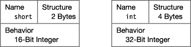

***图 3-1。**一个类型就是一个模板。*

### 实例化一个类型

从类型的模板中创建一个实际的对象叫做*实例化*类型。

> *   An object created by instantiating a type is called the *object* of that type or the *instance* of that type. These terms are interchangeable. Every data item in C# program is provided by language, BCL or other libraries, or some kind of instance defined by the programmer.

[图 3-2](#fig_3_2) 说明了两种预定义类型对象的实例化。

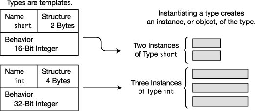

***图 3-2。**实例化一个类型创建一个实例。*

### 数据成员和函数成员

有些类型，如`short`、`int`和`long`，被称为简单类型*，只能存储一个数据项。*

其他类型可以存储多个数据项。例如，*数组*是一种可以存储多个相同类型项目的类型。单个项目被称为*元素*，并由一个编号引用，称为*索引*。第 12 章详细描述了数组。

#### 成员类型

然而，还有其他类型可以包含许多不同类型的数据项。这些类型中的单个元素被称为*成员*，与数组不同，数组中的每个成员都用一个数字来表示，这些成员有不同的名称。

有两种成员:数据成员和函数成员。

> *   *The data member* stores data related to the object of the class or the whole class.
> *   *Function member* executes code. Function members define the behavior of types.

例如，[图 3-3](#fig_3_3) 展示了`XYZ`类型的一些数据成员和函数成员。它包含两个数据成员和两个函数成员。

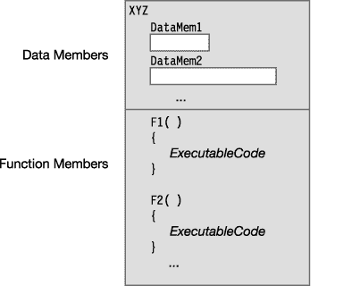

***图 3-3。**类型指定数据成员和函数成员。*

### 预定义类型

C# 提供了 16 种预定义类型，如图 3-4 所示，列于表 3-1 和表 3-2。它们包括 13 个简单类型和 3 个非简单类型。

所有预定义类型的名称都由全部小写的字符组成。预定义的简单类型包括以下几种:

> *   Eleven numerical types, including the following:
>     *   Signed and unsigned integer types of various lengths.
>     *   Floating-point type-`float` and `double`.
>     *   A high-precision decimal type called `decimal`. Unlike `float` and `double`, Type `decimal` can accurately represent decimal places. It is usually used for currency calculation.
> *   A Unicode character type called `char`.
> *   A Boolean type called `bool`. Type `bool` represents a Boolean value and must be one of two values-either `true` or `false`.

 **注意**与 C 和 C++不同，在 C# 中数值没有布尔解释。

三种非简单类型如下:

> *   Type `string`, which is Unicode character.
> *   The array of type `object` is the base type on which all other types are based.
> *   Type `dynamic`, using dynamic language.
> 
> 编写的程序集时使用

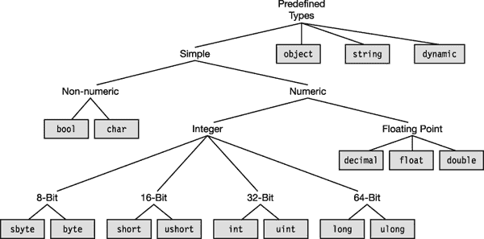

***图 3-4。**预定义的类型*

#### 关于预定义类型的更多信息

所有预定义的类型都直接映射到基础。网络类型。C# 类型名只是 .NET 类型，所以使用。网名在语法上很好，尽管不鼓励这样做。在 C# 程序中，应该使用 C# 名称，而不是。网名。

预定义的简单类型表示单个数据项。它们在[表 3-1](#tab_3_1) 中列出，以及它们可以表示的值的范围和基础。它们映射到的. NET 类型。

T2】

非简单的预定义类型稍微复杂一些。表 3-2 显示了预定义的非简单类型。

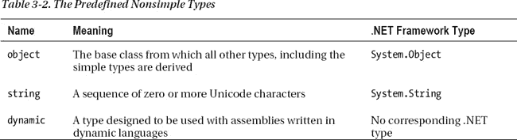

### 用户自定义类型

除了 C# 提供的 16 种预定义类型，您还可以创建自己的用户定义类型。您可以创建六种类型。它们是:

> *   `class` type
> *   `struct` type
> *   `array` type
> *   `enum` type
> *   `delegate` type
> *   `interface` type

您使用一个*类型声明*创建一个类型，它包含以下信息:

> *   The kind of type you are creating.
> *   The name of the new type
> *   The declaration (name and specification) of each member of the type-they have no named members except for the `array` and `delegate` types.

一旦声明了类型，就可以创建和使用该类型的对象，就像它们是预定义的类型一样。[图 3-5](#fig_3_5) 总结了预定义和用户定义类型的使用。使用预定义类型是一个单步过程，只需实例化该类型的对象。使用用户定义的类型是一个两步过程。您必须首先声明该类型，然后实例化该类型的对象。

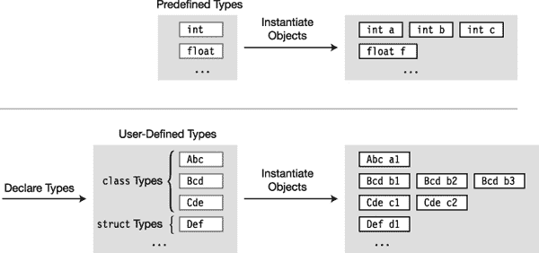

***图 3-5。**预定义类型只需要实例化。用户定义的类型需要两步:声明和实例化。*

### 栈和堆

当一个程序运行时，它的数据必须存储在内存中。一个项目需要多少内存，它存储在哪里以及如何存储，取决于它的类型。

一个正在运行的程序使用两个内存区域来存储数据:堆栈*和 T2 堆*。

#### 堆栈

堆栈是一个内存数组，充当后进先出(LIFO)数据结构。它存储几种类型的数据:

> *   The value of a certain variable
> *   The current execution environment of the program
> *   Parameters are passed to methods.

系统负责所有的堆栈操作。作为程序员，你不需要明确地对它做任何事情。但是理解它的基本功能会让你更好地理解你的程序在运行时在做什么，并且让你更好地理解 C# 文档和文献。

##### 关于书库的事实

堆栈的一般特征如下:

> *   Data can only be added and deleted from the top of the stack.
> *   Putting a data item on the top of the stack is called pushing the item onto the stack.
> *   Deleting an item from the top of the stack is called *Ejecting the item* from the top of the stack.

[图 3-6](#fig_3_6) 说明了堆栈的功能和术语。

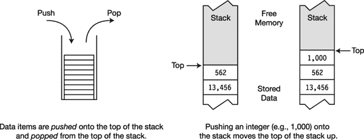

***图 3-6。**在堆栈上推动和弹出*

#### 堆

堆是内存中的一个区域，其中分配了块来存储某些类型的数据对象。与堆栈不同，数据可以以任何顺序存储在堆中或从堆中移除。图 3-7 显示了一个在堆中存储了四个项目的程序。

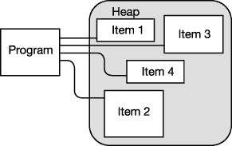

***图 3-7。**内存堆*

虽然您的程序可以在堆中存储项，但它不能显式删除它们。相反，当 CLR 的垃圾收集器(GC)确定您的代码无法再访问孤立的堆对象时，它会自动清理这些对象。这将您从其他编程语言中容易出错的任务中解放出来。[图 3-8](#fig_3_8) 说明了垃圾收集过程。

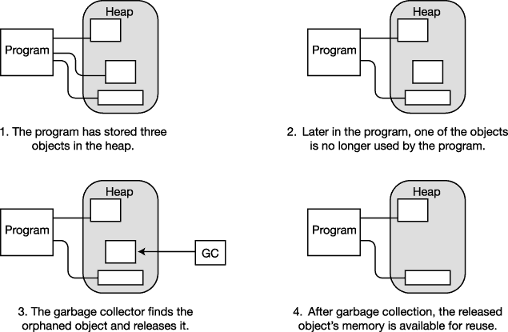

***图 3-8。**自动收集垃圾堆里的垃圾*

### 值类型和引用类型

数据项的*类型*定义了需要多少内存来存储它以及组成它的数据成员。类型也决定了对象在内存中的存储位置——堆栈还是堆。

类型分为两类:值类型和引用类型。这些类型的对象以不同的方式存储在内存中。

> *   The value type only needs a memory to store the actual data.
> *   Reference type requires two pieces of memory:
>     *   The first segment contains the actual data—and is always in the heap. The second is a reference that points to where the data is stored in the heap.

[图 3-9](#fig_3_9) 显示了每种类型的单个数据项是如何存储的。对于值类型，数据存储在堆栈上。对于引用类型，实际数据存储在堆中，引用存储在堆栈中。

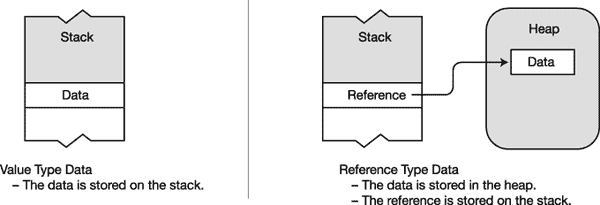

***图 3-9。**存储不属于另一种类型的数据*

#### 存储引用类型对象的成员

虽然图 3-9 显示了当数据不是另一个对象的成员时，它是如何存储的，但是当它是另一个对象的成员时，数据的存储可能会有一点不同。

> *   The data part *of the reference type object is always* stored in the heap, as shown in Figure [and Figure 3-9](#fig_3_9) .
> *   A value type object, or the reference part of a reference type, can be stored in the stack or in the heap, as the case may be.

例如，假设您有一个名为`MyType`的引用类型实例，它有两个成员——值类型成员和引用类型成员。它是如何储存的？值类型成员是否存储在堆栈上，引用类型是否在堆栈和堆之间拆分，如图[图 3-9](#fig_3_9) 所示？答案是否定的。

记住，对于引用类型，实例的数据总是*存储在堆中*。因为两个成员都是对象数据的一部分，所以它们都存储在堆中，不管它们是值类型还是引用类型。[图 3-10](#fig_3_10) 说明了`MyType`型的情况。

> *   Although the member `A` is a value type, it is a part of the `MyType` instance data, so it is stored in the heap together with the object data.
> *   Member `B` is a reference type, so its data part will always be stored in the heap, as shown by the small box marked "data". The difference is that its reference is also stored in the heap, in the data part of the closed `MyType` object.

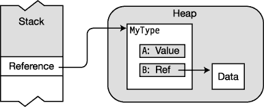

***图 3-10。**作为参考类型一部分的数据存储*

 **注意**对于任何一个引用类型的对象，其所有的数据成员都存储在堆中，不管是值类型还是引用类型。

#### 对 C# 类型进行分类

表 3-3 显示了 C# 中所有可用的类型以及它们是什么类型——值类型还是引用类型。每种引用类型将在后面的正文中介绍。

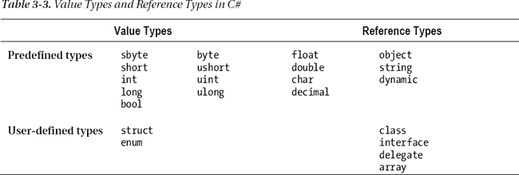

### 变量

通用编程语言必须允许程序存储和检索数据。

> *   A *variable* is a name that represents the data stored in memory during program execution.
> *   C# provides four variables, each of which will be discussed in detail. These are listed in [Table 3-4](#tab_3_4) .

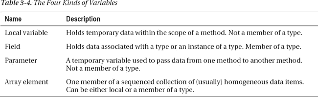

#### 变量声明

变量必须在使用前声明。变量声明定义变量并完成两件事:

> *   Give the variable a name and associate it with a type.

简单的变量声明至少需要一个类型和一个名称。下面的声明定义了一个名为`var2`，类型为`int`的变量:

`   Type
    ↓
   int var2;
        ↑
      Name`

例如，[图 3-11](#fig_3_11) 表示四个变量的声明以及它们在堆栈中的位置。

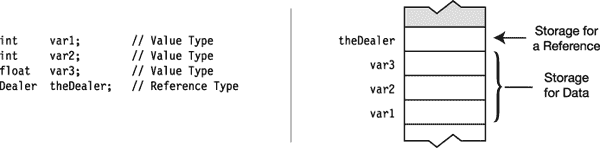

***图 3-11。**值类型和引用类型变量声明*

##### 变量初始值设定项

除了声明变量的名称和类型，您还可以选择使用声明将其内存初始化为一个特定的值。

一个*变量初始化器*由一个等号和其后的初始值组成，如下所示:

`           Initializer
            <ins>   ↓   </ins>
  int var2 = 17;`

没有初始值设定项的局部变量有一个未定义的值，在被赋值之前不能使用。试图使用未定义的局部变量会导致编译器产生错误信息。

[图 3-12](#fig_3_12) 左侧显示了一些局部变量声明，右侧显示了最终的堆栈配置。有些变量有初始值设定项，有些没有。

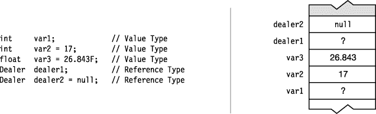

***图 3-12。**变量初始值设定项*

##### 自动初始化

一些类型的变量如果在没有初始化器的情况下被声明，它们会被自动设置为默认值，而另一些则不会。没有自动初始化为默认值的变量包含未定义的值，直到程序给它们赋值。[表 3-5](#tab_3_5) 显示了哪些变量会自动初始化，哪些不会。我将在后面的文章中讨论这五种变量。

T2】

#### 多变量声明

可以在一个声明语句中声明多个变量。

> *   Variables in a multivariable declaration must all be of the same type.
> *   Variables must be separated by commas. Initializers can be included in variable names.

例如，下面的代码显示了两个包含多个变量的有效声明语句。请注意，只要用逗号分隔，初始化的变量可以与未初始化的变量混合使用。显示的最后一条声明语句无效，因为它试图在一条语句中声明不同类型的变量。

`   // Variable declarations--some with initializers, some without
   int    var3 = 7, var4, var5 = 3;
   double var6, var7 = 6.52;

   Type     Different type
    ↓          ↓
   int var8, float var9;       // Error! Can't mix types (int and float)`

#### 使用变量值

变量名表示变量存储的值。您可以通过使用变量名来使用该值。

例如，在下面的语句中，变量名`var2`代表变量存储的*值*。执行语句时，将从内存中检索该值。

`   Console.WriteLine("{0}", var2);`

### 静态键入和动态关键字

你会注意到的一件事是，每个变量声明都包括变量的*类型*。这使得编译器可以确定运行时需要的内存量，以及哪些部分应该存储在堆栈中，哪些部分应该存储在堆中。变量的类型在编译时确定，在运行时不能更改。这叫做*静态打字。*

然而，并不是所有的语言都是静态类型的。许多语言，包括脚本语言如 IronPython 和 IronRuby，都是动态类型化的。也就是说，变量的类型可能要到运行时才能解析。既然这些也是 .NET 语言，C# 程序需要能够使用用这些语言编写的程序集。那么，问题是 C# 需要能够在编译时从直到运行时才解析其类型的程序集中解析类型。

为了解决这个问题，C# 提供了`dynamic`关键字来表示特定的 C# 类型，该类型知道如何在运行时自我解析。

在编译时，编译器不会对类型为`dynamic`的变量进行类型检查。相反，它将有关变量操作的任何信息打包，并将这些信息包含在变量中。在运行时，检查该信息以确保它与变量被解析成的实际类型一致。如果没有，运行时将抛出一个异常。

### 可空类型

有些情况下，尤其是在处理数据库时，您希望指明某个变量当前不包含有效值。对于引用类型，通过将变量设置为`null`，可以很容易地做到这一点。然而，当你定义一个值类型的变量时，不管它的内容是否有任何有效的意义，它的内存都是被分配的。

在这种情况下，您希望有一个与变量相关联的布尔指示符，这样，当值有效时，指示符为`true`，当值无效时，指示符为`false`。

*可空类型*允许你创建一个可以被标记为有效或无效的值类型变量，这样你就可以在使用变量之前确保它是有效的。常规值类型被称为*非空类型*。当你对 C# 有更好的理解时，我会在[第 25 章](25.html#ch25)中解释可空类型的细节。