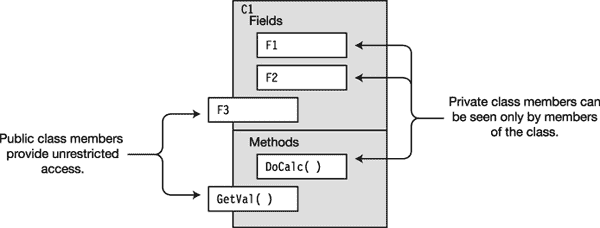

# 四、类：基础

### 类别概述

在前一章中，你看到了 C# 提供了六种用户定义的类型。其中最重要的，也是我将首先介绍的，是*类*。由于 C# 中的类是一个很大的主题，我将在接下来的几章中展开讨论。

#### 一个类是一个活跃的数据结构

在面向对象的分析和设计出现之前，程序员认为程序只是一系列指令。当时的重点是构建和优化这些指令。随着面向对象范例的出现，焦点从优化指令转变为将程序的数据和功能组织成逻辑上相关的数据项和功能的封装集，称为类。

类是可以存储数据和执行代码的数据结构。它包含数据成员和函数成员:

> *   *The data member* stores data related to a class or an instance of a class. Members usually model the attributes of real objects represented by this class.
> *   Member execution code. These usually model the functions and actions of the real-world objects represented by this class.

C# 类可以有任意数量的数据和函数成员。成员可以是九种可能的成员类型的任意组合。表 4-1 显示了这些成员类型。在这一章中，我将介绍字段和方法。

 **注意**类是逻辑上相关的数据项和函数的封装集合，通常代表现实世界或概念世界中的对象。

### 程序和类:快速示例

一个正在运行的 C# 程序是一组交互的类型对象，其中大部分是类的实例。例如，假设你有一个模拟扑克游戏的程序。当它运行时，它可能有一个名为`Dealer`的类的实例，它的工作是运行游戏，还有几个名为`Player`的类的实例，它们代表游戏的玩家。

`Dealer`对象存储卡片组的当前状态和玩家数量等信息。它的行动包括洗牌和发牌。

`Player`类很不一样。它存储玩家姓名和剩余下注金额等信息，并执行分析玩家当前手牌和下注等操作。[图 4-1](#fig_4_1) 说明了运行程序。类名显示在盒子外面，实例名在盒子里面。

***图 4-1。**运行程序中的对象*

除了`Dealer`和`Player`之外，一个真正的程序无疑会包含许多其他类。这些将包括像`Card`和`Deck`这样的职业。每一个类都模拟了一些*事物*，这是扑克游戏的一个组成部分。

 **注**一个正在运行的程序是一组相互交互的对象。

### 声明一个类

虽然类型`int`、`double`和`char`是在 C# 语言中定义的，但是像`Dealer`和`Player`这样的类，正如你可能猜到的，并不是由语言定义的。如果你想在程序中使用它们，你必须自己定义它们。您可以通过编写一个*类声明来实现。*

一个*类声明*定义了一个新类的特征和成员。它不创建类的实例，而是创建模板，从该模板中将创建类实例。类声明提供了以下内容:

> *   Class name
> *   Class members
> *   Class characteristics

下面是类声明的最小语法的一个示例。花括号包含组成*类主体*的成员声明。类成员可以在类体内以任何顺序声明。这意味着一个成员的声明完全可以引用另一个还没有定义的成员，直到在类声明的更下面。

`    Keyword     Class name
       ↓          ↓
     class MyExcellentClass
     {
        *MemberDeclarations*
     }`

下面的代码显示了两个类声明的概要:

`   class Dealer          // Class declaration
   {
      ...
   }

   class Player          // Class declaration
   {
      ...
   }`

 **注意**由于一个类声明“定义”了一个新的类，你会经常看到一个被称为*类定义*的类声明，无论是在文献中还是在程序员的日常使用中。

### 类成员

两种最重要的类成员类型是字段和方法。字段是数据成员，方法是函数成员。

#### 字段

一个*字段*是属于一个类的变量。

> *   It can be of any type, predefined or user-defined.
> *   Like all variables, fields store data and have the following characteristics:
>     *   They can be written.
>     *   They can learn from.

声明字段的最低语法如下:

`   Type
     ↓
   *Type Identifier*;
            ↑
         Field name`

例如，下面的类包含字段`MyField`的声明，它可以存储一个`int`值:

`   class MyClass
   {  Type
        ↓
       int MyField;
               ↑
   }       Field name`

 **注意**与 C 和 C++不同，在 C# 中*没有在类型之外声明全局变量*(即变量或字段)。所有字段都属于一个类型，并且必须在其类型声明中声明。

##### 显式和隐式字段初始化

因为字段是一种变量，所以字段初始化器的语法与前一章中显示的变量初始化器的语法相同。

> *字段初始化器*
> 
> *   The initialization value must be determinable at compile time. `   class MyClass
>        {
>           int F1 <ins>= 17</ins>;
>        }           ↑
>               Field initializer`
> *   If the initializer is not used, the compiler will set the value of the field to the default value, which is determined by the type of the field. [Table 3-1](03.html#tab_3_1) (in [of Chapter 3) gives the default values of simple types. To sum up: the default value of each type is 0, and `false` means `bool`. The default value of the reference type is `null`.](03.html)

例如，下面的代码声明了四个字段。前两个字段是隐式初始化的。后两个字段用初始化器显式初始化。

`   class MyClass
   {
       int    F1;                     // Initialized to 0    - value type
       string F2;                     // Initialized to null - reference type

       int    F3 = 25;                // Initialized to 25
       string F4 = "abcd";            // Initialized to "abcd"
   }`

##### 具有多个字段的声明

通过用逗号分隔名称，可以在同一个语句中声明相同类型的多个字段*。不能在一个声明中混合不同的类型。例如，您可以将前面的四个字段声明合并成两个语句，得到完全相同的语义结果:*

`   int    F1, F3 = 25;
   string F2, F4 = "abcd";`

#### 方法

方法是一个命名的可执行代码块，可以从程序的许多不同部分执行，甚至可以从其他程序执行。(也有匿名方法，没有被命名——但是我会在第 13 章中介绍这些方法。)

当一个方法被*调用*，或者被*调用*时，它执行该方法的代码，然后返回到调用它的代码，继续执行调用代码。一些方法将值返回到调用它们的位置。方法对应于 C++中的成员函数。

声明方法的最低语法包括以下组件:

> *   *Return Type* : the type of return value of the declaration method. If a method does not return a value, the return type is specified as `void`.
> *   Name: This is the name of the method.
> *   Parameter list: consists of at least one set of empty matching brackets. If there are parameters (which I will introduce in the next chapter), they are listed in brackets.
> *   Method: It consists of a set of matching curly braces and contains executable code.

例如，下面的代码用一个叫做`PrintNums`的简单方法声明了一个类。从声明中，您可以了解到关于`PrintNums`的以下信息:

> *   The return type is specified as `void`, so it does not return a value.
> *   It has an empty parameter list.
> *   Its method body contains two lines of code. The first output number 1 and the second output number 2.

`   class SimpleClass
   {
    Return type    Parameter list
       ↓            ↓
      void PrintNums( )
      {
         Console.WriteLine("1");
         Console.WriteLine("2");
      }
   }`

 **注意**与 C 和 C++不同，在 C# 中没有*在类型声明之外声明全局函数*(即方法或函数)。与 C 和 C++不同的是，在 C# 中，方法没有“默认”返回类型。所有方法都必须包含一个返回类型，或者将其列为`void`。

### 创建类的变量和实例

类声明只是创建类实例的蓝图。一旦声明了一个类，就可以创建该类的实例。

> *   Classes are reference types, as you remember in the last chapter, which means that they need memory to store references to data and actual data.
> *   The referenced data is stored in variables of class type. Therefore, to create an instance of a class, you need to start by declaring variables of the class type. If the variable is not initialized, its value is undefined.

[图 4-2](#fig_4_2) 说明了如何定义变量来保存引用。左边代码的顶部是对类`Dealer`的声明。下面是对类`Program`的声明，它包含方法`Main`。`Main`声明了`Dealer`类型的变量`theDealer`。因为变量未初始化，所以它的值未定义，如图右侧所示。

***图 4-2。**为类变量的引用分配内存*

### 为数据分配内存

声明类类型的变量会分配内存来保存引用，但不会分配内存来保存类对象的实际数据。要为实际数据分配内存，可以使用`new`操作符。

> *   The `new` operator allocates and initializes memory for instances of the specified type. It allocates memory from the stack or heap according to the type.
> *   Use the `new` operator to form an object creation expression, which consists of the following contents:
>     *   Keyword `new`.
>     *   The type name of the instance to allocate memory for.
>     *   Match brackets, which may or may not contain parameters. I will discuss the possible parameters in detail later.

`Keyword   Parentheses are required.
    ↓        <ins>   ↓  </ins>
  new *TypeName* ( )
         ↑
       Type`

> *   If the allocated memory is used for reference types, the object creation expression returns a reference to the allocated and initialized object instances in the heap.

这正是您需要分配和初始化内存来保存类实例数据的地方。使用`new`操作符创建一个对象创建表达式，并将它返回的值赋给类变量。这里有一个例子:

`   Dealer theDealer;             // Declare variable for the reference
   theDealer = <ins>new Dealer()</ins>;     // Allocate memory for the class object and assign
                     ↑           // it to the variable
             Object-creation expression`

图 4-3 中[左边的代码显示了用于分配内存和创建类`Dealer`实例的`new`操作符，然后将它赋给类变量。代码右侧的图中显示了内存结构。](#fig_4_3)

***图 4-3。**为类变量的数据分配内存*

#### 合并步骤

您可以通过用对象创建表达式初始化变量来组合这两个步骤。

`        Declare variable
     <ins>         ↓       </ins>
       Dealer theDealer = <ins>new Dealer();</ins>                // Declare and initialize
                               ↑
                Initialize with an object-creation expression.`

### 实例成员

一个类声明就像一个蓝图，你可以从中创建尽可能多的类实例。

> *   *Instance members* : Each instance of a class is an independent entity with its own set of data members, which is different from other instances of the same class. These are called instance members because they are associated with instances of the class.
> *   *Static member* : it is an instance member by default, but it is also possible to declare members called static members, which are associated with classes rather than instances. I will introduce these in Chapter 6.

作为实例成员的一个例子，下面的代码展示了带有类`Player`的三个实例的 poker 程序。[图 4-4](#fig_4_4) 显示每个实例的`Name`字段都有不同的值。

`   class Dealer { ... }                            // Declare class
   class Player {                                  // Declare class
      string Name;                                 // Field
         ...
   }

   class Program {
      static void Main()
      {
         Dealer theDealer = new Dealer();
         Player player1   = new Player();
         Player player2   = new Player();
         Player player3   = new Player();
         ...
      }
   }` 

***图 4-4。**实例成员在类对象之间有不同的值。*

### 访问修饰符

在一个类中，任何函数成员都可以通过简单地使用该成员的名字来访问该类的任何其他成员。

*访问修饰符*是成员声明的可选部分，它指定程序的哪些其他部分可以访问该成员。访问修饰符放在简单的声明形式之前。以下是字段和方法的语法:

`  Fields
*     AccessModifier Type Identifier*

  Methods
     *AccessModifier ReturnType MethodName* ()
     {
        ...
     }`

成员访问的五个类别如下。我将在本章中描述前两个，其他的将在第 7 章中描述。

> *   `private`
> *   `public`
> *   `protected`
> *   `internal`
> *   `protected internal`

#### 私人和公共访问

私有成员只能从声明它们的类中访问，其他类无法看到或访问它们。

> *   Private access is the default access level, so if a member is declared without an access modifier, it is a private member.
> *   You can also use the `private` access modifier to explicitly declare a private member. There is no semantic difference between implicitly declaring private members and explicitly declaring private members. These two forms are equivalent.

例如，以下两个声明都指定了`private` `int`成员:

`           int MyInt1;                 // Implicitly declared private

   private int MyInt2;                 // Explicitly declared private
      ↑
 Access modifier`

程序中的其他对象可以访问实例的公共成员。您必须使用`public`访问修饰符来指定公共访问。

`    Access modifier
        ↓
      public int MyInt;`

##### 描述公共和私人访问

本文中的图用带标签的方框表示类别，如图[图 4-5](#fig_4_5) 所示。

> *   Members are represented as small label boxes within the class box.
> *   Private members are represented as completely enclosed in their own class boxes.
> *   Public members are represented as partially stuck outside their class boxes.

***图 4-5。**代表班级和成员*

##### 成员访问示例

下面代码中的类`C1`声明了公共和私有字段和方法。[图 4-6](#fig_4_6) 展示了`C1`类成员的可见性。

`   class C1
   {
      int         F1;                     // Implicit private field
      private int F2;                     // Explicit private field
      public  int F3;                     // Public field

      void DoCalc()                       // Implicit private method
      {
         ...
      }

      public int GetVal()                 // Public method
      {
         ...
      }
   }` 

***图 4-6。**私有和公有类成员*

### 从类内部访问成员

如前所述，一个类的成员可以通过名字访问其他类成员。

例如，下面的类声明显示了该类访问字段的方法和其他方法。即使字段和两个方法被声明为`private`，类的所有成员都可以被该类的任何方法(或任何函数成员)访问。[图 4-7](#fig_4_7) 说明了代码。

`   class DaysTemp
   {
      // Fields
      private int High = 75;
      private int Low  = 45;

      // Methods
      private int GetHigh()
      {
         return High;                          // Access private field
      }

      private int GetLow()
      {
         return Low;                           // Access private field
      }

      public float Average ()
      {
         return (GetHigh() + GetLow()) / 2;    // Access private methods
      }             ↑          ↑
   }            Accessing the private methods` 

***图 4-7。**一个类内的成员可以自由地互相访问。*

### 从类外访问成员

若要从类外部访问公共实例成员，必须包含变量名和成员名，用句点(点)分隔。这被称为点语法符号；稍后我会更详细地描述它。

例如，下面代码的第二行显示了从类外部访问方法的示例:

`   DaysTemp myDt = new DaysTemp();      // Create an object of the class
   float fValue  = myDt.Average();      // Access it from outside
                    ↑      ↑
             Variable name  Member name`

例如，下面的代码声明了两个类:`DaysTemp`和`Program`。

> *   The two fields in `DaysTemp` are declared as `public`, so they can be accessed from outside the class.
> *   Method `Main` is a member of `Program` class. It creates a variable and an object of class `DaysTemp`, and assigns values to the fields of the object. Then it reads the values of the fields and prints them out.

`   class DaysTemp                                   // Declare class DaysTemp
   {
      public int High = 75;
      public int Low  = 45;
   }

   class Program                                    // Declare class Program
   {
      static void Main()
      {       Variable name
                   ↓
         DaysTemp temp = new DaysTemp();            // Create the object
   Variable name and field
         <ins>    ↓    </ins>
         temp.High = 85;                            // Assign to the fields
         temp.Low  = 60;               Variable name and field
                                           <ins>    ↓    </ins>
         Console.WriteLine("High:   {0}", temp.High );     // Read from fields
         Console.WriteLine("Low:    {0}", temp.Low  );
      }
   }`

这段代码产生以下输出:

* * *

`High:  85
Low:   60`

* * *

### 把所有的东西放在一起

下面的代码创建了两个实例，并将它们的引用存储在名为`t1`和`t2`的变量中。[图 4-8](#fig_4_8) 说明了内存中的`t1`和`t2`。该代码演示了到目前为止在类的使用中讨论的以下三个操作:

> *   Declare a class
> *   Create an instance of the class
> *   Access class members (that is, write to and read from a field)

`   class DaysTemp                          // Declare the class
   {
      public int High, Low;                // Declare the instance fields
      public int Average()                 // Declare the instance method
      {
         return (High + Low) / 2;
      }
   }

   class Program
   {
      static void Main()
      {
         // Create two instances of DaysTemp
         DaysTemp t1 = new DaysTemp();
         DaysTemp t2 = new DaysTemp();

         // Write to the fields of each instance
         t1.High = 76;     t1.Low = 57;
         t2.High = 75;     t2.Low = 53;

         // Read from the fields of each instance and call a method of
         // each instance
         Console.WriteLine("t1: {0}, {1}, {2}",
                                   t1.High, t1.Low, t1.Average() );
         Console.WriteLine("t2: {0}, {1}, {2}",
                                   t2.High, t2.Low, t2.Average() );
                                        ↑        ↑         ↑
      }                               Field      Field      Method
   }`

该代码产生以下输出:

* * *

`t1: 76, 57, 66
t2: 75, 53, 64`

* * *

***图 4-8。**实例 t1 和 T2 的内存布局*