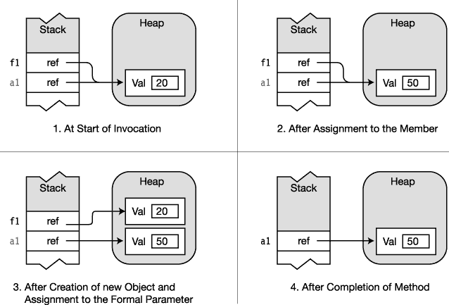

# 五、方法

### 一种方法的结构

一个*方法*是一个有名字的代码块。通过使用方法名，您可以从程序中的其他地方执行代码。您还可以将数据传入一个方法，并作为输出接收数据。

正如你在前一章看到的，方法是类的函数成员。方法有两个主要部分，如图[图 5-1](#fig_5_1) 所示——方法头和方法体。

> *   *The method header* specifies the characteristics of the method, including:
>     *   Whether the method returns data, and if so, what type of data is returned?
>     *   Method name
>     *   What types of data can be passed in and out of the method, and how should the data be handled?
> *   *The method body* contains the sequence of executable code statements. Execution starts with the first statement in the method body and continues to execute the whole method in sequence.

***图 5-1。**一个方法的结构*

下面的示例显示了方法头的形式。我将在接下来的几页中介绍每一部分。

`    int MyMethod ( <ins>int par1, string par2</ins> )
        ↑       ↑                  ↑
   Return  Method         Parameter
    type    name              list`

例如，下面的代码显示了一个名为`MyMethod`的简单方法，该方法依次多次调用`WriteLine`方法:

`   void MyMethod()
   {
      Console.WriteLine("First");
      Console.WriteLine("Last");
   }`

虽然前几章描述了类，但是还有另一种用户定义的类型叫做`struct`，我将在[第 10 章](10.html#ch10)中介绍。本章讲述的关于类方法的大部分内容对于`struct`方法也是正确的。

### 方法体中的代码执行

方法体是一个*块*，它(正如你在《T2》第二章中回忆的那样)是一系列花括号之间的语句。一个块可以包含以下项目:

> *   Local variable
> *   Control flow structure
> *   Method call
> *   The block is nested in it.

图 5-2 显示了一个方法体及其部分组件的例子。

***图 5-2。**法体实例*

### 局部变量

像我在第 4 章中提到的字段一样，局部变量存储数据。虽然字段通常存储关于对象状态的数据，但是通常创建局部变量来存储用于局部或暂时计算的数据。[表 5-1](#tab_5_1) 比较和对比局部变量和实例字段。

以下代码行显示了局部变量声明的语法。可选的初始化器由一个等号和一个用来初始化变量的值组成。

`     Variable name     Optional initializer
             ↓     <ins>      ↓   </ins>
   *Type* Identifier = Value;`

> *   The existence and life of a local variable is limited to the block that created it and the block nested in it.
>     *   Variables exist at the time of declaration.
>     *   When the program block finishes executing, it doesn't exist.
> *   Local variables can be declared anywhere in the method body, but they must be declared before they can be used.

以下示例显示了两个局部变量的声明和使用。第一个是类型`int`，第二个是类型`SomeClass`。

`   static void Main( )
   {
      int myInt    = 15;
      SomeClass sc = new SomeClass();
      ...
   }`

#### 类型推断和 var 关键字

如果你看下面的代码，你会发现在声明的开始提供类型名，你提供的信息编译器已经可以从初始化的右边推断出来。

> *   In the first variable declaration, the compiler can infer that `15` is a `int`.
> *   In the second declaration, the object creation expression on the right returns an object of type `MyExcellentClass`.

因此，在这两种情况下，在声明的开头包含显式类型名是多余的。

`   static void Main( )
   {
      int total = 15;
      MyExcellentClass mec = new MyExcellentClass();
      ...
   }`

为了避免这种冗余，C# 允许在变量声明的开头使用关键字`var`来代替显式类型名，如下所示:

`   static void Main( )
   { Keyword
       ↓
      var total = 15;
      var mec   = new MyExcellentClass();
      ...
   }`

关键字`var`并不代表*不是一种特殊的变量*。它只是从语句右侧的初始化中可以推断出的任何类型的语法简写。在第一个声明中，它是`int`的简写。第二种，它是`MyExcellentClass`的简写。前面带有显式类型名的代码段和带有`var`关键字的代码段在语义上是等价的。

使用`var`关键字的一些重要条件如下:

> *   Can only be used for local variables, not fields.
> *   It can only be used if the variable declaration contains initialization.
> *   Once the compiler deduces the type of the variable, it is fixed.

 **注意**`var`关键字是*而不是*像 JavaScript `var`可以引用不同的类型。它是从等号右边推断出的实际类型的简写。`var`关键字*并没有改变 C#* 的强类型本质。

#### 嵌套块内的局部变量

方法体中可以嵌套其他块。

> *   There can be any number of blocks, which can be sequential or further nested. Blocks can be nested at any level.
> *   Local variables can be declared within nested blocks, and like all local variables, their lifetime and visibility are limited to the blocks in which they are declared and the blocks nested within them.

[图 5-3](#fig_5_3) 展示了两个局部变量的寿命，显示了代码和堆栈的状态。箭头表示刚刚执行的那一行。

> *   The variable `var1` is declared in the method body before the nested block.
> *   The variable `var2` is declared in a nested block. It exists from the time of declaration until the end of the block where it is declared.
> *   When control is passed out of the nested block, its local variables pop up from the stack.

***图 5-3。**局部变量的生存期*

 **注意**在 C 和 C++中，你可以声明一个局部变量，然后在一个嵌套块中，你可以声明另一个同名的局部变量。在内部范围内，内部名称会屏蔽外部名称。但是，在 C# 中，无论嵌套级别如何，都不能在名字的范围内声明另一个同名的局部变量。

### 局部常数

局部常量很像局部变量，除了一旦被初始化，它的值就不能被改变。像局部变量一样，局部常量必须在块内声明。

常数的两个最重要的特征如下:

> *   The constant *must be initialized* by *by* *at the time of declaration.*
> *   *cannot be changed by* after the constant *is declared.*

常数的核心声明如下所示。语法与字段或变量声明的语法相同，除了以下几点:

> *   Add the keyword `const` before the type.
> *   Mandatory initialization. The value of the initializer must be determinable at compile time, and it is usually one of the predefined simple types or an expression composed of them. It can also be a `null` reference, but it cannot be a reference to an object, because the reference to an object is determined at runtime.

 **注意**关键字`const`不是修饰符，而是核心声明的一部分。它必须紧接在类型之前。

`   Keyword
      ↓
    const *Type Identifier* <ins>= Value</ins>;
                              ↑
                  Initializer required`

像局部变量一样，局部常量是在方法体或代码块中声明的，它在声明它的块的末尾超出了范围。例如，在下面的代码中，内置类型`double`的局部常量`PI`在方法`DisplayRadii`的结尾超出了范围。

`   void DisplayRadii()
   {
      const double PI = 3.1416;                    // Declare local constant

      for (int radius = 1; radius <= 5; radius++)
      {
         double area = radius * radius * PI;       // Read from local constant
         Console.WriteLine
            ("Radius: {0}, Area: {1}" radius, area);
      }
   }`

### 流量控制

方法包含组成程序的动作的大部分代码。其余的在其他函数成员中，比如属性和操作符。

术语*控制流*指的是程序的执行流。默认情况下，程序执行按顺序从一条语句移动到下一条语句。控制流语句允许您修改执行顺序。

在这一节中，我将只提到一些可以在代码中使用的控制语句。第 9 章详细介绍了它们。

> *   *Select statements* : These statements allow you to select statements or statement blocks to be executed.
>     *   `if`: conditionally execute a statement.
>     *   `if...else`: conditionally execute one or another statement.
>     *   `switch`: conditionally execute a group.
> *   A statement in an iteration statement: These statements allow you to loop or iterate through a block of statements.
>     *   `for`: Cycle-Test at the top
>     *   `while`: Cycle-Test at the top
>     *   `do`: Cycle-Test at the bottom
>     *   `foreach`: as a group
> *   Each member of the jump statement is executed once: these statements allow you to jump from one place in the block or method to another.
>     *   `break`: Exit the current cycle.
>     *   `continue`: Go to the bottom of the current cycle.
>     *   `goto`: Go to a named statement.
>     *   `return`: Return the execution to the calling method.

例如，下面的方法显示了两个控制流语句。不要担心细节。

`   void SomeMethod()
   {
      int intVal = 3;
        Equality comparison operator
               <ins> ↓ </ins>
      if( intVal == 3 )                                  // if statement
         Console.WriteLine("Value is 3\. ");

      for( int i=0; i<5; i++ )                           // for statement
         Console.WriteLine("Value of i: {0}", i);
   }`

### 方法调用

您可以从方法体内部调用其他方法。

> *   The phrases *calling method* and *calling method* are synonyms. I'll discuss this soon by calling the method with the method name and parameter list.

例如，下面的类声明了一个名为`PrintDateAndTime`的方法，它是从方法`Main`内部调用的:

`   class MyClass
   {
      void PrintDateAndTime()                  // Declare the method.
      {
         DateTime dt = DateTime.Now;            // Get the current date and time.
         Console.WriteLine("{0}", dt);          // Write it out.
      }

      static void Main()                        // Declare the method.
      {
         MyClass mc = new MyClass();
         mc.PrintDateAndTime<ins>()</ins>;                // Invoke the method.
    }              ↑         ↑
   }            Method      Empty
                name      parameter list`

[图 5-4](#fig_5_4) 说明了调用方法时的动作顺序:

> 1.  The execution of the current method is paused at the call point.
> 2.  Control transfers to the start of the called method.
> 3.  The called method is executed until completion.
> 4.  Control returns to the calling method.

***图 5-4。**调用方法时的控制流*

### 返回值

方法可以向调用代码返回值。返回值被插入到调用代码中表达式中发生调用的位置。

> *   To return a value, the method must declare a *return type* before the method name.
> *   If a method does not return a value, it must declare a return type `void`.

下面的代码显示了两个方法声明。第一个返回类型为`int`的值。第二个不返回值。

`   Return type
     ↓
    int  GetHour()     { ... }
    void DisplayHour() { ... }
     ↑
   No value is returned.`

声明返回类型的方法必须使用以下形式的`return`语句从该方法返回值，该语句在关键字`return`后包含一个表达式。方法中的每条路径都必须以这种形式的`return`语句结束。

`   return *Expression*;                           // Return a value.
               ↑
   Evaluates to a value of the return type`

例如，下面的代码显示了一个名为`GetHour`的方法，它返回一个类型为`int`的值。

`   Return type
     ↓
    int GetHour( )
    {
      DateTime dt = DateTime.Now;              // Get the current date and time.
      int hour    = dt.Hour;                   // Get the hour.

      <ins>return hour;</ins>                             // Return an int.
    }      ↑
     Return  statement`

也可以返回用户自定义类型的对象。例如，以下代码返回一个类型为`MyClass`的对象:

`   Return type — MyClass
       ↓
    MyClass method3( )
    {
       MyClass mc = new MyClass();
         ...
       return mc;                                 // Return a MyClass object.
    }`

作为另一个例子，在下面的代码中，方法`GetHour`在`Main`的`WriteLine`语句中被调用，并向`WriteLine`语句中的那个位置返回一个`int`值。

`   class MyClass
   {          ↓  Return type
      public int GetHour()
      {
         DateTime dt = DateTime.Now;            // Get the current date and time.
         int hour    = dt.Hour;                 // Get the hour.

         return hour;                           // Return an int.
      }           ↑
   }          Return value

   class Program
   {
      static void Main()
      {                                 Method invocation
         MyClass mc = new MyClass();    <ins>     ↓     </ins>
         Console.WriteLine("Hour: {0}", mc.GetHour());
      }                                  ↑    ↑
   }                                 Instance  Method
                                      name    name`

### 返回声明和作废方法

在上一节中，您看到了返回值的方法必须包含 return 语句。Void 方法不需要 return 语句。当控制流到达方法体的右花括号时，控制返回到调用代码，并且没有值被插回到调用代码中。

然而，通常情况下，当某些条件适用时，您可以通过提前退出该方法来简化程序逻辑。

> *   You can exit a `void` method at any time by using the `return` statement in the following form, without parameters: `return;`
> *   This form of `return` statement can only be used with methods declared as `void`.

例如，下面的代码显示了一个名为`SomeMethod`的`void`方法的声明，它有三个可能的位置返回给调用代码。前两个位置在称为`if`语句的分支中，这在第 9 章的[中有所涉及。最后一个地方是方法体的结尾。](09.html#ch9)

`  Void return type
     ↓
   void SomeMethod()
   {
      ...
      if ( SomeCondition )                 // If ...
         return;                           // return to the calling code.
      ...

      if ( OtherCondition )                // If ...
         return;                           // return to the calling code.

      ...
   }                                       // Default return to the calling code.`

下面的代码展示了一个带有`return`语句的`void`方法的例子。只有在中午之后，该方法才会写出消息。图 5-5 中的[所示的过程如下:](#fig_5_5)

> *   First, the method obtains the current date and time. Don't worry about understanding the details of this now. )
> *   If the number of hours is less than 12 (that is, before noon), the return statement is executed, and the control immediately returns to the calling method without writing anything to the screen.
> *   If the hour is 12 or more, skip the return statement, and the code executes the `WriteLine` statement to write the informational message to the screen.

`   class MyClass
   {    ↓ Void return type
      void TimeUpdate()
      {
         DateTime dt = DateTime.Now;          // Get the current date and time.
            if (dt.Hour < 12)                 // If the hour is less than 12,
               return;                        // then return.
                  ↑
               Return to calling method
         Console.WriteLine("It's afternoon!");   // Otherwise, print message.
      }

      static void Main()
      {
         MyClass mc = new MyClass();       // Create an instance of the class.
         mc.TimeUpdate();                  // Invoke the method.
      }
   }` 

***图 5-5。**使用返回类型为 void 的 return 语句*

### 参数

到目前为止，您已经看到了方法是命名的代码单元，可以从程序中的许多地方调用，并且可以向调用代码返回单个值。返回单个值当然有价值，但是如果需要返回多个值呢？此外，如果能够在方法开始执行时将数据传递给该方法，那将非常有用。*参数*是一种特殊的变量，可以让你做这两件事。

#### 形式参数

*形参*是在方法声明的参数列表中声明的局部变量，而不是在方法体中声明的。

下面的方法头显示了参数声明的语法。它声明了两个形参——一个类型为`int`，另一个类型为`float`。

`   public void PrintSum( <ins>int x, float y</ins> )
   {                           ↑   
      ...           Formal parameter declarations
   }`

> *   Because formal parameters are variables, they have data types and names, which can be read and written.
> *   Unlike other local variables of methods, parameters are defined outside the method body and initialized before the method starts (except for a type called output parameter, which I will introduce soon).

在大多数情况下，形式参数在整个方法体中使用，就像其他局部变量一样。例如，下面对方法`PrintSum`的声明使用了两个形参`x`和`y`，以及一个局部变量`sum`，它们都属于`int`类型。

`   public void PrintSum( int x, int y )
   {
      int sum = x + y;
      Console.WriteLine("Newsflash:  {0} + {1} is {2}", x, y, sum);
   }`

#### 实际参数

当您的代码调用一个方法时，必须在方法中的代码开始执行之前初始化形参的值。

> *   The expression or variable used to initialize formal parameters is called *actual parameter* . They are sometimes called *arguments* .
> *   The actual parameters are placed in the parameter list of the method call.
> *   Each argument must match the type of the corresponding parameter, or the compiler must be able to implicitly convert the argument to that type. I will explain the details of converting from one type to another in Chapter 16.

例如，下面的代码显示了方法`PrintSum`的调用，它有两个数据类型`int`的实际参数:

`   PrintSum( 5, someInt );
             ↑     ↑
       Expression   Variable of type int`

当调用该方法时，每个实际参数的值用于初始化相应的形参。然后执行方法体。[图 5-6](#fig_5_6) 说明了实际参数和形式参数之间的关系。

***图 5-6。**实参初始化相应的形参。*

请注意，在前面的示例代码中，以及在图 5-6 中，实参的数量与形参的数量相匹配，并且每个实参与相应形参的类型相匹配。遵循该模式的参数被称为*位置参数*。我们很快就会看到一些其他的选择。但是首先我们将更详细地看位置参数。

##### 带有位置参数的方法示例

在下面的代码中，类`MyClass`声明了两个方法——一个接受两个整数并返回它们的和，另一个接受两个`float`并返回它们的平均值。在第二次调用中，注意编译器已经隐式地将两个`int`值— `5`和`someInt`—转换为`float`类型。

`   class MyClass    Formal parameters
   {                 <ins>     ↓     </ins>  
      public int Sum(int x, int y)                        // Declare the method.
      {
         return x + y;                                    // Return the sum.
      }
                           Formal parameters
                       <ins>           ↓              </ins>
      public float Avg(float input1, float input2)        // Declare the method.
      {
         return (input1 + input2) / 2.0F;                 // Return the average.
      }
   }

   class Program
   {
      static void Main()
      {
         MyClass myT = new MyClass();
         int someInt = 6;

         Console.WriteLine
            ("Newsflash:  Sum: {0} and {1} is {2}",
                 5, someInt, myT.Sum( <ins>5, someInt</ins> ));        // Invoke the method.
                                           ↑
                                     Actual parameters
         Console.WriteLine
            ("Newsflash:  Avg: {0} and {1} is {2}",
                 5, someInt, myT.Avg( <ins>5, someInt</ins> ));        // Invoke the method.
      }                                    ↑
   }                                 Actual parameters`

该代码产生以下输出:

* * *

`Newsflash:  Sum: 5 and 6 is 11
Newsflash:  Avg: 5 and 6 is 5.5`

* * *

### 值参数

有几种类型的参数，每一种都以稍微不同的方式向方法传递数据和从方法传递数据。到目前为止，我们看到的类型是默认类型，称为*值参数。*

当使用值参数时，通过将实际参数的值复制到形参来将数据传递给方法。当调用一个方法时，系统执行以下操作:

> *   It allocates space for parameters on the stack.
> *   It copies the values of actual parameters into formal parameters.

值参数的实际参数不一定是变量。它可以是计算匹配数据类型的任何表达式。例如，下面的代码显示了两个方法调用。首先，实际参数是一个类型为`float`的变量。在第二个例子中，它是一个计算结果为`float`的表达式。

`   float func1( <ins>float val</ins> )                              // Declare the method.
   {               ↑
               Float data type
      float j = 2.6F;
      float k = 5.1F;
          ...
   }

                       Variable of type float
                             ↓
      float fValue1 = func1( k );                        // Method call
      float fValue2 = func1( <ins>(k + j) / 3</ins> );              // Method call
      ...                         ↑
                       Expression that evaluates to a float`

在使用变量作为实际参数之前，必须给该变量赋值(输出参数除外，我将很快介绍这一点)。对于引用类型，变量可以被赋予一个实际引用或`null`。

 **注** [第 3 章](03.html#ch3)讲述了*值类型，*如您所知，这些值类型包含自己的数据。不要混淆我现在说的是*值参数*。他们完全不同。*值参数*是实参的值被复制到形参的参数。

例如，下面的代码显示了一个名为`MyMethod`的方法，它有两个参数——一个类型为`MyClass`的变量和一个`int`。

> *   This method adds 5 to the `int` type field and `int` belonging to this class. You may also notice that `MyMethod` uses the modifier `static`, which I haven't explained yet. You can ignore it for a while. I will explain the static method in Chapter 6.

`   class MyClass
   {
      public int Val = 20;                      // Initialize the field to 20.
   }

   class Program            Formal parameters
   {                       <ins>        ↓          </ins>
      static void MyMethod( MyClass f1, int f2 )
      {
         f1.Val = f1.Val + 5;                   // Add 5 to field of f1 param.
         f2     = f2 + 5;                       // Add 5 to second param.
         Console.WriteLine( "f1.Val: {0}, f2: {1}", f1.Val, f2 );
      }

      static void Main()
      {
         MyClass a1 = new MyClass();
         int     a2 = 10;

                Actual parameters
                  <ins>   ↓   </ins>
         MyMethod( a1, a2 );                    // Call the method.
         Console.WriteLine( "f1.Val: {0}, f2: {1}", a1.Val, a2 );
      }
   }`

该代码产生以下输出:

* * *

`f1.Val: 25, f2: 15
f1.Val: 25, f2: 10`

* * *

[图 5-7](#fig_5_7) 说明了在方法执行的各个阶段实际和形式参数的值:

> *   Before the method is called, the variables `a1` and `a2` that will be used as actual parameters are already on the stack.
> *   At the beginning of the method, the system allocates space for the parameter on the stack and copies the value from the argument.
>     
>     *   Because `a1` is a reference type, the reference is copied, resulting in that both arguments and parameters refer to the same object in the heap.
>     *   Because `a2` is a value type, the value is copied to generate an independent data item.
> *   At the end of the method, the fields of `f2` and `f1` are increased by 5\.
>     
>     *   After the method is executed, the parameter is popped off the stack.
>     *   The value of value type `a2` is not affected by activities in the method.
>     *   However, the value of the reference type `a1` has been changed by the activity in the method.

***图 5-7** 。数值参数*

### 参考参数

第二种类型的参数称为*参考参数。*

> *   When using a reference parameter, you must use the `ref` modifier in the declaration and call of the method.
> *   The argument *must be a variable* and must be assigned to before it can be used as an argument. If it is a reference type variable, it can be given an actual reference or value `null`.

例如，以下代码阐释了声明和调用的语法:

`               Include the ref modifier.
                   ↓
   void MyMethod( ref int val )           // Method declaration
   { ... }

   int y = 1;                             // Variable for the actual parameter
   MyMethod ( ref y );                    // Method call
               ↑
           Include the ref modifier.

   MyMethod ( ref <ins>3+5</ins> );                  // Error!
                   ↑
                 Must use a variable`

在上一节中，您看到了对于值参数，系统在堆栈上为形参分配内存。相比之下，参考参数具有以下特征:

> *   They do not allocate memory for parameters on the stack.
> *   Instead, the parameter name acts as the alias of the argument variable, referring to the same memory location.

由于形参名和实参名的行为就好像它们引用了相同的内存位置，因此很明显，在方法执行过程中对形参所做的任何更改在方法完成后都可以通过实参变量看到。

 **注意**记住在方法声明*和*调用中使用`ref`关键字。

例如，下面的代码再次显示了方法`MyMethod`，但是这次参数是引用参数而不是值参数:

`   class MyClass
   {
      public int Val = 20;                     // Initialize field to 20.
   }

   class Program         ref modifier         ref modifier
   {                        ↓                ↓
      static void MyMethod(ref MyClass f1, ref int f2)
      {
         f1.Val = f1.Val + 5;                  // Add 5 to field of f1 param.
         f2     = f2 + 5;                      // Add 5 to second param.
         Console.WriteLine( "f1.Val: {0}, f2: {1}", f1.Val, f2 );
      }

      static void Main()
      {
         MyClass a1 = new MyClass();
         int a2     = 10;
                   ref modifiers
                   ↓       ↓
         MyMethod(ref a1, ref a2);             // Call the method.
         Console.WriteLine( "f1.Val: {0}, f2: {1}", a1.Val, a2 );
      }
   }`

该代码产生以下输出:

* * *

`f1.Val: 25, f2: 15
f1.Val: 25, f2: 15`

* * *

[图 5-8](#fig_5_8) 说明了在方法执行的各个阶段实际和形式参数的值:

> *   Before the method is called, the variables `a1` and `a2` that will be used as actual parameters are already on the stack.
> *   At the beginning of the method, the name of the parameter has been set as the alias of the actual parameter. You can think that variables `a1` and `f1` point to the same memory location, and variables `a2` and `f2` point to the same memory location.
> *   At the end of the method, the fields of `f2` and `f1` objects are increased by 5.
> *   After the execution of the method, the names of the parameter disappeared ("out of range"), but the value of `a2` (value type) and the value of the object pointed to by `a1` (reference type) were changed by the activities in the method.

***图 5-8。**通过引用参数，形参充当实参的别名。*

### 引用类型为值和引用参数

在前面几节中，您看到了对于引用类型对象，您可以在方法调用中修改其成员，而不管您是将对象作为值参数还是作为引用参数发送。然而，我们并没有在方法内部给形参赋值。在这一节中，我们将看看当你在方法内部给一个引用类型的形参赋值时会发生什么。答案如下:

> *   *Pass the reference type object as a value parameter* : If a new object is created inside the method and assigned to the parameter, it will break the connection between the parameter and the actual parameter, and the new object will not persist after the method is called.
> *   *Pass the reference type object as the reference parameter* : If a new object is created inside the method and assigned to the parameter, then the new object still exists after the method ends, and it is the value referenced by the argument.

以下代码显示了第一种情况——使用引用类型对象作为*值参数*:

`   class MyClass { public int Val = 20; }

   class Program
   {
      static void RefAsParameter( MyClass f1 )
      {
         f1.Val = 50;
         Console.WriteLine( "After member assignment:    {0}", f1.Val );
         f1 = new MyClass();
         Console.WriteLine( "After new object creation:  {0}", f1.Val );
      }

      static void Main( )
      {
         MyClass a1 = new MyClass();

         Console.WriteLine( "Before method call:         {0}", a1.Val );
         RefAsParameter( a1 );
         Console.WriteLine( "After method call:          {0}", a1.Val );
      }
   }`

该代码产生以下输出:

* * *

`Before method call:         20
After member assignment:    50
After new object creation:  20
After method call:          50`

* * *

[图 5-9](#fig_5_9) 下图说明了以下有关代码:

> *   At the beginning of the method, both arguments and formal parameters point to the same object in the heap.
> *   After being assigned to members of an object, they still point to the same object in the heap.
> *   When the method assigns a new object to the parameter, the actual parameter (outside the method) still points to the original object, and the parameter points to the new object.
> *   After the method is called, the argument points to the original object, and the parameter and the new object are gone.

***图 5-9。**分配给用作值参数的引用类型对象*

下面的代码说明了引用类型对象被用作引用参数的情况。除了方法声明和方法调用中的`ref`关键字之外，代码完全相同。

`   class MyClass
   {
      public int Val = 20;
   }

   class Program
   {

      static void RefAsParameter( ref MyClass f1 )
      {
         // Assign to the object member.
         f1.Val = 50;
         Console.WriteLine( "After member assignment:    {0}", f1.Val );

         // Create a new object and assign it to the formal parameter.
         f1 = new MyClass();
         Console.WriteLine( "After new object creation:  {0}", f1.Val );
      }

      static void Main( string[] args )
      {
         MyClass a1 = new MyClass();

         Console.WriteLine( "Before method call:         {0}", a1.Val );
         RefAsParameter( ref a1 );
         Console.WriteLine( "After method call:          {0}", a1.Val );
      }
   }`

该代码产生以下输出:

* * *

`Before method call:         20
After member assignment:    50
After new object creation:  20
After method call:          20`

* * *

如您所知，引用参数的行为就好像实际参数是形式参数的别名。这使得对前面代码的解释变得容易。[图 5-10](#fig_5_10) 说明了以下关于代码:

> *   When the method is called, the parameter and argument point to the same object in the heap.
> *   The modification of a member's value is seen by both parameter and argument.
> *   When the method creates a new object and assigns it to the parameter, the references of the parameter and the argument point to the new object.
> *   After the method, the actual parameter points to the object created inside the method.

***图 5-10。**分配给用作参考参数的参考类型对象*

### 输出参数

*输出参数*用于将数据从方法内部传递回调用代码。它们的行为非常类似于参考参数。与参考参数一样，输出参数也有以下要求:

> *   Modifiers must be used in both method declarations and calls. For the output parameter, the modifier is `out`, not `ref`.
> *   Like the reference parameter, the actual parameter *must* be a variable-it cannot be another type of expression. This is meaningful because this method requires a memory location to store the value it returns.

例如，下面的代码声明了一个名为`MyMethod`的方法，它接受一个输出参数。

`              out modifier
                                           ↓
   void MyMethod( out int val )          // Method declaration
   { ... }

   ...
   int y = 1;                            // Variable for the actual parameter
   MyMethod ( out y );                   // Method call
               ↑
           out modifier`

像引用参数一样，输出参数的形式参数充当实际参数的别名。形参和实参都是同一个内存位置的名字。显然，在方法完成执行后，对方法内部形参的任何更改都可以通过实际的形参变量看到。

与参考参数不同，输出参数需要满足以下条件:

> *   Within a method, the output parameter must be assigned before it can be read. This means that the initial values of the parameters are irrelevant, and you don't have to assign values to the actual parameters before the method call.
> *   Within the method, every possible path in the code must assign a value to each output parameter before the method exits.

由于方法内部的代码必须先写入输出参数，然后才能读取它，所以*不可能*使用输出参数将数据*发送到*方法中。事实上，如果方法中有任何执行路径试图在方法为输出参数赋值之前读取该参数的值，编译器就会产生错误信息。

`   public void Add2( out int outValue )
   {
      int var1 = outValue + 2;  // Error! Can't read from an output parameter
   }                            // before it has been assigned to by the method.`

例如，下面的代码再次显示了方法`MyMethod`，但是这次使用了输出参数:

`   class MyClass
   {
      public int Val = 20;                    // Initialize field to 20.
   }

   class Program       out modifier         out modifier
   {                       ↓                ↓
      static void MyMethod(out MyClass f1, out int f2)
      {
         f1 = new MyClass();                  // Create an object of the class.
         f1.Val = 25;                         // Assign to the class field.
         f2     = 15;                         // Assign to the int param.
      }

      static void Main()
      {
         MyClass a1 = null;
         int a2;

         MyMethod(out a1, out a2);            // Call the method.
      }            ↑       ↑
   }               out modifiers`

[图 5-11](#fig_5_11) 说明了在方法执行的各个阶段实际和形式参数的值。

> *   Before the method is called, the variables `a1` and `a2` that will be used as actual parameters are already on the stack.
> *   At the beginning of the method, the name of the parameter is set as the alias of the actual parameter. You can imagine the variables `a1` and `f1` pointing to the same memory location, or you can imagine the variables `a2` and `f2` pointing to the same memory location. The names `a1` and `a2` are out of range and cannot be accessed from within `MyMethod`.
> *   Inside the method, the code creates an object of type `MyClass` and assigns it to `f1`. Then it assigns a value to the field of `f1` and also to `f2`. The assignments of `f1` and `f2` are both necessary because they are output parameters.
> *   After the method is executed, the name of the parameter is out of scope, but the values of reference type `a1` and value type `a2` are changed by the activities in the method.

***图 5-11。**对于输出参数，形参充当实参的别名，但是附加的要求是必须在方法内部赋值。*

### 参数数组

在我到目前为止介绍的参数类型中，每个形参都必须有一个实参。*参数数组*的不同之处在于它们允许*零个或多个*特定类型的实际参数用于特定的形参。关于参数数组的要点如下:

> *   There can only be one parameter array in a parameter list.
> *   If so, it must be the last parameter in the list.
> *   All parameters represented by an array must be of the same type.

要声明参数数组，必须执行以下操作:

> *   Use the `params` modifier before the data type.
> *   Place a set of empty square brackets after the data type.

下面的方法头显示了类型为`int`的参数数组声明的语法。在这个例子中，形式参数`inVals`可以表示零个或多个实际的`int`参数。

`                      Array of ints
                         <ins>  ↓  </ins>
   void ListInts( <ins>params</ins> int[] <ins>inVals</ins> )
   { ...             ↑            ↑
                  Modifier       Parameter name`

类型名后面的方括号空集指定参数将是一个`int` s 的*数组*，这里不需要担心数组的细节。他们在第 12 章中有详细介绍。但是，对于我们这里的目的，您只需要知道以下内容:

> *   An array is an ordered collection of data items of the same type.
> *   Access an array using a numeric index.
> *   Array is a reference type, so all its data items are stored in the heap.

#### 方法调用

可以通过两种方式为参数数组提供实际参数。这些是

> `   ListInts( 10, 20, 30 );              // Three ints`
> 
> *   One-dimensional array element of data type.
>     `   int[] intArray = {1, 2, 3};
>        ListInts( intArray );                // An array variable`

请注意，在这些例子中，在*调用*中，您没有*而*使用了`params`修饰符。参数数组中修饰符的用法不符合其他参数类型的模式。

> *   Other parameter types are consistent, they either use a modifier or do not use a modifier.
>     *   Parameters are declared or called without modifiers.
>     *   Modifiers are required for both reference and output parameters.
> *   The usage of `params` modifier is summarized as follows:
>     *   Need to be used in the declaration.
>     *   Not allowed in the call.

##### 展开式

方法调用的第一种形式，在调用中使用单独的实际参数，有时被称为*扩展形式。*

例如，下面代码中方法`ListInts`的声明匹配它下面的所有方法调用，即使它们有不同数量的实际参数。

`   void ListInts( params int[] inVals ) { ... }       // Method declaration

   ...
   ListInts( );                                       // 0 actual parameters
   ListInts( 1, 2, 3 );                               // 3 actual parameters
   ListInts( 4, 5, 6, 7 );                            // 4 actual parameters
   ListInts( 8, 9, 10, 11, 12 );                      // 5 actual parameters`

当对参数数组使用带有独立实际参数的调用时，编译器会执行以下操作:

> *   It gets a list of actual parameters and uses them to create and initialize an array in the heap.
> *   It stores the reference to the array in the parameter on the stack.
> *   If there is no argument at the position of the corresponding shape parameter group, the compiler creates an array of zero elements and uses.

例如，下面的代码声明了一个名为`ListInts`的方法，它采用一个参数数组。`Main`声明三个`int`并将它们传递给数组。

`   class MyClass                  Parameter array

   {                        <ins>          ↓         </ins>                 
      public void ListInts( params int[] inVals )
      {
         if ( (inVals != null) && (inVals.Length != 0))
            for (int i = 0; i < inVals.Length; i++)     // Process the array.
            {
               inVals[i] = inVals[i] * 10;
               Console.WriteLine("{0}", inVals[i]);   // Display new value.
            }
      }
   }

   class Program
   {
      static void Main()
      {
         int first = 5, second = 6, third = 7;          // Declare three ints.

         MyClass mc = new MyClass();
         mc.ListInts( <ins>first, second, third</ins> );           // Call the method.
                               ↑
                          Actual parameters
         Console.WriteLine("{0}, {1}, {2}", first, second, third);
      }
   }`

该代码产生以下输出:

* * *

`50
60
70
5, 6, 7`

* * *

[图 5-12](#fig_5_12) 说明了在方法执行的各个阶段实际和形式参数的值:

> *   Before the method call, three actual parameters were already on the stack.
> *   At the beginning of the method, three actual parameters will be used to initialize the array in the heap, and the reference to the array will be assigned to the parameter `inVals`.
> *   Inside the method, the code first checks to make sure that the array reference is not `null`, and then processes the array by multiplying each element in the array by 10 and storing it back.
> *   After the method is executed, the parameter `inVals` is out of range.

***图 5-12。**参数数组示例*

关于参数数组，需要记住的一件重要事情是，当在堆中创建数组时，实际参数的值会被复制到数组中。这样，它们就像是值参数。

> *   If the array parameter is of value type, the value of *is copied, and the actual parameter *inside the method will not be affected* .*
> *   If the array parameter is a reference type, then *reference* is copied, and the object referenced by the actual parameter *can be affected* inside the method.

#### 数组作为实际参数

您也可以在方法调用之前创建并填充一个数组，并将单个数组变量作为实际参数传递。在这种情况下，编译器使用*你的*数组，而不是创建一个。

例如，下面的代码使用了在前一个例子中声明的方法`ListInts`。在这段代码中，`Main`创建了一个数组，并使用数组变量作为实际参数，而不是使用单独的整数。

`   static void Main()
   {
      int[] myArr = new int[] { 5, 6, 7 };  // Create and initialize array.

      MyClass mc = new MyClass();
      mc.ListInts(myArr);                   // Call method to print the values.

      foreach (int x in myArr)
         Console.WriteLine("{0}", x);       // Print out each element.
   }`

该代码产生以下输出:

* * *

`50
60
70
50
60
70`

* * *

### 参数类型汇总

由于有四种参数类型，有时很难记住它们的各种特征。[表 5-2](#tab_5_2) 总结了它们，便于比较和对比。

### 方法重载

一个类可以有多个同名的方法。这被称为*方法重载*。每个同名的方法必须有不同于其他方法的*签名*。

> *   The method signature of consists of the following information in the method header of the method declaration:
>     *   The name of the method
>     *   Number of parameters
>     *   Data type and order of parameters
>     *   Parameter modifier
> *   The return type is not part of the signature-although people often mistakenly think it is part of the signature.
> *   Note that the *name* of the parameter is the *part of the signature, not the* part.

`    Not part of signature
       ↓
   long <ins>AddValues( int a, out int b)</ins> { ... }
                    ↑     
                 Signature`

例如，以下四个方法是方法名`AddValues`的重载:

`   class A
   {
      long AddValues( int   a, int   b)           { return a + b;         }
      long AddValues( int   c, int   d, int e)    { return c + d + e;     }
      long AddValues( float f, float g)           { return (long)(f + g); }
      long AddValues( long  h, long  m)           { return h + m;         }
   }`

下面的代码显示了重载方法名`AddValues`的非法尝试。这两种方法的区别仅在于返回类型和形参的名称。但是它们仍然有相同的签名，因为它们有相同的方法名；并且它们的参数的数量、类型和顺序是相同的。编译器会为这段代码生成一条错误消息。

`   class B           Signature

   {       <ins>             ↓             </ins>
      long AddValues( long  a, long  b) { return a+b; }
      int  <ins>AddValues( long  c, long  d)</ins> { return c+d; }  // Error, same signature
   }                       ↑                                   
                        Signature`

### 命名参数

到目前为止，在我们对参数的讨论中，我们使用了位置参数，正如你所记得的，这意味着每个实参的位置与相应的形参的位置相匹配。

或者，C# 允许您使用*命名参数*。命名参数允许您以任何顺序列出方法调用中的实际参数，只要您显式指定参数的名称。详细情况如下:

> *   No change of reporting method. The parameter already has a name.
> *   However, in the method call, you use the formal parameter name followed by a colon before the actual parameter value or expression, as shown in the following method call. `a`, `b` and `c` here are methods `Calc`:
> 
> 的三个形参的名称

`            Actual parameter values
               ↓     ↓    ↓
   c.Calc ( <ins>c: 2,</ins> <ins>a: 4</ins>, <ins>b: 3</ins>);
              ↑     ↑     ↑
              Named parameters`

[图 5-13](#fig_5_13) 说明了使用命名参数的结构。

***图 5-13。**使用命名参数时，在方法调用中包含参数名。方法声明中不需要任何更改。*

您可以在调用中同时使用位置参数和命名参数，*，但是如果您使用*，所有的*位置参数必须首先列出*。例如，以下代码显示了一个名为`Calc`的方法的声明，以及使用位置和命名参数的不同组合对该方法的五个不同调用:

`   class MyClass
   {
      public int Calc( int a, int b, int c )
      { return ( a + b ) * c;  }

      static void Main()
      {
         MyClass mc = new MyClass( );

         int r0 = mc.Calc( 4, 3, 2 );                   // Positional Parameters
         int r1 = mc.Calc( 4, b: 3, c: 2 );             // Positional and Named Parameters
         int r2 = mc.Calc( 4, c: 2, b: 3 );             // Switch order
         int r3 = mc.Calc( c: 2, b: 3, a: 4 );          // All named parameters
         int r4 = mc.Calc( c: 2, b: 1 + 2, a: 3 + 1 );  // Named parameter expressions

         Console.WriteLine("{0}, {1}, {2}, {3}, {4}", r0, r1, r2, r3, r4);
      }
   }`

该代码产生以下输出:

`14, 14, 14, 14, 14`

命名参数作为一种自我记录程序的方式是很有用的，因为它们可以在方法调用的位置显示出哪些值被赋给了哪些形参。例如，在下面对方法`GetCylinderVolume`的两次调用中，第二次调用提供了更多的信息，并且不容易出错。

`   class MyClass
   {
      double GetCylinderVolume( double radius, double height )
      {
         return 3.1416 * radius * radius * height;
      }

      static void Main( string[] args )
      {
         MyClass mc = new MyClass();
         double volume;
                                        <ins> ↓ </ins>  <ins> ↓ </ins>                    
         volume = mc.GetCylinderVolume( 3.0, 4.0 );
         ...
         volume = mc.GetCylinderVolume( <ins>radius: 3.0,</ins> <ins>height: 4.0</ins> );
         ...                                 ↑             ↑

      }                                       More informative
   }`

### 可选参数

C# 也允许*可选参数*。可选参数是在调用方法时可以包含或省略的参数。

要指定参数是可选的，需要在方法声明中包含该参数的默认值。指定默认值的语法与初始化局部变量的语法相同，如下面代码的方法声明所示。在这个例子中

> *   Parameter `b` has a default value of 3.
> *   Therefore, if the method is called with only one parameter, the method will use the value of 3 as the initial value of the second parameter.

`   class MyClass                Optional parameter
   {                              <ins>  ↓   </ins>
      public int Calc( int a, int b <ins>= 3</ins> )
      {                               ↑
         return a + b;       Default value assignment
      }

      static void Main()
      {
         MyClass mc = new MyClass();

         int r0 = mc.Calc( 5, 6 );             // Use explicit values.
         int r1 = mc.Calc( 5 );                // Use default for b.

         Console.WriteLine( "{0}, {1}", r0, r1 );
      }
   }`

该代码产生以下输出:

* * *

`11, 8`

* * *

关于声明可选参数，有几件重要的事情需要了解:

> *   Not all types of parameters can be optional. [Figure 5-14](#fig_5_14) shows when optional parameters can be used.
>     
>     *   As long as the default value can be determined at compile time, you can use the value type as an optional parameter.
>     *   If the default value is `null`, only the reference type can be used as an optional parameter.

***图 5-14。**可选参数只能是值类型参数。*

> *   All required parameters must be declared before declaring any optional parameters. If there is a `params` parameter, it must be declared after all optional parameters. [Figure 5-15](#fig_5_15) illustrates the required syntactic order.

***图 5-15。**在方法声明中，可选参数必须在所有必需参数之后、params 参数之前声明(如果有的话)。*

正如您在前面的例子中看到的，您通过在方法调用中省略相应的实际参数来指示程序使用可选参数的默认值。但是，您不能省略可选参数的任意组合，因为在许多情况下，该方法应该使用哪些可选参数是不明确的。规则如下:

> *   You must omit the parameters from the end of the optional parameter list and start at the beginning.
> *   That is, the last optional parameter can be omitted, or the last *n* optional parameters can be omitted, but any optional parameters can not be selected and omitted. They must be taken away.

`   class MyClass
   {
      public int Calc( int a = 2, int b = 3, int c = 4 )
      {
         return (a + b) * c;
      }

      static void Main( )
      {
         MyClass mc = new MyClass( );
         int r0 = mc.Calc( 5, 6, 7 );   // Use all explicit values.
         int r1 = mc.Calc( 5, 6 );      // Use default for c.
         int r2 = mc.Calc( 5 );         // Use default for b and c.
         int r3 = mc.Calc( );           // Use all defaults.

         Console.WriteLine( "{0}, {1}, {2}, {3}", r0, r1, r2, r3 );
      }
   **}**`

该代码产生以下输出:

* * *

`77, 44, 32, 20`

* * *

要从可选参数列表中的任意位置省略可选参数，而不是从列表的末尾，您必须使用可选参数的名称来消除赋值的歧义。在本例中，您同时使用了命名参数和可选参数特性。下面的代码演示了位置参数、可选参数和命名参数的这种用法。

`   class MyClass
   {
      double GetCylinderVolume( double radius = 3.0, double height = 4.0 )
      {
         return 3.1416 * radius * radius * height;
      }

      static void Main( )
      {
         MyClass mc = new MyClass();
         double volume;

         volume = mc.GetCylinderVolume( 3.0, 4.0 );       // Positional
         Console.WriteLine( "Volume = " + volume );

         volume = mc.GetCylinderVolume( radius: 2.0 );    // Use default height
         Console.WriteLine( "Volume = " + volume );

         volume = mc.GetCylinderVolume( height: 2.0 );    // Use default radius
         Console.WriteLine( "Volume = " + volume );

         volume = mc.GetCylinderVolume( );                // Use both defaults
         Console.WriteLine( "Volume = " + volume );
      }
   }`

该代码产生以下输出:

* * *

`Volume = 113.0976
Volume = 50.2656
Volume = 56.5488
Volume = 113.0976`

* * *

### 堆叠帧

到目前为止，您知道局部变量和参数保存在堆栈中。在这一节中，我们将进一步了解该组织。

当一个方法被调用时，内存被分配到堆栈的顶部来保存与该方法相关联的大量数据项。这个内存块被称为该方法的*堆栈帧*。

> *   The stack frame contains memory to hold the following contents:
>     
>     *   Return address—where to resume execution when the method exits.
>     *   Those parameters that allocate memory-that is, the value parameters of the method, and the parameter array (if there is one
>     *   Various other management data items related to method calls.
> *   When a method is called, its entire stack frame is pushed onto the stack.
> *   When the method exits, its entire stack frame is popped from the stack. Pop-up stack frame is sometimes called *expand* stack.

例如，下面的代码声明了三个方法。方法`Main`调用`MethodA`，T1 调用`MethodB`，这样就创建了三个堆栈框架。当方法退出时，堆栈展开。

`   class Program
   {
      static void MethodA( int par1, int par2)
      {
         Console.WriteLine("Enter MethodA: {0}, {1}", par1, par2);
         MethodB(11, 18);                                    // Call MethodB.
         Console.WriteLine("Exit  MethodA");
      }

      static void MethodB(int par1, int par2)
      {
         Console.WriteLine("Enter MethodB: {0}, {1}", par1, par2);
         Console.WriteLine("Exit  MethodB");
      }

      static void Main( )
      {
         Console.WriteLine("Enter Main");
         MethodA( 15, 30);                                   // Call MethodA.
         Console.WriteLine("Exit  Main");
      }
   }`

这段代码产生以下输出:

* * *

`Enter Main
Enter MethodA: 15, 30
Enter MethodB: 11, 18
Exit  MethodB
Exit  MethodA
Exit  Main`

* * *

[图 5-16](#fig_5_16) 显示了当方法被调用时，每个方法的堆栈框架是如何放置在堆栈上的，以及当方法完成时，堆栈是如何展开的。

***图 5-16** 。简单程序中的堆栈帧*

### 递归

一个方法除了调用其他方法，还可以调用*本身*。这被称为*递归*。

递归可以产生一些非常优雅的代码，比如下面计算一个数的阶乘的方法。请注意，在这个示例中，在方法内部，该方法使用比其输入参数小一的实际参数来调用自己。

`   int Factorial(int inValue)
   {
      if (inValue <= 1)
         return inValue;
      else
         return inValue * <ins>Factorial(inValue - 1)</ins>;     // Call Factorial again.
   }                                ↑
                              Calls itself`

一个方法调用自身的机制与它调用另一个不同的方法是完全一样的。每次调用方法时，都会将新的堆栈帧推送到堆栈上。

例如，在下面的代码中，方法`Count`用比它的输入参数小 1 的值调用它自己，然后打印出它的输入参数。随着递归越来越深，堆栈也越来越大。

`   class Program
   {
      public void Count(int inVal)
      {
         if (inVal == 0)
            return;
         <ins>Count(inVal - 1)</ins>;             // Invoke this method again.
                 ↑
              Calls itself
         Console.WriteLine("{0}", inVal);
      }

      static void Main()
      {
         Program pr = new Program();
         pr.Count(3);
      }
   }`

该代码产生以下输出:

* * *

`1
2
3`

* * *

T3 图 5-17 说明了代码。注意，输入值为 3 时，方法`Count`有四个不同的独立堆栈帧。每个都有自己的输入参数值`inVal`。

***图 5-17。**用递归方法构建和展开堆栈的例子*