# 六、关于类的更多信息

### 类成员

前两章讨论了九种类成员中的两种:字段和方法。在这一章中，我将介绍除事件和操作符之外的所有其他类成员，并解释它们的特性。我将在第 14 章中讲述事件。

表 6-1 显示了类成员类型的列表。已经推出的产品标有钻石。本章涉及的内容都标有勾号。那些将在后面的文本中涉及的内容用空的复选框标记。

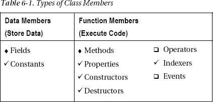

### 成员修饰符的顺序

之前，您看到了字段和方法的声明可以包含修饰符，如`public`和`private`。在这一章中，我将讨论一些额外的修饰语。因为这些修饰语中的许多可以一起使用，所以出现的问题是，它们需要什么样的顺序？

类成员声明语句由以下部分组成:核心声明、一组可选的*修饰符*，以及一组可选的*属性*。用于描述该结构的语法如下。方括号表示包含的组件集是可选的。

`   [ attributes ] [ modifiers ]  CoreDeclaration`

可选组件如下:

> *   modifier
>     *   If there is a modifier, it must be placed before the core declaration.
>     *   If there are multiple modifiers, they can be arranged arbitrarily.
> *   attribute
>     *   If there is an attribute, it must be placed before the modifier and the core declaration.
>     *   If there are multiple attributes, you can sort them arbitrarily.

到目前为止，我只解释了两个修饰符:`public`和`private`。我会在[第 24 章](24.html)中讲述属性。例如，`public`和`static`都是修饰符，可以一起用来修改某些声明。因为它们都是修饰语，所以可以按任意顺序排列。下面两行在语义上是等价的:

`   public static int MaxVal;

   static public int MaxVal;`

[图 6-1](#fig_6_1) 显示了应用到目前为止显示的成员类型的组件顺序:字段和方法。注意，字段的类型和方法的返回类型不是修饰符——它们是核心声明的一部分。

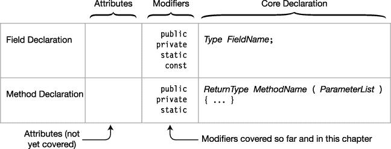

***图 6-1。**属性、修饰符和核心声明的顺序*

### 实例类成员

类成员可以与类的一个实例相关联，也可以与整个类相关联；也就是说，应用于该类的所有实例。默认情况下，成员与实例相关联。你可以认为一个类的每个实例都有自己的每个类成员的副本。这些成员被称为*实例成员*。

对一个实例字段值的更改不会影响任何其他实例中成员的值。到目前为止，您看到的字段和方法都是实例字段和实例方法。

例如，下面的代码声明了一个类`D`，带有一个整数字段`Mem1`。`Main`创建该类的两个实例。每个实例都有自己的字段`Mem1`副本。更改字段的一个实例副本的值不会影响另一个实例副本的值。[图 6-2](#fig_6_2) 显示了`D`类的两个实例。

`   class D
   {
      public int Mem1;
   }

   class Program
   {
      static void Main()
      {
         D d1 = new D();
         D d2 = new D();
         d1.Mem1 = 10; d2.Mem1 = 28;

         Console.WriteLine("d1 = {0}, d2 = {1}", d1.Mem1, d2.Mem1);
      }
   }`

该代码产生以下输出:

* * *

`d1 = 10, d2 = 28`

* * *

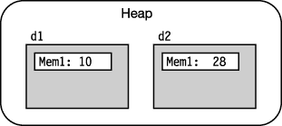

***图 6-2。**D 类的每个实例都有自己的 Mem1 字段副本。*

### 静态字段

除了实例字段，类还可以有所谓的静态字段。

> *   The static field *is shared* by all instances of *class* , and all instances access the same memory location. Therefore, if one instance changes the value of the memory location, all instances can see the change.
> *   Use the `static` modifier to declare a static field as follows:

`   class D
   {
      int Mem1;                     // Instance field
      <ins>static</ins> int Mem2;              // Static field
        ↑
   }  Keyword`

例如，图 6-3 中[左边的代码用静态字段`Mem2`和实例字段`Mem1`声明了类`D`。`Main`定义了类`D`的两个实例。该图显示静态字段`Mem2`与任何实例的存储器分开存储。实例内部的灰色字段表示这样一个事实，即从实例方法内部，访问或更新静态字段的语法与访问任何其他成员字段的语法相同。](#fig_6_3)

> *   Because `Mem2` is static, two instances of class `D` share a `Mem2` field. If `Mem2` is changed, the change can be seen from both.
> *   Member `Mem1` does not declare `static`, so each instance has its own different copy.

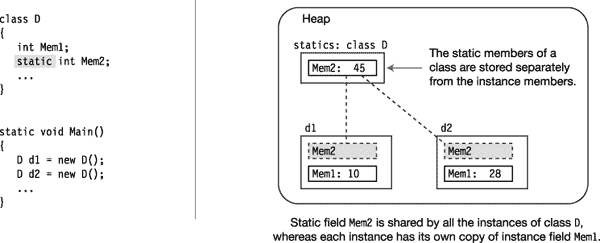

***图 6-3。**静态和实例数据成员*

### 从类外访问静态成员

在前一章中，您看到了点语法符号用于从类外部访问`public`实例成员。点语法表示法包括列出实例名，后跟一个点，再后跟成员名。

像实例成员一样，静态成员也可以使用点语法符号从类外部访问。但是由于没有实例，所以必须使用*类名*，如下所示:

`   Class name
    ↓
    D.Mem2 = 5;            // Accessing the static class member
       ↑
     Member name`

#### 静态字段的例子

以下代码通过添加两个方法扩展了前面的类`D`:

> *   One method sets the values of two data members.
> *   Another method displays the values of two data members.

`   class D {
      int        Mem1;
      static int Mem2;

      public void SetVars(int v1, int v2) // Set the values
      {  Mem1 = v1; Mem2 = v2; }
                      ↑ Access as if it were an instance field

      public void Display( string str )
      {  Console.WriteLine("{0}: Mem1= {1}, Mem2= {2}", str, Mem1, Mem2); }
   }
                                                  Access as if it were an instance field
   class Program {
      static void Main()
      {
         D d1 = new D(), d2 = new D();   // Create two instances.

         d1.SetVars(2, 4);               // Set d1's values.
         d1.Display("d1");

         d2.SetVars(15, 17);             // Set d2's values.
         d2.Display("d2");

         d1.Display("d1");       // Display d1 again and notice that the
      }                          // value of static member Mem2 has changed!
   }`

这段代码产生以下输出:

* * *

`d1: Mem1= 2, Mem2= 4
d2: Mem1= 15, Mem2= 17
d1: Mem1= 2, Mem2= 17`

* * *

#### 静态成员的生存期

静态成员的生存期不同于实例成员的生存期。

> *   As you saw before, instance members appear when the instance is created and disappear when the instance is destroyed. however
> *   Static members exist and are accessible *, even if there is no instance of the class* .

[图 6-4](#fig_6_4) 展示了一个类`D`，带有一个静态字段`Mem2`。尽管`Main`没有定义该类的任何实例，但它将值`5`赋给静态字段，并毫无问题地打印出来。

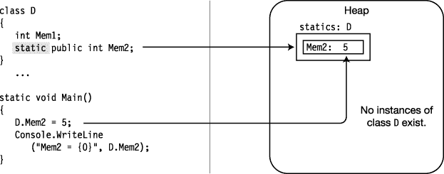

***图 6-4。**没有类实例的静态字段仍然可以被赋值和读取，因为字段与类相关联，而不是与实例相关联。*

图 6-4 中的代码产生以下输出:

* * *

`Mem2 = 5`

* * *

 **注意**即使没有类的实例，静态成员仍然存在。如果一个静态字段有一个初始化器，那么这个字段在使用这个类的任何静态字段之前被初始化，但是不一定在程序执行的开始。

### 静态函数成员

除了静态字段，还有静态函数成员。

> *   Static function members, like static fields, are independent of any class instance. Even if there is no instance of the class, you can still call static methods.
> *   Static function members cannot access instance members. However, they can access other static members.

例如，以下类包含一个静态字段和一个静态方法。注意，静态方法的主体访问静态字段。

`    class X
    {
       static public int A;                               // Static field
       static public void PrintValA()                     // Static method
       {
          Console.WriteLine("Value of A: {0}", A);
    }                                          ↑
  }                                        Accessing the static field`

以下代码使用前面代码中定义的类`X`:

`   class Program
   {
      static void Main()
      {
         X.A = 10;               // Use dot-syntax notation
         X.PrintValA();          // Use dot-syntax notation
      }  ↑
   }  Class name`

该代码产生以下输出:

* * *

`Value of A: 10`

* * *

[图 6-5](#fig_6_5) 说明了前面的代码。

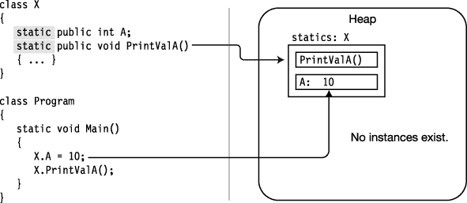

***图 6-5。**一个类的静态方法可以被调用，即使这个类没有实例。*

### 其他静态类成员类型

在[表 6-2](#tab_6_2) 中显示了可以声明`static`的类成员类型。其他成员类型不能声明为`static`。

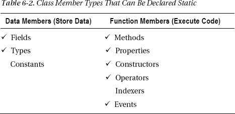

### 成员常数

成员常量类似于上一章介绍的局部常量，只是它们是在类声明中声明的，而不是在方法中声明的，如下例所示:

`   class MyClass
   {
       const int IntVal <ins>= 100</ins>;              // Defines a constant of type int
              ↑           ↑                // with a value of 100.
   }         Type        Initializer

   const double PI = 3.1416;               // Error: cannot be declared outside a type
                                           // declaration`

与局部常量一样，用于初始化成员常量的值必须在编译时可计算，并且通常是预定义的简单类型之一或由它们组成的表达式。

`   class MyClass
   {
      const int IntVal1 = 100;
      const int IntVal2 = 2 * IntVal1;  // Fine, since the value of IntVal1
   }                                    // was set in the previous line.`

与局部常数一样，不能在声明成员常数后将其赋值。

`   class MyClass
   {
      const int IntVal;                // Error: initialization is required.
      IntVal = 100;                    // Error: assignment is not allowed.
   }`

 **注意**与 C 和 C++不同，C# 中没有全局常量。每个常数都必须在类型中声明。

### 常数如静力学

然而，成员常量比局部常量更有趣，因为它们的行为类似于静态值。它们对该类的每个实例都是“可见”的，即使没有该类的实例，它们也是可用的。与实际的静态不同，常量没有自己的存储位置，在编译时由编译器以类似于 C 和 C++中的`#define`值的方式替换。

例如，下面的代码用常量字段`PI`声明了类`X`。`Main`没有创建`X`的任何实例，但是它可以使用字段`PI`并打印它的值。[图 6-6](#fig_6_6) 说明了代码。

`   class X
   {
      public const double PI = 3.1416;
   }

   class Program
   {
      static void Main()
      {
         Console.WriteLine("pi = {0}", X.PI);    // Use static field PI
      }
   }`

该代码产生以下输出:

* * *

`pi = 3.1416`

* * *

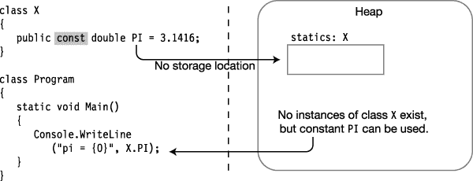

***图 6-6。**常量字段的行为类似静态字段，但在内存中没有存储位置。*

尽管常量成员的行为类似于静态，但是您不能将常量声明为`static`，如下面的代码行所示。

`   static const double PI = 3.14;     // Error: can't declare a constant as static`

### 属性

属性是表示类或类实例中数据项的成员。使用属性看起来非常像对字段进行写入或读取。语法是一样的。

例如，下面的代码展示了一个名为`MyClass`的类的用法，它既有一个公共字段又有一个公共属性。从它们的用法来看，你无法区分它们。

`   MyClass mc = new MyClass();

   mc.MyField    = 5;                               // Assigning to a field
   mc.MyProperty = 10;                              // Assigning to a property

   WriteLine("{0} {1}", mc.MyField, mc.MyProperty); // Read field and property`

像字段一样，属性具有以下特征:

> *   Is a named class member.
> *   There is one type of it.
> *   It can be assigned to and read from.

然而，与字段不同，属性是函数成员，因此:

> *   It does not necessarily allocate memory for data storage.
> *   It executes the code.

一个*属性*是两个匹配方法的命名集合，称为*访问器*。

> *   `set` Accessors are used to assign values to attributes.
> 
> `get`

[图 6-7](#fig_6_7) 显示了一个属性的表示。左边的代码显示了声明类型为`int`的名为`MyValue`的属性的语法。右边的图像显示了属性在文本中是如何可视化表示的。请注意，访问器显示在后面，因为，您很快就会看到，它们不是可直接调用的。

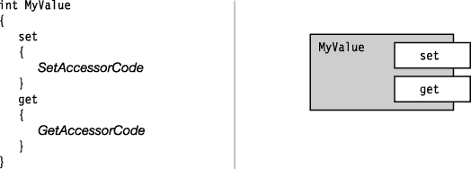

***图 6-7。**一个名为 MyValue 的示例属性，类型为 int*

#### 属性声明和访问器

`set`和`get`访问器有预定义的语法和语义。您可以将`set`访问器视为一个具有单个参数的方法，该参数“设置”属性值。`get`访问器没有参数，返回属性值。

> *   `set` The accessor always has the following contents:
>     *   A single implicit value parameter named `value`, and the property
>     *   The return type of is the same `void`
> *   `get` The accessor always has the following contents:
>     *   No parameter
>     *   An and attribute
> 
> 的返回类型相同

[图 6-8](#fig_6_8) 显示了属性声明的结构。注意在图中，两个访问器声明都没有*显式*参数或返回类型声明。他们不需要它们，因为它们是*中隐含*的财产类型。

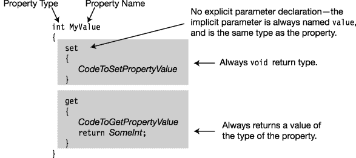

***图 6-8。**属性声明的语法和结构*

`set`访问器中的隐式参数`value`是一个正常值参数。像其他值参数一样，您可以使用它将数据发送到方法体中，或者在本例中，发送到访问器块中。一旦进入程序块，就可以像普通变量一样使用`value`，包括给它赋值。

关于访问器的其他要点如下:

> *   All paths implemented through `get` accessor *must* contain a `return` statement that returns the attribute type value.
> *   `set` and `get` accessors can be declared in any order, and there are no other methods except these two accessors on an attribute.

#### 一个属性的例子

下面的代码展示了一个名为`C1`的类的声明示例，它包含一个名为`MyValue`的属性。

> *   Note that the attribute itself does not have any storage. Instead, the accessor decides how to handle the incoming data and the data that should be sent out. In this case, the attribute is stored in a field named `TheRealValue`.
> *   `set` The accessor gets its input parameter `value` and assigns the value to the field `TheRealValue`.
> *   `get` The accessor only returns the value of field `TheRealValue`.

[图 6-9](#fig_6_9) 说明了代码。

`   class C1
   {
      private int TheRealValue;               // Field: memory allocated

      public int MyValue                      // Property: no memory allocated
      {
         set
         {
            TheRealValue = value;
         }

         get
         {
            return TheRealValue;
         }
      }
   }` 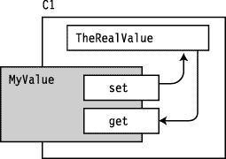

***图 6-9。**属性访问器经常使用字段进行存储*

#### 使用属性

如前所述，您可以像访问字段一样读写属性。访问器是隐式调用的。

> *   To write an attribute, use the attribute name to the left of the assignment statement.
> *   To read an attribute, use the name of the attribute in the expression.

例如，下面的代码包含一个名为`MyValue`的属性声明的概要。您只使用属性名写入和读取属性，就像它是一个字段名一样。

`   int MyValue             // Property declaration
   {
      set{ ... }
      get{ ... }
   }
   ...
   Property name
      ↓
   MyValue = 5;            // Assignment: the set method is implicitly called.
   z = MyValue;            // Expression: the get method is implicitly called.
          ↑
   Property name`

根据您是写入属性还是读取属性，隐式调用适当的访问器。您不能显式调用访问器。尝试这样做会产生编译错误。

`   y = MyValue.get();      // Error! Can't explicitly call get accessor.
   MyValue.set(5);         // Error! Can't explicitly call set accessor.`

#### 属性和关联字段

一个属性通常与一个字段相关联，如前两节所示。一种常见的做法是通过声明字段`private`和声明属性`public`将字段封装在类中，以提供从类外部对字段的受控访问。与资产相关联的字段被称为*后台字段*或*后台存储*。

例如，以下代码使用公共属性`MyValue`对私有字段`TheRealValue`进行受控访问:

`   class C1
   {
      private int TheRealValue = 10;   // Backing Field: memory allocated
      public  int MyValue              // Property: no memory allocated
      {
         set{ TheRealValue = value; }  // Sets the value of field TheRealValue
         get{ return TheRealValue; }   // Gets the value of the field
      }
   }

   class Program
   {
      static void Main()
   {
                                      Read from the property as if it were a field.
         C1 c = new C1();                   <ins>    ↓    </ins>
         Console.WriteLine("MyValue:  {0}", c.MyValue);

         c.MyValue = 20;        ← Use assignment to set the value of a property.
         Console.WriteLine("MyValue:  {0}", c.MyValue);
      }
   }`

有几种命名属性及其支持字段的惯例。一个惯例是对两个名称使用相同的字符串，但是对字段使用*骆驼大小写*，对属性使用*帕斯卡大小写*。(Camel case 描述了一个复合词标识符，其中每个词的第一个字母，除了第一个，都是大写的，其余的字母都是小写的。Pascal 大小写是复合词中每个单词的第一个字母大写的地方。)虽然这违反了一般规则，即不同的标识符只有大小写不同是不好的做法，但它的优点是以一种有意义的方式将两个标识符联系在一起。

另一个约定是对属性使用 Pascal 大小写，然后对字段使用相同标识符的 camel 大小写版本，前面带下划线。

以下代码显示了这两种约定:

`   private int firstField;                  // Camel casing
   public  int FirstField                   // Pascal casing
   {
      get { return firstField; }
      set { firstField = value; }
   }

   private int _secondField;                // Underscore and camel casing
   public  int SecondField
   {
      get { return _secondField; }
      set { _secondField = value; }
   }`

#### 执行其他计算

属性访问器不仅限于从关联的后台字段来回传递值；`get`和`set`访问器可以执行任何计算，或者不执行任何计算。唯一需要的动作*是`get`访问器返回一个属性类型的值。*

例如，下面的例子展示了一个有效(但可能没用)的属性，当调用它的`get`访问器时，它只返回值`5`。当调用`set`访问器时，它不做任何事情。隐式参数`value`的值被忽略。

`   public int Useless
   {
      set{  /* I'm not setting anything.                */ }
      get
      {     /* I'm always just returning the value 5.   */
         return 5;
      }
   }`

下面的代码展示了一个更实际、更有用的属性，其中`set`访问器在设置关联字段之前执行过滤。`set`访问器将字段`TheRealValue`设置为输入值，除非输入值大于 100。在这种情况下，它将`TheRealValue`设置为`100`。

`   int TheRealValue = 10;                     // The field
   int MyValue                                // The property
   {
      set                                     // Sets the value of the field
      {
         TheRealValue = value > 100           // but makes sure it's not > 100
                           ? 100
                           : value;
      }
      get                                     // Gets the value of the field
      {
         return TheRealValue;
      }
   }`

 **注意**在前面的代码示例中，等号和语句结尾之间的语法可能看起来有些奇怪。该表达式使用了*条件运算符*，我将在第 8 章的[中详细介绍。条件运算符是一个三元运算符，计算问号前面的表达式，如果表达式计算结果为`true`，则返回问号后面的表达式。否则，它返回冒号后的表达式。有些人会在这里使用一个`if...then`语句，但是条件操作符更合适，当我们在第 8 章](08.html)中详细查看这两个构造时，你会看到。

#### 只读和只写属性

通过省略属性的声明，可以不定义属性的一个或另一个(但不是两个)访问器。

> *   The attribute of only one `get` accessor is called *read-only* attribute. Read-only property is a safe way to transfer data items from a class or class instance, and does not allow excessive access.
> *   Only the attribute of `set` accessor is called *, and only the attribute of* is written. Write-only property is a safe way to transfer data items from outside the class to the class without excessive access.
> *   At least one of the two accessors must be defined, or the compiler will generate an error message.

[图 6-10](#fig_6_10) 显示了只读和只写属性。

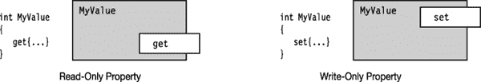

***图 6-10** 。属性可以有一个或另一个未定义的访问器。*

#### 属性与公共字段

作为首选的编码实践，属性优先于公共字段有几个原因:

> 由于属性是函数成员，而不是数据成员，它们允许你处理输入和输出，这是你不能用公共字段做的。*   You can have read-only or write-only attributes, but you can't have these characteristics of a field.*   The semantics of compiled variables and compiled attributes are different.

第二点在您释放被其他代码访问的程序集时有所暗示。例如，有时您可能想使用公共字段而不是属性，理由是如果您需要向字段中保存的数据添加处理，您总是可以在以后将字段更改为属性。这是真的，但是如果你做了那样的改变，你也将不得不重新编译任何其他访问该字段的程序集*，因为字段和属性的编译语义是不同的。另一方面，如果你将它实现为一个属性，并且仅仅改变它的*实现*，你就不需要重新编译其他访问它的程序集。*

#### 一个计算的只读属性的例子

到目前为止，在大多数示例中，属性都与一个支持字段相关联，并且`get`和`set`访问器已经引用了该字段。但是，属性不必与字段相关联。在下面的例子中，`get`访问器*计算*的返回值。

在代码中，毫不奇怪，class `RightTriangle`表示一个直角三角形。[图 6-11](#fig_6_11) 显示了只读属性`Hypotenuse`。

> *   It has two common fields, which represent the lengths of the two right-angled sides of the triangle. These fields can be written and read.
> *   The third edge is represented by the attribute `Hypotenuse`, which is read-only and its return value is based on the lengths of the other two edges. It is not stored in the field. Instead, it will calculate the correct values for the current values of `A` and `B` as needed.

`   class RightTriangle
   {
      public double A = 3;
      public double B = 4;
      public double Hypotenuse                    // Read-only property
      {
         get{ return Math.Sqrt((A*A)+(B*B)); }    // Calculate return value
      }
   }

   class Program
   {
      static void Main()
      {
         RightTriangle c = new RightTriangle();
         Console.WriteLine("Hypotenuse:  {0}", c.Hypotenuse);
      }
   }`

该代码产生以下输出:

* * *

`Hypotenuse:  5`

* * *

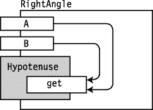

***图 6-11** 。只读属性斜边*

#### 自动实现属性

因为属性经常与后台字段相关联，C# 提供了*自动实现的属性*，或者*自动实现的属性*，这允许你只声明属性，而不声明后台字段。编译器会为您创建一个隐藏的后台字段，并自动将`get`和`set`访问器连接到该字段。

关于自动实现的属性的要点如下:

> *   You don't have to declare backup fields-the compiler allocates storage space for you according to the type of attribute.
> *   You cannot provide the bodies of accessors-they must simply be declared as semicolons. `get` serves as a simple read of the memory, and `set` serves as a simple write.
> *   You can't access background fields except through accessors. Because you can't access it in any other way, it doesn't make sense to have read-only or write-only automatically implemented properties-so they are not allowed.

下面的代码显示了自动实现的属性的示例:

`   class C1
   {                  ← No declared backing field
      public int MyValue                         // Allocates memory
      {
         set; get;
      }     ↑   ↑
   }  The bodies of the accessors are declared as semicolons.

   class Program
   {
      static void Main()
      {                        Use auto-implemented properties as regular properties.
         C1 c = new C1();                         ↓
         Console.WriteLine("MyValue:  {0}", c.MyValue);

         c.MyValue = 20;
         Console.WriteLine("MyValue:  {0}", c.MyValue);
      }
   }`

该代码产生以下输出:

* * *

`MyValue:  0
MyValue:  20`

* * *

除了方便之外，自动实现的属性允许您轻松地将属性插入到您可能想要声明公共字段的地方。

#### 静态属性

属性也可以声明为`static`。像所有静态成员一样，静态属性的访问器具有以下特征:

> *   They can't access instance members of a class-although they can be accessed by them.
> *   Whether this class has instances or not, they exist.
> *   When you access them from outside the class, you must refer to them by class name instead of instance name.

例如，下面的代码展示了一个具有名为`MyValue`的自动实现的静态属性的类。在`Main`的前三行中，属性被访问，即使没有类的实例。`Main`的最后一行调用一个实例方法，该方法从类内部的*访问属性。*

`   class Trivial
   {
      public static int MyValue { get;  set; }

      public void PrintValue()               Accessed from inside the class
      {                                                  ↓
         Console.WriteLine("Value from inside: {0}", MyValue);
      }
   }

   class Program
   {
      static void Main()                   Accessed from outside the class
      {                                       <ins>       ↓       </ins>
         Console.WriteLine("Init Value: {0}", Trivial.MyValue);
         Trivial.MyValue = 10;           ←  Accessed from outside the class
         Console.WriteLine("New Value : {0}", Trivial.MyValue);

         Trivial tr = new Trivial();
         tr.PrintValue();
      }
   }`

* * *

`Init Value: 0
New Value : 10
Value from inside: 10`

* * *

### 实例构造函数

一个*实例构造器*是一个特殊的方法，每当一个类的新实例被创建时就被执行。

> *   Constructors are used to initialize the state of class instances.
> *   If you want to create an instance of your class from outside the class, you need to declare the constructor `public`.

图 6-12 显示了一个构造函数的语法。构造函数看起来像类声明中的其他方法，但有以下例外:

> *   The name of the constructor is the same as the class name.
> *   The constructor cannot have a return value.

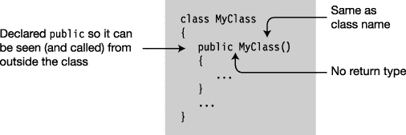

***图 6-12** 。构造函数声明*

例如，下面的类使用其构造函数来初始化其字段。在这种情况下，它有一个名为`TimeOfInstantiation`的字段，用当前日期和时间初始化。

`   class MyClass
   {
      DateTime TimeOfInstantiation;                        // Field
      ...
      public MyClass()                                     // Constructor
      {
         TimeOfInstantiation = DateTime.Now;               // Initialize field
      }
      ...
   }`

 **注意**刚刚完成了静态属性部分，仔细看看初始化`TimeOfInstantiation`的那一行。这个`DateTime`类(实际上是一个`struct`，但是你可以把它当成一个类，因为我还没有覆盖`struct` s)来自 BCL，`Now`是`DateTime`的一个*静态属性*。属性创建了一个`DateTime`类的新实例，用系统时钟的当前日期和时间初始化它，并返回一个对新`DateTime`实例的引用。

#### 带参数的构造函数

构造函数在以下方面与其他方法相似:

> *   A constructor can have parameters. The syntax of the parameter is exactly the same as other methods.
> *   A constructor can be overloaded.

当您使用一个对象创建表达式来创建一个类的新实例时，您可以使用`new`操作符，后跟该类的一个构造函数。`new`操作符使用该构造函数来创建类的实例。

例如，在下面的代码中，`Class1`有三个构造函数:一个不带参数，一个带`int`，另一个带`string`。`Main`使用每一个创建一个实例。

`   class Class1
   {
      int Id;
      string Name;

      public Class1()            { Id=28;    Name="Nemo"; }   // Constructor 0
      public Class1(int val)     { Id=val;   Name="Nemo"; }   // Constructor 1
      public Class1(String name) { Name=name;             }   // Constructor 2

      public void SoundOff()
      { Console.WriteLine("Name {0},   Id {1}", Name, Id); }
   }

   class Program
   {
      static void Main()
      {
         Class1 a = new Class1(),                     // Call constructor 0.
                b = new Class1(7),                    // Call constructor 1.
                c = new Class1("Bill");               // Call constructor 2.

         a.SoundOff();
         b.SoundOff();
         c.SoundOff();
      }
   }`

该代码产生以下输出:

* * *

`Name Nemo,   Id 28
Name Nemo,   Id 7
Name Bill,   Id 0`

* * *

#### 默认构造函数

如果在类声明中没有显式提供实例构造函数，则编译器会提供一个隐式的默认构造函数，该构造函数具有以下特征:

> *   It doesn't need parameters.
> *   It has an empty body.

如果你为一个类声明了任何构造函数*，那么编译器不会为这个类定义默认的构造函数。*

例如，以下示例中的`Class2`声明了两个构造函数。

> *   Because there is at least one explicitly defined constructor, the compiler will not create any additional constructors.
> *   In `Main`, an attempt was made to create a new instance with a constructor without parameters. Because *has no constructor with zero parameters, the compiler will generate an error message.*

`   class Class2
   {
      public Class2(int Value)    { ... }   // Constructor 0
      public Class2(String Value) { ... }   // Constructor 1
   }

   class Program
   {
      static void Main()
      {
         Class2 a = new Class2();   // Error! No constructor with 0 parameters
         ...
      }
   }`

 **注意**你可以将访问修饰符赋给实例构造函数，就像你赋给其他成员一样。您还需要声明构造函数`public`，这样您就可以从类外部创建实例。你也可以创建`private`构造函数，它不能从类外调用，但可以在类内使用，你将在下一章看到。

### 静态构造函数

构造函数也可以声明为`static`。实例构造函数初始化一个类的每个新实例，而`static`构造函数在类级别初始化项目。通常，静态构造函数初始化类的静态字段。

> *   Items of class level are initialized before referencing any static members.
>     *   Before creating any instances of the class
> *   Static constructors are similar to instance constructors in the following aspects:
>     *   The name of the static constructor must be the same as that of the class.
>     *   The constructor cannot return a value.
> *   Static constructors differ from instance constructors in the following aspects:
>     *   Static constructors use the `static` keyword in declarations.
>     *   A class can only have one static constructor and no parameters.
>     *   Static constructors cannot have accessibility modifiers.

下面是一个静态构造函数的示例。注意，它的形式与实例构造函数的形式相同，但是增加了关键字`static`。

`   class Class1
   {
      static Class1 ()
      {
         ...                // Do all the static initializations.
      }
      ...`

关于静态构造函数，您应该知道的其他重要事情如下:

> *   A class can have both static constructors and instance constructors.
> *   Like a static method, a static constructor cannot access the instance members of its class, nor can it use the `this` accessor, which we will introduce soon. Static constructors cannot be explicitly called from programs. They are automatically called by the system, at some time before any instance of the class is created.
>     *   The that precedes any static member of the reference class.

#### 静态构造函数的例子

下面的代码使用一个静态构造函数来初始化一个名为`RandomKey`、类型为`Random`的私有静态字段。`Random`是由 BCL 提供的产生随机数的类。它在`System`名称空间中。

`   class RandomNumberClass
   {
      private static Random RandomKey;         // Private static field

      static RandomNumberClass()               // Static constructor
      {
         RandomKey = new Random();             // Initialize RandomKey
      }

      public int GetRandomNumber()
      {
         return RandomKey.Next();
      }
   }

   class Program
   {
      static void Main()
      {
         RandomNumberClass a = new RandomNumberClass();
         RandomNumberClass b = new RandomNumberClass();

         Console.WriteLine("Next Random #: {0}", a.GetRandomNumber());
         Console.WriteLine("Next Random #: {0}", b.GetRandomNumber());
      }
   }`

该代码的一次执行产生了以下输出:

* * *

`Next Random #: 47857058
Next Random #: 1124842041`

* * *

### 对象初始化器

到目前为止，在本文中，您已经看到对象创建表达式由关键字`new`后跟一个类构造函数及其参数列表组成。一个*对象初始化器*通过在表达式末尾放置一个成员初始化列表来扩展语法。对象初始化器允许你在创建一个新的对象实例时设置字段和属性的值。

语法有两种形式，如下所示。一种形式包含构造函数的参数列表，另一种不包含。注意，第一种形式甚至没有使用圆括号来括住参数列表。

`                                                  Object initializer
                         <ins>↓</ins>    new *TypeName*          { *FieldOrProp* = *InitExpr*, *FieldOrProp* = *InitExpr*, ...}
   new *TypeName*(*ArgList*) { <ins>*FieldOrProp = InitExpr*</ins>, <ins>*FieldOrProp = InitExpr*</ins>, ...}
                                       ↑                      ↑
                                  Member initializer            Member initializer`

例如，对于一个名为`Point`的类，它有两个公共整数字段`X`和`Y`，您可以使用下面的表达式来创建一个新的对象:

`   new Point { <ins>X = 5</ins>, <ins>Y = 6</ins> };
                 ↑      ↑
                Init X    Init Y`

关于对象初始值设定项，需要了解的重要事项如下:

> *   The code that creates the object must be able to access the fields and properties being initialized. For example, in the previous code, `X` and `Y` must be `public`.
> *   Initialization occurs after the completion of the *constructor, so these values may have been set in the constructor and then reset to the same or different values in the object initialization.*

下面的代码展示了一个使用对象初始化器的例子。在`Main`中，`pt1`只调用构造函数，它设置它的两个字段的值。然而，对于`pt2`，构造函数将字段的值设置为 1 和`2`，初始化器将它们更改为`5`和`6`。

`   public class Point
   {
      public int X = 1;
      public int Y = 2;
   }

   class Program
   {
      static void Main( )
      {                            Object initializer
         Point pt1 = new Point();<ins>       ↓       </ins>
         Point pt2 = new Point   { X = 5, Y = 6 };
         Console.WriteLine("pt1: {0}, {1}", pt1.X, pt1.Y);
         Console.WriteLine("pt2: {0}, {1}", pt2.X, pt2.Y);
      }
   }`

该代码产生以下输出:

* * *

`pt1: 1, 2
pt2: 5, 6`

* * *

### 析构函数

析构函数在不再引用某个类的实例后执行清理或释放非托管资源所需的操作。非托管资源是使用 Win32 API 获得的文件句柄或非托管内存块。这些东西不是你用就能得到的 .NET 资源，所以如果您坚持使用 .NET 类，你不需要为你的类写析构函数。出于这个原因，我打算把对析构函数的描述留到[第 25 章](25.html)。

### 只读修饰符

可以用`readonly`修饰符声明一个字段。其效果类似于将字段声明为`const`，因为一旦设置了值，就不能更改。

> *   Although the `const` field can only be initialized in the declaration statement of the field, the `readonly` field can be set in any of the following places:
>     *   Field declaration statement-similar to `const`.
>     *   The constructor of any class. If it is a `static` field, it must be completed in the `static` constructor.
> *   Although the value of `const` field must be determined at compile time, the value of `readonly` field can be determined at run time. This extra freedom allows you to set different values in different environments or in different constructors!
> *   Unlike `const`, it is always like a static one. Here is the real situation of a `readonly` field:
>     *   It can be an instance field or a static field.
>     *   It has a storage location in memory.

例如，下面的代码声明了一个名为`Shape`的类，有两个`readonly`字段。

> *   The field `PI` is initialized in its declaration.
> *   The field `NumberOfSides` is set to 3 or 4, depending on which constructor is called.

`   class Shape
   {  Keyword           Initialized
          ↓           <ins>     ↓     </ins>
      readonly double PI = 3.1416;
      <ins>readonly</ins> int    <ins>NumberOfSides</ins>;
          ↑                ↑
       Keyword            Not initialized

      public Shape(double side1, double side2)                  // Constructor
      {
         // Shape is a rectangle
         <ins>NumberOfSides</ins> = 4;
               ↑
         ... Set in constructor
      }

      public Shape(double side1, double side2, double side3)    // Constructor
      {
         // Shape is a triangle
         <ins>NumberOfSides</ins> = 3;
                ↑
         ... Set in constructor
      }
   }`

### 这个关键字

在类中使用的关键字`this`是对当前实例的引用。它只能在下列类成员的*块*中使用:

> *   Instance constructor.
> *   Example tactics.
> *   And instance accessors for property indexers. (The indexer will be introduced in the next section. )

显然，由于静态成员不是实例的一部分，所以不能在任何静态函数成员的代码中使用`this`关键字。相反，它用于以下用途:

> *   Classification members and local variables or parameters
> 
> *   As an actual parameter

例如，下面的代码声明了类`MyClass`，带有一个`int`字段和一个采用单个`int`参数的方法。方法比较参数和字段的值，并返回较大的值。唯一复杂的因素是字段和形参的名称是相同的:`Var1`。通过使用`this`访问关键字来引用字段，这两个名称在方法内部是有区别的。

`   class MyClass {
      int Var1 = 10;
           ↑    Both are called “Var1”    ↓
      public int ReturnMaxSum(int Var1)
      {       Parameter     Field
                 ↓     <ins>   ↓    </ins>
         return Var1 > this.Var1
                     ? Var1                 // Parameter
                     : this.Var1;           // Field
      }
   }

   class Program {
      static void Main()
      {
         MyClass mc = new MyClass();

         Console.WriteLine("Max: {0}", mc.ReturnMaxSum(30));
         Console.WriteLine("Max: {0}", mc.ReturnMaxSum(5));
      }
   }`

该代码产生以下输出:

* * *

`Max: 30
Max: 10`

* * *

### 索引器

假设你要定义类`Employee`，有三个类型为`string`的字段(如图 6-13 中的[所示)。然后，您可以使用它们的名称来访问这些字段，如`Main`中的代码所示。](#fig_6_13)

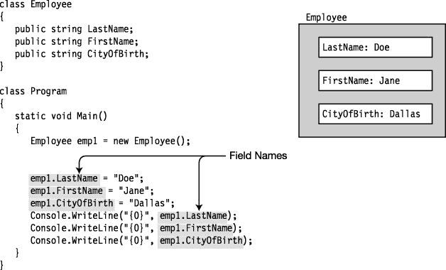

***图 6-13** 。没有索引器的简单类*

然而，有时候用索引访问它们会很方便，就好像实例是一个字段数组一样。这正是*索引器*允许你做的事情。如果你要为类`Employee`写一个索引器，方法`Main`可能看起来像[图 6-14](#fig_6_14) 中的代码。注意，索引器不使用点语法符号，而是使用*索引符号*，它由方括号之间的索引组成。

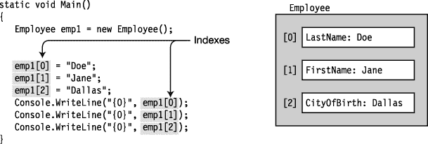

***图 6-14** 。使用索引字段*

#### 什么是索引器？

索引器是一对`get`和`set`访问器，类似于属性的访问器。[图 6-15](#fig_6_15) 显示了一个可以获取和设置`string`类型值的类的索引器的表示。

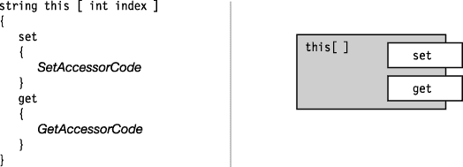

***图 6-15** 。索引器的表示*

#### 索引器和属性

索引器和属性在很多方面都很相似。

> *   Like the property, the indexer does not allocate memory for storage.
> *   Indexers and properties are mainly used to provide access to *and other* data members. These data members are associated with indexers and properties, which provide get and set access.
>     *   A *attribute* usually represents a *single* data member.
>     *   A *indexer* usually represents *multiple* data members.

 **注意**你可以把一个*索引器*想象成一个*属性*，它提供对类的多个数据成员*的获取和设置访问。您可以通过提供索引来选择许多可能的数据成员中的哪一个，索引本身可以是任何类型，而不仅仅是数字。*

关于索引器，您还应该知道以下几点:

> *   Like properties, indexers can have one or two accessors.
> *   Indexers are always instance members; Therefore, the indexer cannot be declared as `static`.
> *   Like attributes, the code that implements `get` and `set` accessors need not be associated with any fields or attributes. The code can do anything, or nothing, as long as the `get` accessor returns a value of a specified type.

#### 声明一个索引器

声明索引器的语法如下所示。请注意以下关于索引器的内容:

> *   An indexer *has no name* . The name is replaced by the keyword `this`.
> *   The parameter table is between the brackets in *.*
> *   There must be at least one parameter declaration in the parameter list.

`             Keyword     Parameter list
                ↓   <ins>        ↓          </ins>
   ReturnType this [ *Type param1*, ... ]
   {               ↑                  ↑
      get     Square bracket   Square bracket
      {
            ...
      }
      set
      {
            ...
      }
   }`

声明索引器类似于声明属性。[图 6-16](#fig_6_16) 显示了句法的异同。

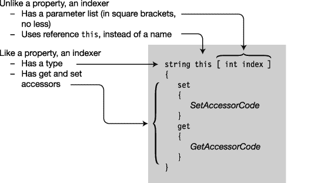

***图 6-16** 。比较索引器声明和属性声明*

#### 索引器设置访问器

当索引器是赋值的目标时，`set`访问器被调用并接收两项数据，如下所示:

> *   An implicit parameter named `value` that holds the data to be stored.
> *   One or more index parameters that indicate where it should be stored.

`    emp[0] = "Doe";
        ↑      ↑
       Index   Value
    Parameter`

您在`set`访问器中的代码必须检查索引参数，确定数据应该存储在哪里，然后存储它。

[图 6-17](#fig_6_17) 显示了`set`访问器的语法和含义。图的左侧显示了访问器声明的实际语法。右侧显示了访问器的语义，如果它是使用普通方法的语法编写的。右图显示了`set`访问器具有以下语义:

> *   It has a `void` return type.
> *   Use the same parameter list as in the indexer declaration.
> *   It has an implicit value parameter named `value`, which is of the same type as the indexer.

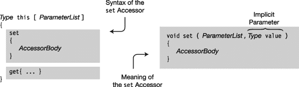

***图 6-17** 。set 访问器声明的语法和含义*

#### 索引器获取访问器

当索引器用于检索值时，使用一个或多个索引参数调用`get`访问器。索引参数表示要检索的值。

`   string s = emp[0];
                  ↑
              Index parameter`

`get`访问器主体中的代码必须检查索引参数，确定它们代表哪个字段，并返回该字段的值。

[图 6-18](#fig_6_18) 显示了`get`访问器的语法和含义。图的左侧显示了访问器声明的实际语法。右侧显示了访问器的语义，如果它是使用普通方法的语法编写的。`get`访问器的语义如下:

> *   It is the same as the parameter list in the indexer declaration.

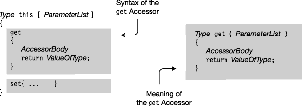

***图 6-18** 。get 访问器声明的语法和含义*

#### 关于索引器的更多信息

与属性一样，`get`和`set`访问器不能被显式调用。相反，当索引器用于值的表达式时，会自动调用`get`访问器。当用赋值语句给索引器赋值时，会自动调用`set`访问器。

当“调用”索引器时，参数在方括号之间提供。

`     Index   Value
       ↓      ↓
   emp[0] = "Doe";                               // Calls set accessor
   string NewName = emp[0];                      // Calls get accessor
                        ↑
                      Index`

#### 为雇员示例声明索引器

下面的代码为前面的例子声明了一个索引器:class `Employee`。

> *   The indexer must read and write the value of type `string`, so `string` must be declared as the type of indexer. It must be declared as `public` so that it can be accessed from outside the class.
> *   The three fields in the example are arbitrarily indexed as integers 0 to 2, so the parameter between square brackets (called `index` in this example) must be of type `int`.
> *   In the body of the `set` accessor, the code determines which field the index refers to and assigns the value of the implicit variable `value` to it. In the body of the `get` accessor, the code determines which field the index refers to and returns the value of that field.

`   class Employee
   {
      public string LastName;                     // Call this field 0.
      public string FirstName;                    // Call this field 1.
      public string CityOfBirth;                  // Call this field 2.

      public string this[int index]               // Indexer declaration
      {
         set                                      // Set accessor declaration
         {
            switch (index) {
               case 0: LastName = value;
                  break;
               case 1: FirstName = value;
                  break;
               case 2: CityOfBirth = value;
                  break;

               default:                           // (Exceptions in Ch. 11)
                  throw new ArgumentOutOfRangeException("index");
            }
         }

         get                                      // Get accessor declaration
         {
            switch (index) {
               case 0: return LastName;
               case 1: return FirstName;
               case 2: return CityOfBirth;

               default:                           // (Exceptions in Ch. 11)
                  throw new ArgumentOutOfRangeException("index");
            }
         }
      }
   }`

#### 另一个索引器例子

以下是索引类`Class1`的两个`int`字段的附加示例:

`   class Class1
   {
      int Temp0;                         // Private field
      int Temp1;                         // Private field
      public int this [ int index ]      // The indexer
      {
         get
         {
            return ( 0 == index )        // Return value of either Temp0 or Temp1
                        ? Temp0
                        : Temp1;
         }

         set
         {
            if( 0 == index )
               Temp0 = value;            // Note the implicit variable "value".
            else
               Temp1 = value;            // Note the implicit variable "value".
         }
      }
   }

   class Example
   {
      static void Main()
      {
         Class1 a = new Class1();

         Console.WriteLine("Values -- T0: {0},  T1: {1}", a[0], a[1]);
         a[0] = 15;
         a[1] = 20;
         Console.WriteLine("Values -- T0: {0}, T1: {1}", a[0], a[1]);
      }
   }`

该代码产生以下输出:

* * *

`Values -- T0: 0,  T1: 0
Values -- T0: 15, T1: 20`

* * *

#### 索引器重载

一个类可以有任意数量的索引器，只要参数列表是不同的；分度器*类型*不同是不够的。这被称为*索引器重载*，因为所有索引器都有相同的“名字”——`this`访问引用。

例如，下面的类有三个索引器:两个类型为`string`，一个类型为`int`。在两个`string`类型的索引器中，一个有一个`int`参数，另一个有两个`int`参数。

`   class MyClass
   {
      public string this [ int index ]
      {
         get { ... }
         set { ... }
      }

      public string this [ int index1, int index2 ]
      {
         get { ... }
         set { ... }
      }

      public int this [ float index1 ]
      {
         get { ... }
         set { ... }
      }

      ...
   }`

 **注意**记住一个类的重载索引器必须有不同的参数列表。

### 访问器上的访问修饰符

在这一章中，你已经看到了两种类型的函数成员有`get`和`set`访问器:属性和索引器。默认情况下，成员的两个访问者与成员本身具有相同的访问级别。也就是说，如果一个属性的访问级别是`public`，那么它的两个访问器具有相同的访问级别。索引器也是如此。

但是，您可以为这两个访问者分配不同的访问级别。例如，下面的代码展示了声明私有`set`访问器和公共`get`访问器的一个常见且重要的范例。`get`是公共的，因为属性的访问级别是公共的。

请注意，在这段代码中，虽然可以从类外部读取属性，但它只能从类内部设置，在本例中是由构造函数设置的。这是封装的一个重要工具。

`   class Person     Accessors with different access levels
   {                        ↓   <ins>     ↓     </ins>
      public string Name { get; private set; }
      public Person( string name )
      {
         Name = name;
      }
   }

   class Program
   {
      static public void Main( )
      {
         Person p = new Person( "Capt. Ernest Evans" );
         Console.WriteLine( "Person's name is {0}", p.Name );
      }
   }`

该代码产生以下输出:

* * *

`Person's name is Capt. Ernest Evans`

* * *

对于访问者的访问修饰符有一些限制。最重要的如下:

> *   Only when a member (attribute or indexer) has both `get` accessors and `set` accessors can accessors have access modifiers.
> *   Although both accessors must exist, only one of them can have access modifiers.
> *   The access modifier of the accessor must be *stricter than the access level of the member* .

[图 6-19](#fig_6_19) 显示了访问级别的层次结构。在图表中，访问者的访问级别必须严格低于成员的访问级别。

例如，如果一个属性的访问级别为`public`，那么您可以将图表上四个较低的访问级别中的任何一个授予其中一个访问者。但是如果属性的访问级别是`protected`，那么您可以在其中一个访问器上使用的唯一访问修饰符是`private`。

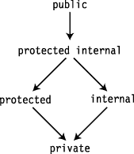

***图 6-19** 。严格限制访问器级别的层次结构*

### 分部类和分部类型

一个类的声明可以在几个分部类声明中划分。

> *   Each partial classes declaration contains declarations of some class members.
> *   The partial classes declaration of a class can be in the same file or in different files.

与单个关键字`class`相比，每个部分声明必须标记为`partial class`。除了添加了类型修饰符`partial`，分部类的声明看起来和普通类的声明一样。

`   Type modifier
        ↓
     partial class MyPartClass    // Same class name as following
     {
        member1 declaration
        member2 declaration
           ...
     }

   Type modifier
        ↓
     partial class MyPartClass    // Same class name as preceding
     {
        member3 declaration
        member4 declaration
           ...
     }`

 **注意**类型修饰符`partial`不是一个关键字，所以在其他情况下你可以在你的程序中使用它作为标识符。但是当用在关键字`class`、`struct`或`interface`之前时，它表示使用了分部类型。

例如，[图 6-20](#fig_6_20) 左边的方框代表一个带有类声明的文件。图中右边的方框表示被分成两个文件的同一个类声明。

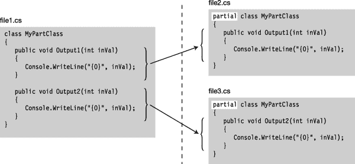

***图 6-20** 。使用分部类型的类拆分*

组成一个类的所有分部类声明必须一起编译。使用分部类声明的类与所有类成员都在单个类声明体中声明的意义相同。

Visual Studio 在其标准 Windows 程序模板中使用此功能。当从标准模板创建 ASP.NET 项目、Windows 窗体项目或 Windows Presentation Foundation(WPF)项目时，这些模板会为每个网页、窗体或 WPF 窗口创建两个类文件。在 ASP.NET 或 Windows 窗体的情况下，以下是正确的:

> *   A file contains a partial classes containing code generated by Visual Studio, which declares the components on the page. You should not modify the partial classes in this file, because when you modify the component on the page, it will be regenerated by Visual Studio.
> *   The other file contains the partial classes that you use to realize the appearance and behavior of the page or form component.

除了分部类之外，还可以创建其他两种分部类型，如下所示:

> *   Division structure. (The structure is included in Chapter 10 of [. )](10.html)
> *   Partial interface. (Interface is included in Chapter 15 [. )](15.html)

### 分部分项方法

分部方法是在分部类的不同部分声明的方法。分部方法的不同部分可以在分部类的不同部分中声明，也可以在同一部分中声明。分部方法的两个部分如下:

> *   Define partial method declaration
>     *   Lists the signature and return types.
>     *   The implementation part of the declaration syntax contains only one semicolon.
> *   Implementing partial method declarations
>     *   Lists the signature and return types.
>     *   Implementation is in normal format, as you know, it is a statement block.

关于分部方法，需要了解的重要事项如下:

> *   The definition and implementation declaration must match in signature and return type. The signature and return type have the following characteristics:
>     *   The return type must be `void`.
>     *   Signature cannot contain access modifier, *makes partial method implicitly private* .
>     *   Parameter table cannot contain `out` parameter.
>     *   Context `partial` must be included in the definition and implementation declaration before keyword `void`.
> *   There can be a method to define a division, but no method to implement a division. In this case, the compiler removes the declaration and any calls to the method inside the class. If there is no division method defined, there can be no division method implemented.

下面的代码展示了一个名为`PrintSum`的分部方法的例子。

> *   `PrintSum` Declared in different parts of partial classes `MyClass`: the definition statement is in the first part and the implementation statement is in the second part. The implementation prints out the sum of its two integer parameters.
> *   Because partial methods are implicitly private, `PrintSum` cannot be called from outside the class. Method `Add` is a public method that calls `PrintSum`.
> *   `Main` Create an object of class `MyClass` and call public method `Add`, which calls method `PrintSum` to print out the sum of input parameters.

`   partial class MyClass
   {        Must be void
                ↓
      partial void PrintSum(int x, int y);      // Defining partial method
        ↑                                ↑
   Contextual keyword                   No implementation here
      public void Add(int x, int y)
      {
         PrintSum(x, y);
      }
   }

   partial class MyClass
   {
      partial void PrintSum(int x, int y)       // Implementing partial method
      {
         Console.WriteLine("Sum is {0}", x + y);     ←  Implementation
      }
   }

   class Program
   {
      static void Main( )
      {
         var mc = new MyClass();
         mc.Add(5, 6);
      }
   }`

该代码产生以下输出:

* * *

`Sum is 11`

* * *