# 七、类和继承

### 类继承

继承允许你定义一个新的类来合并和扩展一个已经声明的类。

> *   You can use an existing class, called base class, as the basis of a new class, called derived class. Members of the derived class of consist of the following:
>     *   Declare one's membership
>     *   Member of the base class
> *   To declare a derived class, you need to add a base class specification after the class name. The base class specification consists of a colon followed by the class name used as the base class. It is said that derived classes inherit directly from the listed base classes.
> *   A derived class is considered to be the base class that extends it, because it includes the members of the base class and any additional functions provided in its own declaration.
> *   Derived class *cannot delete any members inherited by* .

例如，下面显示了名为`OtherClass`的类的声明，该类是从名为`SomeClass`的类派生而来的:

`                  Class-base specification

                          ↓
   class OtherClass : <ins>SomeClass</ins>
       {            ↑     ↑
      ...          Colon  Base class
   }`

[图 7-1](#fig_7_1) 显示了每个类的一个实例。左边的类`SomeClass`，有一个字段和一个方法。右边的类`OtherClass`是从`SomeClass`派生的，包含一个额外的字段和一个额外的方法。

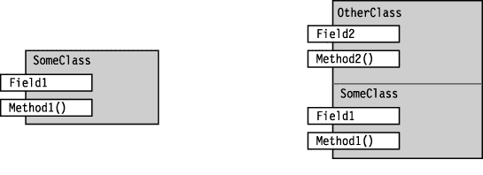

***图 7-1。**基类和派生类*T4】

### 访问继承的成员

对继承成员的访问就像在派生类本身中声明一样。(继承的构造函数有一点不同——我将在本章后面介绍它们。)例如，下面的代码声明了类`SomeClass`和`OtherClass`，它们显示在[图 7-1](#fig_7_1) 中。代码显示,`OtherClass`的所有四个成员都可以无缝访问，不管它们是在基类还是派生类中声明的。

> *   `Main` Create an object of a derived class `OtherClass`.
> *   The next two lines in `Main` call `Method1` in the base class, use `Field1` in the base class, and then use `Field2` in the derived class.
> *   The next two lines in `Main` call `Method2` in derived from *, use `Field1` in the base class again, and then use `Field2` in the derived class.*

`   class SomeClass                          // Base class
   {
      public string Field1 = "base class field ";
      public void Method1( string value ) {
         Console.WriteLine("Base class -- Method1:     {0}", value);
      }
   }

   class OtherClass: SomeClass             // Derived class
   {
      public string Field2 = "derived class field";
      public void Method2( string value ) {
         Console.WriteLine("Derived class -- Method2:  {0}", value);
      }
   }

   class Program
   {
      static void Main() {
         OtherClass oc = new OtherClass();

         oc.Method1( oc.Field1 );       // Base method with base field
         oc.Method1( oc.Field2 );       // Base method with derived field
         oc.Method2( oc.Field1 );       // Derived method with base field
         oc.Method2( oc.Field2 );       // Derived method with derived field
      }
   }`

该代码产生以下输出:

* * *

`Base class -- Method1:     base class field
Base class -- Method1:     derived class field
Derived class -- Method2:  base class field
Derived class -- Method2:  derived class field`

* * *

### 所有的类都是从类对象派生出来的

*除了特殊类`object`，所有的*类都是派生类，即使它们没有一个基于类的规范。类`object`是唯一没有被派生的类，因为它是继承层次的基础。

没有基类规范的类是直接从类`object`隐式派生的。省略基类规范只是指定`object`是基类的简写。两种形式语义等价，如图[图 7-2](#fig_7_2) 所示。

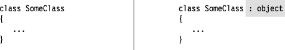

***图 7-2。**左边的类声明隐式派生自类对象，而右边的类声明显式派生自对象。这两种形式在语义上是等价的。*

关于类派生的其他重要事实如下:

> *   A class declares that only one class can be listed in its base class specification. This is called *single inheritance* .
> *   Although a class can only directly inherit a base class, there is no restriction on the derived *level* . That is to say, the class listed as the base class may be derived from another class, and another class is derived from another class, and so on, until finally reaching `object`.

*基类*和*派生类*是相对术语。所有的类都是派生类，要么来自`object`要么来自另一个类——所以通常当我们称一个类为派生类时，我们的意思是它是直接从除了`object`之外的某个类派生的。图 7-3 显示了一个简单的类层次结构。在这之后，我不会在图中显示`object`，因为所有的类最终都是从它派生的。

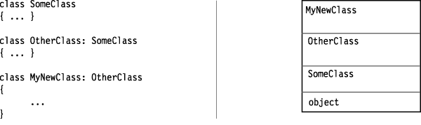

***图 7-3。**一个阶级等级体系*T4】

### 屏蔽基类的成员

派生类不能删除它继承的任何成员；但是，它可以用同名的成员来屏蔽基类成员。这非常有用，也是继承的主要特征之一。

例如，您可能希望从具有特定方法的基类继承。尽管该方法对于声明它的类来说是完美的，但它可能并不完全符合您在派生类中的要求。在这种情况下，您要做的是用派生类中声明的新成员来屏蔽基类方法。屏蔽派生类中的基类成员的一些重要方面如下:

> *   Mask a member that inherits *data, and declare a new member with the same type and the same *name* .*
> *   To mask an inherited function member, declare a new function member with the same signature. Remember, the signature consists of a name and a list of parameters, but does not include the return type.
> *   To let the compiler know that you intentionally blocked an inherited member, use the `new` modifier. Without it, the program can compile successfully, but the compiler will warn you that an inherited member is hidden.
> *   You can also block static members.

下面的代码声明了一个基类和一个派生类，每个基类都有一个名为`Field1`的`string`成员。关键字`new`用于明确告诉编译器屏蔽基类成员。[图 7-4](#fig_7_4) 展示了每个类的一个实例。

`   class SomeClass                        // Base class
   {
      public string Field1;
      ...
   }

   class OtherClass : SomeClass           // Derived class
   {
      new public string Field1;           // Mask base member with same name
       ↑
     Keyword` 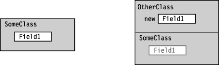

***图 7-4。**屏蔽一个基类的字段*

在下面的代码中，`OtherClass`从`SomeClass`派生，但是隐藏了它的两个继承成员。注意`new`修改器的使用。[图 7-5](#fig_7_5) 说明了代码。

`   class SomeClass                                      // Base class
   {
      public string Field1 = "SomeClass Field1";
      public void   Method1(string value)
          { Console.WriteLine("SomeClass.Method1:  {0}", value); }
   }

   class OtherClass : SomeClass                        // Derived class
   {  Keyword
       ↓
      new public string Field1 = "OtherClass Field1";  // Mask the base member.
      <ins>new</ins> public void   Method1(string value)          // Mask the base member.
       ↑   { Console.WriteLine("OtherClass.Method1:  {0}", value); }
   }  Keyword

   class Program
   {
      static void Main()
      {
         OtherClass oc = new OtherClass();       // Use the masking member.
         oc.Method1(oc.Field1);                  // Use the masking member.
      }
   }`

该代码产生以下输出:

* * *

`OtherClass.Method1:  OtherClass Field1`

* * *

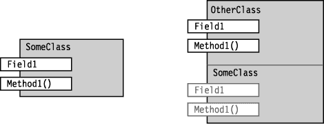

***图 7-5。**隐藏基类*的一个字段和一个方法

### 基地通道

如果你的派生类必须访问一个隐藏的继承成员，你可以通过使用一个*基本访问*表达式来访问它。该表达式由关键字`base`组成，后跟一个句点和成员名称，如下所示:

`   Console.WriteLine("{0}", <ins>base.Field1</ins>);
                                 ↑
                                                                     ↑        
                             Base access`

例如，在下面的代码中，派生类`OtherClass`将`Field1`隐藏在其基类中，但是通过使用基本访问表达式来访问它。

`   class SomeClass {                                       // Base class
      public string Field1 = "Field1 -- In the base class";
   }

   class OtherClass : SomeClass {                          // Derived class

      <ins>new</ins> public string <ins>Field1</ins> = "Field1 -- In the derived class";
       ↑                   ↑
      Hides the field in the base class
      public void PrintField1()
      {
         Console.WriteLine(Field1);              // Access the derived class.
         Console.WriteLine(<ins>base.Field1</ins>);         // Access the base class.
      }                         ↑          
   }                         Base access

   class Program {
      static void Main()
      {
         OtherClass oc = new OtherClass();
         oc.PrintField1();
      }
   }`

该代码产生以下输出:

* * *

`Field1 -- In the derived class
Field1 -- In the base class`

* * *

如果您发现您的程序代码经常使用该功能，即访问隐藏的继承成员，您可能需要重新评估您的类的设计。一般来说，有更优雅的设计——但如果有其他东西都不行的情况，这个功能就在那里。

### 使用对基类的引用

派生类的实例由基类的实例加上派生类的附加成员组成。对派生类的引用指向整个类对象，包括基类部分。

如果你有一个对派生类对象的引用，你可以通过使用*转换操作符*将引用转换为基类的类型*来得到一个对该对象基类部分的引用。转换操作符放在对象引用的前面，由一组括号组成，括号中包含被转换到的类的名称。铸造在[第 16 章](16.html#ch16)中有详细介绍。*

接下来的几节将介绍如何通过引用对象的基类部分来访问对象。我们将从下面的两行代码开始，它们声明了对对象的引用。[图 7-6](#fig_7_6) 说明了代码，并显示了不同变量所看到的对象部分。

> *   The first line declares and initializes the variable `derived`, which contains a reference to an object of type `MyDerivedClass`.
> *   The second line declares a variable `MyBaseClass` of the base class type, converts the reference in `derived` into this type, and gives a reference to the base class part of the object.
>     *   The reference to the base class part is stored in the variable `mybc` to the left of the assignment operator.
>     *   The reference to the base class part cannot "see" the rest of the derived class object, because it "sees" it through the reference to the base class.

`   MyDerivedClass derived = new MyDerivedClass();      // Create an object.
   MyBaseClass mybc       = (MyBaseClass) derived;     // Cast the reference.` 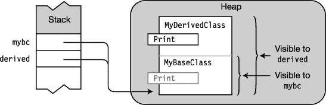

***图 7-6** 。Reference derived 可以看到整个 MyDerivedClass 对象，而 mybc 只能看到对象的 MyBaseClass 部分。*

下面的代码显示了这两个类的声明和使用。[图 7-7](#fig_7_7) 说明了内存中的对象和引用。

`Main`创建一个类型为`MyDerivedClass`的对象，并将其引用存储在变量`derived`中。`Main`还创建了一个`MyBaseClass`类型的变量，并用它来存储对对象基类部分的引用。当在每个引用上调用`Print`方法时，调用调用引用可以看到的方法的实现，产生不同的输出字符串。

`   class MyBaseClass
   {
      public void Print()
      {
         Console.WriteLine("This is the base class.");
      }
   }

   class MyDerivedClass : MyBaseClass
   {
      new public void Print()
      {
         Console.WriteLine("This is the derived class.");
      }
   }

   class Program
   {
      static void Main()
      {
         MyDerivedClass derived = new MyDerivedClass();
         MyBaseClass mybc = <ins>(MyBaseClass)</ins>derived;
                                  ↑
                            Cast to base class
         derived.Print();           // Call Print from derived portion.
         mybc.Print();              // Call Print from base portion.
      }
   }`

该代码产生以下输出:

* * *

`This is the derived class.
This is the base class.`

* * *

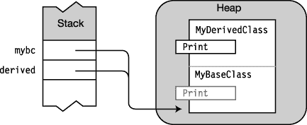

***图 7-7。**对派生类和基类的引用*

#### 虚拟和覆盖方法

在上一节中，您看到了当您通过使用对基类的引用来访问派生类的对象时，您只能获得基类的成员。虚拟方法允许对基类的引用“向上”访问派生类。

如果满足以下条件，您可以使用对基类的引用来调用*派生类*中的方法:

> *   Methods in derived classes and methods in base classes each have the same signature and return type.
> *   The method in the base class is labeled `virtual`.
> *   The method in the derived class is labeled `override`.

例如，以下代码显示了基类和派生类中方法的`virtual`和`override`修饰符:

`   class MyBaseClass                                   // Base class
   {
      <ins>virtual</ins> public void Print()
         ↑
       ...
   class MyDerivedClass : MyBaseClass                  // Derived class
   {
      <ins>override</ins> public void Print()
         ↑`

[图 7-8](#fig_7_8) 说明了这组`virtual`和`override`方法。注意这种行为与前一种情况有什么不同，在前一种情况下，我使用了`new`来隐藏基类成员。

> *   When the `Print` method is called with a reference to the base class (`mybc`), the method call is passed up to the derived class and executed because
>     *   The method in the base class is marked as `virtual`.
>     *   There is a matching `override` method in the derived class.
illustrates this point by displaying the arrow coming out from behind the `virtual` `Print` method and pointing to the `override` `Print` method.

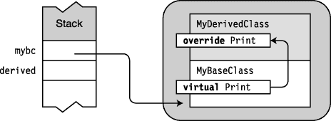

***图 7-8。**一个虚拟方法和一个覆盖方法*

下面的代码与上一节中的相同，但是这一次，方法被标记为`virtual`和`override`。这会产生一个与前一个示例非常不同的结果。在此版本中，通过基类调用方法会调用派生类中的方法。

`   class MyBaseClass
   {
      virtual public void Print()
      {
         Console.WriteLine("This is the base class.");
      }
   }

   class MyDerivedClass : MyBaseClass
   {
      override public void Print()
      {
         Console.WriteLine("This is the derived class.");
      }
   }

   class Program
   {
      static void Main()
      {
         MyDerivedClass derived = new MyDerivedClass();
         MyBaseClass mybc       = (<ins>MyBaseClass</ins>)derived;
                                        ↑
         derived.Print();          Cast to base class
         mybc.Print();
      }
   }`

该代码产生以下输出:

* * *

`This is the derived class.
This is the derived class.`

* * *

关于`virtual`和`override`修改器的其他重要信息如下:

> *   Overrides and overridden methods must have the same accessibility. In other words, the covered method cannot be, for example, `private` and the covered method `public`.
> *   Cannot override `static` or there is no method declared as virtual.
> *   Methods, properties and indexers (which I introduced in the previous chapter), and another member type, called *event* (which I will introduce later in the text), can be declared as `virtual` and `override`.

#### 覆盖标记为 override 的方法

重写方法可以发生在任何级别的继承之间。

> *   When you call an overridden method with a reference to the base class part of an object, the method call is passed up to the derivation hierarchy to be executed to the *most derived* version of the method marked `override`.
> *   If there are other method declarations not marked as `override` at a higher level of derivation, they will not be called.

例如，下面的代码显示了构成继承层次结构的三个类:`MyBaseClass`、`MyDerivedClass`和`SecondDerived`。这三个类都包含一个名为`Print`的方法，具有相同的签名。在`MyBaseClass`中，`Print`被标注为`virtual`。在`MyDerivedClass`中，标注为`override`。在类`SecondDerived`中，你可以用`override`或`new`来声明方法`Print`。让我们看看在每种情况下会发生什么。

`   class MyBaseClass                                    // Base class
   {
      virtual public void Print()
      { Console.WriteLine("This is the base class."); }
   }

   class MyDerivedClass : MyBaseClass                   // Derived class
   {
      override public void Print()
      { Console.WriteLine("This is the derived class."); }
   }

   class SecondDerived : MyDerivedClass                 // Most-derived class
   {
      ... // Given in the following pages
   }`

##### 案例 1:用覆盖声明打印

如果你将`SecondDerived`的`Print`方法声明为`override`，那么它将覆盖*方法的两个派生较少的版本*，如图[图 7-9](#fig_7_9) 所示。如果对基类的引用被用来调用`Print`，它会沿着链一直传递到类`SecondDerived`中的实现。

下面的代码实现了这种情况。注意方法`Main`最后两行中的代码。

> *   The first of the two statements calls the `Print` method by using a reference to the highest-level derived class `SecondDerived`. This is not called by reference to the base class part, so it will call the method implemented in `SecondDerived`.
> *   However, the second statement calls the `Print` method by referring to the base class `MyBaseClass`.

`   class SecondDerived : MyDerivedClass
   {
      <ins>override</ins> public void Print() {
         ↑   Console.WriteLine("This is the second derived class.");
      }
   }

   class Program
   {
      static void Main()
      {
         SecondDerived derived = new SecondDerived(); // Use SecondDerived.
         MyBaseClass mybc = (MyBaseClass)derived;     // Use MyBaseClass.

         derived.Print();
         mybc.Print();
      }
   }`

结果是不管`Print`是通过派生类还是基类调用，最具派生类的方法都被调用。当通过基类调用时，它会沿着继承层次向上传递。该代码产生以下输出:

* * *

`This is the second derived class.
This is the second derived class.`

* * *

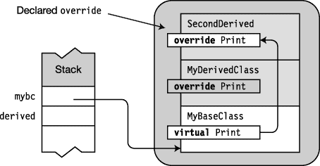

***图 7-9。**执行被传递到多级覆盖链的顶端。*

##### 案例 2:用 new 声明打印

如果改为将`SecondDerived`的`Print`方法声明为`new`，结果如图[图 7-10](#fig_7_10) 所示。`Main`与前一种情况相同。

`   class SecondDerived : MyDerivedClass
   {
      new public void Print()
      {
         Console.WriteLine("This is the second derived class.");
      }
   }

   class Program
   {
      static void Main()                                    // Main
      {
         SecondDerived derived = new SecondDerived();       // Use SecondDerived.
         MyBaseClass mybc      = (MyBaseClass)derived;      // Use MyBaseClass.

         derived.Print();
         mybc.Print();
      }
   }`

结果是，当通过对`SecondDerived`的引用调用方法`Print`时，`SecondDerived`中的方法被执行，正如您所料。然而，当通过对`MyBaseClass`的引用调用该方法时，该方法调用只向上传递一级，到达类`MyDerived`，在那里执行。这两种情况的唯一区别是`SecondDerived`中的方法是用修饰符`override`还是修饰符`new`声明的。

该代码产生以下输出:

* * *

`This is the second derived class.
This is the derived class.`

* * *

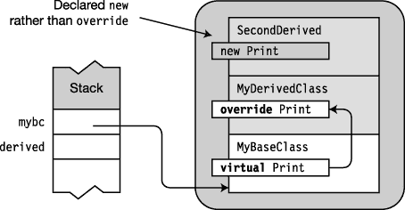

***图 7-10。**隐藏被覆盖的方法*

#### 覆盖其他成员类型

在前面的几节中，您已经看到了`virtual` / `override`名称是如何在方法上工作的。这些与属性、事件和索引器的工作方式完全相同。例如，下面的代码使用`virtual` / `override`显示了一个名为`MyProperty`的只读属性。

`   class MyBaseClass
   {
      private int _myInt = 5;
      virtual public int MyProperty
      {
         get { return _myInt; }
      }
   }

   class MyDerivedClass : MyBaseClass
   {
      private int _myInt = 10;
      override public int MyProperty
      {
         get { return _myInt; }
      }
   }

   class Program
   {
      static void Main()
      {
         MyDerivedClass derived = new MyDerivedClass();
         MyBaseClass mybc       = (MyBaseClass)derived;

         Console.WriteLine( derived.MyProperty );
         Console.WriteLine( mybc.MyProperty );
      }
   }`

该代码产生以下输出:

* * *

`10
10`

* * *

### 构造函数执行

在前一章中，你看到了一个构造函数执行代码来准备一个类供使用。这包括初始化类的静态和实例成员。在这一章中，你看到了派生类对象的一部分是基类的一个对象。

> *   In order to create the base class part of the object, the constructor of the base class is implicitly called as part of the instance creation process.
> *   Each class in the inheritance hierarchy chain executes its own base class constructor before executing its own constructor body.

例如，下面的代码显示了类`MyDerivedClass`及其构造函数的声明。当调用构造函数时，它在执行自己的主体之前调用无参数构造函数`MyBaseClass()`。

`   class MyDerivedClass : MyBaseClass
   {
      MyDerivedClass()        // Constructor uses base constructor MyBaseClass()
      {
         ...
      }`

[图 7-11](#fig_7_11) 显示了施工顺序。创建实例时，首先要做的事情之一是初始化对象的所有实例成员。之后，基类构造函数被调用。只有这样，类本身的构造函数体才会被执行。

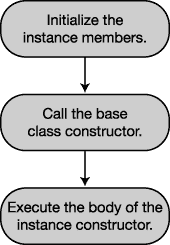

***图 7-11。**宾语结构的顺序*

例如，在下面的代码中，在基类构造函数被调用之前，`MyField1`和`MyField2`的值将被分别设置为`5`和`0`。

`   class MyDerivedClass : MyBaseClass
   {
      int MyField1 = 5;                      // 1\. Member initialized
      int MyField2;                          //    Member initialized

      public MyDerivedClass()                // 3\. Body of constructor executed
      {
         ...
      }
   }

   class MyBaseClass
   {
      public MyBaseClass()                   // 2\. Base class constructor called
      {
         ...
      }
   }`

 **小心**在构造函数中调用虚方法*强烈不鼓励*。当执行基类构造函数时，基类中的虚方法将调用派生类中的重写方法。但那是在派生构造函数的主体被执行之前。因此，它会在类完全初始化之前向上调用派生类。

#### 构造函数初始值设定项

默认情况下，构造对象时会调用基类的无参数构造函数。但是构造函数可以重载，所以一个基类可能不止一个。如果你想让你的派生类使用一个特定的基类构造函数而不是无参数构造函数，你必须在一个*构造函数初始化器*中指定它。

有两种形式的构造函数初始值设定项:

> *   The first form uses the keyword `base` and specifies which base class constructor to use.
> *   The second form uses the keyword `this` and specifies which constructor in the class should be used.

基类构造函数初始值设定项放在类的构造函数声明中参数列表后面的冒号后面。构造函数初始化器由关键字`base`和要调用的基构造函数的参数列表组成。

例如，下面的代码显示了类`MyDerivedClass`的构造函数。

> *   The constructor initializer specifies that the construction process calls the base class constructor with two parameters, where the first parameter is a `string` and the second parameter is a `int`.
> *   The parameters in the basic parameter table must match the parameter table of *expected basic constructor in type and order.*

`Constructor initializer
                                              <ins>     ↓     </ins>
   public MyDerivedClass( int x, string s ) : <ins>base</ins>( s, x )
   {                                           ↑
   ...                                      Keyword` 

当你在没有构造函数初始化器的情况下声明一个构造函数时，这是一个带有由`base()`组成的构造函数初始化器的表单的快捷方式，如图[图 7-12](#fig_7_12) 所示。这两种形式在语义上是等价的。

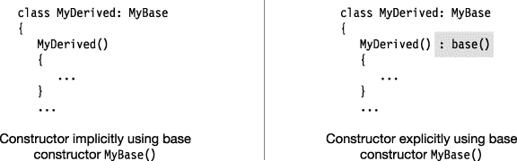

***图 7-12。**建造师的等价形式*

另一种形式的构造函数初始化器指示构造过程(实际上是编译器)使用来自同一个类的不同构造函数。例如，下面显示了类`MyClass`的单参数构造函数。但是，这个单参数构造函数使用了来自同一个类的构造函数，但是有两个参数，提供一个默认参数作为第二个参数。

`                                   Constructor initializer
                          <ins>               ↓              </ins>
   public MyClass(int x): <ins>this</ins>(x, "Using Default String")
   {                       ↑
      ...               Keyword
   }`

另一种特别方便的情况是，一个类有几个构造函数，它们有公共代码，应该总是在对象构造过程的开始执行。在这种情况下，您可以提取公共代码，并将其放在一个构造函数中，该构造函数被所有其他构造函数用作构造函数初始值设定项。事实上，这是一个建议的实践，因为它减少了代码重复。

你可能认为你可以声明另一个方法来执行这些普通的初始化，并让所有的构造函数调用这个方法。这不是很好，有几个原因。首先，当编译器知道一个方法是构造函数时，它可以优化某些东西。第二，有些事情只能在构造函数中完成，而不能在其他地方完成。例如，在前一章中，你了解到`readonly`字段只能在构造函数中初始化。如果您试图在任何其他方法中初始化一个`readonly`字段，您将得到一个编译器错误，即使该方法仅由一个构造函数调用。

回到那个公共构造函数——如果它可以独立作为一个有效的构造函数，初始化需要初始化的类中的所有东西，那么让它作为一个`public`构造函数是非常好的。

然而，如果它没有完全初始化一个对象呢？在这种情况下，不允许从类外部调用构造函数，因为这样会创建未完全初始化的对象。为了避免这个问题，您可以声明构造函数`private`而不是`public`，并且只让其他构造函数使用它。以下代码说明了这种用法:

`   class MyClass
   {
      readonly int    firstVar;
      readonly double secondVar;

      public string UserName;
      public int UserIdNumber;

      private MyClass( )            // Private constructor performs initializations
      {                             // common to the other constructors
         firstVar  = 20;
         secondVar = 30.5;
      }

      public MyClass( string firstName ) : this() // Use constructor initializer
      {
         UserName     = firstName;
         UserIdNumber = -1;
      }

      public MyClass( int idNumber ) : this( )    // Use constructor initializer
      {
         UserName     = "Anonymous";
         UserIdNumber = idNumber;
      }
   }`

#### 类访问修饰符

一个类可以被系统中的其他类看到和访问。本节解释了类的可访问性。虽然我将在解释和例子中使用类，因为这是我到目前为止在本文中所涉及的，但可访问性规则也适用于我稍后将涉及的其他类型。

术语*可见*有时也用于术语*可达*。它们可以互换使用。类的可访问性有两个级别:`public`和`internal`。

> *   The class marked `public` can be accessed by the code in any assembly in the system. To make a class visible to other assemblies, use the `public` access modifier, as shown below: `  Keyword
>           ↓
>        public class MyBaseClass
>        { ...`
> *   A class marked `internal` can only be seen by classes in its own assembly. (Remember [in Chapter 1 that a *assembly* is either a program or a DLL. I will introduce the components in detail in Chapter 21](01.html) . ) `    Keyword
>           ↓
>        internal class MyBaseClass
>        { ...`
>     *   This is the default accessibility level, so code outside the assembly cannot access the class unless the modifier `public` is explicitly specified in the class declaration. You can explicitly declare an internal class by using the `internal` access modifier.

[图 7-13](#fig_7_13) 说明了从组件外部对`internal`和`public`类的访问。类`MyClass`对于左边组件中的类是不可见的，因为`MyClass`被标记为`internal`。然而，类`OtherClass`对于左边的类是可见的，因为它被标记为`public`。

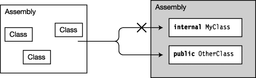

***图 7-13。**其他程序集中的类可以访问公共类，但不能访问内部类。*

### 程序集之间的继承

到目前为止，我一直在包含基类的同一个程序集中声明派生类。但是 C# 也允许你从不同程序集中定义的基类派生一个类。

若要使您的类从另一个程序集中的基类派生，必须满足以下条件:

> *   The base class must be declared `public` so that it can be accessed from outside its assembly.
> *   You must include a reference to the assembly that contains the base class in the References section of the Visual Studio project. You can find the title in Solution Explorer.

为了在不使用完全限定名的情况下更容易引用另一个程序集中的类和类型，请在源文件的顶部放置一个`using`指令，其命名空间包含您想要访问的类或类型。

 **注意**添加对另一个程序集的引用和添加一个`using`指令是两件不同的事情。添加对另一个程序集的引用会告诉编译器所需类型的定义位置。添加`using`指令允许您引用其他类，而不必使用它们的完全限定名。第 21 章对此有详细介绍。

例如，下面两段来自不同程序集中的代码显示了从另一个程序集中继承一个类是多么容易。第一个代码清单创建了一个程序集，它包含一个名为`MyBaseClass`的类的声明，该类具有以下特征:

> *   It is declared in a source file named `Assembly1.cs` and a namespace named `BaseClassNS`.
> *   It is declared as `public` so that it can be accessed from other assemblies.
> *   It contains a single member, a method named `PrintMe`, and it just writes a simple message to identify the class.

`   // Source file name Assembly1.cs
   using System;
       Namespace containing declaration of base class
                 ↓
   namespace BaseClassNS
   { Declare the class public so it can be seen outside the assembly.
        ↓
      public class MyBaseClass {
         public void PrintMe() {
            Console.WriteLine("I am MyBaseClass");
         }
      }
   }`

第二个程序集包含一个名为`DerivedClass`的类的声明，该类继承自第一个程序集中声明的`MyBaseClass`。源文件名为`Assembly2.cs`。[图 7-14](#fig_7_14) 展示了两个组件。

> *   `DerivedClass` has an empty body, but it inherits the method `PrintMe` from `MyBaseClass`.
> *   `Main` Create an object of type `DerivedClass` and call its inheritance method `PrintMe`.

`   // Source file name Assembly2.cs
   using System;
   using <ins>BaseClassNS</ins>;
             ↑
   Namespace containing declaration of base class
   namespace UsesBaseClass
   {                  Base class in other assembly
                             ↓
      class DerivedClass: MyBaseClass {
         // Empty body
      }

      class Program {
         static void Main( )
         {
            DerivedClass mdc = new DerivedClass();
            mdc.PrintMe();
         }
      }
   }`

该代码产生以下输出:

* * *

`I am MyBaseClass`

* * *

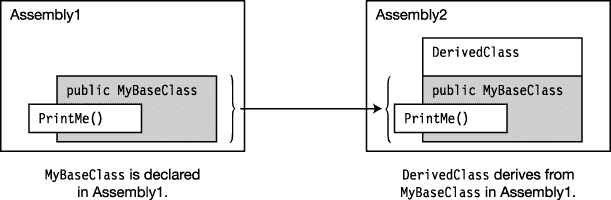

***图 7-14。**跨程序集继承*

### 成员访问修饰符

前两节解释了类的可访问性。对于类可访问性，只有两个修饰符— `internal`和`public`。本节涵盖了*成员可访问性*。类可访问性描述了类的可见性；成员可访问性描述了类对象成员的可见性。

类中声明的每个成员对系统的各个部分都是可见的，这取决于在类声明中分配给它的访问修饰符。您已经看到了`private`成员仅对同一类的其他成员可见，而`public`成员对程序集之外的类也是可见的。在本节中，我们将再次查看`public`和`private`访问级别，以及其他三个可访问级别。

在研究成员可访问性的细节之前，我需要先提一些一般性的事情:

> 在一个类的声明中显式声明的所有成员对彼此都是可见的，不管它们的可访问性规范如何。继承的成员没有在类的声明中显式声明，所以，正如你将看到的，继承的成员对派生类的成员可能是可见的，也可能是不可见的。*   The following are the names of the five member access levels. So far, I have only introduced `public` and `private`.
>     
>     *   `public`
>     *   `private`
>     *   `protected`
>     *   `internal`
>     *   `protected internal`*   You must specify a member access level for each member. If no access level is specified for the member, its implicit access level is `private`.*   A member cannot be more accessible than its class. That is to say, if the accessibility level of a class limits it to the assembly, the individual members of the class can't be seen outside the assembly, no matter what their access modifiers are, even `public`.

#### 访问成员的区域

一个类通过用访问修饰符标记它的成员来指定它的哪些成员可以被其他类访问。你已经看到了`public`和`private`修改器。下面的声明显示了一个类，该类声明了具有五种访问级别的成员:

`   public class MyClass
   {
      public             int Member1;
      private            int Member2;
      protected          int Member3;
      internal           int Member4;
      protected internal int Member5;
      ...`

另一个类——比方说 class`B`——可以或不可以根据它的两个特征访问这些成员，这两个特征是:

> *   Is class b from `MyClass`
> *   Is the derived class B the same as `MyClass`
> 
> 类在同一个程序集中

这两个特征产生了四个组，如图 7-15 所示。与类别`MyClass`相关，另一个类别可以是以下任一类别:

> *   In the same assembly, from `MyClass` in the same assembly (bottom right)
> *   Derived from, but not from `MyClass` in different assemblies (lower left)
> *   Derived from `MyClass` in different assemblies (upper right)
> *   Derived from, not from `MyClass` (top left)
> 
> 派生

这些特征用于定义五个访问级别，我将在下一节中介绍。

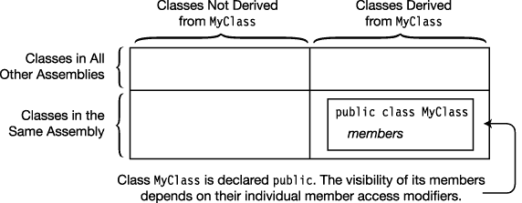

***图 7-15。**无障碍区域*

#### 公共成员可访问性

`public`访问级别限制最少。程序集内外的所有类都可以自由访问该成员。[图 7-16](#fig_7_16) 展示了`MyClass`的`public`类成员的可访问性。

要声明一个公共成员，使用`public`访问修饰符，如下所示。

`   Keyword
      ↓

   public int Member1;` 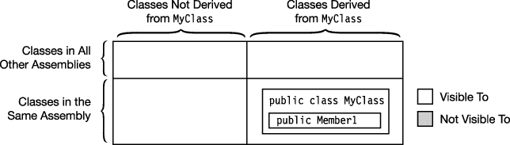

***图 7-16。**公共类的公共成员对同一程序集和其他程序集中的所有类都是可见的。*

#### 私人会员可访问性

`private`访问级别是最严格的。

> *   `private` Class members can only be accessed by members of their own class. It cannot be accessed by other classes, including classes derived from it.
> *   However, members of `private` can be accessed by members of classes nested in their classes. Nested classes are contained in [in Chapter 25\.](25.html#ch25)

[图 7-17](#fig_7_17) 展示了一个`private`成员的可访问性。

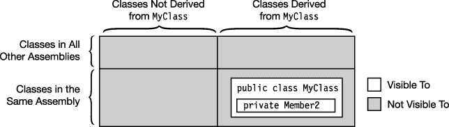

***图 7-17。**任何类的私有成员仅对它自己的类(或嵌套类)的成员可见。*

#### 受保护成员的可访问性

`protected`访问级别类似于`private`访问级别，除了它也允许从类派生的类访问成员。[图 7-18](#fig_7_18) 说明了`protected`的可达性。请注意，即使程序集之外从类派生的类也可以访问该成员。

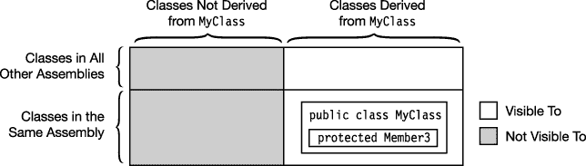

***图 7-18。**公共类的受保护成员对它自己的类和从它派生的类的成员是可见的。派生类甚至可以位于其他程序集中。*

#### 内部成员可访问性

标记为`internal`的成员对集合中的所有类可见，但对集合外的类不可见，如图 7-19 中的[所示。](#fig_7_19)

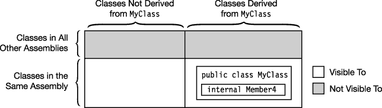

***图 7-19。**公共类的内部成员对同一程序集内的任何类的成员都是可见的，但对程序集外的类是不可见的。*

#### 受保护的内部成员可访问性

标记为`protected internal`的成员对从该类继承的所有类可见，也对程序集内的所有类可见，如图 7-20 中的[所示。注意，允许访问的类集合是由`protected`修饰符允许的类集合加上由`internal`修饰符允许的类集合的组合。注意，这是`protected`和`internal`的*联合*——而不是交集。](#fig_7_20)

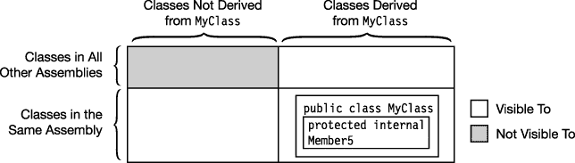

***图 7-20。**公共类的受保护内部成员对同一程序集中的类成员以及从该类派生的类成员可见。对于不是从该类派生的其他程序集中的类，它是不可见的。*

#### 成员访问修饰符概要

下面两个表总结了五个成员访问级别的特征。表 7-1 列出了每个修改器，并给出了其效果的直观总结。

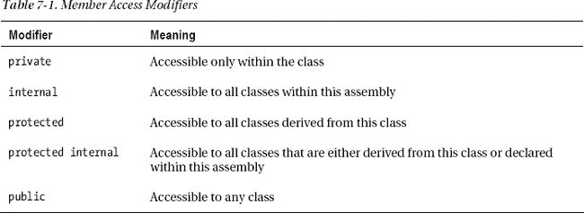

[图 7-21](#fig_7_21) 显示了五个成员访问修饰符的相对可访问性。

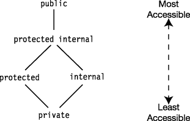

***图 7-21。**各种成员访问修饰符的相对可访问性*

表 7-2 在表的左侧列出了访问修饰符，在顶部列出了类的类别。*派生类*是指从声明成员的类派生的类。*非派生的*意味着不是从声明成员的类派生的类。单元格中的复选标记意味着类的类别可以访问带有相应修饰符的成员。

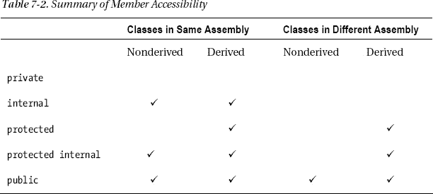

### 抽象成员

*抽象成员*是被设计为被覆盖的函数成员。抽象成员具有以下特征:

> *   It must be a function member. That is, fields and constants cannot be abstract members.
> *   Must be marked with `abstract` modifier.
> *   There is no code block that can be implemented. The code of an abstract member is represented by a semicolon.

例如，类定义中的以下代码声明了两个抽象成员:一个名为`PrintStuff`的抽象方法和一个名为`MyProperty`的抽象属性。注意分号代替了实现块。

`    Keyword                                            Semicolon in place of implementation
      ↓                                    ↓
   abstract public void PrintStuff(string s);

   abstract public int MyProperty
   {
      get;  ←  Semicolon in place of implementation
      set;  ←  Semicolon in place of implementation
   }`

抽象成员只能在*抽象类*中声明，我们将在下一节中讨论。可以将四种类型的成员声明为抽象成员:

> *   way
> *   attribute
> *   event
> *   Indexer

关于抽象成员的其他重要事实如下:

> *   Abstract members, although they must be covered by the corresponding members in the derived class, *cannot use `virtual` modifier in addition to `abstract` modifier* .
> *   Like virtual members, the implementation of abstract members in derived classes must specify the `override` modifier.

[表 7-3](#tab_7_3) 比较对比虚拟成员和抽象成员。

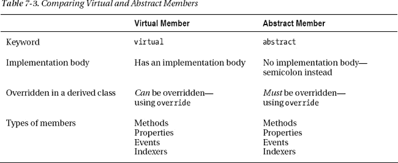

### 抽象类

抽象类被设计为从。一个*抽象类*只能作为另一个类的基类。

> *   You can't create an instance of an abstract class.
> *   Declare an abstract class with the `abstract` modifier.

`    Keyword
      ↓
   abstract class MyClass
   {
      ...
   }`

> *   An abstract class can contain abstract members or regular non-abstract members. Members of abstract classes can be any combination of abstract members and ordinary members and implementations.
> *   An abstract class itself can be derived from another abstract class. For example, the following code shows an abstract class derived from another abstract class:

`   abstract class AbClass                    // Abstract class
   {
      ...
   }

   abstract class MyAbClass : AbClass        // Abstract class derived from
   {                                         // an abstract class
      ...
   }`

> *   Any class derived from an abstract class must use the `override` keyword to implement all abstract members of the class, unless the derived class itself is abstract.

#### 抽象类和抽象方法的例子

下面的代码展示了一个名为`AbClass`的抽象类，它有两个方法。

第一个方法是一个普通的方法，它有一个输出类名的实现。第二种方法是必须在派生类中实现的抽象方法。类`DerivedClass`继承自`AbClass`并实现和覆盖抽象方法。`Main`创建一个`DerivedClass`的对象并调用它的两个方法。

`    Keyword
      ↓
   abstract class AbClass                                  // Abstract class
   {
      public void IdentifyBase()                           // Normal method
      { Console.WriteLine("I am AbClass"); }
       Keyword
         ↓
      abstract public void IdentifyDerived();              // Abstract method
   }

   class DerivedClass : AbClass                            // Derived class
   {   Keyword
          ↓
      override public void IdentifyDerived()               // Implementation of
      { Console.WriteLine("I am DerivedClass"); }          // abstract method
   }

   class Program
   {
      static void Main()
      {
         // AbClass a = new AbClass();        // Error.  Cannot instantiate
         // a.IdentifyDerived();              // an abstract class.

         DerivedClass b = new DerivedClass(); // Instantiate the derived class.
         b.IdentifyBase();                    // Call the inherited method.
         b.IdentifyDerived();                 // Call the "abstract" method.
      }
   }`

该代码产生以下输出:

* * *

`I am AbClass
I am DerivedClass`

* * *

#### 抽象类的另一个例子

下面的代码显示了包含数据成员和函数成员的抽象类的声明。记住，数据成员——字段和常量——不能声明为`abstract`。

`   abstract class MyBase     // Combination of abstract and nonabstract members
   {
      public int SideLength        = 10;             // Data member
      const  int TriangleSideCount = 3;              // Data member

      abstract public void PrintStuff( string s );   // Abstract method
      abstract public int  MyInt { get; set; }       // Abstract property

      public int PerimeterLength( )                  // Regular, nonabstract method
      { return TriangleSideCount * SideLength; }
   }

   class MyClass : MyBase
   {
      public override void PrintStuff( string s )    // Override abstract method
      { Console.WriteLine( s ); }

      private int _myInt;
      public override int MyInt                      // Override abstract property
      {
         get { return _myInt; }
         set { _myInt = value; }
      }
   }

   class Program
   {
      static void Main( string[] args )
      {
         MyClass mc = new MyClass( );
         mc.PrintStuff( "This is a string." );
         mc.MyInt = 28;
         Console.WriteLine( mc.MyInt );
         Console.WriteLine( "Perimeter Length: {0}", mc.PerimeterLength( ) );
      }
   }`

该代码产生以下输出:

* * *

`This is a string.
28
Perimeter Length: 30`

* * *

### 密封类

在上一节中，您看到了抽象类必须用作基类——它不能被实例化为独立的类对象。一个*密封类*的情况正好相反。

> *   Sealed classes can only be instantiated as independent class objects, not as base classes.
> *   A sealed class is marked with the `sealed` modifier.

例如，下面的类是一个密封类。任何将它作为另一个类的基类的尝试都会产生编译错误。

`   Keyword
            ↓
   sealed class MyClass
   {
      ...
   }`

### 静态类

静态类是所有成员都是静态的类。静态类用于对不受实例数据影响的数据和函数进行分组。静态类的一个常见用途可能是创建一个包含数学方法和值的数学库。

关于静态类，需要知道的重要事情如下:

> *   The class itself must be marked with `static`.
> *   All members of the class must be static.
> *   A class can have a static constructor, but it cannot have an instance constructor, because an instance of a class cannot be created.
> *   Static classes are implicitly sealed. That is, you cannot inherit from a static class.

通过使用类名和成员名，可以像访问任何静态成员一样访问静态类的成员。

下面的代码显示了一个静态类的示例:

`   Class must be marked static
      ↓
   static public class MyMath
   {
      public static float PI = 3.14f;
      public <ins>static</ins> bool IsOdd(int x)
                ↑      { return x % 2 == 1; }
            Members must be static
                ↓     
      public static int Times2(int x)
                      { return 2 * x; }
   }

   class Program
   {
      static void Main( )
      {                                           Use class name and member name.
         int val = 3;                                  <ins>      ↓     </ins>
         Console.WriteLine("{0} is odd is {1}.", val,  MyMath.IsOdd(val));
         Console.WriteLine("{0} * 2 = {1}.",     val,  MyMath.Times2(val));
      }
   }`

该代码产生以下输出:

* * *

`3 is odd is True.
3 * 2 = 6.`

* * *

### 扩展方法

到目前为止，在本文中，你看到的每一个方法都与声明它的类相关联。*扩展方法*特性扩展了这个界限，允许你编写与类*相关的方法，而不是声明它们的类。*

要了解如何使用这个特性，请看下面的代码。它包含类`MyData`，存储三个类型为`double`的值，还包含一个构造函数和一个名为`Sum`的方法，返回三个存储值的总和。

`   class MyData
   {
      private double D1;                                     // Fields
      private double D2;
      private double D3;

      public MyData(double d1, double d2, double d3)         // Constructor
      {
         D1 = d1; D2 = d2; D3 = d3;
      }

      public double Sum()                                    // Method Sum
      {
         return D1 + D2 + D3;
      }
   }`

这是一个非常有限的类，但是假设它包含另一个方法，返回三个数据点的平均值，那么它会更有用。根据您目前对类的了解，有几种方法可以实现附加功能:

> *   If you have source code and can modify this class, of course, you can also add new methods to this class.
> *   However, if you can't modify this class-for example, if it is in a third-party class library-then, as long as it is not sealed, you can treat it as a base class and implement additional methods in classes derived from it.

但是，如果您没有访问代码的权限，或者该类是密封的，或者有一些其他设计原因阻止了这些解决方案的工作，那么您将不得不在另一个类中编写一个方法，该方法使用该类的公共可用成员。

例如，您可以编写一个类似下面代码中的类。代码包含一个名为`ExtendMyData`的静态类，该类包含一个名为`Average`的静态方法，该方法实现了附加功能。注意，该方法将`MyData`的一个实例作为参数。

`   static class ExtendMyData         Instance of MyData class
   {                                <ins>    ↓    </ins>
      public static double Average( MyData md )
      {
         return md.Sum() / 3;
      }         ↑
   }   Use the instance of MyData.

   class Program
   {
      static void Main()
      {                                                   Instance of MyData
         MyData md = new MyData(3, 4, 5);                        ↓
         Console.WriteLine("Average: {0}", <ins>ExtendMyData.Average(md)</ins>);
      }                                                 ↑  
   }                                             Call the static method.`

该代码产生以下输出:

* * *

`Average: 4`

* * *

虽然这是一个完美的解决方案，但是如果您可以在类实例本身上调用该方法，而不是创建另一个类的实例来操作它，那将会更好。下面两行代码说明了不同之处。第一个使用刚刚展示的方法——在另一个类的实例上调用静态方法。第二个展示了我们想要使用的形式——调用对象本身的实例方法。

`   ExtendMyData.Average( md )               // Static invocation form
   md.Average();                            // Instance invocation form`

扩展方法允许您使用第二种形式，即使第一种形式是编写调用的正常方式。

通过对方法`Average`的声明做一点小小的修改，您可以使用实例调用的形式。您需要做的更改是在参数声明中的类型名称前添加关键字`this`，如下所示。将`this`关键字添加到静态类的静态方法的第一个参数会将其从类`ExtendMyData`的常规方法更改为类`MyData`的*扩展方法*。现在，您可以使用这两种调用形式。

`  Must be a static class
      ↓    
   static class ExtendMyData
   {   Must be public and static                           Keyword and type
        <ins>    ↓     </ins>                   <ins>    ↓     </ins> 
      public static double Average( this MyData md )
      {
         ...
      }
   }`

扩展方法的重要要求如下:

> *   Classes that declare extension methods must declare `static`.
> *   The extension method itself must declare `static`.
> *   The extension method must contain the keyword `this` as its first parameter type, followed by the class name it is extending.

[图 7-22](#fig_7_22) 展示了一个扩展方法的结构。

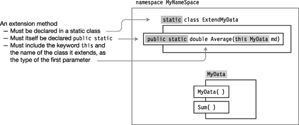

***图 7-22。**一个扩展方法的结构*

下面的代码展示了一个完整的程序，包括类`MyData`和扩展方法`Average`，在类`ExtendMyData`中声明。注意方法`Average`被调用，就好像它是`MyData`的*实例成员*！[图 7-22](#fig_7_22) 说明了代码。类`MyData`和`ExtendMyData`一起像期望的类一样工作，有三个方法。

`   namespace ExtensionMethods
   {
      sealed class MyData
      {
         private double D1, D2, D3;
         public MyData(double d1, double d2, double d3)
         { D1 = d1; D2 = d2; D3 = d3; }

         public double Sum() { return D1 + D2 + D3; }
      }

      static class ExtendMyData       Keyword and type
      {                               <ins>     ↓     </ins>
         public static double Average(this MyData md)
         {        ↑
            Declared static
            return md.Sum() / 3;
         }
      }

      class Program
      {
         static void Main()
         {
            MyData md = new MyData(3, 4, 5);
            Console.WriteLine("Sum:     {0}", md.Sum());
            Console.WriteLine("Average: {0}", <ins>md.Average()</ins>);
         }                                          ↑
      }                                 Invoke as an instance member of the class
   }`

该代码产生以下输出:

* * *

`Sum:     12
Average: 4`

* * *

### 命名约定

写程序需要想出很多名字；类、变量、方法、属性的名字，还有很多我还没有提到的东西。当你通读一个程序时，使用命名约定是一个重要的方法，可以给你一个关于你正在处理的对象种类的线索。

我在第 6 章中提到了一点命名，但是现在你已经知道了更多关于类的知识，我可以给你更多的细节。[表 7-4](#tab_7_4) 给出了三种主要的命名方式以及它们在中的常用方式 .NET 程序。

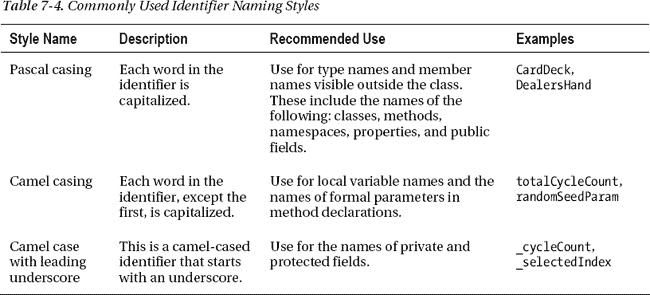

不是每个人都同意这些约定，尤其是前导下划线部分。我自己发现前导下划线非常难看，但很有用，并在我自己的代码中将其用于私有和受保护的变量。微软自己在这个问题上似乎也有矛盾。在其建议的约定中，Microsoft 不将前导下划线作为选项。但是他们在自己的代码中使用了它。

在本书的其余部分，我将坚持微软官方推荐的对私有和受保护字段使用 camel 套管的惯例。

关于下划线的最后一点是，它们通常不在标识符的主体中使用，除了在事件处理程序的名字中，我将在第 14 章中介绍。