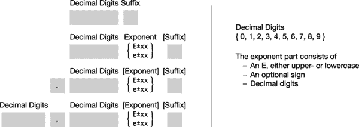
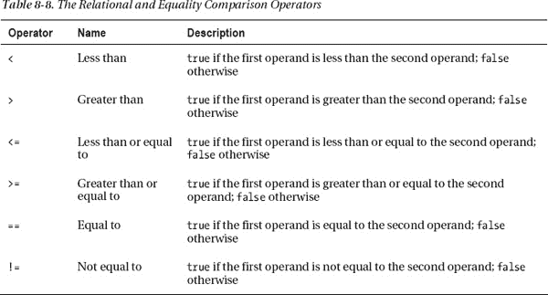

# 八、表达式和运算符

### 表情

本章定义表达式并描述 C# 提供的运算符。它还解释了如何定义 C# 运算符来处理用户定义的类。

一个*操作符*是一个符号，代表一个返回单一结果的操作。*操作数*是操作者用作输入的数据元素。操作员执行以下操作:

> *   Take its operand as input.
> *   Perform an action
> *   According to the action
> 
> 返回值

一个*表达式*是一串操作符和操作数。C# 运算符接受一个、两个或三个操作数。以下是一些可以作为操作数的构造:

> *   characters
> *   constant
> *   variable
> *   Method call
> *   Element accessors, such as array accessors and indexers
> *   Other expressions

可以使用运算符组合表达式，以创建更复杂的表达式，如以下包含三个运算符和四个操作数的表达式所示:

*求值*表达式是将每个运算符以正确的顺序应用于其操作数以产生一个值的过程。

> *   Returns the value to the position where the expression is evaluated. There, it may be used as an operand in a closed expression again.
> *   Besides the return value, some expressions also have side effects, such as setting a value in memory.

### 文字量

文字是键入源代码中的数字或字符串，表示特定类型的特定集合值。

例如，下面的代码显示了六种类型的文字。例如，请注意`double`文字和`float`文字之间的差异。

`   static void Main()         Literals
   {
                                 ↓
      Console.WriteLine("{0}", 1024);            // int literal
      Console.WriteLine("{0}", 3.1416);          // double literal
      Console.WriteLine("{0}", 3.1416F);         // float literal
      Console.WriteLine("{0}", true);            // boolean literal
      Console.WriteLine("{0}", 'x');             // character literal
      Console.WriteLine("{0}", "Hi there");      // string literal
   }`

这段代码的输出如下:

* * *

`1024
3.1416
3.1416
True
x
Hi there`

* * *

因为文字被写入源代码，所以它们的值在编译时必须是已知的。几个预定义类型有自己的文字形式:

> *   Type `bool` has two characters: `true` and `false`.
> *   For reference type variables, the word `null` indicates that the variable does not point to data in memory.

#### 整数文字量

整数文字是最常用的文字。它们被写成十进制数字序列，具有以下特征:

> *   No decimal point
> *   An optional suffix to specify the type of integer.

例如，下面几行显示了整数 236 的四个文本。每个都被编译器解释为不同类型的整数，这取决于它的后缀。

`   236               // int
   236L              // long
   236U              // unsigned int
   236UL             // unsigned long`

整数类型的文字也可以写成十六进制(hex)形式。数字必须是十六进制数字(0 到 F)，字符串必须以`0x`或`0X`开头(数字 *0* ，字母 *x* )。

[图 8-1](#fig_8_1) 显示了整数文字格式的形式。名称在方括号中的组件是可选的。

   

***图 8-1。**整数文字格式*

[表 8-1](#tab_8_1) 列出了整数文字后缀。对于给定的后缀，编译器会将数字字符串解释为四种列出的整数类型中最小的一种，这四种整数类型可以在不丢失数据的情况下表示该值。

例如，以文字`236`和`5000000000`为例，它们都没有后缀。由于`236`可以用 32 位来表示，所以它将被编译器解释为`int`。然而，第二个数字不适合 32 位，所以编译器将它表示为一个`long`。

#### 实字面值

实数的文字由以下内容组成:

> *   decimal digits
> *   Optional decimal point
> *   Optional exponential part
> *   Optional suffix

例如，以下代码显示了实数类型的各种文本格式:

`   float  f1 = 236F;
   double d1 = 236.714;
   double d2 = .35192;
   double d3 = 6.338e-26;`

图 8-2 显示了真实文字的有效格式。名称在方括号中的组件是可选的。[表 8-2](#tab_8_2) 显示了真正的后缀及其含义。

***图 8-2。**真正的文字格式*

 **注意**不带后缀的真实文字是`double`类型，不是`float`！

#### 字符字面量

字符文字由两个单引号之间的字符表示组成。字符表示可以是以下任何一种:单个字符、简单转义序列、十六进制转义序列或 Unicode 转义序列。

> *   The type of a character is `char`.
> *   A simple escape sequence is a backslash followed by a single character.
> *   The hexadecimal escape sequence is a backslash followed by an uppercase or lowercase *x* , followed by up to four hexadecimal digits.
> *   Unicode escape sequence is a backslash followed by an uppercase or lowercase *u* , followed by up to four hexadecimal digits.

例如，以下代码显示了各种格式的字符文本:

`   char c1 = 'd';                       // Single character
   char c2 = '\n';                      // Simple escape sequence
   char c3 = '\x0061';                  // Hex escape sequence
   char c4 = '\u005a';                  // Unicode escape sequence`

表 8-3 显示了一些重要的特殊字符及其编码。

#### 字符串文字

字符串文字使用双引号，而不是字符文字中使用的单引号。有两种类型的字符串文字:

> *   General string literal
> *   Word for word character string

常规字符串由一组双引号之间的字符序列组成。常规字符串文字可以包括以下内容:

> *   character
> *   Simple escape sequence
> *   Hexadecimal and Unicode escape sequences

这里有一个例子:

`   string st1 = "Hi there!";
   string st2 = "Val1\t5, Val2\t10";
   string st3 = "Add\x000ASome\u0007Interest";`

逐字字符串文字的书写方式类似于常规字符串文字，但以@字符开头。逐字字符串的重要特征如下:

> *   Word-for-word literals differ from regular string literals in that the escape sequence is not calculated. Everything between double quotation marks (including what is usually considered as an escape sequence) is printed out as listed in the string.
> *   The only exception to word for word is multiple sets of consecutive double quotes, which are interpreted as a double quote character.

例如，下面的代码比较了一些常规字符串和逐字字符串:

`   string rst1 = "Hi there!";
   string vst1 = @"Hi there!";

   string rst2 = "It started, \"Four score and seven...\"";
   string vst2 = @"It started, ""Four score and seven...""";

   string rst3 = "Value 1 \t 5, Val2 \t 10";    // Interprets tab esc sequence
   string vst3 = @"Value 1 \t 5, Val2 \t 10";   // Does not interpret tab

   string rst4 = "C:\\Program Files\\Microsoft\\";
   string vst4 = @"C:\Program Files\Microsoft\";

   string rst5 = " Print \x000A Multiple \u000A Lines";
   string vst5 = @" Print
    Multiple
    Lines";`

打印这些字符串会产生以下输出:

* * *

`Hi there!
Hi there!

It started, "Four score and seven..."
It started, "Four score and seven..."

Value 1          5, Val2         10
Value 1 \t 5, Val2 \t 10

C:\Program Files\Microsoft\
C:\Program Files\Microsoft\

 Print
 Multiple
 Lines

 Print
 Multiple
 Lines`

* * *

 **注意**编译器通过让相同的字符串在堆中共享相同的内存位置来节省内存。

### 评估的顺序

一个表达式可以由许多嵌套的子表达式组成。子表达式的求值顺序会对表达式的最终值产生影响。

例如，给定表达式 3 * 5 + 2，根据子表达式的求值顺序，有两种可能的结果，如图 8-3 所示。

> *   If you multiply first, the result is 17.
> *   If you add 5 and 2 together first, the result is 21.

***图 8-3。**简单的评估顺序*

#### 优先顺序

您从小学时代就知道，在前面的例子中，乘法必须在加法之前执行，因为乘法的优先级高于加法。但是与小学时代不同，那时你有四个操作符和两个优先级，C# 的情况稍微复杂一些，它有超过 45 个操作符和 14 个优先级。

表 8-4 显示了操作符的完整列表以及每个操作符的优先级。该表在顶部列出了优先级最高的运算符，并在底部列出了优先级最低的运算符。

T3】

#### 关联性

当编译器计算所有运算符都具有不同优先级的表达式时，将计算每个子表达式，从具有最高优先级的子表达式开始，向下计算优先级。

但是如果两个顺序操作符具有相同的优先级呢？例如，给定表达式 2 / 6 * 4，有两种可能的评估序列:

(2 / 6) * 4 = 4/3

或者

2 / (6 * 4) = 1/12

当顺序运算符具有相同的优先级时，求值顺序由*运算符结合性决定。*也就是说，给定两个优先级相同的操作符，根据操作符的结合律，一个或另一个将具有优先级。运算符结合性的一些重要特征如下，并在[表 8-5](#tab_8_5) 中进行了总结:

> *   The *left union* operator is evaluated from left to right.
> *   The *right association* operator evaluates from right to left.
> *   Binary operators, except assignment operators, are left associative.
> *   Assignment operators and conditional operators are right associative.

因此，根据这些规则，前面的示例表达式应该从左到右分组，得到(2 / 6) * 4，即 4/3。

T2】

通过使用括号，可以显式设置表达式子表达式的求值顺序。带括号的子表达式

> *   Override priority and binding rules
> *   From the innermost nested set to the outermost set
> 
> 的顺序进行评估

### 简单的算术运算符

简单算术运算符执行四种基本算术运算，列于[表 8-6](#tab_8_6) 。这些运算符是二元的和左结合的。

算术运算符对所有预定义的简单算术类型执行标准算术运算。

以下是简单算术运算符的示例:

`   int x1 = 5 + 6;          double d1 = 5.0 + 6.0;
   int x2 = 12 - 3;         double d2 = 12.0 - 3.0;
   int x3 = 3 * 4;          double d3 = 3.0 * 4.0;
   int x4 = 10 / 3;         double d4 = 10.0 / 3.0;

   byte b1 = 5 + 6;
   sbyte sb1 = 6 * 5;`

### 余数运算符

余数运算符(`%`)将第一个操作数除以第二个操作数，忽略商，并返回余数。表 8-7 给出了它的描述。

余数运算符是二元的和左结合的。

以下几行显示了整数余数运算符的示例:

> *   0 `%` 3 = 0, because 0 divided by 3 is 0 with a remainder of 0.
> *   1 `%` 3 = 1, because 1 divided by 3 is 0 and the remainder is 1.
> *   2 `%` 3 = 2, because 2 divided by 3 is 0 and the remainder is 2.
> 
> `%`
> 
> *   4 `%` 3 = 1, because 4 divided by 3 equals 1 and the remainder is 1.

余数运算符也可用于实数，给出*的实数余数*。

`   Console.WriteLine("0.0f % 1.5f is {0}" , 0.0f % 1.5f);
   Console.WriteLine("0.5f % 1.5f is {0}" , 0.5f % 1.5f);
   Console.WriteLine("1.0f % 1.5f is {0}" , 1.0f % 1.5f);
   Console.WriteLine("1.5f % 1.5f is {0}" , 1.5f % 1.5f);
   Console.WriteLine("2.0f % 1.5f is {0}" , 2.0f % 1.5f);
   Console.WriteLine("2.5f % 1.5f is {0}" , 2.5f % 1.5f);`

该代码产生以下输出:

* * *

`0.0f % 1.5f is 0               // 0.0 / 1.5 = 0 remainder 0
0.5f % 1.5f is 0.5             // 0.5 / 1.5 = 0 remainder .5
1.0f % 1.5f is 1               // 1.0 / 1.5 = 0 remainder 1
1.5f % 1.5f is 0               // 1.5 / 1.5 = 1 remainder 0
2.0f % 1.5f is 0.5             // 2.0 / 1.5 = 1 remainder .5
2.5f % 1.5f is 1               // 2.5 / 1.5 = 1 remainder 1`

* * *

### 关系和相等比较运算符

关系和相等比较操作符是二元操作符，它们比较它们的操作数并返回一个类型为`bool`的值。表 8-8 列出了这些操作员。

关系运算符和等式运算符是二元的和左关联的。

带有关系或相等运算符的二元表达式返回一个类型为`bool.`的值

 **注意**与 C 和 C++不同，C# 中的数字没有布尔解释。

`   int x = 5;
   if( x )           // Wrong.  x is of type int, not type boolean.
      ...
   if( x == 5 )      // Fine, since expression returns a value of type boolean
      ...`

打印时，布尔值`true`和`false`由字符串输出值`True`和`False`表示。

`   int x = 5, y = 4;
   Console.WriteLine("x == x is {0}" , x == x);
   Console.WriteLine("x == y is {0}" , x == y);`

这段代码产生以下输出:

* * *

`x == x is True
x == y is False`

* * *

#### 比较和相等操作

当比较大多数引用类型是否相等时，只比较引用。

> *   If the references are equal-that is, if they point to the same object in memory-the equal comparison is `true`; Otherwise, it is `false`, even though *two independent objects* in memory are *completely equivalent* in other aspects.
> *   This is called *shallow ratio* .
illustrates the comparison of reference types. On the left side of the figure
> *   , the references held by `a` and `b` are the same, so the comparison will return `true`. On the right side of the picture
> *   , the reference is different, so even if the contents of two `AClass` objects are exactly the same, the comparison will return `false`.

***图 8-4。**比较引用类型是否相等*

类型`string`的对象也是引用类型，但是比较方式不同。当比较字符串是否相等时，会比较字符串的长度和区分大小写的内容。

> *   If two strings have the same length and the same case-sensitive content, the equal comparison returns `true`, even if they occupy different memory areas.
> *   This is called *deep comparison* .

在[第 15 章](15.html#ch15)中提到的代表也是引用类型，也使用深度比较。当比较委托是否相等时，如果两个委托都是`null`，或者如果两个委托的调用列表中有相同数量的成员并且调用列表匹配，则比较返回`true`。

比较数值表达式时，会比较类型和值。当比较`enum`类型时，比较是在操作数的基础值上进行的。枚举包含在第 13 章中。

### 递增和递减运算符

递增运算符将操作数加 1。减量运算符从操作数中减去 1。表 8-9 列出了操作者及其描述。

这些操作符是一元的，有两种形式，即*前置*形式和*后置*形式，它们的作用不同。

> *   In the prefix, the operator is placed before the operand; Such as `++x` and `--y`.
> *   In postposition, the operator is placed after the operand; Such as `x++` and `y--`.

在比较运算符的前置和后置形式时

> *   The only difference is the value *returned by the operator to the expression.*

 *表 8-10 显示了一个总结行为的例子。

T2】

例如，下面简单演示了四种不同版本的运算符。为了显示同一输入的不同结果，在每个赋值语句之前，操作数`x`的值被重置为`5`。

`   int x = 5, y;
   y = x++;   // result: y: 5, x: 6
   Console.WriteLine("y: {0}, x: {1}" , y, x);

   x = 5;
   y = ++x;   // result: y: 6, x: 6
   Console.WriteLine("y: {0}, x: {1}" , y, x);

   x = 5;
   y = x--;   // result: y: 5, x: 4
   Console.WriteLine("y: {0}, x: {1}" , y, x);

   x = 5;
   y = --x;   // result: y: 4, x: 4
   Console.WriteLine("y: {0}, x: {1}" , y, x);`

该代码产生以下输出:

* * *

`y: 5, x: 6
y: 6, x: 6
y: 5, x: 4
y: 4, x: 4`

* * *

### 条件逻辑运算符

逻辑运算符用于比较或否定其操作数的逻辑值，并返回结果逻辑值。表 8-11 列出了操作员。

逻辑 AND 和逻辑 OR 运算符是二进制和左关联的。逻辑 NOT 是一元的。

这些运算符的语法如下，其中 *`Expr1`* 和 *`Expr2`* 计算为布尔值:

`   Expr1 && Expr2
   *Expr1* || *Expr2*
      !    *Expr*`

以下是一些例子:

`   bool bVal;
   bVal = (1 == 1) && (2 == 2);      // True, both operand expressions are true
   bVal = (1 == 1) && (1 == 2);      // False, second operand expression is false

   bVal = (1 == 1) || (2 == 2);      // True, both operand expressions are true
   bVal = (1 == 1) || (1 == 2);      // True, first operand expression is true
   bVal = (1 == 2) || (2 == 3);      // False, both operand expressions are false

   bVal = true;                      // Set bVal to true.
   bVal = !bVal;                     // bVal is now false.`

条件逻辑运算符以“短路”模式运行，这意味着，如果在对 *`Expr1`* 求值之后，结果已经确定，那么它跳过对 *`Expr2`* 的求值。以下代码显示了在计算第一个操作数后可以确定其值的表达式示例:

`   bool bVal;
   bVal = (1 == 2) && (2 == 2);    // False, after evaluating first expression

   bVal = (1 == 1) || (1 == 2);    // True, after evaluating first expression`

由于短路行为，不要将有副作用的表达式(如更改值)放在 *`Expr2`* 中，因为它们可能不会被求值。在下面的代码中，变量`iVal`的后增量不会被执行，因为在第一个子表达式被执行后，可以确定整个表达式的值是`false`。

`   bool bVal; int iVal = 10;

   bVal = (<ins>1 == 2</ins>) && (9 == iVal++);       // result:  bVal = False, iVal = 10
             ↑                 ↑
            False           Never evaluated`

### 逻辑运算符

按位逻辑运算符通常用于设置方法参数的位模式。表 8-12 列出了按位逻辑运算符。

除了按位求反运算符之外，这些运算符都是二元和左关联的。按位求反运算符是一元的。

二元按位运算符比较两个操作数中每个位置的相应位，并根据逻辑运算设置返回值中的位。

[图 8-5](#fig_8_5) 展示了按位逻辑运算的四个例子。

***图 8-5。**按位逻辑运算符的例子*

下面的代码实现了前面的示例:

`   const byte x = 12, y = 10;
   sbyte a;

   a = x & y;                   //  a = 8
   a = x | y;                   //  a = 14
   a = x ^ y;                   //  a = 6
   a = ~x;                      //  a = -13`

### 移位操作符

按位移位运算符将位模式向右或向左移动指定的位置数，空出的位用 0 或 1 填充。表 8-13 列出了移位操作符。

移位运算符是二元的和左结合的。这里显示了按位移位运算符的语法。移动的位置数量由 *`Count`* 给出。

`   *Operand* << *Count*                         // Left shift
   *Operand* >> *Count*                         // Right shift`

对于绝大多数的 C# 编程来说，你不需要了解任何底层的硬件。但是，如果您正在对有符号的数字进行按位操作，了解数字表示会很有帮助。底层硬件以一种叫做*二进制补码*的形式表示带符号的二进制数。在二进制补码表示中，正数有它们正常的二进制形式。要对一个数求反，需要对该数进行逐位求反，然后加 1。这个过程将正数转化为负数，反之亦然。在二进制补码中，所有负数在最左边的位上都有一个 1。[图 8-6](#fig_8_6) 显示了对数字 12 的否定。

***图 8-6。**要得到一个二进制补码数的反数，取其按位反数并加 1。*

当移位有符号数字时，底层表示很重要，因为将整数值左移一位的结果与将它乘以二的结果相同。向右移动和除以二是一样的。

然而，如果您将一个负数向右移位，并且最左边的位被填充为 0，则会产生错误的结果。最左边的 0 表示正数。但这是不正确的，因为负数除以 2 不会产生正数。

为了解决这种情况，当操作数是一个有符号整数时，如果操作数最左边的位是 1(表示一个负数)，左边的位位置用 1 而不是 0 填充。这保持了正确的二进制补码表示。对于正数或无符号数，左边空出的位用 0 填充。

[图 8-7](#fig_8_7) 显示了表达式 14 `<<` 3 如何在`byte`中求值。此操作会导致以下情况:

> *   Each bit in operand (14) is shifted to the left by three bits.
> *   The left three digits at the right end are filled with zeros.
> *   The resulting value is 112.

***图 8-7。**左移三位的例子*

[图 8-8](#fig_8_8) 说明了按位移位操作。

***图 8-8。**按位移位*

下面的代码实现了前面的示例:

`   int a, b, x = 14;

   a = x << 3;              // Shift left
   b = x >> 3;              // Shift right

   Console.WriteLine("{0} << 3 = {1}" , x, a);
   Console.WriteLine("{0} >> 3 = {1}" , x, b);`

该代码产生以下输出:

* * *

`14 << 3 = 112
14 >> 3 = 1`

* * *

### 赋值运算符

赋值运算符计算运算符右侧的表达式，并使用该值设置运算符左侧的变量表达式的值。表 8-14 列出了赋值运算符。

赋值操作符是二元的和右关联的。

语法如下:

   VariableExpression Operator Expression

对于简单赋值，计算运算符右边的表达式，将其值赋给左边的变量。

`   int x;
   x = 5;
   x = y * z;`

记住赋值表达式是一个*表达式*，因此返回一个值到它在语句中的位置。执行赋值后，赋值表达式的值是左操作数的值。因此，在表达式`x = 10`的情况下，值 10 被赋给变量`x`。x 的值，现在是 10，变成了整个表达式的值。

由于赋值是一个表达式，它可以是一个更大表达式的一部分，如图 8-9 所示。表达式的评估如下:

> *   Since the assignment is right-related, the evaluation starts from the right, and the variable `x` is assigned a value of 10.
> *   That expression is the right operand assigned by the variable `y`, so the value of `x`, now 10, is assigned to `y`.
> *   The assignment of `y` is the right operand of the assignment of `z`-all three variables have values of 10.

***图 8-9。**赋值表达式在完成赋值后返回其左操作数的值。*

可以位于赋值运算符左侧的对象类型如下。它们将在本文后面讨论。

> *   Variables (local variables, fields, parameters)
> *   attribute
> *   Indexer
> *   event

#### 复合赋值

通常，您会希望对表达式求值，并将结果添加到变量的当前值中，如下所示:

`   x = x + expr;`

复合赋值操作符允许一种简化方法，以避免在某些常见情况下左侧变量在右侧重复出现。例如，下面两个语句在语义上是等价的，但是第二个语句更短，也同样容易理解。

`   x = x + (y – z);
   x += y – z;`

其他复合赋值语句是类似的:

`                                     Notice the parentheses.                                          ↓     ↓
   x *= y – z;      // Equivalent to x = x *
(y – z)
   x /= y – z;      // Equivalent to x = x / (y – z)
     ...`

### 条件运算符

条件运算符是根据条件的结果返回两个值之一的强大而简洁的方法。[表 8-15](#tab_8_15) 显示了操作员。

条件运算符是三元的。

条件运算符的语法如下所示。它有一个测试表达式和两个结果表达式。

> *   *`Condition`* must return a value of type `bool`.
> *   If *`Condition`* evaluates to `true`, *`Expression1`* evaluates and returns. Otherwise, evaluate and return *`Expression2`* .

`   Condition ? Expression1 : Expression2`

条件运算符可以与`if...else`结构进行比较。例如，下面的`if...else`构造检查一个条件，如果条件为真，该构造将`5`赋给变量`intVar`。否则，它给它赋值 10。

`   if ( x < y )                                       // if...else
      intVar = 5;
   else
      intVar = 10;`

条件运算符可以以不太冗长的形式执行相同的操作，如以下语句所示:

`   intVar = x < y  ?  5  :  10;                       // Conditional operator`

将条件和每个返回表达式放在单独的行上，如下面的代码所示，这使得意图非常容易理解。

`   intVar = x < y
            ?  5
            :  10 ;`

[图 8-10](#fig_8_10) 比较了示例中所示的两种形式。

***图 8-10。**条件运算符 vs. if...否则*

例如，下面的代码使用了三次条件运算符——在每个`WriteLine`语句中使用一次。首先，它返回`x`的值或者`y`的值。在后两个实例中，它返回空字符串或字符串“not”。

`   int x = 10, y = 9;
   int highVal = x > y                            // Condition
                    ? x                           // Expression 1
                    : y;                          // Expression 2
   Console.WriteLine("highVal:  {0}\n" , highVal);

   Console.WriteLine("x is{0} greater than y" ,
                         x > y                    // Condition
                         ? ""                     // Expression 1
                         : " not" );              // Expression 2
   y = 11;
   Console.WriteLine("x is{0} greater than y" ,
                         x > y                    // Condition
                         ? ""                     // Expression 1
                         : " not" );              // Expression 2`

该代码产生以下输出:

* * *

`highVal:  10

x is greater than y
x is not greater than y`

* * *

 **注**`if...else`语句是一条控制流*语句*。它应该用于*执行*两个*动作中的一个或另一个。*条件运算符返回一个*表达式。*用于*返回*两个*值*中的一个或另一个。

### 一元算术运算符

一元运算符设置数值的符号。它们在[表 8-16](#tab_8_16) 中列出。

> *   The unary operator simply returns the value of the operand.
> *   The unary negative operator returns the value of the operand minus 0.

例如，以下代码显示了运算符的用法和结果:

`   int x = +10;         // x = 10
   int y = -x;          // y = -10
   int z = -y;          // z = 10`

### 用户自定义类型转换

用户定义的转换在第 16 章中有更详细的讨论，但是我在这里也会提到它们，因为它们是操作符。

> 您可以为自己的类和结构定义隐式和显式转换。这允许您将用户定义类型的对象转换为其他类型，反之亦然。*   C# provides implicit and explicit conversions.
>     *   Using *implicit conversion* , when the compiler resolves what type to use in a specific context, it will automatically convert if necessary.
>     *   With *explicit conversion* , the compiler will only convert when using the explicit conversion operator.
>     T15】

声明隐式转换的语法如下。所有用户定义的转换都需要`public`和`static`修饰符。

`         Required                     Target               Source
   <ins>        ↓             </ins>             ↓        <ins>          ↓          </ins>
   public static implicit operator *TargetType* ( *SourceType Identifier* )
   {
         ...
      return *ObjectOfTargetType*;
   }`

显式转换的语法是相同的，只是用`explicit`代替了`implicit`。

下面的代码展示了一个转换操作符的声明示例，它将把类型为`LimitedInt`的对象转换为类型为`int`的对象，反之亦然。

`   class LimitedInt                   Target     Source
   {
                                        ↓  <ins>      ↓      </ins>
      public static implicit operator int (LimitedInt li)    // LimitedInt to int
      {
         return li.TheValue;
      }                               Target         Source
                                        ↓         <ins>   ↓  </ins>
      public static implicit operator LimitedInt (int x)     // int to LimitedInt
      {
         LimitedInt li = new LimitedInt();
         li.TheValue = x;
         return li;
      }

      private int _theValue = 0;
      public int TheValue{ ... }
   }`

例如，下面的代码重复并使用了刚刚定义的两个类型转换操作符。在`Main`中，一个`int`文字被转换成一个`LimitedInt`对象，在下一行中，一个`LimitedInt`对象被转换成一个`int`。

`   class LimitedInt
   {
      const int MaxValue = 100;
      const int MinValue = 0;

      public static implicit operator int(LimitedInt li)       // Convert type
      {
         return li.TheValue;
      }

      public static implicit operator LimitedInt(int x)        // Convert type
      {
         LimitedInt li = new LimitedInt();
         li.TheValue = x;
         return li;
      }

      private int _theValue = 0;
      public int TheValue                                      // Property
      {
         get { return _theValue; }
         set
         {
            if (value < MinValue)
               _theValue = 0;
            else
               _theValue = value > MaxValue
                              ? MaxValue
                              : value;
         }
      }
   }

   class Program
   {
      static void Main()                           // Main
      {
         LimitedInt li = 500;                      // Convert 500 to LimitedInt
         int value     = li;                       // Convert LimitedInt to int

         Console.WriteLine("li: {0}, value: {1}" , li.TheValue, value);
      }
   }`

该代码产生以下输出:

* * *

`li: 100, value: 100`

* * *

#### 显式转换和强制转换运算符

前面的示例代码展示了从`int`到`LimitedInt`类型的隐式转换，以及从`LimitedInt`到`int`类型的隐式转换。但是，如果您将两个转换操作符声明为`explicit`，那么在进行转换时，您将不得不显式地使用 cast 操作符。

一个*转换操作符*由你想要将表达式转换成的类型名组成，在一对括号内。例如，在下面的代码中，方法`Main`将值 500 转换为一个`LimitedInt`对象。

`                               Cast operator
                               <ins>     ↓       </ins>
               LimitedInt li = (LimitedInt) 500;`

例如，下面是代码的相关部分，其中的更改标记为:

在这两个版本的代码中，输出如下:

* * *

`li: 100, value: 100`

* * *

还有另外两个运算符，它们接受一种类型的值，并返回另一种指定类型的值。这些是`is`操作符和`as`操作符。这些都在[第 16 章](16.html#ch16)的结尾有所涉及。

### 运算符重载

正如您所看到的，C# 操作符被定义为使用预定义的类型作为操作数。如果遇到用户定义的类型，操作者根本不知道如何处理它。运算符重载允许您定义 C# 运算符应该如何对用户定义类型的操作数进行运算。

> *   Operator overloading is only available for classes and structures.
> *   By declaring a method named `operator` *`x`* to realize behavior (for example, `operator +`, `operator -` and so on), you can overload an operator `x` for your class or structure.
>     *   The overloaded method of unary operator adopts a single parameter of type `class` or `struct`.
>     *   Overload method of binary operator takes two parameters, at least one of which must be of type `class` or `struct`. `   public static LimitedInt operator -(LimitedInt x)               // Unary
>            public static LimitedInt operator +(LimitedInt x, double y)     // Binary`

运算符重载方法的声明需要满足以下条件:

> *   Declarations must use both `static` and `public` modifiers.
> *   Operator must be a member of the class or structure to which the operator belongs.

例如，下面的代码显示了类`LimitedInt`的两个重载操作符:加法操作符和求反操作符。您可以看出这是否定，而不是减法，因为运算符重载方法只有一个参数，因此是一元的，而减法运算符是二元的。

`   class LimitedInt Return
   {
           Required       Type    Keyword  Operator  Operand
      <ins>       ↓     </ins>      ↓         ↓     ↓  <ins>      ↓                </ins>
      public static LimitedInt operator + (LimitedInt x, double y)
      {
         LimitedInt li = new LimitedInt();
         li.TheValue = x.TheValue + (int)y;
         return li;
      }

      public static LimitedInt operator - (LimitedInt x)
      {
         // In this strange class, negating a value just sets it to 0.
         LimitedInt li = new LimitedInt();
         li.TheValue = 0;
         return li;
      }
      ...
  }`

#### 对运算符重载的限制

并非所有的运算符都可以重载，而且可以重载的类型也有限制。关于运算符重载的限制，您应该知道的一些重要的事情将在本节的后面描述。

只有下列运算符可以重载。列表中明显缺少的是赋值运算符。

*可重载的一元运算符:*、`+`、`-`、`!`、`~`、`++`、`--`、`true`、`false`

*可重载的二元运算符:*`+``-``*``/``%``&``|``^``<<``>>``==``!=``>``<``>=``<=`

递增和递减运算符是可重载的。但是与预定义版本不同，重载操作符的使用前和使用后没有区别。

在操作符重载的情况下，您*不能*做以下事情:

> *   Create a new operator
> *   Change the syntax of operators.
> *   Redefine how operators act on predefined types.
> *   Change the priority or combination of operators.

 **注意**你的重载操作符要符合操作符的直观含义。

#### 运算符重载的例子

以下示例显示了类`LimitedInt`的三个运算符的重载:求反、减法和加法。

`class LimitedInt {
      const int MaxValue = 100;
      const int MinValue = 0;

      public static LimitedInt operator -(LimitedInt x)
      {
         // In this strange class, negating a value just sets its value to 0.
         LimitedInt li = new LimitedInt();
         li.TheValue = 0;
         return li;
      }

      public static LimitedInt operator -(LimitedInt x, LimitedInt y)
      {
         LimitedInt li = new LimitedInt();
         li.TheValue = x.TheValue - y.TheValue;
         return li;
      }

      public static LimitedInt operator +(LimitedInt x, double y)
      {
         LimitedInt li = new LimitedInt();
         li.TheValue = x.TheValue + (int)y;
         return li;
      }

      private int _theValue = 0;
      public int TheValue
      {
         get { return _theValue; }
         set
         {
            if (value < MinValue)
               _theValue = 0;
            else
               _theValue = value > MaxValue
                              ? MaxValue
                              : value;
         }
      }
   }
                                                                               ` `   class Program {
      static void Main() {
         LimitedInt li1 = new LimitedInt();
         LimitedInt li2 = new LimitedInt();
         LimitedInt li3 = new LimitedInt();
         li1.TheValue = 10; li2.TheValue = 26;
         Console.WriteLine(" li1: {0}, li2: {1}" , li1.TheValue, li2.TheValue);

         li3 = -li1;
         Console.WriteLine("-{0} = {1}" , li1.TheValue, li3.TheValue);

         li3 = li2 - li1;
         Console.WriteLine(" {0} - {1} = {2}" ,
                    li2.TheValue, li1.TheValue, li3.TheValue);

         li3 = li1 - li2;
         Console.WriteLine(" {0} - {1} = {2}" ,
                    li1.TheValue, li2.TheValue, li3.TheValue);
      }
   }`

该代码产生以下输出:

* * *

`li1: 10, li2: 26
-10 = 0
 26 - 10 = 16
 10 - 26 = 0`

* * *

### 操作员的类型

`typeof`操作符返回作为其参数给出的任何类型的`System.Type`对象。从这个对象，你可以了解类型的特征。(对于任何给定的类型，只有一个`System.Type`对象。)不能重载`typeof`操作符。[表 8-17](#tab_8_17) 列出了操作员的特征。

`typeof`运算符是一元的。

以下是`typeof`运算符的语法示例。`Type`是`System`名称空间中的一个类。

`   Type t = typeof ( SomeClass )`

例如，下面的代码使用了`typeof`操作符来获取关于名为`SomeClass`的类的信息，并打印其公共字段和方法的名称。

`   using System.Reflection;  // Use the Reflection namespace to take full advantage
                             // of determining information about a type.
   class SomeClass
   {
      public int  Field1;
      public int  Field2;

      public void Method1() { }
      public int  Method2() { return 1; }
   }

   class Program
   {
      static void Main()
      {
         Type t = typeof(SomeClass);
         FieldInfo[]  fi = t.GetFields();
         MethodInfo[] mi = t.GetMethods();

         foreach (FieldInfo f in fi)
            Console.WriteLine("Field : {0}" , f.Name);
         foreach (MethodInfo m in mi)
            Console.WriteLine("Method: {0}" , m.Name);
      }
   }`

该代码产生以下输出:

* * *

`Field : Field1
Field : Field2
Method: Method1
Method: Method2
Method: ToString
Method: Equals
Method: GetHashCode
Method: GetType`

* * *

操作符`typeof`也被`GetType`方法调用，该方法可用于每种类型的每一个对象。例如，下面的代码检索对象的类型名称:

`   class SomeClass
   {
   }

   class Program
   {
      static void Main()
      {
         SomeClass s = new SomeClass();

         Console.WriteLine("Type s: {0}" , s.GetType().Name);
      }
   }`

该代码产生以下输出:

* * *

`Type s: SomeClass`

* * *

### 其他操作员

本章介绍的运算符是内置类型的标准运算符。还有其他特殊用途的操作符，以及它们的操作数类型，将在本书后面讨论。例如，可空类型有一个特殊的操作符，称为空合并操作符，这在第 25 章中有详细描述。*