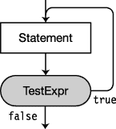

# 九、语句

### 什么是报表？

C# 中的语句与 C 和 C++中的语句非常相似。本章涵盖了 C# 语句的特征，以及该语言提供的控制流语句。

> *   *Statement* is a source code instruction that describes the type or tells the program to perform actions.
> *   There are three categories of statements:
>     *   *Declaration statement* : A statement that declares a type or variable.
>     *   *Embedded statement* : a statement that performs actions or manages control flow.
>     *   *tag statement* : the statement that controls the jump to.

前面的章节已经介绍了许多不同的声明语句，包括局部变量、类和类成员的声明。本章介绍嵌入式语句，这些语句不声明类型、变量或实例。相反，它们使用表达式和控制流构造来处理由声明语句声明的对象和变量。

> *   *Simple statement* consists of an expression followed by a semicolon.
> 
> *块*
> 
> *   Declarative statement
> *   Embedded statement
> *   Tag statement
> *   Nested block

以下代码给出了每种情况的示例:

`   int x = 10;              // Simple declaration
   int z;                   // Simple declaration

   {                        // Start of a block
      int y = 20;           // Simple declaration
      z = x + y;            // Embedded statement
   top: y = 30;             // Labeled statement
         ...
      {                     // Start of a nested block
         ...
      }                     // End of nested block
   }                        // End of outer block`

 **注意**一个块在语法上算作一个嵌入式语句。在语法上需要嵌入语句的任何地方，都可以使用块。

一个*空语句*只包含一个分号。您可以在语言语法需要嵌入语句但程序逻辑不需要任何操作的任何位置使用空语句。

例如，下面的代码显示了使用 empty 语句的示例。

> *   The second line in the code is an empty statement. This is necessary because there must be an embedded statement between the `if` part and the `else` part of the construction.
> *   The fourth line is a simple statement, indicated by a terminating semicolon.

`   if( x < y )
      ;                     // Empty statement
   else
      z = a + b;            // Simple statement`

### 表情语句

前一章看了表情。表达式返回值，但是它们也会有副作用。

> *   A side effect is an action that affects the state of the program.
> *   Many expressions are only evaluated for their side effects.

通过在表达式后放置语句终止符(分号),可以从表达式创建语句。表达式返回的任何值都将被丢弃。例如，下面的代码显示了一个表达式语句。它由赋值表达式(一个赋值运算符和两个操作数)后跟一个分号组成。这做了以下两件事:

> `x`
> 
> *这被认为是副作用。*
> 
> *   After setting the value of `x`, the expression returns the new value of `x`. But nothing can receive this return value, so it was ignored. `x = 10;`

评估表达式的全部原因是为了实现副作用。

### 控制流报表

C# 提供了现代编程语言常见的控制流结构。

> *   *Conditional execution* Execute or skip a piece of code according to conditions. The conditional execution statement is as follows:
>     *   `if`
>     *   `if...else`
>     *   `switch`
> *   *Loop statement* Repeats a piece of code. The loop statement reads as follows:
>     *   `while`
>     *   `do`
>     *   `for`
>     *   `foreach`
> *   *Jump statement* Changes the control flow from one code to a specific statement in another code. The jump statement reads as follows:
>     *   `break`
>     *   `continue`
>     *   `return`
>     *   `goto`
>     *   `throw`

条件执行和循环构造(除了`foreach`)需要一个测试表达式，或者*条件*，来决定程序应该在哪里继续执行。

 **注意**与 C 和 C++不同，在 C# 中测试表达式必须返回一个`bool`类型的值。在 C# 中，数字没有布尔解释。

### if 语句

`if`语句实现条件执行。此处显示了`if`语句的语法，并在[图 9-1](#fig_9_1) 中进行了说明。

> *   *`TestExpr`* A value of type `bool` must be calculated.
> *   If *`TestExpr`* evaluates to `true`, *`Statement`* is executed.
> *   If the evaluation is `false`, skip *`Statement`* .

`   if( *TestExpr* )
      *Statement*` 

***图 9-1。**if 语句*

以下代码显示了`if`语句的示例:

`   // With a simple statement
   if( x <= 10 )
       z = x – 1;        // Single statement--no curly braces needed

   // With a block
   if( x >= 20 )
   {
       x = x – 5;        // Block--curly braces needed
       y = x + z;
   }

   int x = 5;
   if( x )               // Error: test expression must be a bool, not int
   {
       ...
   }`

### 如果...else 语句

`if...else`语句实现了双向分支。此处显示了`if...else`语句的语法，并在[图 9-2](#fig_9_2) 中进行了说明。

> *   If *`TestExpr`* evaluates to `true`, *`Statement1`* is executed.
> *   Otherwise, perform *`Statement2`* instead.

`   if( *TestExpr* )
      *Statement1*
   else
      *Statement2*` 

***图 9-2。**如果...else 语句*

下面是一个`if...else`语句的例子:

`   if( x <= 10 )
      z = x – 1;               // Single statement
   else
   {                           // Multiple statements--block
      x = x – 5;
      y = x + z;
   }`

当然， *`Statement1`* 、 *`Statement2`* 或者两者本身都可以是`if`或者`if...else`语句，可以进一步嵌套。如果您正在查看包含嵌套的`if...else`语句的代码，并且需要确定哪个`else`与哪个`if`相配，有一个简单的规则。每个`else`都属于没有关联`else`子句的*最近的前一个* `if`。

当 *`Statement2`* 是一个`if`或`if...else`语句时，常见的格式如下所示，将第二个`if`子句与`else`子句放在同一行。这个例子展示了两个`if...else`语句，但是您可以创建一个任意长的链。

`   if( *TestExpr1* )
      *Statement1*
   else if ( *TestExpr2* )
      *Statement2*
   else
      *Statement3*`

### while 循环

`while`循环是一个简单的循环结构，其中测试表达式在循环的顶部执行。这里显示了`while`循环的语法，并在[图 9-3](#fig_9_3) 中进行了说明。

> *   Evaluate *`TestExpr`* first
> *   If *`TestExpr`* evaluates to `false`, execution will continue after the `while` loop ends.
> *   Otherwise, when *`TestExpr`* is evaluated as `true`, *`Statement`* is executed and *`TestExpr`* is evaluated again. Every time the calculation result of *`TestExpr`* is `true`, *`Statement`* will be executed once When *`TestExpr`* evaluates to `false`, the loop ends.

`   while( *TestExpr* )
      *Statement*` 

***图 9-3。**while 循环*

下面的代码展示了一个`while`循环的例子，其中测试表达式变量从值 3 开始，并在每次迭代中递减。当变量值变为 0 时，循环退出。

`   int x = 3;
   while( x > 0 )
   {
      Console.WriteLine("x:  {0}", x);
      x--;
   }
   Console.WriteLine("Out of loop");`

该代码产生以下输出:

* * *

`x:  3
x:  2
x:  1
Out of loop`

* * *

### do 循环

`do`循环是一个简单的循环结构，其中测试表达式在循环的底部执行。这里显示了`do`循环的语法，并在[图 9-4](#fig_9_4) 中进行了说明。

> *   First, *`Statement`* is executed.
> *   Then, *`TestExpr`* is evaluated.
> *   If *`TestExpr`* returns to `true`, *`Statement`* is executed again.
> *   Every time *`TestExpr`* returns to `true`, *`Statement`* is executed again.
> *   When *`TestExpr`* returns to `false`, control is transferred to the statement after the loop construction is completed.

`   do
      *Statement*
   while( *TestExpr* );             // End of do loop` 

***图 9-4。**do 循环*

`do`循环有几个特征使它区别于其他控制流结构。它们是:

> *   The main body of the loop, *`Statement`* , is always executed at least once, even if *`TestExpr`* is originally `false`. The reason is that *`TestExpr`* is not evaluated until the bottom of the loop.
> *   A semicolon is required after the closing bracket of the test expression.

以下代码显示了一个`do`循环的例子:

`   int x = 0;
   do
      Console.WriteLine("x is {0}", x++);
   while (x<3);
              ↑
           Required`

该代码产生以下输出:

* * *

`x is 0
x is 1
x is 2`

* * *

### for 循环

当测试表达式在循环的顶部求值时，只要它返回`true`,`for`循环结构就执行循环体。这里显示了`for`循环的语法，如图 9-5 中的[所示。](#fig_9_5)

> *   At the beginning of the `for` loop, *`Initializer`* is executed once.
> *   *`TestExpr`* is the later evaluation.
> *   If *`TestExpr`* returns `true`, *`Statement`* is executed, followed by *`IterationExpr`* .
> *   Control then returns to the top of the loop and evaluates *`TestExpr`* again.
> *   As long as *`TestExpr`* returns `true` *`Statement`* , followed by *`IterationExpr`* , it will be executed.
> *   Once *`TestExpr`* returns to `false`, continue to execute the statements after *`Statement`* .

`                 Separated by semicolons
                   ↓         ↓                              
   for( *Initializer*; *TestExpr*; *IterationExpr* )
      *Statement*`

语句的某些部分是可选的，其他部分是必需的。

> *   *`Initializer`* , *`TestExpr`* , *`IterationExpr`* are optional. Their positions can be left blank. If the *`TestExpr`* position is empty, the test *assumes that* `true` is returned. Therefore, if the program wants to avoid entering an infinite loop, there must be other ways to exit the statement.
> *   These semicolons are always required for field separators, even if any optional items are omitted.

***图 9-5。**for 循环*

[图 9-5](#fig_9_5) 说明了通过`for`语句的控制流程。您还应该了解其组件的以下信息:

> *   *`Initializer`* is only executed once, before any other part of `for` structure. It is usually used to declare and initialize local values to be used in loops.
> *   *`TestExpr`* is evaluated to determine whether *`Statement`* should be executed or skipped. It must calculate a value of type `bool`. As mentioned earlier, if *`TestExpr`* is empty, the assumption is always true.
> *   *`IterationExp`* R is executed immediately after *`Statement`* and before returning to the top of *`TestExpr`* cycle.

例如，在下面的代码中

> *   First, the initializer (`int i=0`) defines a variable named `i` and initializes its value to `0`.
> *   Then evaluate the condition (`i<3`). If it is `true`, then loop body is executed.
> *   At the bottom of the loop, after all the loop statements are executed, execute the *`IterationExpr`* statement-in this case, increment the value of `i`.

`   // The body of this for loop is executed three times.
   for( int i=0 ; i<3 ; i++ )
      Console.WriteLine("Inside loop.  i:  {0}", i);

   Console.WriteLine("Out of Loop");`

该代码产生以下输出:

* * *

`Inside loop.  i:  0
Inside loop.  i:  1
Inside loop.  i:  2
Out of Loop`

* * *

#### for 语句中变量的范围

在*初始化器*中声明的变量，称为*循环变量*，仅在 `for` *语句中可见*。**

> *   This is different from C and C++, where declarations introduce variables into closed blocks.
> *   The following code illustrates this point:

`   Type is needed here for declaration.
        ↓
   for(int i=0; i<10; i++ ) // Variable i is in scope here, and also
     *Statement*;             // here within the statement.
                            // Here, after the statement, i no longer exists.

   Type is needed here again because the previous variable i has gone out of existence.
       ↓
   for(int i=0; i<10; i++ ) // We need to define a new variable i here,
      *Statement*;            // the previous one has gone out of existence.`

在循环体内声明的局部变量只有在循环内才是已知的。

 **注意**循环变量通常被赋予标识符`i`、`j`或`k`。这是 FORTRAN 编程时代的传统。在 FORTRAN 中，以字母 *I* 、 *J* 、 *K* 、 *L* 、 *M* 和 *N* 开头的标识符默认为`INTEGER`类型，您不必声明它们。由于循环变量通常是整数，程序员简单地使用了简单的惯例，即使用`I`作为循环变量的名称。它简短易用，而且你不用申报。如果他们有一个嵌套循环，内部循环变量通常被命名为`J`。如果还有另一个内部嵌套循环，该变量被命名为`K`。

虽然有些人反对使用非描述性的名称作为标识符，但我喜欢历史联系，以及使用这些标识符作为循环变量时的清晰和简洁。

#### 初始值设定项和迭代表达式中的多个表达式

初始化表达式和迭代表达式都可以包含多个表达式，只要用逗号分隔。

例如，以下代码在初始值设定项中有两个变量声明，在迭代表达式中有两个表达式:

`   static void Main( )
   {
      const int MaxI = 5;

              Two declarations           Two expressions
           <ins>        ↓         </ins>           <ins>↓</ins>       for (int i = 0, j = 10; i < MaxI; i++, j += 10)
      {
         Console.WriteLine("{0}, {1}", i, j);
      }
   }`

该代码产生以下输出:

* * *

`0, 10
1, 20
2, 30
3, 40
4, 50`

* * *

### 切换语句

`switch`语句实现多路分支。[图 9-6](#fig_9_6) 显示了`switch`语句的语法和结构。

> *   The `switch` statement contains zero or more *switch segments* .
> *   Each *switch* *segment* starts with one or more *switch labels.*
> *   Each switch segment must end with a `break` statement or one of the other four jump statements.
>     *   The jump statements are `break`, `return`, `continue`, `goto` and `throw`. These will be introduced later in this chapter.
>     *   Among the five jump statements, the `break` statement is the most commonly used statement to end a `switch` paragraph. `break` statement transfers execution to the end of `switch` statement. I will discuss all jump statements later in this chapter.

开关标签按顺序进行评估。如果一个匹配测试表达式的值，它的 switch 部分被执行，然后控制跳转到`switch`语句的底部。

***图 9-6。**switch 语句的结构*

开关标签具有以下形式:

`<ins>case</ins> ConstantExpression:
  ↑                    ↑
Keyword           Switch label terminator`

图 9-6 中通过结构的控制流程如下:

> *   Test the expression *`TestExpr`* and evaluate it at the top of the construct.
> *   If the value of *`TestExpr`* is equal to the value of *`ConstExpr1`* , the constant expression in the first switch tag is executed, and then the statements in the statement list of *after the switch tag are executed until one of the jump statements is encountered.*
> *   `default` paragraph is optional, but if it is included, it must end with one of the jump statements.

[图 9-7](#fig_9_7) 说明了通过`switch`语句进行控制的一般流程。您可以通过一个带有`goto`语句或`return`语句的`switch`语句来修改流程。

***图 9-7。**通过 switch 语句控制的流程*

#### 一个开关例子

下面的代码执行了五次`switch`语句，其中`x`的值从`1`到`5`。从输出中，可以看出在循环的每个周期中执行了哪个 case 部分。

`   for( int x=1; x<6; x++ )
   {
      switch( x )                          // Evaluate the value of variable x.
      {
         case 2:                                        // If x equals 2
            Console.WriteLine("x is {0} -- In Case 2", x);
            break;                                      // Go to end of switch.

         case 5:                                        // If x equals 5
            Console.WriteLine("x is {0} -- In Case 5", x);
            break;                                      // Go to end of switch.

         default:                                       // If x is neither 2 nor 5
            Console.WriteLine("x is {0} -- In Default case", x);
            break;                                      // Go to end of switch.
      }
   }`

该代码产生以下输出:

* * *

`x is 1 -- In Default case
x is 2 -- In Case 2
x is 3 -- In Default case
x is 4 -- In Default case
x is 5 -- In Case 5`

* * *

#### 更多关于开关的语句

一个`switch`语句可以有任意数量的开关部分，包括零个。不需要`default`部分，如下例所示。但是，包含它通常被认为是一种好的做法，因为它可以捕捉潜在的错误。

例如，下面代码中的`switch`语句没有`default`部分。`switch`语句在一个`for`循环中，该循环执行该语句五次，`x`的值从`1`开始，到`5`结束。

`   for( int x=1; x<6; x++ )
   {
       switch( x )
       {
          case 5:
             Console.WriteLine("x is {0} -- In Case 5", x);
             break;
       }
   }`

该代码产生以下输出:

* * *

`x is 5 -- In Case 5`

* * *

以下代码只有默认部分:

`   for( int x=1; x<4; x++ )
   {
      switch( x )
      {
         default:
            Console.WriteLine("x is {0} -- In Default case", x);
            break;
      }
   }`

该代码产生以下输出:

* * *

`x is 1 -- In Default case
x is 2 -- In Default case
x is 3 -- In Default case`

* * *

#### 切换标签

开关标签中关键字`case`后面的表达式必须是常量表达式，因此在*编译*时，编译器必须完全可以对其求值。它还必须与测试表达式的类型相同。

例如，[图 9-8](#fig_9_8) 显示了三个示例`switch`报表。

***图 9-8。**带有不同类型开关标签的开关报表*

 **注意**与 C 和 C++不同，在 C# 中每个`switch`段，包括可选的默认段，都必须以其中一个跳转语句结束。在 C# 中，你不能在一个开关部分执行代码，然后*通过*进入下一个。

尽管 C# 不允许从一个开关部分切换到另一个开关部分，但您可以执行以下操作:

> *   You can attach multiple switch labels to any switch section.
> *   After the list of statements associated with a case, there must be a jump statement before the next switch tag, unless there is no *to insert the executable statement* between the switch tags.

例如，在下面的代码中，由于前三个开关标签之间没有可执行语句，所以一个接一个就可以了。然而，案例 5 和案例 6 之间有一个可执行语句，所以在案例 6 之前必须有一个跳转语句。

`   switch( x )
   {
      case 1:                    // Acceptable
      case 2:
      case 3:  
         ...                     // Execute this code if x equals 1, 2, or 3.
         break;
      case 5:
         y = x + 1;
      case 6:                    // Not acceptable because there is no break
         ...`

### 跳转报表

当控制流到达跳转语句时，程序执行被无条件地转移到程序的另一部分。跳转语句如下:

> *   `break`
> *   `continue`
> *   `return`
> *   `goto`
> *   `throw`

本章涵盖了这些陈述中的前四条。第 11 章的[中解释了`throw`声明。](11.html#ch11)

### break 语句

在本章的前面，你看到了在`switch`语句中使用的`break`语句。它也可用于以下语句类型:

> *   `for`
> *   `foreach`
> *   `while`
> *   `do`

在这些语句的主体中，`break`导致执行退出*最里面的封闭循环。*

例如，如果下面的`while`循环只依赖于它的测试表达式，那么它将是一个无限循环，测试表达式总是`true`。但是，在循环的三次迭代之后，遇到了`break`语句，循环被退出。

`   int x = 0;
   while( true )
   {
       x++;
       if( x >= 3 )
           break;
   }`

### 继续语句

`continue`语句使程序执行到以下类型的*最内层封闭循环*的*顶层*:

> *   `while`
> *   `do`
> *   `for`
> *   `foreach`

例如，下面的`for`循环执行五次。在前三次迭代中，它遇到了`continue`语句并直接返回到循环的顶部，错过了循环底部的`WriteLine`语句。执行仅在最后两次迭代中到达`WriteLine`语句。

`   for( int x=0; x<5; x++ )            // Execute loop five times
   {
      if( x < 3 )                      // The first three times
         continue;                     // Go directly back to top of loop

      // This line is only reached when x is 3 or greater.
      Console.WriteLine("Value of x is {0}", x);
   }`

该代码产生以下输出:

* * *

`Value of x is 3
Value of x is 4`

* * *

下面的代码展示了一个在`while`循环中的`continue`语句的例子。这段代码产生与前面的`for`循环示例相同的输出。

`   int x = 0;
   while( x < 5 )
   {
      if( x < 3 )
      {
          x++;
          continue;                         // Go back to top of loop
      }

      // This line is reached only when x is 3 or greater.
      Console.WriteLine("Value of x is {0}", x);
      x++;
   }`

### 标注报表

*带标签的语句*由一个标识符、一个冒号和一个语句组成。它具有以下形式:

`         Identifier: Statement`

执行带标签的语句时，就好像标签不存在，只包含了 *`Statement`* 部分。

> *   Tagging statements allows control to be transferred from another part of the code to statements.
> *   Tagged statements can only be used inside a block.

#### 标签

标签有自己的声明空间，因此带标签语句中的标识符可以是任何有效的标识符，包括那些可能在重叠范围内声明的标识符，如局部变量或参数名。

例如，以下代码显示了与局部变量具有相同标识符的标签的有效用法:

`   {
      int xyz = 0;                                     // Variable xyz
         ...
      xyz: Console.WriteLine("No problem.");           // Label xyz
   }`

然而，还是有一些限制。标识符不能是

> *   A keyword
> *   Same as another label identification and overlapping range

#### 标注报表的范围

带标签的语句不能从声明它们的块之外的*处看到(或访问)。带标签的语句的范围如下:*

> *   Declare as
> *   Block, nested in the block.
> 
> 内的任何块

例如，[图 9-9](#fig_9_9) 左边的代码包含了几个嵌套的块，并标记了它们的作用域。在程序的作用域 B 中声明了两个带标签的语句:`increment`和`end`。

> *   The shaded part on the right side of the figure shows the area where the markup statement is located in the code.
> *   Code in scope B, and all nested blocks, can see and access the marked statements.
> *   Code from any internal scope can jump from *to* marked statement.
> *   Code from outside (scope A in this example) *cannot jump to* a block with a tag statement.

***图 9-9。**标签的范围包括嵌套块。*

### goto 语句

`goto`语句无条件地将控制权转移给一个*标记的语句。*其一般形式如下，其中 *`Identifier`* 是被标注语句的标识符:

`         goto *Identifier* ;`

例如，下面的代码显示了一个`goto`语句的简单用法:

`   bool thingsAreFine;
   while (true)
   {
      thingsAreFine = GetNuclearReactorCondition();

      if ( thingsAreFine )
         Console.WriteLine("Things are fine.");
      else
         goto NotSoGood;
   }

   NotSoGood: Console.WriteLine("We have a problem.");`

`goto`语句必须是*在*标记语句的范围内。

> *   A `goto` statement can jump to any marked statement in its own block, or *can jump out of* to any block it is nested in.
> *   The `goto` statement cannot jump *to* any block nested within its own block.

 **警告**强烈反对使用`goto`语句，因为这会导致代码结构不良，难以调试和维护。Edsger Dijkstra 在 1968 年写给 ACM 的题为“转到被认为有害的语句”的信是对计算机科学的一个重要贡献；这是最先发表的关于使用`goto`语句的缺陷的描述之一。

#### switch 语句中的 goto 语句

还有另外两种形式的`goto`语句，在`switch`语句中使用。这些`goto`语句将控制转移到`switch`语句中相应命名的开关标签。

`   goto case ConstantExpression;
   goto default;`

### 使用语句

某些类型的非托管对象数量有限，或者占用大量系统资源。很重要的一点是，当你的代码完成后，要尽快发布它们。`using`语句有助于简化过程，并确保这些资源得到适当的处置。

*资源*是实现`System.IDisposable`接口的类或结构。接口在第 15 章中有详细介绍——但简而言之，接口是类和结构可以选择实现的未实现函数成员的集合。`IDisposable`接口包含一个名为`Dispose`的方法。

使用资源的阶段如[图 9-10](#fig_9_10) 所示，包括以下内容:

> *   Allocate resources
> *   Use resources
> *   Dispose of resources

如果在使用资源的代码部分发生意外的运行时错误，则释放资源的代码可能无法执行。

***图 9-10。**使用资源的组件*

 **注意**`using`语句不同于`using`指令。第 21 章中详细介绍了`using`指令。

#### 包装一种资源的使用

`using`语句通过巧妙地打包资源的使用，有助于减少意外运行时错误的潜在问题。

`using`语句有两种形式。第一种形式如下，如图 9-11 所示。

> *   Code in brackets allocates resources.
> *   *`Statement`* is the code for using resources.
> *   The `using` statement *implicitly generates the code of* processing resources.

`   using ( <ins>*ResourceType* *Identifier* = *Expression*</ins> ) <ins>*Statement*</ins>
                             ↑                        ↑
                         Allocates resource              Uses resource`

意外的运行时错误被称为*异常*，在[第 22 章](22.html#ch22)中有详细介绍。处理异常可能性的标准方法是将可能导致异常的代码放在`try`块中，并将*必须*执行的任何代码放在`finally`块中，无论是否有异常。

这种形式的`using`语句正是这样做的。它执行以下操作:

> *   Allocate resources
> *   Put *`Statement`* into `try` block.
> *   Create a call to the `Dispose` method of the resource and put it in the `finally` block.

***图 9-11。**using 语句的效果*

#### using 语句的例子

下面的代码使用了两次`using`语句——一次用于名为`TextWriter`的类，一次用于名为`TextReader`的类，两次都来自于`System.IO`名称空间。按照`using`语句的要求，这两个类都实现了`IDisposable`接口。

> *   `TextWriter` The resource opens a text file for writing, and writes a line into the file.
> *   `TextReader` The resource then opens the same text file and reads and displays the contents line by line.
> *   In both cases, the `using` statement ensures that the `Dispose` method of the object is called.
> *   Pay attention to the difference between `using` statement in `Main` and `using` instruction in the first two lines.

`   using System;                    // using DIRECTIVE; not using statement
   using System.IO;                 // using DIRECTIVE; not using statement

   namespace UsingStatement
   {
      class Program
      {
         static void Main( )
         {
            // using statement
            using (TextWriter tw = File.CreateText("Lincoln.txt") )
            {
               tw.WriteLine("Four score and seven years ago, ...");
            }

            // using statement
            using (TextReader tr = File.OpenText("Lincoln.txt"))
            {
               string InputString;
               while (null != (InputString = tr.ReadLine()))
                  Console.WriteLine(InputString);
            }
         }
      }
   }`

该代码产生以下输出:

* * *

`Four score and seven years ago, ...`

* * *

#### 多个资源和嵌套

`using`语句也可以用于相同类型的多个资源，用逗号分隔资源声明。语法如下:

`        Only one type         Resource        Resource
             ↓          <ins>     ↓    </ins>    <ins>     ↓      </ins>
   using ( *ResourceType* Id1 = Expr1,  Id2 = Expr2, ... ) *EmbeddedStatement*`

例如，在下面的代码中，每个`using`语句分配并使用两个资源:

`   static void Main()
   {
      using (TextWriter tw1 = File.CreateText("Lincoln.txt"),
                        tw2 = File.CreateText("Franklin.txt"))
      {
         tw1.WriteLine("Four score and seven years ago, ...");
         tw2.WriteLine("Early to bed; Early to rise ...");
      }

      using (TextReader tr1 = File.OpenText("Lincoln.txt"),
                        tr2 = File.OpenText("Franklin.txt"))
      {
         string InputString;

         while (null != (InputString = tr1.ReadLine()))
            Console.WriteLine(InputString);

         while (null != (InputString = tr2.ReadLine()))
            Console.WriteLine(InputString);
      }
   }`

`using`语句也可以嵌套。在下面的代码中，除了嵌套`using`语句之外，还要注意没有必要对第二个`using`语句使用一个块，因为它只包含一个简单的语句。

`   using ( TextWriter tw1 = File.CreateText("Lincoln.txt") )
   {
      tw1.WriteLine("Four score and seven years ago, ...");

      using ( TextWriter tw2 = File.CreateText("Franklin.txt") ) // Nested
         tw2.WriteLine("Early to bed; Early to rise ...");       // Single
   }`

#### using 语句的另一种形式

`using`语句的另一种形式如下:

`  Keyword  Resource        Uses resource
     ↓      ↓                ↓
   using ( *Expression* ) *EmbeddedStatement*`

在这种形式中，资源是在`using`语句之前声明的。

`   TextWriter tw = File.CreateText("Lincoln.txt");           // Resource declared

   using ( tw )                                              // using statement
      tw.WriteLine("Four score and seven years ago, ...");`

尽管这种形式仍然可以确保在您使用完资源后总是调用`Dispose`方法，但是它并不能防止您在`using`语句释放其非托管资源后尝试使用该资源，使其处于不一致的状态。因此，它提供的保护较少，不被鼓励。该表格如图[图 9-12](#fig_9_12) 所示。

***图 9-12。**using 语句前的资源声明*

### 其他报表

还有一些与该语言的特定特征相关的陈述。这些陈述包含在处理这些特性的章节中。其他章节中涉及的声明如[表 9-1](#tab_9_1) 所示。

