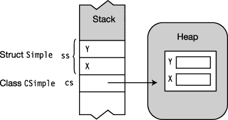
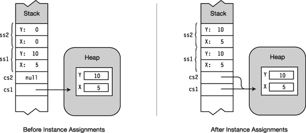
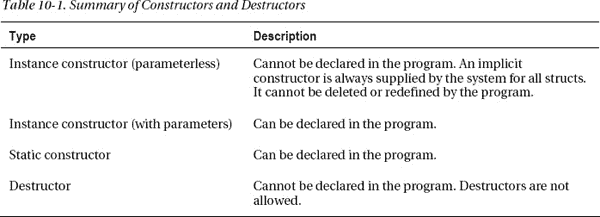

# 十、结构

### 什么是结构？

结构是程序员定义的数据类型，非常类似于类。它们有数据成员和函数成员。尽管结构类似于类，但还是有许多重要的区别。最重要的如下:

> *   Similar to reference type, structure is value type.
> *   Structures are implicitly sealed, which means that they cannot be derived from.

声明结构的语法类似于声明类的语法:

`Keyword

      ↓
   struct *StructName*
   {
      *MemberDeclarations*
   }` 

例如，下面的代码声明了一个名为`Point`的结构。它有两个公共字段，名为`X`和`Y`。在`Main`中，声明了三个结构类型为`Point`的变量，它们的值被赋值并打印出来。

`   struct Point
   {
      public int X;
      public int Y;
   }

   class Program
   {
      static void Main()
      {
         Point first, second, third;

         first.X  = 10; first.Y = 10;
         second.X = 20; second.Y = 20;
         third.X  = first.X + second.X;
         third.Y  = first.Y + second.Y;

         Console.WriteLine("first:   {0}, {1}", first.X,  first.Y);
         Console.WriteLine("second:  {0}, {1}", second.X, second.Y);
         Console.WriteLine("third:   {0}, {1}", third.X,  third.Y);
      }
   }`

这段代码产生以下输出:

* * *

`first:   10, 10
second:  20, 20
third:   30, 30`

* * *

### 结构是值类型

与所有值类型一样，结构类型的变量包含自己的数据。因此

> *   A variable of type struct cannot be `null`.
> *   Two structs variables cannot refer to the same object.

例如，下面的代码声明了一个名为`CSimple`的类，一个名为`Simple`的结构，以及它们各自的一个变量。[图 10-1](#fig_10_1) 显示了这两者在内存中是如何排列的。

`   class CSimple
   {
      public int X;
      public int Y;
   }

   struct Simple
   {
      public int X;
      public int Y;
   }

   class Program
   {
      static void Main()
      {
         CSimple cs = new CSimple();
         Simple  ss = new Simple();
            ...` 

***图 10-1** 。类与结构的内存排列*

### 分配给一个结构

将一个结构赋给另一个结构会将值从一个结构复制到另一个结构。这与从类变量复制截然不同，后者只复制引用。

[图 10-2](#fig_10_2) 显示了类变量和结构变量赋值的区别。注意，在类赋值之后，`cs2`指向堆中与`cs1`相同的对象。但是在 struct 赋值之后，`ss2`成员的值是那些在`ss1`中的值的副本。

`   class CSimple
   { public int X; public int Y; }

   struct Simple
   { public int X; public int Y; }

   class Program
   {
      static void Main()
      {
         CSimple cs1 = new CSimple(), cs2 = null;          // Class instances
         Simple  ss1 = new Simple(),  ss2 = new Simple();  // Struct instances

         cs1.X = ss1.X = 5;                  // Assign 5 to ss1.X and cs1.X.
         cs1.Y = ss1.Y = 10;                 // Assign 10 to ss1.Y and cs1.Y.

         cs2 = cs1;                          // Assign class instance.
         ss2 = ss1;                          // Assign struct instance.
      }
   }` 

***图 10-2** 。分配一个类变量和一个结构变量*

### 构造函数和析构函数

结构可以有实例和静态构造函数，但不允许析构函数。

#### 实例构造函数

该语言隐式地为每个结构提供了一个无参数的构造函数。此构造函数将结构的每个成员设置为该类型的默认值。值成员被设置为其默认值。参考成员被设置为`null`。

每个结构都有预定义的无参数构造函数，您不能删除或重定义它。但是，您可以创建额外的构造函数，只要它们有参数。请注意，这与类不同。对于类，只有当没有其他构造函数被声明时，编译器才会提供一个隐式的无参数构造函数*。*

要调用一个构造函数，包括隐式的无参数构造函数，使用`new`操作符。注意，即使内存不是从堆中分配的，也使用了`new`操作符。

例如，下面的代码声明了一个简单的 struct，其构造函数带有两个`int`参数。`Main`创建该结构的两个实例——一个使用隐式无参数构造函数，另一个使用声明的双参数构造函数。

`   struct Simple
   {
      public int X;
      public int Y;

      public Simple(int a, int b)             // Constructor with parameters
      {
         X = a;
         Y = b;
      }
   }

   class Program
   {
      static void Main()
      {              Call implicit constructor
                         <ins>↓</ins>          Simple s1 = new Simple();
         Simple s2 = new <ins>Simple(5, 10)</ins>;
                              ↑
                         Call constructor
         Console.WriteLine("{0},{1}", s1.X, s1.Y);
         Console.WriteLine("{0},{1}", s2.X, s2.Y);
      }
   }`

你也可以不使用`new`操作符来创建一个结构的实例。但是，如果这样做，会有一些限制，如下所示:

> *   The values of data members cannot be used unless explicitly set.
> *   You can't call *any* function members of this structure until *all* data members are assigned values.

例如，下面的代码显示了在没有使用`new`操作符的情况下创建的 struct `Simple`的两个实例。当试图在没有显式设置数据成员值的情况下访问`s1`时，编译器会产生一条错误消息。在给其成员赋值后，从`s2`中读取没有问题。

`struct Simple
   {
      public int X;
      public int Y;
   }

   class Program
   {
      static void Main()
      {
            No constructor calls
                ↓   ↓
         Simple s1, s2;
         Console.WriteLine("{0},{1}", <ins>s1.X</ins>, <ins>s1.Y)</ins>;              // Compiler error
                                       ↑      ↑
         s2.X = 5;                   Not yet assigned
         s2.Y = 10;
         Console.WriteLine("{0},{1}", s2.X, s2.Y);              // OK
      }
   }` 

#### 静态构造函数

与类一样，结构的静态构造函数创建并初始化静态数据成员，不能引用实例成员。结构的静态构造函数遵循与类相同的规则。

在以下两个操作中的第一个操作之前调用静态构造函数:

> *   Call an explicitly declared constructor.
> *   A static member of a reference structure

#### 构造函数和析构函数概要

### 不允许字段初始值设定项

结构声明中不允许字段初始值设定项，如下面的代码所示:

`   struct Simple
   {            Not allowed
                   <ins> ↓  </ins>
      public int x = 0;                // Compile error
      public int y <ins>= 10</ins>;               // Compile error
   }
                    ↑
                 Not  allowed`

### 结构是密封的

结构总是隐式密封的，因此不能从它们派生其他结构。

由于结构不支持继承，对结构成员使用几个类成员修饰符没有意义；因此，不能在它们的声明中使用它们。不能与结构一起使用的修饰符如下:

> *   `protected`
> *   inside
> *   abstract
> *   `virtual`

结构本身是从`System.ValueType`派生出来的，而`System.ValueType`又是从`object`派生出来的。

当创建一个与基类`System.ValueType`成员同名的成员时，你*可以*对结构成员使用的两个继承相关的关键字是`new`和`override`修饰符，所有的结构都是从基类【】派生的。

### 装箱和拆箱

与其他值类型数据一样，如果要将 struct 实例用作引用类型对象，则必须进行装箱复制。装箱是制作值类型变量的引用类型副本的过程。装箱和拆箱在[第 16 章](16.html#ch16)中有详细解释。

### 结构体作为返回值和参数

结构可以用作返回值和参数。

> *   *Return value* : When struct is the return value, create a copy and return it from the function member.
> *   Parameter: when a struct is used as Value parameter, a copy of the actual parameter struct is created. This copy is used for the execution of the method.
> *   `ref` *and* `out` *Parameters* : If a structure is used as a `ref` or `out` parameter, the reference to the structure will be passed to the method so that the data member can be changed.

### 关于结构的附加信息

分配结构比创建类的实例需要更少的开销，所以使用结构而不是类有时可以提高性能——但是要小心装箱和拆箱的高成本。

最后，关于结构，您应该知道的最后一些事情如下:

> *   Predefined simple types (`int`, `short`, `long`, etc.), although in. NET and C# are actually all in. NET as a structure.
> *   You can declare the `partial` structure as you declare the `partial` class, as described in Chapter 6 of [.](06.html#ch6)

像类一样，结构也可以实现接口，这将在第 15 章中讨论。