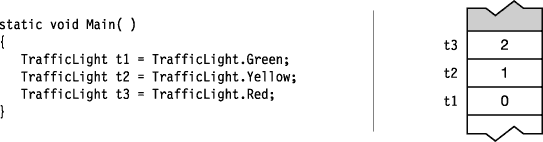
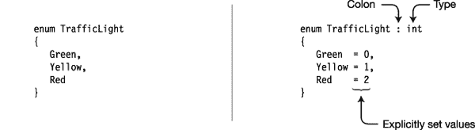
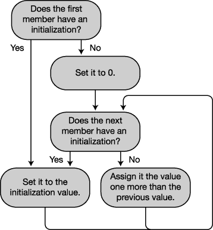
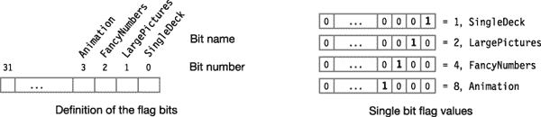
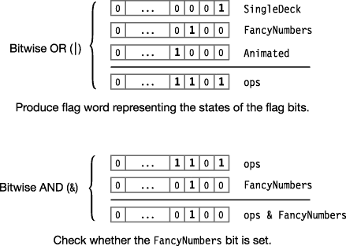

# 十一、枚举

### 枚举

枚举是程序员定义的类型，如类或结构。

> 像结构一样，枚举是值类型，因此直接存储它们的数据，而不是用引用和数据分开存储。*   Enumeration has only one member type: named constants with integer values.

下面的代码展示了一个名为`TrafficLight`的新枚举类型的声明示例，它包含三个成员。请注意，成员声明列表是一个逗号分隔的列表；枚举声明中没有分号。

`  Keyword      Enum name
     ↓        ↓
    enum TrafficLight
    {
       Green,   ←  Comma separated—no semicolons
       Yellow,  ←  Comma separated—no semicolons
       Red
    }`

每个枚举类型都有一个底层整数类型，默认情况下是`int`。

> *   Each enumeration member is assigned a constant value of the underlying type.
> *   By default, the compiler assigns `0` to the first member, and gives each subsequent member a value greater than the value of the previous member by 1.

例如，在`TrafficLight`类型中，编译器将`int`值`0`、`1`和`2`分别赋给成员`Green`、`Yellow`和`Red`。在下面代码的输出中，您可以通过将底层成员值转换为类型`int`来查看它们。[图 11-1](#fig_11_1) 显示了它们在堆栈上的排列。

`   TrafficLight t1 = TrafficLight.Green;
   TrafficLight t2 = TrafficLight.Yellow;
   TrafficLight t3 = TrafficLight.Red;

   Console.WriteLine("{0},\t{1}",   t1, (int) t1);
   Console.WriteLine("{0},\t{1}",   t2, (int) t2);
   Console.WriteLine("{0},\t{1}\n", t3, <ins>(int)</ins> t3);
                                          ↑
                                       Cast to int`

这段代码产生以下输出:

* * *

`Green,  0
Yellow, 1
Red,    2`

* * *

***图 11-1** 。枚举的成员常数由基础整数值表示。*

可以将枚举值赋给枚举类型的变量。例如，下面的代码显示了三个类型为`TrafficLight`的变量的声明。请注意，您可以将成员文字赋给变量，也可以从同类型的另一个变量中复制值。

`class Program
   {
      static void Main()
      {
              Type   Variable     Member
               ↓       ↓   <ins>        ↓       </ins>
         TrafficLight t1 = TrafficLight.Red;        // Assign from member
         TrafficLight t2 = TrafficLight.Green;      // Assign from member
         TrafficLight t3 = t2;                      // Assign from variable

         Console.WriteLine(t1);
         Console.WriteLine(t2);
         Console.WriteLine(t3);
      }
   }` 

这段代码产生以下输出。请注意，成员名称被打印为字符串。

* * *

`Red
Green
Green`

* * *

#### 设置底层类型和显式值

通过在枚举名后面加上冒号和类型名，可以使用除了`int`之外的整数类型。该类型可以是任何整数类型。所有成员常量都是枚举的基础类型。

`                   Colon
                     ↓
   enum TrafficLight : ulong
   {                     ↑
      ...           Underlying type`

成员常量的值可以是基础类型的任何值。若要显式设置成员的值，请在枚举声明中在其名称后使用初始值设定项。可以有重复的值，但不能有重复的名称，如下所示:

`   enum TrafficLight
   {
      Green  = 10,
      Yellow = 15,                 // Duplicate values
      Red    = 15                  // Duplicate values
   }`

例如，图 11-2 中的代码显示了枚举`TrafficLight`的两个等价声明。

> *   The code on the left accepts the default type and number.
> *   The code on the right explicitly sets the underlying type to `int` and sets the member to the value corresponding to the default value.

***图 11-2** 。等效枚举声明*

#### 隐含成员编号

您可以显式地为任何成员常量赋值。如果不初始化成员常量，编译器会隐式地给它赋值。图 11-3 展示了编译器用来分配这些值的规则。

> *   The values associated with member names need not be different.

***图 11-3** 。分配成员值的算法*

例如，下面的代码声明了两个枚举。`CardSuit`接受成员的隐式编号，如注释中所示。`FaceCards`显式设置一些成员，并接受其他成员的隐式编号。

`   enum CardSuit
   {
       Hearts,                   // 0  - Since this is first
       Clubs,                    // 1  - One more than the previous one
       Diamonds,                 // 2  - One more than the previous one
       Spades,                   // 3  - One more than the previous one
       MaxSuits                  // 4  - A common way to assign a constant
   }                             //      to the number of listed items

   enum FaceCards
   {
       // Member                 // Value assigned
       Jack              = 11,   // 11 - Explicitly set
       Queen,                    // 12 - One more than the previous one
       King,                     // 13 - One more than the previous one
       Ace,                      // 14 - One more than the previous one
       NumberOfFaceCards = 4,    // 4  - Explicitly set
       SomeOtherValue,           // 5  - One more than the previous one
       HighestFaceCard   = Ace   // 14 - Ace is defined above
   }`

### 位标志

程序员长期以来使用单个字中的不同位作为表示一组开/关标志的简洁方式。在本节中，我将把这个单词称为*标志单词*。枚举提供了实现这一点的便捷方式。

一般步骤如下:

> 1.  Determine how many bit flags you need, and choose an unsigned integer type with enough bits to save them.
> 2.  Determine what each bit represents and name it. Declares an enumeration of the selected integer type, each member being represented by a bit position.
> 3.  Use the bitwise OR operator to set the appropriate bit in the word that holds the bit flag.
> 4.  Then, you can check whether a specific bit flag is set by using the `HasFlag` method or the bitwise AND operator.

例如，下面的代码显示了代表纸牌游戏中一副纸牌的选项的枚举声明。底层类型`uint`足以容纳所需的四个位标志。请注意以下关于代码的内容:

> *   Members have names that represent binary options.
>     *   Each option is represented by a specific bit position in the word. The bit position remains 0 or 1.
>     *   You don't want to use 0 as a member value because the bit flag represents a set of bits that are either on or off. It already has a meaning-all bit flags are turned off.
> *   In hexadecimal notation, each hexadecimal digit represents exactly four digits. Because of this direct relationship between bit pattern and hexadecimal representation, when using bit pattern, hexadecimal representation is usually used instead of decimal representation.
> *   In fact, it is not necessary to decorate enumeration with `Flags` attribute, but it provides some extra convenience, which I will discuss soon. Property is displayed as a string in square brackets, just before the language construction. In this case, the attribute immediately precedes the enumeration declaration. I will talk about attributes in Chapter 24.

`   [Flags]
   enum CardDeckSettings : uint
   {
      SingleDeck    = 0x01,            // Bit 0
      LargePictures = 0x02,            // Bit 1
      FancyNumbers  = 0x04,            // Bit 2
      Animation     = 0x08             // Bit 3
   }`

[图 11-4](#fig_11_4) 说明了这种枚举。

***图 11-4** 。标志位的定义(左)，以及它们各自的表示(右)*

要创建具有适当位标志的单词，请声明一个枚举类型的变量，并使用按位 OR 运算符来设置所需的位。例如，下面的代码设置了标志字中四个选项中的三个:

`Enum type     Flag word       Bit flags ORed together
          ↓           ↓       <ins>         ↓                 </ins>
   CardDeckSettings ops =    CardDeckSettings.SingleDeck
                           | CardDeckSettings.FancyNumbers
                           | CardDeckSettings.Animation ;` 

要检查标志字是否设置了特定的位标志，可以使用 enum 类型的 Boolean `HasFlag`方法。您对标志字调用`HasFlag`方法，传入您正在检查的位标志，如下面的代码行所示。如果设置了指定的位标志，`HasFlag`返回`true`；否则，它返回`false`。

`   bool useFancyNumbers = ops.HasFlag(<ins>CardDeckSettings.FancyNumbers</ins>);
                           ↑                         ↑
                        Flag word                    Bit flag`

`HasFlag`方法也可以检查多个位标志。例如，以下代码检查标志字`ops`是否同时设置了`Animation`和`FancyNumbers`位。该代码执行以下操作:

> *   The first statement creates a test word instance called `testFlags` with `Animation` and `FancyNumbers` bits set. It then passes `testFlags` as a parameter to the `HasFlag` method.
> *   `HasFlags` Check whether all flags set in the *test word are also set in the flag word `ops`. If yes, then `HasFlag` returns to `true`. Otherwise, return to `false`.*

`   CardDeckSettings testFlags =
               CardDeckSettings.Animation | CardDeckSettings.FancyNumbers;

   bool useAnimationAndFancyNumbers = ops.HasFlag( testFlags );
                                       ↑                ↑
                                    Flag word           Test word`

确定是否设置了一个或多个特定位的另一种方法是使用按位 AND 运算符。例如，像上面的代码一样，下面的代码检查一个标志字，以查看是否设置了`FancyNumbers`位标志。这是通过将标志字与位标志进行“与”运算，然后将结果与位标志进行比较来实现的。如果该位是在原始标志字中设置的，那么 AND 运算的结果将具有与位标志相同的位模式。

`   bool useFancyNumbers =
        (ops & <ins>CardDeckSettings.FancyNumbers</ins>) == CardDeckSettings.FancyNumbers;
          ↑                   ↑
       Flag word           Bit flag`

[图 11-5](#fig_11_5) 说明了创建标志字，然后使用按位 and 运算来确定特定位是否被置位的过程。

***图 11-5** 。产生一个标志字并检查它是否有特定的位标志*

#### 旗帜属性

前面的代码在声明枚举之前使用了`Flags`属性，如下所示:

`   [Flags]
   enum CardDeckSettings : uint
   {
      ...
   }`

`Flags`属性根本不会改变计算。然而，它确实提供了几个方便的特性。首先，它通知编译器、对象浏览器和其他查看代码的工具，枚举的成员应该作为位标志组合在一起，而不是仅作为单独的值使用。这允许浏览器更恰当地解释枚举类型的变量。

其次，它允许枚举的`ToString`方法为位标志的值提供更合适的格式。`ToString`方法获取一个枚举值，并将其与该枚举的常量成员的值进行比较。如果匹配其中一个成员，`ToString`返回该成员的字符串名称。

例如，检查下面的代码，其中枚举前面没有`Flags`属性。

`   enum CardDeckSettings : uint
   {
      SingleDeck     = 0x01,        // bit 0
      LargePictures  = 0x02,        // bit 1
      FancyNumbers   = 0x04,        // bit 2
      Animation      = 0x08         // bit 3
   }

   class Program
   {
      static void Main( )
      {
         CardDeckSettings ops;

         ops = CardDeckSettings.FancyNumbers;                   // Set one flag.
         Console.WriteLine( ops.ToString() );
                                                                // Set two bit flags.
         ops = CardDeckSettings.FancyNumbers | CardDeckSettings.Animation;
         Console.WriteLine( ops.ToString() );                   // Print what?
      }
   }`

该代码产生以下输出:

* * *

`FancyNumbers
12`

* * *

在这段代码中，方法`Main`执行以下操作:

> *   Create a variable of enumeration type `CardDeckSettings`, set a bit flag of it, and print out the value of the variable, namely the value `FancyNumbers`
> *   Give the variable a new value, which consists of two set bit flags, and print out its value-12.

作为第二次赋值的结果显示的值`12`是作为`int`的`ops`的值，因为`FancyNumbers`为值`4`设置位，而`Animation`为值`8`设置位，从而给出值`12`的`int`。在赋值后的`WriteLine`方法中，当`ToString`方法试图查找值为`12`的枚举成员的名称时，它发现不存在具有该值的成员——所以它只是打印出该值。

然而，如果我们要在声明枚举之前添加回`Flags`属性，这将告诉`ToString`方法可以单独考虑这些位。在查找该值时，`ToString`会发现`12`对应于两个单独的位标志成员——`FancyNumbers`和`Animation`——并会返回包含他们名字的字符串，用逗号和空格分隔。下面显示了使用`Flags`属性再次运行代码的结果:

* * *

`FancyNumbers
FancyNumbers, Animation`

* * *

#### 使用位标志的例子

以下代码将使用位标志的所有部分放在一起:

`[Flags]
   enum CardDeckSettings : uint
   {
      SingleDeck     = 0x01,        // bit 0
      LargePictures  = 0x02,        // bit 1
      FancyNumbers   = 0x04,        // bit 2
      Animation      = 0x08         // bit 3
   }

   class MyClass
   {
      bool UseSingleDeck               = false,
           UseBigPics                  = false,
           UseFancyNumbers             = false,
           UseAnimation                = false,
           UseAnimationAndFancyNumbers = false;

      public void SetOptions( CardDeckSettings ops )
      {
         UseSingleDeck     = ops.HasFlag( CardDeckSettings.SingleDeck );
         UseBigPics        = ops.HasFlag( CardDeckSettings.LargePictures );
         UseFancyNumbers   = ops.HasFlag( CardDeckSettings.FancyNumbers );
         UseAnimation      = ops.HasFlag( CardDeckSettings.Animation );

         CardDeckSettings testFlags =
                     CardDeckSettings.Animation | CardDeckSettings.FancyNumbers;
         UseAnimationAndFancyNumbers = ops.HasFlag( testFlags );
      }

      public void PrintOptions( )
      {
         Console.WriteLine( "Option settings:" );
         Console.WriteLine( "  Use Single Deck                 - {0}", UseSingleDeck );
         Console.WriteLine( "  Use Large Pictures              - {0}", UseBigPics );
         Console.WriteLine( "  Use Fancy Numbers               - {0}", UseFancyNumbers );
         Console.WriteLine( "  Show Animation                  - {0}", UseAnimation );
         Console.WriteLine( "  Show Animation and FancyNumbers - {0}",
                                                           UseAnimationAndFancyNumbers );
      }
   }
                                                                                         ` `   class Program
   {
      static void Main( )
      {
         MyClass mc = new MyClass( );
         CardDeckSettings ops = CardDeckSettings.SingleDeck
                                | CardDeckSettings.FancyNumbers
                                | CardDeckSettings.Animation;
         mc.SetOptions( ops );
         mc.PrintOptions( );
      }
   }`

该代码产生以下输出:

* * *

`Option settings:
  Use Single Deck                 - True
  Use Large Pictures              - False
  Use Fancy Numbers               - True
  Show Animation                  - True
  Show Animation and FancyNumbers - True`

* * *

### 更多关于枚举

枚举只有一种成员类型:声明的成员常量。

> *   You cannot use modifiers on members. They all implicitly have the same accessibility as enumeration.
> *   Members are `static`, as you will remember, which means that even if there are no variables of enumerated type, they are accessible. As with all statics, use the type name followed by a dot and a member name to use members.

例如，下面的代码没有创建任何 enum `TrafficLight`类型的变量，但是因为成员是静态的，所以可以使用`WriteLine`访问和打印它们。

`   static void Main()
   {
      Console.WriteLine("{0}", TrafficLight.Green);
      Console.WriteLine("{0}", TrafficLight.Yellow);
      Console.WriteLine("{0}", TrafficLight.Red);
   }
                                     ↑        ↑
                                Enum name   Member name`

枚举是一种独特的类型。比较不同枚举类型的枚举成员会导致编译时错误。例如，下面的代码声明了两个不同的枚举类型，它们具有完全相同的结构和成员名称。

> *   The first `if` statement is good because it compares different members from the same enumeration type.
> *   The second `if` statement generates an error because it attempts to compare members from different enumeration types. This error occurs even if the structure and member names are identical.

`enum FirstEnum                        // First enum type
   {
      Mem1,
      Mem2
   }

   enum SecondEnum                        // Second enum type
   {
      Mem1,
      Mem2
   }` `   class Program
   {
      static void Main()
      {
         if (FirstEnum.Mem1 < FirstEnum.Mem2)  // OK--members of same enum type
            Console.WriteLine("True");

         if (FirstEnum.Mem1 < SecondEnum.Mem1) // Error--different enum types
            Console.WriteLine("True");
      }
   }`

还有几个有用的方法 .NET `Enum`类型，`enum`基于该类型:

> *   `GetName` The method accepts an enumeration type object and an integer, and returns the name of the corresponding enumeration member.
> *   `GetNames` The method accepts an enumeration type object and returns the names of all members in the enumeration.

下面的代码显示了正在使用的每种方法的示例。注意，您必须使用`typeof`操作符来获取枚举类型对象。

`   enum TrafficLight
   {
      Green,
      Yellow,
      Red
   }

   class Program
   {
      static void Main()
      {
         Console.WriteLine( "Second member of TrafficLight is {0}\n",
                              Enum.GetName( typeof( TrafficLight ), 1 ) );

         foreach ( var name in Enum.GetNames( typeof( TrafficLight ) ) )
            Console.WriteLine( name );
      }
   }`

该代码产生以下输出:

* * *

`Second member of TrafficLight is Yellow

Green
Yellow
Red`

* * *