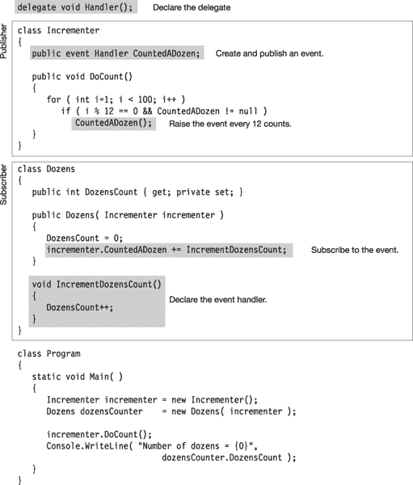

# 十四、事件

### 发布者和订阅者

许多程序中的一个常见需求是，当一个特定的程序事件发生时，程序的其他部分需要被通知该事件已经发生。

满足这个需求的一种模式叫做*发布者/订阅者模式*。在这种模式中，一个名为*发布者*的类定义了一组程序的其他部分可能感兴趣的事件。当这些事件发生时，其他类可以“注册”得到发布者的通知。这些*订阅者*类通过向发布者提供一个方法来“注册”通知。当事件发生时，发布者“引发事件”，订阅者提交的所有方法都被执行。

订阅者提供的方法被称为*回调方法*，因为发布者通过执行它们的方法“回调订阅者”。它们也被称为*事件处理程序*，因为它们是被调用来处理事件的代码。[图 14-1](#fig_14_1) 展示了这个过程，显示了一个事件的发布者和该事件的三个订阅者。

***图 14-1** 。发布者和订阅者*

以下是一些与事件相关的重要术语:

*   *Publisher:* 发布事件的类或结构，以便在事件发生时通知其他类。
*   *Subscriber* :一个类或结构，当事件发生时，它注册以得到通知。
*   *事件处理程序*:由订阅者向发布者注册的方法，当发布者引发事件时执行。事件处理程序方法可以在与事件相同的类或结构中声明，也可以在不同的类或结构中声明。
*   *引发事件*:是*调用*或*触发*事件的术语。当引发一个事件时，所有用该事件注册的方法都会被调用。

前一章讨论了代表。事件的许多方面与代表的相似。事实上，事件就像一个更简单的委托，专门用于特定的用途。代表和事件的行为有很好的相似性。一个事件包含一个私有委托，如图[图 14-2](#fig_14_2) 所示。

关于事件的私人代表，需要了解的重要事项如下:

*   一个*事件*给出了对其私有控制的委托的结构化访问。也就是说，您不能直接访问该委托。
*   可用的操作比委托少。对于事件，您只能添加和移除事件处理程序，以及调用事件。
*   当事件被引发时，它调用委托，委托依次调用其调用列表中的方法。

注意在[图 14-2](#fig_14_2) 中，只有`+=`和`-=`操作符突出到事件框的左侧。这是因为它们是事件上唯一允许的操作(除了调用事件本身)。

***图 14-2。**一个事件有一个封装的委托。*

图 14-3 展示了一个名为`Incrementer`的程序，它执行某种计数。

*   `Incrementer`定义了一个名为`CountedADozen`的事件，每当它计算另外十几个项目时就会引发这个事件。
*   订户类`Dozens`和`SomeOtherClass`都有一个用`CountedADozen`事件注册的事件处理程序。
*   每次引发事件时，都会调用处理程序。

***图 14-3。**一个事件类的结构和术语*

### 源代码组件概述

使用事件需要五段代码。这些在[图 14-4](#fig_14_4) 中进行了说明。我将在接下来的章节中逐一介绍它们。这些代码如下所示:

*   *委托类型声明*:事件和事件处理程序必须有共同的签名和返回类型，由委托类型描述。
*   *事件处理程序声明*:这些是订阅者类中的声明，当事件被引发时，这些方法将被执行。这些不必是显式命名的方法；它们也可以是匿名方法或 lambda 表达式，如[第 13 章](13.html)所述。
*   *事件声明:*发布者类必须声明一个订阅者可以注册的事件成员。当一个类声明了一个`public`事件时，就说是*发布了事件*。
*   *事件注册*:订阅者必须注册一个事件，以便在事件发生时得到通知。这是将事件处理程序连接到事件的代码。
*   *引发事件*的代码:这是发布者中“激发”事件的代码，导致它调用所有向它注册的事件处理程序。

***图 14-4。**使用事件的五个源代码组件*

### 宣告一个事件

发布者必须提供事件对象。创建事件很简单——它只需要一个委托类型和一个名称。事件声明的语法如下面的代码所示，它声明了一个名为`CountedADozen`的事件。请注意关于事件`CountedADozen`的以下内容:

*   事件是在类中声明的。
*   它需要委托类型的名称。任何附加到事件的事件处理程序(即注册到事件)都必须在签名和返回类型上与委托类型相匹配。
*   它被声明为`public`，以便其他类和结构可以向它注册事件处理程序。
*   您不能对事件使用对象创建表达式(一个`new`表达式)。

`   class Incrementer
   {                      Keyword                            Name of event
                                          ↓                                           ↓      
      public event EventHandler CountedADozen;
                                                   ↑  
                                          Delegate type`

通过使用逗号分隔的列表，可以在声明语句中声明多个事件。例如，以下语句声明了三个事件:

`   public event EventHandler <ins>MyEvent1, MyEvent2, OtherEvent</ins>;
                                                                                                ↑
                                                                                     Three events`

您还可以通过包含`static`关键字使事件成为静态的，如下面的声明所示:

`public static event EventHandler CountedADozen;
                         ↑                           
                     Keyword` 

#### 一个事件是一个成员

一个常见的错误是认为事件是一种类型，但事实并非如此。像方法或属性一样，事件是类或结构的*成员，这有几个重要的分支:*

*   因为事件是成员
    *   不能在可执行代码块中声明事件。
    *   它必须在类或结构中用其他成员声明。
*   事件成员与其他成员一起被隐式地自动初始化为`null`。

要声明一个事件，您必须提供一个*委托类型*的名称。您可以声明一个或者使用一个已经存在的。如果声明委托类型，它必须指定将由事件注册的方法的签名和返回类型。

BCL 声明了一个名为`EventHandler`的委托，专门用于系统事件。我将在本章的后面描述`EventHandler`委托。

### 订阅一个事件

订阅者向事件添加事件处理程序。对于要添加到事件中的事件处理程序，该处理程序必须与事件的委托具有相同的返回类型和签名。

*   使用+=运算符向事件添加事件处理程序，如下面的代码所示。事件处理程序放在操作符的右边。
*   事件处理程序规范可以是以下任何一种:
    *   实例方法的名称
    *   静态方法的名称
    *   匿名方法
    *   λ表达式

例如，下面的代码向事件`CountedADozen`添加了三个方法。第一个是实例方法。第二种是静态方法。第三种是实例方法，使用委托形式。

`       Class instance                                           Instance method
               ↓                                                                ↓                  
   incrementer.CountedADozen += IncrementDozensCount;        // Method reference form
   incrementer.CountedADozen += <ins>ClassB.CounterHandlerB</ins>;      // Method reference form
                                         ↑                                           ↑  
                              Event member                           Static method
   mc.CountedADozen += new EventHandler(cc.CounterHandlerC);  // Delegate form`

就像委托一样，您可以使用匿名方法和 lambda 表达式来添加事件处理程序。例如，下面的代码首先使用 lambda 表达式，然后使用匿名方法。

`   // Lambda expression
   incrementer.CountedADozen += () => DozensCount++;

   // Anonymous method
   incrementer.CountedADozen += delegate { DozensCount++; };`

### 引发一个事件

事件成员本身只保存需要调用的事件处理程序。除非引发事件，否则它们不会发生任何事情。您需要确保在适当的时候有代码可以做到这一点。

例如，以下代码引发事件`CountedADozen`。请注意以下关于代码的内容:

*   在引发事件之前，代码将它与`null`进行比较，看它是否包含任何事件处理程序。如果事件为`null`，则为空，无法执行。
*   引发事件的语法与调用方法的语法相同:
    *   使用事件的名称，后跟用括号括起来的参数列表。
    *   参数列表必须与事件的委托类型匹配。

`   if (CountedADozen != null)              // Make sure there are methods to execute.
      CountedADozen (<ins>source, args</ins>);        // Raise the event.
                   ↑                           ↑  
    Event name                   Parameter list`

将事件声明和引发事件的代码放在一起，为发布者提供了以下类声明。代码包含两个成员:事件和一个名为`DoCount`的方法，该方法在适当的时候引发事件。

`   class Incrementer
   {
      public event EventHandler CountedADozen;   // Declare the event.

      void DoCount(object source, EventArgs args)
      {
         for( int i=1; i < 100; i++ )
            if( i % 12 == 0 )
               if (CountedADozen != null)       // Make sure there are methods to execute.
                  <ins>CountedADozen(source, args)</ins>;
      }                                           ↑
                                             Raise the event.
   }`

[图 14-5](#fig_14_5) 中的代码显示了整个程序，发布者类`Incrementer`和订阅者类`Dozens`。关于代码需要注意的事项如下:

*   在其构造函数中，类`Dozens`订阅事件，提供方法`IncrementDozensCount`作为其事件处理程序。
*   在类`Incrementer`的方法`DoCount`中，每当该方法再增加 12 次时，就会引发事件`CountedADozen`。

***图 14-5。**一个完整的程序，有一个发布者和一个订阅者，展示了使用一个事件*所需的五段代码

图 14-5 中的代码产生以下输出:

* * *

`Number of dozens = 8`

* * *

### 标准事件用法

GUI 编程是事件驱动的，这意味着当程序运行时，它可以随时被诸如按钮点击、按键或系统定时器之类的事件中断。当这种情况发生时，程序需要处理事件，然后继续它的进程。

显然，这种程序事件的异步处理是使用 C# 事件的最佳场合。Windows GUI 编程广泛使用事件，因此有一个标准 .NET 框架模式来使用它们。事件使用的标准模式的基础是在`System`名称空间中声明的`EventHandler`委托类型。下面一行代码显示了`EventHandler`委托类型的声明。关于声明需要注意的事项如下:

*   第一个参数用于保存对引发事件的对象的引用。它的类型是`object`，因此可以匹配任何类型的任何实例。
*   第二个参数用于保存适用于应用的任何类型的状态信息。
*   返回类型为`void`。

`   public delegate void EventHandler(object sender, EventArgs e);`

`EventHandler`委托类型中的第二个参数是类`EventArgs`的一个对象，它在`System`命名空间中声明。您可能会想，既然第二个参数是用来传递数据的，那么一个`EventArgs`类对象应该能够存储某种类型的数据。你就错了。

*   `EventArgs`类被设计成不携带数据。它用于不需要传递数据的事件处理程序，通常被它们忽略。
*   如果你想传递数据，你必须声明一个从`EventArgs`派生出的类*，用适当的字段来保存你想传递的数据。*

尽管`EventArgs`类实际上并不传递数据，但它是使用`EventHandler`委托模式的重要组成部分。这些类型为`object`和`EventArgs`的参数是用作参数的任何实际类型的基类。这允许`EventHandler`委托提供一个签名，它是所有事件和事件处理程序的最小公分母，允许所有事件正好有两个参数，而不是每个事件有不同的签名。

如果我们修改`Incrementer`程序来使用`EventHandler`委托，我们就有了如图[图 14-6](#fig_14_6) 所示的程序。请注意以下关于代码的内容:

*   委托`Handler`的声明已被删除，因为事件使用系统定义的`EventHandler`委托。
*   subscriber 类中事件处理程序声明的签名必须与事件委托的签名(和返回类型)相匹配，事件委托现在使用类型为`object`和`EventArgs`的参数。在事件处理程序`IncrementDozensCount`的情况下，该方法只是忽略了形式参数。
*   引发事件的代码必须使用适当参数类型的对象来调用事件。

***图 14-6。**increment er 程序修改为使用系统定义的 EventHandler 委托*

#### 通过扩展 EventArgs 传递数据

要在事件处理程序的第二个参数中传递数据并遵守标准约定，您需要声明一个从`EventArgs`派生的自定义类，它可以存储您需要传递的数据。类名应该以`EventArgs`结尾。例如，下面的代码声明了一个自定义类，它可以在名为`Message`的字段中存储一个字符串:

`                                    Custom class name              Base class
                                                  ↓                                ↓   
   public class IncrementerEventArgs : EventArgs
   {
      public int IterationCount { get; set; }  // Stores an integer
   }`

现在，您已经有了一个用于在事件处理程序的第二个参数中传递数据的自定义类，您需要一个使用新自定义类的委托类型。要实现这一点，请使用委托的通用版本`EventHandler<>`。第 17 章详细介绍了 C# 泛型，所以现在你只能看着。若要使用泛型委托，请执行下列操作，如后续代码所示:

*   将自定义类的名称放在尖括号之间。
*   在应该使用自定义委托类型名称的地方使用整个字符串。例如，`event`声明应该是这样的:

`                                       Generic delegate using custom class
                                 <ins>                                ↓                               </ins>
   public event EventHandler<IncrementerEventArgs> CountedADozen;
                                                                                                                           ↑             
                                                                                                                   Event name`

在处理事件的其他四段代码中使用自定义类和自定义委托。例如，下面的代码更新了`Incrementer`代码，以使用名为`IncrementerEventArgs`的定制`EventArgs`类和通用`EventHandler<IncrementerEventArgs>`委托。

`public class IncrementerEventArgs : EventArgs   // Custom class derived from EventArgs
   {
      public int IterationCount { get; set; }      // Stores an integer
   }

   class Incrementer      Generic delegate using custom class
   {               <ins>               ↓               </ins>
      public event EventHandler<IncrementerEventArgs> CountedADozen;

      public void DoCount()
     Object of custom class
      {
                               ↓     
         IncrementerEventArgs args = new IncrementerEventArgs();
         for ( int i=1; i < 100; i++ )
            if ( i % 12 == 0 && CountedADozen != null )
            {
               args.IterationCount = i;` `               CountedADozen( <ins>this, args</ins> );
            }                     ↑
      }                                      Pass parameters when raising the event
   }

   class Dozens
   {
      public int DozensCount { get; private set; }

      public Dozens( Incrementer incrementer )
      {
         DozensCount = 0;
         incrementer.CountedADozen += IncrementDozensCount;
      }

      void IncrementDozensCount( object source, IncrementerEventArgs e )
      {
         Console.WriteLine( "Incremented at iteration: {0} in {1}",
                                        e.IterationCount, source.ToString() );
         DozensCount++;
      }
   }

   class Program
   {
      static void Main()
      {
         Incrementer incrementer = new Incrementer();
         Dozens dozensCounter    = new Dozens( incrementer );

         incrementer.DoCount();
         Console.WriteLine( "Number of dozens = {0}",
                                 dozensCounter.DozensCount );
      }
   }`

这个程序产生下面的输出，它显示了调用它时的迭代和源对象的完全限定类名。我将在第 21 章中讨论全限定类名。

* * *

`Incremented at iteration: 12 in Counter.Incrementer
Incremented at iteration: 24 in Counter.Incrementer
Incremented at iteration: 36 in Counter.Incrementer
Incremented at iteration: 48 in Counter.Incrementer
Incremented at iteration: 60 in Counter.Incrementer
Incremented at iteration: 72 in Counter.Incrementer
Incremented at iteration: 84 in Counter.Incrementer
Incremented at iteration: 96 in Counter.Incrementer
Number of dozens = 8`

* * *

#### 删除事件处理程序

当您完成一个事件处理程序时，您可以将它从事件中移除。使用`-=`操作符从事件中移除事件处理程序，如下面的代码行所示:

`   p.SimpleEvent -= s.MethodB;;         // Remove handler MethodB.`

例如，以下代码向事件`SimpleEvent`添加两个处理程序，然后引发事件。每个处理程序都被调用并打印出一行文本。然后从事件中移除`MethodB`处理程序，当事件再次被引发时，只有`MethodB`处理程序打印出一行。

`   class Publisher
   {
      public event EventHandler SimpleEvent;

      public void RaiseTheEvent() { SimpleEvent( this, null ); }
   }

   class Subscriber
   {
      public void MethodA( object o, EventArgs e ) { Console.WriteLine( "AAA" ); }
      public void MethodB( object o, EventArgs e ) { Console.WriteLine( "BBB" ); }
   }

   class Program
   {
      static void Main( )
      {
         Publisher  p = new Publisher();
         Subscriber s = new Subscriber();

         p.SimpleEvent += s.MethodA;
         p.SimpleEvent += s.MethodB;
         p.RaiseTheEvent();

         Console.WriteLine( "\r\nRemove MethodB" );
         p.SimpleEvent -= s.MethodB;
         p.RaiseTheEvent();
      }
   }`

该代码产生以下输出:

* * *

`AAA
BBB

Remove MethodB
AAA`

* * *

如果一个处理程序在一个事件中注册了多次，那么当您发出删除该处理程序的命令时，只会从列表中删除该处理程序的最后一个实例。

### 事件访问器

本章的最后一个主题是事件访问器。我前面提到过，`+=`和`-=`操作符是事件中唯一允许的操作符。这些操作符具有你在本章中已经看到的定义良好的行为。

但是，可以改变这些操作符的行为，让事件在使用它们时执行您喜欢的任何自定义代码。然而，这是一个高级的话题，所以我在这里只提一下，不涉及太多的细节。

若要更改这些运算符的操作，必须为事件定义事件访问器。

*   有两个访问器:`add`和`remove`。
*   带有访问器的事件声明看起来类似于属性声明。

下面的示例显示了带有访问器的事件声明的形式。这两个访问器都有一个名为`value`的隐式值参数，它接受对实例方法或静态方法的引用。

`   public event EventHandler CountedADozen
   {
      add
      {
         ...                            // Code to implement the =+ operator
      }

      remove
      {
         ...                            // Code to implement the -= operator
      }
   }`

当声明事件访问器时，事件不包含嵌入的委托对象。您必须实现自己的存储机制来存储和移除用事件注册的方法。

事件访问器充当 *void 方法*，这意味着它们不能使用返回值的 return 语句。