# 十五、接口

### 什么是接口？

一个*接口*是*指定一组函数成员*但不实现它们的引用类型。这留给了*实现接口*的类和结构。这种描述听起来很抽象，所以让我首先向您展示接口有助于解决的问题，以及它是如何解决的。

以下面的代码为例。如果你看看类`Program`中的方法`Main`，你会看到它创建并初始化了类`CA`的一个对象，并将该对象传递给方法`PrintInfo`。`PrintInfo`需要一个类型为`CA`的对象，并打印出类对象中包含的信息。

`   class CA
   {
      public string Name;
      public int    Age;
   }

   class CB
   {
      public string First;
      public string Last;
      public double PersonsAge;
   }

   class Program
   {
      static void PrintInfo( CA item ) {
         Console.WriteLine( "Name: {0}, Age {1}", item.Name, item.Age );
      }

      static void Main() {
         CA a = new CA() { Name = "John Doe", Age = 35 };
         PrintInfo( a );
      }
   }`

只要你给方法传递类型为`CA`的对象，方法`PrintInfo`就能很好地工作，但是如果你给它传递类型为`CB`的对象，它就不能工作(也显示在上面的代码中)。然而，假设方法`PrintInfo`中的算法非常有用，以至于您希望能够将其应用于许多不同类的对象。

有几个原因使它不能与当前的代码一起工作。首先，`PrintInfo`的形参指定实参必须是类型为`CA`的对象，所以传入类型为`CB`或任何其他类型的对象都会产生编译错误。但是，即使我们可以绕过这个障碍，以某种方式传入类型为`CB`的对象，我们仍然会有一个问题，因为`CB`的结构不同于`CA`的结构。它的字段和`CA`有不同的名称和类型，`PrintInfo`对这些字段一无所知。

但是，如果我们能够以这样一种方式创建类，它们可以被成功地传递给`PrintInfo`，并且`PrintInfo`能够处理它们，而不管类的结构如何，那会怎么样呢？接口使这成为可能。

图 15-1 中的代码通过使用一个接口解决了这个问题。您还不需要了解细节，但一般来说，它会执行以下操作:

*   首先，它声明了一个名为`IInfo`的接口，该接口包含两个方法——`GetName`和`GetAge`——每个方法返回一个`string`。
*   类`CA`和`CB`分别通过在其基类列表中列出接口`IInfo`来实现接口，然后实现接口所需的两个方法。
*   `Main`然后创建`CA`和`CB`的实例，并将它们传递给`PrintInfo`。
*   因为类实例实现了接口，`PrintInfo`可以调用方法，并且每个类实例执行它在类声明中定义的方法。

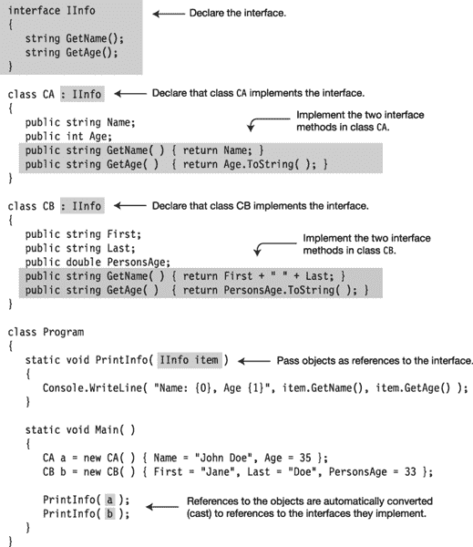

***图 15-1。**使用一个接口使 PrintInfo 方法可以被任意数量的类使用*

该代码产生以下输出:

* * *

`Name: John Doe, Age 35
Name: Jane Doe, Age 33`

* * *

#### 使用 IComparable 接口的例子

现在，您已经看到了一些通过接口解决的问题，我们将看第二个例子，并进行更详细的讨论。首先看一下下面的代码，它接受一个未排序的整数数组，并按升序对它们进行排序。该代码执行以下操作:

*   第一行创建了一个由五个没有特定顺序的整数组成的数组。
*   第二行使用`Array`类的静态`Sort`方法对元素进行排序。
*   `foreach`循环将它们打印出来，显示整数现在是升序的。

`   var myInt = new [] { 20, 4, 16, 9, 2 };    // Create an array of ints.

   Array.Sort(myInt);                         // Sort elements by magnitude.

   foreach (var i in myInt)                   // Print them out.
      Console.Write("{0} ", i);`

该代码产生以下输出:

* * *

`2 4 9 16 20`

* * *

`Array`类的`Sort`方法显然在一组`int`上工作得很好，但是如果你试图在你自己的一个类上使用它，会发生什么呢，如下所示？

`   class MyClass                            // Declare a simple class.
   {
      public int TheValue;
   }
      ...
   MyClass[] mc = new MyClass[5];          // Create an array of five elements.
      ...                                  // Create and initialize the elements.

   Array.Sort(mc);                         // Try to use Sort--raises exception.`

当您尝试运行这段代码时，它会引发一个异常，而不是对元素进行排序。`Sort`不能与`MyClass`对象数组一起工作的原因是它不知道如何比较用户定义的对象以及如何排列它们的顺序。数组类的`Sort`方法依赖于一个名为`IComparable`的接口，该接口在 BCL 中声明。`IComparable`有一个叫`CompareTo`的单一方法。

下面的代码显示了`IComparable`接口的声明。注意，接口体包含方法`CompareTo`的声明，指定它接受类型`object`的单个参数。同样，尽管该方法有名称、参数和返回类型，但没有实现。相反，实现由分号表示。

`                       Keyword      Interface name
                             ↓                    ↓          
   public interface IComparable
   {
      int CompareTo( object obj );
   }
                                                           ↑
                 Semicolon in place of method implementation`

[图 15-2](#fig_15_2) 显示了界面`IComparable`。`CompareTo`方法以灰色显示，说明它不包含实现。

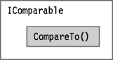

***图 15-2** 。接口 IComparable 的表示*

尽管接口声明没有提供方法`CompareTo`的实现。接口`IComparable`的. NET 文档描述了当你创建一个实现接口的类或结构时，这个方法应该做什么。它说当方法`CompareTo`被调用时，它应该返回下列值之一:

*   如果当前对象小于参数对象，则为负值
*   如果当前对象大于参数对象，则为正值
*   如果在比较中认为两个对象相等，则为零

`Sort`使用的算法取决于它可以使用元素的`CompareTo`方法来确定两个元素的顺序。`int`类型实现了`IComparable`，但是`MyClass`没有，所以当`Sort`试图调用`MyClass`的不存在的`CompareTo`方法时，它会引发一个异常。

通过让类实现`IComparable`，你可以让`Sort`方法处理`MyClass`类型的对象。要实现接口，类或结构必须做两件事:

*   它必须在其基类列表中列出接口名称。
*   它必须为接口的每个成员提供一个实现。

例如，下面的代码更新`MyClass`来实现接口`IComparable`。请注意以下关于代码的内容:

*   接口的名称列在类声明的基类列表中。
*   该类实现了一个名为`CompareTo`的方法，其参数类型和返回类型与接口成员相匹配。
*   实现方法`CompareTo`是为了满足接口文档中给出的定义。也就是说，它返回负 1、正 1 或 0，具体取决于它的值与传递到方法中的对象的比较。

`               Interface name in base class list
                                             ↓                   
   class MyClass : IComparable
   {
      public int TheValue;

      public int CompareTo(object obj)   // Implementation of interface method
      {
         MyClass mc = (MyClass)obj;
         if (this.TheValue < mc.TheValue) return -1;
         if (this.TheValue > mc.TheValue) return  1;
         return 0;
      }
   }`

图 15-3 显示了更新后的类别。从阴影接口方法指向类方法的箭头表示接口方法不包含代码，而是由类级方法实现的。

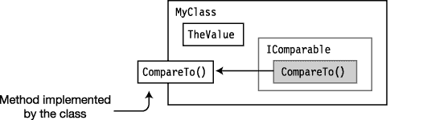

***图 15-3。**在 MyClass 中实现 I comparable*

现在`MyClass`实现了`IComparable` , `Sort`会很好地处理它。顺便说一下，仅仅声明`CompareTo`方法是不够的——它必须是实现接口的一部分，这意味着将接口名称放在基类列表中。

下面显示了完整的更新代码，现在可以使用`Sort`方法对一组`MyClass`对象进行排序。`Main`创建并初始化一个`MyClass`对象的数组，然后打印出来。然后它调用`Sort`并再次打印出来，显示它们已经被排序。

`   class MyClass : IComparable                     // Class implements interface.
   {
      public int TheValue;
      public int CompareTo(object obj)             // Implement the method.
      {
         MyClass mc = (MyClass)obj;
         if (this.TheValue < mc.TheValue) return -1;
         if (this.TheValue > mc.TheValue) return 1;
         return 0;
      }
   }

   class Program
   {
      static void PrintOut(string s, MyClass[] mc)
      {
         Console.Write(s);
         foreach (var m in mc)
            Console.Write("{0} ", m.TheValue);
         Console.WriteLine("");
      }

      static void Main()
      {
         var myInt = new [] { 20, 4, 16, 9, 2 };

         MyClass[] mcArr = new MyClass[5];     // Create array of MyClass objs.
         for (int i = 0; i < 5; i++)           // Initialize the array.
         {
            mcArr[i] = new MyClass();
            mcArr[i].TheValue = myInt[i];
         }
         PrintOut("Initial Order:  ", mcArr);  // Print the initial array.
         Array.Sort(mcArr);                    // Sort the array.
         PrintOut("Sorted Order:   ", mcArr);  // Print the sorted array.
      }
   }`

该代码产生以下输出:

* * *

`Initial Order:  20 4 16 9 2
Sorted Order:   2 4 9 16 20`

* * *

### 声明一个接口

上一节使用了一个已经在 BCL 中声明的接口。在这一节中，您将看到如何声明接口。关于声明接口，需要知道的重要事情如下:

*   接口声明不能包含以下内容:
*   数据成员
*   静态成员
*   接口声明只能包含以下类型的*非静态*函数成员的声明:
    *   方法
    *   性能
    *   事件
    *   索引器
*   这些函数成员的声明不能包含任何实现代码。相反，必须用分号来代替每个成员声明的主体。
*   按照惯例，接口名称以大写的 *I* 开头(例如`ISaveable`)。
*   像类和结构一样，接口声明也可以被分成部分接口声明，如第 6 章的“部分类和部分类型”一节所述。

下面的代码展示了一个用两个方法成员声明一个接口的例子:

`    Keyword      Interface name
              ↓                   ↓                
   interface IMyInterface1                                     Semicolon in place of body
   {                                             ↓
      int    DoStuff     ( int nVar1, long lVar2 );
      double DoOtherStuff( string s, long x );
   }                                        ↑
                                                        Semicolon in place of body`

接口的可访问性和接口成员的可访问性之间有一个重要的区别:

*   一个接口声明可以有任意的访问修饰符`public`、`protected`、`internal`或`private`。
*   然而，*接口的成员*是隐式公共的，并且*不允许有*访问修饰符，包括`public`。

`Access modifiers are allowed on interfaces.
        ↓     
   public interface IMyInterface2
   {
      private int Method1( int nVar1, long lVar2 );          // Error
   }     ↑
Access modifiers are NOT allowed on interface members.`

### 实现一个接口

只有类或结构可以实现接口。如`Sort`示例所示，要实现一个接口，一个类或结构必须

*   在其基类列表中包含接口的名称
*   为接口的每个成员提供实现

例如，下面的代码显示了类`MyClass`的一个新声明，它实现了上一节中声明的接口`IMyInterface1`。请注意，接口名称列在基类列表中的冒号后面，并且该类为接口成员提供了实际的实现代码。

`                              Colon   Interface name
                                ↓              ↓                         
   class MyClass: IMyInterface1
   {
      int    DoStuff     ( int nVar1, long lVar2 )
      { ... }                                          // Implementation code

      double DoOtherStuff( string s, long x )
      { ... }                                          // Implementation code
   }`

关于实现接口需要知道的一些重要事情如下:

*   如果一个类实现了一个接口，它必须实现该接口的所有成员。
*   如果一个类是从基类派生的，并且还实现了接口，基类的名称必须在基类列表*中列在*任何接口之前，如下所示。(请记住，只能有一个基类，因此列出的任何其他类型都必须是接口的名称。)

`                            Base class must be first         Interface names
                                             ↓              <ins>                          ↓                                            </ins>
   class Derived : MyBaseClass, IIfc1, IEnumerable, IComparable
   {
      ...
   }`

#### 简单界面示例

下面的代码声明了一个名为`IIfc1`的接口，其中包含一个名为`PrintOut`的方法。类`MyClass`通过在其基类列表中列出接口`IIfc1`并提供一个名为`PrintOut`的方法来实现接口`IIfc1`，该方法与接口成员的签名和返回类型相匹配。`Main`创建该类的一个对象，并从该对象调用方法。

`   interface IIfc1   Semicolon in place of body              // Declare interface.
   {                        ↓
      void PrintOut(string s);
   }
                                   Implement interface
                   ↓
   class MyClass : IIfc1                                // Declare class.
   {
      public void PrintOut(string s)                    // Implementation
      {
         Console.WriteLine("Calling through:  {0}", s);
      }
   }

   class Program
   {
      static void Main()
      {
         MyClass mc = new MyClass();                    // Create instance.
         mc.PrintOut("object");                         // Call method.
      }
   }`

该代码产生以下输出:

* * *

`Calling through:  object`

* * *

### 一个接口是一个引用类型

接口不仅仅是要实现的类或结构的成员列表。它是一个参考类型。

您不能通过类对象的成员直接访问接口。然而，您可以通过将类对象引用转换为接口类型来获得对接口的*引用。一旦有了对接口的引用，就可以对引用使用点语法表示法来调用接口成员。*

例如，下面的代码显示了一个从类对象引用获取接口引用的示例。

*   在第一条语句中，变量`mc`是对实现接口`IIfc1`的类对象的引用。该语句将该引用转换为对接口的引用，并将其赋给变量`ifc`。
*   第二条语句使用对接口的引用来调用实现方法。

`      Interface      Cast to interface
           ↓                     ↓     
   IIfc1 ifc = (IIfc1) mc;              // Get ref to interface.
                    ↑                          ↑
          Interface ref        Class object ref
   <ins>ifc.PrintOut</ins> ("interface");          // Use ref to interface to call member.
                  ↑            
       Use dot-syntax notation to call through the interface reference.`

例如，下面的代码声明了一个接口和一个实现该接口的类。`Main`中的代码创建了类的一个对象，并通过类对象调用实现方法。它还创建一个接口类型的变量，将类对象的引用强制转换为接口类型，并通过对接口的引用调用实现方法。[图 15-4](#fig_15_4) 说明了类和对接口的引用。

`   interface IIfc1
   {
      void PrintOut(string s);
   }

   class MyClass: IIfc1
   {
      public void PrintOut(string s)
      {
         Console.WriteLine("Calling through:  {0}", s);
      }
   }

   class Program
   {
      static void Main()
      {
         MyClass mc = new MyClass();  // Create class object.
         mc.PrintOut("object");       // Call class object implementation method.

         IIfc1 ifc = (IIfc1)mc;       // Cast class object ref to interface ref.
         ifc.PrintOut("interface");   // Call interface method.
      }
   }`

该代码产生以下输出:

* * *

`Calling through:  object
Calling through:  interface`

* * *

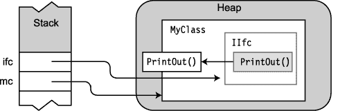

***图 15-4** 。类对象的引用和接口的引用*

### 使用 as 运算符与接口

在上一节中，您看到了可以使用 cast 操作符来获取对对象接口的引用。更好的想法是使用`as`操作符。在[第 16 章](16.html)中详细介绍了`as`操作符，但是我在这里也要提到它，因为它是一个与接口一起使用的好选择。

如果您试图将类对象引用强制转换为该类未实现的接口的引用，则强制转换操作将引发异常。您可以通过使用`as`操作符来避免这个问题。它的工作原理如下:

*   如果类别实作介面，运算式会传回介面的参考。
*   如果类没有实现接口，表达式返回`null`而不是引发异常。(*异常*是代码中的意外错误。我将在第 22 章中详细讨论异常——但是你应该避免异常，因为它们会显著降低代码速度，并会使程序处于不一致的状态。)

下面的代码演示了`as`操作符的用法。第一行使用`as`操作符从一个类对象获得一个接口引用。表达式的结果将`b`的值设置为`null`或对`ILiveBirth`接口的引用。

第二行检查`b`的值，如果不是`null`，则执行调用接口成员方法的命令。

`               Class object ref      Interface name
                                   ↓                 ↓              
   ILiveBirth b = a as ILiveBirth;        // Acts like cast: (ILiveBirth)a
                             ↑            ↑
                        Interface    Operator
                           ref
   if (b != null)
      Console.WriteLine("Baby is called: {0}", b.BabyCalled());`

### 实现多个接口

在到目前为止展示的例子中，这些类已经实现了一个接口。

*   一个类或结构可以实现任意数量的接口。
*   所有实现的接口都必须在基类列表中列出，并用逗号分隔(跟在基类名称后面，如果有的话)。

例如，下面的代码展示了类`MyData`，它实现了两个接口:`IDataStore`和`IDataRetrieve`。[图 15-5](#fig_15_5) 展示了`MyData`类中多个接口的实现。

`   interface IDataRetrieve { int GetData(); }             // Declare interface.
   interface IDataStore    { void SetData( int x ); }     // Declare interface.
                                         Interface             Interface
                                               ↓                       ↓                
   class MyData: IDataRetrieve, IDataStore                // Declare class.
   {
      int Mem1;                                           // Declare field.
      public int  GetData()        { return Mem1; }
      public void SetData( int x ) { Mem1 = x;    }
   }

   class Program
   {
      static void Main()                                  // Main
      {
         MyData data = new MyData();
         data.SetData( 5 );
         Console.WriteLine("Value = {0}", data.GetData());
      }
   }`

该代码产生以下输出:

* * *

`Value = 5`

* * *

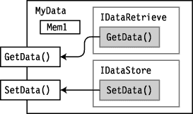

***图 15-5。**实现多个接口的类*

### 用重复成员实现接口

因为一个类可以实现任意数量的接口，所以两个或更多的接口成员可能具有相同的签名和返回类型。那么，编译器如何处理这种情况呢？

例如，假设您有两个接口——`IIfc1`和`IIfc2`——如下所示。每个接口都有一个名为`PrintOut`的方法，具有相同的签名和返回类型。如果要创建一个实现这两个接口的类，应该如何处理这些重复的接口方法？

`   interface IIfc1
   {
      void PrintOut(string s);
   }

   interface IIfc2
   {
      void PrintOut(string t);
   }`

答案是，如果一个类实现多个接口，其中几个接口的成员具有相同的签名和返回类型，则该类可以实现一个成员，该成员满足包含该重复成员的所有接口。

例如，下面的代码显示了类`MyClass`的声明，它实现了`IIfc1`和`IIfc2`。它的方法`PrintOut`的实现满足了两个接口的需求。

`   class MyClass : IIfc1, IIfc2             // Implement both interfaces.
   {
      public void PrintOut(string s)        // Single implementation for both
      {
         Console.WriteLine("Calling through:  {0}", s);
      }
   }

   class Program
   {
      static void Main()
      {
         MyClass mc = new MyClass();
         mc.PrintOut("object");
      }
   }`

这段代码产生以下输出:

* * *

`Calling through:  object`

* * *

图 15-6 展示了由单个类级方法实现实现的重复接口方法。

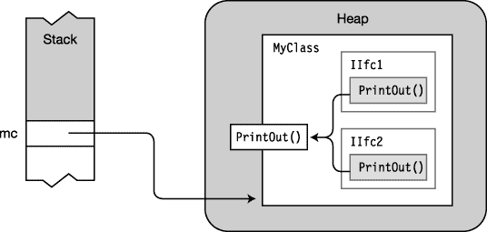

***图 15-6。**同一个类成员实现的多个接口*

### 引用多个接口

您之前已经看到接口是引用类型，您可以通过使用`as`操作符或者通过将对象引用强制转换为接口类型来获得对接口的引用。如果一个类实现了多个接口，你可以为每个接口获得单独的引用。

例如，下面的类用一个方法`PrintOut`实现了两个接口。`Main`中的代码以三种方式调用方法`PrintOut`:

*   通过类对象
*   通过引用`IIfc1`接口
*   通过引用`IIfc2`接口

[图 15-7](#fig_15_7) 说明了类对象以及对`IIfc1`和`IIfc2`的引用。

`interface IIfc1                              // Declare interface.
   {
      void PrintOut(string s);
   }

   interface IIfc2                              // Declare interface
   {
      void PrintOut(string s);
   }

   class MyClass : IIfc1, IIfc2                 // Declare class.
   {
      public void PrintOut(string s)
      {
         Console.WriteLine("Calling through:  {0}", s);
      }
   }` `   class Program
   {
      static void Main()
      {
         MyClass mc = new MyClass();

         IIfc1 ifc1 = (IIfc1) mc;                 // Get ref to IIfc1.
         IIfc2 ifc2 = (IIfc2) mc;                 // Get ref to IIfc2.

         mc.PrintOut("object");                  // Call through class object.

         ifc1.PrintOut("interface 1");           // Call through IIfc1.
         ifc2.PrintOut("interface 2");           // Call through IIfc2.
      }
   }`

该代码产生以下输出:

* * *

`Calling through:  object
Calling through:  interface 1
Calling through:  interface 2`

* * *

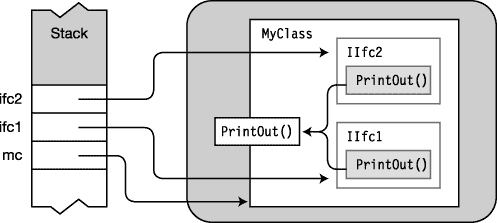

***图 15-7。**对类中不同接口的单独引用*

### 作为实现的一个继承成员

实现接口的类可以从其基类之一继承实现的代码。例如，下面的代码阐释了一个从基类继承实现代码的类。

*   `IIfc1`是一个带有名为`PrintOut`的方法成员的接口。
*   `MyBaseClass`包含一个名为`PrintOut`的方法，它匹配`IIfc1`的方法声明。
*   类`Derived`有一个空的声明体，但它是从类`MyBaseClass`派生的，并且在其基类列表中包含`IIfc1`。
*   即使`Derived`的声明体为空，基类中的代码也满足实现接口方法的要求。

`   interface IIfc1 { void PrintOut(string s); }

   class MyBaseClass                                   // Declare base class.
   {
      public void PrintOut(string s)                   // Declare the method.
      {
         Console.WriteLine("Calling through:  {0}", s);
      }
   }
   class Derived : MyBaseClass, IIfc1                 // Declare class.
   {
   }

   class Program {
      static void Main()
      {
         Derived d = new Derived();                    // Create class object.
         d.PrintOut("object.");                        // Call method.
      }
   }`

[图 15-8](#fig_15_8) 说明了前面的代码。注意从`IIfc1`开始的箭头向下指向基类中的代码。

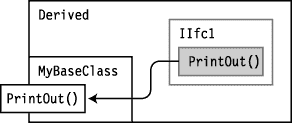

***图 15-8** 。在基类中实现*

### 显式接口成员实现

在前面的章节中你已经看到，一个类可以实现多个接口所需的所有成员，如图 15-5 和 15-6 所示。

但是，如果您希望每个接口都有单独的实现，该怎么办呢？在这种情况下，您可以创建所谓的*显式接口成员实现*。显式接口成员实现具有以下特征:

*   像所有接口实现一样，它被放在实现接口的类或结构中。
*   它是使用一个*限定的接口名*声明的，该接口名由接口名和成员名组成，用点分隔。

下面的代码显示了声明显式接口成员实现的语法。由`MyClass`实现的两个接口中的每一个都实现了自己版本的方法`PrintOut`。

`   class MyClass : IIfc1, IIfc2
   {                  Qualified interface name
                         <ins>               ↓             </ins>   
      void IIfc1.PrintOut (string s)                  // Explicit implementation
      { ... }

      void IIfc2.PrintOut (string s)                  // Explicit implementation
      { ... }
   }`

[图 15-9](#fig_15_9) 说明了类和接口。请注意，表示显式接口成员实现的方框没有以灰色显示，因为它们现在表示实际的代码。

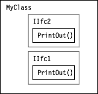

***图 15-9** 。显式接口成员实现*

例如，在下面的代码中，类`MyClass`为两个接口的成员声明了显式接口成员实现。注意，在这个例子中，只有显式的接口成员实现。没有类级别的实现。

`   interface IIfc1 { void PrintOut(string s); }   // Declare interface.
   interface IIfc2 { void PrintOut(string t); }   // Declare interface.

   class MyClass : IIfc1, IIfc2
   {
                     Qualified interface name
                       <ins>             ↓             </ins>   
      void IIfc1.PrintOut(string s)            // Explicit interface member
      {                                        //     implementation
         Console.WriteLine("IIfc1:  {0}", s);
      }
                             Qualified interface name
                       <ins>             ↓             </ins>   
      void IIfc2.PrintOut(string s)            // Explicit interface member
      {                                        //     implementation
         Console.WriteLine("IIfc2:  {0}", s);
      }
   }

   class Program
   {
      static void Main()
      {
         MyClass mc = new MyClass();           // Create class object.

         IIfc1 ifc1 = (IIfc1) mc;              // Get reference to IIfc1.
         ifc1.PrintOut("interface 1");         // Call explicit implementation.

         IIfc2 ifc2 = (IIfc2) mc;              // Get reference to IIfc2.
         ifc2.PrintOut("interface 2");         // Call explicit implementation.
      }
   }`

该代码产生以下输出:

* * *

`IIfc1:  interface 1
IIfc2:  interface 2`

* * *

[图 15-10](#fig_15_10) 说明了代码。请注意图中的接口方法并不指向类级别的实现，而是包含它们自己的代码。

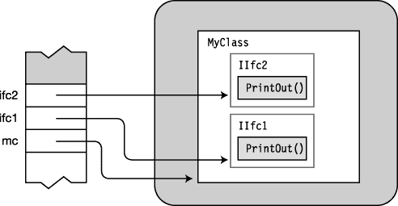

***图 15-10。**引用具有显式接口成员实现的接口*

当有一个显式接口成员实现时，类级实现是允许的，但不是必需的。显式实现满足了类或结构必须实现方法的要求。因此，您可以选择以下三种实施方案中的任何一种:

*   类级实现
*   显式接口成员实现
*   类级和显式接口成员实现

#### 访问显式接口成员实现

显式接口成员实现只能通过对接口的引用来访问。这意味着即使其他类成员也不能直接访问它们。

例如，下面的代码显示了类`MyClass`的声明，它通过显式实现实现了接口`IIfc1`。注意，即使是同为`MyClass`成员的`Method1`，也不能直接访问显式实现。

*   `Method1`的前两行产生编译错误，因为该方法试图直接访问实现。
*   只有`Method1`中的最后一行会编译，因为它将对当前对象(`this`)的引用强制转换为对接口类型的引用，并使用该接口引用来调用显式接口实现。

`   class MyClass : IIfc1
   {
      void IIfc1.PrintOut(string s)       // Explicit interface implementation
      {
         Console.WriteLine("IIfc1");
      }

      public void Method1()
      {
         PrintOut("...");                 // Compile error
         this.PrintOut("...");            // Compile error

         (<ins>(IIfc1)</ins>this).PrintOut("...");   // OK, call method.
      }       ↑
            Cast to a reference to the interface
   }`

这种限制对继承有重要的影响。由于其他类成员不能直接访问显式接口成员实现，从该类派生的类成员显然也不能直接访问它们。它们必须总是通过对接口的引用来访问。

### 接口可以继承接口

您之前看到接口*实现*可以从基类继承。但是接口本身可以从一个或多个其他接口继承。

*   要指定一个接口从其他接口继承，请将基接口的名称放在逗号分隔的列表中，并放在接口声明中接口名称后面的冒号后面，如下所示:`                                        Colon           Base interface list
                                               ↓   <ins>                         ↓                       </ins>               
       interface IDataIO : IDataRetrieve, IDataStore
       { ...`
*   与基类列表中只能有一个类名的类不同，接口在其基类列表中可以有任意数量的接口。
    *   列表中的接口本身可以有继承的接口。
    *   结果接口包含它声明的所有成员，以及它的所有基接口。

[图 15-11](#fig_15_11) 中的代码展示了三个接口的声明。接口`IDataIO`继承了前两个。右图显示了包含其他两个接口的`IDataIO`。

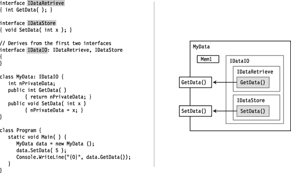

***图 15-11** 。接口继承多个接口的类*

### 不同类实现一个接口的例子

下面的代码演示了已经讨论过的接口的几个方面。程序声明了一个名为`Animal`的类，它被用作其他几个代表各种动物的类的基类。它还声明了一个名为`ILiveBirth`的接口。

类`Cat`、`Dog`和`Bird`都是从基类`Animal`派生出来的。`Cat`和`Dog`都实现了`ILiveBirth`接口，但是类`Bird`没有。

在`Main`中，程序创建一个`Animal`对象的数组，并用三种动物类中每一种的类对象填充它。然后程序遍历数组，使用`as`操作符，检索每个对象的`ILiveBirth`接口的引用，并调用它的`BabyCalled`方法。

`interface ILiveBirth                           // Declare interface.
   {
      string BabyCalled();
   }

   class Animal { }                               // Base class Animal

   class Cat : Animal, ILiveBirth                 // Declare class Cat.
   {
      string ILiveBirth.BabyCalled()
      { return "kitten"; }
   }
   class Dog : Animal, ILiveBirth                 // Declare class Dog.
   {
      string ILiveBirth.BabyCalled()
      { return "puppy"; }
   }

   class Bird : Animal                            // Declare class Bird.
   {
   }` `   class Program
   {
      static void Main()
      {
         Animal[] animalArray = new Animal[3];   // Create Animal array.
         animalArray[0] = new Cat();             // Insert Cat class object.
         animalArray[1] = new Bird();            // Insert Bird class object.
         animalArray[2] = new Dog();             // Insert Dog class object.
         foreach( Animal a in animalArray )      // Cycle through array.
         {
            ILiveBirth b = a as ILiveBirth;      // if implements ILiveBirth...
            if (b != null)
               Console.WriteLine("Baby is called: {0}", b.BabyCalled());
         }
      }
   }`

该代码产生以下输出:

* * *

`Baby is called: kitten
Baby is called: puppy`

* * *

[图 15-12](#fig_15_12) 说明了内存中的数组和对象。

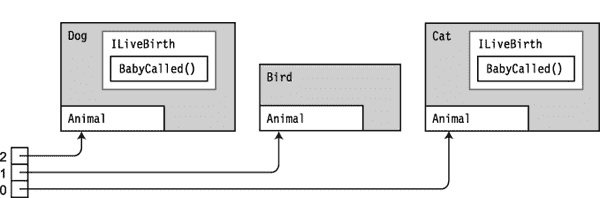

***图 15-12** 。基类 Animal 的不同对象类型散布在数组中。*