# 十六、转换策略

### 什么是转换？

为了理解什么是转换，让我们从考虑一个简单的例子开始，在这个例子中，你声明了两个不同类型的变量，然后将其中一个变量的值(*源*)赋给另一个变量(*目标*)。在赋值之前，源值必须转换为目标类型的值。[图 16-1](#fig_16_1) 说明了类型转换。

*   *转换*是取一种类型的值，*用它作为*另一种类型的等值的过程。
*   转换得到的值应该与源值相同，但属于目标类型。

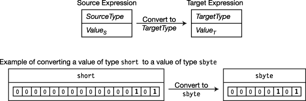

***图 16-1。**类型转换*

例如，[图 16-2](#fig_16_2) 中的代码显示了两个不同类型变量的声明。

*   `var1`的类型是`short`，一个初始化为`5`的 16 位有符号整数。`var2`属于`sbyte`类型，一个 8 位有符号整数，被初始化为值`10`。
*   代码的第三行将`var1`的值赋给`var2`。因为这是两种不同的类型，所以在赋值之前，`var1`的值必须转换成与`var2`相同类型的值。这是使用 cast 表达式执行的，您很快就会看到。
*   还要注意的是，`var1`的值和类型没有改变。虽然它被称为转换，但这仅意味着源值被用作目标类型的值，而不是源值被更改为目标类型。

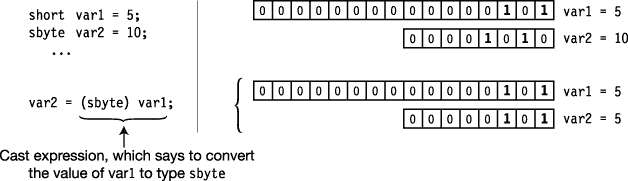

***图 16-2** 。从 short 转换为 sbyte*

### 隐式转换

对于某些类型的转换，不会丢失数据或精度。例如，很容易将一个 8 位值填充到一个 16 位类型中，而不会丢失数据。

*   该语言将自动为您完成这些转换。这些被称为*隐式转换*。
*   当从具有较少位的源类型转换到具有较多位的目标类型时，目标中的额外位需要用 0 或 1 来填充。
*   当从较小的无符号类型转换为较大的无符号类型时，目标的额外最高有效位用 0 填充。这叫做*零延伸*。

[图 16-3](#fig_16_3) 显示了一个 8 位值 10 转换成 16 位值 10 的零扩展的例子。

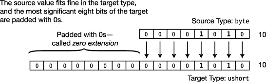

***图 16-3** 。无符号转换中的零扩展*

对于有符号类型之间的转换，额外的最高有效位用源表达式的符号位填充。

*   这保持了转换值的正确符号和大小。
*   这被称为*符号扩展*，如图[图 16-4](#fig_16_4) 所示，首先是 10，然后是–10。

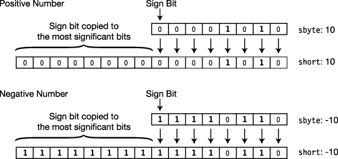

***图 16-4。**带符号转换中的符号扩展*

### 显式转换和强制转换

当您从较短的类型转换为较长的类型时，较长的类型很容易保存较短类型的所有位。但是，在其他情况下，目标类型可能无法在不丢失数据的情况下容纳源值。

例如，假设您想将一个`ushort`值转换成一个`byte`。

*   A `ushort`可以保存 0 到 65，535 之间的任何值。
*   一个`byte`只能保存一个 0 到 255 之间的值。
*   只要你要转换的`ushort`值小于 256，就不会有任何数据丢失。然而，如果它更大，最高有效位将会丢失。

例如，[图 16-5](#fig_16_5) 显示试图将值为 1365 的`ushort`转换为`byte`，导致数据丢失。并非源值的所有有效位都适合目标类型，这会导致溢出和数据丢失。源值是 1，365，但目标可以容纳的最大值是 255。字节中的结果值是 85，而不是 1，365。

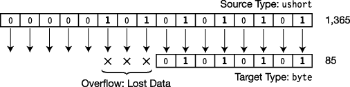

***图 16-5** 。试图将 ushort 转换为字节*

显然，在可能的无符号 16 位`ushort`值中，只有相对较少的一部分(0.4%)可以安全地转换为无符号 8 位`byte`类型，而不会丢失数据。其余的导致数据*溢出*，产生不同的值。

#### 铸造

对于预定义的类型，C# 将自动从一种数据类型转换为另一种数据类型，但只在那些在源类型和目标类型之间不可能丢失数据的类型之间转换。也就是说，如果源类型的任何*值在转换为目标类型时会丢失数据，那么该语言不提供两种类型之间的自动转换。如果你想进行这种类型的转换，你必须使用一个叫做*转换表达式*的*显式转换*。*

下面的代码显示了一个强制转换表达式的示例。它将`var1`的值转换为类型`sbyte`。强制转换表达式由以下内容组成:

*   包含目标类型名称的一组匹配括号
*   括号后面的源表达式

`                   Target type
                          ↓              
          (sbyte) var1;
                                         ↑
                                Source expression`

当使用强制转换表达式时，您明确地承担了执行可能丢失数据的操作的责任。本质上，你是在说，“尽管有数据丢失的可能性，我知道我在做什么，所以无论如何都要进行转换。”(不过，要确保你 *do* 知道自己在做什么。)

例如，[图 16-6](#fig_16_6) 显示了将类型`ushort`的两个值转换为类型`byte`的转换表达式。在第一种情况下，没有数据丢失。在第二种情况下，最高有效位丢失，给出的值为 85，这显然不等于源值 1，365。

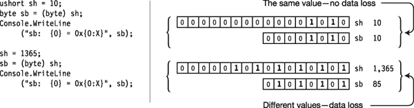

***图 16-6。**将一个 ushort 强制转换为一个字节*

图中代码的输出显示了结果的十进制和十六进制值，如下所示:

* * *

`sb:  10 = 0xA
sb:  85 = 0x55`

* * *

### 转换类型

对于数值和引用类型，有许多标准的预定义转换。这些类别在[图 16-7](#fig_16_7) 中说明。

*   除了标准转换之外，还可以为用户定义的类型定义隐式和显式转换。
*   还有一种预定义的转换类型，称为*装箱*，它将任何值类型转换为以下两种类型之一:
    *   类型`object`
    *   类型`System.ValueType`
*   取消装箱会将装箱的值转换回其原始类型。

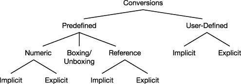

***图 16-7。**转换类型*

### 数字转换

任何数值类型都可以转换成任何其他数值类型，如图[图 16-8](#fig_16_8) 所示。有些转换是隐式转换，有些必须是显式转换。

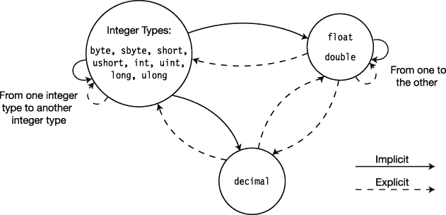

***图 16-8** 。数字转换*

#### 隐式数值转换

隐式数值转换如图 16-9 中的[所示。](#fig_16_9)

*   如果存在从源类型到目标类型的路径，则存在从源类型到目标类型的隐式转换。
*   任何没有从源类型到目标类型的箭头路径的数字转换都必须是一个*显式转换*。

如图所示，正如您所料，占用较少位的数值类型与占用较多位的数值类型之间存在隐式转换。

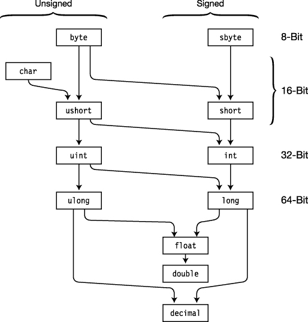

***图 16-9。**隐式数值转换*

#### 溢出检查上下文

您已经看到，显式转换有可能丢失数据，并且无法在目标类型中等效地表示源值。对于整数类型，C# 允许您选择运行时在进行这些类型的转换时是否应该检查溢出结果。它通过`checked`操作符和`checked`语句来实现这一点。

*   一段代码是否被检查称为它的*溢出检查上下文*。
    *   如果将一个表达式或一段代码指定为`checked`，如果转换产生溢出，CLR 将引发一个`OverflowException`异常。
    *   如果代码不是`checked`，无论是否有溢出，转换都会继续进行。
*   不检查默认溢出检查上下文。

##### 选中的和未选中的运算符

`checked`和`unchecked`操作符控制表达式的溢出检查上下文，它放在一对括号中。表达式不能是方法。语法如下:

`   checked   ( *Expression* )
   unchecked ( *Expression* )`

例如，下面的代码执行相同的转换——首先在一个`checked`操作符中，然后在一个`unchecked`操作符中。

*   在`unchecked`上下文中，溢出被忽略，产生值`208`。
*   在`checked`上下文中，引发了一个`OverflowException`异常。

`   ushort sh = 2000;
   byte   sb;

   sb = unchecked ( (byte) sh );         // Most significant bits lost
   Console.WriteLine("sb: {0}", sb);

   sb =   checked ( (byte) sh );         // OverflowException raised
   Console.WriteLine("sb: {0}", sb);`

该代码产生以下输出:

* * *

`sb: 208

Unhandled Exception: System.OverflowException: Arithmetic operation resulted in an overflow. at Test1.Test.Main() in C:\Programs\Test1\Program.cs:line 21`

* * *

##### 已检查和未检查的报表

您刚才看到的`checked`和`unchecked` *操作符*作用于括号之间的单个表达式。`checked`和`unchecked` *语句*执行相同的功能，但是控制代码块中的所有转换，而不是单个表达式。

*   `checked`和`unchecked`语句可以嵌套到任何级别。

例如，下面的代码使用了`checked`和`unchecked`语句，并产生了与前面使用了`checked`和`unchecked`表达式的示例相同的结果。然而，在这种情况下，受影响的不仅仅是表达式，还有代码块。

`   byte   sb;
   ushort sh = 2000;

   unchecked                                            // Set unchecked
   {
      sb = (byte) sh;
      Console.WriteLine("sb: {0}", sb);

      checked                                           // Set checked
      {
         sb = (byte) sh;
         Console.WriteLine("sb: {0}", sh);
      }
   }`

#### 显式数值转换

您已经看到隐式转换会自动从源表达式转换为目标类型，因为不会丢失数据。然而，使用显式转换，有可能会丢失数据，因此作为程序员，了解转换如何处理发生的数据丢失非常重要。

在这一节中，我们将研究各种类型的显式数值转换。[图 16-10](#fig_16_10) 显示了[图 16-8](#fig_16_8) 中显示的显式转换的子集。

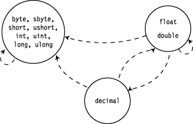

***图 16-10。**显式数值转换*

##### 整数类型到整数类型

[图 16-11](#fig_16_11) 显示了整数到整数显式转换的行为。在`checked`的情况下，如果转换丢失数据，操作会引发`OverflowException`异常。在`unchecked`事件中，任何丢失的比特都没有被报告。

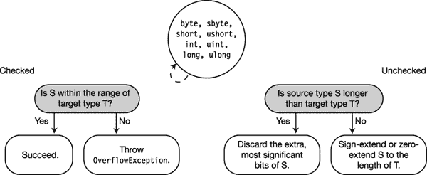

***图 16-11。**整数到整数的显式转换*

##### 浮点或双精度到整数类型

将浮点类型转换为整数类型时，该值将向 0 舍入为最接近的整数。[图 16-12](#fig_16_12) 说明了转换条件。如果舍入值不在目标类型的范围内，则

*   如果溢出检查上下文是`checked`，CLR 会引发一个`OverflowException`异常。
*   如果上下文是`unchecked`，C# 没有定义它的值应该是什么。

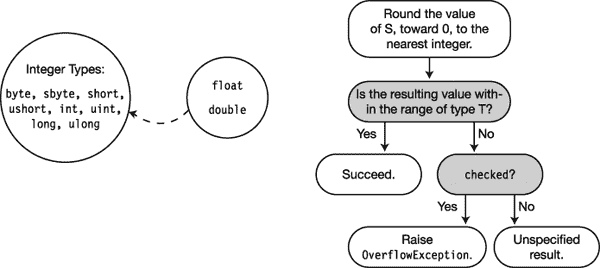

***图 16-12。**将浮点数或双精度数转换为整数类型*

##### 小数到整数类型

当从`decimal`转换为整数类型时，如果结果值不在目标类型的范围内，CLR 会引发一个`OverflowException`异常。[图 16-13](#fig_16_13) 说明了转换条件。

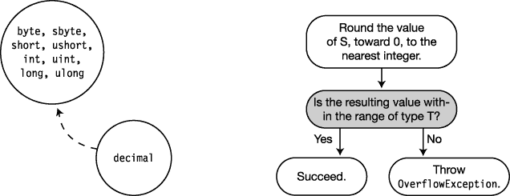

***图 16-13** 。将小数转换成整数类型*

##### 双飘

类型`float`的值占用 32 位，类型`double`的值占用 64 位。当`double`被舍入到`float`时，`double`类型值被舍入到最接近的`float`类型值。[图 16-14](#fig_16_14) 说明了转换条件。

*   如果该值太小而不能用`float`表示，则该值被设置为正 0 或负 0。
*   如果该值太大而无法用`float`表示，则该值被设置为正无穷大或负无穷大。

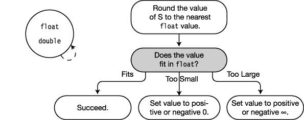

***图 16-14。**将双精度转换为浮点*

##### 浮点或双精度到十进制

[图 16-15](#fig_16_15) 显示了从浮点型转换到`decimal`的转换条件。

*   如果值太小而不能用`decimal`类型来表示，则结果被设置为 0。
*   如果该值太大，CLR 会引发一个`OverflowException`异常。

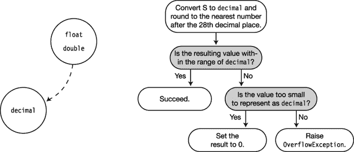

***图 16-15** 。将浮点数或双精度数转换成十进制数*

##### 十进制为浮点数或双精度数

从`decimal`到浮点类型的转换总是成功的。然而，可能会损失精确度。[图 16-16](#fig_16_16) 显示了转换条件。

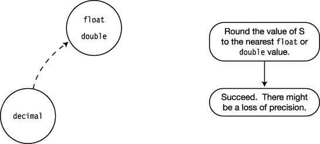

***图 16-16** 。将十进制转换成浮点数或双精度数*

### 参考转换

正如你现在所知道的，引用类型对象在内存中由两部分组成:引用和数据。

*   引用保存的部分信息是它指向的数据的类型。
*   引用转换接受源引用并返回指向堆中相同位置的引用，但将该引用“标记”为不同的类型。

例如，下面的代码显示了两个引用变量，`myVar1`和`myVar2`，它们指向内存中的同一个对象。代码如图[图 16-17](#fig_16_17) 所示。

*   对于`myVar1`，它所引用的对象看起来像是一个类型为`B`的对象——事实也的确如此。
*   对于`myVar2`，同一个对象看起来像一个类型为`A`的对象。
    *   即使`myVar2`实际上是指向一个类型为`B`的对象，它也看不到`B`延伸`A`的部分，因此也看不到`Field2`。
    *   因此，第二个`WriteLine`语句会导致编译错误。

注意“转换”不会改变`myVar1`。

`   class A    { public int Field1; }

   class B: A { public int Field2; }

   class Program
   {
      static void Main( )
      {
         B myVar1 = new B();
       Return the reference to myVar1 as a reference to a class A.
                                          <ins>         ↓         </ins>
         A myVar2 = (A) myVar1;

         Console.WriteLine("{0}", myVar2.Field1);            // Fine
         Console.WriteLine("{0}", myVar2.Field2);            // Compile error!
      }                                    ↑
   }                                  myVar2 can't see Field2.` 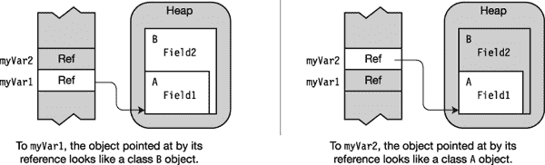

***图 16-17。**引用转换返回与对象相关联的不同类型。*

#### 隐式引用转换

正如语言会自动为您执行隐式数值转换一样，也有隐式引用转换。这些在[图 16-18](#fig_16_18) 中进行了说明。

*   所有引用类型都有到类型`object`的隐式转换。
*   任何接口都可以隐式转换为派生它的接口。
*   类可以隐式转换为
    *   衍生它的链中的任何类
    *   它实现的任何接口

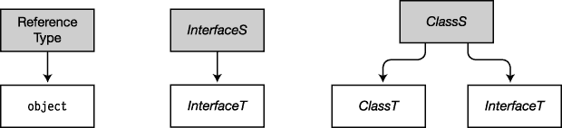

***图 16-18。**类和接口的隐式转换*

委托可以隐式转换为 .NET BCL 类和接口如图[图 16-19](#fig_16_19) 所示。具有类型为 *`Ts`* 的元素的数组 *`ArrayS`* ，可以隐式转换为以下内容:

*   那个 .NET BCL 类和接口如图[图 16-19](#fig_16_19) 所示。
*   另一个数组， *`ArrayT`* ，元素类型为 *`Tt`* ，如果*以下所有*都为真:
    *   两个数组具有相同的维数。
    *   元素类型 *`Ts`* 和 *`Tt`* 是引用类型，而不是值类型。
    *   类型 *`Ts`* 和 *`Tt`* 之间有一个*隐式*转换。

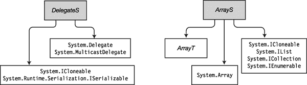

***图 16-19。**代表和数组的隐式转换*

#### 显式引用转换

显式引用转换是从一般类型到更特殊类型的引用转换。

*   显式转换包括:
    *   从`object`到任何引用类型的转换
    *   从基类到从基类派生的类的转换
*   通过反转图 16-18 和图 16-19 中的箭头来说明显式参考转换。

如果允许这种类型的转换而没有限制，那么您可以很容易地尝试引用实际上不在内存中的类成员。然而，编译器*允许这些类型的转换。但是当系统在运行时遇到它们时，它会引发一个异常。*

例如图 16-20 中[的代码将基类`A`的引用转换为它的派生类`B`并赋给变量`myVar2`。](#fig_16_20)

*   如果`myVar2`试图访问`Field2`，它将试图访问对象的“`B`部分”中的一个字段，该字段并不存在，从而导致内存故障。
*   运行时将捕捉这种不适当的强制转换，并引发一个`InvalidCastException`异常。然而，请注意，是*而不是* *导致了编译错误。*

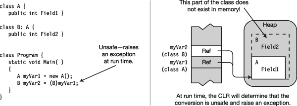

***图 16-20。**无效的强制转换引发运行时异常。*

#### 有效的显式引用转换

在三种情况下，显式引用转换会在运行时成功，也就是说，不会引发`InvalidCastException`异常。

第一种情况是不需要显式转换，也就是说，语言已经为您执行了隐式转换。例如，在下面的代码中，显式转换是不必要的，因为总是存在从派生类到其基类之一的隐式转换。

`   class A { }
   class B: A { }
      ...
   B myVar1 = new B();
   A myVar2 = (A) myVar1;     // Cast is unnecessary; A is the base class of B.`

第二种情况是源参考为`null`。例如，在下面的代码中，尽管将基类的引用转换为派生类的引用通常是不安全的，但是这种转换是允许的，因为源引用的值是`null`。

`   class A { }
   class B: A { }
      ...
   A myVar1 = null;
   B myVar2 = (B) myVar1;     // Allowed because myVar1 is null`

第三种情况是由源引用指向的*实际数据*可以被安全地隐式转换。下面的代码显示了一个例子，[图 16-21](#fig_16_21) 说明了该代码。

*   第二行中的隐式转换使得`myVar2`“认为”它指向类型`A`的数据，而实际上它指向类型`B`的数据对象。
*   第三行中的显式转换是将一个基类的引用强制转换为它的一个派生类的引用。通常这将引发一个异常。然而，在这种情况下，被指向的对象实际上是一个类型为`B`的数据项。

`   B myVar1 = new B();
   A myVar2 = myVar1;     // Implicitly cast myVar1 to type A.
   B myVar3 = (B)myVar2;  // This cast is fine because the data is of type B.` 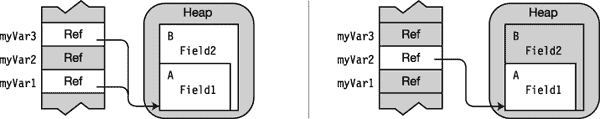

***图 16-21。**铸造到安全型*

### 拳击转换

所有 C# 类型，包括值类型，都是从类型`object`派生的。然而，值类型是高效的轻量级类型，默认情况下，在堆中不包含它们的`object`组件。然而，当需要`object`组件时，您可以使用*装箱*，这是一种隐式转换，它接受值类型值，在堆中从中创建一个完整的引用类型对象，并返回对该对象的引用。

例如，[图 16-22](#fig_16_22) 显示了三行代码。

*   前两行代码声明并初始化值类型变量`i`和引用类型变量`oi`。
*   在第三行代码中，您希望将变量`i`的值赋给`oi`。但是`oi`是一个引用类型变量，必须被赋予一个对堆中对象的引用。然而，变量`i`是一个值类型，并且没有对堆中对象的引用。
*   因此，系统通过执行以下操作将`i`的值装箱:
    *   在堆中创建类型为`int`的对象
    *   将`i`的值复制到`int`对象
    *   将`int`对象的引用返回给`oi`以存储为其引用

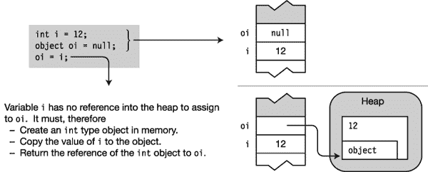

***图 16-22。**装箱从值类型创建一个完全引用类型对象。*

#### 装箱创建副本

关于装箱的一个常见误解是它作用于被装箱的物品。它没有。它返回一个引用类型*值的副本*。装箱过程之后，有两个值的副本——值类型原始副本和引用类型副本——每个副本都可以单独操作。

例如，下面的代码显示了值的每个副本的单独操作。[图 16-23](#fig_16_23) 说明了代码。

*   第一行定义值类型变量`i`，并将其值初始化为`10`。
*   第二行创建引用类型变量`oi`，并用变量`i`的装箱副本初始化它。
*   最后三行代码显示了分别操作的`i`和`oi`。

`   int i = 10;                     // Create and initialize value type
              Box i and assign its reference to oi.
                     <ins>     ↓     </ins>
   object oi = i;                  // Create and initialize reference type
   Console.WriteLine("i: {0}, io: {1}", i, oi);

   i  = 12;
   oi = 15;
   Console.WriteLine("i: {0}, io: {1}", i, oi);`

该代码产生以下输出:

* * *

`i: 10, io: 10
i: 12, io: 15`

* * *

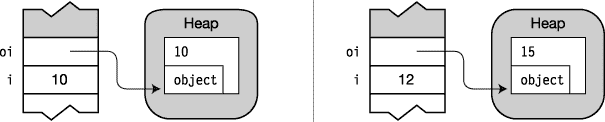

***图 16-23。**拳击创造了一个可以单独操纵的复制品。*

#### 拳击转换

[图 16-24](#fig_16_24) 显示了装箱转换。如果 *`ValueTypeS`* 实现了 *`InterfaceT`* ，任何值类型 *`ValueTypeS`* 都可以隐式转换为任意类型`object`、`System.ValueType`或 *`InterfaceT`* 。

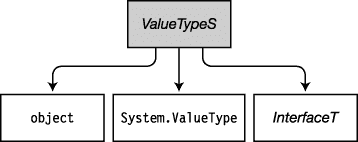

***图 16-24** 。装箱是值类型到引用类型的隐式转换。*

### 取消装箱转换

*取消装箱*是将装箱的对象转换回其值类型的过程。

*   取消装箱是一种显式转换。
*   将值解装箱到 *`ValueTypeT`* 时，系统执行以下步骤:
    *   它检查被取消装箱的对象实际上是类型为 *`ValueTypeT`* 的装箱值。
    *   它将对象的值复制到变量中。

例如，下面的代码显示了取消装箱值的示例。

*   值类型变量`i`被装箱并赋给引用类型变量`oi`。
*   然后变量`oi`被取消装箱，其值被赋给值类型变量`j`。

`   static void Main()
   {
      int i = 10;
               Box i and assign its reference to oi.
                           <ins>     ↓     </ins>         
      object oi = i;
                     Unbox oi and assign its value to j.
                              <ins>       ↓       </ins>     
      int j = (int) oi;
      Console.WriteLine("i: {0},   oi: {1},   j: {2}", i,  oi, j);
   }`

这段代码产生以下输出:

* * *

`i: 10,   oi: 10,   j: 10`

* * *

试图将一个值取消装箱为原始类型以外的类型会引发一个`InvalidCastException`异常。

#### 拆箱转换

[图 16-25](#fig_16_25) 显示了拆箱转换。

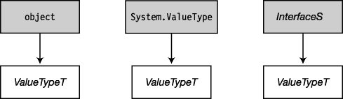

***图 16-25** 。拆箱转换*

### 用户自定义换算

除了标准转换，您还可以为自己的类和结构定义隐式和显式转换。

下面的代码显示了用户定义转换的语法。

*   隐式和显式转换声明的语法是相同的，除了关键字`implicit`和`explicit`。
*   `public`和`static`修改器都是必需的。

`            Required                              Operator          Keyword                         Source
      <ins>          ↓             </ins>                           ↓                     ↓              <ins>                     ↓                      </ins>
   public static implicit operator  *TargetType* ( *SourceType  Identifier* )
   {                 ↑
                                   Implicit or explicit
         ...
      return *ObjectOfTargetType*;
   }`

例如，下面显示了将类型为`Person`的对象转换为`int`的转换方法的语法示例:

`   public static implicit operator int(Person p)
   {
      return p.Age;
   }`

#### 用户定义转换的约束

对用户定义的转换有一些重要的约束。最重要的如下:

*   您只能为类和结构定义用户定义的转换。
*   不能重定义标准的隐式或显式转换。
*   对于源类型 *`S`* 和目标类型 *`T`* 来说，以下是正确的:
    *   *`S`* *和* *`T`* 必须是不同的类型。
    *   *`S`* 和 *`T`* 不能有继承关系。即 *`S`* 不能从*`T`**`T`*不能从 *`S`* 派生。
    *   *`S`* 和 *`T`* 都不能是接口类型或者类型`object`。
    *   转换运算符必须是 *`S`* 或 *`T`* 的成员。
*   不能用相同的源类型和目标类型声明两个转换，一个是隐式的，另一个是显式的。

#### 用户自定义转换的例子

下面的代码定义了一个名为`Person`的类，其中包含一个人的姓名和年龄。该类还定义了两个隐式转换。第一个函数将一个`Person`对象转换成一个`int`值。目标`int`值是人的年龄。第二个将一个`int`转换成一个`Person`对象。

`   class Person
   {
      public string Name;
      public int    Age;
      public Person(string name, int age)
      {
         Name = name;
         Age = age;
      }

      public static implicit operator int(Person p)   // Convert Person to int.
      {
         return p.Age;
      }

      public static implicit operator Person(int i)   // Convert int to Person.
      {
         return new Person("Nemo", i);        // ("Nemo" is Latin for "No one".)
      }
   }

   class Program
   {
      static void Main( )
      {
         Person bill = new Person( "bill", 25);

                Convert a Person object to an int.
                           <ins>         ↓         </ins>
         int age = bill;
         Console.WriteLine("Person Info: {0}, {1}", bill.Name, age);

                     Convert an int to a Person object.
                                 <ins>         ↓        </ins>
         Person anon = 35;
         Console.WriteLine("Person Info: {0}, {1}", anon.Name, anon.Age);
      }
   }`

这段代码产生以下输出:

* * *

`Person Info: bill, 25
Person Info: Nemo, 35`

* * *

如果您将相同的转换操作符定义为`explicit`而不是`implicit`，那么您将需要使用转换表达式来执行转换，如下所示:

`                   Explicit
         ...           ↓   
   public static explicit operator int( Person p )
   {
      return p.Age;
   }

   ...

   static void Main( )
   {
         ...  Requires cast expression
                                  <ins>         ↓         </ins>
      int age = (int) bill;
         ...`

#### 评估用户定义的转换

到目前为止讨论的用户自定义转换已经在一个单一的步骤中将源类型直接转换为目标类型的对象，如图[图 16-26](#fig_16_26) 所示。

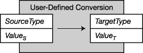

***图 16-26。**单步用户自定义转换*

但是用户定义的转换在完整转换中最多可以有三个步骤。[图 16-27](#fig_16_27) 说明了这些阶段，包括以下内容:

*   初步标准转换
*   用户定义的转换
*   以下标准转换

在这个链中*永远不会超过*一个用户定义的转换。

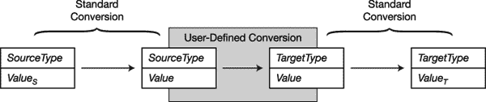

***图 16-27。**多步用户自定义转换*

#### 多步用户定义转换示例

下面的代码声明了从类`Person`派生的类`Employee`。

*   几节之前，代码示例声明了从类`Person`到`int`的用户定义转换。所以如果有一个从`Employee`到`Person`的标准转换和一个从`int`到`float`的标准转换，你可以从`Employee`转换到`float`。
    *   从`Employee`到`Person`有一个标准的转换，因为`Employee`来源于`Person`。
    *   有一个从`int`到`float`的标准转换，因为这是一个隐式的数字转换。
*   由于链的所有三个部分都存在，您可以从`Employee`转换到`float`。[图 16-28](#fig_16_28) 说明了编译器是如何执行转换的。

`   class Employee : Person { }

   class Person
   {
      public string Name;
      public int    Age;

      // Convert a Person object to an int.
      public static implicit operator int(Person p)
      {
          return p.Age;
      }
   }

   class Program
   {
      static void Main( )
      {
         Employee bill = new Employee();
         bill.Name = "William";
         bill.Age  = 25;
                            Convert an Employee to a float.
                         <ins>          ↓          </ins>
      float fVar = bill;

         Console.WriteLine("Person Info: {0}, {1}", bill.Name, fVar);
      }
   }`

该代码产生以下输出:

* * *

`Person Info: William, 25`

* * *

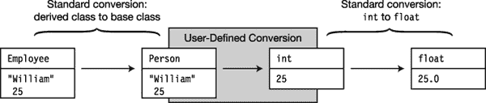

***图 16-28。**员工转浮动*

### 是运算符

如前所示，一些转换尝试不成功，并在运行时引发一个`InvalidCastExcept` ion 异常。您可以使用`is`操作符来检查转换是否会成功完成，而不是盲目地尝试转换。

`is`运算符的语法如下，其中 *`Expr`* 是源表达式:

`               Returns a bool
       <ins>                 ↓                 </ins>
   Expr is TargetType`

如果 *`Expr`* 可以通过以下任何一种方式成功转换为目标类型，则操作员返回`true`:

*   参考转换
*   拳击的转变
*   取消装箱转换

例如，下面的代码使用`is`操作符来检查类型为`Employee`的变量`bill`是否可以转换为类型`Person`，然后采取适当的操作。

`   class Employee : Person { }
   class Person
   {
      public string Name = "Anonymous";
      public int Age     = 25;
   }

   class Program
   {
      static void Main()
      {
         Employee bill = new Employee();
         Person p;

         // Check if variable bill can be converted to type Person
         if( bill is Person )
         {
            p = bill;
            Console.WriteLine("Person Info: {0}, {1}", p.Name, p.Age);
         }
      }
   }`

`is`运算符只能用于引用转换以及装箱和取消装箱转换。它*不能*用于用户定义的转换。

### as 运算符

除了不引发异常之外，`as`操作符与 cast 操作符相似。如果转换失败，它不会引发异常，而是返回`null`。

`as`操作符的语法如下，其中

*   *`Expr`* 是源表达式。
*   *`TargetType`* 是目标类型，必须是引用类型。

`             Returns a reference
       <ins>                 ↓                 </ins>
   Expr as TargetType`

因为`as`操作符返回一个引用表达式，所以它可以用作赋值的源。

例如，使用`as`运算符将类型为`Employee`的变量`bill`转换为类型为`Person`，并将其赋给类型为`Person`的变量`p`。然后代码在使用之前检查`p`是否为`null`。

`   class Employee : Person { }

   class Person
   {
      public string Name = "Anonymous";
      public int Age     = 25;
   }

   class Program
   {
      static void Main()
      {
         Employee bill = new Employee();
         Person p;

         p = bill as Person;
         if( p != null )
         {
            Console.WriteLine("Person Info: {0}, {1}", p.Name, p.Age);
         }
      }
   }`

像`is`操作符一样，`as`操作符只能用于引用转换和装箱转换。它*不能*用于用户定义的转换或值类型的转换。