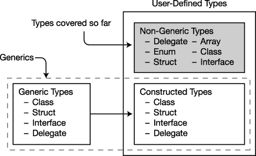

# 十七、泛型

### 什么是泛型？

使用到目前为止您所学的语言构造，您可以构建许多不同类型的强大对象。这主要是通过声明封装了所需行为的类，然后创建这些类的实例来实现的。

到目前为止，类声明中使用的所有类型都是特定类型——要么是程序员定义的，要么是语言或 BCL 提供的。然而，有些时候，如果您能够“提取”或“重构”出一个类的动作，并且不仅将它们应用于为其编码的数据类型，而且还应用于其他类型，那么这个类会更有用。

泛型允许你这样做。您可以重构您的代码，并添加一个额外的抽象层，以便对于某些类型的代码，数据类型不是硬编码的。这是专门为有多个代码段执行相同的指令，但数据类型不同的情况而设计的。

这听起来可能很抽象，所以我们将从一个例子开始，这个例子将使事情变得更清楚。

#### 一个堆栈示例

首先假设您已经创建了以下代码，它声明了一个名为`MyIntStack`的类，该类实现了一个`int`的堆栈。它允许您将`int`推到堆栈上并弹出它们。顺便说一下，这不是系统堆栈。

`   class MyIntStack                        // Stack for ints
   {
      int   StackPointer = 0;
      int[] StackArray;                    // Array of int
       ↑                 int
       int                 ↓  
      public void Push( int x )            // Input type: int
      {
         ...
      }       int
              ↓
      public int Pop()                     // Return type: int
      {
         ...
      }

        ...
   }`

现在假设您想要对类型`float`的值使用相同的功能。有几种方法可以实现这一点。一种方法是执行以下步骤来生成后续代码:

> 1.  And cut and paste the code of `MyIntStack` class.
> 2.  Change the class name to `MyFloatStack`.
> 3.  Change the appropriate `int` declaration to `float` declaration in the whole class declaration.

`   class MyFloatStack                     // Stack for floats
   {
      int   StackPointer = 0;
      float [] StackArray;                // Array of float
        ↑                float
       float                 ↓
      public void Push( float x )         // Input type: float
      {
         ...
      }
              float
               ↓
      public float Pop()                  // Return type: float
      {
         ...
      }

      ...

   }`

这种方法当然有效，但是容易出错，并且有以下缺点:

> *   You need to carefully check every part of the class to determine which type declarations need to be changed and which ones don't.
> *   You need to repeat this process (`long`, `double`, `string` and so on) for each new type of stack class you need. After this process, you will get multiple copies of almost the same code, occupying extra space. And debugging and maintenance are not elegant and error-prone.

### c# 中的泛型

*泛型*特性提供了一种更优雅的方式来使用一组具有多种类型的代码。泛型允许你声明*类型参数化的*代码，你可以用不同的类型实例化它。这意味着您可以编写带有“类型占位符”的代码，然后在创建该类的实例时提供*实际的*类型。

到目前为止，你应该非常熟悉类型不是对象而是对象模板的概念。同样，泛型类型不是类型，而是类型的模板。图 17-1 说明了这一点。

***图 17-1。**泛型类型是类型的模板。*

C# 提供了五种泛型:类、结构、接口、委托和方法。注意，前四个是类型，方法是成员。

图 17-2 显示了泛型是如何与其他类型相适应的。

***图 17-2。**泛型和用户自定义类型*

#### 继续堆栈示例

在栈的例子中，对于类`MyIntStack`和`MyFloatStack`，类的声明体是相同的，除了在处理由栈保存的值的类型的位置。

> *   In `MyIntStack`, these positions are occupied by type `int`.
> *   At `MyFloatStack`, they were occupied by `float`.

通过执行以下操作，您可以从`MyIntStack`创建一个通用类:

> 1.  Take `MyIntStack` class declaration, and replace `float` with `int` with type placeholder `T`.
> 2.  Change the class name to `MyStack`.
> 3.  Place the string `<T>` after the class name.

结果是下面的泛型类声明。由带`T`的尖括号组成的字符串意味着`T`是一个类型的占位符。(不一定是字母`T`——可以是任何标识符。)在`T`所在的整个类声明体中，编译器需要替换一个实际类型。

`   class MyStack <T>
   {
      int StackPointer = 0;
      T [] StackArray;
      ↑
                       ↓
      public void Push(T x ) {...}

             ↓
      public T Pop() {...}
         ...
   }`

### 类属

现在你已经看到了一个泛型类，让我们更详细地看看泛型类，看看它们是如何被创建和使用的。

如您所知，创建和使用您自己的常规、非泛型类有两个步骤:声明类和创建类的实例。然而，泛型类不是实际的类，而是类的模板——所以您必须首先从它们构造实际的类类型。然后，您可以从这些构造的类类型中创建引用和实例。

[图 17-3](#fig_17_3) 从高层次上说明了该过程。如果还不完全清楚，不要担心——我将在接下来的章节中介绍每个部分。

> 1.  Declare a class and use placeholders for certain types.
> 2.  Provide the *actual* type to replace the placeholder. This gives you an actual class definition, and all the "blanks" are filled in. This is called *structural type* .
> 3.  Create an instance of the constructed type.

***图 17-3。**从通用类型创建实例*

### 声明泛型类

声明一个简单的泛型类很像声明一个常规类，但有以下区别:

> 在类名后面放置一组匹配的尖括号。*   Between the angle brackets, you put a comma-separated list of placeholder strings, which represent types and will be provided as needed. These are called *type parameters* . You use type parameters in the declarant of generic classes to represent the types that should be replaced.T9】

例如，下面的代码声明了一个名为`SomeClass`的泛型类。类型参数列在尖括号之间，然后在整个声明体中使用，就像它们是实类型一样。

`                  Type parameters
                     <ins>   ↓  </ins>
   class SomeClass < T1, T2 >
   {   Normally, types would be used in these positions.
             ↓               ↓
      public T1 SomeVar  = new T1();
      public T2 OtherVar = new T2();
   }         ↑                                    ↑
        Normally, types would be used in these positions.`

没有标记泛型类声明的特殊关键字。相反，用尖括号分隔的类型参数列表的存在将泛型类声明与常规类声明区分开来。

### 创建构造类型

一旦声明了泛型类型，就需要告诉编译器应该用什么实际类型替换占位符(类型参数)。编译器接受这些实际类型并创建一个构造类型，构造类型是一个模板，它从这个模板创建实际的类对象。

创建构造类型的语法如下所示，包括列出类名和在尖括号之间提供真实类型，以代替类型参数。被类型参数替代的实类型被称为*类型* *实参。*

`            Type arguments
              <ins>   ↓      </ins>
   SomeClass< short, int >`

编译器接受类型实参，并用它们替换泛型类主体中相应的类型形参，从而生成构造类型——实际的类实例就是从构造类型中创建的。

[图 17-4](#fig_17_4) 显示了左边的泛型类`SomeClass`的声明。在右边，它显示了使用类型参数`short`和`int`创建的构造类。

***图 17-4。**为一个泛型类的所有类型参数提供类型实参允许编译器生成一个构造类，从这个构造类中可以创建实际的类对象。*

图 17-5 说明了类型参数和类型变量之间的区别。

> *   Generic class declaration has *type parameter* , which acts as a placeholder for the type.
> *   *Type parameter* is the actual type that you provided when you created the constructed type.

***图 17-5。**类型参数与类型实参*

### 创建变量和实例

在创建引用和实例时，构造的类类型就像常规类型一样使用。例如，下面的代码显示了两个类对象的创建。

> *   The first line shows the creation of an object from a regular non-generic class. This is a form that you should be fully familiar with by now.
> *   The second line of code shows that an object is created from the generic class `SomeClass` and instantiated with the types `short` and `int`. This form is completely similar to the above line, and the conventional class name is replaced by the constructed class form.
> *   The third line is semantically the same as the second line, but instead of listing the types of constructions on both sides of the equal sign, it uses the `var` keyword to let the compiler use type inference.

`   MyNonGenClass         myNGC = new MyNonGenClass        ();
       Constructed class                    Constructed class
   <ins>         ↓           </ins>              <ins>         ↓           </ins>
   SomeClass<short, int>  mySc1 = new SomeClass<short  int>();
   var                    mySc2 = new SomeClass<short, int>();`

与非通用类一样，引用和实例可以分别创建，如图[图 17-6](#fig_17_6) 所示。该图还显示了内存中发生的事情与非泛型类相同。

> *   Class declares that the first behavior variable `myInst` below allocates a reference in the stack. Its value is `null`.
> *   The second line allocates an instance in the heap and assigns its reference to the variable.

***图 17-6。**使用构造类型创建引用和实例*

许多不同的类类型可以从同一个泛型类中构造。每一个都是独立的类类型，就像它有自己独立的非泛型类声明一样。

例如，下面的代码显示了从泛型类`SomeClass`创建两个类型。代码如图[图 17-7](#fig_17_7) 所示。

> *   One type consists of types `short` and `int`.
> *   The other is composed of `int` and `long`.

`   class SomeClass< T1, T2 >                            // Generic class
   {
      ...
   }

   class Program
   {
      static void Main()
      {
         var first  =  new SomeClass<short, int >();    // Constructed type
         var second =  new SomeClass<int,   long>();    // Constructed type

            ...` 

***图 17-7。**从一个泛型类创建了两个不同的构造类*

#### 使用泛型的堆栈示例

下面的代码显示了使用泛型实现的堆栈示例。方法`Main`定义了两个变量:`stackInt`和`stackString`。使用`int`和`string`作为类型参数创建两个构造类型。

`class MyStack<T>
   {
      T[] StackArray;
      int StackPointer = 0;

      public void Push(T x)
      {
         if ( !IsStackFull )
            StackArray[StackPointer++] = x;
      }

      public T Pop()
      {
         return ( !IsStackEmpty )
            ? StackArray[--StackPointer]
            : StackArray[0];
      }

      const int MaxStack = 10;
      bool IsStackFull  { get{ return StackPointer >= MaxStack; } }
      bool IsStackEmpty { get{ return StackPointer <= 0; } }

      public MyStack()
      {
         StackArray = new T[MaxStack];
      }

      public void Print()
      {
         for (int i = StackPointer-1; i >= 0 ; i--)
            Console.WriteLine("   Value: {0}", StackArray[i]);
      }
   }` `   class Program
   {
      static void Main( )
      {
         MyStack<int>    StackInt    = new MyStack<int>();
         MyStack<string> StackString = new MyStack<string>();

         StackInt.Push(3);
         StackInt.Push(5);
         StackInt.Push(7);
         StackInt.Push(9);
         StackInt.Print();

         StackString.Push("This is fun");
         StackString.Push("Hi there!  ");
         StackString.Print();
      }
   }`

该代码产生以下输出:

* * *

`Value: 9
   Value: 7
   Value: 5
   Value: 3

   Value: Hi there!
   Value: This is fun` 

* * *

#### 比较泛型和非泛型堆栈

表 17-1 总结了栈的初始非泛型版本和最终泛型版本之间的一些差异。[图 17-8](#fig_17_8) 说明了其中的一些差异。

***图 17-8。**非泛型栈与泛型栈*

### 对类型参数的约束

在通用堆栈示例中，堆栈除了存储和弹出项目之外，没有对它包含的项目做任何事情。它没有尝试添加它们，比较它们，或者做任何其他需要使用项目本身的操作的事情。这是有充分理由的。因为通用堆栈不知道它将要存储的项的类型，所以它不能知道这些类型实现了什么成员。

然而，所有的 C# 对象最终都是从类`object`中派生出来的，所以堆栈可以确定的一件事就是它们实现了类`object`的成员。这些方法包括`ToString`、`Equals`和`GetType`。除此之外，它无法知道哪些成员可用。

只要你的代码不访问它处理的类型的对象(或者只要它坚持类型`object`的成员)，你的泛型类可以处理任何类型。满足这个约束的类型参数叫做*无界类型参数*。但是，如果您的代码试图使用任何其他成员，编译器将产生错误信息。

例如，下面的代码用一个名为`LessThan`的方法声明了一个名为`Simple`的类，该方法采用两个相同泛型类型的变量。`LessThan`试图返回使用小于运算符的结果。但是并不是所有的类都实现小于操作符，所以你不能用任何一个类来代替`T`。因此，编译器会产生一条错误信息。

`   class Simple<T>
   {
      static public bool LessThan(T i1, T i2)
      {
         return i1 < i2;                      // Error
      }
      ...
   }`

为了使泛型更有用，你需要能够向编译器提供关于什么类型的类型可以作为参数的附加信息。这些额外的信息位被称为*约束*。只有满足约束的类型才能替换给定的类型参数，以生成构造类型。

#### Where 从句

约束被列为`where`子句。

> *   Each constrained type parameter has its own `where` clause.
> *   If a parameter has multiple constraints, they are listed in the `where` clause, separated by commas.

`where`子句的语法如下:

`         Type parameter          Constraint list
              ↓       <ins>           ↓                </ins>
   where  TypeParam : constraint, constraint, ...
     ↑              ↑
   Keyword          Colon`

关于`where`条款的要点如下:

> *   They are listed after the closing angle bracket of the type parameter list.
> *   They are not separated by commas or any other symbols.
> *   They can be listed in any order.
> *   Token 【T0] is a contextual keyword, so it can be used in other contexts.

例如，下面的泛型类有三个类型参数。`T1`无界。对于`T2`，只有`Customer`类型的类或者从 `Customer`派生的类*可以用作类型参数。对于`T3`，只有实现接口`IComparable`的类才能被用作类型参数。*

`             Unbounded   With constraints
                   ↓   <ins>   ↓  </ins>     No separators
   class MyClass < T1, T2, T3 >      ↓
                   where T2: Customer                   // Constraint for T2
                   where T3: IComparable                // Constraint for T3
   {                                    ↑
      ...                           No separators
   }`

#### 约束类型和顺序

有五种类型的约束。这些在[表 17-2](#tab_17_2) 中列出。

`where`子句可以按任何顺序列出。然而，`where`子句中的约束必须以特定的顺序放置，如图[图 17-9](#fig_17_9) 所示。

> *   There can only be one master constraint at most, and if there is one, it must be listed first.
> *   There can be any number of *`InterfaceName`* constraints.
> *   If the constructor constraint exists, it must be listed last.

***图 17-9。**如果一个类型参数有多个约束，它们必须按照这个顺序。*

以下声明显示了`where`子句的示例:

`   class SortedList<S>
            where S: IComparable<S> { ... }

   class LinkedList<M,N>
            where M : IComparable<M>
            where N : ICloneable    { ... }

   class MyDictionary<KeyType, ValueType>
            where KeyType : IEnumerable,
            new()                   { ... }`

### 通用方法

与其他泛型不同，方法不是类型，而是成员。你可以在泛型和非泛型类中，以及在结构和接口中声明泛型方法，如图 17-10 所示。

***图 17-10。**泛型方法可以在泛型和非泛型类型中声明。*

#### 声明一个泛型方法

泛型方法有一个类型参数列表和可选约束。

> *   Generic methods have two parameter lists:
>     *   *List of method parameters* , enclosed in brackets.
>     *   *List of type parameters* , enclosed in angle brackets.
> *   To declare a generic method, do the following:
>     *   Put the type parameter list after the method name and before the method parameter list.
>     *   Put any constraint clauses after the method parameter list.

`                    Type parameter list           Constraint clauses
                         <ins> ↓  </ins>               <ins>     ↓         </ins>
   public void PrintData<S, T> (<ins>S p, T t</ins>) where S: Person
   {                                ↑
   ...                       Method parameter list
   }`

 **注意**记住类型参数列表在方法名之后，方法参数列表之前。

#### 调用通用方法

若要调用泛型方法，请为方法调用提供类型参数，如下所示:

`           Type arguments
            <ins>    ↓      </ins>
   MyMethod<short, int>();
   MyMethod<int, long >();`

[图 17-11](#fig_17_11) 显示了一个名为`DoStuff`的泛型方法的声明，它有两个类型参数。在它下面有两个调用该方法的地方，每个地方都有一组不同的类型参数。编译器使用这些构造的实例中的每一个来产生该方法的不同版本，如图右侧所示。

***图 17-11。**具有两个实例化的通用方法*

##### 推断类型

如果将参数传递给一个方法，编译器有时可以从*方法参数*的类型中推断出哪些类型应该被用作泛型方法的*类型参数*。这可以使方法调用更简单，更容易阅读。

例如，下面的代码声明了`MyMethod`，它采用与类型参数相同类型的方法参数。

`   public void MyMethod <T> (T myVal) { ... }
                         ↑   ↑
                     Both are of type T`

如果用类型为`int`的变量调用`MyMethod`，如下面的代码所示，方法调用的类型参数中的信息是多余的，因为编译器可以从方法参数中看出它是一个`int`。

`   int myInt = 5;
   MyMethod <int> (myInt);
              ↑      ↑
             Both are ints`

因为编译器可以从方法参数中推断出类型参数，所以可以在调用中省略类型参数及其尖括号，如下所示:

`   MyMethod(myInt);`

#### 泛型方法的例子

下面的代码在名为`Simple`的非泛型类中声明了一个名为`ReverseAndPrint`的泛型方法。该方法将任何类型的数组作为其参数。`Main`声明了三种不同的数组类型。然后，它对每个数组调用该方法两次。第一次使用特定数组调用方法时，它显式使用类型参数。第二次，推断类型。

`   class Simple                                          // Non-generic class
   {
      static public void ReverseAndPrint<T>(T[] arr)     // Generic method
      {
         Array.Reverse(arr);
         foreach (T item in arr)                         // Use type argument T.
            Console.Write("{0}, ", item.ToString());
         Console.WriteLine("");
      }
   }

   class Program
   {
      static void Main()
      {
         // Create arrays of various types.
         var intArray    = new int[]    { 3, 5, 7, 9, 11 };
         var stringArray = new string[] { "first", "second", "third" };
         var doubleArray = new double[] { 3.567, 7.891, 2.345 };

         Simple.ReverseAndPrint<int>(intArray);        // Invoke method.
         Simple.ReverseAndPrint(intArray);             // Infer type and invoke.

         Simple.ReverseAndPrint<string>(stringArray);  // Invoke method.
         Simple.ReverseAndPrint(stringArray);          // Infer type and invoke.

         Simple.ReverseAndPrint<double>(doubleArray);  // Invoke method.
         Simple.ReverseAndPrint(doubleArray);          // Infer type and invoke.
      }
   }`

该代码产生以下输出:

* * *

`11, 9, 7, 5, 3,
3, 5, 7, 9, 11,
third, second, first,
first, second, third,
2.345, 7.891, 3.567,
3.567, 7.891, 2.345,`

* * *

### 用泛型类扩展方法

扩展方法在[第 7 章](07.html)中有详细描述，并且和一般类一样有效。它们允许您将一个类中的静态方法与不同的泛型类相关联，并调用该方法，就像它是该类的构造实例上的实例方法一样。

与非泛型类一样，泛型类的扩展方法必须满足以下约束:

> `static`
> 
> *   It must be a member of a static class.
> *   It must contain the keyword `this` as its first parameter type, followed by the name of the generic class it extends.

下面的代码展示了一个名为`Holder<T>`的泛型类上名为`Print`的扩展方法的例子:

`    static class ExtendHolder
    {
        public static void Print<T>(this Holder<T> h)
        {
            T[] vals = h.GetValues();
            Console.WriteLine("{0},\t{1},\t{2}", vals[0], vals[1], vals[2]);
        }
    }

    class Holder<T>
    {
        T[] Vals = new T[3];

        public Holder(T v0, T v1, T v2)
        { Vals[0] = v0; Vals[1] = v1; Vals[2] = v2; }

        public T[] GetValues() { return Vals; }    
    }

    class Program
    {
        static void Main(string[] args) {
            var intHolder    = new Holder<int>(3, 5, 7);
            var stringHolder = new Holder<string>("a1", "b2", "c3");
            intHolder.Print();
            stringHolder.Print();
        }
    }`

该代码产生以下输出:

* * *

`3,      5,      7
a1,     b2,     c3`

* * *

### 通用结构

像泛型类一样，泛型结构可以有类型参数和约束。泛型结构的规则和条件与泛型类的规则和条件相同。

例如，下面的代码声明了一个名为`PieceOfData`的通用结构，它存储和检索一段数据，数据的类型是在构造类型时确定的。`Main`创建两种构造类型的对象——一种使用`int`，另一种使用`string`。

`   struct PieceOfData<T>                             // Generic struct
   {
      public PieceOfData(T value) { _data = value; }
      private T _data;
      public  T Data
      {
         get { return _data; }
         set { _data = value; }
      }
   }

   class Program
   {
      static void Main()          Constructed type
      {                       <ins>         ↓           </ins>
         var intData    = new PieceOfData<int>(10);
         var stringData = new <ins>PieceOfData<string>("Hi there.")</ins>;
                                            ↑
                                      Constructed type
         Console.WriteLine("intData    = {0}", intData.Data);
         Console.WriteLine("stringData = {0}", stringData.Data);
      }
   }`

该代码产生以下输出:

* * *

`intData    = 10
stringData = Hi there.`

* * *

### 通用代理人

泛型委托与非泛型委托非常相似，只是类型参数决定了将接受哪些方法的特征。

> *   To declare a generic delegate, put the type parameter list in angle brackets after the delegate name and before the delegate parameter list. `                     Type parameters
>                              <ins> ↓   </ins>
>        delegate R MyDelegate<T, R>( <ins>T value</ins> );
>                 ↑                      ↑
>              Return type         Delegate formal parameter`
> *   Note that there are two parameter lists: delegate parameter list and type parameter list.
> *   The range of parameters includes the following:
>     *   Return type
>     *   Parameter list
>     *   Constraint clause

下面的代码展示了一个泛型委托的例子。在`Main`中，通用委托`MyDelegate`用类型`string`的参数实例化，并用方法`PrintString`初始化。

`   delegate void MyDelegate<T>(T value);             // Generic delegate

   class Simple
   {
      static public void PrintString(string s)       // Method matches delegate
      {
         Console.WriteLine(s);
      }

      static public void PrintUpperString(string s)  // Method matches delegate
      {
         Console.WriteLine("{0}", s.ToUpper());
      }
   }

   class Program
   {
      static void Main( )
      {
         var myDel =                                 // Create inst of delegate.
            new MyDelegate<string>(Simple.PrintString);
         myDel += Simple.PrintUpperString;           // Add a method.

         myDel("Hi There.");                         // Call delegate.
      }
   }`

该代码产生以下输出:

* * *

`Hi There.
HI THERE.`

* * *

#### 另一个通用委托示例

由于 C# 的 LINQ 特性广泛使用了泛型委托，所以在此之前有必要展示另一个例子。我将在第 19 章中讲述 LINQ 本身，以及更多关于它的一般代表。

下面的代码声明了一个名为`Func`的泛型委托，它采用带有两个参数和返回值的方法。方法返回类型表示为`TR`，方法参数类型表示为`T1`和`T2`。

`                           Delegate parameter type
                           ↓  ↓      ↓     ↓
   public delegate TR Func<T1, T2, TR>(T1 p1, T2 p2);  // Generic delegate
                   ↑                ↑
   class Simple     Delegate return type
   {
      static public string PrintString(int p1, int p2) // Method matches delegate
      {
         int total = p1 + p2;
         return total.ToString();
      }
   }

   class Program
   {
      static void Main()
      {
         var myDel =                                   // Create inst of delegate.
            new Func<int, int, string>(Simple.PrintString);

         Console.WriteLine("Total: {0}", myDel(15, 13));  // Call delegate.
      }
   }`

该代码产生以下输出:

* * *

`Total: 28`

* * *

### 通用接口

泛型接口允许您编写接口，其中接口成员的形参和返回类型是泛型类型参数。泛型接口声明类似于非泛型接口声明，但在接口名称后的尖括号中有类型参数列表。

例如，下面的代码声明了一个名为`IMyIfc`的通用接口。

> *   `Simple` is a general class that implements the general interface `IMyIfc`.
> *   `Main` Instantiate two objects of the generic class: one type is `int` and the other type is `string`.

`                Type parameter
                    ↓
   interface IMyIfc<T>                          // Generic interface
   {
      T ReturnIt(T inValue);
   }
        Type parameter   Generic interface
                ↓    <ins>   ↓     </ins>
   class Simple<S> : IMyIfc<S>                  // Generic class
   {
      public S ReturnIt(S inValue)              // Implement generic interface.
      { return inValue; }
   }

   class Program
   {
      static void Main()
      {
         var trivInt    = new Simple<int>();
         var trivString = new Simple<string>();

         Console.WriteLine("{0}", trivInt.ReturnIt(5));
         Console.WriteLine("{0}", trivString.ReturnIt("Hi there."));
      }
   }`

该代码产生以下输出:

* * *

`5
Hi there.`

* * *

#### 一个使用通用接口的例子

以下示例说明了通用接口的两个附加功能:

> *   Like other generics, instances of generic interfaces instantiated with different type parameters are different interfaces.
> *   You can implement a generic interface in the *non-generic type* .

例如，下面的代码类似于上一个例子，但是在这个例子中，`Simple`是一个*非泛型*类，它实现了一个泛型接口。事实上，它实现了`IMyIfc`的两个实例。一个实例用类型`int`实例化，另一个用类型`string`实例化。

`   interface IMyIfc<T>                            // Generic interface
   {
      T ReturnIt(T inValue);
   }
          Two different interfaces from the same generic interface
                  <ins>   ↓       </ins>  <ins>   ↓         </ins>
   class Simple : IMyIfc<int>, IMyIfc<string>     // Nongeneric class
   {
      public int ReturnIt(int inValue)            // Implement interface using int.
      { return inValue; }

      public string ReturnIt(string inValue)      // Implement interface using string.
      { return inValue; }
   }

   class Program
   {
      static void Main()
      {
         Simple trivial = new Simple();

         Console.WriteLine("{0}", trivial.ReturnIt(5));
         Console.WriteLine("{0}", trivial.ReturnIt("Hi there."));
      }
   }`

该代码产生以下输出:

* * *

`5
Hi there.`

* * *

#### 通用接口实现必须是唯一的

当在泛型类型中实现接口时，不能有可能在该类型中创建重复接口的类型参数组合。

例如，在下面的代码中，类`Simple`使用了接口`IMyIfc`的两个实例。

> *   The first is the construction type, which is instantiated with the type `int`.
> *   The second one has type parameters but no arguments.

第二个接口本身没有问题，因为使用通用接口完全没问题。然而，这里的问题是，它允许一个可能的冲突，因为如果在第二个接口中使用`int`作为类型参数来替换`S`，那么`Simple`将有两个相同类型的接口——这是不允许的。

`   interface IMyIfc<T>
   {
      T ReturnIt(T inValue);
   }
                           Two interfaces
                     <ins>     ↓     </ins>  <ins>    ↓    </ins>
   class Simple<S> : IMyIfc<int>, IMyIfc<S>     // Error!
   {
      public int ReturnIt(int inValue)   // Implement first interface.
      {
         return inValue;
      }

      public S ReturnIt(S inValue)       // Implement second interface,
      {                                  // but if it's int, it would be
         return inValue;                 // the same as the one above.
      }
   }`

 **注意**通用接口的名称不会与非通用接口冲突。例如，在前面的代码中，我们也可以声明一个名为`IMyIfc`的非泛型接口。

### 协方差

正如你在本章看到的，当你创建一个泛型类型的实例时，编译器接受泛型类型声明和类型参数并创建一个构造类型。然而，人们经常犯的一个错误是，认为可以将派生类型的委托赋给基类型委托的变量。在接下来的几节中，我们将看看这个主题，它叫做方差。方差有三种类型——*协方差*、*方差*和*不变性*。

我们将从回顾你已经学过的一些东西开始:每个变量都有一个分配给它的类型，你可以分配一个更派生类型的对象给它的一个基本类型的变量。这被称为*赋值兼容性*。下面的代码演示了与基类`Animal`和从`Animal`派生的类`Dog`的赋值兼容性。在`Main`中，您可以看到代码创建了一个类型为`Dog`的对象，并将其赋给类型为`Animal`的变量`a2`。

`   class Animal
   {
      public int NumberOfLegs = 4;
   }

   class Dog : Animal
   {
   }

   class Program
   {
      static void Main( )
      {
         Animal a1 = new Animal( );
         Animal a2 = new Dog( );

         Console.WriteLine( "Number of dog legs: {0}", a2.NumberOfLegs );
      }
   }`

该代码产生以下输出:

* * *

`Number of dog legs: 4`

* * *

[图 17-12](#fig_17_12) 说明了赋值兼容性。在该图中，显示`Dog`和`Animal`对象的方框也显示了它们的基类。

***图 17-12。**赋值兼容性意味着你可以将一个更多派生类型的引用赋给一个更少派生类型的变量。*

现在让我们通过以下方式扩展代码来看一个更有趣的例子，如下面的代码所示:

> *   This code adds a generic delegate named `Factory`, which only accepts one type parameter `T` and no method parameter, and returns an object of type `T`.
> *   I added a method named `MakeDog`, which has no parameters and returns a `Dog` object. Therefore, if we use `Dog` as the type parameter, this method matches the delegate `Factory`.
> *   The first line of `Main` creates a delegate object of type `delegate Factory<Dog>` and assigns its reference to variable `dogMaker` of the same type.
> *   The second line attempts to assign the delegate of type `delegate Factory<Dog>` to the delegate type variable `animalMaker` of type `delegate Factory<Animal>`.

然而，`Main`中的第二行引起了一个问题，编译器产生了一个错误消息，说它不能隐式地将右边的类型转换成左边的类型。

`   class Animal       { public int Legs = 4; }  // Base class
   class Dog : Animal { }                       // Derived class

   delegate T Factory<T>( );       ← delegate Factory

   class Program
   {
      static Dog MakeDog( )        ← Method that matches delegate Factory
      {
         return new Dog( );
      }

      static void Main( )
      {
         Factory<Dog>    dogMaker    = MakeDog;   ← Create delegate object.
         Factory<Animal> animalMaker = dogMaker;  ← Attempt to assign delegate object.

         Console.WriteLine( animalMaker( ).Legs.ToString( ) );
      }
   }`

用基类型构造的委托应该能够保存用派生类型构造的委托，这似乎是有道理的。那么为什么编译器会给出错误信息呢？赋值兼容原则不成立吗？

原则*确实*成立，但不适用于这种情况！问题是，虽然`Dog`派生自`Animal`，但是委托`Factory<Dog>`并不*而不是*派生自委托`Factory<Animal>`。相反，这两个委托对象是对等的，从类型 d `elegate`派生，从类型`object`派生，如图[图 17-13](#fig_17_13) 所示。这两个委托都不是从另一个委托派生的，因此赋值兼容性不适用。

***图 17-13。**赋值兼容性不适用，因为这两个委托没有继承关系。*

尽管委托类型的不匹配不允许将一种类型赋给另一种类型的变量，但在这种情况下这太糟糕了，因为在示例代码中，任何时候我们执行委托`animalMaker`，调用代码都会期望返回对一个`Animal`对象的引用。如果它返回一个对`Dog`对象的引用，那也没问题，因为根据赋值兼容性，对`Dog`的引用就是对`Animal`的引用。

更仔细地观察这种情况，我们可以看到，对于任何泛型委托，如果类型参数仅用作输出值，那么同样的情况也适用。在所有这些情况下，您将能够使用用派生类创建的构造委托类型，并且它将工作得很好，因为调用代码将总是期望对基类的引用——这正是它将得到的。

这种派生类型仅作为输出值的使用和构造的委托的有效性之间的常数*关系*被称为*协方差*。为了让编译器知道这是您想要的，您必须在委托声明中用`out`关键字标记类型参数。

如果我们通过添加关键字`out`来更改示例中的委托声明，如下所示，代码会编译并正常运行:

`   delegate T Factory<out T>( );
                                         ↑
            Keyword specifying covariance
              of the type parameter`

[图 17-14](#fig_17_14) 说明了本例中协方差的组成部分:

> *   The variables on the left stack are of type `delegate` `T Factory<out T>()`, in which the type variable `T` is of type `Animal`.
> *   The delegate actually constructed in the right heap is declared by the type variable of class `Dog`, which is derived from class `Animal`. This is acceptable because when the delegate is called, the calling code receives the object of type `Dog` instead of the expected object of type `Animal`. The calling code can freely operate the `Animal` part of the object, just as it expected.

***图 17-14。**协变关系允许更派生的类型在返回和输出位置。*

### 逆变

既然你理解了协方差，我们来看一个相关的情况。下面的代码声明了一个名为`Action1`的委托，它接受一个类型参数和一个方法参数，方法参数的类型是类型参数的类型，并且不返回值。

代码还包含一个名为`ActOnAnimal`的方法，其签名和`void`返回类型与委托声明相匹配。

`Main`中的第一行使用类型`Animal`和方法`ActOnAnimal`创建一个构造的委托，其签名和`void`返回类型与委托声明相匹配。然而，在第二行中，代码试图将对这个委托的引用分配给一个名为`dog1`、类型为`delegate Action1<Dog>`的堆栈变量。

`   class Animal { public int NumberOfLegs = 4; }
   class Dog : Animal { }

   class Program         Keyword for contravariance
   {                        ↓
      delegate void Action1<in T>( T a );

      static void ActOnAnimal( Animal a ) { Console.WriteLine( a.NumberOfLegs ); }

      static void Main( )
      {
         Action1<Animal> act1 = ActOnAnimal;
         Action1<Dog>    dog1 = act1;
         dog1( new Dog() );
      }
   }`

该代码产生以下输出:

* * *

`4`

* * *

和前面的情况一样，默认情况下，你不能分配这两个不兼容的类型。但是也和前面的情况一样，有些情况下这个任务会很好的完成。

事实上，每当类型参数*仅用作委托中方法的输入参数*时，这都是正确的。这样做的原因是，即使调用代码传入一个对更多派生类的引用，委托中的方法也只是期望一个对更少派生类的引用——当然，它接收并知道如何操作这个类。

这种关系，允许一个派生程度更高的对象出现在一个派生程度更低的对象出现的地方，被称为*逆变*。要使用它，您必须使用带有类型参数的`in`关键字，如代码所示。

[图 17-15](#fig_17_15) 说明了`Main`第二行的逆变成分。

> *   The variables on the left stack are of type `delegate` `void Action1<in T>(T p)`, and the type variables here are of type `Dog`.
> *   The delegate actually constructed on the right is declared by the type variable of class `Animal`, which is the base class of class `Dog`.
> *   This is good, because when the delegate is called, the calling code passes an object of type `Dog` to method `ActOnAnimal`, which requires an object of type `Animal`. This method can freely operate the `Animal` part of the object, just as it is expected.

***图 17-15。**逆变关系允许更多的派生类型作为输入参数。*

[图 17-16](#fig_17_16) 总结了一般委托中协方差和逆变的区别。

> *   The figure above illustrates the covariance.
>     *   The variable on the left stack is of type delegate `F<out T>( )`, where the type parameter is a class named `Base`.
>     *   The delegate actually constructed on the right is declared by the type parameter of class `Derived`, which is derived from class `Base`. This is good because when the delegate is called, the method returns a reference to the object of the derived type, which is also a reference to the base class, which is exactly what the calling code expects.
> *   The following figure illustrates the comparison.
>     *   The variables on the left stack are of type `delegate` `void F<in T>(T p)`, and the type parameters here are of type `Derived`. The delegate actually constructed on the right is declared by the type parameter of class `Base`, which is the base class of class `Derived`. This is good because when the delegate is called, the calling code passes an object of derived type to the method, which requires an object of base type. The method can operate freely on the basic part of the object as expected.

***图 17-16。**协方差和逆变的比较*

#### 界面中的协变和逆变

现在，您应该对应用于代理的协变和逆变有所了解。同样的原则也适用于接口，包括在接口声明中使用关键字`out`和`in`的语法。

以下代码显示了一个将协方差用于接口的示例。关于代码需要注意的事项如下:

> *   A generic interface is declared with the type parameter `T`. `out` The type parameter specified by the keyword is covariant.
> *   The generic class `SimpleReturn` implements the generic interface.
> *   Method `DoSomething` shows how a method takes *interface* as a parameter. This method takes the general `IMyIfc` interface constructed by type `Animal` as its parameter.

该代码的工作方式如下:

> *   The first two lines of `Main` use class `Dog` to create and initialize the construction instance of generic class `SimpleReturn`.
> *   The next line assigns the object to a variable on the stack, which is declared as the constructor interface type `IMyIfc<Animal>`. Pay attention to some things about this statement:
>     *   The type on the left of the assignment is an interface type-not a class.
>     *   Even if the interface types do not exactly match, the compiler allows them, because there is a covariant `out` specifier in the interface declaration.
> *   Finally, the code calls the method `DoSomething` with the constructed covariant class that implements the interface.

`    class Animal { public string Name; }
    class Dog: Animal{ };
                  Keyword for covariance
                      ↓
    interface IMyIfc<out T>
    {
        T GetFirst();
    }

    class SimpleReturn<T>: IMyIfc<T>
    {
        public T[] items = new T[2];
        public T GetFirst() { return items[0]; }
    }

    class Program
    {
        static void DoSomething(IMyIfc<Animal> returner)
        {
            Console.WriteLine(returner.GetFirst().Name);
        }

        static void Main( )
        {
            SimpleReturn<Dog> dogReturner = new SimpleReturn<Dog>();
            dogReturner.items[0] = new Dog() { Name = "Avonlea" };

            IMyIfc<Animal> animalReturner = dogReturner;

            DoSomething(dogReturner);
        }
    }`

该代码产生以下输出:

* * *

`Avonlea`

* * *

#### 更多关于方差

前两节解释了显式协方差和逆变。还有一种情况，编译器自动识别某个构造的委托是协变的或逆变的，并自动进行类型强制。当对象还没有分配类型时，就会发生这种情况。下面的代码显示了一个示例。

`Main`的第一行从一个返回类型是`Dog`对象而不是`Animal`对象的方法创建了一个`Factory<Animal>`类型的构造委托。当`Main`创建这个委托时，赋值操作符右边的方法名还不是委托对象，因此没有委托类型。此时，编译器可以确定该方法匹配委托的类型，除了它的返回类型是类型`Dog`而不是类型`Animal`。编译器足够聪明，能够意识到这是一个协变关系，并创建构造类型，将其赋给变量。

比较一下`Main`第三行和第四行的赋值。在这些情况下，等号右边的表达式已经是委托，因此具有委托类型。因此，这些需要委托声明中的`out`说明符来通知编译器允许它们协变。

`   class Animal { public int Legs = 4; }               // Base class
   class Dog : Animal { }                              // Derived class

   class Program
   {
      delegate T Factory<out T>();

      static Dog MakeDog() { return new Dog(); }

      static void Main()
      {
          Factory<Animal> animalMaker1 = MakeDog;      // Coerced implicitly

          Factory<Dog>    dogMaker     = MakeDog;
          Factory<Animal> animalMaker2 = dogMaker;     // Requires the out specifier

          Factory<Animal> animalMaker3
                    = new Factory<Dog>(MakeDog);       // Requires the out specifier
      }
   }`

关于方差，你还应该知道其他一些重要的事情:

> *   As you can see, it is a safe problem for variance processing to replace a derived type with a basic type, and vice versa. Therefore, variance only applies to reference types-because other types cannot be derived from value types.
> *   Explicit differences using the keywords `in` and `out` only apply to delegates and interfaces-not to classes, structures or methods.
> *   Delegates and interface type parameters that don't contain `in` or `out` keywords are called *invariants* . These types cannot be used in covariant or inversion.

`                         Contravariant
                            <ins>  ↓  </ins>
  delegate T Factory<<ins>out R</ins>, in S, T>( );
                       ↑          ↑
                 Covariant        Invariant`