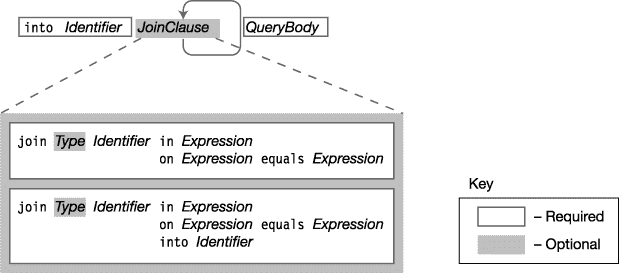

# 十九、LINQ 简介

### 什么是 LINQ？

在关系数据库系统中，数据被很好地组织成规范化的表，并使用一种非常简单但功能强大的查询语言——SQL 来访问。SQL 可以处理数据库中的任何数据集，因为数据是按照严格的规则组织到表中的。

然而，在程序中，与数据库相反，数据存储在完全不同的类对象或结构中。因此，还没有通用的查询语言来从数据结构中检索数据。从对象中检索数据的方法一直是作为程序的一部分定制设计的。然而，LINQ 使查询对象集合变得很容易。

以下是 LINQ 的重要高级特征:

> *   LINQ stands for *language comprehensive query* , pronounced as *link* .
> *   It's an extension of LINQ. NET Framework, and allows you to query the data collection in a way similar to querying the database with SQL. With LINQ, you can query data from databases, program object collections, XML documents, etc.

下面的代码显示了一个使用 LINQ 的简单示例。在这段代码中，被查询的数据源只是一个由`int`组成的数组。查询的定义是带有`from`和`select`关键字的语句。虽然在这个语句中查询是由*定义的*，但是直到底部的`foreach`语句中需要结果时才真正执行。

`   static void Main()
   {
      int[] numbers = { 2, 12, 5, 15 };         // Data source

      IEnumerable<int> lowNums =                // Define and store the query.
                         from n in numbers
                         where n < 10
                         select n;

      foreach (var x in lowNums)                // Execute the query.
          Console.Write("{0}, ", x);
   }`

该代码产生以下输出:

* * *

`2, 5,`

* * *

### LINQ 供应商

在前面的例子中，数据源只是一个由`int`组成的数组，它是程序的内存对象。然而，LINQ 可以处理许多不同类型的数据源，比如 SQL 数据库、XML 文档和许多其他数据源。然而，对于每种数据源类型，都必须有一个代码模块根据该数据源类型实现 LINQ 查询。这些代码模块被称为 *LINQ 提供者*。关于 LINQ 提供商的要点如下:

> *   Microsoft provides LINQ providers for some common data source types, as shown in figure [and figure 19-1](#fig_19_1) .
> *   You can use any LINQ-supported language (C# in our example) to query any data source type with LINQ provider. Third parties are constantly developing new LINQ providers for various data source types.

***图 19-1** 。LINQ、支持 LINQ 的语言和 LINQ 提供者*

有整本书致力于 LINQ 的所有形式和微妙之处，但这显然超出了本章的范围。相反，本章将向您介绍 LINQ，并解释如何将它用于程序对象(LINQ 到对象)和 XML (LINQ 到 XML)。

#### 匿名类型

在详细介绍 LINQ 的查询特性之前，我将首先介绍一种语言特性，它允许您创建未命名的类类型。毫不奇怪，这些被称为*匿名类型*。匿名类型通常用于 LINQ 查询的结果。

第 6 章讲述了*对象初始化器*，它允许你在使用对象创建表达式时初始化一个新类实例的字段和属性。提醒您一下，这种对象创建表达式由三部分组成:关键字`new`、类名或构造函数以及对象初始化器。对象初始化器由一组花括号之间的逗号分隔的成员初始化器列表组成。

创建匿名类型的变量使用相同的形式——但是没有类名或构造函数。以下代码行显示了匿名类型的对象创建表达式形式:

`   No class name        Anonymous object initializer
       ↓ <ins>                      ↓                      </ins>
   new  { <ins>FieldProp = InitExpr</ins>, <ins>FieldProp = InitExpr</ins>, ...}
                   ↑                     ↑
              Member initializer          Member initializer`

下面的代码显示了一个创建和使用匿名类型的示例。它创建了一个名为`student`的变量，其匿名类型有两个`string`属性和一个`int`属性。注意在`WriteLine`语句中，实例的成员被访问，就像它们是一个命名类型的成员一样。

`   static void Main( )
   {
      var student = new <ins>{Name="Mary Jones", Age=19, Major="History"}</ins>;
       ↑                                         ↑
   Must use var                            Anonymous object initializer

      Console.WriteLine("{0}, Age {1}, Major: {2}",
                         student.Name, student.Age, student.Major);
   }`

该代码产生以下输出:

* * *

`Mary Jones, Age 19, Major: History`

* * *

关于匿名类型，需要了解的重要事项如下:

> *   Anonymous types can only be used for local variables, not class members.
> *   Because anonymous types have no name, the keyword `var` must be used as the variable type.
> *   You can't assign attributes to an object of anonymous type. Attributes created by the compiler for anonymous types are read-only.

当编译器遇到匿名类型的对象初始化器时，它用自己构造的私有名称创建一个新的类类型。对于每个成员初始化器，它推断其类型并创建一个只读属性来访问其值。属性与成员初始值设定项同名。一旦构造了匿名类型，编译器就创建该类型的对象。

除了成员初始值设定项的赋值形式，匿名类型对象初始值设定项还允许其他两种形式:简单标识符和成员访问表达式。这些形式称为*投影初始化器*，不使用赋值表达式。相反，它们使用标识符或被访问对象的成员名称作为匿名类型成员的名称。下面的变量声明显示了所有三种形式。第一个成员初始化器是赋值形式的。第二个是成员访问表达式，第三个是标识符。

`   var student = new { Age = 19, Other.Name, Major };`

例如，下面的代码显示了如何使用它。请注意，投影初始值设定项必须在匿名类型声明之前定义。`Major`是局部变量，`Name`是`Other`类的静态字段。

`   class Other
   {
      static public string Name = "Mary Jones";
   }

   class Program
   {
      static void Main()
      {
          string Major = "History";
                           Assignment form             Identifier
                              <ins>   ↓    </ins>                ↓
          var student = new { Age = 19, <ins>Other.Name</ins>, Major};
                                             ↑
                                       Member access
          Console.WriteLine("{0}, Age {1}, Major: {2}",
                       student.Name, student.Age, student.Major);
      }
   }`

该代码产生以下输出:

* * *

`Mary Jones, Age 19, Major: History`

* * *

刚刚显示的对象初始值设定项的投影初始值设定项形式与此处显示的赋值形式具有完全相同的结果:

`   var student = new { Age = Age, Name = Other.Name, Major = Major};`

如果编译器遇到另一个具有相同参数名、相同推断类型和相同顺序的匿名对象初始值设定项，它将重用已经创建的匿名类型，并只创建一个新实例，而不是新的匿名类型。

### 方法语法和查询语法

LINQ 为指定查询提供了两种语法形式:查询语法和方法语法。

> *   Method syntax uses standard method calls. These methods come from a set of standard query operators, which I will describe later in this chapter.
> *   The query syntax looks very much like an SQL statement. Query syntax is written in the form of query expression.
> *   You can combine the two forms in a single query.

查询语法是一种*声明性*形式，这意味着您的查询描述了您想要返回的内容，但没有指定如何执行查询。方法语法是一种*命令式*形式，它指定了调用查询方法的确切顺序。使用查询语法表达的查询由 C# 编译器翻译成方法调用形式。这两种形式的运行时性能没有区别。

Microsoft 建议使用查询语法，因为它可读性更强，更清楚地表达了您的查询意图，因此不容易出错。但是，有些运算符只能使用方法语法编写。

下面的代码显示了这两个窗体和一个组合窗体的示例。在方法语法部分，注意到`Where`方法的参数使用了 lambda 表达式，如[第 13 章](13.html)所述。在这一章的后面我会谈到它在 LINQ 的使用。

`static void Main( )
   {
      int[] numbers = { 2, 5, 28, 31, 17, 16, 42 };

      var numsQuery = from n in numbers                    // Query syntax
                      where n < 20
                      select n;

      var numsMethod = numbers.Where(x => x < 20);         // Method syntax

      int numsCount = (from n in numbers                   // Combined
                      where n < 20
                      select n).Count();

      foreach (var x in numsQuery)
         Console.Write("{0}, ", x);
      Console.WriteLine();

      foreach (var x in numsMethod)
         Console.Write("{0}, ", x);
      Console.WriteLine();

      Console.WriteLine(numsCount);
   }`

该代码产生以下输出:

* * *

`2, 5, 17, 16,
2, 5, 17, 16,
4`

* * *

### 查询变量

LINQ 查询可以返回两种类型的结果之一:一个*枚举*，它列出满足查询参数的项目；或者单个值，称为*标量*，它是满足查询的结果的某种形式的汇总。

在下面的代码示例中，发生了以下情况:

> *   The first statement creates an array of `int` and initializes it with three values.
> *   The second statement specifies a LINQ query that lists the results of the query.
> *   The third statement executes the query, and then calls the LINQ method (`Count`), which returns the number of items returned by the query. I will introduce operators that return scalars later in this chapter, such as `Count`.

`   int[] numbers = { 2, 5, 28 };

   IEnumerable<int> lowNums = from n in numbers       // Returns an enumerator
                              where n < 20
                              select n;

   int numsCount            = (from n in numbers       // Returns an int
                              where n < 20
                              select n).Count();`

第二个和第三个语句等号左边的变量叫做*查询变量*。尽管在示例语句中明确给出了查询变量的类型(`IEnumerable<T>`和`int`),但是您也可以使用`var`关键字来代替类型名，并让编译器推断查询变量的类型。

理解如何使用查询变量很重要。执行上述代码后，查询变量`lowNums`是否包含查询结果*而非*。相反，编译器已经创建了代码，如果稍后在代码中调用该代码，将运行该代码来执行查询。

然而，查询变量`numsCount`包含一个实际的整数值，它只能通过实际运行查询来获得。

查询执行时间的差异可以总结如下:

> *   If the query expression returns an enumeration, the query will not be executed until the enumeration is processed.
> *   If the enumeration is processed multiple times, the query is executed multiple times.
> *   If the data changes between the time when the enumeration is generated and the time when the query is executed, the query will be run against the new data.
> *   If the query expression returns a scalar, the query is executed immediately and the result is stored in the query variable.

### 查询表达式的结构

一个查询表达式由一个`from`子句后跟一个查询体组成，如图[图 19-2](#fig_19_2) 所示。关于查询表达式，需要了解的一些重要信息如下:

> 子句必须按所示顺序出现。*   The required two parts are `from` clause and `select...group` clause.*   Other terms are optional.*   In the LINQ query expression, the `select` clause is at the end of the expression. This is different from SQL, where the `SELECT` statement is located at the beginning of the query. One of the reasons for using this location in C# is that it allows Visual Studio's intellisense to provide you with more options when you enter code.*   There can be any number of `from...let...where` clauses, as shown in the figure.

***图 19-2** 。查询语句的结构由一个 from 子句后跟一个查询体组成。*

#### from 子句

`from`子句指定用作数据源的数据集合。它还引入了迭代变量。关于`from`条款的要点如下:

> *迭代变量*
> 
> *   The syntax of `from` clause is as follows, where
>     *   `*Type*` is the type of element in the set. This is optional because the compiler can infer the type from the collection.
>     *   `*Item*` is the name of the iteration variable.
>     *   `*Items*` is the name of the set to be queried. Collections must be enumerable, as described in Chapter 18.

`      Iteration variable declaration
        <ins>     ↓   </ins>
     from Type Item in *Items*`

以下代码显示了用于查询四个`int`的数组的查询表达式。迭代变量`item`将表示数组中四个元素中的每一个，并将被其后的`where`和`select`子句选择或拒绝。这段代码省略了迭代变量的可选类型(`int`)。

`   int[] arr1 = {10, 11, 12, 13};
               Iteration variable
                     ↓
   var query = from item in arr1
               where item < 13      ←  Uses the iteration variable
               select item;         ←  Uses the iteration variable

   foreach( var item in query )
      Console.Write("{0}, ", item );`

该代码产生以下输出:

* * *

`10, 11, 12,`

* * *

[图 19-3](#fig_19_3) 显示了`from`子句的语法。同样，类型说明符是可选的，因为它可以被编译器推断出来。可以有任意数量的可选`join`子句。

***图 19-3** 。from 子句的语法*

尽管 LINQ `from`条款和`foreach`声明之间有很大的相似性，但也有几个主要区别:

> *   The foreach statement forcibly specifies that the items in the collection should be considered in order, from the first to the last. The from clause declares that every item in the collection must be considered, but does not assume the order.
> *   The foreach statement executes its body where it is encountered in the code. On the other hand, the from clause does nothing. It creates a background code object that can be queried later. Only when the control flow of the program encounters a statement that accesses the query variable will the query be executed.

#### 连接子句

LINQ 中的`join`子句很像 SQL 中的`JOIN`子句。如果您熟悉 SQL 中的连接，那么 LINQ 中的连接对您来说并不陌生，除了您现在可以在对象集合和数据库表上执行它们。如果您是 joins 的新手或者需要复习，那么下一节将帮助您理清思路。

关于`join`首先要知道的重要事情如下:

> *   You can use a connection to merge data from two or more collections.
> *   A join operation takes two sets and creates a new temporary object set, in which each object in the new set contains all fields of one object from the two initial sets.

下面显示了一个`join`的语法。它指定第二个集合将与前一个子句中的集合相联接。注意上下文关键字`equals`，它必须用于比较字段，而不是`==`操作符。

`  Keyword         Keyword        Keyword     Keyword
    ↓                ↓             ↓          ↓
   join <ins>*Identifier* in *Collection2*</ins> on <ins>*Field1* equals *Field2*</ins>
                     ↑                       ↑
           Specify additional collection        The fields to compare
             and ID to reference it.              for equality`

图 19-4 说明了`join`子句的语法。

***图 19-4** 。join 子句的语法*

以下带注释的语句显示了一个`join`子句的示例:

#### 什么是联接？

LINQ 的 A `join`获取两个集合并创建一个新的集合，其中每个元素都有来自两个原始集合的元素的成员。

例如，下面的代码声明了两个类:`Student`和`CourseStudent`。

> *   The object of type `Student` contains the student's last name and student ID.
> *   The object of type `CourseStudent` represents the students who have registered for the course, including the course name and student ID number.

`   public class Student
   {
      public int    StID;
      public string LastName;
   }

   public class CourseStudent
   {
      public string CourseName;
      public int    StID;
   }`

[图 19-5](#fig_19_5) 显示了一个项目中的情况，其中有三个学生和三门课程，学生注册了各种课程。该程序有一个名为`students`的数组，包含`Student`个对象，还有一个名为`studentsInCourses`的数组，包含`CourseStudent`个对象，针对每门课程中注册的每个学生。

***图 19-5** 。参加各种课程的学生*

现在假设您想要获取某门课程中每个学生的姓氏。`students`数组有姓氏，但没有班级注册信息。`studentsInCourses`数组有课程注册信息，但没有学生姓名。但是我们可以使用学号(`StID`)将这些信息联系在一起，这对两个数组的对象都是通用的。您可以通过在`StID`字段上连接来实现这一点。

[图 19-6](#fig_19_6) 显示了连接是如何工作的。左栏显示的是`students`数组，右栏显示的是`studentsInCourses`数组。如果我们获取第一个学生记录，并将其 ID 与每个`studentsInCourses`对象中的学生 ID 进行比较，我们会发现其中两个匹配，如中间列顶部所示。如果我们对另外两个学生做同样的事情，我们会发现第二个学生选了一门课，第三个学生选了两门课。

中间一列中的五个灰色对象表示字段`StID`上两个数组的连接。每个对象包含三个字段:来自`Students`类的`LastName`字段，来自`CourseStudent`类的`CourseName`字段，以及两个类共有的`StID`字段。

***图 19-6** 。两个对象数组及其在字段 StId 上的连接*

下面的代码将整个例子放在一起。该查询查找所有学习历史课程的学生的姓氏。

`   class Program
   {
      public class Student {                         // Declare classes.
         public int    StID;
         public string LastName;
      }

      public class CourseStudent {
         public string CourseName;
         public int    StID;
      }

      static Student[] students = new Student[] {
           new Student { StID = 1, LastName = "Carson"   },
           new Student { StID = 2, LastName = "Klassen"  },
           new Student { StID = 3, LastName = "Fleming"  },
       };
                                                     // Initialize arrays.
      static CourseStudent[] studentsInCourses = new CourseStudent[] {
           new CourseStudent { CourseName = "Art",         StID = 1 },
           new CourseStudent { CourseName = "Art",         StID = 2 },
           new CourseStudent { CourseName = "History",     StID = 1 },
           new CourseStudent { CourseName = "History",     StID = 3 },
           new CourseStudent { CourseName = "Physics",     StID = 3 },
       };

      static void Main( )
      {
         // Find the last names of the students taking history.
         var query = from s in students
                     join c in studentsInCourses on s.StID equals c.StID
                     where c.CourseName == "History"
                     select s.LastName;

         // Display the names of the students taking history.
         foreach (var q in query)
            Console.WriteLine("Student taking History:  {0}", q);
      }
   }`

该代码产生以下输出:

* * *

`Student taking History:  Carson
Student taking History:  Fleming`

* * *

#### 此从。。。让。。。查询正文中的 where 部分

可选的`from...let...where`部分是查询体的第一部分。它可以包含组成它的三个子句中的任意一个——`from`子句、`let`子句和`where`子句。[图 19-7](#fig_19_7) 总结了三个子句的语法。

***图 19-7** 。from 的语法。。。让。。。where 子句*

##### from 子句

您看到查询表达式以必需的`from`子句开始，后面是查询体。主体本身可以从任意数量的附加`from`子句开始，其中每个后续的`from`子句指定一个附加的源数据集合，并引入一个新的迭代变量用于进一步的评估。所有`from`子句的语法和含义都是相同的。

下面的代码显示了这种用法的一个示例。

> *   The first `from` clause is a required clause of the query expression.
> *   The second `from` clause is the first clause of the query body.
> *   The `select` clause creates objects of anonymous type.

`   static void Main()
   {
      var groupA = new[] { 3, 4, 5, 6 };
      var groupB = new[] { 6, 7, 8, 9 };

      var someInts = from a in groupA                ← Required first from clause
                     from b in groupB                ← First clause of query body
                     where a > 4 && b <= 8
                     select new {a, b, sum = a + b}; ← Object of anonymous type

      foreach (var a in someInts)
         Console.WriteLine(a);
   }`

该代码产生以下输出:

* * *

`{ a = 5, b = 6, sum = 11 }
{ a = 5, b = 7, sum = 12 }
{ a = 5, b = 8, sum = 13 }
{ a = 6, b = 6, sum = 12 }
{ a = 6, b = 7, sum = 13 }
{ a = 6, b = 8, sum = 14 }`

* * *

##### let 子句

`let`子句接受表达式的求值，并将其分配给一个标识符，以便在其他求值中使用。`let`子句的语法如下:

`   let Identifier = Expression`

例如，以下代码中的查询表达式将数组`groupA`的每个成员与数组`groupB`的每个元素配对。`where`子句从两个数组中删除两个和不等于 12 的每组整数。

`   static void Main()
   {
      var groupA = new[] { 3, 4, 5, 6 };
      var groupB = new[] { 6, 7, 8, 9 };

      var someInts = from a in groupA
                     from b in groupB
                     let sum = a + b        ← Store result in new variable.
                     where sum == 12
                     select new {a, b, sum};

      foreach (var a in someInts)
         Console.WriteLine(a);
   }`

该代码产生以下输出:

* * *

`{ a = 3, b = 9, sum = 12 }
{ a = 4, b = 8, sum = 12 }
{ a = 5, b = 7, sum = 12 }
{ a = 6, b = 6, sum = 12 }`

* * *

##### where 子句

如果项目不符合指定的条件，则`where`子句会将它们排除在进一步考虑之外。`where`子句的语法如下:

`   where BooleanExpression`

关于`where`子句需要了解的重要事项如下:

> *   A query expression can have any number of `where` clauses as long as they are in `from...let...where` paragraph.
> *   A project must meet all `where` clauses to avoid further consideration and exclusion.

以下代码显示了一个包含两个`where`子句的查询表达式示例。`where`子句从两个数组中删除每组整数，其中两个数组的和不大于或等于 11，并且`groupA`中的元素不是值 4。所选的每组元素必须满足*两个* `where`子句的条件。

`   static void Main()
   {
      var groupA = new[] { 3, 4, 5, 6 };
      var groupB = new[] { 6, 7, 8, 9 };

      var someInts = from int a in groupA
                     from int b in groupB
                     let sum = a + b
                     where sum >= 11          ← Condition 1
                     where a == 4             ← Condition 2
                     select new {a, b, sum};

      foreach (var a in someInts)
         Console.WriteLine(a);
   }`

该代码产生以下输出:

* * *

`{ a = 4, b = 7, sum = 11 }
{ a = 4, b = 8, sum = 12 }
{ a = 4, b = 9, sum = 13 }`

* * *

#### order by 子句

`orderby`子句接受一个表达式，并根据该表达式按顺序返回结果项。

[图 19-8](#fig_19_8) 显示了`orderby`子句的语法。可选关键字`ascending`和`descending`设置订单的方向。*表达式*通常是项的字段。该字段不一定是数值字段。它也可以是另一种可排序的类型，如字符串。

> `orderby`
> 
> `ascending`
> 
> `descending`
> 
> *   There can be any number of `orderby` clauses and they must be separated by commas.

***图 19-8** 。orderby 子句的语法*

以下代码显示了一个按学生年龄排序的学生记录示例。请注意，学生信息数组存储在一个匿名类型数组中。

`   static void Main( ) {
      var students = new []       // Array of objects of an anonymous type
      {
         new { LName="Jones",   FName="Mary",   Age=19, Major="History" },
         new { LName="Smith",   FName="Bob",    Age=20, Major="CompSci" },
         new { LName="Fleming", FName="Carol",  Age=21, Major="History" }
      };

      var query = from student in students
                  orderby student.Age      ← Order by Age.
                  select student;

      foreach (var s in query) {
         Console.WriteLine("{0}, {1}:  {2} - {3}",
                  s.LName, s.FName, s.Age, s.Major);
      }
   }`

该代码产生以下输出:

* * *

`Jones, Mary:  19 - History
Smith, Bob:  20 - CompSci
Fleming, Carol:  21 - History`

* * *

#### 选择。。。集团条款

有两种类型的子句组成了`select...group`部分:`select`子句和`group...by`子句。虽然`select...group`部分前面的子句指定了数据源和要选择的对象，但是`select...group`部分执行以下操作:

> *   The `select` clause specifies which parts of the selected object should be selected. It can specify any of the following:
>     *   Whole data item
>     *   A field in a data item.
>     *   A new object (or any other value) consisting of several fields in a data item.
> *   The `group...by` clause is optional, and it specifies how to group the selected items. I will discuss the `group...by` clause later in this chapter.

[图 19-9](#fig_19_9) 显示了`select...group`子句的语法。

***图 19-9。**选择的语法。。。集团条款*

下面的代码展示了一个使用`select`子句选择整个数据项的例子。首先，程序创建一个匿名类型的对象数组。然后，查询表达式使用`select`语句选择数组中的每一项。

`   using System;
   using System.Linq;
   class Program {
      static void Main() {
         var students = new[]       // Array of objects of an anonymous type
         {
            new { LName="Jones",   FName="Mary",  Age=19, Major="History" },
            new { LName="Smith",   FName="Bob",   Age=20, Major="CompSci" },
            new { LName="Fleming", FName="Carol", Age=21, Major="History" }
         };

         var query = from s in students
                     select s;

         foreach (var q in query)
             Console.WriteLine("{0}, {1}: Age {2}, {3}",
                               q.LName, q.FName, q.Age, q.Major);
      }
   }`

该代码产生以下输出:

* * *

`Jones, Mary: Age 19, History
Smith, Bob: Age 20, CompSci
Fleming, Carol: Age 21, History`

* * *

您还可以使用`select`子句来选择对象的特定字段。例如，如果用下面两条语句替换上例中相应的两条语句，代码将只选择学生的姓氏。

`   var query = from s in students
               select s.LName;

   foreach (var q in query)
       Console.WriteLine(q);`

通过这种替换，程序产生以下输出，仅打印姓氏:

* * *

`Jones
Smith
Fleming`

* * *

#### 查询中的匿名类型

查询结果可以由源集合中的项、源集合中项的字段或匿名类型组成。

您可以在`select`子句中创建一个匿名类型，方法是用花括号将您想要包含在该类型中的以逗号分隔的字段列表括起来。例如，要使上一节中的代码只选择学生的姓名和专业，可以使用以下语法:

`   select new { s.LastName, s.FirstName, s.Major };
                                ↑
                          Anonymous type`

下面的代码在`select`子句中创建一个匿名类型，并在后面的`WriteLine`语句中使用它。

`   using System;
   using System.Linq;

   class Program
   {
      static void Main()
      {
         var students = new[]       // Array of objects of an anonymous type
         {
            new { LName="Jones",   FName="Mary",  Age=19, Major="History" },
            new { LName="Smith",   FName="Bob",   Age=20, Major="CompSci" },
            new { LName="Fleming", FName="Carol", Age=21, Major="History" }
         };

         var query = from s in students
                     select new { s.LName, s.FName, s.Major };
                                            ↑
                                    Create anonymous type.
         foreach (var q in query)
            Console.WriteLine("{0} {1} -- {2}",
                                q.FName, q.LName, q.Major );
      }                                      •↑
   }                             Access fields of anonymous type`

该代码产生以下输出:

* * *

`Mary Jones -- History
Bob Smith -- CompSci
Carol Fleming -- History`

* * *

#### 群子句

`group`子句根据指定的标准对选定的对象进行分组。例如，对于前面示例中的学生数组，程序可以根据学生的专业对他们进行分组。

关于`group`条款需要了解的重要事项如下:

> *   When items are included in the query results, they are grouped according to the values of specific fields. The attribute of grouping items is called *key* .
> *   Queries with a group clause do not return an enumeration of items from the original source. Instead, it returns an enumerable value that enumerates the formed project groups.
> *   The group itself is enumerable and can enumerate the actual items.

`group`子句的语法示例如下:

`   group student by student.Major;
     ↑            ↑
  Keyword       Keyword`

例如，以下代码根据专业对学生进行分组:

`   static void Main( )
   {
      var students = new[]       // Array of objects of an anonymous type
      {
         new { LName="Jones",   FName="Mary",  Age=19, Major="History" },
         new { LName="Smith",   FName="Bob",   Age=20, Major="CompSci" },
         new { LName="Fleming", FName="Carol", Age=21, Major="History" }
      };

      var query = from student in students
                  group student by student.Major;

      foreach (var s in query)            // Enumerate the groups.
      {
         Console.WriteLine("{0}", <ins>s.Key</ins>);
                                    ↑
                                Grouping key
         foreach (var t in s)             // Enumerate the items in the group.
            Console.WriteLine("      {0}, {1}", t.LName, t.FName);
      }
   }`

这段代码产生以下输出:

* * *

`History
      Jones, Mary
      Fleming, Carol
CompSci
      Smith, Bob`

* * *

[图 19-10](#fig_19_10) 显示了从查询表达式返回并存储在查询变量中的对象。

> *   The object returned by the query is an enumerable object, which enumerates the groups obtained by the query.
> *   Each group is distinguished by a field called Key.
> *   Each group itself is enumerable and its items can be enumerated.

***图 19-10。**group 子句返回对象集合的集合，而不是对象的集合。*

#### 查询延续:into 子句

查询 continuation 子句获取查询的一部分的结果，并为其指定一个名称，以便可以在查询的另一部分中使用。[图 19-11](#fig_19_11) 显示了查询延续的语法。

***图 19-11。**查询延续子句的语法*

例如，下面的查询连接了`groupA`和`groupB`，并将结果命名为`groupAandB`。然后从`groupAandB`执行简单的选择。

`   static void Main()
   {
      var groupA = new[] { 3, 4, 5, 6 };
      var groupB = new[] { 4, 5, 6, 7 };

      var someInts = from a in groupA
                     join b in groupB on a equals b
                     into groupAandB                ← Query continuation
                     from c in groupAandB
                     select c;

      foreach (var a in someInts)
         Console.Write("{0}  ", a);
   }`

该代码产生以下输出:

* * *

`4  5  6`

* * *

### 标准查询运算符

标准查询操作符由一组称为应用编程接口(API)的方法组成 .NET 数组或集合。标准查询运算符的重要特征如下:

> *   The collection object being queried is called a sequence, and the ienumerable < T > interface must be implemented, where t is the type.
> *   Standard query operators use method syntax.
> *   Some operators return IEnumerable objects (or other sequences), while others return scalars. Operators that return scalars immediately execute their queries and return a value instead of an enumerable object.
> *   Many of these operators take predicates as parameters. Predicate is a method that takes an object as a parameter and returns true or false according to whether the object meets certain criteria.

例如，以下代码显示了运算符`Sum`和`Count`的用法，它们返回`int` s。请注意以下代码:

> *   As a method *, the operator acts directly on the object sequence* , in this case, the array `numbers`.
> *   The return type is not `IEnumerable` object, but `int`.

`   class Program
   {
      static int[] numbers = new int[] {2, 4, 6};

      static void Main( )
      {
         int total   = numbers.Sum();
         int howMany = numbers.Count();
          ↑               ↑       ↑
         Scalar         Sequence   Operator
         object
         Console.WriteLine("Total: {0}, Count: {1}", total, howMany);
      }
   }`

该代码产生以下输出:

* * *

`Total: 12, Count: 3`

* * *

有 47 个标准查询运算符。它们对一个或多个序列进行操作。一个*序列*是任何实现`IEnumerable<>`接口的类。这包括诸如`List<>`、`Dictionary<>`、`Stack<>`和`Array`这样的等级。标准查询操作符可以帮助您以非常强大的方式查询和操作这些类型的对象。

表 19-1 列出了这些运算符，并给出了足够的信息，让你知道每个运算符的用途和大致意思。然而，大多数都有几个重载，允许不同的选项和行为。你应该仔细阅读这个列表，熟悉这些可以节省你大量时间和精力的强大工具。当你需要使用它们的时候，你可以在网上查找完整的文档。

#### 标准查询操作符的签名

标准查询操作符是在类`System.Linq.Enumerable`中声明的方法。然而，这些方法不是普通的方法——它们是扩展泛型类`IEnumerable<T>`的扩展方法。

我在第 7 章和第 17 章中介绍了扩展方法，但是这是一个让您了解如何扩展的好机会 .NET 使用它们。这将为您自己的代码提供一个很好的模型，并让您更好地理解标准查询操作符。

回顾一下，回想一下扩展方法是公共的静态方法，虽然在一个类中定义，但它们被设计成向另一个不同的类添加功能，这个类被列为第一个形参。这个形参前面必须有关键字`this`。

例如，以下是三个标准查询操作符的签名:`Count`、`First`和`Where`。乍一看，这些可能有点吓人。请注意以下关于签名的内容:

> *   Because operators are generic methods, they have a generic parameter (`T`) associated with their names.
> *   Because operators are extension methods of extension class ienumerable < T >, they meet the following syntax requirements:
>     *   They are declared as `public` and `static`.
>     *   They have a `this` extension indicator before the first parameter.
>     *   They take `IEnumerable<T>` as the first parameter type.

`         Always                      Name and               First
        public, static                   generic param           parameter
      <ins>     ↓       </ins>                  <ins>  ↓ </ins>      <ins>             ↓             </ins>
      public static      int         Count<T>( this IEnumerable<T> source );
      public static       T          First<T>( this IEnumerable<T> source );
      public static IEnumerable<T>   Where<T>( this IEnumerable<T> source, ... );
                           ↑                    ↑
                         Return             Extension method
                          type                 indicator`

为了显示直接调用扩展方法和将其作为扩展调用之间的语法差异，下面的代码使用两种形式调用标准查询操作符`Count`和`First`。两个操作符都只接受一个参数——对`IEnumerable<T>`对象的引用。

> *   The Count operator returns a single value, that is, the count of all elements in the sequence.
> *   The first operator returns the first element of the sequence.

在这段代码中，前两次使用了运算符，它们被直接调用，就像普通方法一样，将数组的名称作为第一个参数传递。但是，在下面的两行中，使用扩展语法调用它们，就好像它们是数组的方法成员一样。这是有效的，因为 .NET 类`Array`实现了`IEnumerable<T>`接口。

注意，在这种情况下，没有提供任何参数。相反，数组名已从参数列表移到方法名之前。在那里，它就像包含了方法的声明一样被使用。

方法语法调用和扩展语法调用在语义上是等价的——只是它们的语法不同。

`   using System.Linq;
      ...
   static void Main( )
   {
      int[] intArray = new int[] { 3, 4, 5, 6, 7, 9 };
                                    Array as parameter
                                          ↓
      var count1    = Enumerable.Count(intArray);   // Method syntax
      var firstNum1 = Enumerable.First(intArray);   // Method syntax

      var count2    = intArray.Count();             // Extension syntax
      var firstNum2 = intArray.First();             // Extension syntax
                         ↑
                  Array as extended object
      Console.WriteLine("Count: {0}, FirstNumber: {1}", count1, firstNum1);
      Console.WriteLine("Count: {0}, FirstNumber: {1}", count2, firstNum2);
   }`

该代码产生以下输出:

* * *

`Count: 6, FirstNumber: 3
Count: 6, FirstNumber: 3`

* * *

#### 查询表达式和标准查询运算符

标准查询运算符集是一组用于执行查询的方法。正如在本章开始时提到的，每个查询表达式也可以使用带有标准查询操作符的方法语法来编写。编译器将每个查询表达式翻译成标准的查询操作符形式。

显然，由于所有的查询表达式都被翻译成标准的查询操作符，这些操作符可以执行查询表达式所做的一切。但是运算符也提供了查询表达式形式中没有的附加功能。例如，在前面的例子中使用的操作符`Sum`和`Count`只能用方法语法来表达。

但是，查询表达式和方法语法这两种形式可以结合使用。例如，下面的代码显示了一个也使用运算符`Count`的查询表达式。请注意，语句的查询表达式部分在括号内，后跟一个点和方法名。

`   static void Main()
   {
      var numbers = new int[] { 2, 6, 4, 8, 10 };

      int howMany = (from n in numbers
                     where n < 7
                     select n).Count();
                        ↑        ↑
                Query expression   Operator

      Console.WriteLine("Count: {0}", howMany);
   }`

该代码产生以下输出:

* * *

`Count: 3`

* * *

#### 代表作为参数

正如您在上一节中看到的，每个操作符的第一个参数是对一个`IEnumerable<T>`对象的引用。其后的参数可以是任何类型。许多操作符将*通用委托*作为参数。(通用代表在第 17 章的[中进行了解释。)关于作为参数的泛型委托，最重要的事情是:](17.html)

> *   Generic delegates are used to provide custom code to operators.

为了解释这一点，我将从一个例子开始，展示使用`Count`操作符的几种方法。`Count`操作符是重载的，有两种形式。正如您在前面的示例中看到的，第一个表单有一个返回集合中元素数量的参数。这里重复了它的签名:

`   public static int Count<T>(this IEnumerable<T> source);`

但是，假设您只想计算数组的奇数个元素。要做到这一点，您必须为`Count`方法提供代码来确定一个整数是否是奇数。

为此，您需要使用第二种形式的`Count`方法，如下所示。作为它的第二个参数，它接受一个泛型委托。在调用它时，您必须提供一个委托对象，该对象接受一个类型为`T`的输入参数并返回一个布尔值。委托代码的返回值必须指定该元素是否应包括在计数中。

`   public static int Count<T>(this IEnumerable<T> source,
                                             <ins>Func<T, bool> predicate</ins> );
                                                         ↑
                                                    Generic delegate`

例如，下面的代码使用第二种形式的`Count`操作符来指示它只包含那些奇数值。它通过提供一个 lambda 表达式来实现这一点，如果输入值是奇数，则返回`true`，否则返回`false`。(同样，lambda 表达式在第 13 章的[中讨论过。)在集合的每次迭代中，`Count`使用当前值作为输入来调用这个方法(由 lambda 表达式表示)。如果输入是奇数，该方法返回`true`，并且`Count`将该元素包含在总数中。](13.html)

`   static void Main()
   {
      int[] intArray = new int[] { 3, 4, 5, 6, 7, 9 };

      var countOdd = intArray.Count(<ins>n => n % 2 == 1</ins>);
                                           ↑
                             Lambda expression identifying the odd values
      Console.WriteLine("Count of odd numbers: {0}", countOdd);
   }`

该代码产生以下输出:

* * *

`Count of odd numbers: 4`

* * *

#### LINQ 预定义的委托类型

像前面例子中的`Count`操作符一样，许多 LINQ 操作符要求您提供指导操作符如何执行操作的代码。您可以通过使用委托对象作为参数来实现这一点。

记住第 13 章中的内容，你可以把委托对象看作是一个包含一个方法或一系列方法的对象，这些方法具有特定的签名和返回类型。当委托被调用时，它包含的方法按顺序被调用。

LINQ 定义了两类通用委托类型，用于标准查询操作符。这些是`Func`代表和`Action`代表。每个集合有 17 个成员。

> *   The delegate objects you create as actual parameters must be these delegate types or these forms.
> *   `TR` represents the return type, and it is always the last of *in the type parameter list.*

这里列出了前四个通用`Func`委托。第一种形式不带方法参数，返回返回类型的对象。第二个函数接受单个方法参数并返回值，依此类推。

`   public delegate TR Func<out TR>                     ( );
   public delegate TR Func<in T1, out TR >             ( T1 a1 );
   public delegate TR Func<in T1, in T2, out TR >      ( T1 a1, T2 a2 );
   public delegate TR Func<<ins>in T1, in T2, in T3, out TR</ins>>( <ins>T1 a1, T2 a2, T3 a3</ins> );
                    ↑                  ↑                         ↑
                Return type         Type parameters              Method parameters`

注意，返回类型参数有`out`关键字，使其成为协变的。因此，它可以接受声明的类型或从该类型派生的任何类型。输入参数有`in`关键字，使它们成为逆变的。因此，它们可以接受声明的类型或从该类型派生的任何类型。

记住这一点，如果您再次查看下面显示的`Count`的声明，您会看到第二个参数必须是一个委托对象，它将某个类型的单个值`T`作为方法参数，并返回一个类型为`bool`的值。正如本章前面提到的，这种形式的委托称为谓词。

`   public static int Count<T>(this IEnumerable<T> source,
                                             Func<T, bool> predicate );
                                                   ↑   ↑
                                          Parameter type  Return type`

前四个`Action`代表如下。它们与`Func`委托相同，只是它们没有返回值，因此也没有返回值类型参数。它们的所有类型参数都是逆变的。

`   public delegate void Action                     ( );
   public delegate void Action<in T1>              ( T1 a1 );
   public delegate void Action<in T1, in T2>       ( T1 a1, T2 a2 );
   public delegate void Action<in T1, in T2, in T3>( T1 a1, T2 a2, T3 a3 );`

#### 使用委托参数的例子

现在你更好地理解了`Count`的签名和 LINQ 对通用委托参数的使用，你将更好地理解一个完整的例子。

下面的代码声明了方法`IsOdd`，该方法接受一个类型为`int`的参数，并返回一个指定输入参数是否为奇数的`bool`值。方法`Main`执行以下操作:

> *   Declare an array of `int` as the data source.
> *   Create a entrusted object named `MyDel` with type `Func<int, bool>`, and initialize it with method `IsOdd`. Note that you don't need to declare the `Func` delegate type, because, as you can see, it has been predefined by LINQ.
> *   Call `Count` with the entrusted object.

`   class Program
   {
      static bool IsOdd(int x)    // Method to be used by the delegate object
      {
         return x % 2 == 1;       // Return true if x is odd.
      }

      static void Main()
      {
         int[] intArray = new int[] { 3, 4, 5, 6, 7, 9 };

         Func<int, bool> myDel = new Func<int, bool>(IsOdd); // Delegate object
         var countOdd = intArray.Count(myDel);               // Use delegate.

         Console.WriteLine("Count of odd numbers: {0}", countOdd);
      }
   }`

该代码产生以下输出:

* * *

`Count of odd numbers: 4`

* * *

#### 使用 Lambda 表达式参数的例子

前面的示例使用了一个单独的方法和一个委托将代码附加到运算符。这需要声明方法，声明委托对象，然后将委托对象传递给操作符。这种方法工作正常，并且如果满足以下任一条件，这就是正确的方法:

> *   If the method must be called from somewhere in the program instead of from the place where the delegate object is initialized.
> *   If the code in the method body is not just one or two long statements

但是，如果这两个条件都不成立，您可能希望使用一种更紧凑、更本地化的方法，通过 lambda 表达式向操作符提供代码。

我们可以通过首先完全删除`IsOdd`方法并将等效的 lambda 表达式直接放在 delegate 对象的声明中，来修改前面的示例以使用 lambda 表达式。新代码更短、更简洁，如下所示:

`   class Program
   {
      static void Main()
      {
         int[] intArray = new int[] { 3, 4, 5, 6, 7, 9 };
                                        Lambda expression
                                        <ins>       ↓      </ins>
         var countOdd = intArray.Count( x => x % 2 == 1 );

         Console.WriteLine("Count of odd numbers: {0}", countOdd);
      }
   }`

与前面的示例一样，此代码产生以下输出:

* * *

`Count of odd numbers: 4`

* * *

我们也可以使用匿名方法来代替 lambda 表达式，如下所示。不过这更冗长，因为 lambda 表达式在语义上是等价的，而且不太冗长，所以没有理由再使用匿名方法了。

`   class Program
   {
      static void Main( )
      {
         int[] intArray = new int[] { 3, 4, 5, 6, 7, 9 };
                                 Anonymous method
                                  <ins>      ↓      </ins>
         Func<int, bool> myDel = delegate(int x)
                                 {
                                    return x % 2 == 1;
                                 };
         var countOdd = intArray.Count(myDel);

         Console.WriteLine("Count of odd numbers: {0}", countOdd);
      }
   }`

### LINQ 到 XML

可扩展标记语言(XML)是存储和交换数据的重要手段。LINQ 为这种语言增加了一些特性，使得处理 XML 比以前的方法(如 XPath 和 XSLT)容易得多。如果您熟悉这些方法，您可能会很高兴听到 LINQ 到 XML 以多种方式简化了 XML 的创建、查询和操作，包括:

> *   You can use a statement to create an XML tree in a top-down way.
> *   You can create and manipulate XML in memory without XML documents to contain trees.
> *   You can create and operate string nodes without `Text` child nodes.
> *   One of the great differences (improvement! ) is that you don't have to traverse the XML tree to search for it. Instead, you just need to query the tree and let it return your results.

虽然我不会对 XML 进行完整的论述，但在描述 LINQ 提供的一些 XML 操作特性之前，我会先对它进行简单的介绍。

#### 标记语言

一个*标记语言*是放置在文档中的一组标签，用来给出关于文档中信息的信息*并组织其内容。也就是说，标记标签不是文档的数据——它们包含关于数据的数据*。关于数据的数据称为*元数据*。**

标记语言是一组定义好的标记，用来表达关于文档内容的特定类型的元数据。例如，HTML 是最广为人知的标记语言。其标签中的元数据包含关于网页应该如何在浏览器中呈现以及如何使用超文本链接在页面之间导航的信息。

虽然大多数标记语言都包含一组预定义的标记，但 XML 只包含少数几个已定义的标记，其余的由程序员定义，以表示特定文档类型所需的任何种类的元数据。只要数据的作者和读者就标签的含义达成一致，标签就可以包含设计者想要的任何有用的信息。

#### XML 基础知识

XML 文档中的数据包含在 XML 树中，XML 树主要由一组嵌套元素组成。

元素是 XML 树的基本组成部分。每个元素都有一个名称，并且可以包含数据。有些还可以包含其他嵌套元素。元素由开始和结束标记来划分。元素包含的任何数据都必须在开始和结束标记之间。

> *   The opening tag begins with the opening angle bracket, followed by the element name, optionally followed by any attribute, followed by the closing angle bracket: `<PhoneNumber>`
> *   The closing tag begins with an opening angle bracket, followed by a slash character, followed by the element name, followed by the closing angle bracket: `</PhoneNumber>`
> *   Elements with no content can be represented by a single tag, which starts with an opening angle bracket, followed by the element name, followed by a slash, and finally ends with an ending angle bracket: `<PhoneNumber />`

下面的 XML 片段显示了一个名为`EmployeeName`的元素，后跟一个名为`PhoneNumber`的空元素。

`           Opening tag                  Closing tag
         <ins>      ↓     </ins>              <ins>      ↓       </ins>
         <EmployeeName><ins>Sally Jones</ins></EmployeeName>
                ↑            ↑
                          Content
         <PhoneNumber />     ← Element with no content`

关于 XML，需要知道的其他重要事情如下:

> *   The XML document must have a root element that contains all other elements.
> *   XML tags must be nested correctly.
> 
> *   XML attributes are name/value pairs that contain additional metadata of elements. The value part of the attribute must always be enclosed in quotation marks, which can be double quotation marks or single quotation marks.
> *   Keep white space in XML document. This is different from HTML, where white space is merged into one space in the output.

下面的 XML 文档是一个包含两名雇员信息的 XML 示例。为了清楚地显示元素，这个 XML 树非常简单。关于 XML 树，需要注意的重要事项如下:

> *   The tree contains a root node of type `Employees`, which contains two child nodes of type `Employee`.
> *   Each `Employee` node contains a node containing the employee's name and phone number.

`   <Employees>
      <Employee>
         <Name>Bob Smith</Name>
         <PhoneNumber>408-555-1000</PhoneNumber>
         <CellPhone />
      </Employee>
      <Employee>
         <Name>Sally Jones</Name>
         <PhoneNumber>415-555-2000</PhoneNumber>
         <PhoneNumber>415-555-2001</PhoneNumber>
      </Employee>
   </Employees>`

图 19-12 展示了样本 XML 树的层次结构。

***图 19-12。**样本 XML 树的层次结构*

#### XML 类

LINQ 到 XML 可以通过两种方式处理 XML。第一种方式是作为简化的 XML 操作 API。第二种方法是使用你在本章前面看到的 LINQ 查询工具。我将从介绍 LINQ 到 XML API 开始。

LINQ 到 XML API 由许多代表 XML 树组件的类组成。您将使用的三个最重要的类是`XElement`、`XAttribute`和`XDocument`。还有其他的类，但是这些是主要的。

在图 19-12 中，你看到了 XML 树是一组嵌套的元素。[图 19-13](#fig_19_13) 显示了用于构建 XML 树的类以及它们是如何嵌套的。

例如，该图显示了以下内容:

> *   `XDocument` A node can have the following nodes as its direct child nodes:
>     *   It is at most one of the following node types: `XDeclaration` node, `XDocumentType` node and `XElement` node.
>     *   Any number of `XProcessingInstruction` nodes
> *   If there is a top-level `XElement` node under `XDocument`, it is the root of other elements in the XML tree.
> *   The root can contain any number of nested `XElement`, `XComment` or `XProcessingInstruction` nodes in turn, and can be nested to any level.

***图 19-13。**XML 节点的包容结构*

除了`XAttribute`类之外，大多数用于创建 XML 树的类都是从一个名为`XNode`的类中派生出来的，在文献中统称为 *XNodes* 。[图 19-13](#fig_19_13) 显示了白色云朵中的`XNode`类，而`XAttribute`类显示在灰色云朵中。

##### 创建、保存、加载和显示 XML 文档

展示 XML API 的简单性和用法的最佳方式是展示简单的代码示例。例如，下面的代码显示了在使用 XML 时执行几项重要任务是多么简单。

它首先创建一个简单的 XML 树，由一个名为`Employees`的节点和两个包含两名雇员姓名的子节点组成。请注意以下关于代码的内容:

> *   A tree is created with a statement that creates all nested elements in the tree. This is called *functional structure* .
> *   Use the object to create an expression, and use the constructor of the node type to create each element in place.

创建树之后，代码使用`XDocument`的`Save`方法将它保存到一个名为`EmployeesFile.xml`的文件中。然后，它使用`XDocument`的静态`Load`方法从文件中读回 XML 树，并将树分配给一个新的`XDocument`对象。最后，它使用`WriteLine`显示新的`XDocument`对象持有的树的结构。

`   using System;
   using System.Xml.Linq;                           // Required namespace

   class Program {
      static void Main( ) {
         XDocument employees1 =
            new XDocument(                       // Create the XML document.
               new XElement("Employees",         // Create the root element.
                  new XElement("Name", "Bob Smith"),      // Create element.
                  new XElement("Name", "Sally Jones")     // Create element.
               )
            );

         employees1.Save("EmployeesFile.xml");            // Save to a file.

         // Load the saved document into a new variable.
         XDocument employees2 = <ins>XDocument.Load</ins>("EmployeesFile.xml");
                                       ↑
                                  Static method
         Console.WriteLine(employees2);                   // Display document.
      }
   }`

该代码产生以下输出:

* * *

`<Employees>
  <Name>Bob Smith</Name>
  <Name>Sally Jones</Name>
</Employees>`

* * *

##### 创建 XML 树

在前面的例子中，您看到了可以通过使用构造函数为`XDocument`和`XElement`在内存中创建 XML 文档。在两个构造函数的情况下

> *   The first parameter is the name of the object.
> *   The second and following parameters contain the nodes of the XML tree. The second parameter of the constructor is a `params` parameter, so there can be any number of parameters.

例如，下面的代码生成一个 XML 树，并使用`Console.WriteLine`方法显示它:

`   using System;
   using System.Xml.Linq;                         // This namespace is required.

   class Program
   {
      static void Main( ) {
         XDocument employeeDoc =
            new XDocument(                     // Create the document.
               new XElement("Employees",       // Create the root element.
                  new XElement("Employee",     // First employee element
                     new XElement("Name", "Bob Smith"),
                     new XElement("PhoneNumber", "408-555-1000") ),

                  new XElement("Employee",     // Second employee element
                     new XElement("Name", "Sally Jones"),
                     new XElement("PhoneNumber", "415-555-2000"),
                     new XElement("PhoneNumber", "415-555-2001") )
               )
            );
         Console.WriteLine(employeeDoc);       // Displays the document
      }
   }`

该代码产生以下输出:

* * *

`<Employees>
  <Employee>
    <Name>Bob Smith</Name>
    <PhoneNumber>408-555-1000</PhoneNumber>
  </Employee>
  <Employee>
    <Name>Sally Jones</Name>
    <PhoneNumber>415-555-2000</PhoneNumber>
    <PhoneNumber>415-555-2001</PhoneNumber>
  </Employee>
</Employees>`

* * *

##### 使用 XML 树中的值

当您遍历 XML 树并检索或修改值时，XML 的威力变得显而易见。表 19-2 显示了用于检索数据的主要方法。

关于[表 19-2](#tab_19_2) 中的方法，需要了解的一些重要事项如下:

> *   `Nodes`: The `Nodes` method returns an object of type `IEnumerable<object>`, because the returned nodes may be of different types, such as `XElement`, `XComment` and so on. You can use the type parameterization method `OfType<*type*>` to specify what type of node to return. For example, the following line of code only retrieves the `XComment` node: `IEnumerable<XComment> comments = xd.Nodes().OfType<XComment>();`
> *   `Elements`: Since searching `XElements` is such a common requirement, there is a shortcut for expression `Nodes().OfType<XElement>()`-method `Elements`.
>     *   Use the `Elements` method without parameters to return all children `XElement`
>     *   Use the `Elements` method with a single name parameter to return only the child `XElement` s with that name. For example, the following line of code returns all child `XElement` nodes named *phonenumber* . `IEnumerable<XElement> empPhones = emp.Elements("PhoneNumber");`
> *   `Element`: This method only takes the first child node `XElement` of the current node. Like the `Elements` method, it can be called with one parameter or without parameters. If there is no parameter, it will get the first child node `XElement`. Using a single name parameter, it gets the first child node `XElement` of the name.
> *   `Descendants` *and* `Ancestors`: These methods work in a similar way to `Elements` and `Parent` methods, but they do not return direct child elements or parent elements, but include elements below or above the current node, regardless of the nesting level.

下面的代码说明了`Element`和`Elements`方法:

`   using System;
   using System.Collections.Generic;
   using System.Xml.Linq;

   class Program {
      static void Main( ) {
         XDocument employeeDoc =
            new XDocument(
               new XElement("Employees",
                  new XElement("Employee",
                     new XElement("Name", "Bob Smith"),
                     new XElement("PhoneNumber", "408-555-1000")),
                  new XElement("Employee",
                     new XElement("Name", "Sally Jones"),
                     new XElement("PhoneNumber", "415-555-2000"),
                     new XElement("PhoneNumber", "415-555-2001"))
                  )
               );             Get first child XElement named "Employees"
                                    <ins>         ↓        </ins>
         XElement root = employeeDoc.Element("Employees");
         IEnumerable<XElement> employees = root.Elements();

         foreach (XElement emp in employees)
         {                        Get first child XElement named "Name"
                                      <ins>       ↓      </ins>
            XElement empNameNode = emp.Element("Name");
            Console.WriteLine(empNameNode.Value);
                                            Get all child elements named "PhoneNumber"
                                                  <ins>         ↓          </ins>
            IEnumerable<XElement> empPhones = emp.Elements("PhoneNumber");
            foreach (XElement phone in empPhones)
               Console.WriteLine("   {0}", phone.Value);
         }
      }
   }`

该代码产生以下输出:

* * *

`Bob Smith
   408-555-1000
Sally Jones
   415-555-2000
   415-555-2001`

* * *

##### 添加节点和操作 XML

您可以使用`Add`方法向现有元素添加子元素。`Add`方法允许您在单个方法调用中添加任意多的元素，而不管您添加的节点类型。

例如，下面的代码创建一个简单的 XML 树并显示它。然后，它使用`Add`方法向根元素添加一个节点。接下来，它第二次使用`Add`方法添加三个元素——两个`XElement`和一个`XComment`。注意输出中的结果:

`   using System;
   using System.Xml.Linq;

   class Program
   {
      static void Main()
      {
         XDocument xd = new XDocument(               // Create XML tree.
            new XElement("root",
               new XElement("first")
            )
         );

         Console.WriteLine("Original tree");
         Console.WriteLine(xd); Console.WriteLine(); // Display the tree.

         XElement rt = xd.Element("root");           // Get the first element.

         rt.Add( new XElement("second"));            // Add a child element.

         rt.Add( new XElement("third"),              // Add three more children.
                 new XComment("Important Comment"),
                 new XElement("fourth"));

         Console.WriteLine("Modified tree");
         Console.WriteLine(xd);                      // Display modified tree.
      }
   }`

这段代码产生以下输出:

* * *

`<root>
  <first />
</root>

<root>
  <first />
  <second />
  <third />
  <!--Important Comment-->
  <fourth />
</root>`

* * *

`Add`方法将新的子节点放在现有子节点之后，但是您也可以使用`AddFirst`、`AddBeforeSelf`和`AddAfterSelf`方法将节点放在子节点之前和之间。

表 19-3 列出了操作 XML 的一些最重要的方法。请注意，有些方法应用于父节点，有些方法应用于节点本身。

#### 处理 XML 属性

属性给出了关于一个`XElement`节点的附加信息。它们被放在 XML 元素的开始标记中。

当您在函数上构造 XML 树时，您可以通过在`XElement`构造函数的范围内包含`XAttribute`构造函数来添加属性。`XAttribute`构造函数有两种形式；一个接受名称和值，另一个接受对已经存在的`XAttribute`的引用。

下面的代码向`root`添加了两个属性。请注意，`XAttribute`构造函数的两个参数都是字符串；第一个指定属性的名称，第二个给出值。

`   XDocument xd = new XDocument(
                            Name    Value
      new XElement("root",    ↓       ↓
            new XAttribute("color", "red"),       // Attribute constructor
            new XAttribute("size", "large"),      // Attribute constructor
         new XElement("first"),
         new XElement("second")
      )
   );

   Console.WriteLine(xd);`

这段代码产生以下输出。请注意，属性放在元素的开始标记内。

* * *

`<root color="red" size="large">
  <first />
  <second />
</root>`

* * *

要从`XElement`节点检索属性，使用`Attribute`方法，提供属性的名称作为参数。下面的代码创建了一个 XML 树，它的节点有两个属性— `color`和`size`。然后，它检索属性值并显示它们。

`   static void Main( )
   {
      XDocument xd = new XDocument(                      // Create XML tree.
         new XElement("root",
            new XAttribute("color", "red"),
            new XAttribute("size", "large"),
            new XElement("first")
         )
      );

      Console.WriteLine(xd); Console.WriteLine();        // Display XML tree.

      XElement rt = xd.Element("root");                  // Get the element.

      XAttribute color = rt.Attribute("color");          // Get the attribute.
      XAttribute size =  rt.Attribute("size");           // Get the attribute.

      Console.WriteLine("color is {0}", color.Value);    // Display attr. value.
      Console.WriteLine("size  is {0}", size.Value);     // Display attr. value.
   }`

该代码产生以下输出:

* * *

`<root color="red" size="large">
  <first />
</root>

color is red
size  is large`

* * *

要删除一个属性，您可以选择该属性并使用`Remove`方法，或者对其父属性使用`SetAttributeValue`方法并将属性值设置为`null`。下面的代码演示了这两种方法:

`   static void Main( ) {
      XDocument xd = new XDocument(
         new XElement("root",
            new XAttribute("color", "red"),
            new XAttribute("size", "large"),
            new XElement("first")
         )
      );

      XElement rt = xd.Element("root");          // Get the element.

      rt.Attribute("color").Remove();            // Remove the color attribute.
      rt.SetAttributeValue("size", null);        // Remove the size attribute.

      Console.WriteLine(xd);
   }`

该代码产生以下输出:

* * *

`<root>
  <first />
</root>`

* * *

要向 XML 树添加属性或更改属性的值，可以使用`SetAttributeValue`方法，如下面的代码所示:

`   static void Main( ) {
      XDocument xd = new XDocument(
         new XElement("root",
            new XAttribute("color", "red"),
            new XAttribute("size", "large"),
            new XElement("first")));

      XElement rt = xd.Element("root");            // Get the element.

      rt.SetAttributeValue("size",  "medium");     // Change attribute value.
      rt.SetAttributeValue("width", "narrow");     // Add an attribute.

      Console.WriteLine(xd); Console.WriteLine();
   }`

该代码产生以下输出:

* * *

`<root color="red" size="medium" width="narrow">
  <first />
</root>`

* * *

#### 其他类型的节点

在前面的例子中使用的另外三种类型的节点是`XComment`、`XDeclaration`和`XProcessingInstruction`。下面几节将对它们进行描述。

##### xccomment

XML 中的注释由位于`<!--`和`-->`标记之间的文本组成。XML 解析器会忽略标记之间的文本。您可以使用`XComment`类在 XML 文档中插入文本，如下面的代码行所示:

`   new XComment("This is a comment")`

这段代码在 XML 文档中生成以下行:

`   <!--This is a comment-->`

##### 扩展澄清

XML 文档以一行开始，这一行包括使用的 XML 版本、使用的字符编码类型以及文档是否依赖于外部引用。这是关于 XML 的信息，所以它实际上是关于元数据的元数据！这被称为 *XML 声明*，并使用`XDeclaration`类插入。下面显示了一个`XDeclaration`语句的示例:

`   new XDeclaration("1.0", "utf-8", "yes")`

这段代码在 XML 文档中生成以下行:

`   <?xml version="1.0" encoding="utf-8" standalone="yes"?>`

##### 表达辛司酮的修饰

XML 处理指令用于提供关于如何使用或解释 XML 文档的附加数据。最常见的是，处理指令用于将样式表与 XML 文档相关联。

您可以使用`XProcessingInstruction`构造函数包含一个处理指令，该构造函数接受两个字符串参数——一个目标和一个数据字符串。如果处理指令采用多个数据参数，这些参数必须包含在`XProcessingInstruction`构造函数的第二个参数字符串中，如下面的构造函数代码所示。请注意，在本例中，第二个参数是一个逐字字符串，字符串中的文字双引号由两个连续的双引号表示。

`   new XProcessingInstruction( "xml-stylesheet",
                               @"href=""stories"", type=""text/css""")`

这段代码在 XML 文档中生成以下行:

`   <?xml-stylesheet href="stories.css" type="text/css"?>`

下面的代码使用了所有三种结构:

`   static void Main( )
   {
      XDocument xd = new XDocument(
         new XDeclaration("1.0", "utf-8", "yes"),
         new XComment("This is a comment"),
         new XProcessingInstruction("xml-stylesheet",
                                    @"href=""stories.css"" type=""text/css"""),
         new XElement("root",
            new XElement("first"),
            new XElement("second")
         )
      );
   }`

这段代码在输出文件中产生以下输出。然而，使用`xd`的`WriteLine`不会显示声明语句，即使它包含在文档文件中。

* * *

`<?xml version="1.0" encoding="utf-8" standalone="yes"?>
<!--This is a comment-->
<?xml-stylesheet href="stories.css" type="text/css"?>
<root>
  <first />
  <second />
</root>`

* * *

#### 用 LINQ 对 XML 使用 LINQ 查询

您可以将 LINQ XML API 与 LINQ 查询表达式结合起来，产生简单而强大的 XML 树搜索。

下面的代码创建了一个简单的 XML 树，将其显示在屏幕上，然后保存到一个名为`SimpleSample.xml`的文件中。虽然这段代码中没有什么新内容，但是我们将在下面的例子中使用这个 XML 树。

`   static void Main( )
   {
      XDocument xd = new XDocument(
         new XElement("MyElements",
            new XElement("first",
               new XAttribute("color", "red"),
               new XAttribute("size",  "small")),
            new XElement("second",
               new XAttribute("color", "red"),
               new XAttribute("size",  "medium")),
            new XElement("third",
               new XAttribute("color", "blue"),
               new XAttribute("size",  "large"))));

      Console.WriteLine(xd);                      // Display XML tree.
      xd.Save("SimpleSample.xml");                // Save XML tree.
   }`

该代码产生以下输出:

* * *

`<MyElements>
  <first color="red" size="small" />
  <second color="red" size="medium" />
  <third color="blue" size="large" />
</MyElements>`

* * *

下面的示例代码使用一个简单的 LINQ 查询从 XML 树中选择一个节点子集，然后以几种方式显示它们。该代码执行以下操作:

> *   It selects only those elements whose names have five characters from the XML tree. Because the names of the elements are *first* , *second* and *third* , only the node names *first* and *third* meet the search criteria, so these nodes are selected.
> *   Displays the name of the selected element.
> *   Format and display the selected nodes, including node names and attribute values. Note that the attribute is retrieved using the `Attribute` method, and the attribute value is retrieved using the `Value` attribute.

`   static void Main( )
   {
      XDocument xd = XDocument.Load("SimpleSample.xml"); // Load the document.
      XElement rt = xd.Element("MyElements");            // Get the root element.

      var xyz = from e in rt.Elements()                  // Select elements whose
                where e.Name.ToString().Length == 5      // names have 5 chars.
                select e;

      foreach (XElement x in xyz)                        // Display the
         Console.WriteLine(x.Name.ToString());           // selected elements.

      Console.WriteLine();
      foreach (XElement x in xyz)
         Console.WriteLine("Name: {0}, color: {1}, size: {2}",
                           x.Name,
                           x.Attribute("color").Value,
                           x.<ins>Attribute("size")</ins> .Value);
                                      ↑           ↑
   }                          Get the attribute.       Get the attribute’s value.`

该代码产生以下输出:

* * *

`first
third

Name: first, color: red, size: small
Name: third, color: blue, size: large`

* * *

下面的代码使用一个简单的查询来检索 XML 树的所有顶级元素，并为每个元素创建一个匿名类型的对象。第一次使用`WriteLine`方法显示了匿名类型的默认格式。第二个`WriteLine`语句显式格式化匿名类型对象的成员。

`   using System;
   using System.Linq;
   using System.Xml.Linq;

   static void Main( )
   {
      XDocument xd = XDocument.Load("SimpleSample.xml"); // Load the document.
      XElement rt = xd.Element("MyElements");            // Get the root element.

      var xyz = from e in rt.Elements()
                select <ins>new { e.Name, color = e.Attribute("color") };</ins>
                                             ↑
      foreach (var x in xyz)       Create an anonymous type.
         Console.WriteLine(x);                     // Default formatting

      Console.WriteLine();
      foreach (var x in xyz)
         Console.WriteLine("{0,-6},   color: {1, -7}", x.Name, x.color.Value);
   }`

这段代码产生以下输出。前三行显示了匿名类型的默认格式。最后三行显示了在第二个`WriteLine`方法的格式字符串中指定的显式格式。

* * *

`{ Name = first, color = color="red" }
{ Name = second, color = color="red" }
{ Name = third, color = color="blue" }

first ,   color: red
second,   color: red
third ,   color: blue`

* * *

从这些例子中，您可以看到，您可以轻松地将 XML API 与 LINQ 查询工具结合起来，以产生强大的 XML 查询功能。