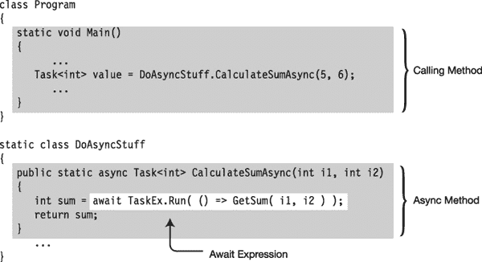
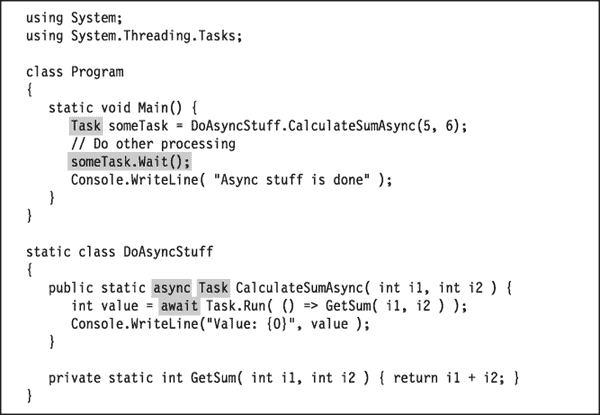
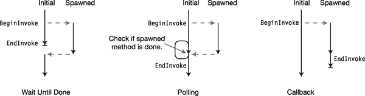

# 二十、异步编程简介

### 什么是异步？

当您启动一个程序时，系统会在内存中创建一个新的*进程*。进程是组成运行程序的一组资源。这些包括虚拟地址空间、文件句柄和程序运行所需的许多其他东西。

在进程内部，系统创建一个内核对象，称为*线程*，它代表实际执行的程序。(*线程*是“执行线程”的简称)一旦建立了进程，系统就开始在方法`Main`中的第一条语句处执行线程。

关于线程，需要了解的一些重要事项如下:

> *   By default, a process contains only one thread, which runs from the beginning of the program to the end.
> *   One thread can spawn other threads, so that at any time, a process may have multiple threads in different states and execute different parts of the program.
> *   If there are multiple threads in a process, they all share the resources of the process. The unit that the system schedules to execute on the processor is a thread, not a process.

到目前为止，本书中展示的所有示例程序都只使用了一个线程，并且从程序中的第一条语句到最后一条语句顺序执行。然而，在许多情况下，这种简单的模型会产生不可接受的行为，无论是在性能还是最终用户体验方面。

例如，一个服务器程序可能不断地启动与其他服务器的连接并向它们请求数据，同时处理来自许多客户端程序的请求。这些通信任务通常需要相当长的时间，程序只是在等待网络或互联网上另一台计算机的响应。这大大降低了性能。与其浪费时间等待回复，不如同时处理其他任务，然后在回复到达时继续处理第一个任务，这样效率会更高。

另一个例子是交互式 GUI 程序。如果用户启动了一个需要很长时间的操作，程序在操作完成之前一直停在屏幕上是不可接受的。用户应该仍然能够在屏幕上移动窗口，甚至可以取消操作。

在这一章中，我们将会看到*异步编程*，这是一种编程类型，在这种编程中，部分程序代码不一定按照编写代码的严格顺序执行。有时这涉及到在另一个线程上运行一段代码。然而，在其他时候，不会创建新的线程，而是对代码的执行进行重新排序，以更好地利用单线程的能力。

我们将从 C# 5.0 中引入的一个新特性开始，它允许您构建异步方法。这就是所谓的`async` / `await`特性。之后，我们将了解属于的几个特性 .NET 框架，但没有内置到 C# 语言中，它允许额外形式的异步。这些主题包括`BackgroundWorker`类和对 .NET 任务并行库。这两个主题都通过创建新线程来实现异步。我们将通过研究产生异步的其他方式来结束这一章。

#### 一个首发的例子

为了说明和比较，我们将从看一个不使用异步的例子开始，然后将它与一个使用异步的类似程序进行比较。

在下面显示的代码示例中，方法`DoRun`是类`MyDownloadString`的一个方法，它执行以下操作:

> *   It creates and starts an object with class `Stopwatch`, which is located in the `System.Diagnostics` namespace. It uses this `Stopwatch` timer to time various tasks in the code.
> *   Then it makes two calls to the method `CountCharacters`, which downloads the content of the website and returns the number of characters contained in the website. The website is specified as the URL string given as the second parameter. Then it makes four calls to the method `CountToALargeNumber`. This method is just a sham, which represents a task that takes a certain amount of time. It just cycles a given number of times.
> *   Finally, it prints out the number of characters of two websites.

`using System;
   using System.Net;
   using System.Diagnostics;

   class MyDownloadString
   {
      Stopwatch sw = new Stopwatch();

      public void DoRun() {
         const int LargeNumber = 6000000;
         sw.Start();

         int t1 = CountCharacters( 1, "http://www.microsoft.com" );
         int t2 = CountCharacters( 2, "http://www.illustratedcsharp.com" );

         CountToALargeNumber( 1, LargeNumber );  CountToALargeNumber( 2, LargeNumber );
         CountToALargeNumber( 3, LargeNumber );  CountToALargeNumber( 4, LargeNumber );

         Console.WriteLine( "Chars in http://www.microsoft.com        : {0}", t1 );
         Console.WriteLine( "Chars in http://www.illustratedcsharp.com: {0}", t2 );
      }

      private int CountCharacters(int id, string uriString ) {
         WebClient wc1 = new WebClient();
         Console.WriteLine( "Starting call {0}    :     {1, 4:N0} ms",
                            id, sw.Elapsed.TotalMilliseconds );
         string result = wc1.DownloadString( new Uri( uriString ) );
         Console.WriteLine( "   Call {0} completed:     {1, 4:N0} ms",
                            id, sw.Elapsed.TotalMilliseconds );
         return result.Length;
      }` `      private void CountToALargeNumber( int id, int value ) {
         for ( long i=0; i < value; i++ )
            ;
         Console.WriteLine( "   End counting {0}  :     {1, 4:N0} ms",
                            id, sw.Elapsed.TotalMilliseconds );
      }
   }

   class Program
   {
      static void Main() {
         MyDownloadString ds = new MyDownloadString();
         ds.DoRun();
      }
   }`

这段代码在一次运行中产生了以下输出。运行时，以毫秒(ms)为单位列出的计时数字会有所不同。

* * *

`Starting call 1    :        1 ms
   Call 1 completed:      178 ms
Starting call 2    :      178 ms
   Call 2 completed:      504 ms
   End counting 1  :      523 ms
   End counting 2  :      542 ms
   End counting 3  :      561 ms
   End counting 4  :      579 ms
Chars in http://www.microsoft.com        : 1020
Chars in http://www.illustratedcsharp.com: 4699`

* * *

图 20-1 总结了输出，显示了各种任务开始和结束的时间线。查看该图，您会注意到调用 1 和 2 占用了方法调用的大部分时间。但是对于每一个调用，所需的绝大部分时间都浪费在了等待网站的响应上。

***图 20-1。**计划中各项任务所需时间的时间表*

如果我们能够启动两个`CountCharacter`调用，而不是等待结果，而是继续执行对`CountToALargeNumber`的四个调用，然后在完成后获取两个`CountCharacter`方法调用的结果，我们就可以显著提高程序的性能。

C# 的新`async` / `await`特性让我们可以做到这一点。为使用该特性而重写的代码如下所示。我将很快介绍这个新特性的细节，但是在这个例子中需要注意的是:

> *   When method `DoRun` calls `CountCharactersAsync`, `CountCharactersAsync` returns almost immediately before it actually downloads characters. It returns a placeholder object of type `Task<int>` to the calling method, indicating the work it plans to do, and will eventually "return" a `int`.
> *   This allows the method `DoRun` to continue without waiting for the actual work to be completed. Its next statement is another call to `CountCharactersAsync`. It does the same thing and returns another `Task<int>` object.
> *   `DoRun` can then continue and make four calls to `CountToALargeNumber`, while two calls to `CountCharactersAsync` continue to finish their work-mainly waiting.
> *   The last two lines of method `DoRun` retrieve the result from `Task` returned by `CountCharactersAsync` call. If a result is not ready, execution will block and wait until it is ready.

`...
   using System.Threading.Tasks;

   class MyDownloadString
   {
      Stopwatch sw = new Stopwatch();

      public void DoRun()  {
         const int LargeNumber = 6000000;
         sw.Start();
           Objects that will hold the results
         <ins>      ↓     </ins>
         Task<int> t1 = CountCharactersAsync( 1, "http://www.microsoft.com" );
         Task<int> t2 = CountCharactersAsync( 2, "http://www.illustratedcsharp.com" );
         CountToALargeNumber( 1, LargeNumber );  CountToALargeNumber( 2, LargeNumber );
         CountToALargeNumber( 3, LargeNumber );  CountToALargeNumber( 4, LargeNumber );
                                                                               Get results.
                                                                              <ins>    ↓    </ins>
         Console.WriteLine( "Chars in http://www.microsoft.com        : {0}", t1.Result );
         Console.WriteLine( "Chars in http://www.illustratedcsharp.com: {0}", t2.Result );
      }
          Contextual       Type that represents work being done,
           keyword       which will eventually return an int
              ↓     <ins>    ↓    </ins>
      private async Task<int> CountCharactersAsync( int id, string site ) {
         WebClient wc = new WebClient();
         Console.WriteLine( "Starting call {0}    :     {1, 4:N0} ms",
                            id, sw.Elapsed.TotalMilliseconds );
                      Contextual keyword
                           ↓
         string result = await wc.DownloadStringTaskAsync( new Uri( site ) );` `         Console.WriteLine( "   Call {0} completed:     {1, 4:N0} ms",
                            id, sw.Elapsed.TotalMilliseconds );
         return result.Length;
      }

      private void CountToALargeNumber( int id, int value )
      {
         for ( long i=0; i < value; i++ ) ;
         Console.WriteLine( "   End counting {0}  :     {1, 4:N0} ms",
                            id, sw.Elapsed.TotalMilliseconds );
      }
   }
   class Program
   {
      static void Main()
      {
         MyDownloadString ds = new MyDownloadString();
         ds.DoRun();
      }
   }`

这段代码在我的机器上运行了一次，产生了以下结果。同样，您的计时结果，以及可能的行顺序，很可能与我的不同。

* * *

`Starting call 1    :       12 ms
Starting call 2    :       60 ms
   End counting 1  :       80 ms
   End counting 2  :       99 ms
   End counting 3  :      118 ms
   Call 1 completed:      124 ms
   End counting 4  :      138 ms
Chars in http://www.microsoft.com        : 1020
   Call 2 completed:      387 ms
Chars in http://www.illustratedcsharp.com: 4699`

* * *

[图 20-2](#fig_20_2) 总结了输出，显示了修改程序的时间线。新版本比以前的版本快 32%。在等待两个`CountCharactersAsync`方法调用中来自 web 站点的响应期间，它通过执行对`CountToALargeNumber`的四个调用来赢得这个时间。所有这些都是在主线程上完成的；我们没有创建任何额外的线程！

***图 20-2。**程序的异步/等待版本的时间线*

### async/await 特性的结构

既然您已经看到了一个异步方法的例子，那么让我们来看看它的定义和细节。

当一个程序进行一个方法调用，并在继续之前等待该方法执行其所有处理时，我们说该方法调用是*同步的*。这是默认形式，也是你在本章之前的所有章节中看到的。

与此相反，*异步*方法在完成所有工作之前返回到调用方法。C# 的`async` / `await`特性允许你创建和使用异步方法。该特征由三部分组成，如图[图 20-3](#fig_20_3) 所示:

> *   *Calling the* method means calling the `async` method, and then moving forward when the `async` method performs its task, whether on the same thread or on different threads.
> *   `async` The method is to set the work to be completed asynchronously, and then return to the calling method in advance.
> *   The `await` expression is used in the `async` method to specify tasks that need to be executed asynchronously. A `async` method can contain any number of `await` expressions, although the compiler will generate a warning message if there is no at least one expression.

我将在接下来的章节中详细介绍这三个组件，从`async`方法的语法和语义开始。

***图 20-3。**异步/等待功能的整体结构*

### 什么是异步方法？

如前一节所述，`async`方法是在完成其所有工作之前返回到调用方法的方法，然后在调用方法继续执行的同时完成其工作。

从语法上来说，`async`方法具有以下特征，如图 20-4 所示。

> *   There is a `async` method modifier in the method header.
> *   It contains one or more `await` expressions. These expressions represent tasks that can be completed asynchronously.
> *   There must be one of the following three return types. In the second and third cases-namely `Task` and `Task<T>`-the returned objects represent a large piece of work to be completed in the future, and both the calling method and the `async` method can continue processing.
>     *   `void`
>     *   `Task`
>     *   `Task<T>`
> *   A `async` method can have any number of parameters of any type. However, none of the parameters can be `out` or `ref` parameters.
> *   Conventionally, the name of the `async` method should end with the suffix `Async`.
> *   In addition to methods, lambda expressions and anonymous methods can also act as `async` objects.

***图 20-4。**异步方法的结构*

[图 20-4](#fig_20_4) 突出显示了一个`async`方法的组成部分，我们现在可以更详细地看一下。第一项是`async`关键字。

> *   The method header of `async` method must have the keyword `async`, and it must be before the return type.
> *   The modifier does nothing except indicate that this method contains one or more `await` expressions. That is, it does not generate any asynchrony itself.
> *   The `async` keyword is a *contextual keyword* , which means that `async` can be used as an identifier in addition to being a method modifier (or lambda or anonymous method modifier).

返回类型必须是以下三种类型之一。注意，其中两个返回类型包含了`Task`类。当提到类时，我将使用大写形式(因为这是类的名称)和语法字样。我将用一般意义上的小写形式来表示一组需要完成的工作。

> *   `Task<T>`: If the calling method wants to receive the value of type `T` returned by the call, the return type of method `async` must be `Task<T>`. Then, the calling method will get the value of type T by reading the `Result` attribute of `Task`, as shown in the following code of the calling method: `   Task<int> value   = DoStuff.CalculateSumAsync( 5, 6 );
>           ...
>        Console.WriteLine( "Value: {0}", value.Result );`
> *   `Task`: If the calling method does not need the return value from `async` method, but needs to be able to check the state of `async` method, then `async` method can return an object of type `Task`. In this case, if there are any `return` statements in the `async` method, they will definitely not return anything. The following code example comes from a calling method: `   Task someTask = DoStuff.CalculateSumAsync(5, 6);
>           ...
>        someTask.Wait();`
> *   `void`: If the calling method just wants the `async` method to be executed, but it doesn't need any further interaction with it (this is sometimes called *getting angry and forgetting* ), then the `async` method can have a return type of `void`. In this case, as in the previous case, if there are any `return` statements in the `async` method, they will definitely not return anything.

注意，在上面的图 20-4 中，`async`方法的返回类型是`Task<int>`。然而，当您检查方法的主体时，您不会发现任何返回类型为`Task<int>`的对象的`return`语句。然而，在方法的末尾有一个返回类型为`int`的值的`return`语句。我们可以将这一观察结果归纳为以下几点，稍后我们将对此进行更详细的研究:

> *   Any `async` method with a return type of `Task<T>` must return a value of type `T` or a type that can be implicitly converted to `T`.

[图 20-5](#fig_20_5) 、 [20-6](#fig_20_6) 和 [20-7](#fig_20_7) 显示了三种返回类型的调用方法和`async`方法之间交互所需的架构。

***图 20-5。**使用异步方法返回任务< int >对象*

***图 20-6。**使用返回任务对象的异步方法*

图 20-7 中[的代码使用`Thread.Sleep`方法暂停主线程，这样它就不会在`async`方法完成之前退出。](#fig_20_7)

***图 20-7。**使用一劳永逸的异步方法*

#### 异步方法中的控制流

一个`async`方法的主体结构有三个不同的区域，如图[图 20-8](#fig_20_8) 所示。我将在下一节详细介绍`await`表达式，但是在这一节中，您可以大致了解它的位置和作用。这三个区域如下:

> *   *Before the first expression* `await` : This includes all codes from the beginning of the method to the first expression `await`. This area should only contain a small amount of code that does not require much processing.
> *   *`await` *Expression* : This expression represents the task to be executed asynchronously.*
> **   *Continuation* : This is the remaining code in the method, which follows the expression `await`. This is packaged with its execution environment, which includes information about which thread it is on, variable values in the current scope, and other information needed to resume execution after the `await` expression is completed.*

*

***图 20-8。**异步方法的代码区域*

[图 20-9](#fig_20_9) 总结了通过`async`方法的控制流程。它从第一个`await`表达式之前的代码开始，正常(同步)执行，直到遇到第一个`await`。这个区域实际上在第一个`await`表达式结束，这里`await`的任务还没有完成(这应该是绝大部分时间)。如果`await`的任务已经完成，该方法继续同步执行。如果遇到另一个`await`，则重复该过程。

当到达`await`表达式时，`async`方法将控制权返回给调用方法。如果该方法的返回类型是类型`Task`或`Task<T>`，则该方法创建一个`Task`对象，该对象表示要异步完成的任务和延续，并将该`Task`返回给调用方法。

现在有两个控制流:一个在`async`方法中，一个在调用方法中。`async`方法中的代码执行以下操作:

> *   Execute the realizable task of its `await` expression asynchronously.
> *   When the `await` expression is completed, the continuation is executed. Continuation itself may have other `await` expressions, which are handled in the same way. That is, the `await` expression is executed asynchronously, and then its continuation is executed.
> *   When the continuation meets the end of the `return` statement or method, the following will happen:
> *   If the return type of the method is `void`, the control flow exits.
> *   If the return type of the method is `Task`, continuation sets the status attribute on `Task` and exits. If the return type is a `Task<T>`, continuation additionally sets the `Result` property of the `Task` object.

同时，调用方法中的代码继续它的进程，从`async`方法接收回`Task`对象。当它需要实际的结果值时，它引用`Task`对象的`Result`属性。如果到那时，`async`方法已经设置了该属性，调用方法将检索该值并继续。否则，它会暂停并等待设置属性后再继续。

***图 20-9。**通过异步方法的控制流*

人们有时会困惑的一件事是当遇到`async`方法中的第一个`await`时返回的对象的类型。返回的类型是在`async`方法的头中作为返回类型列出的类型；与`await`表达式返回值的类型无关。

例如，在下面的代码中，`await`表达式返回一个`string`。但是在方法的执行过程中，当到达那个`await`表达式时，`async`方法返回给调用方法一个`Task<int>`的对象，因为那是方法的返回类型。

`   private async Task<int> CountCharactersAsync( string site )
   {
      WebClient wc = new WebClient();

      string result = await wc.DownloadStringTaskAsync( new Uri( site ) );

      return result.Length;
   }`

另一个潜在的令人困惑的事情是，当`async`方法作为方法中的`return`语句的结果“返回”时，或者到达方法的结尾时，它实际上并没有将*返回给*任何东西——它只是退出。

#### 恭候表情

`await`表达式指定了一个异步完成的任务。`await`表达式的语法如下所示，它由`await`关键字和一个被称为*任务*的可获利对象组成。该任务可能是也可能不是类型为`Task`的对象。默认情况下，该任务在当前线程上异步运行。

`   await *task*`

一个可更新的对象是一个*可更新类型*的实例。一个可应用的类型有一个名为`GetAwaiter`的方法，该方法不带参数，返回一个名为*应用*的类型的对象，该对象有以下成员:

> *   `bool IsCompleted { get; }`
> *   `void OnCompleted(Action);`

它还具有以下特性之一:

> *   `void GetResult();`
> *   `*T* GetResult();` (where *`T`* is any type)

然而，在现实中，你很少需要建立自己的一个。相反，你应该使用`Task`类，它是一个 awaitable，并且可能是大多数程序员在 awaitables 方面所需要的。

和。在. NET 4.5 中，微软在整个 BCL 中发布了大量新的和修改过的异步方法，这些方法返回类型为`Task<T>`的对象。您可以将这些插入到您的`await`表达式中，它们将在您当前的线程上异步工作。

在我们之前的许多例子中，我们一直在使用`WebClient.DownloadStringTaskAsync`方法。这是这些异步方法之一。以下代码是其用法的一个示例:

`   Uri site      = new Uri("http://www.illustratedcsharp.com" );
   WebClient wc  = new WebClient();
   string result = await <ins>wc.DownloadStringTaskAsync( site )</ins>;
                                        ↑
                                Returns a Task<string>`

尽管现在有许多返回类型为`Task<T>`的对象的 BCL 方法，但您很可能有自己的方法，希望用作`await`表达式的任务。最简单的方法是使用`Task.Run`方法从您的方法中创建一个`Task`。关于`Task.Run`方法的一个非常重要的事实是*它在不同的线程*上运行你的方法。

下面是`Task.Run`方法的一个签名，它将一个`Func<TReturn>`委托作为参数。你会记得在[第 19 章](19.html)中，`Func<TReturn>`是一个预定义的委托，它不接受任何参数并返回一个类型为`TReturn`的值:

`   Task Run( Func<TReturn> func )`

因此，要将您的方法传递给`Task.Run`方法，您需要从中创建一个委托。下面的代码展示了实现这一点的三种方法。在代码中，方法`Get10`具有与`Func<int>`委托兼容的形式，因为它不接受参数并返回一个`int`。

> *   First, in the first two lines of method `DoWorkAsync`, a `Func<int>` delegate named `ten` is created by using `Get10`. Then use the delegate in the `Task.Run` method of the next line.
> *   In the second example, a `Func<int>` delegate is created in the parameter list of the `Task.Run` method.
> *   The last example does not use the `Get10` method at all. It uses the `return` statement containing the `Get10` method body, and uses it as the body of lambda expression compatible with `Func<int>` delegate. Lambda expression is implicitly converted to delegate.

`   class MyClass
   {
      public int Get10()                             // Func<int> compatible
      {
         return 10;
      }

      public async Task DoWorkAsync()
      {
         Func<int> ten = new Func<int>(Get10);
         int a = await Task.Run(ten);

         int b = await Task.Run(new Func<int>(Get10));

         int c = await Task.Run(() => { return 10; });

         Console.WriteLine("{0}  {1}  {2}", a, b, c);
      }

   class Program
   {
      static void Main()
      {
         Task t = (new MyClass()).DoWorkAsync();
         t.Wait();
      }
   }`

这段代码产生以下输出:

* * *

`10  10  10`

* * *

在上面的示例代码中，我们使用了将`Func<TResult>`作为参数的`Task.Run`的签名。该方法共有八个重载，如[表 20-1](#tab_20_1) 所示。[表 20-2](#tab_20_2) 显示了可以使用的四种代表类型的签名。

下面的代码展示了四个`await`语句，它们使用`Task.Run`方法运行具有四种不同委托类型的方法:

`   static class MyClass
   {
      public static async Task DoWorkAsync()
      {                                  Action
                       <ins>                    ↓                 </ins>
         await Task.Run(() => Console.WriteLine(5.ToString()));
                                          TResult Func()
                                          <ins>    ↓    </ins>
         Console.WriteLine((await Task.Run(() => 6)).ToString());
                                              Task Func()
                        <ins>                         ↓                            </ins>
         await Task.Run(() => Task.Run(() => Console.WriteLine(7.ToString())));
                                        Task<TResult> Func()
                                    <ins>           ↓           </ins>
         int value = await Task.Run(() => Task.Run(() => 8));
         Console.WriteLine(value.ToString());
      }
   }

   class Program
   {
      static void Main()
      {
         Task t = MyClass.DoWorkAsync();
         t.Wait();
         Console.WriteLine("Press Enter key to exit");
         Console.Read();
      }
   }`

该代码产生以下输出:

* * *

`5
6
7
8`

* * *

在任何可以使用其他表达式的地方都可以使用`await`表达式(只要它在`async`方法内部)。在上面的代码中，四个`await`表达式用在了三个不同的位置。

> *   The first and third examples use the expression `await` as a statement.
> *   In the second example, `await` expression is used as the parameter of `WriteLine` method call.
> *   The fourth example uses the expression `await` as the right side of the assignment statement.

然而，假设您有一个与四种委托形式都不匹配的方法。例如，假设您有一个名为`GetSum`的方法，它将两个`int`值作为输入，并返回这两个值的和。这与四个可接受委托中的任何一个都不兼容。为了解决这个问题，您可以以可接受的`Func`委托的形式创建一个 lambda 函数，它唯一的动作就是运行`GetSum`方法，如下面的代码行所示:

`   int value = await Task.Run(() => GetSum(5, 6));`

lambda 函数`() => GetSum(5, 6)`满足`Func<TResult>`委托，因为它是一个不带参数但返回单个值的方法。以下代码显示了一个完整的示例:

`static class MyClass
{
   private static int GetSum(int i1, int i2)
   {
      return i1 + i2;
   }

   public static async Task DoWorkAsync()
   {                                   TResult Func()
                                  <ins>         ↓        </ins>
      int value = await Task.Run( () => GetSum(5, 6) );
      Console.WriteLine(value.ToString());
   }
}

class Program
{
   static void Main()
   {
      Task t = MyClass.DoWorkAsync();
      t.Wait();
      Console.WriteLine("Press Enter key to exit");
      Console.Read();
   }
}`

该代码产生以下输出:

* * *

`11
Press Enter key to exit`

* * *

#### 取消异步操作

一些 .NET 异步方法允许您请求它们中止执行。您也可以将这个特性构建到您自己的`async`方法中。在`System.Threading.Tasks`名称空间中有两个类是为此目的而设计的:`CancellationToken`和`CancellationTokenSource`。

> *   `CancellationToken` The object contains information about whether the task should be cancelled.
> *   There is a task of `CancellationToken` object that needs to check it regularly to see the status of the token. If the `IsCancellationRequested` property of the `CancellationToken` object is set to `true`, the task should stop operation and return.
> *   A `CancellationToken` is irreversible and can only be used once. That is, once its `IsCancellationRequested` attribute is set to `true`, it cannot be changed.
> *   A `CancellationTokenSource` object creates a `CancellationToken` object, which can then be assigned to different tasks. Any object holding `CancellationTokenSource` can call its `Cancel` method, which sets the `IsCancellationRequested` attribute of `CancellationToken` to `true`.

下面的代码展示了如何使用`CancellationTokenSource`和`CancellationToken`类来实现取消。请注意，该流程是*合作的*。也就是说，你在`CancellationTokenSource`上调用`Cancel`本身并不会取消操作。相反，它将`CancellationToken`的`IsCancellationRequested`属性的状态设置为`true`。由包含`CancellationToken`的代码来检查它，看它是否应该停止执行并返回。

下面的代码显示了取消类的用法。编写的代码没有取消`async`方法，但是在方法`Main`中间包含了两个调用取消操作的注释行。

`class Program
   {
      static void Main()
      {
         CancellationTokenSource cts   = new CancellationTokenSource();
         CancellationToken       token = cts.Token;

         MyClass mc  = new MyClass();
         Task t      = mc.RunAsync( token );

         //Thread.Sleep( 3000 );   // Wait 3 seconds.
         //cts.Cancel();           //cancel the operation.

         t.Wait();
         Console.WriteLine( "Was Cancelled: {0}", token.IsCancellationRequested );
      }
   }` `   class MyClass
   {
      public async Task RunAsync( CancellationToken ct )
      {
         if ( ct.IsCancellationRequested )
            return;
         await Task.Run( () => CycleMethod( ct ), ct );
      }

      void CycleMethod( CancellationToken ct )
      {
         Console.WriteLine( "Starting CycleMethod" );
         const int max = 5;
         for ( int i=0; i < max; i++ )
         {
            if ( ct.IsCancellationRequested )     // Monitor the CancellationToken.
               return;
            Thread.Sleep( 1000 );
            Console.WriteLine( "   {0} of {1} iterations completed", i+1, max );
         }
      }
   }`

保留注释行的第一次运行不会取消任务，并产生以下输出:

* * *

`Starting CycleMethod
   1 of 5 iterations completed
   2 of 5 iterations completed
   3 of 5 iterations completed
   4 of 5 iterations completed
   5 of 5 iterations completed
Was Cancelled: False`

* * *

如果取消方法`Main`中的`Thread.Sleep`和`Cancel`语句的注释，三秒钟后任务被取消，执行产生以下输出:

* * *

`Starting CycleMethod
   1 of 5 iterations completed
   2 of 5 iterations completed
   3 of 5 iterations completed
Was Cancelled: True`

* * *

#### 异常处理和 await 表达式

您可以在`try`语句中使用`await`表达式，就像您使用任何其他表达式一样，并且`try` … `catch` … `finally`结构如您所料地工作。

下面的代码展示了一个带有抛出异常的任务的`await`表达式的例子。`await`表达式在一个`try`块中，它以正常方式处理异常。

`   class Program
   {
      static void Main(string[] args)
      {
         Task t = BadAsync();
         t.Wait();
         Console.WriteLine("Task Status   :  {0}", t.Status);
         Console.WriteLine("Task IsFaulted:  {0}", t.IsFaulted);
      }

      static async Task BadAsync()
      {
         try
         {
            await Task.Run(() => { throw new Exception(); });
         }
         catch
         {
            Console.WriteLine("Exception in BadAsync");
         }
      }
   }`

该代码产生以下输出:

* * *

`Exception in BadAsync
Task Status   :  RanToCompletion
Task IsFaulted:  False`

* * *

注意在输出中，即使`Task`抛出了一个`Exception`，在`Main`结束时，`Task`的状态是`RanToCompletion`。这可能有点令人惊讶，因为`async`方法抛出了一个异常。不过，这样做的原因是以下两个条件为真:(1)`Task`没有被取消，以及(2)没有*未处理的*异常。类似地，`IsFaulted`属性被设置为`False`，因为没有未处理的异常。

#### 同步等待调用方法中的任务

调用方法可以对各种`async`方法进行任意次数的调用，并从它们那里接收回`Task`对象。然后你的代码可能会继续执行各种任务，但是在继续下一步之前，会等待一个特定的`Task`对象完成。为此，`Task`类提供了实例方法`Wait`，您可以在`Task`对象上调用该方法。

下面的代码显示了它的用法示例。代码中，调用方法`DoRun`调用`async`方法`CountCharactersAsync`，并接收回一个`Task<int>`。然后它调用`Task`实例上的`Wait`方法，等待直到`Task`结束。完成后，它会显示结果消息。

`   static class MyDownloadString
   {
      public static void DoRun()
      {
         Task<int> t = CountCharactersAsync( "http://www.illustratedcsharp.com" );
      Wait until the Task t completes.
           ↓
         t.Wait();
         Console.WriteLine( "The task has finished, returning value {0}.", t.Result );
      }

      private static async Task<int> CountCharactersAsync( string site )
      {
         string result = await new WebClient().DownloadStringTaskAsync( new Uri( site ) );
         return result.Length;
      }
   }

   class Program
   {
      static void Main()
      {
         MyDownloadString.DoRun();
      }
   }`

该代码产生以下输出:

* * *

`The task has finished, returning value 4699.`

* * *

`Wait`方法用于单个`Task`对象。但是你也可以侍候一组`Task`对象。给定一组`Task`，你可以等到所有的都完成，也可以等到其中一个完成。你使用的方法是下面两个`Task`类上的`static`方法:

> *   `WaitAll`
> *   `WaitAny`

这些是不返回值的同步方法。也就是说，在继续之前，它们会停止并等待，直到满足约束条件。

我们先来看一个简单的程序，它有一个名为`DoRun`的方法，这个方法调用了两次`async`方法，返回两个`Task<int>`对象。然后，该方法继续进行，检查并打印出任务是否完成。然后，它转到方法的末尾，在完成之前等待`Console.Read`调用。`Console.Read`方法等待从键盘接收到的字符。

正如所写的，这个程序没有使用等待方法，但是它在`DoRun`的中间包含了一个注释部分，其中包含了等待代码，我们将很快使用它来与这个版本的结果进行比较。

`   class MyDownloadString
   {
      Stopwatch sw = new Stopwatch();

      public void DoRun()
      {
         sw.Start();

         Task<int> t1 = CountCharactersAsync( 1, "http://www.microsoft.com" );
         Task<int> t2 = CountCharactersAsync( 2, "http://www.illustratedcsharp.com" );

         //Task<int>[] tasks = new Task<int>[] { t1, t2 };
         //Task.WaitAll( tasks );
         //Task.WaitAny( tasks );

         Console.WriteLine( "Task 1:  {0}Finished", t1.IsCompleted ? "" : "Not " );
         Console.WriteLine( "Task 2:  {0}Finished", t2.IsCompleted ? "" : "Not " );
         Console.Read();
      }

      private async Task<int> CountCharactersAsync( int id, string site )
      {
         WebClient wc = new WebClient();
         string result = await wc.DownloadStringTaskAsync( new Uri( site ) );
         Console.WriteLine( "   Call {0} completed:     {1, 4:N0} ms",
                                          id, sw.Elapsed.TotalMilliseconds );
         return result.Length;
      }
   }

   class Program
   {
      static void Main()
      {
         MyDownloadString ds = new MyDownloadString();
         ds.DoRun();
      }
   }`

这段代码产生以下输出。请注意，当使用`IsCompleted`方法检查时，两个`Task`都没有完成。

* * *

`Task 1:  Not Finished
Task 2:  Not Finished
   Call 1 completed:      166 ms
   Call 2 completed:      425 ms`

* * *

如果我们在`DoRun`中间取消注释前两行代码，如下面三行代码所示，该方法将创建一个包含这两个任务的数组，并将该数组传递给`WaitAll`方法。然后，代码将停止并等待，直到两个任务都完成后再继续执行。

`   Task<int>[] tasks = new Task<int>[] { t1, t2 };
   Task.WaitAll( tasks );
   //Task.WaitAny( tasks );`

当我们使用这种配置运行代码时，结果如下:

* * *

`   Call 1 completed:      137 ms
   Call 2 completed:      601 ms
Task 1:  Finished
Task 2:  Finished`

* * *

如果我们再次修改该部分，注释掉`WaitAll`方法调用，并取消注释`WaitAny`方法调用，代码如下所示:

`   Task<int>[] tasks = new Task<int>[] { t1, t2 };
   //Task.WaitAll( tasks );
   Task.WaitAny( tasks );`

在这种情况下，`WaitAny`调用暂停，直到至少一个`Task`完成。当我们再次运行代码时，结果如下:

* * *

`   Call 1 completed:      137 ms
Task 1:  Finished
Task 2:  Not Finished
   Call 2 completed:      413 ms`

* * *

对于`WaitAll`和`WaitAny`方法，各有四个重载，允许不同的方式继续执行，而不是完成任务。不同的重载允许你设置一个超时或者使用一个`CancellationToken`来强制进程继续。[表 20-3](#tab_20_3) 显示了这些方法的重载。

#### 异步等待异步方法中的任务

在上一节中，您学习了如何同步等待`Task`完成。然而，有时候，在你的`async`方法中，你会想要等待`Task` s 作为你的`await`表情。这允许您的`async`方法返回到调用方法，但允许`async`方法等待一组任务中的一个或全部任务完成。允许这样做的调用是`Task.WhenAll`和`Task.WhenAny`方法。这些方法被称为*组合子*。

下面的代码展示了一个使用`Task.WhenAll`方法的例子。这个方法异步等待，不需要在主线程上花费时间，直到所有相关的`Task`都完成。注意，`await`表达式的任务是`Task.WhenAll`调用。

`using System;
   using System.Collections.Generic;
   using System.Net;
   using System.Threading.Tasks;

   class MyDownloadString
   {
      public void DoRun()
      {
         Task<int> t = CountCharactersAsync( "http://www.microsoft.com",
                                          "http://www.illustratedcsharp.com");

         Console.WriteLine( "DoRun:  Task {0}Finished", t.IsCompleted ? "" : "Not " );
         Console.WriteLine( "DoRun:  Result = {0}", t.Result );
      }

      private async Task<int> CountCharactersAsync(string site1, string site2 )
      {
         WebClient wc1 = new WebClient();
         WebClient wc2 = new WebClient();
         Task<string> t1 = wc1.DownloadStringTaskAsync( new Uri( site1 ) );
         Task<string> t2 = wc2.DownloadStringTaskAsync( new Uri( site2 ) );

         List<Task<string>> tasks = new List<Task<string>>();
         tasks.Add( t1 );
         tasks.Add( t2 );

         await Task.WhenAll( tasks );

         Console.WriteLine( "     CCA:  T1 {0}Finished", t1.IsCompleted ? "" : "Not " );
         Console.WriteLine( "     CCA:  T2 {0}Finished", t2.IsCompleted ? "" : "Not " );

         return t1.IsCompleted ? t1.Result.Length : t2.Result.Length;
      }
   }` `   class Program
   {
      static void Main()
      {
         MyDownloadString ds = new MyDownloadString();
         ds.DoRun();
      }
   }`

该代码产生以下输出:

* * *

`DoRun:  Task Not Finished
     CCA:  T1 Finished
     CCA:  T2 Finished
DoRun:  Result = 1020`

* * *

`Task.WhenAny`组合器异步等待，直到与之关联的`Task`之一完成。如果您将`await`表达式更改为使用`Task.WhenAny`方法而不是`Task.WhenAll`方法，并重新运行程序，它会产生以下输出:

* * *

`DoRun:  Task Not Finished
     CCA:  T1 Finished
     CCA:  T2 Not Finished
DoRun:  Result = 1020`

* * *

#### 任务。延迟方法

`Task.Delay`方法创建一个`Task`对象，该对象在线程上停止自己的处理，并在经过一段时间后完成。然而，与阻塞线程上的工作的`Thread.Sleep`不同，`Task.Delay`不阻塞线程，所以它可以继续处理其他工作。

下面的代码展示了一个使用`Task.Delay`方法的例子:

`   class Simple
   {
      Stopwatch sw = new Stopwatch();

      public void DoRun()
      {
         Console.WriteLine( "Caller: Before call" );
         ShowDelayAsync();
         Console.WriteLine( "Caller: After call" );
      }

      private async void ShowDelayAsync (  )
      {
         sw.Start();
         Console.WriteLine( "   Before Delay: {0}", sw.ElapsedMilliseconds );
         await Task.Delay( 1000 );
         Console.WriteLine( "   After Delay : {0}", sw.ElapsedMilliseconds );
      }
   }

   class Program
   {
      static void Main()
      {
         Simple ds = new Simple ();
         ds.DoRun();
         Console.Read();
      }
   }`

该代码产生以下输出:

* * *

`Caller: Before call
   Before Delay: 0
Caller: After call
   After Delay : 1007`

* * *

`Delay`方法有四个重载，允许不同的指定时间段的方式，也允许一个`CancellationToken`对象。表 20-4 显示了该方法的四种重载。

### GUI 程序中的异步操作

尽管到目前为止，本章中的所有代码都是针对控制台应用的，但异步方法对 GUI 程序尤其有用。

其原因是 GUI 程序被设计成使得显示中的几乎每个变化，包括服务按钮点击、显示标签和移动窗口本身，都必须在主 GUI 线程上完成。这在 Windows 程序中实现的方式是通过使用消息，这些消息被放入由*消息泵*管理的*消息队列*。

消息泵从队列中取出一条消息，并调用该消息的处理程序代码。当处理程序代码完成时，消息泵获取下一条消息并重复这个循环。

由于这种架构，处理程序代码必须简短，这样才不会阻碍进程和其他 GUI 操作的处理。如果特定消息的处理程序代码花费了很长时间，消息队列中就会出现消息积压，程序就会变得没有响应，因为在长时间运行的处理程序完成之前，这些消息都不能被处理。

[图 20-10](#fig_20_10) 显示了 WPF 程序窗口的两个版本。该窗口由一个状态标签及其下方的一个按钮组成。程序员的意图是程序用户单击按钮，按钮的处理程序代码将执行以下操作:

> *   Disable the button, so that the user can no longer click when the handler is working.
> *   Change the message to "Doing something" so that users can know that the program is working.
> *   Let the program sleep for 4 seconds-simulate some work.
> *   Change the message back to the original message and re-enable the button.

图右边的截屏显示了程序员所期望的按钮被按下后 4 秒钟的窗口。然而，事实证明，结果并非如此。当程序员点击按钮时，似乎什么都没有发生，当他在点击按钮几秒钟后试图在屏幕上移动窗口时，窗口被冻结在屏幕上，不会移动——直到 4 秒钟结束后，窗口突然倾斜到新的位置。

***图 20-10。**一个简单的 WPF 程序，有一个按钮和一个状态字符串*

 **注** WPF 是微软对 Windows Forms GUI 编程框架的替代。关于 WPF 编程的更多信息，请参见我的书*插图 WPF*(2009 年出版)。

要在 Visual Studio 2012 中重新创建名为 MessagePump 的 WPF 程序，请执行以下操作:

> 1.  Select the file  New  project menu item to open the new project window.
> 2.  In the left pane of the window, open the installed template section, if it is not already open.
> 3.  Under the C# category, click the Windows entry. This will populate the center pane with the installed Windows program template. Click on the WPF application.
> 4.  , and then enter **`MessagePump`** in the [name] text box at the bottom of the window. Below it, select a location, and then click the OK button.
> 5.  Modify the XAML tag in the file `MainWindow.xaml` to be the same as the tag below. This will create a window with status labels and buttons. `   <Window x:Class="MessagePump.MainWindow"
>                
>                xmlns:x="http://schemas.microsoft.com/winfx/2006/xaml"
>                Title="Pump" Height="120" Width="200  ">
>            <StackPanel>
>                <Label Name="lblStatus" Margin="10,5,10,0" >Not Doing Anything</Label>
>                <Button Name="btnDoStuff" Content="Do Stuff" HorizontalAlignment="Left"
>                        Margin="10,5" Padding="5,2" Click="btnDoStuff_Click"/>
>            </StackPanel>
>        </Window>`
> 6.  Modify the code-behind file `MainWindow.xaml.cs` to match the following C# code. `   using System.Threading;
>        using System.Threading.Tasks;
>        using System.Windows;
>        namespace MessagePump
>        {
>           public partial class MainWindow : Window
>           {
>              public MainWindow()
>              {
>                 InitializeComponent();
>              }
>              private void btnDoStuff_Click( object sender, RoutedEventArgs e )
>              {
>                 btnDoStuff.IsEnabled = false;
>                 lblStatus.Content    = "Doing Stuff";
>                 Thread.Sleep( 4000 );
>                 lblStatus.Content    = "Not Doing Anything";
>                 btnDoStuff.IsEnabled = true;
>              }
>           }
>        }`

当你运行这个程序时，你会发现它的行为符合前面的描述，即按钮没有被禁用，状态标签没有改变，如果你试图移动窗口，它不会移动，直到 4 秒钟过去。

这种可能令人惊讶的行为的原因非常简单。[图 20-11](#fig_20_11) 说明了这种情况。当点击按钮时，按钮`Click`消息被放置在消息队列中。消息泵将消息从队列中移除，并启动按钮 click 的处理程序代码——这是方法`btnDoStuff_Click`。`btnDoStuff_Click`处理程序将触发我们想要的行为的消息放到队列中，如图右侧所示。但是在处理程序本身退出之前，这些消息都不能被执行，直到它休眠 4 秒钟并退出。然后所有这些事情都发生了，但它们来得太快了。

***图 20-11。**消息泵从消息队列的前端发送消息。当按钮消息处理程序执行时，其他动作的消息在队列中累积，直到它完成后才能执行。*

但是，如果我们可以让处理程序将前两条消息放入队列，然后将自己从处理器中取出，只在 4 秒钟结束时将自己放回队列中，那么这些消息和任何其他消息都可以在等待期间得到处理，流程将按照我们希望的那样执行并保持响应。

我们可以使用`async` / `await`特性轻松实现这一点，如下面修改后的处理程序代码所示。当到达`await`语句时，处理程序返回到调用方法并离开处理器，允许处理其他消息——包括它刚刚放入的两条消息。在一个可实现的任务完成之后(在本例中是`Task.Delay`，继续(方法的剩余部分)被调度回线程上。

`   private async void btnDoStuff_Click( object sender, RoutedEventArgs e )
   {
      btnDoStuff.IsEnabled = false;
      lblStatus.Content    = "Doing Stuff";

      await Task.Delay( 4000 );

      lblStatus.Content    = "Not Doing Anything";
      btnDoStuff.IsEnabled = true;
   }`

#### 任务。产量

`Task.Yield`方法创建一个可立即返回的变量。等待一个`Yield`允许`async`方法返回到调用方法，同时继续执行`async`方法的代码。您可以认为这是离开消息队列的前面，到队列的后面，以便让其他任务获得处理器上的时间。

下面的示例代码展示了一个`async`方法，它通过执行一个循环每 1000 次产生一次控制权。每次执行`Yield`方法时，它都允许线程中的其他任务执行。

`   static class DoStuff
   {
      public static async Task<int> FindSeriesSum( int i1 )
      {
         int sum = 0;
         for ( int i=0; i < i1; i++ )
         {
            sum += i;
            if ( i % 1000 == 0 )
               await Task.Yield();
         }

         return sum;
      }
   }

   class Program
   {
      static void Main()
      {
         Task<int> value = DoStuff.FindSeriesSum( 1000000 );
         CountBig( 100000 );  CountBig( 100000 );
         CountBig( 100000 );  CountBig( 100000 );
         Console.WriteLine( "Sum: {0}", value.Result );
      }

      private static void CountBig( int p )
      {
         for ( int i=0; i < p; i++ )
            ;
      }
   }`

该代码产生以下输出:

* * *

`Sum: 1783293664`

* * *

在 GUI 程序中，`Yield`方法非常有用，可以分解大量工作，让其他任务使用处理器。

### 使用异步 Lambda 表达式

到目前为止，本章中你只看到了`async` *方法*。但是如果你还记得，我说过你也可以使用匿名方法和 T2 表达式。这些构造对于工作量很少的事件处理程序特别有用。下面的代码片段显示了一个 lambda 表达式，它被注册为按钮单击事件的事件处理程序。

`   startWorkButton.Click += async ( sender, e ) =>
      {
         // Do the Click handler work.
      };`

下面是一个简短的 WPF 程序，展示了它的使用。以下是代码隐藏:

`   using System.Threading.Tasks;
   using System.Windows;

   namespace AsyncLambda
   {
      public partial class MainWindow : Window
      {
         public MainWindow()
         {
            InitializeComponent();

                                       Async lambda expression
                                   <ins>            ↓           </ins>
            startWorkButton.Click += async ( sender, e ) =>
               {
                  SetGuiValues( false, "Work Started" );
                  await DoSomeWork();
                  SetGuiValues( true, "Work Finished" );
               };
         }

         private void SetGuiValues(bool buttonEnabled, string status)
         {
            startWorkButton.IsEnabled = buttonEnabled;
            workStartedTextBlock.Text = status;
         }

         private Task DoSomeWork()
         {
            return Task.Delay( 2500 );
         }
      }
   }`

以下标记是程序的 XAML 文件:

`   <Window x:Class="AsyncLambda.MainWindow"

           xmlns:x="http://schemas.microsoft.com/winfx/2006/xaml"
           Title="Async Lambda" Height="115" Width="150">
       <StackPanel>
           <TextBlock Name="workStartedTextBlock" Margin="10,10"/>
           <Button Name="startWorkButton" Width="100" Margin="4" Content="Start Work" />
       </StackPanel>
   </Window>`

该程序产生一个具有三种状态的窗口，如图 20-12 所示。

***图 20-12。**示例程序 AsyncLambda 的输出*

### 一个完整的 GUI 例子

我已经一次一部分地介绍了`async` / `await`组件。在这一部分，我想让你看到一个完整的 WPF 图形用户界面程序，包括一个状态栏和取消。

示例程序显示了图 20-13 中左图所示的屏幕截图。单击该按钮时，程序开始处理并更新进度条。如果您让处理进行到完成，它会在图的右侧顶部显示消息框。如果在处理完成前单击取消按钮，程序会在图的右侧底部显示消息框。

***图 20-13。**一个简单的 WPF 程序的截图，它实现了一个状态栏和取消功能*

要重新创建程序，创建一个名为`WpfAwait`的新 WPF 应用。修改文件`MainWindow.xaml`中的 XAML 标记，使其与以下内容匹配:

`   <Window x:Class="WpfAwait.MainWindow"

           xmlns:x="http://schemas.microsoft.com/winfx/2006/xaml"
           Title="Process and Cancel" Height="150  " Width="250">
       <StackPanel>
           <Button Name="btnProcess" Width="100" Click="btnProcess_Click"
                   HorizontalAlignment="Right" Margin="10,15,10,10">Process</Button>
           <Button Name="btnCancel" Width="100" Click="btnCancel_Click"
                   HorizontalAlignment="Right" Margin="10,0">Cancel</Button>
           <ProgressBar Name="progressBar" Height="20" Width="200" Margin="10"  
                        HorizontalAlignment="Right"/>
       </StackPanel>
   </Window>`

修改代码隐藏文件`MainWindow.xaml.cs`，使其与以下内容匹配:

`using System.Threading;
   using System.Threading.Tasks;
   using System.Windows;
   namespace WpfAwait
   {` `      public partial class MainWindow : Window
      {
         CancellationTokenSource _cancellationTokenSource;
         CancellationToken       _cancellationToken;

         public MainWindow()
         {
            InitializeComponent();
         }

         private async void btnProcess_Click( object sender, RoutedEventArgs e )
         {
            btnProcess.IsEnabled = false;

            _cancellationTokenSource = new CancellationTokenSource();
            _cancellationToken       = _cancellationTokenSource.Token;

            int completedPercent = 0;
            for ( int i = 0; i < 10; i++ )
            {
               if ( _cancellationToken.IsCancellationRequested )
                  break;
               try {
                  await Task.Delay( 500, _cancellationToken );
                  completedPercent = ( i + 1 ) * 10;
               }
               catch ( TaskCanceledException ex ) {
                  completedPercent = i * 10;
               }
               progressBar.Value = completedPercent;
            }

            string message = _cancellationToken.IsCancellationRequested
                     ? string.Format("Process was cancelled at {0}%.", completedPercent)
                     : "Process completed normally.";
            MessageBox.Show( message, "Completion Status" );

            progressBar.Value = 0;
            btnProcess.IsEnabled = true;
            btnCancel.IsEnabled  = true;
         }

         private void btnCancel_Click( object sender, RoutedEventArgs e ) {
            if ( !btnProcess.IsEnabled )
            {
               btnCancel.IsEnabled = false;
               _cancellationTokenSource.Cancel();
            }
         }
      }
   }`

### 背景工人类

在前面的小节中，您学习了如何使用`async` / `await`特性来异步处理任务。在本节中，您将学习另一种进行异步工作的方法——在本例中，在后台线程上。`async` / `await`功能最适合需要在后台完成的小型离散任务。

但是，有时您可能希望设置另一个线程，该线程在后台持续运行，执行工作，偶尔与主线程通信。这个`BackgroundWorker`类非常适合这个。[图 20-14](#fig_20_14) 显示了该类的主要成员。

> *   The first two properties in the figure are used to set whether the background task can report the progress to the main thread and whether it supports cancellation from the main thread. You use the third attribute to determine whether the background task is running.
> *   This class has three events to represent different program events and states. You need to write event handlers for these events, so that you can take whatever action suits your program.
>     *   The `DoWork` event is raised when the background thread starts.
>     *   `ProgressChanged` event is raised when the background task reports the progress. The `RunWorkerCompleted` event is triggered when the background worker exits.
> *   All three methods are used to initiate actions or change states. Call the `RunWorkerAsync` method to retrieve the background thread that executes the `DoWork` event handler.
> *   Call the `CancelAsync` method to set the `CancellationPending` attribute to `true`. `DoWork` The responsibility of the event handler is to check this attribute to determine whether it should stop processing.
> *   `ReportProgress` method can be called by `DoWork` event handler (from *background thread* ) when it wants to report its progress to the main thread.

***图 20-14。**background worker 类的主要成员*

要使用一个`BackgroundWorker`类对象，你需要编写下面的事件处理程序。第一个是必需的，因为它包含了您希望在后台线程中执行的代码。另外两个是可选的，您可以包含或不包含它们，这取决于您的程序需要什么。

> *   The handler attached to the `DoWork` event contains the code that you want to execute on a separate thread in the background.
>     *   In [Figure 20-15](#fig_20_15) , the handler is named `DoTheWork`, and it is located in a gradient shadow box to show that it is executed in the background thread.
>     *   When the main thread calls the `RunWorkerAsync` method of the `BackgroundWorker` object, the `DoWork` event is raised.
> *   The background thread communicates with the main thread by calling `ReportProgress` method. When this happens, the `ProgressChanged` event will be raised, and the main thread can use the handler attached to the `ProgressChanged` event to handle the event.
> *   The handler attached to the `RunWorkerCompleted` event contains the code to be executed on the main thread after the background thread completes the execution of the `DoWork` event handler.

[图 20-15](#fig_20_15) 显示了一个程序的结构，事件处理程序附加在`BackgroundWorker`对象的事件上。

***图 20-15。**您的代码必须为控制任务执行流程的事件提供事件处理程序。*

这些事件处理程序的代表如下。每个都将一个`object`引用作为第一个参数，将一个`EventArgs`类的专门化子类作为第二个参数。

`   void DoWorkEventHandler             ( object sender, DoWorkEventArgs e )

   void ProgressChangedEventHandler    ( object sender, ProgressChangedEventArgs e )

   void RunWorkerCompletedEventHandler ( object sender, RunWorkerCompletedEventArgs e)`

[图 20-16](#fig_20_16) 展示了这些事件处理程序使用的`EventArg`类的结构。

***图 20-16。**background worker 事件处理程序使用的 EventArg 类*

当您编写了事件处理程序并将其附加到事件时，可以通过执行下列操作来使用类:

> *   First, create an object of class `BackgroundWorker` and configure it.
>     *   If you want the worker thread to communicate the progress with the main thread, set the `WorkerReportsProgress` property to `true`.
>     *   If you want to be able to cancel the worker thread from the main thread, set the `WorkerSupportsCancellation` attribute to `true`.
> *   Now that the object is configured, it can be started by calling the `RunWorkerAsync` method of the object. This will retrieve a background thread that caused the `DoWork` event and execute the handler for the event in the background.

现在主线程和后台线程都在运行。当后台线程运行时，您可以在主线程上继续处理。

在主线程中，如果您已经启用了`WorkerSupportsCancellation`属性，那么您可以调用对象的`CancelAsync`方法。正如你在本章开始看到的`CancellationToken`，这并没有取消背景线索。相反，它将对象的`CancellationPending`属性设置为`true`。运行在后台线程上的`DoWork`事件处理程序代码需要定期检查`CancellationPending`属性，看它是否应该退出。

同时，后台线程继续执行其计算任务，并执行以下操作:

> *   If the `WorkerReportsProgress` attribute is `true`, and the background thread has progress to report to the main thread, it must call the `ReportProgress` method of the `BackgroundWorker` object. This raises the `ProgressChanged` event in the main thread, which runs the corresponding event handler.
> *   If the `WorkerSupportsCancellation` attribute is enabled, then the `DoWork` event handler code should check the `CancellationPending` attribute periodically to determine whether it is canceled. If so, it should quit.
> *   If the background thread completes its processing without being canceled, it can return a result to the main thread by setting the `Result` field in the `DoWorkEventArgs` parameter shown in [Figure 20-16](#fig_20_16) earlier.

当后台线程退出时，会引发`RunWorkerCompleted`事件，并在主线程上执行其处理程序。`RunWorkerCompletedEventArgs`参数可以包含来自现在已完成的后台线程的信息，比如返回值和线程是否被取消。

#### WPF 程序中 BackgroundWorker 类的例子

由于`BackgroundWorker`类主要用于 GUI 编程，下面的程序展示了它在一个简单的 WPF 程序中的用法。

该程序产生图 20-17 中左侧[所示的窗口。当您单击 Process 按钮时，它会启动后台线程，该线程每半秒钟向主线程报告一次，并以 10%的增量递增顶部的进度条。完成后，它会在图的右侧显示对话框。](#fig_20_17)

***图 20-17。**使用 BackgroundWorker 类的示例 WPF 程序*

要重新创建这个 WPF 程序，使用 Visual Studio 创建一个名为`SimpleWorker`的新 WPF 应用。修改您的`MainWindow.xaml`文件以匹配下面的列表:

`   <Window x:Class="SimpleWorker.MainWindow"

           xmlns:x="http://schemas.microsoft.com/winfx/2006/xaml"
           Title="MainWindow" Height="150  " Width="250">
      <StackPanel>
         <ProgressBar Name="progressBar" Height="20" Width="200" Margin="10"/>
         <Button Name="btnProcess" Width="100" Click="btnProcess_Click"   
                 Margin="5">Process</Button>
         <Button Name="btnCancel" Width="100" Click="btnCancel_Click"
                 Margin="5">Cancel</Button>
      </StackPanel>
   </Window>`

修改`MainWindow.xaml.cs`文件以匹配以下列表:

`using System.Windows;
   using System.ComponentModel;
   using System.Threading;

   namespace SimpleWorker
   {
      public partial class MainWindow : Window
      {
         BackgroundWorker bgWorker = new BackgroundWorker();

         public MainWindow()
         {
            InitializeComponent();

            // Set BackgroundWorker properties
            bgWorker.WorkerReportsProgress      = true;
            bgWorker.WorkerSupportsCancellation = true;

            // Connect handlers to BackgroundWorker object.
            bgWorker.DoWork             += DoWork_Handler;
            bgWorker.ProgressChanged    += ProgressChanged_Handler;
            bgWorker.RunWorkerCompleted += RunWorkerCompleted_Handler;
         }

         private void btnProcess_Click( object sender, RoutedEventArgs e )
         {
            if ( !bgWorker.IsBusy )
               bgWorker.RunWorkerAsync();
         }

         private void ProgressChanged_Handler( object sender,
                                               ProgressChangedEventArgs args )
         {
            progressBar.Value = args.ProgressPercentage;
         }` `         private void DoWork_Handler( object sender, DoWorkEventArgs args )
         {
            BackgroundWorker worker = sender as BackgroundWorker;

            for ( int i = 1; i <= 10; i++ )
            {
               if ( worker.CancellationPending )
               {
                  args.Cancel = true;
                  break;
               }
               else
               {
                  worker.ReportProgress( i * 10 );
                  Thread.Sleep( 500 );
               }
            }
         }

         private void RunWorkerCompleted_Handler( object sender,
                                                  RunWorkerCompletedEventArgs args )
         {
            progressBar.Value = 0;

            if ( args.Cancelled )
               MessageBox.Show( "Process was cancelled.", "Process Cancelled" );
            else
               MessageBox.Show( "Process completed normally.", "Process Completed" );
         }

         private void btnCancel_Click( object sender, RoutedEventArgs e )
         {
            bgWorker.CancelAsync();
         }
      }
   }`

### 并联回路

在这一节中，我们将简略地看一下任务并行库。任务并行库是 BCL 中的类库，它极大地简化了并行编程。详细介绍这个库远远超出了我在这一章中所能做的。因此，不幸的是，我不得不满足于通过介绍两个非常简单的构造来吊起你的胃口，这样你就可以快速轻松地学习和使用了。这些是`Parallel.For`回路和`Parallel.ForEach`回路。这些构造位于`System.Threading.Tasks`名称空间中。

到目前为止，我相信你已经非常熟悉 C# 的标准`for`和`foreach`循环了。这些都是常见且非常强大的构造。很多时候，当使用这些构造时，每次迭代都依赖于前一次迭代中的计算或操作。但情况并非总是如此。如果迭代是相互独立的，并且您在多处理器机器上运行，如果您可以将不同的迭代放在不同的处理器上并并行处理它们，这可能是一个巨大的优势。这正是`Parallel.For`和`Parallel.ForEach`构造所做的。

这些构造是带有输入参数的方法的形式。`Parallel.For`方法有 12 个重载，但最简单的重载具有如下代码行所示的签名:

`   void Parallel.For( int *fromInclusive*, int *toExclusive*, Action *body*);`

这些参数如下:

> *   `*fromInclusive*` The parameter is the first integer in the iteration sequence.
> *   *`toExclusive`* The parameter is an integer *larger than the last index in the iteration sequence. That is to say, this is the same as using the expression `index <` *`ToExclusive`* for comparison.*
> *   *`body`* is a commission that accepts a single input parameter. *The code of `body`* is executed once every iteration.

下面的代码是一个使用`Parallel.For`构造的例子。它从 0 迭代到 14(记住，作为实际参数列出的 15 比顶部迭代索引多 1)，并打印出迭代索引和索引的平方。这个应用符合每个迭代独立于任何其他迭代的要求。还要注意，您必须使用`System.Threading.Tasks`名称空间。

`   using System;
   using System.Threading.Tasks;         // Must use this namespace

   namespace ExampleParallelFor
   {
      class Program
      {
         static void Main( )
         {
            Parallel.For( 0, 15, i =>         
               Console.WriteLine( "The square of {0} is {1}", i, i * i ));
         }
      }
   }`

在我装有双核处理器的电脑上运行一次这段代码，产生了以下输出。请注意，不保证迭代的任何特定顺序。

* * *

`The square of 0 is 0
The square of 7 is 49
The square of 8 is 64
The square of 9 is 81
The square of 10 is 100
The square of 11 is 121
The square of 12 is 144
The square of 13 is 169
The square of 3 is 9
The square of 4 is 16
The square of 5 is 25
The square of 6 is 36
The square of 14 is 196
The square of 1 is 1
The square of 2 is 4`

* * *

另一个例子是下面的代码。这个程序用迭代索引的平方并行填充一个整数数组。

`   class Program
   {
      static void Main()
      {
         const int maxValues = 50;
         int[] squares = new int[maxValues];

         Parallel.For( 0, maxValues, i => squares[i] = i * i );
      }
   }`

在这个例子中，尽管迭代可能以任何顺序并行执行，但最终结果是一个包含前 50 个方块的数组——按顺序！

另一个并行循环结构是`Parallel.ForEach`方法。这个方法有十多个多载，但最简单的如下:

> `TSource`
> 
> *   *`source`* is a collection of `TSource` objects.
> *   *`body`* is a lambda expression applied to each element in the set.

`   static ParallelLoopResult ForEach<TSource>( IEnumerable<TSource> *source*,
                                               Action<TSource> *body*)`

下面的代码是使用`Parallel.ForEach`方法的一个例子。在这种情况下，`TSource`就是`string`，而 *`source`* 就是一个`string[]`。

`   using System;
   using System.Threading.Tasks;

   namespace ParallelForeach1
   {
      class Program
      {
         static void Main()
         {
            string[] squares = new string[]
                     { "We", "hold", "these", "truths", "to", "be", "self-evident",
                       "that", "all", "men", "are", "created", "equal"};

            Parallel.ForEach( squares,
               i => Console.WriteLine( string.Format("{0} has {1} letters", i, i.Length) ));
         }
      }
   }`

这段代码在我的双核处理器电脑上运行了一次，产生了以下输出，但顺序可能每次都会改变:

* * *

`"We" has 2 letters
"equal" has 5 letters
"truths" has 6 letters
"to" has 2 letters
"be" has 2 letters
"that" has 4 letters
"hold" has 4 letters
"these" has 5 letters
"all" has 3 letters
"men" has 3 letters
"are" has 3 letters
"created" has 7 letters
"self-evident" has 12 letters`

* * *

### 其他异步编程模式

对于您将要生成的大多数异步代码，您可能会使用`async/await`特性、本章第一部分中介绍的`BackgroundWorker`类或者任务并行库。然而，仍然有可能需要使用旧的模式来产生异步代码。为了完整起见，我将涵盖这些模式，从这一节开始到本章的结尾。学习完这些旧模式后，你会更加感激有了`async` / `await`功能，生活变得简单多了。

第 13 章讲述了委托的主题，你看到了当一个委托对象被调用时，它调用包含在其调用列表中的方法。这是同步完成的，就像程序调用了这些方法一样。

如果一个委托对象在其调用列表中只有一个方法(我称之为*引用的方法*)，它可以异步执行该方法。delegate 类有两个方法，叫做`BeginInvoke`和`EndInvoke`，用来做这件事。您可以按以下方式使用这些方法:

> *   When you call the `BeginInvoke` method of the delegate, it starts to execute the method it refers to on a separate thread, and then immediately returns to the initial thread. When the referenced methods are executed in parallel, the initial thread continues to run.
> *   When your program wants to retrieve the result of the completed asynchronous method, it either checks the T2 attribute of T1 returned by T0 or calls the T3 method of the delegate to wait for the delegate to complete.

[图 20-18](#fig_20_18) 显示了使用该过程的三种标准模式。在所有这三种模式中，初始线程启动一个异步方法调用，然后进行一些额外的处理。然而，这些模式的不同之处在于初始线程接收衍生线程已经完成的信息的方式。

> *   In *wait-until-done* mode, after generating asynchronous methods and doing some extra processing, the initial thread pauses and waits for the generated thread to finish before continuing.
> *   In the *polling* mode, the initial thread periodically checks whether the generated thread has completed, and if not, it continues additional processing.
> *   In the *callback* mode, the initial thread continues to execute without waiting or checking whether the derived thread has finished. On the contrary, when the referenced method in the derived thread completes, it calls a callback method, which processes the result of the asynchronous method before calling `EndInvoke`.

***图 20-18。**异步方法调用的标准模式*

### 开始 Invoke 和结束 Invoke

在我们看这些异步编程模式的例子之前，让我们仔细看看`BeginInvoke`和`EndInvoke`方法。关于`BeginInvoke`需要知道的一些重要事情如下:

> *   When `BeginInvoke` is called, the actual parameters in the parameter table consist of the following:
>     *   Referenced method
>     *   The other two parameters are called `callback` parameter and `state` parameter.
> *   `BeginInvoke` Retrieve a thread from the thread pool and start the referenced method running on the new thread.
> *   `BeginInvoke` Returns a reference to the object that implements the `IAsyncResult` interface to the calling thread. This interface reference contains information about the current state of asynchronous methods on thread pool threads. The initial thread then continues to execute.

下面的代码展示了一个调用委托的`BeginInvoke`方法的例子。第一行声明了名为`MyDel`的委托类型。下一行声明了一个名为`Sum`的方法，它匹配委托。

> *   The following line declares a delegate object `del` with the delegate type `MyDel`, and initializes its call list with the `Sum` method.
> *   Finally, the last line of code calls the `BeginInvoke` method of the entrusted object and provides it with two entrusted parameters `3` and `5` and two `BeginInvoke` parameters `callback` and `state`, which are set to `null` in this example. When executed, the `BeginInvoke` method performs two actions:
>     *   It gets a thread from the thread pool, starts the method `Sum` running on the new thread, and provides it with `3` and `5` as its actual parameters.
>     *   It collects the state information of the new thread, makes it available by referencing the interface of type `IAsyncResult`, and then returns it to the calling thread. In this example, the calling thread stores it in a variable named `iar`.

`   delegate long MyDel( int first, int second );          // Delegate declaration
      ...
   static long Sum(int x, int y){ ... }                   // Method matching delegate
      ...
   MyDel del        = new MyDel(Sum);                     // Create delegate object
   <ins>IAsyncResult iar</ins> = <ins>del.BeginInvoke</ins>( <ins>3, 5,</ins> <ins>null, null</ins> );
           ↑                 ↑           ↑        ↑
   Information about       Invoke delegate      Delegate    Extra
     new thread          asynchronously      params    params`

使用`EndInvoke`方法检索异步方法调用返回的值，并释放线程使用的资源。`EndInvoke`具有以下特点:

> *   It takes the reference to `IAsyncResult` returned by `BeginInvoke` method as a parameter and finds the thread it refers to.
> *   If the thread pool thread has exited, `EndInvoke` will perform the following operations:
>     *   It cleans up the unfinished part of the exited thread and releases its resources.
>     *   Find the value returned by the referenced method and return it as the return value.
> *   If the thread pool thread is still running when `EndInvoke` is called, the calling thread will stop and wait for it to finish before clearing the return value. Because `EndInvoke` is cleaned up after the generated thread, you must make sure to call a `EndInvoke` for each `BeginInvoke`.
> *   If an asynchronous method triggers an exception, it will be thrown when `EndInvoke` is called.

下面一行代码展示了一个调用`EndInvoke`从异步方法中检索值的例子。您必须始终包含对`IAsyncResult`对象的引用作为参数。

`             Delegate object
                  ↓
   <ins>long result</ins> = del.EndInvoke( iar );
        ↑                        ↑
    Return value from             IAsyncResult
  asynchronous method             object`

`EndInvoke`提供异步方法调用的所有输出，包括`ref`和`out`参数。如果一个委托被引用的方法有`ref`或`out`参数，它们必须在引用`IAsyncResult`对象之前包含在`EndInvoke`的参数列表中，如下图所示:

`  <ins>long result</ins> = del.EndInvoke(<ins>out someInt</ins>, iar);
       ↑                           ↑        ↑
  Return value from                    Out     IAsyncResult
   asynchronous method                parameter     object`

#### 等待完成的模式

现在您已经理解了`BeginInvoke`和`EndInvoke`委托方法，我们可以看看异步编程模式了。我们要看的第一个是等待完成模式。在这种模式中，初始线程启动一个异步方法调用，进行一些额外的处理，然后停止并等待，直到产生的线程完成。总结如下:

`   IAsyncResult iar = del.BeginInvoke( 3, 5, null, null );
        // Do additional work in the calling thread, while the method
        // is being executed asynchronously in the spawned thread.
        ...
   long result = del.EndInvoke( iar );`

下面的代码展示了这种模式的完整示例。这段代码使用`Thread`类的`Sleep`方法将自己挂起 100 毫秒(1/10 秒)。`Thread`类位于`System.Threading`名称空间中。

`   using System;
   using System.Threading;                         // For Thread.Sleep()

   delegate long MyDel( int first, int second );   // Declare delegate type.

   class Program {
      static long Sum(int x, int y)                // Declare method for async.
      {
         Console.WriteLine("                       Inside Sum");
         Thread.Sleep(100);

         return x + y;
      }
      static void Main( ) {
         MyDel del = new MyDel(Sum);

         Console.WriteLine( "Before BeginInvoke" );
         IAsyncResult iar = del.BeginInvoke(3, 5, null, null); // Start async
         Console.WriteLine( "After  BeginInvoke" );

         Console.WriteLine( "Doing stuff" );

         long result = del.EndInvoke( iar );    // Wait for end and get result
         Console.WriteLine( "After  EndInvoke: {0}", result );
      }
   }`

该代码产生以下输出:

* * *

`Before BeginInvoke
After  BeginInvoke
Doing stuff
                       Inside Sum
After  EndInvoke: 8`

* * *

#### async result 类

既然您已经看到了最简单形式的`BeginInvoke`和`EndInvoke`的运行，现在是时候仔细看看`IAsyncResult`，它是使用这些方法不可或缺的一部分。

`BeginInvoke`返回对`IAsyncResult`接口的引用，该接口位于`AsyncResult`类型的类对象内部。`AsyncResult`类表示异步方法的状态。[图 20-19](#fig_20_19) 展示了这个类的一些重要部分。关于该类，需要了解的重要事项如下:

> *   When you call the `BeginInvoke` method of a delegate object, the system creates an object of class `AsyncResult`. However, it does not return references to class objects. Instead, it returns a reference to the *interface* contained in the object `IAsyncResult`.
> *   The `AsyncResult` object contains an attribute named `AsyncDelegate`, which returns a reference to the delegate called to start the asynchronous method. However, this property is part of the class object, not part of the interface.
> *   The `IsCompleted` property returns a Boolean value indicating whether the asynchronous method has been completed.
> *   The `AsyncState` property returns a reference to the object listed as the `state` parameter in the `BeginInvoke` method call. It returns a reference of type `object`. I will explain this in the callback mode section.

***图 20-19。**一个 AsyncResult 类对象*

#### 轮询模式

在轮询模式中，初始线程发起一个异步方法调用，进行一些额外的处理，然后使用`IAsyncResult`对象的`IsCompleted`方法来定期检查所产生的线程是否已经完成。如果异步方法已经完成，初始线程调用`EndInvoke`并继续。否则，它会做一些额外的处理，并在稍后再次检查。本例中的“处理”只包括从 0 到 10，000，000 的计数。

`   delegate long MyDel(int first, int second);

   class Program
   {
      static long Sum(int x, int y)
      {
         Console.WriteLine("                  Inside Sum");
         Thread.Sleep(100);

         return x + y;
      }

      static void Main()
      {
         MyDel del = new MyDel(Sum); Spawn asynchronous method.
                                           ↓
         IAsyncResult iar = del.BeginInvoke(3, 5, null, null); // Start async.
         Console.WriteLine("After BeginInvoke");
        Check whether the asynchronous method is done.
                 <ins>    ↓          </ins>
        while ( !iar.IsCompleted )
         {
            Console.WriteLine("Not Done");

            // Continue processing, even though in this case it's just busywork.
            for (long i = 0; i < 10000000; i++)
               ;                                       // Empty statement
         }
         Console.WriteLine("Done");
                        Call EndInvoke to get result and clean up.
                        <ins>       ↓         </ins>
         long result = del.EndInvoke(iar);
         Console.WriteLine("Result: {0}", result);
      }
   }`

这段代码产生以下输出:

* * *

`After BeginInvoke
Not Done
                  Inside Sum
Not Done
Not Done
Done
Result: 8`

* * *

#### 回调模式

在前面的两种模式中，等待完成和轮询，初始线程只有在知道派生线程已经完成后才继续它的控制流。然后，它检索结果并继续。

回调模式的不同之处在于，一旦初始线程产生了异步方法，它就继续前进，不再与它同步。当异步方法调用完成时，系统调用用户提供的方法来处理其结果，并调用委托的`EndInvoke`方法。这个用户定义的方法被称为*回调方法*，或者简称为*回调*。

`BeginInvoke`参数列表末尾的两个额外参数与回调方法一起使用，如下所示:

> *   The first of the two parameters `callback` is the name of the callback method.
> *   The second parameter, namely the `state` parameter, can be `null` or a reference to the object to be passed to the callback method. You will be able to access the object by using the `AsyncState` property of the method and the `IAsyncResult` parameter of the method. The type of this parameter is `object`.

##### 回调方法

回调方法的签名和返回类型必须是由`AsyncCallback`委托类型描述的形式。该表单要求该方法接受类型为`IAsyncResult`的单个参数，并具有一个`void`返回类型，如下所示:

`   void AsyncCallback( IAsyncResult iar )`

有几种方法可以将回调方法提供给`BeginInvoke`方法。由于`BeginInvoke`中的`callback`参数是一个类型为`AsyncCallback`的委托，您可以将其作为委托提供，如下面的第一个代码语句所示。或者，您可以只提供回调方法的名称，让编译器为您创建委托。这两种形式在语义上是等价的。

`                            Create a delegate with the callback method.
   IAsyncResult iar1 =         <ins>         ↓                   </ins>
      del.BeginInvoke(3, 5, new AsyncCallback(CallWhenDone), null);
                                      Just use the callback method’s name.
                                          <ins>      ↓        </ins>
   IAsyncResult iar2 = del.BeginInvoke(3, 5, CallWhenDone, null);`

第二个附加的`BeginInvoke`参数(参数列表中的最后一个)用于向回调方法发送一个对象。它可以是任何类型的对象，因为参数的类型是`object`。在回调方法中，你必须将它转换成正确的类型。

##### 在回调方法中调用 EndInvoke

在回调方法中，您的代码应该调用委托的`EndInvoke`方法，并负责处理异步方法执行的输出结果。不过，要调用委托的`EndInvoke`方法，您需要一个对委托对象的引用，它在初始线程中——而不是在衍生线程中。

如果您没有将`BeginInvoke`的`state`参数用于任何其他用途，您可以使用它将委托引用发送给回调方法，如下所示:

`                  Delegate object                Send delegate object as state param.
                      ↓                                  ↓  
   IAsyncResult iar = del.BeginInvoke(3, 5, CallWhenDone, del);`

否则，您可以从作为参数发送到方法中的`IAsyncResult`对象中提取委托的引用。这在以下代码中显示，并在[图 20-20](#fig_20_20) 中说明。

> *   The single parameter of the callback method is a reference to the `IAsyncResult` interface of the asynchronous method just completed. Remember, the `IAsyncResult` interface object is inside the `AsyncResult` class object.
> *   Although the `IAsyncResult` interface has no reference to the entrusted object, the `AsyncResult` class object *encapsulating it has a reference to the entrusted object. Therefore, the first line in the example method body obtains the reference to the class object by converting the interface reference to the class type. The variable T2 now has a reference to the class object.*
> *   With the reference to the class object, you can now use the `AsyncDelegate` attribute of the class object and convert it into the appropriate delegate type. This provides you with a delegate reference, and then you can use it to call `EndInvoke`.

`   using System.Runtime.Remoting.Messaging;     // Contains AsyncResult class

   void CallWhenDone( IAsyncResult iar )
   {
      AsyncResult ar = (AsyncResult) iar;       // Get class object reference.
      MyDel del = (MyDel) ar.AsyncDelegate;     // Get reference to delegate.

      long Sum = del.EndInvoke( iar );          // Call EndInvoke.
         ...
   }` 

***图 20-20。**在回调方法中提取委托的引用*

下面的代码将所有这些放在一起，是一个使用回调模式的例子:

`   using System;
   using System.Runtime.Remoting.Messaging;      // To access the AsyncResult type
   using System.Threading;

   delegate long MyDel(int first, int second);

   class Program
   {
      static long Sum(int x, int y)
      {
         Console.WriteLine("                         Inside Sum");
         Thread.Sleep(100);
         return x + y;
      }
      static void CallWhenDone(IAsyncResult iar)
      {
         Console.WriteLine("                         Inside CallWhenDone.");
         AsyncResult ar = (AsyncResult) iar;         
         MyDel del = (MyDel)ar.AsyncDelegate;

         long result = del.EndInvoke(iar);
         Console.WriteLine
            ("                         The result is: {0}.", result);
      }
      static void Main()
      {
         MyDel del = new MyDel(Sum);

         Console.WriteLine("Before BeginInvoke");
         IAsyncResult iar =
            del.BeginInvoke(3, 5, new AsyncCallback(CallWhenDone), null);

         Console.WriteLine("Doing more work in Main.");
         Thread.Sleep(500);
         Console.WriteLine("Done with Main. Exiting.");
      }
   }`

该代码产生以下输出:

* * *

`Before BeginInvoke
Doing more work in Main.
                         Inside Sum
                         Inside CallWhenDone.
                         The result is: 8.
Done with Main. Exiting.`

* * *

### 计时器

计时器提供了另一种定期循环运行异步方法的方式。虽然在 .NET BCL，我将描述在`System.Threading`命名空间中的那个。

关于这个定时器类，需要知道的重要事情如下:

> *   The timer uses a callback method, which is called every time the timer expires. The callback method must take the form of `TimerCallback` delegation, which is as follows. It accepts a single parameter of type `object` and has a return type of `void`. `   void TimerCallback( object state )`
> *   When the timer expires, the system sets the callback method on a thread in the thread pool, provides the `state` object as its parameter, and starts running.
> *   You can set several timer characteristics, including:
>     *   `dueTime` is the amount of time before calling the callback method for the first time. If `dueTime` is set to the special value `Timeout.Infinite`, the timer will not start. If set to `0`, the callback will be called immediately.
>     *   `period` is the time between each successive call of the callback method. If its value is set to `Timeout.Infinite`, the callback will not be called after the first time.
>     *   `state` is either `null` or a reference to the object passed to the callback method every time it is executed.

`Timer`类的构造函数将回调方法的名称、`dueTime`、`period`和`state`作为参数。`Timer`有好几个构造器；可能是最常用的一种形式如下:

`   Timer( TimerCallback callback, object state, uint dueTime, uint period )`

以下代码语句显示了一个创建`Timer`对象的示例:

一旦一个`Timer`对象被创建，你可以使用`Change`方法改变它的`dueTime`或`period`。

下面的代码展示了一个使用定时器的例子。`Main`方法创建计时器，这样它将在 2 秒钟后第一次调用回调，之后每秒调用一次。回调方法只是打印出一条消息，包括它被调用的次数。

`   using System;
   using System.Threading;

   namespace Timers
   {
      class Program
      {
         int TimesCalled = 0;

         void Display (object state)
         {
            Console.WriteLine("{0} {1}",(string)state, ++TimesCalled);
         }

         static void Main( )
         {
            Program p = new Program();               First callback at
                                                      2 seconds
            Timer myTimer = new Timer                                                     ↓  
                  (p.Display, "Processing timer event", 2000, 1000);
            Console.WriteLine("Timer started.");                                                      ↑
                                                             Repeat every
            Console.ReadLine();                               second.
         }
      }
   }`

大约 5 秒钟后，此代码在终止之前会产生以下输出:

* * *

`Timer started.
Processing timer event 1
Processing timer event 2
Processing timer event 3
Processing timer event 4`

* * *

还提供了其他几个定时器类 .NET BCL，各有各的用处。其他计时器类如下:

> *   `System.Windows.Forms.Timer`: This class is used in Windows Forms applications, and `WM_TIMER` messages are regularly put into the message queue of the program. When the program gets the message from the queue, it synchronously processes the handler *on the main user interface thread. This is extremely important in Windows Forms applications.*
> *   `System.Timers.Timer`: This class is more extensive and contains many members who operate timers through properties and methods. It also has a member event named `Elapsed`, which is raised when each cycle expires. The timer can be run on the user interface thread or worker thread.*