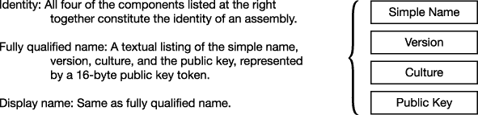

# 二十一、命名空间和程序集

*   [引用其他组件](#c21-1)
*   [名称空间](#c21-3)
*   [使用指令](#c21-8)
*   [装配的结构](#c21-11)
*   [一个程序集的身份](#c21-12)
*   [强命名程序集](#c21-13)
*   [程序集的私有部署](#c21-15)
*   [共享程序集和 GAC](#c21-16)
*   [配置文件](#c21-19)
*   [延迟签约](#c21-20)

### 引用其他组件

在[第 1 章](01.html)中，我们从高层次上看了编译过程。您看到编译器获取源代码文件并生成一个名为*汇编*的输出文件。这一章更详细地介绍了程序集以及它们是如何产生和部署的。它还介绍了命名空间如何帮助组织类型。

到目前为止，你看到的所有程序，大部分都声明并使用了它们自己的类。但是，在许多项目中，您会希望使用其他程序集中的类或类型。这些其他程序集可能来自 BCL 或第三方供应商，也可能是您自己创建的。这些被称为*类库*，它们的汇编文件名一般以`.dll`扩展名结尾，而不是`.exe`扩展名。

例如，假设您想要创建一个类库，其中包含可由其他程序集使用的类和类型。下面的例子展示了一个简单库的源代码，它包含在一个名为`SuperLib.cs`的文件中。该库包含一个名为`SquareWidget`的公共类。[图 21-1](#fig_21_1) 说明了 DLL 的制作。

`   public class SquareWidget
   {
      public double SideLength = 0;
      public double Area
      {
         get { return SideLength * SideLength; }
      }
   }` 

***图 21-1** 。SuperLib 源代码和结果汇编*

若要使用 Visual Studio 创建类库，请从已安装的 Windows 模板中选择类库模板。具体来说，在 Visual Studio 中，请执行下列操作:

1.  选择文件新建项目，新建项目窗口将会打开。
2.  在左窗格中，在已安装的模板面板上，找到 Visual C# 节点并选择它。
3.  在中间窗格中，选择类库模板。

假设你正在编写一个名为`MyWidgets`的程序，你想使用`SquareWidget`类。该程序的代码在一个名为`MyWidgets.cs`的文件中，如下所示。代码简单地创建了一个类型为`SquareWidget`的对象，并使用了该对象的成员。

`   using System;

   class WidgetsProgram
   {
      static void Main( )
      {
         SquareWidget sq = new SquareWidget();   // From class library
              ↑
              Not declared in this assembly
         sq.SideLength = 5.0;                    // Set the side length.
         Console.WriteLine(sq.Area);             // Print out the area.
      }     ↑
   }    Not declared in this assembly`

注意，代码没有声明类`SquareWidget`。相反，您使用在`SuperLib`中定义的类。然而，当你编译`MyWidgets`程序时，编译器必须意识到你的代码使用了汇编`SuperLib`，所以它可以获得关于类`SquareWidget`的信息。为此，您需要通过给出程序集的名称和位置，给编译器一个对程序集的引用*。*

在 Visual Studio 中，可以通过以下方式添加对项目的引用:

> *   Select Solution Explorer and find the `References` folder under the project name. `References` The folder contains a list of assemblies used by the project.
> *   Right-click the `References` folder and select Add Reference. There are five tabs to choose from, allowing you to find class libraries in different ways.
> *   For our program, select the Browse tab, browse to the DLL file containing the `SquareWidget` class definition, and select it.
> *   Click the OK button, and the reference will be added to the project.

添加引用后，可以编译`MyWidgets`。图 21-2 展示了完整的编译过程。

***图 21-2** 。引用另一个组件*

#### mscorlib 库

到目前为止，我在书中几乎所有的例子中都用到一个类库。它包含了`Console`类。在名为`mscorlib.dll`的文件中的名为`mscorlib`的程序集中定义了`Console`类。然而，你不会在`References`文件夹中找到这个程序集。Assembly `mscorlib`包含了 C# 类型的定义和 most 的基本类型。网络语言。在编译 C# 程序时必须总是引用它，所以 Visual Studio 不会费心在`References`文件夹中显示它。

当你考虑到`mscorlib`时，`MyWidgets`的编译过程看起来更像图 21-3 中的[所示。在这之后，我将假设使用`mscorlib`程序集，而不再表示它。](#fig_21_3)

***图 21-3** 。引用类库*

现在假设你的程序已经很好地使用了`SquareWidget`类，但是你想扩展它的功能来使用一个名为`CircleWidget`的类，这个类是在一个名为`UltraLib`的不同程序集中定义的。`MyWidgets`源代码现在看起来如下。它创建一个如`SuperLib`中定义的`SquareWidget`对象和一个如`UltraLib`中定义的`CircleWidget`对象。

`   class WidgetsProgram
   {
      static void Main( )
      {
         SquareWidget sq = new SquareWidget();      // From SuperLib
         ...

         CircleWidget circle = new CircleWidget();   // From UltraLib
         ...
      }
   }`

类库`UltraLib`的源代码如下例所示。注意，除了类`CircleWidget`，像库`SuperLib`，它还声明了一个名为`SquareWidget`的类。您可以将`UltraLib`编译成一个 DLL，并将其添加到项目`MyWidgets`的引用列表中。

`   public class SquareWidget
   {
      ...
   }

   public class CircleWidget
   {
      public double Radius = 0;
      public double Area
      {
         get { ... }
      }
   }`

由于两个库都包含一个名为`SquareWidget`的类，当你试图编译程序`MyWidgets`时，编译器会产生一个错误消息，因为它不知道使用类`SquareWidget`的哪个版本。[图 21-4](#fig_21_4) 说明了这种冲突，也称为*名称冲突*。

***图 21-4** 。由于程序集 SuperLib 和 UltraLib 都包含一个名为 SquareWidget 的类的声明，编译器不知道要实例化哪一个。*

### 命名空间

在`MyWidgets`的例子中，由于您有源代码，您可以通过在`SuperLib`源代码或`UltraLib`源代码中修改`SquareWidget`类的名称来解决名称冲突。但是，如果这些库是由不同的公司开发的，而您没有源代码，该怎么办呢？假设`SuperLib`由一家名为 MyCorp 的公司生产，而`UltraLib`由 ABCCorp 公司生产。在这种情况下，如果你使用任何有冲突的类或类型，你就不能一起使用它们。

可以想象，如果您的开发机器包含由几十个甚至几百个不同公司生产的程序集，那么在类名中可能会有一定数量的重复。如果仅仅因为两个程序集碰巧有相同的类型名，就不能在同一个程序中使用它们，那就太遗憾了。

然而，假设 MyCorp 有一个策略，在所有类的前面加上一个字符串，该字符串由公司名、产品名和描述性类名组成。进一步假设 ABC 公司有同样的政策。在这种情况下，我们例子中的三个类名将被命名为`MyCorpSuperLibSquareWidget`、`ABCCorpUltraLibSquareWidget`和`ABCCorpUltraLibCircleWidget`，如图 21-5 中的[所示。这些是完全有效的类名，一家公司的库中的类与另一家公司的冲突的可能性很小。](#fig_21_5)

***图 21-5。**有了类名前面的消歧字符串，库之间就没有冲突了。*

但是，我们的示例程序需要使用这些长名称，看起来如下所示:

`   class WidgetsProgram
   {
      static void Main( )
      {
         MyCorpSuperLibSquareWidget sq
                  = new MyCorpSuperLibSquareWidget();      // From SuperLib
         ...

         ABCCorpUltraLibCircleWidget circle
                  = new ABCCorpUltraLibCircleWidget();     // From UltraLib
         ...
      }
   }`

虽然这解决了冲突问题，但这些新的、无歧义的名称更难阅读，使用起来也很笨拙，即使使用智能感知也是如此。

然而，假设除了标识符中通常允许的字符之外，您还可以在字符串中使用句点字符—尽管仍然不能出现在类名的开头或结尾。在这种情况下，我们可以让名字更容易理解，比如`MyCorp.SuperLib.SquareWidget`、`ABCCorp.UltraLib.SquareWidget`和`ABCCorp.UltraLib.CircleWidget`。现在，代码将如下所示:

`   class WidgetsProgram
   {
      static void Main( )
      {
         MyCorp.SuperLib.SquareWidget sq
                  = new MyCorp.SuperLib.SquareWidget();      // From SuperLib
         ...

         ABCCorp.UltraLib.CircleWidget circle
                  = new ABCCorp.UltraLib.CircleWidget();     // From UltraLib
         ...
      }
   }`

这让我们想到了名称空间和名称空间名称的概念。

> *   You can think of the *namespace name* as a string of characters (which can contain periods in the string), attached to the front of the class or type name, separated by periods.
> *   The complete string containing the namespace name, separated period and class name is called the fully qualified name of the class.
> *   *Namespace* is a *collection of classes and types that share the name of this namespace.*

图 21-6 说明了这些定义。

***图 21-6。**命名空间是共享相同命名空间名称的类型定义的集合。*

您可以使用名称空间将一组类型组合在一起并给它们命名。通常，您希望命名空间名称描述命名空间包含的类型，并与其他命名空间名称相区别。

通过在包含类型声明的源文件中声明命名空间来创建命名空间。下面显示了声明命名空间的语法。然后在命名空间声明的花括号中声明所有的类和其他类型。这些就是名称空间的*成员*。

`      Keyword       Namespace name
         ↓              ↓
     namespace *NamespaceName*
     {
        *TypeDeclarations*
     }`

下面的代码展示了 MyCorp 的程序员如何创建`MyCorp.SuperLib`名称空间并在其中声明`SquareWidget`类:

`      Company  name   Period
                ↓   ↓
    namespace MyCorp.SuperLib
    {
       public class SquareWidget
       {
          public double SideLength = 0;
          public double Area
          {
             get { return SideLength * SideLength; }
          }
       }
    }`

现在，当 MyCorp 公司向您发送更新的程序集时，您可以通过修改您的`MyWidgets`程序来使用它，如下所示:

`   class WidgetsProgram
   {
      static void Main( )
      {        Fully qualified name                         Fully qualified name
         <ins>             ↓              </ins>          <ins>             ↓              </ins>
         <ins>MyCorp.SuperLib</ins>.SquareWidget sq = new MyCorp.SuperLib.SquareWidget();
                ↑               ↑
           Namespace name     Class name

           CircleWidget circle = new CircleWidget();
           ...`

现在您已经在代码中明确指定了`SquareWidget`的`SuperLib`版本，编译器将不再有区分类的问题。键入完全限定名有点长，但至少现在可以使用这两个库了。在本章的稍后部分，我将介绍`using`别名指令，它解决了必须重复输入完全限定名的不便。

如果`UltraLib`程序集也被生产它的公司(ABCCorp)更新了名称空间，那么编译过程将如图 21-7 所示。

***图 21-7** 。带名称空间的类库*

#### 命名空间名称

如您所见，命名空间的名称可以包含创建该程序集的公司的名称。除了标识公司之外，这个名称还用于帮助程序员快速了解名称空间中定义的类型。

关于命名空间名称的一些要点如下:

> *   The namespace name can be any valid identifier, as described in chapter 2 of [. Like any identifier, this string is case sensitive.](02.html)
> *   In addition, namespace names can contain any number of period characters. You can use it to organize types into a hierarchy.

例如，[表 21-1](#tab_21_1) 给出了 .NET BCL。

命名空间命名准则建议如下:

> *   Namespace name starting with company name.
> *   Add the technical name after the company name.
> *   Do not use the same name namespace as the class or type.

例如，Acme Widget 公司的软件开发部门在以下三个名称空间中开发软件，如以下代码所示:

> *   `AcmeWidgets.SuperWidget`
> *   `AcmeWidgets.Media`
> *   `AcmeWidgets.Games`

`   namespace AcmeWidgets.SuperWidget
   {
      class SPDBase ...
      ...
   }`

#### 关于名称空间的更多信息

关于名称空间，您还应该知道其他一些重要的事情:

> *   Each type name in the namespace must be different from all other type names.
> *   Types in a namespace are called members of that namespace.
> *   A source file can contain any number of namespace declarations, whether sequential or nested.

图 21-8 在左边显示了一个源文件，它顺序声明了两个名称空间，每个名称空间中有几个类型。请注意，尽管名称空间包含几个共同的类名，但它们是通过名称空间名称来区分的，如图右侧的程序集所示。

***图 21-8** 。源文件中的多个名称空间*

那个 .NET Framework BCL 提供了数千个已定义的类和类型供您在构建程序时选择。为了帮助组织这些大量的可用功能，具有相关功能的类型在同一个命名空间中声明。BCL 使用 100 多个命名空间来组织其类型。

#### 跨文件传播的名称空间

命名空间未关闭。这意味着您可以通过再次声明向它添加更多的类型声明，无论是稍后在源文件中还是在另一个源文件中。

例如，[图 21-9](#fig_21_9) 显示了三个类的声明，它们都在同一个名称空间中，但是在不同的源文件中声明。源文件可以编译成一个单独的程序集，如图[图 21-9](#fig_21_9) 所示，也可以编译成单独的程序集，如图[图 21-10](#fig_21_10) 所示。

***图 21-9** 。命名空间可以分布在源文件中，并编译为单个程序集。*

***图 21-10** 。命名空间可以分布在源文件中，并被编译成单独的程序集。*

#### 嵌套命名空间

名称空间可以嵌套，产生一个*嵌套名称空间*。嵌套命名空间允许您创建类型的概念性层次结构。

有两种方法可以声明嵌套命名空间:

> *   *Text nesting* : You can create a nested namespace by placing the declaration of the nested namespace in the declaration body of the closed namespace. This is illustrated on the left side of Figure 21-11\. In this example, the namespace `OtherNs` is nested in the namespace `MyNamespace`.
> *   *Separate declaration* : You can also create a separate declaration for the nested namespace, but you must use its fully qualified name in the declaration. This is illustrated on the right side of Figure 21-11\. Note that the fully qualified name `MyNamespace.OtherNS` is used in the declaration of nested namespace `OtherNs`.

***图 21-11** 。声明嵌套命名空间的两种形式是等效的。*

图 21-11 中[所示的两种形式的嵌套命名空间声明产生相同的程序集，如图 21-12](#fig_21_11) 中[所示。该图显示了在文件`SomeLib.cs`中声明的两个类，以及它们的完全限定名。](#fig_21_12)

***图 21-12** 。嵌套的名称空间结构*

尽管嵌套名称空间在封闭名称空间内部，但是它的成员是封闭名称空间的*而不是*成员。一个常见的误解是，由于嵌套命名空间位于封闭命名空间内部，因此嵌套命名空间的成员必须是封闭命名空间的子集。这不是真的；名称空间是独立的。

### 使用指令

完全限定名可能很长，在整个代码中使用它们会变得很麻烦。然而，有两个编译器指令可以让你避免使用完全限定名——`using`*命名空间指令*和`using` *别名指令*。

关于`using`指令的两个要点如下:

> *   They must be placed at the top of the source file, *before any type declaration* .
> *   They apply to all namespaces in the current source file.

#### 使用命名空间指令

您在前面几节的`MyWidgets`示例中看到，您可以通过使用完全限定名来指定一个类。通过将`using`名称空间指令放在源文件的顶部，可以避免使用长名称。

`using`命名空间指令指示编译器您将使用某些特定命名空间中的类型。然后，您可以继续使用简单的类名，而不必完全限定它们。

当编译器遇到不在当前名称空间中的名称时，它会检查在`using`名称空间指令中给出的名称空间列表，并将未知名称附加到列表中的第一个名称空间。如果生成的完全限定名与此程序集中的某个类或引用的程序集中的某个类匹配，编译器将使用该类。如果不匹配，它将尝试列表中的下一个名称空间。

`using`名称空间指令由关键字`using`组成，后跟一个名称空间标识符。

`   Keyword
     ↓
   using System;
            ↑
      Name of namespace`

我在本文中一直使用的一个方法是`WriteLine`方法，它是在`System`名称空间中的类`Console`的成员。我没有在整个代码中使用它的完全限定名，而是通过在代码顶部使用`using`名称空间指令来稍微简化我们的工作。

例如，下面的代码在第一行使用了`using`命名空间指令来声明代码使用了来自`System`命名空间的类或其他类型。

`   using System;                                // using namespace directive
       ...
   System.Console.WriteLine("This is text 1");  // Use fully qualified name.
   Console.WriteLine("This is text 2");         // Use directive.`

#### 使用别名指令

`using`别名指令允许您为以下任一项分配别名:

> *   A namespace.
> *   A namespace.

例如，下面的代码显示了两个`using`别名指令的使用。第一个指令指示编译器标识符`Syst`是名称空间`System`的别名。第二个指令说标识符`SC`是类`System.Console`的别名。

`  Keyword  Alias     Namespace
     ↓     ↓      ↓
   using Syst = System;
   using SC   = <ins>System.Console</ins>;
     ↑    ↑            ↑
 Keyword  Alias         Class`

下面的代码使用这些别名。`Main`中的三行代码都调用了`System.Console.WriteLine`方法。

> *   The first statement in `Main` uses the alias -`System` of *namespace.*
> *   The second statement uses the fully qualified name of the method.
> *   The third statement uses an alias -`Console` of the *class.*

`   using Syst = System;                         // using alias directive
   using SC   = System.Console;                 // using alias directive

   namespace MyNamespace
   {
      class SomeClass
      {
         static void Main()
         { Alias for namespace
            <ins> ↓ </ins>
            Syst.Console.WriteLine  ("Using the namespace alias.");
            System.Console.WriteLine("Using fully qualified name.");
            <ins>SC</ins>.WriteLine            ("Using the type alias");
             ↑
         } Alias for class
      }
   }`

### 一个装配的结构

正如你在[第 1 章](01.html)中看到的，一个汇编不包含本机代码，而是包含通用中间语言(CIL)代码。它还包含实时(JIT)编译器在运行时将 CIL 转换为本机代码所需的一切，包括对它引用的其他程序集的引用。组件的文件扩展名通常是`.exe`或`.dll`。

大多数程序集都由一个文件组成。[图 21-13](#fig_21_13) 显示了组件的四个主要部分。

> *   The assembly *list* contains the following contents:
>     *   The identity of the assembly
>     *   List of files that make up an assembly
>     *   Location map in assembly
>     *   Information about other referenced assemblies
> *   The type metadata section contains information about all types defined in the assembly. This information contains all information about each type.
> *   CIL section contains all intermediate codes for assembly.
> *   *Resources* is optional, but it can contain graphics or language resources.

***图 21-13** 。单列程序集的结构*

汇编代码文件被称为*模块*。尽管大多数程序集包含一个模块，但有些程序集包含更多模块。对于有多个模块的装配，一个文件是*主模块*，其他是*次模块*。

> *   The main module contains a list of assemblies and references to auxiliary modules.
> *   The file name of the secondary module ends with the extension `.netmodule`.
> *   The multi-file component is considered as a unit. They are deployed together and versioned together.

[图 21-14](#fig_21_14) 显示了带有次级模块的多文件组件。

***图 21-14。**多文件汇编*

### 一个程序集的身份

在 .NET Framework 中，程序集的文件名不像在其他操作系统和环境中那样重要。更重要的是程序集的*标识*。

程序集的标识由四个部分组成，这四个部分应该一起唯一地标识它。这四个组成部分如下:

> *   *Simple name* : This is just a file name without a file extension. Each assembly has a simple name. It is also called *assembly name* or *friendly name* .
> *   Version number: A string of four integers separated by periods, in the format of `MajorVersion.MinorVersion.Build.Revision`—for example, `2.0.35.9`.
> *   Culture: A string of two to five characters representing a language, or a language and a country or region. For example, the cultural name of English used in America is `en-US`. The German used in Germany is `de-DE`.
> *   *Public key* : This 128-byte string should be unique to the company that produces this component.

公钥是公钥/私钥对的一部分，公钥/私钥对是一组两个非常大的特别选择的数字，可用于创建安全的数字签名。公钥，顾名思义，是可以公开的。私钥必须由所有者保管。公钥是程序集标识的一部分。我们将在本章的后面讨论私钥的使用。

程序集名称的组成部分嵌入在程序集的清单中。[图 21-15](#fig_21_15) 说明了这部分的清单。

***图 21-15** 。清单中一个组装标识的组件*

[图 21-16](#fig_21_16) 显示了。有关程序集标识的. NET 文档和文献。

***图 21-16** 。程序集标识的术语*

### 强命名程序集

一个被强命名为的*程序集是一个附加了唯一数字签名的程序集。强名称程序集比没有强名称的程序集安全得多，原因如下:*

> *   A strong name uniquely identifies an assembly. No one else can create an assembly with the same strong name, so users can be sure that the assembly comes from the declared source.
> *   If the security component of CLR does not catch the modification, the content of the assembly with strong name cannot be modified.

一个弱命名的程序集是一个没有强命名的程序集。由于弱命名程序集没有数字签名，因此它本身就不安全。因为链的强度取决于其最弱的链接，所以默认情况下，具有强名称的程序集只能访问其他具有强名称的程序集。(还有一种方法允许“部分信任的呼叫者”，但我不会讨论这个话题。)

程序员不产生强名称。编译器通过获取有关程序集的信息并对其进行哈希处理以创建附加到程序集的唯一数字签名来生成它。它在哈希过程中使用的信息如下:

> *   The byte sequence that makes up the assembly.
> *   Simple name
> *   version number
> *   Cultural information
> *   Public/private key pair

 **注意**围绕强名称的命名有一些多样性。我所说的“强命名”通常被称为“强命名”我所说的“弱命名”有时被称为“非强名称”或“具有简单名称的程序集”

#### 创建强名称程序集

若要使用 Visual Studio 对程序集进行强名称命名，您必须拥有公钥/私钥对文件的副本。如果没有密钥文件，可以让 Visual Studio 为您生成一个。然后，您可以执行以下操作:

1.  打开项目的属性。
2.  选择签名选项卡。
3.  选中“对程序集签名”复选框，并输入密钥文件的位置或创建一个新的密钥文件。

编译代码时，编译器会生成一个具有强名称的程序集。图 21-17 显示了编译器的输入和输出。

***图 21-17** 。创建强名称程序集*

 **注意**要创建具有强名称的程序集，您还可以使用一个名为强名称工具(`sn.exe`)的工具，它会在您安装 Visual Studio 时自动安装。这是一个命令行工具，允许您对程序集进行签名，还提供了许多其他选项来管理您的密钥和签名。如果您需要的选项比 Visual Studio IDE 提供的更多，这将非常有用。您可以在网上找到使用强名称工具的详细信息。

### 一个程序集的私有部署

在目标机器上部署程序可以像在机器上创建一个目录并将应用复制到其中一样简单。如果应用不需要其他程序集(如 dll ),或者如果所需的 dll 在同一个目录中，程序应该可以正常工作。这样部署的程序叫做*私有程序集*，这种部署方法叫做 *xcopy* 部署。

私有程序集几乎可以放在任何目录中，只要它们所依赖的所有文件都在同一个目录或子目录中，它们就是独立的。事实上，您可以在文件系统的不同部分有几个目录，每个目录都有一组相同的程序集，它们都可以在各自的位置正常工作。

关于私有程序集部署，需要了解的一些重要事项如下:

> *   The directory where private assemblies are placed is called *application directory* .
> *   Private assemblies can be strongly named or weakly named.
> *   There is no need to register components in the registry.
> *   To uninstall a private assembly, simply delete it from the file system.

### 共享程序集和 GAC

私有程序集非常有用，但有时您会希望将 DLL 放在中心位置，以便系统上的其他程序集可以共享一个副本。 .NET 有这样一个资源库，叫做*全局程序集缓存* (GAC)。放入 GAC 的程序集被称为*共享程序集*。

关于 GAC 的一些重要事实如下:

> *   Only strongly named assemblies can be added to GAC.
> *   Although earlier GAC only accepted files with extension `.dll`, now you can also add assemblies with extension `.exe`.
> *   GAC is located in the subdirectory of the Windows system directory. Before. NET 4.0 It is located at `\Windows\Assembly`. Start with ... NET 4.0 It is located at `\Windows\ Microsoft.NET\assembly`.

#### 将组件安装到 GAC 中

当您尝试将程序集安装到 GAC 中时，CLR 的安全组件必须首先验证程序集上的数字签名是否有效。如果没有数字签名或数字签名无效，系统不会将其安装到 GAC 中。

然而，这是一次性的检查。当一个程序集在 GAC 中之后，当它被一个正在运行的程序引用时，不需要进一步的检查。

`gacutil.exe`命令行实用程序允许您在 GAC 中添加和删除程序集，并列出它包含的程序集。三个最有用的标志如下:

> *   `/i`: Insert an assembly into GAC
> *   `/u`:从（同 granular-activatedcarbon）颗粒状活性炭
> *   Uninstall an assembly in `/l`:
> 
> 中列出程序集

#### 在 GAC 中并行执行

将程序集部署到 GAC 后，它可以被系统中的其他程序集使用。但是，请记住，程序集的标识由完全限定名的所有四个部分组成。因此，如果一个库的版本号改变了，或者它有不同的公钥，这些差异就指定了不同的程序集。

结果是 GAC 中可能有许多不同的程序集具有相同的文件名。虽然它们有相同的文件名，*但是它们是不同的程序集*，并且在 GAC 中完美地共存。这使得不同的应用可以很容易地同时使用同一 DLL 的不同版本，因为它们是具有不同标识的不同程序集。这叫做*并行执行*。

[图 21-18](#fig_21_18) 展示了 GAC 中四个不同的 dll，它们都有相同的文件名——T0。从图中可以看出，前三个来自同一家公司，因为它们拥有相同的公钥，而第四个来自不同的来源，因为它拥有不同的公钥。这些版本的区别如下:

> *   English version 1.0.0.0, from Company A.
> *   English version 2.0.0, from Company A.
> *   German version 1.0.0.0, from Company A.
> *   English version 1.0.0, from Company B.

***图 21-18。**GAC 中四个不同的并行 DLLs】*

### 配置文件

配置文件包含有关应用的信息，供 CLR 在运行时使用。它们可以指示 CLR 使用不同版本的 DLL，或者在搜索程序引用的 DLL 时查看其他目录。

配置文件由 XML 代码组成，不包含 C# 代码。编写 XML 代码的细节超出了本文的范围，但是您应该理解配置文件的用途以及如何使用它们。使用它们的一种方式是更新应用程序集以使用 DLL 的新版本。

例如，假设您有一个引用 GAC 中的 DLL 的应用。应用清单中引用的标识必须与 GAC 中程序集的标识完全匹配。如果发布了 DLL 的新版本，它可以被添加到 GAC 中，在那里它可以与旧版本愉快地共存。

但是，应用仍然在其清单中嵌入了旧版本 DLL 的标识。除非您重新编译应用并使其引用 DLL 的新版本，否则它将继续使用旧版本。很好，如果这是你想要的。

但是，如果您不想重新编译应用，而是希望它使用新的 DLL，那么您可以创建一个配置文件，告诉 CLR 使用新版本而不是旧版本。配置文件放在应用目录中。

[图 21-19](#fig_21_19) 说明了运行时过程中的对象。左边的`MyProgram.exe`应用调用了`MyLibrary.dll`的版本 1.0.0.0，如虚线箭头所示。但是应用有一个配置文件，它指示 CLR 加载 2.0.0.0 版。请注意，配置文件的名称由可执行文件的全名(包括扩展名)和附加扩展名`.config`组成。

***图 21-19** 。使用配置文件绑定到新版本*

### 延迟签约

重要的是，公司要小心保护它们的官方公/私密钥对中的私密钥。否则，如果不可信的人获得它，他们可以发布伪装成公司代码的代码。为了避免这种情况，公司显然不能允许自由访问包含它们的公钥/私钥对的文件。在大公司中，程序集的最终强名称通常在开发过程的最后由有权访问密钥对的特殊小组来执行。

但是，由于几个原因，这可能会在开发和测试过程中引起问题。首先，因为公钥是程序集标识的四个组成部分之一，所以在提供公钥之前不能设置标识。此外，弱命名程序集不能部署到 GAC。开发人员和测试人员都需要能够以发布时部署的方式编译和测试代码，包括它在 GAC 中的身份和位置。

考虑到这一点，有一种分配强名称的修改形式，称为*延迟签名*，或*部分签名*，它克服了这些问题，但不释放对私钥的访问。

在延迟签名中，编译器只使用公钥/私钥对中的公钥。然后可以将公钥放在清单中，以完成程序集的标识。延迟签名还使用 0 块来为数字签名保留空间。

若要创建延迟签名程序集，必须做两件事。首先，创建一个只有公钥而没有公钥/私钥对的密钥文件副本。接下来，向源代码的汇编范围添加一个名为`DelaySignAttribute`的附加属性，并将其值设置为`true`。

[图 21-20](#fig_21_20) 显示了产生延迟签名组件的输入和输出。请注意图中的以下内容:

> *   In the input, `DelaySignAttribute` is located in the source file, and the key file only contains the public key.
> *   In the output, there is space reserved for digital signatures at the bottom of the assembly.

***图 21-20。**创建延迟签名的程序集*

如果您试图将延迟签名的程序集部署到 GAC，CLR 不会允许，因为它没有强名称。要在特定的计算机上部署它，您必须首先发出一个命令行命令，在该计算机上禁用 GAC 的签名验证，只针对该程序集，并允许它安装在 GAC 中。为此，从 Visual Studio 命令提示符发出以下命令。

`   sn –vr MyAssembly.dll`

现在，您已经了解了弱命名程序集、延迟签名程序集和强名称程序集。[图 21-21](#fig_21_21) 总结了它们结构上的差异。

***图 21-21** 。不同组装签名阶段的结构*