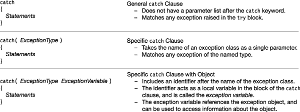
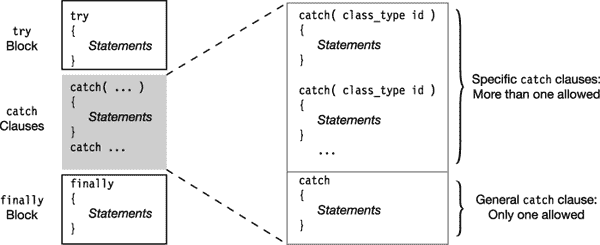

# 二十二、异常

*   什么是异常？
*   [try 语句](#c22-2)
*   [异常类](#c22-4)
*   [catch 子句](#c22-5)
*   [使用特定 catch 子句的示例](#c22-6)
*   [捕获条款部分](#c22-7)
*   [最后一块](#c22-8)
*   [寻找异常的处理程序](#c22-9)
*   [进一步搜索](#c22-10)
*   [抛出异常](#c22-13)
*   [抛出无异常对象](#c22-14)

### 有哪些异常？

*异常*是程序中违反系统或应用约束的运行时错误，或者是正常运行期间不希望发生的情况。例如，当程序试图将一个数除以零或试图写入只读文件时。当这些发生时，系统捕捉到错误，*引发*异常。

如果程序没有提供处理异常的代码，系统将暂停程序。例如，下面的代码在试图除以零时会引发异常:

`   static void Main()
   {
      int x = 10, y = 0;
      x /= y;              // Attempt to divide by zero--raises an exception
   }`

运行此代码时，系统显示以下错误消息:

* * *

`Unhandled Exception: System.DivideByZeroException: Attempted to divide by zero.
         at Exceptions_1.Program.Main() in C:\Progs\Exceptions\Program.cs:line 12`

* * *

### try 语句

`try`语句允许您指定代码块来防止异常，并在异常发生时提供代码来处理它们。`try`语句由三部分组成，如图[图 22-1](#fig_22_1) 所示。

> *   `try` *Block* contains the code protected for exceptions.
> *   The `catch` clause part contains one or more `catch` clauses. These are the code blocks that handle exceptions. They are also called exception handlers.
> *   `finally` *Block* contains the code to be executed under all circumstances, regardless of whether there is an exception.

***图 22-1** 。try 语句的结构*

#### 处理异常

前面的例子表明，试图除以零会导致异常。您可以通过将代码放在一个`try`块中并提供一个简单的`catch`子句来修改程序以处理该异常。当异常出现时，它在`catch`块中被捕获和处理。

`   static void Main()
   {
      int x = 10;

      try
      {
         int y = 0;
         x /= y;                    // Raises an exception
      }
      catch
      {
            ...                     // Code to handle the exception

         Console.WriteLine("Handling all exceptions - Keep on Running");
      }
   }`

该代码产生以下消息。请注意，除了输出消息之外，没有任何迹象表明发生了异常。

* * *

`Handling all exceptions - Keep on Running`

* * *

### 异常类

程序中可能出现许多不同类型的异常。BCL 定义了许多异常类，每个类代表一种特定的类型。发生这种情况时，CLR 会执行以下操作:

> *   It creates an exception object for the type.
> *   It looks for a suitable `catch` clause to deal with it.

所有的异常类最终都是从`System.Exception`类派生出来的。图 22-2 显示了异常继承层次的一部分。

***图 22-2** 。异常层次结构*

异常对象包含只读属性，其中包含导致异常的信息。表 22-1 显示了其中的一些特性。

### catch 子句

`catch`子句处理异常。有三种形式，允许不同级别的处理。图 22-3 显示了这些表格。

***图 22-3** 。catch 子句的三种形式*

*general* `catch`子句可以接受任何异常，但不能确定导致异常的异常类型。这仅允许对任何可能发生的异常进行一般的处理和清理。

*特定的* `catch`子句形式将异常类的名称作为参数。它匹配指定类的异常或从它派生的异常类。

带有宾语形式的*特定* `catch` *子句提供了关于异常的最多信息。它匹配指定类的异常，或从它派生的异常类。它通过将 CLR 创建的异常对象分配给*异常变量*，为您提供了对该异常对象的引用。您可以在`catch`子句的块中访问异常变量的属性，以获得关于所引发的异常的特定信息。*

例如，下面的代码处理类型`IndexOutOfRangeException`的异常。当一个异常发生时，对实际异常对象的引用被传递到带有参数名`e`的代码中。三个`WriteLine`语句都从异常对象中读取一个字符串字段。

`                  Exception type    Exception variable
                        ↓             ↓
    catch ( IndexOutOfRangeException  e )
   {                                 Accessing the exception variables
                                         <ins>    ↓   </ins>
       Console.WriteLine( "Message: {0}", e.Message );
       Console.WriteLine( "Source:  {0}", e.Source );
       Console.WriteLine( "Stack:   {0}", e.StackTrace );`

### 使用特定 catch 子句的例子

回到我们被零除的例子，下面的代码修改了前面的`catch`子句，专门处理`DivideByZeroException`类的异常。在前一个例子中，`catch`子句将处理在`try`块中引发的任何异常，而当前的例子将只处理那些`DivideByZeroException`类的异常。

`   int x = 10;
   try
   {
      int y = 0;
      x /= y;                    // Raises an exception
   }            Exception type
                     ↓                    
   catch ( DivideByZeroException )
   {
         ...
      Console.WriteLine("Handling an exception.");
   }`

您可以进一步修改`catch`子句来使用一个异常变量。这允许您访问`catch`块中的异常对象。

`   int x = 10;
   try
   {
      int y = 0;
      x /= y;                    // Raises an exception
   }          Exception type     Exception variable
                    ↓             ↓
   catch ( DivideByZeroException  e )
   {                             Accessing the exception variables
                                        <ins>   ↓   </ins>
      Console.WriteLine("Message: {0}", e.Message );
      Console.WriteLine("Source:  {0}", e.Source );
      Console.WriteLine("Stack:   {0}", e.StackTrace );
   }`

在我的计算机上，该代码产生以下输出。在您的计算机上，第三行和第四行中的文件路径会有所不同，并且会与您的项目和解决方案目录的位置相匹配。

* * *

`Message: Attempted to divide by zero.
Source:  Exceptions 1
Stack:      at Exceptions_1.Program.Main() in C:\Progs\Exceptions 1\
Exceptions 1\Program.cs:line 14`

* * *

### 军规条款部分

一个`catch`子句的目的是允许你以一种优雅的方式处理一个异常。如果您的`catch`子句采用带参数的形式，那么系统已经将异常变量设置为对异常对象的引用，您可以通过检查来确定异常的原因。如果异常是前一个异常的结果，您可以从变量的`InnerException`属性中获取对前一个异常的对象的引用。

`catch`子句部分可以包含多个`catch`子句。[图 22-4](#fig_22_4) 显示了`catch`条款部分的概要。

***图 22-4** 。try 语句的 catch 子句部分的结构*

当出现异常时，系统按顺序搜索`catch`子句列表，执行第一个与异常对象类型匹配的`catch`子句。正因为如此，在安排`catch`条款的顺序时有两条重要的规则。它们是:

> *   Specific `catch` clauses must be sorted from the most specific exception type, followed by the most general exception type. For example, if you declare an exception class *derived from `NullReferenceException`, then the `catch` clause of your derived exception type should be listed before the `catch` clause of `NullReferenceException`.*
> *   If there is a general `catch` clause, it must be the last, after all, the specific `catch` clause. The general `catch` clause is not encouraged, because when your code *should* handle the error in a specific way, it will allow the program to continue to execute, thus hiding the error. It also leaves the program in an unknown state. Therefore, if possible, you should use one of the specific `catch` clauses.

### 终于封锁了

如果一个程序的控制流进入一个有`finally`块的`try`语句，那么`finally`块总是*被*执行。[图 22-5](#fig_22_5) 显示了控制流程。

> *   If there is no exception in `try` block, then at the end of `try` block, control skips any `catch` clause and goes to `finally` block.
> *   If there is an exception in the `try` block, execute the corresponding `catch` clause in the `catch` clause section, and then execute the `finally` block.

***图 22-5** 。最终块的执行*

在返回到调用代码之前，`finally`块总是会被执行，即使`try`块有一个`return`语句或者在`catch`块中抛出一个异常。例如，在下面的代码中，在特定条件下执行的`try`块中间有一个`return`语句。这不允许它绕过`finally`语句。

`   try
   {
      if (inVal < 10) {
         Console.Write("First Branch  - ");
         return;
      }
      else
         Console.Write("Second Branch - ");
   }
   finally
   { Console.WriteLine("In finally statement"); }`

当变量`inVal`的值为`5`时，该代码产生以下输出:

* * *

`First Branch  - In finally statement`

* * *

### 寻找异常的处理程序

当程序引发异常时，系统会检查程序是否为它提供了处理程序。[图 22-6](#fig_22_6) 显示了控制流程。

> *   If an exception occurs in the `try` block, the system will check whether there are any `catch` clauses that can handle the exception.
> *   If a suitable `catch` clause is found, the following happens:
>     *   The `catch` clause is executed.
>     *   If there is a `finally` block, execute.
>     *   Continue execution after `try` statement (that is, after `finally` block or after the last `catch` clause if there is no `finally` block).

***图 22-6** 。当前 try 语句中的处理程序出现异常*

### 进一步搜索

如果异常是在不受`try`语句保护的代码段中引发的，或者如果`try`语句没有匹配的异常处理程序，系统将不得不进一步寻找匹配的处理程序。它将通过在调用栈中依次搜索，来查看是否有一个带有匹配处理程序的封闭的`try`块。

[图 22-7](#fig_22_7) 说明了搜索过程。图的左边是代码的调用结构，右边是调用栈。图中显示`Method2`是从`Method1`的`try`块内部调用的。如果在`Method2`中的`try`块内发生异常，系统执行以下操作:

> *   First, check whether `Method2` has an exception handler that can handle exceptions.
>     *   If yes, `Method2` processing, the program continues to execute.
>     *   If not, the system continues to call the stack down to `Method1` to search for a suitable handler.
> *   If `Method1` has an appropriate `catch` clause, the system will do the following:
>     *   It will return to the top of the call stack-that is, `Method2`.
>     *   It executes `finally` block of `Method2` and pops `Method2` off the stack.
>     *   Execute the `catch` clause of `Method1` and its `finally` block.
> *   If `Method1` does not have a suitable `catch` clause, the system continues to search the call stack downwards.

***图 22-7** 。向下搜索调用栈*

#### 通用算法

[图 22-8](#fig_22_8) 显示了处理异常的一般算法。

***图 22-8** 。处理异常的一般算法*

#### 向下搜索调用堆栈的示例

在下面的代码中，`Main`开始执行并调用方法`A`，方法`A`调用方法`B`。代码后和图 22-9 中的[给出了过程的描述和图表。](#fig_22_9)

`   class Program
   {
      static void Main()
      {
         MyClass MCls = new MyClass();
         try
            { MCls.A(); }
         catch (DivideByZeroException e)
            { Console.WriteLine("catch clause in Main()"); }
         finally
            { Console.WriteLine("finally clause in Main()"); }
         Console.WriteLine("After try statement in Main.");
         Console.WriteLine("            -- Keep running.");
       }
   }

   class MyClass
   {
      public void A()
      {
         try
            { B(); }
         catch (System.NullReferenceException)
            { Console.WriteLine("catch clause in A()"); }
         finally
            { Console.WriteLine("finally clause in A()"); }
      }

      void B()
      {
         int x = 10, y = 0;
         try
            { x /= y; }
         catch (System.IndexOutOfRangeException)
            { Console.WriteLine("catch clause in B()"); }
         finally
            { Console.WriteLine("finally clause in B()"); }
      }
   }`

这段代码产生以下输出:

* * *

`finally clause in B()
finally clause in A()
catch clause in Main()
finally clause in Main()
After try statement in Main.
            -- Keep running.`

* * *

> 1.  `Main` Call `A`, T1 calls `B`, and `DivideByZeroException` exception is encountered.
> 2.  Check whether the `catch` part of the system `B` has a matching `catch` clause. Although it has one for `IndexOutOfRangeException`, it has no one for `DivideByZeroException`.
> 3.  Then, the system moves down the call stack, checks the `catch` part of `A`, and finds that `A` also has no matching `catch` clause.
> 4.  The system continues to call down the stack, checks the `catch` clause of `Main`, and finds that `Main` does have a `DivideByZeroException` `catch` clause.
> 5.  Although the matching `catch` clause is now located, it has not been executed. Instead, the system returns to the top of the stack, executes the T2 clause of T1, and pops T3 from the call stack.
> 6.  Then the system moves to `A`, executes its `finally` clause, and pops up `A` from the call stack.
> 7.  Finally, execute the matching `catch` clause of `Main`, and then execute its `finally` clause. Then continue to execute after the `try` statement of `Main` ends.

***图 22-9** 。在堆栈中搜索异常处理程序*

### 抛出异常

*你可以通过使用`throw`语句让你的代码显式引发一个异常。`throw`语句的语法如下:*

`   throw ExceptionObject;`

例如，下面的代码定义了一个名为`PrintArg`的方法，它接受一个`string`参数并将其打印出来。在`try`块中，它首先检查以确保参数不是`null`。如果是，它创建一个`ArgumentNullException`实例并抛出它。异常实例在`catch`语句中被捕获，并输出错误消息。`Main`调用该方法两次:一次使用`null`参数，另一次使用有效参数。

`   class MyClass
   {
      public static void PrintArg(string arg)
      {
         try
         {
            if (arg == null)                              Supply name of null argument.
            {                                                         ↓
               ArgumentNullException myEx = new ArgumentNullException("arg");
               throw myEx;
            }
            Console.WriteLine(arg);
         }
         catch (ArgumentNullException e)
         {
            Console.WriteLine("Message:  {0}", e.Message);
         }
      }
   }
   class Program
   {
      static void Main()
      {
         string s = null;
         MyClass.PrintArg(s);
         MyClass.PrintArg("Hi there!");
      }
   }`

该代码产生以下输出:

* * *

`Message:  Value cannot be null.
Parameter name: arg
Hi there!`

* * *

### 投掷无异常物体

在`catch`块中，也可以在没有异常对象的情况下使用`throw`语句。

> *   The form throws the current exception again, and the system continues to look for additional handlers for it.
> *   This form can only be used in `catch` statements.

例如，以下代码从第一个`catch`子句中重新抛出异常:

`   class MyClass
   {
      public static void PrintArg(string arg)
      {
         try
         {
            try
            {
               if (arg == null)                           Supply name of null argument.
               {                                                          ↓
                  ArgumentNullException myEx = new ArgumentNullException("arg");
                  throw myEx;
               }
               Console.WriteLine(arg);
            }
            catch (ArgumentNullException e)
            {
               Console.WriteLine("Inner Catch:  {0}", e.Message);
               throw;
            }    ↑
         }    Rethrow the exception, with no additional parameters.
         catch
         {
            Console.WriteLine("Outer Catch:  Handling an Exception.");
         }
      }
   }

   class Program {
      static void Main() {
         string s = null;
         MyClass.PrintArg(s);
      }
   }`

这段代码产生以下输出:

* * *

`Inner Catch:  Value cannot be null.
Parameter name: arg
Outer Catch:  Handling an Exception.`

* * *