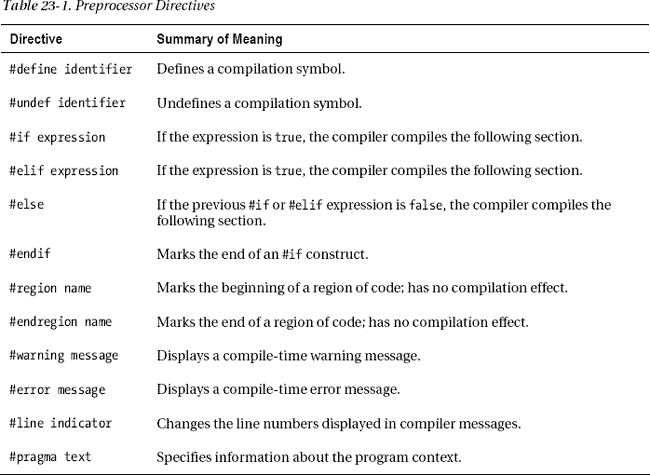
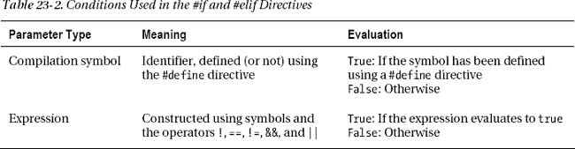
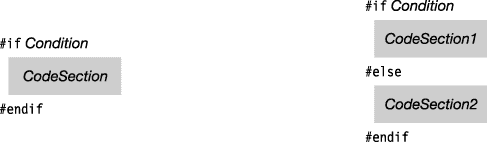
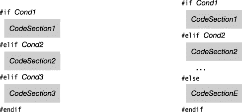
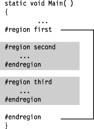

# 二十三、预处理器指令

*   什么是预处理器指令？
*   [一般规则](#c23-2)
*   [# define 和#undef 指令](#c23-3)
*   [条件编译](#c23-4)
*   [条件编译构造](#c23-5)
*   [诊断指令](#c23-6)
*   [行号指令](#c23-7)
*   [地区指令](#c23-8)
*   [# pragma 警告指令](#c23-9)

### 什么是预处理器指令？

源代码指定了程序的定义。*预处理器指令*指示编译器如何处理源代码。例如，在某些情况下，您可能希望编译器忽略部分代码，而在其他情况下，您可能希望编译该代码。预处理器指令为您提供了这些选项和其他几个选项。

在 C 和 C++中，有一个实际的预处理器阶段，在这个阶段，预处理器检查源代码，并准备一个输出文本流，供随后的编译阶段处理。在 C# 中，没有真正的预处理器。“预处理器”指令由编译器处理。然而，这个术语仍然存在。

### 一般规则

预处理器指令的一些最重要的语法规则如下:

> *   The preprocessor instruction must be on a separate line from the C# code.
> *   Unlike C# statements, preprocessor instructions do not end with semicolons.
> *   Each line containing preprocessing instructions must start with the `#` character.
>     *   `#` There can be a space before the character.
>     *   There can be a space between the `#` character and the instruction.
> *   End of line comments are allowed.
> *   Delimited comments are allowed in the preprocessor command line by *instead of* .

以下代码说明了这些规则:

`                   No semicolon
                         ↓
   #define PremiumVersion             // OK

   Space before
      ↓
       #define BudgetVersion          // OK
     #  define MediumVersion          // OK
      ↑
    Space between                                  Delimited comments are not allowed.
                                                 <ins>             ↓           </ins>
     #define PremiumVersion                      /* all bells & whistles */
                                                 End-of-line comments are fine.
                                                 <ins>           ↓           </ins>
     #define BudgetVersion                       // Stripped-down version`

[表 23-1](#tab_23_1) 列出了预处理器指令。

### # define 和#undef 指令

*编译符号*是只有两种可能状态的标识符。要么是*定义的*，要么是*未定义的*。编译符号具有以下特征:**

 *> *   Can be any identifier other than `true` or `false`. This includes the C# keyword and identifier declared in the C# code-both can be used.
> *   It has no value. Unlike C and C++, it does not represent strings.

如[表 23-1](#tab_23_1) 所示:

> `#define`
> 
> `#undef`

`   #define PremiumVersion
   #define EconomyVersion
      ...
   #undef PremiumVersion`

在列出任何 C# 代码之前，`#define`和`#undef`指令只能用在源文件的顶部。C# 代码启动后，`#define`和`#undef`指令就不能再使用了。

`   using System;                        // First line of C# code
   #define PremiumVersion               // Error

   namespace Eagle
   {
      #define PremiumVersion            // Error
      ...`

编译符号的范围仅限于单个源文件。重新定义一个已经定义的符号是完全可以的——当然，只要是在任何 C# 代码之前。

`   #define AValue
   #define BValue

   #define AValue                       // Redefinition is fine.`

### 有条件编译

条件编译允许您根据是否定义了特定的编译符号，将源代码的一部分标记为编译或跳过。

有四个指令用于指定条件编译:

> *   `#if`
> *   `#else`
> *   `#elif`
> *   `#endif`

一个*条件*是一个返回`true`或`false`的简单表达式。

> *   Conditions can be composed of a single compiled symbol or expressions of symbols and operators, as shown in Table 23-2 of [. Subexpressions can be grouped by brackets.](#tab_23_2)
> *   The words `true` and `false` can also be used in conditional expressions.

以下是条件编译条件的示例:

`        Expression
            ↓           
   #if !DemoVersion
      ...
   #endif             Expression
                           ↓
   #if (LeftHanded && OemVersion) || FullVersion
      ...
   #endif

   #if true   // The following code segment will always be compiled.
      ...
   #endif`

### 条件编译构造

`#if`和`#endif`指令是条件编译结构的匹配分界。只要有一个`#if`指令，就必须有一个与之匹配的`#endif`。

[图 23-1](#fig_23_1) 说明了`#if`和`#if...#else`构造。

> *   If the conditional calculation result in the `#if` construction is `true`, then compile the following code segment. Otherwise, it will be skipped.
> *   In the `#if...#else` construction, if the condition evaluates to `true`, then *code segment 1* is compiled. Otherwise, compile *code segment 2* .

***图 23-1** 。#if 和#else 结构*

例如，下面的代码演示了一个简单的`#if...#else`构造。如果定义了符号`RightHanded`，则编译`#if`和`#else`之间的代码。否则，编译`#else`和`#endif`之间的代码。

`   ...
   #if RightHanded
      // Code implementing right-handed functionality
      ...
   #else
      // Code implementing left-handed functionality
      ...
   #endif`

[图 23-2](#fig_23_2) 说明了`#if...#elif`和`#if...#elif...#else`构造。

> `#if...#elif`构造中的
> 
> *   ：
>     *   If *COND1* evaluates to `true`, *Codesection1* is compiled, and compilation continues after `#endif`.
>     *   Otherwise, if *cond2* evaluates to `true`, *codesection2* is compiled, and compilation continues after `#endif`.
>     *   This continues until one condition evaluates to `true` or all conditions return to `false`. If this is the case, no code part in the construction will be compiled, and compilation will continue after `#endif`.
> *   The `#if...#elif...#else` construction works in the same way, except that if there is no condition of `true`, the code segment after `#else` will be compiled, and the compilation will continue after `#endif`.

***图 23-2。**如果...#elif 构造(左)和#if...#elif...#else 构造(右)*

下面的代码演示了`#if...#elif...#else`构造。根据定义的编译符号，包含程序版本描述的字符串被设置为不同的值。

`   #define DemoVersionWithoutTimeLimit
         ...
      const int intExpireLength = 30;
      string strVersionDesc     = null;
      int    intExpireCount     = 0;

   #if   DemoVersionWithTimeLimit
      intExpireCount = intExpireLength;
      strVersionDesc = "This version of Supergame Plus will expire in 30 days";

   #elif DemoVersionWithoutTimeLimit
      strVersionDesc = "Demo Version of Supergame Plus";

   #elif OEMVersion
      strVersionDesc = "Supergame Plus, distributed under license";

   #else
      strVersionDesc = "The original Supergame Plus!!";

   #endif

      Console.WriteLine( strVersionDesc );
         ...`

### 诊断指令

诊断指令产生用户定义的编译时警告和错误信息。

以下是诊断指令的语法。消息是字符串，但是请注意，与普通的 C# 字符串不同，它们不必用引号括起来。

`   #warning *Message*

   #error *Message*`

当编译器到达一个诊断指令时，它写出相关的消息。编译器会列出诊断指令消息以及编译器生成的任何警告和错误消息。

例如，下面的代码显示了一个`#error`指令和一个`#warning`指令。

> *   The `#error` instruction is in the `#if` structure, so it will only be generated when the conditions of the `#if` instruction are met.
> *   The `#warning` instruction is to remind the programmer to come back and clean up a piece of code.

`#define RightHanded
#define LeftHanded

#if RightHanded && LeftHanded
#error Can't build for both RightHanded and LeftHanded
#endif

#warning Remember to come back and clean up this code!`

### 行号指令

行号指令可以做几件事，包括:

> *   Change the apparent line number of warning and error messages reported by the compiler.
> *   Change the apparent file name of the source file being compiled.
> *   Hide a series of lines from the interactive debugger

`#line`指令的语法如下:

`   #line *integer*           // Sets line number of next line to value of integer
   #line "*filename*"        // Sets the apparent file name
   #line default           // Restores real line number and file name

   #line hidden            // Hides the following code from stepping debugger
   #line                   // Stops hiding from debugger`

带有整数参数的`#line`指令使编译器认为该值是下一行代码的行号。基于该行号，继续对后续行进行编号。

> *   To change the apparent file name, use the file name in double quotation marks as the parameter. Double quotes are required.
> *   To return the real line number and the real file name, use `default` as the parameter.
> *   To hide a piece of code in the single-step debugging function of the interactive debugger, use `hidden` as the parameter. To stop hiding, use the command without parameters. So far, this feature is mainly used in ASP.NET and WPF to hide the code generated by the compiler.

以下代码显示了行号指令的示例:

`   #line 226
         x = y + z; // Now considered by the compiler to be line 226
         ...

   #line 330 "SourceFile.cs" // Changes the reported line number and file name
         var1 = var2 + var3;
         ...

   #line default              // Restores true line numbers and file name`

### 地区指令

region 指令允许您标记并有选择地命名一段代码。一个区域由一个`#region`指令和它下面的一个`#endregion`指令组成。区域的特征如下:

> *   A `#region` instruction is placed on the previous line of the code segment you want to mark, and a # `endregion` instruction is placed after the last line of code in the area.
> *   The `#region` instruction can follow an optional text string in the line after it. This string is used as the name of the region.
> *   Other regions can be nested inside the region.
>     *   Zones can be nested at any level.
>     *   A `#endregion` instruction always matches the first *mismatched* `#region` instruction above it.

虽然编译器会忽略区域指令，但是源代码工具可以使用它们。例如，Visual Studio 允许您轻松隐藏或显示区域。

例如，下面的代码有一个名为`Constructors`的区域，它包含了类`MyClass`的两个构造函数。在 Visual Studio 中，当您不想在代码中看到该区域时，可以将其折叠成一行，然后当您需要处理它或添加另一个构造函数时，再将其展开。

`   #region Constructors
      MyClass()
      {  ...
      }

      MyClass(string s)
      {  ...
      }
   #endregion`

区域可以嵌套，如图[图 23-3](#fig_23_3) 所示。

***图 23-3** 。嵌套区域*

### # pragma 警告指令

`#pragma` `warning`指令允许您关闭和重新打开警告信息。

> *   To turn off warning messages, use the `disable` form and separate the list of warning numbers you want to turn off with commas.
> *   To reopen the warning message, use the `restore` table to list the warning numbers you want to reopen.

例如，下面的代码关闭两条警告消息:618 和 414。在代码的下面，它打开 618 的消息，但关闭 414 的消息。

`                    Warning messages to turn off
                         <ins>   ↓   </ins>
   #pragma warning disable 618, 414
      ...      Messages for the listed warnings are off in this section of code.
   #pragma warning restore 618`

如果使用不带警告编号列表的任一形式，该命令将应用于所有警告。例如，下面的代码关闭并恢复所有警告消息。

`   #pragma warning disable
         ...      All warning messages are turned off in this section of code.

   #pragma warning restore
         ...      All warning messages are turned back on in this section of code.`*