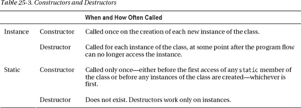

# 二十五、其他主题

*   [概述](#ch25-01)
*   [琴弦](#ch25-02)
*   [StringBuilder 类](#ch25-03)
*   [将字符串解析为数据值](#ch25-04)
*   [关于可空类型的更多信息](#ch25-05)
*   [方法主](#ch25-09)
*   [文档注释](#ch25-11)
*   [嵌套类型](#ch25-14)
*   [析构函数和处置模式](#ch25-17)
*   [与 COM 互操作](#ch25-20)

### 概述

在这一章中，我将讨论一些在使用 C# 时很重要但不适合其他章节的主题。这些包括字符串处理、可空类型、`Main`方法、文档注释和嵌套类型。

### 字符串

0 和 1 对于内部计算来说很好，但是对于人类可读的输入和输出，我们需要字符串。BCL 提供了许多使字符串处理变得容易的类。

C# 预定义类型`string`表示 .NET 类`System.String`。关于字符串，需要了解的最重要的事情如下:

> *   String is an array of Unicode characters.
> *   Strings are immutable-they cannot be changed.

`string`类型有许多有用的字符串操作成员，包括那些允许您确定它们的长度、改变它们的大小写、连接字符串以及执行许多其他有用任务的成员。表 25-1 显示了一些最有用的成员。

[表 25-1](#tab_25_1) 中许多方法的名字听起来好像它们在改变字符串对象。实际上，他们不是改变字符串，而是返回新的副本。对于一个`string`，任何“改变”都会分配一个新的不可变字符串。

例如，下面的代码声明并初始化一个名为`s`的`string`。第一个`WriteLine`语句调用`s`上的`ToUpper`方法，返回一个全大写的字符串副本。最后一行打印出`s`的值，显示它没有改变。

`   string s = "Hi there.";

   Console.WriteLine("{0}", s.ToUpper());         // Print uppercase copy
   Console.WriteLine("{0}", s);                   // String is unchanged`

该代码产生以下输出:

* * *

`HI THERE.
Hi there.`

* * *

在我自己的编码中，我发现表中列出的非常有用的方法之一是`Split`方法。它将一个`string`分割成一组子字符串，并以数组的形式返回它们。您向该方法传递一个分隔符数组，这些分隔符用于确定在何处拆分字符串，并且您可以指定它应该如何处理输出数组中的空元素。最初的`string`当然保持不变。

下面的代码展示了一个使用`Split`方法的例子。在本例中，分隔符集由空格字符和四个标点符号组成。

`   class Program
   {
      static void Main()
      {
         string s1 = "hi there! this, is: a string.";
         char[] delimiters = { ' ', '!', ',', ':', '.' };
         string[] words = s1.Split( delimiters, StringSplitOptions.RemoveEmptyEntries );
         Console.WriteLine( "Word Count: {0}\n\rThe Words...", words.Length );
         foreach ( string s in words )
            Console.WriteLine( "   {0}", s );
      }
   }`

该代码产生以下输出:

* * *

`Word Count: 6
The Words...
   hi
   there
   this
   is
   a
   string`

* * *

### StringBuilder 类

`StringBuilder`类帮助你动态有效地产生字符串，同时减少复制的数量。

> *   The `StringBuilder` class is a member of BCL, in the namespace `System.Text`.
> *   The `StringBuilder` object is a *variable* array of Unicode characters.

例如，下面的代码声明并初始化一个`StringBuilder`对象，并打印其结果字符串值。第四行通过替换内部字符数组的一部分来改变实际的对象。现在，当您通过隐式调用`ToString`打印其字符串值时，您可以看到，与`string`类型的对象不同，`StringBuilder`对象实际上发生了变化。

`   using System;
   using System.Text;

   class Program
   {
      static void Main()
      {
         StringBuilder sb = new StringBuilder( "Hi there." );
         Console.WriteLine( "{0}", sb.ToString() );              // Print string.

         sb.Replace( "Hi", "Hello" );                            // Replace a substring.
         Console.WriteLine( "{0}", sb.ToString() );              // Print changed string.
      }
   }`

该代码产生以下输出:

* * *

`Hi there.
Hello there.`

* * *

当基于给定的字符串创建一个`StringBuilder`对象时，该类分配一个比实际的当前字符串长度更长的缓冲区。只要对字符串所做的更改适合缓冲区，就不会分配新的内存。如果对字符串的更改需要比缓冲区中可用空间更多的空间，则会分配一个新的更大的缓冲区，并将字符复制到该缓冲区中。和原来的缓冲区一样，这个新的缓冲区也有额外的空间。

要获得与`StringBuilder`内容对应的`string`，只需调用它的`ToString`方法。

### 解析字符串为数据值

字符串是 Unicode 字符的数组。例如，字符串`"25.873"`有六个字符长，而*不是*是一个数字。虽然它看起来像一个数字，但你不能对它执行算术运算。“相加”两个字符串产生它们的连接。

> *   *Parsing* allows you to get a string whose *represents a value of* and convert it into an actual typed value.
> *   All predefined simple types have a static method named `Parse`, which takes a string representing a value and converts it into the actual value of the type.
> *   If the string cannot be parsed, the system throws an exception.

以下语句显示了使用`Parse`方法的语法示例。注意，`Parse`是`static`，所以您需要通过使用目标类型的名称来调用它。

`   double d1 = double.Parse("<ins>25.873</ins>");
                 ↑             ↑
             Target type         String to be converted`

以下代码显示了将两个字符串解析为类型为`double`的值，然后将它们相加的示例:

`   static void Main()
   {
      string s1 = "25.873";
      string s2 = "36.240";

      double d1 = double.Parse(s1);
      double d2 = double.Parse(s2);

      double total = d1 + d2;
      Console.WriteLine("Total:  {0}", total);
   }`

该代码产生以下输出:

* * *

`Total:  62.113`

* * *

 **注意**关于`Parse`的一个常见误解是，由于它对字符串进行操作，所以它被认为是`string`类的成员。不是的。`Parse`根本不是单一的方法，而是由*目标*类型实现的许多方法。

`Parse`方法的缺点是，如果它们不能成功地将字符串解析为目标类型，就会抛出异常。异常是开销很大的操作，如果可能的话，您应该尝试以编程方式避免它们。`TryParse`方法允许您这样做。关于`TryParse`需要知道的重要事情如下:

> *   Every built-in type with a `Parse` method also has a `TryParse` method.
> *   The `TryParse` method takes two parameters and returns a `bool`.
>     *   The first parameter is the string you want to parse.
>     *   The second is the `out` parameter that refers to the target type variable.
>     *   If `TryParse` is successful, the parsed value is assigned to `out` parameter, and `true` is returned. Otherwise, return to `false`.

一般来说，你应该使用`TryParse`而不是`Parse`来避免可能抛出的异常。下面的代码展示了使用`int.TryParse`方法的两个例子:

`   class Program
   {
      static void Main( )
      {
         string parseResultSummary;
         string stringFirst = "28";
         int intFirst;                 Input string       Output variable
                                         ↓              ↓       
         bool success = int.TryParse( stringFirst, out intFirst );

         parseResultSummary = success
                                 ? "was successfully parsed"
                                 : "was not successfully parsed";
         Console.WriteLine( "String {0} {1}", stringFirst, parseResultSummary );

         string stringSecond = "vt750";
         int intSecond;           Input string        Output variable
                                     ↓               ↓        
         success = int.TryParse( stringSecond, out intSecond );

         parseResultSummary = success
                                 ? "was successfully parsed"
                                 : "was not successfully parsed";
         Console.WriteLine( "String {0} {1}", stringSecond, parseResultSummary );
      }
   }`

该代码产生以下输出:

* * *

`String 28 was successfully parsed
String vt750 was not successfully parsed`

* * *

### 关于可空类型的更多信息

在第 3 章中，你可以快速了解可空类型。正如您所记得的，可空类型允许您创建一个可以标记为有效或无效的值类型变量，实际上允许您将值类型变量设置为“null”我想在《T2》第 3 章中介绍可空类型和其他内置类型，但是既然你对 C# 有了更多的了解，现在是时候介绍它们更复杂的方面了。

回顾一下，可空类型总是基于另一个已经声明的类型，称为底层类型。

> *   Nullable types can be created from any value type, including predefined simple types.
> *   Nullable types cannot be created from reference types or other nullable types. You didn't explicitly declare a nullable type in your code. Instead, you declare a nullable *variable. The compiler implicitly creates nullable types for you.*

要创建一个可空类型的变量，只需在变量声明中在基础类型名称的末尾添加一个问号。不幸的是，这种语法让你看起来对你的代码有很多疑问。(开个玩笑——不过有点丑。)

例如，下面的代码声明了一个可空的`int`类型的变量。注意后缀是附加在*类型*名称上的——而不是变量名。

`      Suffix
       ↓
     <ins>int?</ins> myNInt = 28;
      ↑   
   The name of the nullable type includes the suffix.`

有了这个声明语句，编译器负责生成可空类型和该类型的变量。图 25-1 显示了这种可空类型的结构。它包含以下内容:

> *   Bottom type
> *   Several important read-only properties of an instance of:
>     *   The attribute `HasValue` belongs to the type `bool` and indicates whether the value is valid or not.
>     *   The attribute `Value` is the same as the underlying type. If the variable is valid, it returns the value of the variable.

***图 25-1。**一个可空类型在一个结构中包含一个底层类型的对象，有两个只读属性。*

使用可空类型和使用任何其他类型的变量几乎是一样的。读取可空类型的变量会返回其值。但是，您必须确保变量不是`null`。试图读取`null`变量的值会产生异常。

> *   Like any variable, to retrieve its value, you only need to use its name.
> *   To check whether the nullable type has a value, you can compare it with `null` or check its `HasValue` attribute.

`   int? myInt1 = 15;
         Compare to null.
              ↓
   if ( myInt1 != null )
      Console.WriteLine("{0}", myInt1);
                                  ↑
                          Use variable name.`

* * *

`15`

* * *

您可以轻松地在可空类型和其对应的不可空类型之间进行转换。关于可空类型转换，您需要知道的重要事情如下:

> 在不可空类型和它的可空版本之间有一个*隐含的* t 转换。也就是说，不需要任何造型。*   There is a *explicit* transformation between the nullable type and its non-nullable version.T9】

例如，下面几行显示了两个方向的转换。在第一行中，类型为`int`的文字被隐式转换为类型为`int?`的值，并用于初始化可空类型的变量。在第二行中，变量被显式转换为不可为空的版本。

`   int? myInt1 = 15;                       // Implicitly convert int to int?
   int  regInt = (int) myInt1;             // Explicitly convert int? to int`

#### 赋给可空类型

可以为可空类型的变量分配三种值:

> *   A value of the underlying type.
> *   A value of the same nullable type.
> *   A value `null`

以下代码显示了三种类型赋值的示例:

`   int? myI1, myI2, myI3;

   myI1 = 28;                                   // Value of underlying type
   myI2 = myI1;                                 // Value of nullable type
   myI3 = null;                                 // null

   Console.WriteLine("myI1: {0}, myI2: {1}", myI1, myI2);`

该代码产生以下输出:

* * *

`myI1: 28, myI2: 28`

* * *

#### 零合并算子

标准的算术和比较运算符也处理可空类型。还有一个特殊的操作符叫做*零合并操作符*，它返回一个非空值给一个表达式，以防一个可空的类型变量是`null`。

null 合并运算符由两个连续的问号组成，有两个操作数。

> *   The first operand is a variable of nullable type.
> *   The second is the non-nullable value of the underlying type.
> *   If the calculation result of the first operand (nullable operand) is `null` at runtime, the nonnullable operand is returned as the result of the expression.

`                               Null coalescing operator
   int? myI4 = null;                  ↓
   Console.WriteLine("myI4: {0}", myI4 ?? -1);

   myI4 = 10;
   Console.WriteLine("myI4: {0}", myI4 ?? -1);`

该代码产生以下输出:

* * *

`myI4: -1
myI4: 10`

* * *

当比较同一可空类型的两个值并且都是`null`时，相等比较运算符(`==`和`!=`)认为它们相等。例如，在下面的代码中，两个可空的`int`被设置为`null`。相等比较运算符声明它们相等。

`   int? i1 = null, i2 = null;                       // Both are null.

   if (i1 == i2)                                    // Operator returns true.
      Console.WriteLine("Equal");`

该代码产生以下输出:

* * *

`Equal`

* * *

#### 使用可空的用户自定义类型

到目前为止，您已经看到了预定义的简单类型的可空形式。您还可以创建用户定义值类型的可空形式。这些带来了使用简单类型时不会出现的额外问题。

主要问题是对封装的基础类型成员的访问。可空类型不直接公开基础类型的任何成员。例如，看看下面的代码及其在[图 25-2](#fig_25_2) 中的表示。代码声明了一个名为`MyStruct`的`struct`(这是一个值类型)，带有两个`public`字段。

> *   Because the fields of `struct` are public, they can be easily accessed in any instance of this structure, as shown in the left figure.
> *   However, the nullable version of `struct` only exposes the underlying type through `Value` attribute, while *does not directly disclose any of its members* . Although members are common to `struct`, they are not common to nullable types, as shown on the right side of the figure.

`   struct MyStruct                                        // Declare a struct.
   {
      public int X;                                       // Field
      public int Y;                                       // Field
      public MyStruct(int xVal, int yVal)                 // Constructor
      { X = xVal;  Y = yVal; }
   }

   class Program {
      static void Main()
      {
         MyStruct? mSNull = new MyStruct(5, 10);
         ...` 

***图 25-2** 。结构成员的可访问性不同于可空类型的可访问性。*

例如，下面的代码使用了这个`struct`并创建了`struct`和相应的可空类型的变量。在第三和第四行代码中，直接读取了`struct`变量的值。在第五行和第六行中，它们必须从 nullable 的`Value`属性返回的值中读取。

`   MyStruct  mSStruct = new MyStruct(6, 11);      // Variable of struct
   MyStruct? mSNull   = new MyStruct(5, 10);      // Variable of nullable type
                                        Struct access
                                        <ins>    ↓    </ins>
   Console.WriteLine("mSStruct.X: {0}", mSStruct.X);
   Console.WriteLine("mSStruct.Y: {0}", mSStruct.Y);

   Console.WriteLine("mSNull.X: {0}",   mSNull.Value.X);
   Console.WriteLine("mSNull.Y: {0}",   <ins>mSNull.Value.Y</ins>);
                                               ↑
                                        Nullable type access`

##### 可空

可空类型是通过使用名为`System.Nullable<T>`的. NET 类型实现的，它使用 C# 泛型特性。C# 可空类型的问号语法只是创建类型为`Nullable<T>`的变量的快捷语法，其中`T`是底层类型。`Nullable<T>`获取底层类型，将其嵌入到一个结构中，并为该结构提供可空类型的属性、方法和构造函数。

您可以使用`Nullable<T>`的泛型语法或 C# 快捷语法。快捷语法更容易编写和理解，并且不容易出错。以下代码使用前面示例中声明的带有 struct `MyStruct`的`Nullable<T>`语法，创建一个名为`mSNull`的`Nullable<MyStruct>`类型的变量:

`   Nullable<MyStruct> mSNull = new Nullable<MyStruct>();`

以下代码使用问号语法，但在语义上等效于`Nullable<T>`语法:

`   MyStruct? mSNull = new MyStruct();`

### 法主

每个 C# 程序必须有一个入口点——一个必须被称为`Main`的方法。

在本文的示例代码中，我使用了一个没有参数也不返回值的版本`Main`。然而，有四种形式的`Main`可以作为程序的入口点。这些形式如下:

> *   `static void Main()               {...}`
> *   `static void Main( string[] args) {...}`
> *   `static int  Main()               {...}`
> *   `static int  Main( string[] args) {...}`

当程序终止时，前两种形式不向执行环境返回值。后两种形式返回一个`int`值。返回值(如果使用的话)通常用于报告程序的成功或失败，其中 0 通常用于指示成功。

第二种和第四种形式允许您在程序启动时从命令行向程序传递实际参数，也称为*参数*。命令行参数的一些重要特征如下:

> *   There can be zero or more command line arguments. Even if there is no parameter, the `args` parameter is not `null`. Instead, it is an array without elements.
> *   Independent variables are separated by spaces or tabs.
> *   Each parameter is interpreted by the program as a string, but you don't need to enclose it in quotation marks on the command line.

例如，以下名为`CommandLineArgs`的程序接受命令行参数，并打印出提供的每个参数:

`   class Program
   {
      static void Main(string[] args)
      {
         foreach (string s in args)
            Console.WriteLine(s);
      }
   }`

您可以从 Windows 的命令提示符程序中执行此程序。以下命令行使用五个参数执行程序`CommandLineArgs`:

`   <ins>CommandLineArgs</ins> <ins>Jon Peter Beth Julia Tammi</ins>
           ↑                 ↑
        Executable           Arguments
         Name`

这会产生以下输出:

* * *

`Jon
Peter
Beth
Julia
Tammi`

* * *

关于`Main`需要了解的其他重要事项如下:

> *   `Main` must always be declared as `static`.
> *   `Main` can be declared either in a class or in a structure.

一个程序只能包含四个可接受的入口点形式`Main`的一个声明。然而，您可以合法地声明其他名为`Main`的方法，只要它们没有四种入口点形式中的任何一种——但是这样做会引起混乱。

#### 主通道的可达性

`Main`可以声明为`public`或`private`:

> *   If `Main` is declared as `private`, other assemblies cannot be accessed, and only the operating system can start the program.
> *   If `Main` is declared as `public`, other assemblies can be executed.

然而，*操作系统总是*可以访问`Main`，而不管它声明的访问级别或者声明它的`class`或`struct`的访问级别。

默认情况下，当 Visual Studio 创建一个项目时，它会创建一个程序大纲，其中`Main`是隐式的`private`。如果你需要的话，你可以随时添加`public`修饰语。

### 文档注释

文档注释特性允许您以 XML 元素的形式包含程序的文档。我在第 19 章中介绍了 XML。Visual Studio 甚至会帮助您插入元素，并从源文件中读取它们，然后将它们复制到一个单独的 XML 文件中。

图 25-3 给出了使用 XML 注释的概述。这包括以下步骤:

> *   You can use Visual Studio to generate source files with embedded XML. Visual Studio can automatically insert most important XML elements.
> *   Visual Studio reads XML from the source code file and copies the XML code into a new file.
> *   Another program called document compiler can get XML files and generate various types of document files from it.

***图 25-3** 。XML 注释过程*

Visual Studio 的早期版本包含一个基本的文档编译器，但在 Visual Studio 2005 发布之前它已被移除。微软已经开发了一个新的文档编译器，叫做 Sandcastle .NET 框架文档。可以从`[http://sandcastle.codeplex.com](http://sandcastle.codeplex.com)`开始了解更多，免费下载。

#### 插入文档注释

文档注释以三个连续的正斜杠开始。

> *   The first two slashes indicate to the compiler that this is an end-of-line comment and should be ignored in program parsing.
> *   The third diagonal line indicates that this is a document comment.

例如，在下面的代码中，前四行显示了关于类声明的文档注释。他们使用了`
` XML 标签。在字段声明的上方是三行记录字段的代码—同样使用了`
`标签。

`   /// 
       ←  Open XML tag for the class.
   /// This is class MyClass, which does the following wonderful things, using
   /// the following algorithm. ... Besides those, it does these additional
   /// amazing things.
   /// 
      ←  Close XML tag.
   class MyClass                                    // Class declaration
   {
      /// 
    ←  Open XML tag for the field.
      /// Field1 is used to hold the value of ...
      /// 
   ←  Close XML tag.
      public int Field1 = 10;                       // Field declaration
      ...`

当您在语言功能(如类或类成员)的声明上方键入三个斜杠时，Visual Studio 会自动插入每个 XML 元素。

例如，以下代码显示了类`MyClass`声明上方的两条斜线:

`   //
   class MyClass
   { ...`

只要添加了第三个斜杠，Visual Studio 就会立即将注释扩展为下面的代码，而无需您做任何事情。然后，您可以在标记之间的文档注释行中键入任何内容。

`   /// 
        Automatically inserted
   ///                  Automatically inserted
   /// 
       Automatically inserted
   class MyClass
   { ...`

#### 使用其他 XML 标签

在前面的例子中，您看到了`summary` XML 标签的使用。C# 还可以识别许多其他的标签。表 25-2 列出了一些最重要的。

### 嵌套类型

类型通常直接在命名空间中声明。但是，您也可以在`class`或`struct`声明中声明类型。

> *   The type declared in another type declaration is called *nested type* . Like all type declarations, nested types are templates for type instances.
> *   The nested type is declared as a member of *surrounding *type* .
>     
>     *   The nesting type can be any type.
>     *   The closure type can be `class` or `struct`.*

例如，下面的代码显示了类`MyClass`，以及一个名为`MyCounter`的嵌套类。

`   class MyClass                       // Enclosing class
   {
      class MyCounter                  // Nested class
      {
         ...
      }
      ...
   }`

如果将一个类型声明为嵌套类型只是为了用作封闭类型的助手，那么这样做通常是有意义的。

不要被术语*嵌套*所迷惑。嵌套指的是*声明*的位置——而不是任何*实例*的内存位置。尽管嵌套类型的声明位于封闭类型的声明内部，但嵌套类型的对象不一定包含在封闭类型的对象中。嵌套类型的对象——如果创建了的话——位于内存中的任何位置，如果它们没有在另一个类型中声明的话。

例如，[图 25-4](#fig_25_4) 显示了`MyClass`和`MyCounter`类型的对象，如前面的代码所示。图中还显示了一个名为`Counter`的字段，在类`MyClass`中，它是对嵌套类的一个对象的引用，该对象位于堆中的其他地方。

***图 25-4** 。嵌套指的是声明的位置，而不是对象在内存中的位置。*

#### 嵌套类的例子

下面的代码将类`MyClass`和`MyCounter`充实成一个完整的程序。`MyCounter`实现一个整数计数器，从 0 开始，可以使用`++`操作符递增。当调用`MyClass`的构造函数时，它会创建嵌套类的一个实例，并将引用分配给该字段。[图 25-5](#fig_25_5) 说明了代码中对象的结构。

`   class MyClass
   {
      class MyCounter                                        // Nested class
      {
         public int Count { get; private set; }

         public static MyCounter operator ++( MyCounter current )
         {
            current.Count++;
            return current;
         }
      }

      private MyCounter counter;                             // Field of nested class type

      public MyClass() { counter = new MyCounter(); }        // Constructor

      public int Incr() { return ( counter++ ).Count; }      // Increment method.
      public int GetValue() { return counter.Count; }        // Get counter value.
   }

   class Program
   {
      static void Main()
      {
         MyClass mc = new MyClass();                         // Create object.

         mc.Incr(); mc.Incr();  mc.Incr();                   // Increment it.
         mc.Incr(); mc.Incr();  mc.Incr();                   // Increment it.

         Console.WriteLine( "Total:  {0}", mc.GetValue() );  // Print its value.
      }
   }`

该代码产生以下输出:

* * *

`Total:  6`

* * *

***图 25-5** 。嵌套类及其封闭类的对象*

#### 可见性和嵌套类型

在[第 7 章](07.html#ch7)中，你学习了类和一般类型可以有`public`或`internal`的访问级别。然而，嵌套类型是不同的，因为它们有*成员可访问性*而不是*类型可访问性*。因此，以下内容适用于嵌套类型:

> *   Nested types declared in a class can have any one of five accessibility levels of class members, which are `public`, `protected`, `private`, `internal` or `protected internal`.
> *   Nested types declared inside a structure can have any one of three accessibility levels of structure members `public`, `internal` or `private`.

在这两种情况下，嵌套类型的默认访问级别是`private`，这意味着在封闭类型之外看不到它。

封闭类和嵌套类的成员之间的关系不那么简单，如图 25-6 中的[所示。嵌套类型可以完全访问封闭类型的成员，而不管它们声明的可访问性如何，包括成员`private`和`protected`。](#fig_25_6)

然而，这种关系是不对称的。尽管封闭类型的成员总是可以看到嵌套类型声明并创建其变量和实例，但他们没有对嵌套类型成员的完全访问权。相反，它们的访问仅限于嵌套类成员的声明访问，就像嵌套类型是一个单独的类型一样。也就是说，他们可以访问`public`和`internal`成员，但不能访问嵌套类型的`private`或`protected`成员。

***图 25-6** 。嵌套类型成员和封闭类型成员之间的可访问性*

您可以将这种关系总结如下:

> *   Members of nested types always have full access to members of closed types.
> *   A closed type
>     *   Members of can always access the nested type itself.
>     *   Only *declared the nested type*
> 
> 成员的访问权限

嵌套类型的可见性也会影响基成员的继承。如果封闭类是派生类，嵌套类型可以隐藏同名的基类成员。和往常一样，在嵌套类的声明中使用`new`修饰符来使隐藏显式。

嵌套类型中的`this`引用是指嵌套类型的*对象——而不是封闭类型的对象。如果嵌套类型的对象需要访问封闭类型，它必须有一个对它的引用。您可以通过让封闭对象将它的`this`引用作为参数提供给嵌套类型的构造函数来授予它这种访问权限，如下面的代码所示:*

`   class SomeClass                         // Enclosing class
   {
      int Field1 = 15, Field2 = 20;        // Fields of enclosing class
      MyNested mn = null;                  // Reference to nested class

      public void PrintMyMembers()
      {
         mn.PrintOuterMembers();           // Call method in nested class.
      }

      public SomeClass()                   // Constructor
      {
         mn = new MyNested(this);          // Create instance of nested class.
      }                     ↑
                       Pass in the reference to the enclosing class.
      class MyNested                       // Nested class declaration
      {
         SomeClass sc = null;              // Reference to enclosing class

         public MyNested(SomeClass SC)     // Constructor of the nested class
         {
            sc = SC;                       // Store reference to enclosing class.
         }

         public void PrintOuterMembers()
         {
            Console.WriteLine("Field1: {0}", sc.Field1);   // Enclosing field
            Console.WriteLine("Field2: {0}", sc.Field2);   // Enclosing field
         }
      }                                    // End of nested class
   }

   class Program
   {
      static void Main( ) {
         SomeClass MySC = new SomeClass();
         MySC.PrintMyMembers();
      }
   }`

该代码产生以下输出:

* * *

`Field1: 15
Field2: 20`

* * *

### 析构函数和 Dispose 模式

在第 6 章中，我们看了构造函数，它创建并设置了一个使用的类对象。一个类还可以有一个*析构函数*，它可以在一个类的实例不再被引用后执行清理或释放非托管资源所需的操作。非托管资源是指使用 Win32 API 获得的文件句柄或非托管内存块。这些东西不是你用就能得到的 .NET 资源，所以如果您坚持使用 .NET 类，你不太可能必须写很多析构函数。

关于析构函数，需要知道的重要事情如下:

> 每个类只能有一个析构函数。*   A constructor cannot have parameters.*   A destructor cannot have an accessibility modifier.*   The destructor has the same name as the class, but it is preceded by a tilduh character (pronounced TIL-duh).*   The destructor only acts on the instance of the class; Therefore, there is no static destructor.*   *Destructor cannot be explicitly called in code* . On the contrary, in the process of garbage collection, when the garbage collector analyzes your code and determines that there are no more paths in the code that may refer to the object, the system will call it.T15】

例如，以下代码说明了名为`Class1`的类的析构函数的语法:

`   Class1
   {
      ~Class1()                   // The destructor
      {
         *CleanupCode*
      }
      ...
   }`

使用析构函数的一些重要准则如下:

> *   Don't implement destructors if you don't need them. They can be very expensive in terms of performance.
> *   The destructor should only release the external resources owned by the object.
> *   The destructor should not access other objects, because you can't assume that those objects have not been destructed.

 **注**在 3.0 版本发布之前，析构函数有时被称为*终结器*。你有时可能仍然会在文献和 .NET API 方法名。

#### 标准处置模式

与 C++析构函数不同，当实例超出范围时，不会立即调用 C# 析构函数。事实上，没有办法知道析构函数何时会被调用。此外，如前所述，您不能显式调用析构函数。你所知道的是，在对象从托管堆中移除之前，系统会在某个时候调用它。

如果您的代码包含需要尽快释放的非托管资源，您不应该将该任务留给析构函数，因为不能保证析构函数会很快运行。相反，您应该采用所谓的*标准处置模式*。

标准处置模式包括以下特征:

> *   Classes with unmanaged resources should implement the `IDisposable` interface, which consists of a method named `Dispose`. `Dispose` Contains the cleanup code for releasing resources.
> *   When your code runs out of resources and you want to release them, your program code should call the `Dispose` method. Note that `Dispose` is called by *your code* , not the system. Your class should also implement a destructor that calls the `Dispose` method in case `Dispose` has not been called before.

这可能有点混乱，所以让我总结一下模式。您希望将所有清理代码放在一个名为`Dispose`的方法中，当您的代码处理完资源时会调用该方法。作为备份，万一没有调用`Dispose`，你的类析构函数应该调用`Dispose`。另一方面，如果调用了`Dispose`*，那么你要告诉垃圾收集器不要调用析构函数，因为清理已经由`Dispose`处理了。*

 *你的析构函数和`Dispose`代码应该遵循以下准则:

> *   Write the logic of your destructor and `Dispose` method, so that if your code cannot call `Dispose` for some reason, your destructor will call it, thus releasing resources.
> *   At the end of the `Dispose` method, it should be a call to the `GC.SuppressFinalize` method, which tells CLR not to call the destructor of this object, because the cleaning has been completed.
> *   Implement the code in `Dispose` so that it is safe for the method to be called many times. That is to say, if it is written in this way, if it has been called, then any subsequent calls will not do any extra work and will not throw an exception.

下面的代码显示了标准的 dispose 模式，如图 25-7 所示。关于代码的重要内容如下:

> *   `Dispose` method has two overloads: `public` method and `protected` method. `protected` Overload is an overload that contains actual cleanup code.
> *   The `public` version is the version that you will explicitly call from your code to perform cleanup. In turn, it calls the `protected` version.
> *   The destructor calls `protected` version.
> *   The `bool` parameter of the protected version allows the method to know where it was called-destructor or elsewhere in the code. This is very important for it, because according to what it is, it will do something slightly different. You can find the details in the code below.

***图 25-7** 。标准处置模式*

#### 比较构造函数和析构函数

表 25-3 提供了构造函数和析构函数被调用的总结和比较。

### 与 COM 互操作

虽然本文没有涉及 COM 编程，但是 C# 4.0 有几个语言特性可以使 COM 编程变得更容易。其中之一是*省略引用*特性，当你不需要使用方法传回的值时，它允许你调用一个 COM 方法而不使用`ref`关键字。

例如，如果运行程序的计算机上安装了 Microsoft Word，则可以在自己的程序中使用 Word 的拼写检查功能。您将使用的方法是在`Document`类上的`CheckSpelling`方法，它在`Microsoft.Office.Tools.Word`名称空间中。这个方法有 12 个参数，都是`ref`参数。如果没有这个特性，您必须为每个参数提供引用变量，即使您不需要使用它们将数据传递给方法或从方法接收数据。省略`ref`关键字*仅适用于 COM 方法*——对于其他任何方法，您仍然会得到一个编译错误。

这段代码可能类似于下面所示的代码。请注意以下关于此代码的内容:

> *   The call on the fourth line only uses the second and third parameters, both of which are Boolean values. However, since this method requires `ref` parameter, you must create two variables `ignoreCase` and `alwaysSuggest` of type `object` to save these values.
> *   The third line creates a variable `optional` of type `object` for the other ten parameters.

`   object ignoreCase    = true;
   object alwaysSuggest = false;             Objects to hold Boolean variables
   object optional      = Missing.Value; <ins>      ↓     </ins>  <ins>       ↓          </ins>
   tempDoc.CheckSpelling( ref optional,  ref ignoreCase, ref alwaysSuggest,
       ref optional, ref optional, ref optional, ref optional, ref optional,
       ref optional, ref optional, ref optional, ref optional );`

有了省略引用特性，我们可以很好地解决这个问题，因为我们不必对那些不需要输出的参数使用`ref`关键字，我们可以对我们关心的两个参数使用内联`bool` s。简化的代码如下所示:

`                                      bool  bool
   object optional = Missing.Value;   ↓    ↓
   tempDoc.CheckSpelling( optional, true, false,
       optional, optional, optional, optional,
       optional, optional, optional, optional, optional );`

但是我们也可以使用可选参数特性。同时使用这两个特性(省略 ref 和可选参数)会使最终表单比原始表单简单得多:

`   tempDoc.CheckSpelling( Missing.Value, true, false );`

下面的代码在一个完整的程序中包含了这个方法。要编译这段代码，您需要在您的计算机上安装 Visual Studio Tools for Office(VSTO ),并且您必须在项目中添加对`Microsoft.Office.Interop.Word`程序集的引用。要运行编译后的代码，还必须在计算机上安装 Microsoft Word。

`   using System;
   using System.Reflection;
   using Microsoft.Office.Interop.Word;

   class Program
   {
      static void Main()
      {
         Console.WriteLine( "Enter a string to spell-check:" );
         string stringToSpellCheck = Console.ReadLine();

         string spellingResults;
         int errors = 0;
         if ( stringToSpellCheck.Length == 0 )
            spellingResults = "No string to check";
         else
         {
            Microsoft.Office.Interop.Word.Application app =
                        new Microsoft.Office.Interop.Word.Application();

            Console.WriteLine( "\nChecking the string for misspellings ..." );
            app.Visible = false;

            Microsoft.Office.Interop.Word._Document tempDoc = app.Documents.Add( );

            tempDoc.Words.First.InsertBefore( stringToSpellCheck );
            Microsoft.Office.Interop.Word.ProofreadingErrors
                                    spellErrorsColl = tempDoc.SpellingErrors;
            errors = spellErrorsColl.Count;

            //1.  Without using optional parameters
            //object ignoreCase    = true;
            //object alwaysSuggest = false;
            //object optional      = Missing.Value;
            //tempDoc.CheckSpelling( ref optional, ref ignoreCase, ref alwaysSuggest,
            //    ref optional, ref optional, ref optional, ref optional, ref optional,
            //    ref optional, ref optional, ref optional, ref optional );

            //2\. Using the "omit ref" feature
            object optional = Missing.Value;
            tempDoc.CheckSpelling( optional, true, false, optional, optional, optional,
                            optional, optional, optional, optional, optional, optional );

                                                                                    
            //3\. Using "omit ref" and optional parameters
            //tempDoc.CheckSpelling( Missing.Value, true, false );

            app.Quit(false);
            spellingResults = errors + " errors found";
         }

         Console.WriteLine( spellingResults );
         Console.WriteLine( "\nPress <Enter> to exit program." );
         Console.ReadLine();
      }
   }`

当您运行这段代码时，它会产生如图 25-8 中[所示的控制台窗口，要求您输入想要通过拼写检查器运行的字符串。当它收到字符串时，它打开 Word 并对其运行拼写检查。这时，你会看到 Word 的拼写检查窗口出现，如图](#fig_25_8)[图 25-9](#fig_25_9) 所示。

***图 25-8。**要求将字符串发送到 Word 拼写检查器的控制台窗口*

***图 25-9。** Word 的拼写检查器使用控制台程序的 COM 调用创建**