# 二、积木：类和对象

## 班级

一个类就是一个蓝图或者一个模板。它可以描述其对象的行为。它是如何构建或实例化对象的基础。

## 目标

对象是一个类的实例。

面向对象编程(OOP)技术主要依赖于这两个概念——类和对象。通过一个类，我们创建了一个新的数据类型，对象被用来保存数据(字段)和方法。对象行为可以通过这些方法公开。

如果你熟悉足球(或英式足球，在美国众所周知)，我们知道参加比赛的球员是根据他们在不同位置的技能挑选出来的。除了这些技能，他们还需要具备最低水平的比赛体能和一般运动能力。所以，如果我们说 c 罗是足球运动员(又名英式足球运动员)，我们可以预测 c 罗拥有这些基本能力以及一些足球特有的技能(尽管 c 罗对我们来说是未知的)。所以，我们可以简单地说，罗纳尔多是一个足球运动员阶层的对象。

Note

尽管如此，你可能会觉得这是一个先有鸡还是先有蛋的困境。你可以争辩说，如果我们说，“X 先生踢得像 c 罗”，那么在这种情况下，c 罗的表现就像一个阶级。然而，在面向对象的设计中，我们通过决定谁先来使事情变得简单，我们将那个人标记为应用中的类。

现在考虑另一个足球运动员，贝克汉姆。我们可以再次预测，如果贝克汉姆是足球运动员，那么贝克汉姆一定在足球的很多方面都很优秀。此外，他必须具备参加比赛的最低健康水平。

现在假设罗纳尔多和贝克汉姆都参加了同一场比赛。不难预测，虽然 c 罗和贝克汉姆都是足球运动员，但在那场比赛中，他们的踢球风格和表现会有所不同。同样，在面向对象编程的世界中，对象的性能可以彼此不同，即使它们属于同一个类。

我们可以考虑任何不同的领域。现在你可以预测你的宠物狗或宠物猫可以被认为是动物类的对象。你最喜欢的车可以被认为是一个车辆类的对象。你喜欢的小说可以考虑作为一个书类的对象，等等。

简而言之，在现实世界的场景中，每个对象都必须有两个基本特征:状态和行为。如果我们考虑足球运动员类的对象—罗纳尔多或贝克汉姆，我们会注意到他们有“比赛状态”或“非比赛状态”这样的状态在玩耍状态下，他们可以表现出不同的行为——他们可以跑，他们可以踢，等等。

在非玩耍状态下，它们的行为也会发生变化。在这种状态下，他们可以小睡一会儿，或者吃饭，或者只是通过看书、看电影等活动放松一下。

同样，我们可以说，在任何特定的时刻，我们家里的电视可以处于“开”或“关”的状态。当且仅当它处于开启模式时，它可以显示不同的频道。如果处于关闭模式，它将不会显示任何内容。

因此，从面向对象编程开始，我们总是建议您问自己这样的问题:

*   我的对象可能有哪些状态？
*   在这些状态下，它们可以执行哪些不同的功能(行为)？

一旦你得到了这些问题的答案，你就可以开始下一步了。这是因为任何面向对象程序中的软件对象都遵循相同的模式:它们的状态存储在字段/变量中，它们的能力/行为通过不同的方法/函数来描述。

现在让我们开始编程吧。要创建对象，我们需要首先决定它们将属于哪个类；也就是说，一般来说，如果我们要创建对象，首先需要创建一个类。

Note

有一些例外情况(如系统中的`ExpandoObject`类。动态名称空间)。它可以表示一个对象，其成员可以在运行时添加或删除。但是你才刚刚开始类和对象的旅程。让我们把事情变得非常简单。此刻我们可以忽略那些边角案例。

Points to Remember

一般来说，如果我们想使用对象，我们需要先有一个类。

假设我们已经创建了一个类，并将这个类的名称指定为 A。现在我们可以使用下面的语句创建一个类 A 的对象`obA`:

```cs
A obA=new A();

```

前一行可以分解为以下两行:

```cs
A obA;//Line-1

obA=new A();//Line-2

```

在第 1 行的末尾，`obA`是一个引用。在此之前，没有分配任何内存。但是一旦新的出现，内存就被分配了。

如果您仔细观察，您会发现在第二行中，类名后面跟了一个括号。我们用它来构造物体。这些是用于运行初始化代码的构造函数。构造函数可以有不同的实参(也就是说，它们可以随不同数量的形参或不同类型的形参而变化)。

在下面的例子中，类 A 有四个不同的构造函数。

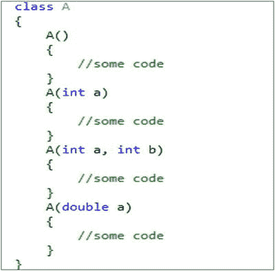

但是如果我们没有为我们的类提供任何构造函数，C# 将提供一个默认的。

Points to Remember

如果我们没有为我们的类提供任何构造函数，C# 将为你提供一个默认的无参数公共构造函数。但是如果你提供了任何构造函数，那么编译器不会为你生成默认的构造函数。

因此，当我们看到如下内容时，我们确信使用了无参数的构造函数。

```cs
A obA=new A();

```

但是要知道它是用户自定义的构造函数还是 C# 提供的(换句话说，默认的构造函数)，我们需要考察类体；例如，如果在一个类定义中，我们编写了如下代码。

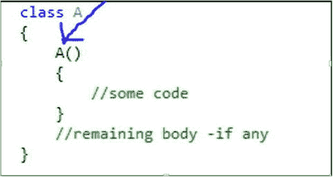

我们可以得出结论，这里我们使用了用户定义的无参数构造函数。因此，在这种情况下，C# 编译器不会为我们生成任何默认的构造函数。

## 课堂演示

如果您已经达到了这一点，这意味着您可以猜到类只是我们程序的积木。我们将变量(称为字段)和方法封装在一个类中，形成一个单元。这些变量被称为实例变量(静态变量将在本书的后面部分讨论)，因为该类的每个对象(即该类的每个实例)都包含这些变量的副本。(稍后，您将了解到字段可以是任何隐式数据类型、不同的类对象、枚举、结构、委托等。).另一方面，方法包含一组代码。这些只是一系列执行特定操作的语句。实例变量通常通过方法来访问。这些变量和方法统称为类成员。

Points to Remember

*   根据 C# 语言规范，除了字段和方法之外，一个类还可以包含许多其他东西——常量、事件、运算符、构造函数、析构函数、索引器、属性和嵌套类型。但是为了简单起见，我们从最常见的方法和字段开始。我将在本书后面的章节中讨论其他主题。
*   字段和方法可以与不同种类的修饰符相关联。
    *   字段修饰符可以是它们中的任何一种—静态、公共、私有、受保护、内部、新、不安全、只读和易变。
    *   方法修饰符可以是以下任意一种:静态、公共、私有、受保护、内部、新、虚拟抽象重写或异步。

其中大部分将在接下来的章节中介绍。

考虑一个简单的例子。现在我们已经创建了一个名为 ClassEx1 的类，并且只封装了一个整型字段 MyInt。我们还在该字段中初始化了值 25。因此，我们可以预测，每当我们创建这个类的对象时，该对象中都会有一个名为 myInt 的整数，对应的值将是 25。

为了便于参考，我们已经创建了两个对象— `obA`和`obB from o`ur classes 1 class。我们已经测试了对象中变量 MyInt 的值。你可以看到在这两种情况下，我们得到的值都是 25。

## 演示 1

```cs
using System;

namespace ClassEx1
{
    class ClassEx1
    {
        //Field initialization is optional.
        public int MyInt = 25;
        //public int MyInt;
    }
    class Program
    {
        static void Main(string[] args)
        {
            Console.WriteLine("*** A class demo with 2 objects ***");
            ClassEx1 obA = new ClassEx1();
            ClassEx1 obB = new ClassEx1();
            Console.WriteLine("obA.i ={0}", obA.MyInt);
            Console.WriteLine("obB.i ={0}", obB.MyInt);
            Console.ReadKey();
        }
    }
}

```

### 输出

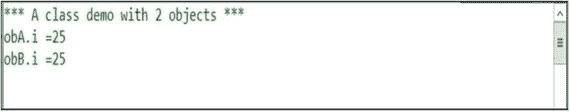

### 附加注释

*   没有必要以这种方式初始化 MyInt。我们才刚刚开始。我们从一个非常简单的例子开始。换句话说，字段初始化是可选的。
*   如果您没有为您的字段提供任何初始化，它将采用一些默认值。我们将很快介绍这些默认值。
*   Suppose that in the preceding example, you did not initialize the field. Then your class will look like this:

    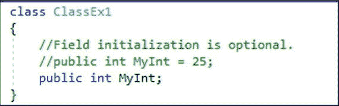

    Still, you can instantiate your object and then supply your intended value like this:

    ```cs
    ClassEx1 obA = new ClassEx1();
    obA.MyInt = 25;//setting 25 into MyInt of obA

    ```

如果你熟悉 Java，要在控制台打印，你可能会喜欢这种格式。C# 也允许这样做。

```cs
Console.WriteLine("obA.i =" + obA.MyInt);
Console.WriteLine("obB.i =" + obB.MyInt);

```

学生问:

先生，请告诉我们更多关于构造函数的信息。

老师说:我们必须记住这些要点:

*   构造函数用于初始化对象。
*   类名和相应的构造函数名必须相同。
*   它们没有任何返回类型。
*   我们可以说有两种类型的构造函数:无参数构造函数(有时称为无参数构造函数或默认构造函数)和有参数构造函数(称为参数化构造函数)。按照 C# 的说法，我们是在创建自己的无参数构造函数，还是由 C# 编译器创建，这都无关紧要。在这两种情况下，我们通常称之为默认构造函数。或者我们也可以根据构造函数是静态构造函数还是非静态构造函数(或者实例构造函数)来区分构造函数。你将熟悉本章中的实例构造函数。实例构造函数用于初始化类的实例(对象)，而静态构造函数用于在类第一次出现时初始化类本身。我在另一章讨论了“静态”。
*   一般来说，常见的任务，如类中所有变量的初始化，都是通过构造函数来实现的。

学生问:

先生，构造函数没有任何返回类型。这个语句的意思是他们的返回类型是 void 吗？

老师说:不。隐式地，构造函数的返回类型和它的类类型是一样的。我们不应该忘记，即使是 void 也被认为是一个返回类型。

学生问:

先生，我们对使用用户定义的无参数构造函数和 C# 提供的默认构造函数有点困惑。两者看起来是一样的。两者有什么关键区别吗？

老师说:我已经提到过，用 C# 的说法，我们是否创建了自己的无参数构造函数或者它是否是由 C# 编译器创建的并不重要。在这两种情况下，我们通常称之为默认构造函数。有时两者可能看起来一样。但是请记住，使用用户定义的构造函数，我们可以有一定的灵活性。我们可以把自己的逻辑和一些额外的控制对象的创建。

考虑下面的例子并分析输出。

## 演示 2

```cs
using System;

namespace DefaultConstructorCaseStudy
{

    class DefConsDemo
    {
        public int myInt;
        public float myFloat;
        public double myDouble;
        public DefConsDemo()
        {
            Console.WriteLine("I am initializing with my own choice");
            myInt = 10;
            myFloat = 0.123456F;
            myDouble = 9.8765432;
        }
    }
    class Program
    {
        static void Main(string[] args)
        {
            Console.WriteLine("***Comparison between user-defined and  C# provided default constructors***\n");
            DefConsDemo ObDef = new DefConsDemo();
            Console.WriteLine("myInt={0}", ObDef.myInt);
            Console.WriteLine("myFloat={0}", ObDef.myFloat.ToString("0.0####"));
            Console.WriteLine("myDouble={0}", ObDef.myDouble);
            Console.Read();
        }
    }
}

```

### 输出


### 分析

您可以看到，在我们为变量设置值之前，我们已经打印了一行附加的内容，“我正在用我自己的选择进行初始化。”

但是，如果您只是不提供这个无参数的构造函数，而想使用 C# 提供的默认构造函数，您将得到下一节中显示的输出。

### 附加注释

要查看下面的输出，您需要注释掉或移除前面示例中的构造函数定义。现在您可以看到，这些值中的每一个都用该类型的相应默认值进行了初始化。

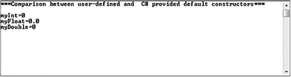

你必须记住另一个关键点。我们可以为用户定义的构造函数使用我们自己的访问修饰符。因此，如果您提供自己的无参数构造函数，您可以使它不是公共的。

让我们看看 C# 语言规范告诉了我们什么。

如果一个类不包含实例构造函数声明，则自动提供一个默认的实例构造函数。默认构造函数只是调用直接基类的无参数构造函数。如果类是抽象的，那么默认构造函数的声明的可访问性是受保护的；否则，默认构造函数声明的可访问性是公共的。因此，默认构造函数始终采用以下形式:

```cs
protected C(): base() {}

```

或者

```cs
public C(): base() {}

```

`C`是类的名称。如果重载决策无法确定基类构造函数初始值设定项的唯一最佳候选项，则会发生编译时错误。

很快，您将熟悉这些新术语:访问修饰符、重载和基。所以，不要惊慌。你可以学习这些概念，然后再来回答这一部分。

所以，简单来说，下面的声明

```cs
class A
    {
        int myInt;
    }

```

相当于这样:

```cs
class A
    {
        int myInt;
        public A():base()
        { }
    }

```

学生问:

先生，我们看到 C# 提供的默认构造函数正在用一些默认值初始化实例变量。其他类型的默认值是什么？

老师说:你可以参考下表供你参考。

<colgroup><col align="left"> <col align="left"></colgroup> 
| 类型 | 默认值 |
| :-- | :-- |
| sbyte，byte，short，ushort，int，uint，long，ulong | Zero |
| 茶 | \x0000 ' |
| 漂浮物 | 0.0f |
| 两倍 | 0.0d |
| 小数 | 0.0 米 |
| 弯曲件 | 错误的 |
| 结构体 | 将所有值类型设置为默认值，将所有引用类型设置为 null* |
| 枚举 E | 0(转换为类型 E) |

*We will discuss value types and reference types in detail later in the book.

学生问:

先生，我们似乎可以调用一些方法来初始化这些变量。那我们为什么选择构造函数呢？

老师说:如果你从那个角度考虑，那么你必须同意，要做那个工作，你需要显式地调用方法；也就是说，用简单语言来说，呼叫不是自动的。但是对于构造函数，我们在每次创建对象时都执行自动初始化。

学生问:

先生，字段初始化和通过构造函数初始化哪个先发生？

老师说:字段初始化首先发生。这个初始化过程遵循声明顺序。

### 恶作剧

你能预测产量吗？

```cs
using System;
namespace ConsEx2
{
    class ConsEx2
    {
        int i;
        public ConsEx2(int i)
        {
            this.i = i;
        }
    }
   class Program
    {
        static void Main(string[] args)
        {
            Console.WriteLine("***Experiment with constructor***");
            ConsEx2 ob2 = new ConsEx2();
        }
    }
}

```

### 输出

编译错误:“ConsEx2”不包含采用 0 个参数的构造函数。

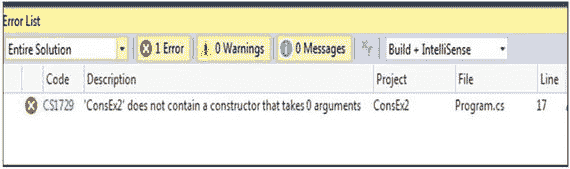

### 说明

参见下面的问答。我们还将很快讨论关键字“this”。

学生问:

先生，在这种情况下，我们应该有一个来自 C# 的默认构造函数。那为什么编译器会抱怨一个 0 参数的构造函数呢？

老师说:我已经提到过，在 C# 中，当且仅当我们不提供任何构造函数时，我们可以得到一个默认的 0 参数构造函数。但是，在这个例子中，我们已经有了一个参数化的构造函数。所以，在这种情况下，编译器不会为我们提供默认的 0 参数构造函数。

因此，如果您想删除这个编译错误，您有以下选择:

*   您可以像这样定义一个自定义构造函数:

    ```cs
    public ConsEx2() { }

    ```

*   您可以从该程序中移除自定义构造函数声明(您已经定义但尚未使用)。
*   您可以在您的`Main()`方法中提供必要的整数参数，如下所示:

    ```cs
    ConsEx2 ob2 = new ConsEx2(25);

    ```

学生问:

先生，我们能说那个类是自定义类型吗？

老师说:是的。

学生问:

先生，你能解释一下参考的概念吗？

老师说:是的。当我们写`ClassA obA=new ClassA()`；ClassA 的一个实例将在内存中诞生，它创建一个对该实例的引用并将结果存储在`obA`变量中。所以，我们可以说内存中的对象被一个叫做“引用”的标识符引用。

稍后，当你进一步了解内存管理时，你会看到在 C# 中，我们主要使用两种类型的数据——值类型和引用类型。值类型存储在堆栈中，引用类型存储在堆中。因为对象是引用类型，所以它们存储在堆中。但是重要的是引用本身存储在一个堆栈中。所以，当我们写作时

```cs
ClassA obA=new Class A();

```

你可以想象如下:

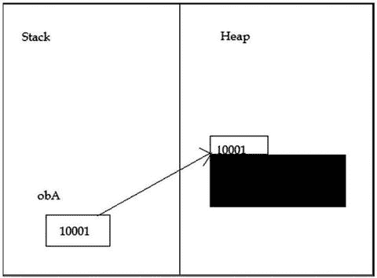

我们假设对象存储在堆地址 10001 中，obA 在堆栈中保存着这个线索。

学生问:

先生，为什么我们同时使用堆栈和堆？

老师说:这一级最简单的答案是，当引用变量超出范围时，它将从堆栈中删除，但实际数据仍然存在于堆中，直到程序终止或垃圾收集器清除该内存。因此，我们可以控制特定数据的生命周期。

学生问:

先生，那么引用基本上是用来指向一个地址的。这是正确的吗？

老师说:是的。

学生问:

先生，那么引用就类似于 C/C++中的指针。这是正确的吗？

老师说:引用似乎是一种特殊的指针。但是我们必须注意这两者之间的关键区别。通过指针，我们可以指向任何地址(基本上，它是内存中的一个数字槽)。因此，很有可能使用指针，我们可以指向一个无效的地址，然后我们可能会在运行时遇到不想要的结果。但是引用类型将总是指向有效的地址(在托管堆中),或者它们将指向 null。

很快，我们将学习 C# 中的一个关键概念。它被称为垃圾收集机制，用于回收内存。垃圾收集器不知道这些指针。因此，在 C# 中，指针不允许指向引用。稍后，您还将了解到，如果一个结构(在 C# 中称为 struct)包含一个引用，则指针类型不允许指向该结构。

为了简单起见，您可以记住，在 C# 中，指针类型只在“不安全”的上下文中出现。我将在本书的后面讨论这种“不安全”的环境。

学生问:

先生，我们如何检查引用变量是否指向 null？

老师说:下面的简单检查可以满足你的需要。为了便于参考，我可以在前面的程序中添加这几行代码。

```cs
     ......
ConsEx2 ob2 = new ConsEx2(25);
if (ob2 == null)
 {
  Console.WriteLine("ob2 is  null");
 }
else
{
 Console.WriteLine("ob2 is  NOT null");
}
    .....

```

学生问:

先生，多个变量可以引用内存中的同一个对象吗？

老师说:是的。以下类型的声明非常好:

```cs
ConsEx2 ob2 = new ConsEx2(25);
ConsEx2 ob1=ob2;

```

## 演示 3

在下面的例子中，我们创建了同一个类的两个对象，但是实例变量(`i`)用不同的值初始化。为了完成这项工作，我们使用了一个可以接受一个整数参数的参数化构造函数。

```cs
using System;

namespace ClassEx2
{
    class ClassA
    {
        public int i;
        public ClassA(int i)
        {
            this.i = i;
        }
    }

    class Program
    {
        static void Main(string[] args)
        {
            Console.WriteLine("*** A class demo with 2 objects ***");
            ClassA obA = new ClassA(10);
            ClassA obB = new ClassA(20);
            Console.WriteLine("obA.i =" + obA.i);
            Console.WriteLine("obB.i =" + obB.i);
            Console.ReadKey();
        }
    }
}

```

### 输出

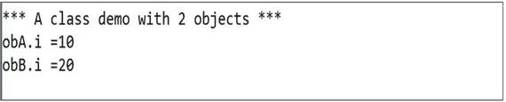

### 说明

学生问:

先生，这是什么目的？

老师说:好问题。有时我们需要引用当前对象，为此，我们使用“this”关键字。在前面的例子中，不使用“this”关键字，我们也可以编写类似下面的代码来达到相同的结果。

```cs
class ClassA
{
        int i;//instance variable
        ClassA(int myInteger)//myInteger is a local variable here
        {
          i=myInteger;
        }
}

```

你熟悉像`a=25`这样的代码；这里我们给 a 赋值 25。但是你熟悉像`25=a;`这样的代码吗？不。编译器会引发一个问题。

在前面的例子中，`myInteger`是我们的局部变量(在方法、块或构造函数中可见)，而`i`是我们的实例变量(在类中声明，但在方法、块或构造函数之外)。

所以，代替 myInteger，如果我们使用 I，我们需要告诉编译器我们的赋值方向。不应该混淆“哪个值被分配到哪里”这里我们将局部变量的值赋给实例变量，编译器应该清楚地理解我们的意图。有了`this.i=i;`，编译器会清楚地明白，应该用局部变量 I 的值来初始化实例变量 I。

我也可以从另一个角度来解释这个场景。假设，在前面的场景中，您错误地编写了类似 i=i 的内容。那么从编译器的角度来看就会出现混乱。因为在那种情况下，它看到你在处理两个相同的局部变量。(虽然你的本意不同，你的意思是左边的 I 是字段，另一个是方法参数)。现在，如果你为 ClassA 创建一个对象，`obA`,试着看看`obA.i`的值，代码如下:

```cs
ClassA obA = new ClassA(20);
Console.WriteLine("obA.i =" + obA.i);

```

您将得到 0(整数的默认值)。所以，你的实例变量不能得到你想要的值，20。在这种情况下，我们的 Visual Studio Community Edition IDE 也会发出警告:“对同一个变量进行了赋值，您是想给其他变量赋值吗？”

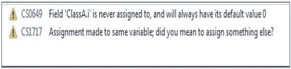

Points to Remember

与字段同名的方法参数会在方法体中隐藏整个字段。在这种场景中，关键字“this”帮助我们识别哪个是参数，哪个是字段。

## 演示 4

在下面的演示中，我们使用了两个不同的构造函数。用户定义的无参数构造函数总是用值 5 初始化实例变量 I，但是参数化构造函数可以用我们提供的任何整数值初始化实例变量。

```cs
using System;
class ClassA
{
    public int i;
    public ClassA()
    {
        this.i = 5;
    }
    public ClassA(int i)
    {
        this.i = i;
    }

}
class ClassEx4
{
    static void Main(string[] args)
    {
        Console.WriteLine("*** A Simple class with 2  different constructor ***");
        ClassA obA = new ClassA();
        ClassA obB = new ClassA(75);
        Console.WriteLine("obA.i =" + obA.i);
        Console.WriteLine("obB.i =" + obB.i);
        Console.ReadKey();
    }
}

```

### 输出

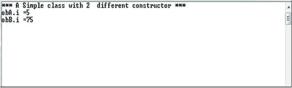

### 附加注释

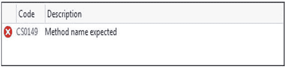

*   前面，我们使用同一个构造函数来创建不同的对象，这些对象用不同的值进行初始化。在这个例子中，我们使用了不同的构造函数来创建用不同的值初始化的不同对象。
*   在 Java 中，我们可以用 this (5)代替 this.i=5。但是在 C# 中，那种编码是不允许的。对于这种编码，我们会遇到如下编译错误:

## 演示 5

我提到过一个类可以同时有变量和方法。所以，现在我们要用一个返回整数的方法来创建一个类。该方法用于接受两个整数输入，然后返回这两个整数的和。

```cs
using System;

namespace InstanceMethodDemo
{
        class Ex5
        {
                public int Sum(int x, int y)
                {
                        return x + y;
                }
        }

        class Program
        {
                static void Main(string[] args)
                {
                        Console.WriteLine("*** A Simple class with a method returning an integer ***\n\n");
                        Ex5 ob = new Ex5();
                        int result = ob.Sum(57,63);
                        Console.WriteLine("Sum of 57 and 63 is : " + result);
                        Console.ReadKey();

                }
        }
}

```

### 输出

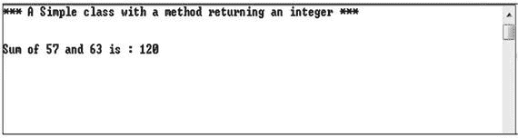

## 对象初始化器

老师继续说:现在我们要学习创建物体的两种不同的技术。我们可以根据需要使用它们。考虑下面的程序，它后面是输出和分析。

## 演示 6

```cs
using System;

namespace ObjectInitializerEx1
{
    class Employee
    {
        public string Name;
        public int Id;
        public double Salary;
        //Parameterless constructor
        public Employee() { }
        //Constructor with one parameter
        public Employee(string name) { this.Name = name; }
    }
    class Program
    {
        static void Main(string[] args)
        {
            Console.WriteLine("***Object initializers Example-1***");

            //Part-1:Instantiating without Object Initializers

            //Using parameterless constructor
            Employee emp1 = new Employee();
            emp1.Name = "Amit";
            emp1.Id = 1;
            emp1.Salary = 10000.23;
            //Using the constructor with one parameter
            Employee emp2 = new Employee("Sumit");
            emp2.Id = 2;
            emp2.Salary = 20000.32;

            //Part-2:Instantiating with Object Initializers

            //Using parameterless constructor
            Employee emp3 = new Employee { Name = "Bob", Id = 3, Salary = 15000.53 };
            //Using the constructor with one parameter
            Employee emp4 = new Employee("Robin") { Id=4,Salary = 25000.35 };

            Console.WriteLine("Employee Details:");
            Console.WriteLine("Name ={0} Id={1} Salary={2}", emp1.Name,emp1.Id,emp1.Salary);
            Console.WriteLine("Name ={0} Id={1} Salary={2}", emp2.Name,emp2.Id,emp2.Salary);
            Console.WriteLine("Name ={0} Id={1} Salary={2}", emp3.Name, emp3.Id, emp3.Salary);
            Console.WriteLine("Name ={0} Id={1} Salary={2}", emp4.Name, emp4.Id, emp4.Salary);
            Console.ReadKey();
        }
    }
}

```

### 输出

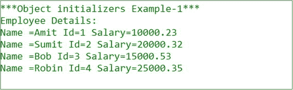

### 分析

请仔细注意以下部分。

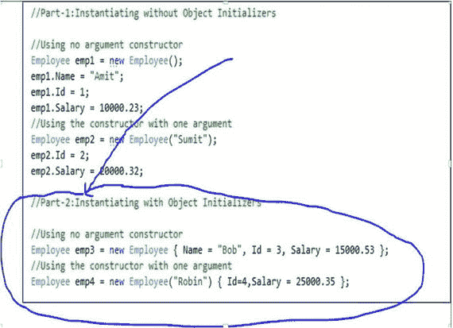

在这个例子的第 2 部分，我们已经介绍了对象初始化器的概念。我们可以看到，与底部(第 2 部分)相比，在顶部(第 1 部分)，我们需要编写更多的代码来完成对象(emp1 和 emp2)。在第 2 部分中，一行代码就足以实例化每个对象(emp3 和 emp4)。我们还试验了不同类型的构造函数。但是很明显，在所有情况下，对象初始化器都简化了实例化过程。这个概念是在 C# 3.0 中引入的。

## 可选参数

老师继续说:现在考虑下面的程序和输出。

## 演示 7

```cs
using System;

namespace OptionalParameterEx1
{
    class Employee
    {
        public string Name;
        public int Id;
        public double Salary;
        public Employee(string name = "Anonymous", int id = 0, double salary = 0.01)
        {
            this.Name = name;
            this.Id = id;
            this.Salary = salary;
        }
    }
    class Program
    {
        static void Main(string[] args)
        {
            Console.WriteLine("***Optional Parameter Example-1***");

            Employee emp1 = new Employee("Amit", 1, 10000.23);
            Employee emp2 = new Employee("Sumit", 2);
            Employee emp3 = new Employee("Bob");
            Employee emp4 = new Employee();

            Console.WriteLine("Employee Details:");
            Console.WriteLine("Name ={0} Id={1} Salary={2}", emp1.Name, emp1.Id, emp1.Salary);
            Console.WriteLine("Name ={0} Id={1} Salary={2}", emp2.Name, emp2.Id, emp2.Salary);
            Console.WriteLine("Name ={0} Id={1} Salary={2}", emp3.Name, emp3.Id, emp3.Salary);
            Console.WriteLine("Name ={0} Id={1} Salary={2}", emp4.Name, emp4.Id, emp4.Salary);
            Console.ReadKey();
        }
    }
}

```

### 输出

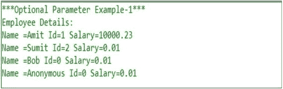

### 分析

这里我们使用了构造函数中可选参数的概念。这个构造函数需要三个参数:一个用于雇员的姓名，一个用于雇员的 ID，一个用于雇员的工资。但是如果我们传递的参数更少，编译器根本不会抱怨。另一方面，我们的应用选择了我们已经在可选参数列表中设置的默认值。从输出的最后一行，您可以看到 employee 对象的默认值是匿名的、0 和 0.01(对应于雇员的姓名、ID 和薪水)。

学生问:

先生，在 OOP 中我们看到代码总是被捆绑在对象中。这种类型的设计在现实场景中有什么好处？

老师说:其实有很多好处。从现实世界的场景思考；例如，考虑您的笔记本电脑或打印机。如果您的笔记本电脑中的任何部件出现故障，或者您的打印墨盒没有墨水了，您可以简单地更换这些部件。您不需要更换整个笔记本电脑或整个打印机。同样的概念也适用于其他真实世界的对象。

而且，您可以在类似型号的笔记本电脑或打印机中重复使用相同的部件。

除此之外，你必须同意我们不关心这些功能是如何在那些部分实际实现的。如果这些部分工作正常，满足我们的需求，我们就很高兴。

在面向对象编程中，对象扮演着同样的角色:它们可以被重用，也可以被插入。同时，他们隐藏了实现细节。例如，在演示 5 中，我们可以看到，当我们调用带有两个整数参数(57 和 63)的 Sum()方法时，我们知道我们将得到这些整数的和。外部用户完全不知道该方法的内部机制。因此，我们可以通过向外界隐藏这些信息来提供一定程度的安全性。

最后，从另一个编码的角度来看，假设下面的场景。假设您需要在程序中存储员工信息。如果你开始这样编码:

```cs
string empName= "emp1Name";
string deptName= "Comp.Sc.";
int empSalary= "10000";

```

然后对于第二个雇员，我们必须这样写:

```cs
string empName2= "emp2Name";
string deptName2= "Electrical";
int empSalary2= "20000";

```

等等。

真的可以这样继续下去吗？答案是否定的。简单地说，像这样创建一个雇员类和过程总是一个更好的主意:

```cs
Employee emp1, emp2;

```

它更干净、可读性更强，显然是一种更好的方法。

学生问:

先生，到目前为止，我们已经讨论了构造函数，但没有讨论析构函数。为什么呢？

老师说:我将在第 [14](14.html) 章(内存清理)讨论带有垃圾收集的析构函数。

## 摘要

本章讨论了以下主题。

*   类、对象和引用的概念
*   对象和引用之间的区别
*   指针和引用的区别
*   局部变量和实例变量的区别
*   不同类型的构造函数及其用法
*   用户定义的无参数构造函数和 C# 提供的默认构造函数之间的区别
*   this 关键字
*   对象初始化器的概念
*   可选参数的概念
*   面向对象方法在现实编程中的好处