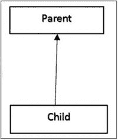
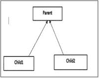
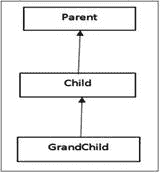
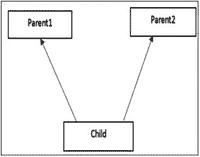
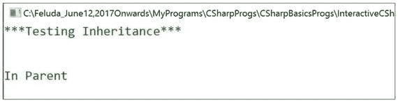
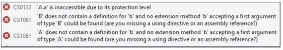
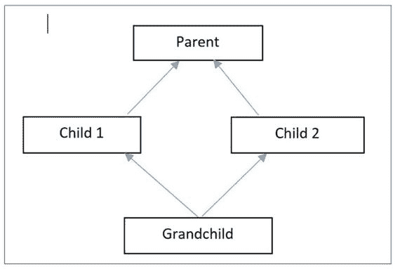
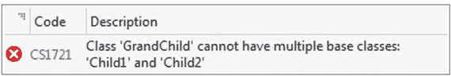
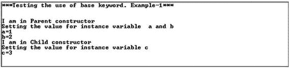
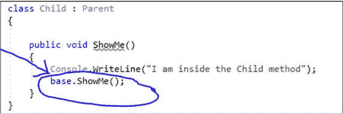

# 三、继承的概念

教师开始讨论:继承的主要目的是促进可重用性和消除冗余(代码)。基本思想是，子类可以获得其父类的特征/特性。在编程术语中，我们说子类是从它的父类/基类派生出来的。因此，父类被放在类层次结构中的更高一级。

## 类型

一般来说，我们处理四种类型的继承。

*   单一继承:子类从一个基类派生而来
*   分层继承:一个基类可以派生出多个子类
*   多级继承:父类有一个孙类
*   多重继承:一个孩子可以来自多个父母

Points to Remember

*   C# 不支持多重继承(通过类)；也就是说，子类不能从多个父类派生。为了处理这种情况，我们需要理解接口。
*   还有另一种类型的继承被称为混合继承。它是两种或两种以上遗传类型的结合。

<colgroup><col align="left"> <col align="left"></colgroup> 
| 图表 | 带代码格式的类型 |
| :-- | :-- |
|  | 单继承:`#region Single Inheritance``class Parent``{``//Some code``}``class Child : Parent``{``//Some code``}``#endregion` |
|  | 分层继承:`#region Hierarchical Inheritance``class Parent``{``//Some code``}``class Child1 : Parent``{``//Some code``}``class Child2 : Parent``{``//Some code``}``#endregion` |
|  | 多级继承:`#region Multilevel Inheritance``class Parent``{``//Some code``}``class Child : Parent``{``//Some code``}``class GrandChild : Child``{``//Some code``}``#endregion` |
|  | 多重继承:在 C# 中不支持通过类继承。我们需要了解接口。下面举个例子:`#region Multiple Inheritance``interface``IInter1``{``//Some Code``}``interface``IInter2``{``//Some code``}``class MyClass : IInter1, IInter2``{``//Some code``}``#endregion` |

让我们从一个关于继承的简单程序开始。

## 演示 1

```cs
using System;

namespace InheritanceEx1
{
    class ParentClass
    {
        public void ShowParent()
        {
            Console.WriteLine("In Parent");
        }
    }
    class ChildClass :ParentClass
    {
    }
    class Program
    {
        static void Main(string[] args)
        {
            Console.WriteLine("***Testing Inheritance***\n\n");
            ChildClass child1 = new ChildClass();
            //Invoking ShowParent()through ChildClass object
            child1.ShowParent();
            Console.ReadKey();
        }
    }
}

```

### 输出



### 附加注释

我们已经通过一个子类对象调用了`ShowParent()`方法。

Points to Remember

*   请记住，在 C# 中，Object 是。NET 框架。换句话说，`System.Object`是类型层次结构中的最终基类。
*   除了构造函数(实例和静态)和析构函数，所有成员都是继承的(也就是说，这与访问说明符无关)。但是由于它们的可访问性限制，所有继承的成员在子类/派生类中可能都不可访问。
*   子类可以添加新成员，但不能删除父成员的定义。(就像你可以为自己选择一个新名字，但不能改变父母的姓氏一样)。
*   继承层次结构是可传递的；也就是说，如果类 C 继承了类 B，而类 B 又派生自类 A，那么类 C 就包含了类 B 和类 A 的所有成员。

学生问:

这意味着私有成员也继承了。这种理解正确吗？

老师说:是的。

学生问:

我们如何检查私有成员也被继承的事实？

老师说:你可以参考演示 2 中显示的程序和输出。

## 演示 2

```cs
using System;

namespace InheritanceWithPrivateMemberTest
{
    class A
    {
        private int a;
    }
    class B : A { }

    class Program
    {
        static void Main(string[] args)
        {
            B obB = new B();
            A obA = new A();
            //This is a proof that a is also inherited. See the error message.
            Console.WriteLine(obB.a);//A.a is inaccessible due to its
            //protection level
            Console.WriteLine(obB.b);//'B' does not contain a definition
            //for 'b' and no extension ......
            Console.WriteLine(obA.b);//'A' does not contain a definition
            //for 'b' and no extension ......
        }
    }
}

```

### 输出



### 分析

我们遇到了两种不同类型的错误:CS0122 和 CS1061。

*   CS0122: A.a 由于其保护级别而无法访问。它指示来自类 A 的私有成员 A 在子类 b 中被继承。
*   CS1061:我们用另一个字段测试了输出，该字段不在此类层次结构中(即，该字段不存在，既不在 A 中也不在 B 中)。当我们试图用 A 类或 B 类对象访问成员时，我们遇到了一个不同的错误。因此，如果 a 在 B 类中不存在，那么你应该得到一个类似的错误。

学生问:

为什么 C# 不支持通过类的多重继承？

老师说:主要原因是为了避免歧义。在典型的场景中，它会造成混乱；例如，假设我们的父类中有一个名为`Show()`的方法。父类有多个子类，比如 Child1 和 Child2，它们为了自己的目的正在重新定义(用编程术语来说，重写)方法。代码可能类似于演示 3 所示。

## 演示 3

```cs
class Parent
    {
        public void Show()
        {
        Console.WriteLine("I am in Parent");
        }
    }
    class Child1: Parent
    {
        public void Show()
        {
        Console.WriteLine("I am in Child-1");
        }
    }
    class Child2:Parent
    {
        public void Show()
        {
        Console.WriteLine("I am in Child-2");
        }
    }

```

现在，让我们假设另一个名为孙的类派生自 Child1 和 Child2，但是它没有覆盖`Show()`方法。



所以，现在我们有了歧义:孙子将从哪个类继承/调用`Show()`——Child 1 还是 Child 2？为了避免这种类型的歧义，C# 不支持通过类的多重继承。这就是所谓的钻石问题。

所以，如果你这样编码:

```cs
    class GrandChild : Child1, Child2//Error: Diamond Effect
    {
        public void Show()
        {
            Console.WriteLine("I am in Child-2");
        }
    }

```

C# 编译器会报错:



学生问:

所以，编程语言不支持多重继承。这种理解正确吗？

老师说:不。这个决定是由编程语言的设计者做出的(例如，C++支持多重继承的概念)。

学生问:

为什么 C++设计者支持多重继承？似乎钻石问题也会影响到他们。

老师说:我试图从我的角度来解释。他们可能不想放弃多重继承(也就是说，他们希望包含这个特性来丰富语言)。他们为您提供支持，但将正确使用的控制权留给了您。

另一方面，由于这种支持，C# 设计者希望避免任何不想要的结果。他们只是想让语言更简单，更不容易出错。

老师问:

C# 中有混合继承吗？

老师解释:仔细想想。混合继承是两种或两种以上继承的结合。所以，如果你不想通过类来组合任何类型的多重继承，这个问题的答案是肯定的。但是，如果你试图用任何类型的多重继承(通过类)进行混合继承，C# 编译器将立即提出它的关注。

老师问:

假设我们有一个父类和一个子类。我们能猜到类的构造函数会以什么顺序被调用吗？

老师说:我们必须记住，构造函数的调用遵循从父类到子类的路径。让我们用一个简单的例子来测试一下:我们有一个父类 parent、一个子类 child 和一个孙类 grande。顾名思义，子类派生自父类，孙类派生自子类。我们已经创建了一个孙类的对象。请注意，构造函数是按照它们的派生顺序调用的。

## 演示 4

```cs
using System;

namespace ConstructorCallSequenceTest
{
    class Parent
    {
        public Parent()
        {
            Console.WriteLine("At present: I am in Parent Constructor");
        }
    }
    class Child : Parent
    {
        public Child()

        {
            Console.WriteLine("At present: I am in Child Constructor");
        }
    }
    class GrandChild : Child
    {
        public GrandChild()
        {
            Console.WriteLine("At present: I am in GrandChild Constructor");
        }
    }

    class Program
    {
        static void Main(string[] args)
        {
            Console.WriteLine("***Testing the call sequence of constructors***\n\n");
            GrandChild grandChild = new GrandChild();
            Console.ReadKey();
        }
    }
}

```

### 输出


### 说明

学生问:

先生，有时候我们不确定。在继承层次结构中，谁应该是父类，谁应该是子类？我们如何处理这种情况？

老师说:你可以试着记住一句简单的话:足球运动员就是运动员，但反过来就不一定了。或者，公共汽车是一种交通工具，但反过来就不一定了。这种“是-a”测试可以帮助你决定谁应该是父母；例如，“运动员”是父类，“足球运动员”是子类。

我们还通过这个“is-a”测试来预先确定我们是否可以将一个类放在同一个继承层次中。

## 一个特殊的关键词:基础

在 C# 中，有一个特殊的关键字叫做 base。它用于以有效的方式访问父类(也称为基类)的成员。每当子类想要引用它的直接父类时，它可以使用 base 关键字。

让我们通过两个简单的例子来研究 base 关键字的不同用法。

## 演示 5

```cs
using System;

namespace UseOfbaseKeywordEx1
{
    class Parent
    {
        private int a;
        private int b;
        public Parent(int a, int b)
        {
            Console.WriteLine("I am in Parent constructor");
            Console.WriteLine("Setting the value for instance variable  a and b");
            this.a = a;
            this.b = b;
            Console.WriteLine("a={0}", this.a);
            Console.WriteLine("b={0}", this.b);
        }
}
    class Child : Parent
    {
        private int c;
        public Child(int a, int b,int c):base(a,b)

        {
            Console.WriteLine("I am in Child constructor");
            Console.WriteLine("Setting the value for instance variable c");
            this.c = c;
            Console.WriteLine("c={0}", this.c);
        }

    }

    class Program
    {
        static void Main(string[] args)
        {
            Console.WriteLine("***Testing the use of base keyword. Example-1***\n\n");
            Child obChild = new Child(1, 2, 3);
            //Console.WriteLine("a in ObB2={0}", obChild.a);// a is private,
 //so Child.a is inaccessible
            Console.ReadKey();
        }
    }
}

```

### 输出



### 分析

我们需要了解为什么有必要使用关键字 base。如果我们在前面的示例中没有使用它，我们将需要编写类似如下的代码:

```cs
public Child(int a, int b, int c)
        {
            this.a = a;
            this.b = b;
            this.c = c;
        }

```

这种方法有两个主要问题。您试图编写重复的代码来初始化实例变量 a 和 b。在这种特殊情况下，您将收到编译错误，因为 a 和 b 由于其保护级别而不可访问(请注意它们是私有的)。通过使用“base”关键字，我们有效地处理了这两种情况。虽然我们在子类构造函数声明之后写了“base”这个词，但是父类构造函数在子类构造函数之前被调用。理想情况下，这是我们的真实意图。

Points to Remember

前面你已经看到，当我们初始化一个对象时，构造函数体在父类到子类的方向上执行。但是初始化的相反方向(即子到父)随着字段的初始化(以及父类构造函数调用的参数)而发生。*

在 C# 中，不能使用一个实例字段在方法体外部初始化另一个实例字段。

*我认为以下 MSDN 资源值得一读:

*   `https://blogs.msdn.microsoft.com/ericlippert/2008/02/15/why-do-initializers-run-in-the-opposite-order-as-constructors-part-one/`
*   `https://blogs.msdn.microsoft.com/ericlippert/2008/02/18/why-do-initializers-run-in-the-opposite-order-as-constructors-part-two/`

### 恶作剧

产量是多少？

```cs
using System;

namespace FieldInitializationOrderEx1
{
    class A
    {
        int x = 10;
        int y = x + 2;//Error
    }
    class Program
    {
        static void Main(string[] args)
        {
            Console.WriteLine("*** Analyzing C#'s field initialization order ***");
            int x = 10;
            int y = x + 2;//ok
            Console.WriteLine("x={0}", x);
            Console.WriteLine("y={0}", y);
            Console.ReadKey();
        }
    }
}

```

### 输出


### 分析

这个限制是由 C# 的设计者实现的。

学生问:

为什么 C# 设计者设置了这个限制(与错误 CS0236 相关)？

老师说:这个话题有很多讨论。上例中的语句`y=x+2;`相当于`y=this.x+2;`“`this”`表示当前对象，因此，如果我们要像`this.x`一样进行调用，需要先完成当前对象。但是在某些情况下(例如，如果`x`是一个还没有被创建的属性(而不是一个字段),或者它是另一个实例的一部分，等等),当前对象可能还没有完成。)我们将很快了解更多关于属性的内容。我们还应该记住，创建构造函数是为了处理这种初始化。因此，如果允许这些类型的构造，他们也可以质疑构造函数的用途。

老师继续说:现在我们来看看下面这个例子中 base 关键字的另一种用法。注意，在这个例子中，我们通过基类方法中的 base 关键字调用父类方法(`ParentMethod()`)。

## 演示 6

```cs
using System;

namespace UseOfbaseKeywordEx2
{
    class Parent
    {
        public void ParentMethod()
        {
            Console.WriteLine("I am inside the Parent method");
        }
    }
    class Child : Parent
    {
        public void childMethod()
        {
               Console.WriteLine("I am inside the Child method");
               Console.WriteLine("I am calling the Parent method now");
               base.ParentMethod();
        }

}

    class Program
    {
        static void Main(string[] args)
        {
            Console.WriteLine("***Testing the use of base keyword. Example-2***\n\n");
            Child obChild = new Child();
            obChild.childMethod();
            Console.ReadKey();
        }
    }
}

```

### 输出


Points to Remember

*   根据语言规范，基类访问只允许在构造函数、实例方法或实例属性访问中进行。
*   关键字“base”不应在静态方法上下文中使用。
*   它类似于 Java 中的“super”关键字和 C++中的“base”关键字。它几乎与 C++的 base 关键字相同，它就是从这个关键字被采用的。然而，在 Java 中，有一个限制规定“super”应该是第一个语句。Oracle Java 文档说超类构造函数的调用必须是子类构造函数的第一行。

学生问:

先生，假设有一些方法在父类和子类中都有一个共同的名字。如果我们创建一个子类对象，尝试调用同一个命名方法，会调用哪个？

老师说:你试图在这里引入方法覆盖的概念。我们将在关于多态的章节中进一步讨论它。但是要回答您的问题，请考虑下面的程序和输出。

## 演示 7

```cs
using System;

namespace UseOfbaseKeywordEx3
{
    class Parent
    {
        public void ShowMe()
        {
            Console.WriteLine("I am inside the Parent method");
        }
    }
    class Child : Parent
    {

        public void ShowMe()
        {
            Console.WriteLine("I am inside the Child method");
            //base.ParentMethod();
        }
    }

    class Program
    {
        static void Main(string[] args)
        {
            Console.WriteLine("***Testing the use of base keyword. Example-3***\n\n");
            Child obChild = new Child();
            obChild.ShowMe();
            Console.ReadKey();
        }
    }
}

```

### 输出


### 分析

在这种情况下，您的程序被编译并运行，但是您应该注意到您会收到一条警告消息，提示您的派生类方法隐藏了继承的父类方法，如下所示:


因此，如果您想调用父类方法，您可以简单地使用子类方法中的代码，就像这样:



base 关键字可用于以下任何一种情况:

*   调用父类中定义的隐藏/重写方法。
*   我们可以在创建派生类的实例时指定特定的基类构造函数版本(参见演示 5)。

学生问:

在我看来，子类可以使用它的超类方法。但是有什么方法可以让超类使用它的子类方法呢？

老师说:不。你必须记住，超类是在它的子类之前完成的，所以它不知道它的子类方法。它只声明一些(想想一些契约/方法)可以被它的子节点使用的东西。只有付出而不期望从孩子那里得到回报。

如果你仔细观察，你会发现“是-a”测试是单向的(例如，足球运动员总是运动员，但反过来就不一定了；所以没有向后继承的概念)。

学生问:

先生，所以每当我们想使用一个父类方法，并把额外的东西放入其中，我们可以使用关键字 base。这种理解正确吗？

老师说:是的。

学生问:

先生，在 OOP 中，继承帮助我们重用行为。还有其他方法可以达到同样的效果吗？

老师说:是的。尽管继承的概念在很多地方被使用，但它并不总是提供最佳的解决方案。为了更好地理解它，您需要理解设计模式的概念。一个非常常见的替代方法是使用组合的概念，这将在后面介绍。

学生问:

先生，如果一个用户已经为他的应用创建了一个方法，我们应该通过继承的概念来重用同一个方法，以避免重复工作。这种理解正确吗？

老师说:一点也不。我们不应该以这种方式概括继承。这取决于特定的应用。假设已经有人做了一个`Show()`方法来描述一个汽车类的细节。现在让我们假设你也创建了一个名为`Animal`的类，你也需要用一个方法描述一个动物的特征。假设您也认为名称“Show()”最适合您的方法。在这种情况下，因为我们已经有了一个名为`Car and if you think that you need to reuse t`的类中的`Show()`方法，而你的`Animal`类中的【何】方法，你可以写这样的代码:

```cs
Class Animal: Car{...} .

```

现在想一想。“这样的设计好吗？”你必须同意汽车和动物之间没有关系。因此，我们不应该在相同的继承层次结构中关联它们。

学生问:

我们如何继承构造函数或析构函数？

在本章的开始，我提到了构造函数(静态和非静态)和析构函数是不被继承的。

## 摘要

本章涵盖了以下主题。

*   继承的概念
*   继承的不同类型
*   为什么 C# 不支持通过类的多重继承
*   C# 中允许的混合继承类型
*   “base”关键字的不同用法
*   C# 的 base 关键字和 Java 的 super 关键字的简单比较
*   继承层次结构中的构造函数调用序列
*   如果父类方法的子类也包含同名的方法，如何调用父类方法
*   如何将类放入继承层次结构中
*   继承概念的正确使用

还有更多。