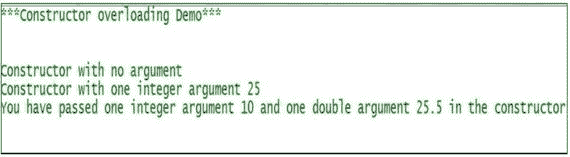
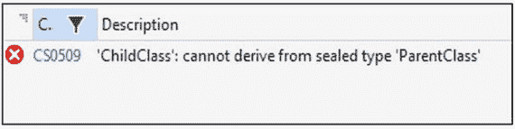

# 四、熟悉多态

老师开始讨论:让我们回忆一下本书开始时我们讨论的关于多态的内容。多态通常与一个名称的多种形式相关联；例如，如果我们有两个整数操作数进行加法运算，我们期望得到整数的和，但是如果操作数是两个字符串，我们期望得到一个连接的字符串。我还提到多态有两种类型:编译时多态和运行时多态。

这里我们将从编译时多态开始讨论。

在编译时多态中，编译器可以在编译时将适当的方法绑定到相应的对象，因为它具有所有必要的信息(例如，方法参数)。因此，一旦程序被编译，它就能更早地决定调用哪个方法。这就是为什么它也被称为静态绑定或早期绑定。

在 C# 中，编译时多态可以通过方法重载和运算符重载来实现。

Points to Remember

在 C# 中，方法重载和运算符重载可以帮助我们实现编译时多态。

## 方法重载

老师继续:先说一个程序。考虑下面的程序和相应的输出。你注意到什么特别的模式了吗？

## 演示 1

```cs
using System;

namespace OverloadingEx1
{
    class OverloadEx1
    {
        public int Add(int x, int y)
        {
            return x + y;
        }
        public double Add(double x, double y)
        {
            return x + y;
        }
        public string Add(String s1, String s2)
        {
            return string.Concat(s1, s2);
        }
    }
    class Program
    {
        static void Main(string[] args)
        {
            Console.WriteLine("***Concept of method Overloading***\n\n");
            OverloadEx1 ob = new OverloadEx1();
            Console.WriteLine("2+3={0}", ob.Add(2, 3));
            Console.WriteLine("20.5+30.7={0}", ob.Add(20.5, 30.7));
            Console.WriteLine("Amit + Bose ={0}", ob.Add("Amit","Bose"));
            Console.ReadKey();
        }
    }
}

```

### 输出


### 分析

学生回应:可以。我们看到所有的方法都有相同的名字“Add ”,但是从它们的方法体来看，似乎每个方法都在做不同的事情。

老师说:正确的观察。当我们做这种编码时，我们称之为方法重载。但是您还应该注意到，在这种情况下，方法名称是相同的，但是方法签名是不同的。

学生问:

什么是方法签名？

老师说:理想情况下，方法名和参数的数量和类型组成了它的签名。C# 编译器可以区分名称相同但参数列表不同的方法；例如，对于一个 C# 编译器来说，`double Add(double x, double y)`和`int Add(int x, int y)`是不同的。

### 恶作剧

下面的代码段是方法重载的一个例子。这样对吗？

```cs
class OverloadEx1
  {
      public int Add(int x, int y)
      {
          return x + y;
      }
      public double Add(int x, int y, int z)
      {
          return x + y+ z;
      }
  }

```

### 回答

是的。

### 恶作剧

下面的代码段是方法重载的一个例子吗？

```cs
class OverloadEx1
 {
     public int Add(int x, int y)
     {
         return x + y;
     }
     public double Add(int x, int y)
     {
         return x + y;
     }
 }

```

### 回答

不会。编译器不会考虑“返回类型”来区分这些方法。我们必须记住，返回类型不被认为是方法签名的一部分。


学生问:

先生，我们可以让构造函数重载吗？

老师说:当然。你可以为构造函数重载写一个类似的程序。

## 演示 2

```cs
using System;

namespace ConstructorOverloadingEx1
{
    class ConsOverloadEx
    {
        public ConsOverloadEx()
        {
            Console.WriteLine("Constructor with no argument");
        }
        public ConsOverloadEx(int a)
        {
            Console.WriteLine("Constructor with one integer argument {0}", a);
        }
        public ConsOverloadEx(int a, double b)
        {
            Console.WriteLine("You have passed one integer argument {0} and one double argument {1} in the constructor", a,b);
        }
    }

    class Program
    {
        static void Main(string[] args)
        {
            Console.WriteLine("***Constructor overloading Demo***\n\n");
            ConsOverloadEx ob1 = new ConsOverloadEx();
            ConsOverloadEx ob2 = new ConsOverloadEx(25);
            ConsOverloadEx ob3 = new ConsOverloadEx(10,25.5);
            //ConsOverloadEx ob4 = new ConsOverloadEx(37.5);//Error
            Console.ReadKey();
        }
    }
}

```

### 输出



### 分析

学生问:

先生，这似乎也是方法重载。构造函数和方法有什么区别？

老师澄清:我们已经在关于类的讨论中谈到了构造函数。作为参考，构造函数与类同名，并且没有返回类型。因此，您可以将构造函数视为一种特殊的方法，它与类同名，并且没有返回类型。但是还有许多其他的区别:构造函数的主要焦点是初始化对象。我们不能直接打电话给他们。

学生问:

先生，我们能这样写代码吗？

## 演示 3

```cs
class ConsOverloadEx
    {
        public ConsOverloadEx()
        {
            Console.WriteLine("A Constructor with no argument");
        }
        public void ConsOverloadEx()
        {
            Console.WriteLine("a method");
        }
    }

```

老师说:Java 8 允许这样做，但是 C# 编译器会出错。

### 输出


学生问:

先生，我们能重载 Main()方法吗？

老师说:是的。可以考虑以下方案。

## 演示 4

```cs
using System;

namespace OverloadingMainEx
{
    class Program
    {
        static void Main(string[] args)
        {
            Console.WriteLine("***Testing Overloaded version of Main()***");
            Console.WriteLine("I am inside Main(string[] args) now");
            Console.WriteLine("Calling overloaded version\n");
            Main(5);
            //Console.WriteLine("***Concept of method Overloading***\n\n");
            Console.ReadKey();
        }
        static void Main(int a)
        {
            Console.WriteLine("I am inside Main(int a) now");
        }
    }
}

```

### 输出


### 分析

虽然您可以编译并运行前面的程序，但编译器会显示以下警告消息:


学生问:

先生，那么如果我们增加一个方法体，为什么我们会得到一个编译错误，就像下面这样？


老师说:根据规范，你的程序可以有一个带有 Main(string[] args)或 Main()方法的入口点。这里出现了 Main 方法的两个版本。这就是为什么编译器不知道使用哪一个作为入口点。因此，您需要按照编译器的建议来决定入口点。如果您简单地删除或注释掉 Main(string[] args)版本，您的程序可以成功编译，然后如果您运行该程序，您将收到以下输出:


### 恶作剧

我们的程序中可以有多个 Main()方法吗，如下所示？

## 演示 5

```cs
using System;

namespace MultipleMainTest
{
    class Program1
    {
        static void Main(string[] args)
        {
            Console.WriteLine("I am inside Program1.Main(string[] args) now");
            Console.ReadKey();
        }
    }
    class Program2
    {
        static void Main()
        {
            Console.WriteLine("I am inside Program2.Main() now");
            Console.ReadKey();
        }
    }
}

```

老师说:你会得到以下错误:


为了避免这个错误，您可以从您的项目属性中设置入口点(这里我们从 Program2 中选择了 Main())。


现在，如果您运行该程序，您将获得以下输出:


### 建议/良好的编程实践

如果可能的话，尽量与重载方法的参数名及其对应的顺序保持一致。

下面是一个`good design`的例子:

```cs
public void ShowMe(int a) {..}

public void ShowMe(int a, int b){...}

[Note that in 2nd line, the position of int a is same as 1st case]

Bad design:

public void ShowMe(int a) {..}

public void ShowMe(int x, int b){...}

[Note that in 2nd line, we start with int x instead of int a]

```

老师继续说:到目前为止，我们已经用方法重载测试了编译时多态。让我们也用运算符重载来测试这种风格。

## 运算符重载

每个操作符都有自己的功能；比如+可以把两个整数相加。通过操作符重载技术，我们可以用它来连接两个字符串；也就是说，我们可以对不同类型的操作数执行类似的机制。换句话说，我们可以简单地说操作符重载帮助我们为操作符提供特殊的/额外的含义。

学生问:

先生，那么有人可能会误用这个概念。它们可以重载与运算符重载相矛盾的操作；例如，++运算符也可用于递减。理解正确吗？

老师说:是的，我们需要小心。我们不应该使用++运算符来递减。如果我们这样做，那将是一个极其糟糕的设计。除此之外，我们必须注意 C# 不允许我们重载所有的操作符。MSDN 提供了以下指导方针。

<colgroup><col align="left"> <col align="left"></colgroup> 
| 经营者 | 过载能力 |
| :-- | :-- |
| +, -, !，~，++, -，真，假 | 我们可以支配这些一元运算符。 |
| +，-，*，/，%，&，&#124;，^，<> | 我们可以支配这些二元运算符。 |
| ==, !=，，<=, > = | 比较运算符可以重载(但请参见该表后面的注释)。 |
| &&, &#124;&#124; | 条件逻辑运算符不能重载，但它们使用&和&#124;进行计算，这可以重载。 |
| [ ] | 我们不能重载数组索引操作符，但是我们可以定义索引器。 |
| (T)x | 我们不能重载转换操作符，但是我们可以定义新的转换操作符(例如，在显式和隐式的上下文中) |
| +=，-=，*=，/=，%=，&=，&#124;=，^=，<<=, > >= | 我们不能重载赋值运算符，而是+=；例如，使用可以重载的+来计算。 |
| =, ., ?:, ?？、->、= >、f(x)、as、选中、未选中、默认、委托、is、新建、sizeof、typeof | 我们不能支配这些经营者。 |

Note

如果重载，比较运算符必须成对重载；比如= =重载，我们就需要重载！=也。反之亦然，类似于< and >和<= and > =。

老师说:让我们跟着演示。这里我们将一元运算符++应用于一个矩形对象，以增加矩形对象的长度和宽度。

## 演示 6

```cs
using System;
namespace OperatorOverloadingEx
{
    class Rectangle
    {
        public double length, breadth;
        public Rectangle(double length, double breadth)
        {
            this.length = length;
            this.breadth = breadth;
        }
        public double AreaOfRectangle()
        {
            return length * breadth;
        }
        public static Rectangle operator ++ (Rectangle rect)
        {
            rect.length ++;
            rect.breadth++;
            return rect;
        }
    }
    class Program
    {
        static void Main(string[] args)
        {
            Console.WriteLine("***Operator Overloading Demo:Overloading ++ operator***\n");
            Rectangle rect = new Rectangle(5, 7);
            Console.WriteLine("Length={0} Unit Breadth={1} Unit", rect.length,rect.breadth);
            Console.WriteLine("Area of Rectangle={0} Sq. Unit",rect.AreaOfRectangle());
            rect++;
            Console.WriteLine("Modified Length={0} Unit Breadth={1} Unit", rect.length, rect.breadth);
            Console.WriteLine("Area of new Rectangle={0} Sq. Unit", rect.AreaOfRectangle());
            Console.ReadKey();
        }
    }
}

```

### 输出


现在让我们重载二元运算符+。

## 演示 7

```cs
using System;
namespace OperatorOverloadingEx2
{
    class ComplexNumber
    {
        public double real,imaganinary;
        public ComplexNumber()
        {
            this.real = 0;
            this.imaganinary = 0;
        }
        public ComplexNumber(double real, double imaginary )
        {
            this.real = real;
            this.imaganinary = imaginary;
        }
        //Overloading a binary operator +
        public static ComplexNumber operator +(ComplexNumber cnumber1, ComplexNumber cnumber2)
        {
            ComplexNumber temp = new ComplexNumber();
            temp.real = cnumber1.real + cnumber2.real;
            temp.imaganinary = cnumber1.imaganinary + cnumber2.imaganinary;
            return temp;
        }
    }
    class Program
    {
        static void Main(string[] args)
        {
            Console.WriteLine("***Operator Overloading Demo 2:Overloading binary operator + operator***\n");
            ComplexNumber cNumber1 = new ComplexNumber(2.1, 3.2);
            Console.WriteLine("Complex Number1: {0}+{1}i", cNumber1.real,cNumber1.imaganinary);
            ComplexNumber cNumber2 = new ComplexNumber(1.1, 2.1);
            Console.WriteLine("Complex Number2: {0}+{1}i", cNumber2.real, cNumber2.imaganinary);
            //Using the + operator on Complex numbers
            ComplexNumber cNumber3 = cNumber1 + cNumber2;
            Console.WriteLine("After applying + operator we have got: {0}+{1}i", cNumber3.real, cNumber3.imaganinary);
            Console.ReadKey();
        }
    }
}

```

### 输出


### 分析

学生问:

先生，在运算符重载的例子中，您使用了关键字“static”。这是故意的吗？

老师说:是的。我们必须记住一些关键的限制。

*   运算符函数必须标记为 public 和 static。

否则，您可能会遇到这种错误:

*   关键字 operator 后跟运算符符号。
*   函数参数在这里是操作数，并且返回作为表达式结果的操作符函数的类型。


Points to Remember

*   运算符函数必须标记为 public 和 static。
*   关键字 operator 后跟运算符符号。

## 方法覆盖

老师继续说:有时我们想重新定义或修改我们的父类的行为。在这种情况下，方法重写就成了问题。考虑下面的程序和输出。然后在分析部分仔细检查每一点。

## 演示 8

```cs
using System;

namespace OverridingEx1
{
    class ParentClass
    {
        public virtual void ShowMe()
        {
            Console.WriteLine("Inside Parent.ShowMe");
        }
        public void DoNotChangeMe()
        {
            Console.WriteLine("Inside Parent.DoNotChangeMe");
        }
    }
    class ChildClass :ParentClass
    {

        public override void ShowMe()
        {
            Console.WriteLine("Inside Child.ShowMe");
        }
    }

    class Program
    {
        static void Main(string[] args)
        {
            Console.WriteLine("***Method Overriding Demo***\n\n");
            ChildClass childOb = new ChildClass();
            childOb.ShowMe();//Calling Child version
            childOb.DoNotChangeMe();
            Console.ReadKey();
        }
    }
}

```

### 输出


### 分析

在前面的程序中，我们看到:


*   如果您在前面的程序中省略了单词 virtual 和 override，您将收到以下警告消息:


*   如果您使用虚拟关键字但省略 override 关键字，您将再次收到以下警告消息(您可以运行该程序):


*   顾名思义，ChildClass 是一个派生类，其父类是 ParentClass。
*   ParentClass 和 ChildClass 中都定义了具有相同签名和返回类型的名为 ShowMe()的方法。
*   在 Main()方法中，我们创建了一个子类对象 childOb。当我们通过这个对象调用方法 DoNotChangeMe()时，它可以调用方法(遵循继承属性)。没有魔法。
*   但是当我们通过这个对象调用方法 ShowMe()时，它调用的是 ChildClass 中定义的 ShowMe()版本；也就是说，父方法版本被覆盖。因此，这种情况称为方法重写。
*   现在请仔细注意:我们是如何在 ChildClass 中重新定义 ShowMe()方法的。我们使用了两个特殊的关键字——虚拟和覆盖。使用关键字 virtual，我们的意思是该方法可以在子类/派生类中重新定义。而 override 关键字是在确认我们是在有意的重定义父类的方法。
*   如果您在前面的程序中省略了单词 virtual，您将收到以下编译错误:

我们将很快在这个上下文中讨论关键字“new”。

虚方法和重写方法的返回类型、签名和访问说明符必须相同。例如，在前面的示例中，如果在子类的 ShowMe()中将可访问性从 public 更改为 protected，如下所示:

```cs
protected override void ShowMe()
    {
        Console.WriteLine("Inside Child.ShowMe");
    }

```

您将收到编译错误:


学生问:

先生，在方法重载中，返回类型并不重要。但这很重要。这是正确的吗？

老师说:是的。我们必须记住，虚方法和重写方法的签名、返回类型和可访问性应该匹配。

学生问:

先生，下面的程序会收到任何编译错误吗？

## 演示 9

```cs
class ParentClass
    {
        public virtual int ShowMe(int i)
        {
            Console.WriteLine("I am in Parent class");
            return i;
        }
    }
    class ChildClass : ParentClass
    {
        public override void ShowMe(int i)
        {
            Console.WriteLine("I am in Child class");
         }
    }

```

老师说:是的。您将得到以下错误:

### 输出


因此，为了克服这一点，正如编译器所建议的，您可以将方法(在子类中)的返回类型更改为 int，并在方法体中进行一些必要的更改，如下所示:

```cs
public override int ShowMe(int i)
        {
            Console.WriteLine("I am in Child class");
            Console.WriteLine("Incrementing i by 5");
            return i +5;//Must return  an int
        }

```

或者，您可以使用具有 void 返回类型的方法，如下所示(但这次它将被视为方法重载):

```cs
public void ShowMe()
        {
            Console.WriteLine("In Child.ShowMe()");
        }

```

如果在程序中使用这两个重新定义的方法，实际上是在实现方法重载和方法重写。浏览下面的例子。

## 演示 10

```cs
using System;

namespace OverridingEx2
{
    class ParentClass
    {
        public virtual int ShowMe(int i)
        {
            Console.WriteLine("I am in Parent class");
            return i;
        }
    }
    class ChildClass : ParentClass
    {
        public override int ShowMe(int i)
        {
            Console.WriteLine("I am in Child class");
            Console.WriteLine("Incrementing i by 5");
            return i + 5;//Must return  an int
        }
        public void ShowMe()
        {
            Console.WriteLine("In Child.ShowMe()");
        }
    }
    class Program
    {
        static void Main(string[] args)
        {
            Console.WriteLine("*** Overloading with Overriding Demo***\n");
            ChildClass childOb = new ChildClass();
            Console.WriteLine(childOb.ShowMe(5));//10
            childOb.ShowMe();
            Console.ReadKey();
        }
    }
}

```

### 输出


老师说:据说面向对象的程序员要经过三个重要阶段。在第一阶段，他们熟悉非面向对象的构造/结构(例如，他们使用决策语句、循环构造等。).在第二阶段，他们开始创建类和对象，并使用继承机制。最后在第三阶段，他们使用多态来实现延迟绑定，使他们的程序更加灵活。所以让我们来看看如何在 C# 程序中实现多态。

## 多态实验

老师继续说:多态通常与一个具有多种形式/结构的方法名称相关联。为了更好的理解它，我们需要先明确核心概念。所以，看看程序及其相应的输出。

## 演示 11

```cs
using System;

namespace BaseRefToChildObjectEx1
{
          class Vehicle
            {
            public void ShowMe()
            {
                Console.WriteLine("Inside Vehicle.ShowMe");
            }
        }
        class Bus : Vehicle
        {
            public void ShowMe()
            {
                Console.WriteLine("Inside Bus.ShowMe");
            }
            public void BusSpecificMethod()
            {
                Console.WriteLine("Inside Bus.ShowMe");
            }
        }

    class Program
    {
        static void Main(string[] args)
        {
            Console.WriteLine("***Base Class reference to Child Class Object Demo***\n\n");
            Vehicle obVehicle = new Bus();
            obVehicle.ShowMe();//Inside Vehicle.ShowMe
            // obVehicle.BusSpecificMethod();//Error
            //Bus obBus = new Vehicle();//Error
            Console.ReadKey();
        }
    }
}

```

### 输出


### 分析

请注意前面程序中的两行重要代码:

```cs
Vehicle obVehicle = new Bus();
obVehicle.ShowMe();

```

这里我们通过一个父类引用(Vehicle 引用)指向一个派生类对象(Bus 对象),然后我们调用 ShowMe()方法。这种调用方式是允许的，我们不会收到任何编译问题；也就是说，基类引用可以指向派生类对象。

但是我们不能使用这两条线:

1.  `obVehicle.BusSpecificMethod();//Error`(因为这里的表观类型是车辆而不是公共汽车)。要消除这个错误，你需要向下转换，如下:

    ```cs
    ((Bus)obVehicle).BusSpecificMethod();

    ```

2.  `Bus obBus = new Vehicle();//Error`

如前所述，要消除此错误，需要进行向下转换，如下所示:

```cs
Bus obBus = (Bus)new Vehicle();

```

Points to Remember

通过父类引用，我们可以引用子类对象，但反之则不然。对象引用可以隐式向上转换为基类引用，并显式向下转换为派生类引用。我们将在一些关键比较的分析章节(第 [8](08.html) 章)中详细了解向上转换和向下转换操作。

现在我们将使用关键字 virtual 和 override 稍微修改一下程序，如下所示。请注意，我们用 virtual 标记了父类(Vehicle)方法，用 override 标记了子类(Bus)方法。

## 演示 12

```cs
using System;

namespace PloymorphismEx1
{
       class Vehicle
        {
            public virtual void ShowMe()
            {
                Console.WriteLine("Inside Vehicle.ShowMe");
            }
        }
        class Bus : Vehicle
        {
            public override void ShowMe()
            {
                Console.WriteLine("Inside Bus.ShowMe");
            }
            public void BusSpecificMethod()
            {
                Console.WriteLine("Inside Bus.ShowMe");
            }
        }

    class Program
    {
        static void Main(string[] args)
        {
            Console.WriteLine("***Polymorphism Example-1 ***\n\n");
            Vehicle obVehicle = new Bus();
            obVehicle.ShowMe();//Inside Bus.ShowMe
            // obVehicle.BusSpecificMethod();//Error
            //Bus obBus = new Vehicle();//Error
            Console.ReadKey();
        }
    }
}

```

### 输出


### 分析

注意输出。这次调用的是子类方法(不是父类方法！).这是因为我们已经将 Vehicle 类中的 ShowMe()方法标记为 virtual。现在，编译器将不再看到调用该方法的明显类型(即，该调用无法在编译时绑定中解析)。当我们通过基类引用指向子类对象的方法时，编译器使用基类引用所引用的对象类型来调用正确的对象的方法。在这种情况下，编译器可以从 Bus 类中选择 ShowMe()，因为 Bus 对象被基类(Vehicle)引用所引用。

因此，通过将基类中的方法标记为虚拟的，我们打算实现多态。现在我们可以有意地在子类中重新定义(覆盖)该方法。在子类中，通过用关键字 override 标记一个方法，我们有意地重新定义了相应的虚方法。

Points to Remember

*   在 C# 中，默认情况下，所有方法都是非虚拟的。但是，在 Java 中，它们默认是虚拟的。因此，在 C# 中，我们需要标记关键字 override 来避免任何无意识的覆盖。
*   C# 还使用 new 关键字将一个方法标记为非重写的，我们将很快讨论这一点。

学生问:

先生，你是说，“父类引用可以指向子对象，但反过来就不正确了。”我们为什么支持这种设计？

老师说:我们必须同意这些事实:我们可以说所有的公共汽车都是交通工具，但反过来不一定正确，因为还有其他交通工具，如火车、轮船，它们不一定是公共汽车。

同样，在编程术语中，所有派生类都是基类，但反之则不然。例如，假设我们有一个名为 Rectangle 的类，它是从另一个名为 Shape 的类派生而来的。那么我们可以说所有的矩形都是形状，但反过来就不正确了。

你必须记住，我们需要对继承层次进行“是-a”测试,“是-a”的方向总是直截了当的。

学生问:

先生，你是说调用将在运行时被解析为以下代码？

```cs
Vehicle obVehicle = new Bus();
 obVehicle.ShowMe();

```

但是我们可以清楚地看到，总线对象是由父类引用指向的，编译器可以在早期绑定(或编译时绑定)期间将 ShowMe()绑定到总线对象。为什么它不必要地拖延了进程？

老师说:看着前面的代码，你可能会这样想。但是让我们假设我们还有一个子类 Taxi，它也是从父类 Vehicle 继承而来的。在运行时，基于某些情况，我们需要从 Bus 或 Taxi 调用 ShowMe()方法。考虑如下情况:我们正在生成一个 0 到 10 之间的随机数。然后我们检查这个数字是偶数还是奇数。如果是偶数，我们使用 Bus 对象，否则我们使用 Taxi 对象调用相应的 ShowMe()方法。

考虑下面的代码。

## 演示 13

```cs
using System;

namespace PolymorphismEx3
{
    class Vehicle
    {
        public virtual void ShowMe()
        {
            Console.WriteLine("Inside Vehicle.ShowMe");
        }
    }
    class Bus : Vehicle
    {
        public override void ShowMe()
        {
            Console.WriteLine("Inside Bus.ShowMe");
        }
    }
    class Taxi : Vehicle
    {
        public override void ShowMe()
        {
            Console.WriteLine("Inside Taxi.ShowMe");
        }
    }
    class Program
    {
        static void Main(string[] args)
        {
            Console.WriteLine("***Polymorphism Example-3 ***\n");
            Vehicle obVehicle;
            int count = 0;
            Random r = new Random();
            while( count <5)
            {
                int tick = r.Next(0, 10);
                if(tick%2==0)
                {
                    obVehicle = new Bus();

                }
                else
                {
                    obVehicle = new Taxi();
                }
                obVehicle.ShowMe();//Output will be determined during runtime
                count++;
            }

            Console.ReadKey();
        }
    }
}

```

### 输出

请注意，输出可能会有所不同。

这是第一次运行:


这是第二次运行:


等等。

### 说明

现在，您应该意识到，对于这种编码，为什么编译器需要将决策延迟到运行时，以及我们是如何实现多态的。

学生问:

在某些情况下，我们可能想要设置限制。父类中的方法不应被其子类的方法重写。我们如何实现这一目标？

老师说:在很多面试中，你可能会面临这个问题。我们必须记住，我们可以通过使用“static”、“private”或“sealed”关键字来防止重写。但是这里我们只讨论了“密封”的使用。

考虑下面的代码。这里编译器本身阻止了继承过程。

## 演示 14

```cs
sealed class ParentClass
    {
        public void ShowClassName()
        {
            Console.WriteLine("Inside Parent.ShowClassName");
        }
    }
    class ChildClass : ParentClass //Error
    {
        //Some code
    }

```

我们将收到以下错误:“ChildClass”:不能从密封类型“ParentClass”派生。

### 输出



老师继续说:密封的关键字可能不仅仅与类相关联。我们也可以用方法来使用它。通过下面的程序可以更好的理解它。

## 示范 15

```cs
class ParentClass
    {
        public virtual void ShowClassName()
        {
            Console.WriteLine("Inside Parent.ShowClassName");
        }
    }
    class ChildClass : ParentClass
    {
        sealed public override void ShowClassName()
        {
            Console.WriteLine("Inside ChildClass.ShowClassName");
        }
    }
    class GrandChildClass : ChildClass
    {
        public override void ShowClassName()
        {
            Console.WriteLine("Inside GrandChildClass.ShowClassName");
        }
    }

```

这里我们正在试验多级继承，其中(顾名思义)ChildClass 从 ParentClass 派生，GrandChildClass 从 ChildClass 派生。但是在 ChildClass 中，我们使用了用覆盖方法 ShowClassName()密封的关键字。因此，这表明我们不能在它的任何派生类中进一步重写该方法。

但是孙子一般都很调皮。因此，它试图违反由其父类强加的规则(注意，ChildClass 是 GrandChildClass 的父类)。因此，编译器立即提出了它的关注，说您不能违反您父母的规则，并显示以下错误消息:

### 输出


老师继续说:现在考虑私有构造函数的情况。如果一个类只有私有构造函数，它就不能成为子类。这个概念可以用来创建一个单例设计模式，通过使用 new 关键字，我们可以防止在系统中创建不必要的对象；例如，下面的程序会给你一个编译错误。

## 示范 16

```cs
class ParentClass
    {
        private ParentClass() { }
        public void ShowClassName()
        {
            Console.WriteLine("Inside Parent.ShowClassName");
        }
    }
    class ChildClass : ParentClass //Error
    {
        //Some code
    }

```

### 输出


### 恶作剧

你能预测产量吗？有没有编译错误？

## 示范 17

```cs
using System;

namespace QuizOnSealedEx1
{
    class QuizOnSealed
    {
        public virtual void TestMe()
        {
            Console.WriteLine("I am in Class-1");
        }

    }
    class Class1: QuizOnSealed
    {
        sealed public override void TestMe()
        {
            Console.WriteLine("I am in Class-1");
        }
    }
    class Class2: QuizOnSealed
    {
        public override void TestMe()
        {
            Console.WriteLine("I am in Classs-2");
        }
    }

    class Program
    {
        static void Main(string[] args)
        {
            Console.WriteLine("***Quiz on sealed keyword usage***\n");
            Class2 obClass2 = new Class2();
            obClass2.TestMe();
            Console.ReadKey();
        }
    }
}

```

### 输出

程序将成功编译并运行。


### 说明

我们在这里没有遇到任何问题，因为 Class2 不是 Class1 的子类。它也是从同一个父类 QuizOnSealed 派生的，并且可以自由地覆盖 TestMe()方法。

Points to Remember

密封类不能是基类。它们阻止了衍生过程。这就是为什么它们不能是抽象的。MSDN 指出，通过一些运行时优化，我们可以更快地调用密封类成员。

学生问:

先生，到目前为止，您已经对方法和类使用了关键字 sealed。可以应用到成员变量上吗？

老师说:不。我们可以在这些上下文中使用 readonly 或 const。我们可以像声明变量一样声明常量，但关键是声明后不能更改。另一方面，我们可以在声明期间或通过构造函数给 readonly 字段赋值。要声明一个常量变量，我们需要在声明前加上关键字 const。常数是隐式静态的。这两者之间的比较包含在 C# 中一些关键比较的分析一章中(第 [8](08.html) 章)。

### 恶作剧

代码会编译吗？

```cs
class A
{
    sealed int a = 5;
}

```

### 回答

不可以。在 C# 中，这是不允许的。


在这种情况下，您可以使用 readonly。

### 恶作剧

代码会编译吗？

```cs
class A
    {
        sealed A()
        { }
    }

```

### 回答

不可以。在 C# 中，这是不允许的。


老师继续说:关键字 sealed 是用来防止重写的，但是根据语言规范，构造函数根本不能被重写。如果我们想防止构造函数被它的派生类调用，我们可以将它标记为私有。(构造函数不会被子类继承；如果需要，我们需要显式调用基类构造函数)。

学生问:

先生，为了防止遗传，哪一个过程需要优先考虑:情况 1 还是情况 2？

案例 1:

```cs
class A1
    {
      private A1() { }
      }

```

案例 2:

```cs
sealed
class A2
    {
        //some code..
    }

```

老师说:首先，我们需要知道我们的要求。我们不应该预先概括任何决定。在第一种情况下，我们可以添加其他东西，然后我们可以很容易地从中派生出一个新的类。但是在第二种情况下，我们不能派生一个子类。为了更好地理解它，让我们向案例 1 添加一些代码，并遵循这个案例研究。

## 示范 18

```cs
using System;

namespace SealedClassVsA_ClassWithPrivateCons
{
    class A1
    {
      public int x;
      private A1() { }
      public A1(int x) { this.x = x; }
    }
    sealed class A2
    {
        //some code..
    }
    class B1 : A1
    {
       public  int y;
        public B1(int x,int y):base(x)
        {
            this.y = y;
        }
    }
    //class B2 : A2 { }//Cannot derive from sealed type 'A2'

    class Program
    {
        static void Main(string[] args)
        {
           Console.WriteLine("***Case study: sealed class vs private constructor***\n");
           B1 obB1 = new B1(2, 3);
           Console.WriteLine("\t x={0}",obB1.x);
           Console.WriteLine("\t y={0}",obB1.y);                           Console.Read();
        }
    }
}

```

### 输出


### 分析

我们可以看到，我们可以扩展案例 1 中的类，但是请注意注释行:

```cs
//class B2 : A2 { }//Cannot derive from sealed type 'A2'

```

如果取消注释，将会出现以下编译错误:


要记住的关键是，如果你使用私有构造函数只是为了防止继承，那么你使用的方法是错误的。私有构造函数通常用在只包含静态成员的类中。当你学习设计模式时，你会发现我们可以使用私有构造函数来停止额外的实例化。在这些情况下，我们的意图是不同的。

学生问:

先生，给我们一些提示，这样我们就可以很容易地区分方法重载和方法重写。

老师说:以下几点可以帮助你复习知识:

在方法重载中，所有的方法都可以驻留在同一个类中(注意这里的单词‘may ’,因为我们可以有这样的例子，方法重载的概念跨越了两个类——父类和子类)。

在方法重写中，涉及父类和子类的继承层次，这意味着在方法重写的情况下，至少涉及父类及其子类(即，最少两个类)。

考虑下面的程序和输出。

## 示范 19

```cs
using System;

namespace OverloadingWithMultipleClasses
{
    class Parent
    {
        public void ShowMe()
        {
            Console.WriteLine("Parent.ShowMe1.No parameter");
        }
        public void ShowMe(int a)
        {
            Console.WriteLine("Parent.ShowMe1\. One integer parameter");
        }
    }
    class Child:Parent
    {
        //An overloaded method in child/derived class
        public void ShowMe(int a,int b)
        {
            Console.WriteLine("Child.ShowMe1\. Two integer parameter");
        }
    }
    class Program
    {
        static void Main(string[] args)
        {
            Console.WriteLine("*** Overloading across multiple classes***\n");
            Child childOb = new Child();
            //Calling all the 3 overloaded methods
            childOb.ShowMe();
            childOb.ShowMe(1);
            childOb.ShowMe(1,2);
            Console.ReadKey();
        }
    }
}

```

### 输出


Note

甚至当你要使用这些重载方法时，Visual Studio 也会给你提示。可以看到子类对象可以访问 1+2；也就是说，在本例中总共有三个重载方法。


在方法重载中，签名是不同的。在方法重写中，方法签名是相同/兼容的。(虽然你现在不需要考虑兼容这个词。稍后你可能会学到 Java 中的协变返回类型，在那里“兼容”这个词对你来说是有意义的。但在 C# 中，可以忽略“兼容”二字)。

我们可以通过方法重载实现编译时(静态)多态，但我们可以通过方法重写实现运行时(动态)多态。对于静态绑定/早期绑定/重载，编译器在编译时收集它的知识，所以一般来说，它执行得更快。

Points to Remember

所有 C# 方法默认都是非虚的(但在 Java 中，正好相反)。这里我们使用关键字 override 来有意地覆盖或重定义一个方法(被标记为虚拟的)。除了这两个关键字之外，关键字 new 也可以将一个方法标记为非重写的。

老师说:让我们用一个简单的程序来演示“new”关键字在重写上下文中的用法，从而结束这次讨论。考虑下面的程序和输出。

## 演示 20

```cs
using System;

namespace OverridingEx3
{
    class ParentClass
    {
        public virtual void ShowMe()
        {
            Console.WriteLine("Inside Parent.ShowMe");
        }
    }
    class ChildClass : ParentClass
    {
        public new void ShowMe()
        {
            Console.WriteLine("Inside Child.ShowMe");
        }
    }

    class Program
    {
        static void Main(string[] args)
        {
            Console.WriteLine("*** Use of 'new' in the context of method Overriding ***\n");
            ParentClass parentOb = new ParentClass();
            parentOb.ShowMe();//Calling Parent version
            ChildClass childOb = new ChildClass();
            childOb.ShowMe();//Calling Child version
            Console.ReadKey();
        }
    }
}

```

### 输出


### 分析

如果您没有在子类的 ShowMe()方法中使用关键字 new，您将看到一条警告消息:


如果你熟悉 Java，你可能会发现这个特性很有趣，因为它在那里是不被允许的。想法很简单:C# 引入了标记非重写方法的概念，我们不希望多态地使用它。

老师继续说:为了理解 override 关键字的区别，考虑下面的例子。这里一个子类使用 override，另一个使用 new。现在比较多态行为。

## 演示 21

```cs
using System;

namespace OverridingEx4
{
    class ParentClass
    {
        public virtual void ShowMe()
        {
            Console.WriteLine("Inside Parent.ShowMe");
        }
    }
    class ChildClass1 : ParentClass
    {
        public override void ShowMe()
        {
            Console.WriteLine("Inside Child.ShowMe");
        }
    }
    class ChildClass2 : ParentClass
    {
        public new void ShowMe()
        {
            Console.WriteLine("Inside Child.ShowMe");
        }
    }

    class Program
    {
        static void Main(string[] args)
        {
            Console.WriteLine("*** Use of 'new' in the context of method Overriding.Example-2 ***\n");
            ParentClass parentOb;
            parentOb= new ParentClass();
            parentOb.ShowMe();
            parentOb = new ChildClass1();
            parentOb.ShowMe();//Inside Child.ShowMe
            parentOb = new ChildClass2();
            parentOb.ShowMe();//Inside Parent.ShowMe

            Console.ReadKey();
        }
    }
}

```

### 输出


### 分析

我们可以在输出的最后一行看到使用 new 关键字的影响。我们可以看到“新”成员不是多态的(不打印子。ShowMe)。

## 抽象类

我们经常期望别人来完成我们未完成的工作。一个真实的例子是购买和改造房产。很常见的是，爷爷奶奶买了一套房产，然后父母在那套房产上盖了一个小房子，后来一个孙子把房子做大了或者重新装修了老房子。基本的想法是一样的:我们可能希望有人继续并首先完成未完成的工作。我们给他们自由，完工后，他们可以根据自己的需要进行改造。抽象类的概念最适合编程世界中的这类场景。

这些是不完整的类，我们不能从这种类型的类中实例化对象。这些类的子类必须首先完成它们，然后它们可以重新定义一些方法(通过重写)。

一般来说，如果一个类包含至少一个不完整/抽象的方法，那么这个类本身就是一个抽象类。术语抽象方法意味着该方法有声明(或签名)但没有实现。换句话说，您可以将抽象成员视为没有默认实现的虚拟成员。

Points to Remember

包含至少一个抽象方法的类必须标记为抽象类。

子类必须完成未完成的任务；也就是说，他们需要提供那些实现，但是如果他们没有提供，他们将再次被标记上 abstract 关键字。

因此，当一个基类/父类想要定义一个将被它的子类共享的通用形式时，这种技术非常有用。它只是将填写细节的责任传递给它的子类。让我们从一个简单的演示开始。

## 演示 22

```cs
using System;

namespace AbstractClassEx1
{
    abstract class MyAbstractClass
    {
        public abstract void ShowMe();
    }
    class MyConcreteClass : MyAbstractClass
    {
        public override void ShowMe()
        {
            Console.WriteLine("I am from a concrete class.");
            Console.WriteLine("My ShowMe() method body is complete.");
        }
    }
    class Program
    {
        static void Main(string[] args)
        {
            Console.WriteLine("***Abstract class Example-1 ***\n");
            //Error:Cannot create an instance of the abstract class
            // MyAbstractClass abstractOb=new MyAbstractClass();
            MyConcreteClass concreteOb = new MyConcreteClass();
            concreteOb.ShowMe();
            Console.ReadKey();
        }
    }
}

```

### 输出


老师继续说:抽象类也可以包含具体的方法。子类可能会也可能不会重写这些方法。

## 示范 23

```cs
using System;

namespace AbstractClassEx2
{
    abstract class MyAbstractClass
    {
        protected int myInt = 25;
        public abstract void ShowMe();
        public virtual void CompleteMethod1()
        {
                      Console.WriteLine("MyAbstractClass.CompleteMethod1()");
        }
        public void CompleteMethod2()
        {
            Console.WriteLine("MyAbstractClass.CompleteMethod2()");
        }

    }
    class MyConcreteClass : MyAbstractClass
    {
        public override void ShowMe()
        {
            Console.WriteLine("I am from a concrete class.");
            Console.WriteLine("My ShowMe() method body is complete.");
            Console.WriteLine("value of myInt is {0}",myInt);
        }
        public override void CompleteMethod1()
        {
            Console.WriteLine("MyConcreteClass.CompleteMethod1()");
        }
    }
    class Program
    {
        static void Main(string[] args)
        {
            Console.WriteLine("***Abstract class Example-2 ***\n");
            //Error:Cannot create an instance of the abstract class
            // MyAbstractClass abstractOb=new MyAbstractClass();
            MyConcreteClass concreteOb = new MyConcreteClass();
            concreteOb.ShowMe();
            concreteOb.CompleteMethod1();
            concreteOb.CompleteMethod2();
            Console.WriteLine("\n\n*** Invoking methods through parent
            class reference now ***\n");
            MyAbstractClass absRef = concreteOb;
            absRef.ShowMe();
            absRef.CompleteMethod1();
            absRef.CompleteMethod2();
            Console.ReadKey();
        }
    }
}

```

### 输出


### 说明

前面的例子演示了我们可以使用抽象类引用来指向子类对象，然后我们可以调用相关的方法。稍后我们将了解到，我们可以从这种方法中获得巨大的好处。

学生问:

我们如何在这里实现运行时多态的概念？

老师说:我们在前面的例子中用过。请注意以下代码部分:


学生问:

抽象类可以包含字段吗？

老师说:是的。在前一个例子中，我们使用了这样一个字段；也就是 myInt。

学生问:

在前面的示例中，访问修饰符是 public。它是强制性的吗？

老师说:不。我们也可以用其他类型的。稍后你会注意到这是接口的关键区别之一。

学生问:

假设一个类中有十多个方法，其中只有一个是抽象方法。我们需要用关键字 abstract 来标记类吗？

老师说:是的。如果一个类包含至少一个抽象方法，那么这个类本身就是抽象的。你可以简单的认识到一个事实，用一个抽象的关键词来表示不完整。因此，如果你的类包含一个不完整的方法，那么这个类就是不完整的，因此它需要用关键字 abstract 来标记。

所以，简单的公式是，只要你的类至少有一个抽象方法，这个类就是一个抽象类。

老师继续说:现在考虑一个相反的情况。假设，你已经将你的类标记为抽象类，但是其中没有抽象方法，就像这样:

```cs
abstract class MyAbstractClass
   {
        protected int myInt = 25;
        //public abstract void ShowMe();
        public virtual void CompleteMethod1()
        {
            Console.WriteLine("MyAbstractClass.CompleteMethod1()");
        }
        public void CompleteMethod2()
        {
            Console.WriteLine("MyAbstractClass.CompleteMethod2()");
        }
    }

```

### 恶作剧

我们能编译这个程序吗？

### 回答

是的。它仍然可以编译，但是你必须记住你不能为这个类创建一个对象。所以，如果你这样编码:

```cs
MyAbstractClass absRef = new MyAbstractClass();//Error

```

编译器会提出它的问题。


学生问:

那么，先生，我们如何从抽象类中创建一个对象呢？

老师说:我们不能从抽象类中创建对象。

学生问:

先生，在我看来，一个抽象类如果不被扩展，实际上是没有任何用处的。这是正确的吗？

老师说:是的。

学生问:

如果一个类扩展了一个抽象类，它必须实现所有的抽象方法。这是正确的吗？

老师说:简单的公式是，如果你想创建一个类的对象，这个类需要被完成；也就是说，它不应该包含任何抽象方法。因此，如果子类不能提供所有抽象方法的实现(即主体),它应该用关键字 abstract 再次标记自己，如下例所示。

```cs
abstract class MyAbstractClass
    {
        public abstract void InCompleteMethod1();
        public abstract void InCompleteMethod2();
    }
    abstract class ChildClass : MyAbstractClass
    {
        public override void InCompleteMethod1()
        {
                Console.WriteLine("Making complete of InCompleteMethod1()");
        }
    }

```

在这种情况下，如果您忘记使用关键字 abstract，编译器将引发一个错误，指出 ChildClass 没有实现 InCompleteMethod2()。


学生问:

我们可以说一个具体的类是一个不抽象的类。这是正确的吗？

是的。

学生问:

有时候我们会对关键词的顺序感到困惑；例如，在前面的案例中，我们使用:

```cs
    public override void InCompleteMethod1(){...}

```

老师说:这个方法必须有一个返回类型，它应该在你的方法名之前。所以，如果你能记住这个概念，你就绝对不会写出 C# 中不正确的“public void override <methodname>”之类的东西。</methodname>

学生问:

我们可以用抽象和密封来标记一个方法吗？

老师说:不。这就像如果你说你想探索 C# 但你不会浏览任何材料。类似地，通过声明 abstract，您希望在派生类之间共享一些公共信息，并且您表明重写对于它们是必要的；也就是说，继承链需要增长，但同时，通过声明 sealed，您希望在派生过程中加上结束标记，这样继承链就不会增长。因此，在这种情况下，您试图同时实现两个相反的约束。

### 恶作剧

你能预测产量吗？

```cs
using System;

namespace ExperimentWithConstructorEx1
{
    class MyTestClass
    {
        //Constructors cannot be abstract or sealed

        abstract MyTestClass()//Error
        {
            Console.WriteLine("abstract constructor");
        }
    }

    class Program
    {
        static void Main(string[] args)
        {
            Console.WriteLine("***Quiz : Experiment with a constructor***\n");
            MyTestClass ob = new MyTestClass();
            Console.ReadKey();
        }
    }
}

```

### 输出

编译错误。


学生问:

先生，为什么构造函数不能是抽象的？

老师说:我们通常在一个类中使用关键字 abstract，表示它是不完整的，子类将负责使他完整。我们必须记住，构造函数不能被重写(也就是说，它们是密封的)。此外，如果你分析构造函数的实际目的(即初始化对象)，你必须同意，因为我们不能从抽象类创建对象，这种设计非常适合这里。

### 恶作剧

你能预测产量吗？

```cs
using System;

namespace ExperimentWithAccessModifiersEx1
{
    abstract class IncompleteClass
    {
        public abstract  void ShowMe();
    }
    class CompleteClass : IncompleteClass
    {
        protected override void ShowMe()
        {
                Console.WriteLine("I am complete.");
                Console.WriteLine("I supplied the method body for showMe()");
        }
    }

    class Program
    {
        static void Main(string[] args)
        {
            Console.WriteLine("***Quiz : Experiment with access
            specifiers***\n");
            IncompleteClass myRef = new CompleteClass();
            myRef.ShowMe();
            Console.ReadKey();
        }
    }
}

```

### 输出

编译器错误。


注意:我们需要在 CompleteClass 中使用 public 访问修饰符，而不是 protected 访问修饰符。然后，您可以获得以下输出:


学生问:

先生，为什么我们不在两个职业中使用 protected？

老师说:从概念上讲，你可以这样做，但是你会在 Main()方法中遇到编译时错误。这是因为受保护方法的访问仅限于该类(它在其中定义)及其派生类实例。


## 摘要

本章涵盖了

*   方法重载
*   运算符重载
*   方法覆盖
*   抽象类
*   如何用抽象类实现运行时多态
*   方法签名
*   如何识别方法是否重载
*   如何霸王构造函数
*   如何霸王主 _)法
*   我们如何在程序中使用多个 Main()
*   如何实现编译时多态和运行时多态
*   为什么需要延迟绑定
*   虚拟、覆盖、密封和抽象关键字的使用
*   如何用不同的技术防止继承
*   在应用中使用 sealed 关键字与在应用中使用私有构造函数的比较
*   方法重载和方法重写的简单比较
*   为什么构造函数不能是抽象的
*   23+完整的程序演示和输出，详细涵盖这些概念