# 五、接口：面向对象的艺术

## 接口介绍

教师开始讨论:接口是 C# 中的一种特殊类型。一个接口只包含定义一些规范的方法签名。子类型需要遵循这些规范。当你使用一个接口时，你会发现它和一个抽象类有很多相似之处。

通过接口，我们声明了我们试图实现的内容，但是我们没有指定如何实现它。也可能出现接口类似于不包含任何实例变量的类。他们所有的方法都是在没有主体的情况下声明的(也就是说，方法实际上是抽象的)。关键字 interface 用于声明接口类型；它前面是您想要的接口名称。

Points to Remember

*   简单地说，接口帮助我们将“什么部分”和“如何部分”分开
*   要声明它们，请使用 interface 关键字。
*   接口方法没有主体。我们简单地用分号替换主体，就像这样:

    ```cs
    void Show();

    ```

*   接口方法没有附加访问修饰符。
*   建议您在接口名称前面加上大写字母 I，例如

    ```cs
    interface
    I
    MyInterface{..}

    ```

借助于接口，我们可以在运行时支持动态方法解析。一旦定义，一个类可以实现任意数量的接口。像往常一样，让我们从一个简单的例子开始。

## 演示 1

```cs
using System;

namespace InterfaceEx1
{
    interface IMyInterface
    {
        void Show();
    }
    class MyClass : IMyInterface
    {
        public void Show()
        {
            Console.WriteLine("MyClass.Show() is implemented.");
        }
    }

    class Program
    {
        static void Main(string[] args)
        {
            Console.WriteLine("***Exploring Interfaces.Example-1***\n");
            MyClass myClassOb = new MyClass();
            myClassOb.Show();
            Console.ReadKey();
        }
    }
}

```

### 输出

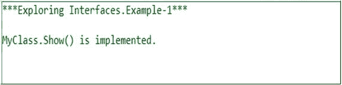

Points to Remember

如果我们试图实现一个接口，我们需要匹配方法签名。

学生问:

先生，如果这些方法不完整，那么使用接口的类需要实现接口中的所有方法。这是正确的吗？

老师说:正是。如果类不能全部实现，它会通过将自己标记为抽象来宣布它的不完整性。下面的例子将帮助你更好地理解这一点。

这里，我们的接口有两个方法。但是一个类只实现了一个。所以，类本身变得抽象了。

```cs
interface IMyInterface
    {
        void Show1();
        void Show2();
    }
 //MyClass becomes abstract. It has not implemented Show2() of  //IMyInterface
    abstract class MyClass2 : IMyInterface
    {
        public void Show1()
        {
            Console.WriteLine("MyClass.Show1() is implemented.");
        }
        public abstract void Show2();
    }

```

### 分析

公式是一样的:一个类需要实现接口中定义的所有方法；否则，它就是一个抽象类。

如果你忘记实现`Show2()`并且没有用`abstract` `keyword`标记你的类，如下…

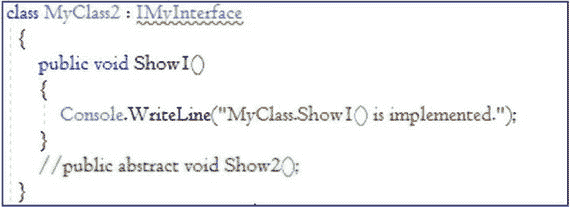

编译器将引发以下错误。

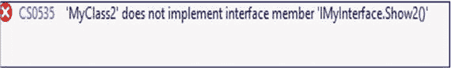

学生问:

先生，在这种情况下，MyClass2 的一个子类只需实现 Show2()就可以完成任务。这是正确的吗？

老师说:是的。“演示 2”是一个完整的例子。

## 演示 2

```cs
using System;

namespace InterfaceEx2
{
    interface IMyInterface
    {
        void Show1();
        void Show2();
    }
    //MyClass becomes abstract. It has not implemented Show2() of  IMyInterface
    abstract class MyClass2 : IMyInterface
    {
        public void Show1()
        {
            Console.WriteLine("MyClass.Show1() is implemented.");
        }
        public abstract void Show2();
    }
    class ChildClass : MyClass2
    {
        public override void Show2()
        {
            Console.WriteLine("Child is completing -Show2() .");
        }
    }

    class Program
    {
        static void Main(string[] args)
        {
            Console.WriteLine("***Exploring Interfaces.Example-2***\n");
            //MyClass is abstract now
            //MyClass myClassOb = new MyClass();
            MyClass2 myOb = new ChildClass();
            myOb.Show1();
            myOb.Show2();
            Console.ReadKey();
        }
    }
}

```

### 输出

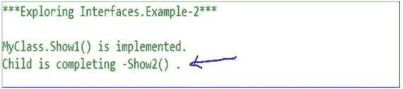

学生问:

先生，您之前说过接口可以帮助我们实现多重继承的概念。我们的类可以实现两个或者更多的接口吗？

老师说:是的。下面的例子向您展示了如何做到这一点。

## 演示 3

```cs
using System;

namespace InterfaceEx3
{
    interface IMyInterface3A
    {
        void Show3A();
    }
    interface IMyInterface3B
    {
        void Show3B();
    }
    class MyClass3 :IMyInterface3A, IMyInterface3B
    {
        public void Show3A()
        {
           Console.WriteLine("MyClass3 .Show3A() is completed.");
        }
        public void Show3B()
        {
           Console.WriteLine("MyClass3 .Show3B() is completed.");
        }
    }
class Program
    {
        static void Main(string[] args)
        {
            Console.WriteLine("***Exploring Interfaces.Example-3***\n");
            MyClass3 myClassOb = new MyClass3();
            myClassOb.Show3A();
            myClassOb.Show3B();
            Console.ReadKey();
        }
    }

```

### 输出

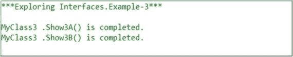

学生问:

在前面的程序中，方法名称在接口中是不同的。但是如果两个接口包含相同的方法名，我们如何实现它们呢？

老师说:很好的问题。我们需要使用显式接口实现的概念。在显式接口实现中，方法名前面是接口名，比如<interfacename>。methodname (){…}。让我们看一下下面的实现。</interfacename>

## 演示 4

```cs
using System;

namespace InterfaceEx4
{
    //Note: Both of the interfaces have the same method name //"Show()".
    interface IMyInterface4A
    {
        void Show();
    }
    interface IMyInterface4B
    {
        void Show();
    }
    class MyClass4 : IMyInterface4A, IMyInterface4B
    {
        public void Show()
        {
            Console.WriteLine("MyClass4 .Show() is completed.");
        }

        void IMyInterface4A.Show()
        {
            Console.WriteLine("Explicit interface Implementation.IMyInterface4A .Show().");
        }

        void IMyInterface4B.Show()
        {
            Console.WriteLine("Explicit interface Implementation.IMyInterface4B .Show().");
        }
    }
    class Program
    {
        static void Main(string[] args)
        {
            Console.WriteLine("***Exploring Interfaces.Example-4***\n");

            //All the 3 ways of callings are fine.
            MyClass4 myClassOb = new MyClass4();
            myClassOb.Show();

            IMyInterface4A inter4A = myClassOb;
            inter4A.Show();

            IMyInterface4B inter4B = myClassOb;
            inter4B.Show();

            Console.ReadKey();
        }
    }

```

### 输出

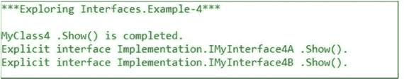

Points to Remember

*   我们必须注意一个有趣的事实。当我们显式地实现接口方法时，我们不会将关键字 public 附加到它们上面。但是在隐式实现中，这是必要的。
*   根据 MSDN 的说法:“显式接口成员实现包含访问修饰符是编译时错误，包含修饰符抽象、虚拟、重写或静态是编译时错误。”
*   如果一个类(或结构)实现一个接口，那么它的实例隐式转换为接口类型。这就是为什么我们可以毫无错误地使用下面的行:

    ```cs
    IMyInterface4A inter4A = myClassOb;

    ```

    或

    ```cs
    IMyInterface4B inter4B = myClassOb;

    ```

在此示例中，myClassOb 是 MyClass4 类的一个实例，它实现了两个接口—IMyInterface4A 和 IMyInterface4B。

学生问:

一个接口可以继承或实现另一个接口吗？

老师说:可以继承但不能实现(按定义)。考虑下面的例子。

## 演示 5

```cs
using System;

namespace InterfaceEx5
{
    interface Interface5A
    {
        void ShowInterface5A();
    }
    interface Interface5B
    {
        void ShowInterface5B();
    }
    //Interface implementing multiple inheritance
    interface Interface5C :Interface5A, Interface5B
    {
        void ShowInterface5C();
    }
    class MyClass5 : Interface5C
    {
        public void ShowInterface5A()
        {
            Console.WriteLine("ShowInterface5A() is completed.");
        }

        public void ShowInterface5B()
        {
            Console.WriteLine("ShowInterface5B() is completed.");
        }

        public void ShowInterface5C()
        {
            Console.WriteLine("ShowInterface5C() is completed.");
        }
    }

    class Program
    {
        static void Main(string[] args)
        {
            Console.WriteLine("***Exploring Interfaces.Example-5***");
            Console.WriteLine("***Concept of multiple inheritance through
            interface***\n");

            MyClass5 myClassOb = new MyClass5();
            Interface5A ob5A = myClassOb;
            ob5A.ShowInterface5A();

            Interface5B ob5B = myClassOb;
            ob5B.ShowInterface5B();

            Interface5C ob5C = myClassOb;
            ob5C.ShowInterface5C();

            Console.ReadKey();
        }
    }
}

```

### 输出

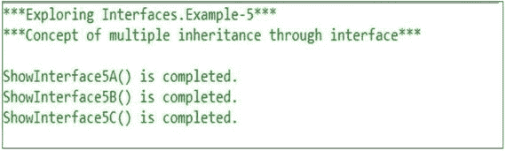

### 恶作剧

预测产量。

```cs
using System;

namespace InterfaceEx6
{
    interface Interface6
    {
        void ShowInterface6();
    }
    class MyClass6 : Interface6
    {
        void Interface6.ShowInterface6()
        {
            Console.WriteLine("ShowInterface6() is completed.");
        }
    }
    class Program
    {
        static void Main(string[] args)
        {
            MyClass6 myClassOb = new MyClass6();
            myClassOb.ShowInterface6();//Error
            //Interface6 ob6 = myClassOb;
            //ob6.ShowInterface6();
            Console.ReadKey();
        }
    }
}

```

### 输出

存在编译错误。

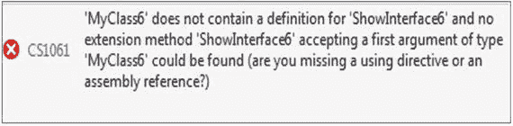

### 分析

您可以看到，我们已经显式地实现了接口。根据语言规范，要访问显式接口成员，我们需要使用接口类型。要克服这个错误，您可以使用以下代码行(即，取消前面显示的两行的注释):

```cs
     Interface6 ob6 = myClassOb;
     ob6.ShowInterface6();

```

然后，您将获得以下输出:

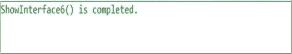

或者，您可以使用以下代码行获得相同的输出:

```cs
((Interface6)myClassOb).ShowInterface6();

```

学生问:

我们可以从一个类扩展，同时实现一个接口吗？

老师说:是的。你总是可以从一个类扩展(只要它不是密封的或者没有其他类似的约束)。在这种情况下，建议您使用位置符号。首先定位父类，然后是逗号，最后是接口名称，如下所示:

```cs
Class ChildClass: BaseClass,IMyinterface{...}

```

学生问:

为什么我们需要显式接口方法？

老师说:如果你仔细观察，你会发现显式接口的真正威力是当我们在两个或更多不同的接口中有相同的方法签名时。虽然他们的签名相同，但目的可能不同；例如，如果我们有两个接口——ITriangle 和 I rectangle——并且都包含一个具有相同签名的方法(例如，`BuildMe()`),您可以假设 I triangle 中的`BuildMe()`可能想要构建一个三角形；而 IRectangle 中的`BuildMe()`可能想要构建一个矩形。因此，希望您能够根据情况调用适当的`BuildMe()`方法。

## 标签/标记/标记界面

老师继续说:一个空的接口被称为标签/标记/标记接口。

```cs
//Marker interface example

interface IMarkerInterface
{
}

```

学生问:

先生，为什么我们需要一个标记界面？

老师说:

*   我们可以创造一个共同的父母。(值类型不能从其他值类型继承，但可以实现接口。我们将很快了解值类型)。
*   如果一个类(或一个结构)实现了一个接口，那么它的实例将隐式转换为接口类型。如果一个类实现了一个标记接口，就不需要定义一个新的方法(因为接口本身没有任何这样的方法)。
*   我们可以使用带有标记接口的扩展方法来克服程序中的一些挑战。

Note

MSDN 建议你不要使用标记接口。他们鼓励你使用属性的概念。属性和扩展方法的详细讨论超出了本书的范围。

老师问:

你能告诉我抽象类和接口的区别吗？

学生说:

*   抽象类可以完全实现，也可以部分实现；也就是说，在抽象类中，我们可以有具体的方法，但是接口不能有。接口包含行为的契约。(虽然在 Java 中，这个定义略有修改。从 Java 8 开始，我们可以在接口中使用默认关键字来提供方法的默认实现。
*   一个抽象类只能有一个父类(它可以从另一个抽象类或具体类扩展而来)。一个接口可以有多个父接口。一个接口只能从其他接口扩展。
*   默认情况下，接口的方法是公共的。抽象类可以有其他风格(例如，私有的、受保护的等等。).
*   在 C# 中，接口中不允许有字段。抽象类可以有字段(静态的和非静态的，有不同种类的修饰符)。

所以，如果你写了这样的东西:

```cs
interface IMyInterface
    {
        int i;//Error:Cannot contain fields
    }

```

您将收到一个编译器错误。


但是，下面的代码没有问题:

```cs
abstract class MyAbstractClass
    {
        public static int i=10;
        internal int j=45;
    }

```

学生问:

先生，我们如何决定我们应该使用抽象类还是接口呢？

老师说:好问题。我相信如果我们想要集中的或者默认的行为，抽象类是一个更好的选择。在这些情况下，我们可以提供默认实现，它在所有子类中都可用。另一方面，接口实现从零开始。它们指明了某种关于要做什么的规则/契约(例如，您必须实现该方法)，但是它们不会强制您执行该方法的哪一部分。此外，当我们试图实现多重继承的概念时，接口是首选。

但与此同时，如果我们需要向一个接口添加一个新方法，那么我们需要跟踪该接口的所有实现，并且我们需要将该方法的具体实现放在所有这些地方。前面是一个抽象类。我们可以在具有默认实现的抽象类中添加一个新方法，我们现有的代码将会顺利运行。

MSDN 提供以下建议:(可以参考这个在线讨论: [`https://stackoverflow.com/questions/20193091/recommendations-for-abstract-classes-vs-interfaces`](https://stackoverflow.com/questions/20193091/recommendations-for-abstract-classes-vs-interfaces) )

*   如果您希望创建组件的多个版本，请创建一个抽象类。抽象类为组件版本化提供了一种简单易行的方法。通过更新基类，所有继承类都会随着更改而自动更新。另一方面，接口一旦创建就不能更改。如果需要接口的新版本，您必须创建一个全新的接口。
*   如果您正在创建的功能将对各种不同的对象有用，请使用接口。抽象类应该主要用于密切相关的对象；而接口最适合为不相关的类提供公共功能。
*   如果你正在设计小而简洁的功能，使用接口。如果您正在设计大型功能单元，请使用抽象类。
*   如果希望在组件的所有实现中提供通用的已实现功能，请使用抽象类。抽象类允许您部分实现您的类；而接口不包含任何成员的实现。

学生问:

先生，我们能把接口密封起来吗？

老师说:实现一个接口的责任完全留给了开发者。那么，如果你把接口密封了，那么谁来实现那个接口的不完整的方法呢？基本上，你试图同时实现两个相反的构造。

在下面的声明中，Visual Studio IDE 会引发错误。

## 演示 6

```cs
using System;

namespace Test_Interface
{
    sealed interface IMyInterface
    {

      void Show();
    }
    class Program
    {
        static void Main(string[] args)
        {
            //some code
        }
    }
}

```

### 输出

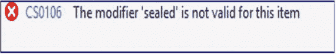

学生问:

先生，我们可以在接口方法前使用关键字“抽象”吗？

老师说:有必要这样做吗？微软明确声明接口不能包含方法的实现；也就是说，它们是抽象的。在 Visual Studio IDE 中，如果您编写如下代码，您将会看到一个编译时错误:

## 演示 7

```cs
interface IMyInterface
    {
      abstract void Show();
    }

```

### 输出


现在从前面的示例中删除关键字 abstract，构建您的程序，然后打开 ILcode。你可以看到它已经被标记为虚拟和抽象。

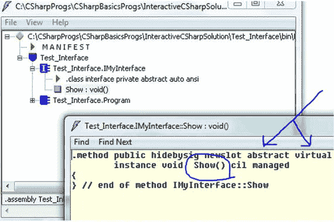

学生问:

先生，我们知道界面非常强大。但与此同时，我们也看到了许多与之相关的限制。您能总结一下与界面相关的主要限制吗？

老师说:以下是其中的一些，不包括最基本的。

我们不能在接口中定义任何字段、构造函数或析构函数。此外，您不应该使用访问修饰符，因为它们隐含地是公共的。

不允许嵌套类型(例如，类、接口、枚举和结构)。所以，如果你像这样写代码:

```cs
interface IMyInterface
    {
      void Show();
      class A { }
    }

```

编译器会报错，如下所示:


不允许接口从类或结构继承，但它可以从另一个接口继承。所以，如果你像这样写代码:

```cs
class A { }
interface IB : A { }

```

编译器会报错，如下所示:


学生问:

先生，您能总结一下使用界面的好处吗？

老师说:在很多情况下，界面是非常有用的，比如在下面:

*   当我们试图实现多态时
*   当我们试图实现多重继承的概念时
*   当我们试图开发松散耦合的系统时
*   当我们试图支持平行发展时

学生问:

先生，为什么我们需要这样的限制，“一个接口不能从一个类继承”？

老师说:一个类或结构可以有一些实现。所以，如果我们允许一个接口从它们继承，接口可能包含实现，这违背了接口的核心目标。

## 摘要

本章回答了以下问题:

*   什么是接口？
*   你如何设计一个界面？
*   接口的基本特征是什么？
*   如何实现多个接口？
*   如何处理拥有同名方法的接口？
*   有哪些不同类型的接口？
*   你如何处理显式接口技术？
*   为什么我们需要显式接口方法？
*   什么是标记接口？
*   抽象类和接口的区别是什么？
*   我们如何决定我们应该使用抽象类还是接口？
*   与接口相关的主要限制是什么？