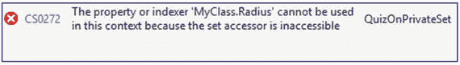
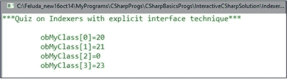

# 六、将属性和索引器用于封装

## 属性概述

教师开始讨论:我们已经知道封装是面向对象编程的关键特征之一。在 C# 中，属性非常重要，因为它们有助于封装对象状态。属性是提供灵活机制来读取、写入或计算私有字段值的成员。最初，属性可能看起来类似于字段，但实际上它们要么附加了 get，要么附加了 set，或者同时附加了这两个块。这些特殊的块/方法被称为访问器。简单地说，get 块用于读取目的，set 块用于分配目的。

在下面的代码中，我们将研究如何获得对获取或设置私有成员值的完全控制。除了这种类型的控制和灵活性，我们还可以对属性施加一些约束，这些特征使它们在本质上是独一无二的。

## 演示 1

```cs
using System;

namespace PropertiesEx1
{
    class MyClass
    {
        private int myInt; // also called private "backing" field
        public int MyInt   // The public property
        {
            get
            {
                return myInt;
            }
            set
            {
                myInt = value;
            }
        }
    }
    class Program
    {
        static void Main(string[] args)
        {
            Console.WriteLine("***Exploring Properties.Example-1***");
            MyClass ob = new MyClass();
            //ob.myInt = 10;//Error: myInt is inaccessible
            //Setting  a new value
            ob.MyInt = 10;//Ok.We'll get 10
            //Reading the value
            Console.WriteLine("\nValue of myInt is now:{0}", ob.MyInt);
            //Setting another value to myInt through MyInt
            ob.MyInt = 100;
            Console.WriteLine("Now myInt value is:{0}", ob.MyInt);//100
            Console.ReadKey();
        }
    }
}

```

### 输出


### 分析

如果使用`ob.myInt=10;`，编译器将会引发一个问题，如下所示:


但是，您可以看到，使用 myInt 属性，我们可以完全控制获取或设置私有字段 MyInt。

*   请注意命名约定:为了更好的可读性和理解，我们只是将私有字段名称的开头字母替换为相应的大写字母(在本例中，myInt 的 M 替换为 M)。
*   注意上下文关键字值。它是与属性相关联的隐式参数。我们通常用它来做作业。
*   有时，存储由公共属性公开的数据的私有字段被称为后备存储或后备字段。因此，myInt 是前面示例中的私有支持字段。
*   对于属性，可以使用以下任何修饰符:public、private、internal、protected、new、virtual、abstract、override、sealed、static、unsafe 和 extern。

学生问:

主席先生，我们如何透过物业来施加约束/限制？

老师说:假设您想要一个约束，如果想要的值在 10 到 25 之间，用户可以设置一个值(在前面的程序中)。否则，系统将保留以前的值。这种类型的约束可以通过属性轻松实现。在这种情况下，要实现此约束，我们可以按如下方式修改 set 块:

```cs
      set
            {
                //myInt = value;
                /*Imposing a condition:
                  value should be in between 10 and 25.
                  Otherwise, you'll retain the old value*/
                if ((value >= 10) && (value <= 25))
                {
                    myInt = value;
                }
                else
                {
                    Console.WriteLine("The new value {0} cannot be set", value);
                    Console.WriteLine("Please choose a value between 10 and 25");
                }
            }

```

现在，如果您再次运行该程序，您会收到以下输出:


老师继续说:当我们处理一个只有一个访问器的属性时，我们称之为只读属性。

以下是只读属性:

```cs
......
   private int myInt;
   public int MyInt
     {
        get
        {
           return myInt;
        }
   //set accessor is absent here
     }

```

只设置了访问器的属性称为只写属性。以下是只写属性的示例:

```cs
......
      private int myInt;
      public int MyInt
      {
           //get accessor is absent here
          set
          {
              myInt = value;
          }
      }

```

通常，我们有两个访问器，这些属性被称为读写属性。在演示 1 中，我们使用了读写属性。

从 C# 3.0 开始，我们可以减少与属性相关的代码长度。考虑以下代码:

```cs
//private int myInt;
public int MyInt
{
    //get
    //{
    //    return myInt;
    //}
    //set
    //{
    //    myInt = value;
    //}
    get;set;

}

```

我们用一行代码替换了演示 1 中使用的九行代码。这种声明被称为自动属性声明。在这种情况下，编译器将为我们输入预期的代码，以使我们的生活更加轻松。

### 减少代码大小

假设您有一个只读属性，如下所示:

```cs
class MyClass
    {
        private double radius = 10;
        public double Radius
        {
            get { return radius; }

        }
    }

```

您可以通过使用表达式主体属性(在 C# 6.0 中引入)来减少代码大小，如下所示:

```cs
class MyClass
    {
        private double radius = 10;
        //Expression bodied properties (C#6.0 onwards)
        public double Radius => radius;
    }

```

您可以看到，两个大括号和关键字 get 和 return 被替换为符号'`=>`'。

如果您打开 IL 代码，您会看到这些属性访问器在内部被转换为`get_MethodName()`和`set_MethodName()`。您可以检查它们的返回类型；例如，在这里我们得到的方法有

```cs
public int get_MyInt() {...}

```

和

```cs
public void set_MyInt(){...}

```

考虑下面的代码和相应的 IL 代码。

## 演示 2

```cs
using System;

namespace Test4_Property
{
    class MyClass
    {
        //private int myInt;
        public int MyInt
        {
           //automatic property declaration
           get;set;
        }
    }
    class Program
    {
        static void Main(string[] args)
        {
            Console.WriteLine("***Exploring Properties.Example-1***");
            MyClass ob = new MyClass();
            //ob.myInt = 1;//Error:myInt is inaccessible
            //Setting  a new value
            ob.MyInt = 106;//Ok.We'll get 106
            //Reading the value
            Console.WriteLine("\nValue of myInt is now:" + ob.MyInt);
            Console.ReadKey();
        }
    }
}

```

### 密码是什么


Points to Remember

从 C# 6 开始，我们可以使用如下的属性初始化器:

```cs
public int MyInt2
      {
          //automatic property declaration
          get; set;
      } = 25;//Automatic initialization

```

这意味着 MyInt2 是用值 25 初始化的。我们也可以通过移除 set 访问器来使它成为只读的。

在 C# 7.0 中，我们可以进一步减少代码，如下所示:


您必须检查编译器版本是否设置为版本 7。如果您的编译器设置为 C#6.0 或更低版本，对于该代码块，您将得到以下错误:


在撰写本文时，我不需要做任何更改，因为对我来说，C# 7.0 是默认设置。

要检查您的语言版本，您可以转到项目属性，然后构建，然后高级构建设置，然后语言版本。也可以参考下面的截图，供大家参考。


学生问:

先生，似乎如果我们有一个 set 访问器，我们可以使它成为私有的，在这种情况下，它的行为就像一个只读属性。这是正确的吗？

老师说:是的。即使您使它受到保护，也意味着您不希望将它公开给其他类型。

学生问:

主席先生，为什么我们要选择公共财产而不是公共领域？

老师说:用这种方法，你可以促进封装，这是面向对象的关键特性之一。

学生问:

先生，我们什么时候应该使用只读属性？

老师说:创建不可变类型。

## 虚拟财产

老师继续说:我们之前说过，我们可以用不同类型的修饰符创建不同类型的属性。我们在这里挑选了其中的两个。考虑下面的代码。

## 演示 3

```cs
using System;

namespace VirtualPropertyEx1
{
  class Shape
    {
        public virtual double Area
        {
            get
            {
                return 0;
            }
        }
    }
    class Circle : Shape
    {
        int radius;
        public Circle(int radius)
        {
            this.radius = radius;

        }
        public int Radius
        {
            get
            {
                return radius;
            }
        }
        public override double Area
        {
            get
            {
                return 3.14 * radius * radius;
            }
        }
    }
    class Program
    {
        static void Main(string[] args)
        {

            Console.WriteLine("***Case study with a virtual Property***");
            Circle myCircle = new Circle(10);
            Console.WriteLine("\nRadius of the Cricle is {0} Unit", myCircle.Radius);
            Console.WriteLine("Area of the Circle is {0} sq. Unit",myCircle.Area);
            Console.ReadKey();
        }
    }
}

```

### 输出


## 抽象属性

如果用以下代码替换 VirtualPropertyEx1 中的 Shape 类:

```cs
abstract class

Shape
    {
      public abstract double Area
        {
            get;
        }
    }

```

再次运行这个程序，你会得到同样的输出。但是这次你使用了一个抽象属性。

Points to Remember

我们已经使用了继承修饰符，例如 abstract、virtual 和 override，以及属性的例子。我们也可以使用其他继承修饰符，比如 new 和 sealed。

除此之外，属性可以与所有的访问修饰符相关联(公共的、私有的、受保护的和内部的)；静态修饰符(static)；和非托管代码修饰符(不安全的、外部的)。

### 恶作剧

你能预测产量吗？

```cs
using System;

namespace QuizOnPrivateSetProperty
{
    class MyClass
    {
        private double radius = 10;
        public double Radius => radius;
        public double Area => 3.14 * radius * radius;
    }
    class Program
    {
        static void Main(string[] args)
        {
            Console.WriteLine("***Quiz on Properties***");
            MyClass ob = new MyClass();
            Console.WriteLine("Area of the circle is {0} sq. unit", ob.Area);
            Console.ReadKey();
        }
    }
}

```

### 输出


### 分析

你可以看到，这里我们使用了表达式体属性(从 C# 6.0 开始可用)。

### 恶作剧

你能预测产量吗？

```cs
using System;
namespace QuizOnPrivateSet
{
    class MyClass
    {
        private double radius = 10;
        public double Radius
        {
            get
            {
                return radius;
            }
             private set
            {
                radius = value;
            }
        }
        public double Area => 3.14 * radius * radius;
    }
    class Program
    {
        static void Main(string[] args)
        {
            Console.WriteLine("***Quiz on Properties***");
            MyClass ob = new MyClass();
            ob.Radius = 5;
            Console.WriteLine("Radius of the circle {0} unit", ob.Radius);
            Console.WriteLine("Area of the circle is {0} sq. unit", ob.Area);
            Console.ReadKey();
        }
    }
}

```

### 输出



### 分析

请注意，set 访问器前面有关键字 private。

## 索引器

考虑下面的程序和输出。

## 演示 4

```cs
using System;

namespace IndexerEx1
{
    class Program
    {
        class MySentence
        {
            string[] wordsArray;
            public MySentence( string mySentence)
            {
                wordsArray = mySentence.Split();
            }
            public string this[int index]
            {
                get
                {
                    return wordsArray[index];
                }
                set
                {
                    wordsArray[index] = value;
                }
            }
        }
        static void Main(string[] args)
        {
            Console.WriteLine("***Exploring Indexers.Example-1***\n");
            string mySentence = "This is a nice day.";
            MySentence sentenceObject = new MySentence(mySentence);
            for (int i = 0; i < mySentence.Split().Length; i++)
            {
                Console.WriteLine("\t sentenceObject[{0}]={1}",i,sentenceObject[i]);
            }
            Console.ReadKey();
        }
    }
}

```

### 输出


### 分析

我们看到了这个项目的一些有趣的特点。

*   程序类似于 properties，但关键区别在于 property 的名字是这个。
*   我们像数组一样使用索引参数。这些被称为索引器。我们可以把一个类或结构或接口的实例看作数组。this 关键字用于引用实例。

Points to Remember

*   所有的修饰符——私有的、公共的、受保护的、内部的——都可以用于索引器(就像属性一样)。
*   返回类型可以是任何有效的 C# 数据类型。
*   我们可以创建一个有多个索引器的类型，每个索引器有不同类型的参数。
*   通常，我们可以通过消除 set 访问器来创建只读索引器。尽管它在语法上是正确的，但是建议您在这些场景中使用方法(例如，使用方法来检索与雇员 ID 相对应的雇员信息总是好的)。所以，你应该避免这样:

    ```cs
    //NOT a recommended style
    Class Employee{
      //using indexers to get employee details
                public string this[int empId]
                {
                    get
                    {
                        //return Employee details
                    }
               }
    }

    ```

老师继续说:让我们来看另一个演示。在下面的程序中，我们使用了一个字典来保存一些雇员的名字和他们的薪水。然后我们就在想办法看他们工资的上限。如果在我们的字典中找不到员工，我们会说没有找到记录。

要使用字典类，我们需要在程序中包含下面一行，因为该类是在那里定义的:


```cs
 using System.Collections.Generic;

```

字典是一个集合和一对。它使用散列表数据结构来存储一个键及其相应的值。该机制非常快速和高效。建议你多了解字典。你应该首先明白

```cs
employeeWithSalary = new Dictionary<string, double>();

employeeWithSalary.Add("Amit",20125.87);

```

在前面两行代码中，我们创建了一个字典，然后使用了它的`Add`方法。在这个字典中，每当我们想要添加数据时，第一个参数应该是字符串，第二个应该是双精度。因此，我们可以添加一个 Employee Amit(一个字符串变量)和 salary(一个 double 变量)作为字典元素。对于字典中的其余元素，我们遵循相同的过程。浏览程序，然后分析输出。

## 演示 5

```cs
using System;
using System.Collections.Generic;

namespace IndexerQuiz1
{
    class EmployeeRecord
    {
        Dictionary<string, double> employeeWithSalary;
        public EmployeeRecord()
        {
            employeeWithSalary = new Dictionary<string, double>();
            employeeWithSalary.Add("Amit",20125.87);
            employeeWithSalary.Add("Sam",56785.21);
            employeeWithSalary.Add("Rohit",33785.21);
        }
        public bool this[string index, int predictedSalary]
        {
            get
            {
                double salary = 0.0;
                bool foundEmployee = false;
                bool prediction = false;
                foreach (string s in employeeWithSalary.Keys)
                {

                    if (s.Equals(index))
                    {
                        foundEmployee = true;//Employee found
                        salary = employeeWithSalary[s];//Employees
                        //actual salary
                        if( salary>predictedSalary)
                        {
                            //Some code
                            prediction = true;
                        }
                        else
                        {
                            //Some code
                        }
                     break;
                    }
                }
                if(foundEmployee == false)
                {
                  Console.WriteLine("Employee {0} Not found in our database.", index);
                }
                return prediction;
            }
        }
    }

    class Program
    {
       static void Main(string[] args)
       {
         Console.WriteLine("***Quiz on Indexers***\n");
            EmployeeRecord employeeSalary = new EmployeeRecord();
            Console.WriteLine("Is Rohit's salary is more than 25000$ ?- {0}", employeeSalary["Rohit",25000]);//True
            Console.WriteLine("Is Amit's salary is more than 25000$ ?- {0}", employeeSalary["Amit",25000]);//False
            Console.WriteLine("Is Jason's salary is more than 10000$ ?-{0}", employeeSalary["Jason",10000]);//False
            Console.ReadKey();
       }
    }
}

```

### 输出


### 分析

我介绍这个程序是为了展示我们可以使用不同类型参数的索引器。

学生问:

先生，我们可以在同一个类中有多个索引器吗？

老师说:是的。但是在这种情况下，方法签名必须彼此不同。

学生问:

先生，那么索引器可以重载吗？

老师说:是的。

学生问:

先生，到目前为止，索引器看起来像数组。数组和索引器有什么区别？

老师说:是的。甚至有时开发人员将索引器描述为虚拟数组。但是这里有一些关键的区别:

*   索引器可以接受非数字下标。我们已经测试过了。
*   索引器可以重载，但数组不能。
*   索引器值不属于变量。因此，它们不能用作 ref 或 out 参数，而数组可以。

## 接口索引器

学生问:

先生，我们如何使用带接口的索引器？

老师说:接下来是一个例子，我们用索引器隐式实现了一个接口。在我们继续之前，我们需要记住接口索引器和类索引器之间的关键区别。

*   接口索引器没有主体。(注意，在下面的演示中，get 和 set 只带有分号。)
*   接口索引器没有修饰符。

## 演示 6

```cs
using System;

namespace IndexerEx2
{
    interface IMyInterface
    {
        int this[int index] { get; set; }
    }
    class MyClass : IMyInterface
    {
        //private int[] myIntegerArray;
        private int[] myIntegerArray = new int[4];
        public int this[int index]
        {
            get
            {
                return myIntegerArray[index];
            }
            set
            {
                myIntegerArray[index] = value;
            }
        }
    }
    class Program
    {
        static void Main(string[] args)
        {
            Console.WriteLine("***Exploring Indexers with interfaces***\n");
            MyClass obMyClass = new MyClass();
            //Initializing 0th, 1st and 3rd element using indexers
            obMyClass[0] = 10;
            obMyClass[1] = 20;
            obMyClass[3] = 30;
            for (int i = 0; i <4; i++)
            {
                // Console.WriteLine("\t obMyClass[{0}]={1}", i, obMyClass[i]);
                System.Console.WriteLine("Element #{0} = {1}", i, obMyClass[i]);
            }
            Console.ReadKey();
        }
    }
}

```

### 输出


### 恶作剧

代码会编译吗？

```cs
using System;

namespace IndexerQuiz2
{
    interface IMyInterface
        {
            int this[int index] { get; set; }
        }
    class MyClass : IMyInterface
    {
        private int[] myIntegerArray = new int[4];
        //Explicit interface implementation
        int IMyInterface.this[int index]
        {
            get => myIntegerArray[index];
            set => myIntegerArray[index] = value;
        }
    }
    class Program
        {
            static void Main(string[] args)
            {
            Console.WriteLine("***Quiz on Indexers with explicit interface technique***\n");
            MyClass obMyClass = new MyClass();
            IMyInterface interOb = (IMyInterface)obMyClass;
            //Initializing 0th, 1st and 3rd element using indexers
            interOb[0] = 20;
            interOb[1] = 21;
            interOb[3] = 23;
            for (int i = 0; i < 4; i++)
            {
                Console.WriteLine("\t obMyClass[{0}]={1}", i,interOb[i]);
            }
            Console.ReadKey();
            }
        }
    }

```

### 回答

是的。以下是输出:



### 分析

这是一个我们用索引器显式实现接口的例子。在这个例子中，我们使用了最新的 C# 7.0 特性(注意 get、set 主体)。

我们正在接触元素。


索引器的显式实现是非公共的(也是非虚拟的；即不能被覆盖)。因此，如果我们尝试使用 MyClass 对象`obMyClass`，而不是接口对象，就像前面的演示一样，我们将得到编译错误。

Points to Remember

*   接口索引器没有主体。
*   接口索引器没有修饰符。
*   从 C# 7.0 开始，我们可以这样写代码:

    ```cs
            public int MyInt
             {
                 get => myInt;
                 set => myInt = value;
             }

    ```

*   索引器的显式实现是非公共和非虚拟的。

## 摘要

本章涵盖了

*   不同类型的属性
*   自动属性
*   具有最新 c# 7.0 特性的表达式体属性
*   虚拟和抽象属性
*   为什么我们应该更喜欢公共财产而不是公共领域
*   属性与数组有何不同
*   如何通过属性施加约束/限制
*   何时使用只读属性，何时避免使用只读属性
*   索引。
*   索引器与属性有何不同
*   如何使用带有显式和隐式接口的索引器，以及要记住的限制
*   接口索引器与类索引器有何不同