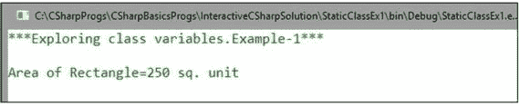

# 七、理解类变量

老师开始讨论:有时我们不想通过一个类型的实例来操作。相反，我们更喜欢研究类型本身。在这些场景中，我们想到了类变量或类方法的概念。它们通常被称为静态变量或静态方法。在 C# 中，类本身可以是静态的。一般来说，当我们将关键字 static 标记为一个类时，它就是一个静态类；当它被标记上一个方法时，它被称为静态方法；当我们把它和一个变量联系起来时，我们称之为静态变量。

## 类别变量

让我们从一个简单的例子开始。

## 演示 1

```cs
using System;

namespace StaticClassEx1
{
    static class Rectangle
    {
        public static double Area(double len, double bre)
        {
            return len * bre;
        }
    }
    class Program
    {
        static void Main(string[] args)
        {
            Console.WriteLine("***Exploring class variables.Example-1***\n");
            double length = 25;
            double breadth = 10;
            Console.WriteLine("Area of Rectangle={0} sq. unit", Rectangle.Area(length, breadth));
            Console.ReadKey();
        }
    }
}

```

### 输出



### 分析

可以看到我们通过类名调用了 Rectangle 类的`Area (..)`方法。我们在这里没有创建 Rectangle 类的任何实例。

学生问:

我们是否也可以创建 Rectangle 类的一个实例，然后调用 Area(..)方法？

老师说:不行，这里不允许。如果允许，那么还有必要引入静态类的概念吗？因此，如果您在 Visual Studio 中编写代码，并尝试引入如下代码行:

```cs
Rectangle rect = new Rectangle();//Error

```

您将得到以下编译错误。


学生问:

但是如果我们在 Rectangle 类中有一个非静态方法，我们如何访问这个方法呢？这一次，我们需要一个实例来访问该方法。

老师说:这就是为什么静态类有限制:它们只能包含静态成员。所以，如果你试着在我们的 Rectangle 类中放一个非静态方法，比如说`ShowMe()`，就像这样:


您将得到以下编译错误。


学生问:

我们不能从静态类创建实例。但是子类可以创建一个实例。在这种情况下，实际的概念可能会被误用。这种理解正确吗？

老师说:C# 的设计者已经注意到这个事实，因为我们不允许从静态类创建子类；也就是说，静态类不能被继承。因此，在我们之前的示例中，如果您尝试以下列方式创建非静态派生类(例如，ChildRectangle ):


您将得到一个编译错误。


学生问:

然后静态类被密封。这是正确的吗？

老师说:是的。如果您打开 IL 代码，您将看到以下内容:


老师继续说:你可能也注意到了，我们几乎在每个地方都使用控制台课程。这个类也是一个静态类。如果您右键单击控制台，然后按“转到定义”(或按 F12)，您将看到以下内容:


Points to Remember

*   静态类是密封的(即，它们不能被继承或实例化)。
*   它们只能包含静态成员。
*   静态类不能包含实例构造函数。
*   系统。控制台和系统。数学是静态类的常见例子。

## 关于静态方法的讨论

老师继续说:到目前为止，我们已经看到了带有一些静态方法的静态类。你知道关键字 static 是用来表示“奇异事物”的。在设计模式中，有一种模式叫做单例模式，它可以使用静态类。

有时，我们也认为静态方法更快(更多信息见 MSDN 的文章 [`https://msdn.microsoft.com/en-us/library/ms973852.aspx`](https://msdn.microsoft.com/en-us/library/ms973852.aspx) )。但是，关键是它们不能是任何实例的一部分。这就是为什么我们的`Main()`方法是静态的。

如果你注意到`Main()`方法，你可以看到它包含在一个非静态类(程序)中。因此，很明显，非静态类可以包含静态方法。为了详细探究这一点，让我们来看下面的程序，其中有一个包含静态和非静态方法的非静态类。

## 演示 2

```cs
using System;

namespace StaticMethodsEx1
{
    class NonStaticClass
    {
        //a static method
        public static void StaticMethod()
        {
            Console.WriteLine("NonStaticClass.StaticMethod");
        }
        //a non-static method
        public void NonStaticMethod()
        {
            Console.WriteLine("NonStaticClass.NonStaticMethod");
        }
    }

    class Program
    {
        static void Main(string[] args)
        {
            Console.WriteLine("***Exploring static methods
.Example-1***\n");
            NonStaticClass anObject = new NonStaticClass();
            anObject.NonStaticMethod();//Ok
            //anObject.StaticMethod();//Error
            NonStaticClass.StaticMethod();
            Console.ReadKey();
        }
    }
}

```

### 输出


如果取消对以下行的注释:

```cs
//anObject.StaticMethod();

```

您将收到以下错误:


现在考虑修改后的程序。我在这里引入了一个静态变量和一个实例变量，用静态和实例方法来分析它们。

## 演示 3

```cs
using System;

namespace StaticMethodsEx2
{
    class NonStaticClass
    {
        static int myStaticVariable = 25;//static variable
        int myInstanceVariable = 50;//instance variable
        //a static method
        public static void StaticMethod()
        {
            Console.WriteLine("NonStaticClass.StaticMethod");
            Console.WriteLine("myStaticVariable = {0}", myStaticVariable);//25
            //Console.WriteLine("StaticMethod->instance variable = {0}", myInstanceVariable);//error
        }
        //a non-static method
        public void NonStaticMethod()
        {
            Console.WriteLine("NonStaticClass.NonStaticMethod");
            Console.WriteLine("NonStaticMethod->static variable = {0}", myStaticVariable);//25 Ok
            //Console.WriteLine("myStaticVariable = {0}", this.myStaticVariable);//Error
            Console.WriteLine("myInstanceVariable = {0}", myInstanceVariable);//50
        }
    }

    class Program
    {
        static void Main(string[] args)
        {
            Console.WriteLine("***Exploring static methods
.Example-2***\n");
            NonStaticClass anObject = new NonStaticClass();
            anObject.NonStaticMethod();//Ok
            //anObject.StaticMethod();//Error
            NonStaticClass.StaticMethod();
            Console.ReadKey();
        }
    }
}

```

### 输出


### 分析

请注意注释行。它们中的每一个都可能导致编译错误。例如，如果取消对该行的注释:

```cs
//Console.WriteLine("myStaticVariable = {0}", this.myStaticVariable);//Error

```

它会导致以下错误:


因为这里也是实例引用。

老师继续:以后你会学到，在 C# 中，我们有扩展方法。(我们可以用新方法扩展现有类型，而不会影响类型的定义。)这些基本上是静态方法，但是使用实例方法语法调用，因此您可以将静态方法视为实例方法。它们最常用于 LINQ 查询运算符的上下文中。然而，对这些主题的详细讨论超出了本书的范围。

## 关于静态构造函数的讨论

我们可以使用静态构造函数来初始化任何静态数据，或者执行只需要运行一次的操作。我们不能直接调用静态构造函数(也就是说，我们不能直接控制静态构造函数何时被执行)。但是我们知道它会在以下两种情况下被自动调用:

*   在创建类型的实例之前。
*   当我们在程序中引用一个静态成员时。

考虑下面的程序和输出。

## 演示 4

```cs
using System;

namespace StaticConstructorEx1
{
    class A
    {
        static int StaticCount=0,InstanceCount=0;
        static A()
        {
            StaticCount++;
            Console.WriteLine("Static constructor.Count={0}",StaticCount);
        }
        public A()
        {
            InstanceCount++;
            Console.WriteLine("Instance constructor.Count={0}", InstanceCount);
        }
    }
    class Program
    {
        static void Main(string[] args)
        {
            Console.WriteLine("***Exploring static constructors***\n");
            A obA = new A();//StaticCount=1,InstanceCount=1
            A obB = new A();//StaticCount=1,InstanceCount=2
            A obC = new A();//StaticCount=1,InstanceCount=3
            Console.ReadKey();
        }
    }
}

```

### 输出


### 分析

从程序和输出中，我们看到静态构造函数只执行一次(不是每个实例)

如果您引入此代码:

```cs
static A(int A){ }

```

您将得到一个编译时错误。


如果您引入此代码:

```cs
public static A(){...}

```

您将得到以下编译时错误:


Points to Remember

*   静态构造函数对每种类型只执行一次。我们无法直接控制何时执行静态构造函数。但是我们知道，当我们试图实例化一个类型或者当我们试图访问该类型中的一个静态成员时，会自动调用一个静态构造函数。
*   一个类型只能有一个静态构造函数。它必须是无参数的，并且不接受任何访问修饰符。
*   按照声明顺序，静态字段初始值设定项在静态构造函数之前运行。
*   在没有静态构造函数的情况下，字段初始值设定项就在类型被使用之前执行，或者在运行时突发奇想的任何时候执行。

学生问:

什么时候应该使用静态构造函数？

老师说:写日志会很有用。它们还用于为非托管代码创建包装类。

## 摘要

本章涵盖了

*   静态类概念
*   静态方法和静态变量概念
*   静态构造函数概念
*   如何在 C# 中实现这些概念以及与之相关的限制
*   何时以及如何使用这些概念