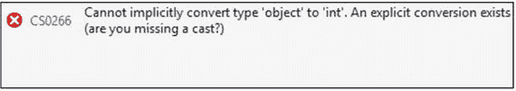

# 八、C# 中一些关键比较的分析

老师说:在这一章中，我们讨论了 C# 中一些常见的比较。我们开始吧。

## 隐式转换与显式转换

通过强制转换，我们可以将一种数据类型转换成另一种。有时我们称这种过程为类型转换。基本上，有两种类型的造型:隐式和显式。顾名思义，隐式转换是自动的，我们不需要担心它。但是，我们需要转换操作符来进行显式转换。除此之外，还有两种其他类型的转换:使用帮助器类的转换和用户定义的转换。在这一章中，我们将关注隐式和显式转换。让我们现在过一遍。

在隐式转换中，转换路径遵循从小到大的整数类型，或者从派生类型到基类型。

下面的代码片段将会完美地编译和运行:

```cs
int a = 120;
//Implicit casting
double b = a;//ok- no error

```

对于显式强制转换，考虑相反的情况。如果你写了这样的东西:

```cs
int c = b;//Error

```

编译器会抱怨。


所以，你需要写这样的东西:

```cs
//Explicit casting
int c = (int)b;//Ok

```

Points to Remember

如果一种类型可以转换为另一种类型，则可以应用铸造；也就是说，不能将字符串赋给整数。你总是会在这种尝试中遇到错误；例如，您总是会得到一个错误，即使您尝试对它应用 cast。


```cs
int d = ( int)"hello";//error

```

隐式和显式转换有一些基本的区别。隐式转换是类型安全的(没有数据丢失，因为我们是从一个小容器到一个大容器，我们有足够的空间)。显式转换不是类型安全的(因为在这种情况下，数据从一个大容器移动到一个小容器)。

学生问:

先生，当我们处理引用类型时，如何处理强制转换异常？

老师说:在这些场景中，我们将使用“is”或“as”运算符。我们稍后将讨论它们。

## 拳击对拳击

老师继续:现在我们来讨论另一个重要的话题:装箱和拆箱。这里我们需要处理值类型和引用类型。

对象(系统。对象)是所有类型的最终基类。因为 Object 是一个类，所以它是一个引用类型。当我们应用强制转换将值类型转换为对象类型(即引用类型)时，该过程称为装箱，相反的过程称为取消装箱。

通过装箱，值类型在堆上分配一个对象实例，然后将复制的值装箱(存储)到该对象中。

这里有一个拳击的例子:

```cs
int i = 10;
object o = i;//Boxing

```

现在考虑相反的情况。如果您尝试编写这样的代码:

```cs
object o = i;//Boxing
int j = o;//Error

```

您将面临编译错误。



为了避免这种情况，我们需要使用拆箱，就像这样:

```cs
object o = i;
int j = (int)o; //Unboxing

```

学生问:

哪种转换是隐式的:装箱还是取消装箱？

老师说:拳击。请注意，我们不需要编写这样的代码:

```cs
int i = 10;
object o = (object)i;
//object o=i; is fine since Boxing is implicit.

```

学生问:

装箱、拆箱和类型转换操作似乎是相似的。这是真的吗？

老师说:有时它可能看起来令人困惑，但如果你专注于基本规则，你可以很容易地避免困惑。通过这些操作(向上转换/向下转换，装箱/取消装箱)，我们试图将一件事转换成另一件事。这基本上是他们的相似之处。现在重点说说装箱拆箱的特长。装箱和取消装箱是值类型和对象类型(即引用类型)之间的转换。通过装箱，值类型的副本从堆栈移动到堆中，而取消装箱则执行相反的操作。所以，你基本上可以说，通过装箱，我们将值类型转换为引用类型(显然，取消装箱是这种操作的对应)。

但是从更广泛的意义上来说，使用“投射”这个词，我们的意思是说我们并没有在物体上移动或操作。我们只想转换它们的表面类型。

学生问:

先生，unboxing 和 downcasting(显式强制转换)的共同之处是什么？

两者都可能是不安全的，并且它们可能会引发 InvalidCastException。基本上，显式造型总是很危险的。考虑操作不安全的情况。假设你想把一个 long 转换成一个 int，你已经在下面的演示中写了这样的代码。

## 演示 1

```cs
 #region invalid casting
    long myLong = 4000000000;
    int myInt = int.MaxValue;
    Console.WriteLine(" Maximum value of int is {0}", myInt);
    //Invalid cast:Greater than maximum value of an integer
    myInt = (int) myLong;
     Console.WriteLine(" Myint now={0}", myInt);
  #endregion

```

### 输出


### 分析

您可以看到，您没有收到任何编译错误，但是整数 myInt 的最终值是不需要的。所以，这种转换是不安全的。

学生问:

"装箱和取消装箱会影响程序的性能."这是真的吗？

老师说:是的。它们会严重影响程序的性能。这里我们介绍了两个程序来分析。演示 2 分析选角的表现，演示 3 分析拳击的表现。请注意，强制转换或装箱操作所花费的时间总是会影响程序的性能，如果我们不断增加 for 循环结构中的迭代次数，这些时间会变得非常重要。

## 演示 2

```cs
using System;
using System.Diagnostics;

namespace CastingPerformanceComparison
{
    class Program
    {
        static void Main(string[] args)
        {
            Console.WriteLine("***Analysis of casting performance***\n");
            #region without casting operations
            Stopwatch myStopwatch1 = new Stopwatch();
            myStopwatch1.Start();
            for (int i = 0; i < 100000; i++)
            {
                int j = 25;
                int myInt = j;
            }
            myStopwatch1.Stop();
            Console.WriteLine("Time taken without casting : {0}", myStopwatch1.Elapsed);
            #endregion
            #region with casting operations
            Stopwatch myStopwatch2 = new Stopwatch();
            myStopwatch2.Start();
            for ( int i=0;i<100000;i++)
            {
                double myDouble = 25.5;
                int myInt = (int)myDouble;
            }
            myStopwatch2.Stop();
            Console.WriteLine("Time taken with casting: {0}", myStopwatch2.Elapsed);
            #endregion
            Console.ReadKey();
        }
    }
}

```

### 输出


### 分析

看到时差了吗？在铸造操作中，时间要长得多。当我们改变迭代次数时，这种差异也就不同了。(在您的机器上，您可以看到类似的差异，但在每次单独运行时，这些值可能会略有不同。)

## 演示 3

Note

我们在这里使用了泛型编程的简单概念。所以，一旦你理解了泛型的概念，你就可以回到这个程序。

```cs
using System;
using System.Collections.Generic;
using System.Diagnostics;//For Stopwatch

namespace PerformanceOfBoxing
{
    class Program
    {
        static void Main(string[] args)
        {
            Console.WriteLine("***Performance analysis in Boxing ***");
            List<int> myInts = new List<int>();
            Stopwatch myStopwatch1 = new Stopwatch();
            myStopwatch1.Start();
            for (int i = 0; i < 1000000; i++)
            {
            //Adding an integer to a list of Integers. So, there is no need of boxing.(Advantage of Generics)
                myInts.Add(i);
            }
            myStopwatch1.Stop();
            Console.WriteLine("Time taken without Boxing: {0}", myStopwatch1.Elapsed);

            //Now we are testing :Boxing Performance

            List<object> myObjects = new List<object>();
            Stopwatch myStopwatch2 = new Stopwatch();
            myStopwatch2.Start();
            for (int i = 0; i < 1000000; i++)
            {
                //Adding an integer to a list of Objects. So, there is need of boxing.
                myObjects.Add(i);
            }
            myStopwatch2.Stop();
            Console.WriteLine("Time taken with    Boxing :{0}", myStopwatch2.Elapsed);
            Console.ReadKey();
        }
    }
}

```

### 分析

再次注意时差。在拳击比赛中，时间要长得多。当我们改变迭代(循环)的次数时，这种差异也会改变。

### 输出


## 向上转换与向下转换

通过类型转换，我们试图改变对象的外观类型。在一个继承链中，我们可以从下往上走，也可以从上往下走。

通过向上转换，我们从一个子类引用中创建一个基类引用；对于向下转换，我们做相反的事情。

我们已经看到所有的足球运动员(一种特殊类型的运动员)都是运动员，但反过来就不一定了，因为有网球运动员、篮球运动员、曲棍球运动员等等。而且我们也看到了一个父类引用可以指向一个子类对象；也就是说，我们可以这样写

```cs
Player myPlayer=new Footballer();

```

(像往常一样，我们假设球员类是基类，球员类是从基类派生出来的)。这是向上抛的方向。在向上转换中，我们可以有以下注释:

*   它简单而含蓄。
*   当我们从一个子类引用创建一个基类引用时，这个基类引用可以对子对象有一个更严格的视图。

为了清楚地理解这几点，我们来看下面的例子。

## 演示 4

```cs
using System;

namespace UpVsDownCastingEx1
{
    class Shape
    {
        public void ShowMe()
        {
            Console.WriteLine("Shape.ShowMe");
        }
    }
    class Circle:Shape
    {
        public void Area()
        {
            Console.WriteLine("Circle.Area");
        }
    }
    class Rectangle:Shape
    {
        public void Area()
        {
            Console.WriteLine("Rectangle.Area");
        }
    }

    class Program
    {
        static void Main(string[] args)
        {
            Console.WriteLine("***Upcasting Example***\n");
            Circle circleOb = new Circle();
            //Shape shapeOb = new Circle();//upcasting
            Shape shapeOb = circleOb;//Upcasting
            shapeOb.ShowMe();
            //shapeOb.Area();//Error
            circleOb.Area();//ok
            Console.ReadKey();
        }
    }
}

```

### 输出


### 分析

请注意，我们已经使用以下代码行实现了向上转换:

```cs
Shape shapeOb = circleOb;//Upcasting
shapeOb.ShowMe();

```

您可以看到，尽管 shapeOb 和 circleOb 都指向同一个对象，但是 shapeOb 无法访问 circle 的 Area()方法(即，它对该对象具有限制性视图)。但是 circleOb 可以很容易地访问自己的方法。

学生问:

先生，为什么父参考在这个设计中有限制性的观点？

老师说:当父类被创建时，它不知道它的子类和它将要添加的新方法。因此，父类引用不应该访问专门的子类方法是有意义的。

老师继续说:如果你写了下面这样的东西，你是沮丧的。

```cs
Circle circleOb2 = (Circle)shapeOb;//Downcast

```

因为现在您正在从基类引用创建子类引用。

但是向下转换是显式的，不安全的，这种转换我们会遇到 InvalidCastException。

### 恶作剧

让我们修改 Main()方法，如下所示。(我们保持其余部分不变；也就是说，所有三个类别——Shape、Circle 和 Rectangle——都与前面的程序相同。现在预测输出。

```cs
static void Main(string[] args)
{
            Console.WriteLine("***Downcasting is unsafe demo***\n");
            Circle circleOb = new Circle();
            Rectangle rectOb = new Rectangle();
            Shape[] shapes = { circleOb, rectOb };
            Circle circleOb2 = (Circle)shapes[1];//Incorrect
            //Circle circleOb2 = (Circle)shapes[0];//Correct
            circleOb2.Area();
            Console.ReadKey();
}

```

### 输出

将引发运行时异常。


### 分析

这是一个我们在运行时会遇到 InvalidCastException()的例子。形状[1]是矩形对象，不是圆形对象。所以，如果你使用向下转换，你需要小心。

## 是与是

在某些情况下，我们经常需要动态检查一个对象的类型，这两个关键字在这里起着重要的作用。

关键字 is 与给定类型进行比较，如果可以进行强制转换，则返回 true，否则将返回 false。另一方面，as 可以将给定的对象转换为指定的类型，如果它是可转换的；否则，它将返回 null。

因此，我们可以说，使用 as 关键字，我们既可以进行强制转换能力检查，也可以进行转换。

## 演示 5:使用“is”关键字

这里我们稍微修改了一下程序，用三种不同的形状代替了两种不同的形状:三角形、矩形和圆形。我们将不同的形状存储在一个数组中，然后计算每个类别的总数。

```cs
using System;

namespace IsOperatorDemo
{
    class Shape
    {
        public void ShowMe()
        {
            Console.WriteLine("Shape.ShowMe");
        }
    }
    class Circle : Shape
    {
        public void Area()
        {
            Console.WriteLine("Circle.Area");
        }
    }
    class Rectangle : Shape
    {
        public void Area()
        {
            Console.WriteLine("Rectangle.Area");
        }
    }
    class Triangle : Shape
    {
        public void Area()
        {
            Console.WriteLine("Triangle.Area");
        }
    }

    class Program
    {
        static void Main(string[] args)
        {
            Console.WriteLine("***is operator demo***\n");
            //Initialization-all counts are 0 at this point
            int noOfCircle = 0, noOfRect = 0, noOfTriangle = 0;

            //Creating 2 different circle object
            Circle circleOb1 = new Circle();
            Circle circleOb2 = new Circle();
            //Creating 3 different rectangle object
            Rectangle rectOb1 = new Rectangle();
            Rectangle rectOb2 = new Rectangle();
            Rectangle rectOb3 = new Rectangle();
            //Creating 1 Triangle object
            Triangle triOb1 = new Triangle();
            Shape[] shapes = { circleOb1, rectOb1,circleOb2, rectOb2,triOb1,rectOb3 };
            for(int i=0;i<shapes.Length;i++)
            {
                if( shapes[i] is Circle)
                {
                   noOfCircle++;
                }
                else if (shapes[i] is Rectangle)
                {
                    noOfRect++;
                }
                else
                {
                    noOfTriangle++;
                }
            }
            Console.WriteLine("No of Circles in shapes array is {0}", noOfCircle);
            Console.WriteLine("No of Rectangles in shapes array is {0}", noOfRect);
            Console.WriteLine("No of Triangle in shapes array is {0}", noOfTriangle);

            Console.ReadKey();
        }
    }
}

```

### 输出


### 分析

看看这些代码段:


我们不是盲目地处理形状数组中的对象。一旦我们浏览了每一个，我们就可以控制它们是圆形、矩形还是三角形。如果这不是我们想要的类型，“如果条件”将为假，我们可以避免运行时意外。

因此，您总是可以测试这样一个简单的事实，即所有的圆都是形状，但是下面几行代码的情况正好相反:

```cs
Console.WriteLine("*****");
Shape s = new Shape();
Circle c = new Circle();
Console.WriteLine("Any Circle is a Shape?{0}", c is Shape);//True
Console.WriteLine("Any Shape is a Circle? {0}", (s is Circle));//False

```

### 输出


## 演示 6:使用“as”关键字

现在通过一个类似的程序。但是这一次，我们使用了 as 关键字，而不是 is 关键字。

```cs
using System;

namespace asOperatorDemo
{
    class Program
    {
        class Shape
        {
            public void ShowMe()
            {
                Console.WriteLine("Shape.ShowMe");
            }
        }
        class Circle : Shape
        {
            public void Area()
            {
                Console.WriteLine("Circle.Area");
            }
        }
        class Rectangle : Shape
        {
            public void Area()
            {
                Console.WriteLine("Rectangle.Area");
            }
        }
        static void Main(string[] args)
        {
            Console.WriteLine("***as operator demo***\n");
            Shape shapeOb = new Shape();
            Circle circleOb = new Circle();
            Rectangle rectOb = new Rectangle();
            circleOb = shapeOb as Circle; //no exception
            if( circleOb!=null)
            {
                circleOb.ShowMe();
            }
            else
            {
                Console.WriteLine("'shapeOb as Circle' is prodcuing null ");
            }
            shapeOb = rectOb as Shape;
            if (shapeOb != null)
            {
                Console.WriteLine("'rectOb as Shape' is NOT prodcuing null ");
                shapeOb.ShowMe();
            }
            else
            {
                Console.WriteLine(" shapeOb as Circle is prodcuing null ");
            }
            Console.ReadKey();
        }
    }
}

```

### 输出


### 分析

如果操作是可强制转换的，则运算符 as 会自动执行转换；否则，它返回 null。

Points to Remember

as 运算符将成功执行向下转换操作，否则将计算为 null(如果向下转换失败)。因此，我们在前面的程序中进行空值检查的方法在 C# 编程中非常常见。

## 通过值传递值类型与通过引用传递值类型(使用 ref 与 out)

老师继续说:我们已经知道值类型变量直接包含其数据，引用类型变量包含对其数据的引用。

因此，通过值向方法传递值类型变量意味着我们实际上是在向方法传递一个副本。因此，如果该方法对复制的参数进行任何更改，它对原始数据没有影响。如果您希望 caller 方法所做的更改反映回原始数据，您需要用 ref 关键字或 out 关键字通过引用传递它。

让我们看一下这个程序。

## 演示 7:按值传递值类型

```cs
using System;

namespace PassingValueTypeByValue
{
    class Program
    {

        static void Change(int x)
        {
            x = x * 2;
            Console.WriteLine("Inside Change(), myVariable is {0}", x);//50
        }
        static void Main(string[] args)
        {
            Console.WriteLine("***Passing Value Type by Value-Demo***");
            int myVariable = 25;
            Change(myVariable);
            Console.WriteLine("Inside Main(), myVariable={0}", myVariable);//25
            Console.ReadKey();
        }
    }
}

```

### 输出


### 分析

这里我们在 change()方法中做了一个改变。但是这个改变的值没有反映在 Change()方法之外，因为在 Main()方法内部，我们看到 myVariable 的值是 25。这是因为实际上所做的更改是在 myVariable 的副本上(或者换句话说，影响只是在局部变量 x 上)。

## ref 参数与 out 参数

老师继续说:现在考虑同样的程序，只做了一点小小的修改，如下所示(用箭头突出显示)。

## 演示 8


### 输出


### 分析

这里我们在 change()方法中做了一个改变。并且这个改变的值反映在 Change()方法之外。这里 ref 关键字已经完成了这个任务。对于 ref int x，我们不是指整数参数，而是指对 int(在本例中是 myVariable)的引用。

Points to Remember

我们需要在将 myVariable 传递给 ChangeMe()方法之前对其进行初始化；否则，我们会遇到编译错误。


老师继续说:现在考虑一个非常相似的程序。这次我们将展示 out 参数的用法。

## 演示 9:使用“out”参数

```cs
using System;

namespace PassingValueTypeUsingOut
{
    class Program
    {
        static void Change(out int x)
        {
            x = 25;
            x = x * 2;
            Console.WriteLine("Inside Change(), myVariable is {0}", x);//50
        }
        static void Main(string[] args)
        {
            Console.WriteLine("***Passing Value Type by Reference using out-Demo***");
            //Need to be initialized, if you use 'ref'
            int myVariable;
            Change(out myVariable);
            Console.WriteLine("Inside Main(), myVariable={0}", myVariable);//50
            Console.ReadKey();
        }
    }

```

### 输出


### 分析

这里我们取得了类似的结果(和 ref 一样，变化在 Main()和 ChangeMe()中都有体现)。但是如果你仔细观察，你会发现在这个程序中，我们并没有在将 myVariable 传递给 ChangeMe()方法之前对它进行初始化。对于 out 参数，这种初始化不是强制性的(但是对于 ref，这是必须的)。你还会注意到，我们需要在它从函数中出来之前赋值；对于 out 参数，它是必需的。

Points to Remember

对于 out 参数，这种初始化不是强制性的(但是对于 ref，这是必须的)。另一方面，我们需要在它从函数中出来之前给它赋值。

### 恶作剧

假设我们修改了 Change()方法，如下所示:

```cs
  static void Change(out int x)
        {
            //x = 25;
            int y = 10;
            x = x * 2;
            Console.WriteLine("Inside Change(), myVariable is {0}", x);
        }

```

前面的代码可以编译吗？

### 回答

不。我们会得到一个编译错误。


### 分析

正如我们前面提到的，在我们离开方法 Change()之前，我们需要给 x 赋值。在这种情况下，你给另一个变量 y 赋值(10 ),这个变量在这里没有用。

学生问:

主席先生，默认情况下，参数是如何传递的:通过值还是通过引用？

老师说:它们是按价值传递的。

学生问:

先生，我们可以将引用类型作为值传递吗(反之亦然)？

老师说:是的。在 PassingValueTypeUsingRef(演示 8)示例中，我们传递了一个带有 Ref 关键字的值类型。现在考虑一个相反的情况。这里我们将引用类型(字符串)作为值类型传递。

## 演示 10:将引用类型作为值传递

```cs
using System;

namespace PassReferenceTypeUsingValue
{
    class Program
    {
        static void CheckMe(string s)
        {
            s = "World";
            Console.WriteLine("Inside CheckMe(), the string value is {0}", s);//World
        }
        static void Main(string[] args)
        {
            string s = "Hello";
            Console.WriteLine("Inside Main(), Initially the  string value is {0}", s);//Hello
            CheckMe(s);
            Console.WriteLine("Inside Main(), finally
the  string value is {0}", s);//Hello
            Console.ReadKey();
        }
    }
}

```

### 输出

我们可以观察到 CheckMe()所做的更改没有反映到 Main()中。


学生问:

先生，这样看来，一旦我们将引用类型作为值传递，我们就不能修改该值了。这种理解正确吗？

老师说:一点也不。这取决于你如何使用它；例如，考虑下面的程序。这里我们使用这种机制来改变数组的前两个元素。

## 演示 11:数组元素的案例研究

```cs
using System;

namespace PassReferenceTypeUsingValueEx2
{
    class Program
    {
        static void CheckMe(int[] arr)
        {
            arr[0] = 15;
            arr[1] = 25;
            arr = new int[3] { 100, 200,300};
            Console.WriteLine("********");
            Console.WriteLine("Inside CheckMe(),arr[0]={0}", arr[0]);//100
            Console.WriteLine("Inside CheckMe(),arr[1]={0}", arr[1]);//200
            Console.WriteLine("Inside CheckMe(),arr[2]={0}", arr[2]);//300
            Console.WriteLine("********");
        }
        static void Main(string[] args)
        {
            Console.WriteLine("***Passing reference Type by value.Ex-2***");
            int[] myArray= { 1, 2, 3 };
            Console.WriteLine("At the beginning,myArray[0]={0}", myArray[0]);//1
            Console.WriteLine("At the beginning,myArray[1]={0}", myArray[1]);//2
            Console.WriteLine("At the beginning,myArray[2]={0}", myArray[2]);//3
            CheckMe(myArray);
            Console.WriteLine("At the end,myArray[0]={0}", myArray[0]);//15
            Console.WriteLine("At the end,myArray[1]={0}", myArray[1]);//25
            Console.WriteLine("At the end,myArray[2]={0}", myArray[2]);//3
            Console.ReadKey();
        }
    }
}

```

### 输出


### 分析

在 CheckMe()方法中，一旦我们创建了一个新数组，引用数组就开始指向一个新数组。因此，在这之后，在 Main()中创建的原始数组没有任何变化。实际上，在那次操作之后，我们处理的是两个不同的数组。

### 恶作剧

代码会编译吗？

```cs
class Program
    {
        static void ChangeMe( int x)
        {
            x = 5;
            Console.WriteLine("Inside Change() the value is {0}", x);
        }
        static void ChangeMe(out int x)
        {
            //out parameter must be assigned before it leaves the function
            x = 5;
            Console.WriteLine("Inside ChangeMe() the value is {0}", x);
        }
        static void ChangeMe(ref int x)
        {
            x = 5;
            Console.WriteLine("Inside ChangeMe() the value is {0}", x);
        }
        static void Main(string[] args)
        {
            Console.WriteLine("***ref and out Comparison-Demo***");
            //for ref, the variable need to be initialized
            int myVariable3=25;
            Console.WriteLine("Inside Main(),before call, the value is {0}", myVariable3);
            ChangeMe( myVariable3);
            ChangeMe(ref myVariable3);
            ChangeMe(out myVariable3);
            Console.WriteLine("Inside Main(),after call, the value is {0}", myVariable3);
        }

```

### 输出


### 分析

我们可以使用 ChangeMe(out myVariable3)或 ChangeMe(ref myVariable3)和 ChangeMe(myVariable3)。他们不允许在一起。如果您注释掉 ChangeMe(out myVariable3)及其相关调用，您会收到如下输出:


学生问:

C# 中一个方法(函数)可以返回多个值吗？

老师说:是的，它能。在这种情况下，我们很多人更喜欢 KeyValuePair。但是刚才我们已经学会了 out 的用法，它可以帮助我们实现一个类似的概念。考虑下面的程序。

## 演示 12:返回多个值的方法

```cs
class Program
    {
static void RetunMultipleValues(int x, out double area, out double perimeter)
       {
            area = 3.14 * x * x;
            perimeter = 2 * 3.14 * x;
        }
        static void Main(string[] args)
        {
            Console.WriteLine("***A method returning multiple values***");
            int myVariable3 = 3;
            double area=0.0,perimeter=0.0;
            RetunMultipleValues(myVariable3, out area, out perimeter);
            Console.WriteLine("Area of the circle is  {0} sq. unit", area);
            Console.WriteLine("Peremeter  of the Cicle is  {0} unit", perimeter);
        }
    }

```

### 输出


## C# 类型的简单比较

老师说:C# 类型可以大致分为

*   值类型
*   参考类型
*   指针类型
*   泛型类型

让我们来探讨这一部分的前三个。第四种类型(即泛型)将在本书的第二部分讨论。所以，让我们从值类型和引用类型开始。

## 值类型和引用类型

值类型的一些示例是常见的内置数据类型(例如，int、double、char、bool 等)。)、枚举类型和用户定义的结构。(一个例外是 String，它是一种内置数据类型，也是一种引用类型。)

引用类型的一些例子是类(对象)、接口、数组和委托。

内置引用类型包括对象、动态和字符串。

这两种类型的根本区别在于它们在内存中的处理方式。

让我们从它们之间的关键区别开始。

<colgroup><col align="left"> <col align="left"></colgroup> 
| 值类型 | 参考类型 |
| :-- | :-- |
| 按照 MSDN 的说法，在自己的内存位置保存数据的数据类型是值类型。 | 另一方面，引用类型包含一个指向另一个实际包含数据的内存位置的指针。(你可以简单地认为它由两部分组成:一个对象和对该对象的引用。) |
| 值类型的赋值总是导致实例的复制。 | 引用类型的赋值导致它只复制引用，而不是实际对象。 |
| 常见的例子包括除字符串以外的内置数据类型(例如，int、double、char、bool 等)。)，枚举类型，用户定义的结构。 | 常见的例子包括:类(对象)、接口、数组、委托和一个特殊的内置数据类型字符串(别名系统。字符串)。 |
| 通常，值类型没有空值。 | 引用类型可以指向 null(即，它不指向任何对象)。 |

学生问:

先生，在 C# 中如何检查 class 是引用类型，structure 是值类型？

老师说:考虑下面的程序和输出。

## 演示 13:值类型与引用类型

```cs
using System;

namespace ImportantComparison
{
    struct MyStruct
    {
        public int i;
    }
    class MyClass
    {
        public int i;
    }
    class Program
    {
        static void Main(string[] args)
        {
            Console.WriteLine("***Test-valueTypes vs Reference Types***\n");
            MyStruct struct1, struct2;
            struct1=new MyStruct();
            struct1.i = 1;
            struct2 = struct1;

            MyClass class1, class2;
            class1= new MyClass();
            class1.i = 2;
            class2 = class1;

            Console.WriteLine("struct1.i={0}", struct1.i);//1
            Console.WriteLine("struct2.i={0}", struct2.i);//1
            Console.WriteLine("class1.i={0}", class1.i);//2
            Console.WriteLine("class2.i={0}", class2.i);//2

            Console.WriteLine("***Making changes to strcut1.i(10) and class1.i (20)***");
            struct1.i = 10;
            class1.i = 20;

            Console.WriteLine("***After the changes, values are :***");
            Console.WriteLine("struct1.i={0}", struct1.i);//10
            Console.WriteLine("struct2.i={0}", struct2.i);//1
            Console.WriteLine("class1.i={0}", class1.i);//20
            Console.WriteLine("class2.i={0}", class2.i);//20

            Console.ReadKey();
        }
    }
}

```

### 输出


### 分析

我们可以看到，当我们在 class1 中进行更改时，class1 和 class2 这两个类对象都更新了它们的实例变量 I。但对于建筑来说，情况并非如此。struct2.i 保持旧值 1，即使 struct1.i 更改为 10。

```cs
When we wrote struct2 = struct1;

```

struct2 结构成为 struct1 的独立副本，具有自己单独的字段。

```cs
When we wrote class2 = class1;

```

我们正在复制指向同一个对象的引用。

学生问:

先生，什么时候我们应该选择值类型而不是引用类型？

老师说:

一般来说，栈可以比堆更有效地被使用。所以，数据结构的选择很重要。

在引用类型中，当我们的方法完成执行时，不会回收内存。为了回收内存，需要调用垃圾收集机制。它并不总是可靠和简单的。

学生问:

先生，什么时候我们应该选择引用类型而不是值类型？

老师说:

对于值类型，生存期是一个很大的问题。当一个方法完成它的执行时，内存被回收。

这些不适合跨不同类共享数据。

## 指针类型

在 C# 中，支持指针，但是在不安全的上下文中。我们需要用“不安全”关键字标记代码块。您还需要用/unsafe 选项编译代码。所以基本上，通过使用“不安全”标签，你可以用指针进行 C++风格的编码。目的是一样的:一个指针可以保存变量的地址，可以强制转换成其他指针类型(显然这些操作是不安全的)。

### 注意

*   最常见的指针运算符是*、&、和-->。
*   我们可以将以下任何类型视为指针类型:byte、sbyte、short、ushort、int、uint、long、ulong、float、double、decimal、bool、char、任何枚举类型、任何指针类型或仅具有非托管类型字段的用户定义的结构类型。

以下是一些基本的指针类型声明:

*   `int *p`表示 p 是一个指向整数的指针
*   `int **p`意味着 p 是一个指向整数的指针
*   `char* p`表示 p 是一个指向字符的指针
*   `void* p`表示 p 是一个指向未知类型的指针(虽然它是允许的，但建议使用时要特别小心)

考虑下面的例子。

## 演示 14:指针类型

```cs
using System;

namespace UnsafeCodeEx1
{
    class A
    {
    }
    class Program
    {
        static unsafe void Main(string[] args)
        {
          int a = 25;
          int* p;
          p = &a;
          Console.WriteLine("***Pointer Type Demo***");
          Console.WriteLine("*p is containing:{0}", *p);

          A obA = new A();
          //Error:Cannot take the address of, get the size of, or declare a pointer to a managed type ('A')
          //A* obB = obA;
          Console.ReadKey();
        }
    }
}

```

### 输出


### 分析

在 Visual Studio 2017 中，您需要通过启用如下复选框来允许不安全的代码:


否则，您会遇到以下错误:


学生问:

先生，我们什么时候在 C# 的上下文中使用指针？

老师说:一个基本目的是与 C APIs 的互操作性。除此之外，有时我们可能希望访问托管堆边界之外的内存来处理一些关键问题。正如微软所说:“如果不能访问指针，那么与底层操作系统接口、访问内存映射设备或实现时间关键的算法就不可能或不切实际。”

Points to Remember

*   我们不能在指针类型和对象之间转换。指针不从对象继承。
*   为了在同一个地方声明多个指针，用底层类型写*号，比如

    ```cs
    int* a, b, c; //ok

    ```

    ，但是如果我们像这样写，我们会遇到一个编译器错误。

    ```cs
    int *a,*b,*c;//Error

    ```

*   稍后我们将学习垃圾收集，它基本上是对引用的操作。垃圾收集器可以在清理过程中收集对象引用，即使某些指针指向它们。这就是指针不能指向引用(或任何包含引用的结构)的原因。

## 常量与只读

老师继续:C# 支持两个特殊的关键字:const 和 readonly。共同之处在于，它们都试图阻止对一个字段的修改。尽管如此，他们还是有一些不同的特点。我们将通过一些程序段来验证这些。

Points to Remember

我们可以像声明变量一样声明常量，但关键是声明后不能更改。另一方面，我们可以在声明过程中或通过构造函数给 readonly 字段赋值。

要声明一个常量变量，我们需要在声明前加上关键字 const。我们必须记住常量是隐式静态的。

## 演示 15:使用“const”关键字

```cs
using System;

namespace ConstantsEx1
{
    class Program
    {
        static void Main(string[] args)
        {
            Console.WriteLine("***Quiz : Experiment with a constructor***\n");
            const int MYCONST = 100;
            //Following line will raise error
            MYCONST=90;//error

            Console.WriteLine("MYCONST={0}", MYCONST);
            Console.ReadKey();
        }
    }
}

```

### 输出


类似地，对于 readonly，我们将得到以下行的错误:

```cs
public  readonly int myReadOnlyValue=105;
//Following line will raise error
myReadOnlyValue=110;//error

```

### 恶作剧

代码会编译吗？

```cs
Class ReadOnlyEx
{
  public static readonly int staticReadOnlyValue;
        static ReadOnlyEx()
        {
          staticReadOnlyValue = 25;
        }
  //Some other code e.g. Main Method() etc..
}

```

### 回答

是的。

### 恶作剧

代码会编译吗？

```cs
Class ReadOnlyEx
{
  public  readonly int nonStaticReadOnlyValue;
        public  ReadOnlyEx(int x)
        {
          nonStaticReadOnlyValue = x;
        }
        //Some other code e.g.Main method() etc..
}

```

### 回答

是的。

### 恶作剧

代码会编译吗？

```cs
Class ReadOnlyEx
{
public  readonly int myReadOnlyValue=105;
        public int TrytoIncreaseNonStaticReadOnly()
        {
         myReadOnlyValue++;
        }
//Some other code e.g.Main method() etc..
}

```

### 回答

不。在这种情况下，您只能通过构造函数来更改值。(trytoiincreasenonstanticreadonly()不是此处的构造函数)


### 恶作剧

代码会编译吗？

```cs
public static const int MYCONST = 100;

```

### 回答

不。常量是隐式静态的。我们不允许在这里提到关键字 static。


### 恶作剧

输出会是什么？

```cs
class TestConstants
{
 public const int MYCONST = 100;
}

class Program
{
static void Main(string[] args)
{
TestConstants tc = new TestConstants();
Console.WriteLine(" MYCONST is {0}",  tc.MYCONST);
Console.ReadKey();
}
}

```

### 回答

我们将遇到编译时错误。我们已经提到常量是隐式静态的。因此，我们不能通过实例引用来访问它们。


我们应该在这里使用类名。因此，下面一行代码可以正常工作:

```cs
Console.WriteLine(" MYCONST is {0}", TestConstants.MYCONST);

```

学生问:

在程序中使用常量有什么好处？

老师说:它们容易阅读和修改。我们可以修改单个位置来反映整个程序的变化。否则，我们可能需要找出变量在程序中的每一次出现。这种方法很容易出错。

学生问:

什么时候我们应该选择 readonly 而不是 const？

老师说:当我们想要一个变量值时，它不应该被改变，但是这个值只有在运行时才知道；例如，我们可能需要在设置初始值之前做一些计算。

我们还会注意到，只读值可以是静态的，也可以是非静态的，而常量总是静态的。因此，一个类的不同实例可以有不同的值。“只读”的一个非常常见的用法是设置一种软件许可证。

Points to Remember

*   只读值可以是静态的，也可以是非静态的；而常数总是静态的。
*   readonly 的一个非常常见的用途是设置一种软件许可。

## 摘要

本章涵盖了

*   隐式和显式转换的比较
*   装箱和取消装箱的比较
*   拳击和铸造的比较
*   上抛和下抛的比较
*   将 is 和用作关键字
*   通过值传递值类型与通过引用传递值类型
*   ref 与 out 参数之间的比较
*   我们如何将引用类型作为值传递(反之亦然)？
*   C# 中一个方法如何返回多个值？
*   值类型与引用类型
*   如何在 C# 中检查 class 是引用类型，structure 是值类型？
*   什么时候我们应该选择值类型而不是引用类型，反之亦然。
*   指针类型概述。
*   const 和 readonly 之间的比较