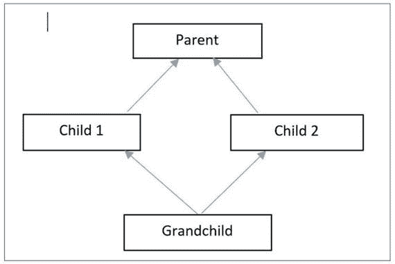

# 九、C# 中 OOP 原则的快速回顾

老师开始讨论:欢迎来到 C# 面向对象编程的最后一部分。让我们回顾一下本书中已经介绍过的核心原则。

*   类别和对象
*   多态
*   抽象
*   包装
*   遗产

我们可以再加两个。

*   信息传递
*   动态绑定

## 恶作剧

您还记得 C# 的基本构件是如何涵盖这些主题的吗？

## 答案

*   类和对象:在整本书中，几乎在每个例子中，我们都使用了不同类型的类和对象。在静态类的例子中，我们没有创建对象。我们可以通过类名访问静态字段。
*   多态:涵盖了两种类型的多态。编译时多态通过方法重载(和操作符重载)来覆盖，运行时多态通过使用虚拟和重写关键字的方法重写技术来覆盖。
*   抽象:这个特性通过抽象类和接口进行了测试。
*   封装:除了访问修饰符，我们还使用了属性和索引器的概念。
*   继承:我们在两章中探讨了不同类型的继承。
*   消息传递:这个特性在多线程环境中很常见。但是我们可以在这一类中考虑运行时多态。
*   动态绑定:通过方法覆盖实例的运行时多态可以属于这一类。#

学生问:

先生，您能总结一下抽象和封装的区别吗？

老师说:将数据和代码包装成一个实体的过程称为封装。使用这种技术，我们可以防止任意和不安全的访问。我们使用了不同种类的访问修饰符以及带有 get 和 set 访问器的属性示例来实现封装的概念。

在抽象中，我们展示了基本的特性，但是对用户隐藏了详细的实现；例如，当我们用遥控器打开电视时，我们并不关心该设备的内部电路。只要按下按钮后图像从电视中出来，我们对这个设备绝对没问题。

您可以重新阅读第 [1](01.html) 章了解这些定义。

学生问:

一般来说，编译时多态和运行时多态哪个更快？

老师说:我表示，如果电话能够尽早解决，通常会更快。这就是为什么我们可以得出编译时绑定比运行时绑定(或多态)更快的结论——因为您预先知道要调用哪个方法。

学生问:

先生，你早些时候告诉我们，继承并不总是提供最好的解决办法。你能详细说明一下吗？

老师说:在某些情况下，作文可以提供更好的解决方案。但是要理解构成，你需要知道这些概念:

*   联合
*   聚合

关联可以是单向的也可以是双向的。当你看到这种 UML 图时，这意味着 ClassA 知道 ClassB，但反过来却不是这样。


下图显示了一个双向关联，因为这两个类彼此都认识。


考虑一个例子。在大学里，一个学生可以向多个老师学习，一个老师可以教多个学生。在这种关系中没有专门的所有权。所以，当我们在编程中用类和对象来表示它们时，我们可以说这两种对象都可以独立地创建和删除。

聚合是一种更强的关联类型。广泛代表如下。


考虑此类别中的一个示例。假设 X 教授提交辞职信，因为他决定加入一个新的机构。虽然 X 教授和他以前的机构没有对方也能生存，但最终 X 教授需要与机构中的一个部门建立联系。在编程世界中类似的情况下，我们会说系是这种关系的所有者，并且系里有教授。

同样，我们可以说汽车有座位，自行车有轮胎，等等。

## 注意

一个系有一个教授。这就是为什么关联关系也被称为“具有”关系。(这里一定要记住和继承的关键区别。继承与“是”的关系相关联。

组合是一种更强的聚合形式，这次我们有一个填充的菱形。


学院中的一个系不能离开学院而存在。学院只创建或关闭它的系。(你可以争辩说，如果根本没有系，学院就不可能存在，但是我们没有必要考虑这种类型的极端情况而使事情复杂化。换句话说，一个系的寿命完全取决于它的学院。这也被称为死亡关系，因为如果我们摧毁了学院，它的所有部门都会被自动摧毁。

为了展示构图的威力，让我们重温一下我们在第 [3](03.html) 章讨论过的钻石问题，然后分析下面的程序。

我们现有的代码

```cs
using System;

namespace CompositionEx1
{
    class Parent
    {
        public virtual void Show()
        {
            Console.WriteLine("I am in Parent");
        }
    }
    class Child1 : Parent
    {
        public override void Show()
        {
            Console.WriteLine("I am in Child-1");
        }
    }
    class Child2 : Parent
    {
        public override void Show()
        {
            Console.WriteLine("I am in Child-2");
        }
    }

```

假设孙辈派生自 Child1 和 Child2，但它没有覆盖`Show()`方法。

因此，我们预期的 UML 图可能如下所示:



我们现在有了歧义。孙儿将从哪个类调用`Show()`方法——child 1 还是 Child2？为了消除这种类型的歧义，C# 不支持通过类的多重继承。这就是所谓的钻石问题。

所以，如果你这样编码:

```cs
class GrandChild : Child1, Child2//Error: Diamond Effect
{
    public void Show()
    {
        Console.WriteLine("I am in Child-2");
    }
}

```

C# 编译器会报错:


现在让我们看看如何用构图来处理这种情况。考虑下面的代码。

## 演示 1:处理前面问题的组合

```cs
using System;

namespace CompositionEx1

{
    class Parent
    {
        public virtual void Show()
        {
            Console.WriteLine("I am in Parent");
        }
    }
    class Child1 : Parent
    {
        public override void Show()
        {
            Console.WriteLine("I am in Child-1");
        }
    }
    class Child2 : Parent
    {
        public override void Show()
        {
            Console.WriteLine("I am in Child-2");
        }
    }
    //class GrandChild : Child1, Child2//Error: Diamond Effect
    //{
    //}
    class Grandchild
    {
        Child1 ch1 = new Child1();
        Child2 ch2 = new Child2();
        public void ShowFromChild1()
        {
            ch1.Show();
        }
        public void ShowFromChild2()
        {
            ch2.Show();
        }
    }

    class Program

    {
        static void Main(string[] args)
        {
            Console.WriteLine("***Composition
to handle the Diamond Problem***\n");
            Grandchild gChild = new Grandchild();
            gChild.ShowFromChild1();
            gChild.ShowFromChild2();
            Console.ReadKey();
        }
    }
}

```

### 输出


### 分析

您可以看到 Class1 和 Class2 都覆盖了它们的父方法`Show()`。而孙儿类没有自己的`Show()`方法。不过，我们可以通过孙子的对象调用那些特定于类的方法。

孙子女正在其体内创建来自 Class1 和 Class2 的对象。因此，如果我们的应用中不存在孙对象(例如，如果这些对象被垃圾收集)，我们可以说系统中没有 Class1 或 Class2 对象。您还可以对用户设置一些限制，使他们不能直接在应用中创建 Class1 和 Class2 的对象；但是为了简单起见，我们忽略了这一部分。

## 演示 2:聚合示例

假设在前面的例子中，你想变得自由一点。您希望避免孙类和子类之间的死亡关系。您可以使用聚合来实现一个程序，其中其他类可以有效地使用对 Class1 和 Class2 的引用。

```cs
using System;

namespace AggregationEx1
{
    class Parent
    {
        public virtual void Show()
        {
            Console.WriteLine("I am in Parent");
        }
    }
    class Child1 : Parent
    {
        public override void Show()
        {
            Console.WriteLine("I am in Child-1");
        }
    }
    class Child2 : Parent
    {
        public override void Show()
        {
            Console.WriteLine("I am in Child-2");
        }
    }
    //class GrandChild : Child1, Child2//Error: Diamond Effect
    //{
    //}
    class Grandchild
    {
        Child1 ch1;
        Child2 ch2;
        public Grandchild(Child1 ch1, Child2 ch2)
        {
            this.ch1 = ch1;
            this.ch2 = ch2;
        }
        public void ShowFromChild1()
        {
            ch1.Show();
        }
        public void ShowFromChild2()
        {
            ch2.Show();

        }
    }

    class Program
    {
        static void Main(string[] args)
        {
            Console.WriteLine("***Aggregation
to handle the Diamond Problem***\n");
            Child1 child1 = new Child1();
            Child2 child2 = new Child2();
            Grandchild gChild = new Grandchild(child1,child2);
            gChild.ShowFromChild1();
            gChild.ShowFromChild2();
            Console.ReadKey();
        }
    }
}

```

### 输出


### 分析

在这种情况下，Child1 和 Child2 对象可以在没有孙对象的情况下继续存在。这就是为什么我们说组合是一种更强的聚合形式。

### 注意

你意识到一般化、特殊化和实现。我们在应用中使用了这些概念。当我们的类扩展另一个类(即继承)时，我们使用泛化和特化的概念；例如，足球运动员是一种特殊的运动员。或者我们可以说足球运动员和篮球运动员都是运动员(泛化)。当我们的类实现一个接口时，我们使用了实现的概念。

学生问:

OOP 的挑战和缺点是什么？

老师说:许多专家认为，一般来说，面向对象程序的规模较大。由于更大的尺寸，我们可能需要更多的存储空间(但是现在，这些问题已经不重要了。)

一些开发人员发现面向对象编程风格的困难。他们可能仍然喜欢其他方法，比如结构化编程。因此，如果他们被迫在这样的环境中工作，生活对他们来说就变得艰难了。

此外，我们不能以面向对象的方式为每个现实世界的问题建模。然而，总的来说，我个人喜欢面向对象的编程风格，因为我相信它的优点大于缺点。

## 摘要

本章包括以下内容:

*   快速回顾本书中的核心 OOP 原则
*   如何区分抽象和封装
*   如何在我们的 C# 应用中实现组合和聚合的概念
*   与 OOP 相关的挑战和缺点