# 十、委托和事件

## 委托介绍

老师开始讨论:委托是 C# 编程中最重要的话题之一，它们使 C# 变得非常强大。委托是从 System.Delegate 派生的引用类型。它们类似于对象引用，但主要区别在于它们指向方法。我们可以通过使用委托来实现类型安全。因此，有时我们称它们为类型安全函数指针。

Points to Remember

*   一个对象引用指向一个特定类型的对象(例如，当我们写`A ob=new A();`时，我们的意思是`ob`是对一个`A`类型对象的引用)；而委托指向特定类型的方法。
*   委托是一个知道如何调用与其关联的方法的对象。有了委托类型，您就知道它的实例调用哪种方法。
*   我们可以用委托编写插件方法。

假设我们有一个名为 Sum 的方法，带有两个整型参数，如下所示:

```cs
public static int Sum(int a, int b)
{
  return a+b;
}

```

我们可以声明一个委托来指向`Sum`方法，如下所示:

```cs
Mydel del = new Mydel(Sum);

```

但在此之前，我们需要定义`Mydel`委托，它必须具有相同的签名，如下所示:

```cs
public delegate int Mydel(int x, int y);

```

对于`Sum`方法和`Mydel`委托，返回类型、参数及其对应的顺序是相同的。(记住方法名不是签名的一部分。)

注意，`Mydel`与任何具有`integer`返回类型(int)并接受两个整数参数的方法兼容，比如`Sum` (int a，int b)方法。

### 正式的定义

委托是从 System 派生的引用类型。委托，它的实例用于调用具有匹配签名的方法。委托的一般定义是“委托”因此，我们可以说我们的委托必须用匹配的签名来表示方法。

下面的示例阐释了委托的用法。

案例 1 是一个不使用委托的方法调用。

案例 2 是一个调用委托的方法。

## 演示 1

```cs
using System;

namespace DelegateEx1
{
    public delegate int Mydel(int x, int y);

    class Program
    {
        public static int Sum(int a, int b) { return a + b; }

        static void Main(string[] args)
        {
            Console.WriteLine("***Delegate Example -1: A simple delegate demo***");
            int a = 25, b = 37;
            //Case-1
            Console.WriteLine("\n Calling Sum(..) method without using a delegate:");
            Console.WriteLine("Sum of a and b is : {0}", Sum(a,b));

            Mydel del = new Mydel(Sum);
            Console.WriteLine("\n Using delegate now:");
            //Case-2
            Console.WriteLine("Calling Sum(..) method with the use of a delegate:");
            //del(a,b) is shorthand for del.Invoke(a,b)
            Console.WriteLine("Sum of a and b is: {0}", del(a, b));
            //Console.WriteLine("Sum of a and b is: {0}", del.Invoke(a, b));
            Console.ReadKey();
        }
    }
}

```

### 输出

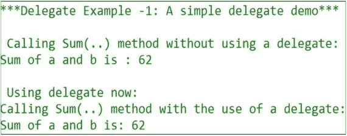

### 缩短你的代码长度

我们可以缩短前面例子中的代码长度。

替换此行:

```cs
Mydel del = new Mydel(Sum);

```

使用这一行:

```cs
Mydel del = Sum;

```

请注意注释行。`del(a,b)`是的简写

```cs
del.Invoke(a,b)

```

学生问:

假设在我们的程序中，Sum()方法是重载的。那么如果我们写 Mydel del=Sum，编译器可能会很困惑；。这是正确的吗？

老师说:一点也不。编译器可以绑定正确的重载方法。让我们用一个简单的例子来测试一下。(在前面的例子中，我们用委托测试了静态方法，所以这次我们有意使用非静态方法来涵盖这两种情况。)

## 演示 2

```cs
using System;

namespace Quiz1OnDelegate
{
    public delegate int Mydel1(int x, int y);
    public delegate int Mydel2(int x, int y,int z);

    class A
    {
        //Overloaded non static Methods
        public int Sum(int a, int b) { return a + b; }
        public int Sum(int a, int b,int c) { return a + b+ c; }
    }

    class Program
    {
        static void Main(string[] args)
        {
            Console.WriteLine("***Quiz on Delegate***");
            int a = 25, b = 37, c=100;
            A obA1 = new A();
            A obA2 = new A();

            Mydel1 del1 = obA1.Sum;
            Console.WriteLine("del1 is pointing Sum(int a,int b):");
            //Pointing Sum(int a, int b)
            Console.WriteLine("Sum of a and b is: {0}", del1(a, b));

            Mydel2 del2 = obA1.Sum;//pointing Sum(int a, int b, int c)
            Console.WriteLine("del2 is pointing Sum(int a,int b,int c):");
            //Pointing Sum(int a, int b, int c)
            Console.WriteLine("Sum of a, b and c is: {0}", del2(a, b,c));
            //same as
            //Console.WriteLine("Sum of a, b and c is: {0}", del2.Invoke(a, b, c));
            Console.ReadKey();
        }
    }
}

```

### 输出

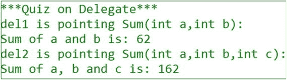

### 分析

编译器正在选择正确的重载方法。如果您错误地编写了这样的代码，您总是会收到一个编译时错误:


```cs
del1(a,b,c)

```

或者，如果你这样编码:


```cs
del2(a,b)

```

学生问:

为什么委托经常被称为类型安全函数指针？

老师说:当我们想把任何方法传递给委托时，委托签名和方法签名需要匹配。因此，它们通常被称为类型安全函数指针。

### 恶作剧

代码会编译吗？

```cs
using System;

namespace Test1_Delegate
{
    public delegate int MultiDel(int a, int b);
    class A : System.Delegate//Error
    { ..}

}

```

### 回答

不。我们不能从委托类派生。

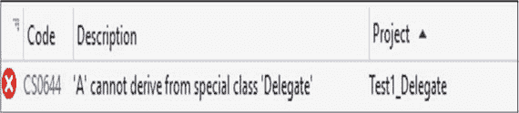

## 多播代理/链接代理

老师继续说:当一个委托被用来封装一个匹配签名的多个方法时，我们称之为多播委托。这些委托是 System 的子类型。MulticastDelegate，它是 System.Delegate 的子类。

## 演示 3

```cs
using System;

namespace MulticastDelegateEx1
{
    public delegate void MultiDel();

    class Program
    {
        public static void show1() { Console.WriteLine("Program.Show1()"); }
        public static void show2() { Console.WriteLine("Program.Show2()"); }
        public static void show3() { Console.WriteLine("Program.Show3()"); }
        static void Main(string[] args)
        {
            Console.WriteLine("***Example of a Multicast Delegate***");
            MultiDel md = new MultiDel(show1);
            md += show2;
            md += show3;
            md();
            Console.ReadKey();
        }
    }
}

```

### 输出

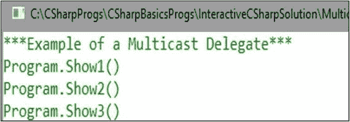

学生问:

在前面的例子中，我们的多播委托的返回类型是 void。这背后的意图是什么？

老师说:一般来说，对于多播委托，我们在调用列表中有多个方法。但是，单个方法或委托调用只能返回单个值，因此多播委托类型应该具有 void 返回类型。如果您仍然想尝试一个非 void 返回类型，您将只从最后一个方法接收返回值。将调用前面的方法，但返回值将被丢弃。为了清楚地理解，请完成下面的测验。

### 恶作剧

假设我们已经编写了下面的程序，其中多播委托和与之相关的方法都有返回类型。程序会编译吗？

```cs
using System;

namespace MulticastDelegateEx2
{
    public delegate int MultiDel(int a, int b);

    class Program
    {
        public static int Sum(int a, int b)
        {
            Console.Write("Program.Sum->\t");
            Console.WriteLine("Sum={0}", a+b);
            return a + b;
        }
        public static int Difference(int a, int b)
        {
            Console.Write("Program.Difference->\t");
            Console.WriteLine("Difference={0}", a - b);
            return a - b;
        }
        public static int Multiply(int a, int b)
        {
            Console.Write("Program.Multiply->\t");
            Console.WriteLine("Multiplication={0}", a * b);
            return a * b;
        }

        static void Main(string[] args)
        {
            Console.WriteLine("***Testing a Multicast Delegate***");
            MultiDel md = new MultiDel(Sum);
            md += Difference;
            md += Multiply;
            int c = md(10, 5);
            Console.WriteLine("Analyzing the value of c");
            Console.WriteLine("c={0}", c);
            Console.ReadKey();
        }
    }
}

```

### 输出

是的，程序将会编译，输出如下:

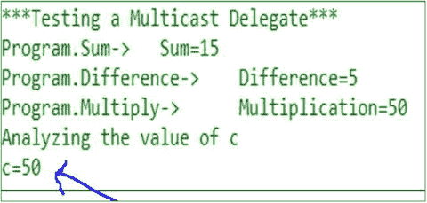

### 分析

注意`c`的值。为了编译和运行，多播委托不需要 void 返回类型。但是，如果我们有这些方法的返回类型，并且我们编写了这样的代码，那么我们将从调用/调用链中最后一个被调用的方法中获取值。在这两个值之间的所有其他值都将被丢弃，但不会对此发出警报。因此，建议您试验 void 返回类型的多播委托。

学生问:

因此，即使我们对多播委托使用 nonvoid 返回类型，我们也不会看到任何编译错误。这种理解正确吗？

老师说:是的。在这种情况下，您将只接收最后一个方法的返回值。所以，只要想想这对你是否有意义。

学生问:

我们可以使用委托来定义回调方法吗？

是的。这是使用委托的主要目的之一。

学生问:

多播委托的调用列表是什么？

老师说:多播代理维护一个代理的链表。这个列表称为调用列表，由一个或多个元素组成。当我们调用多播委托时，调用列表中的委托按照它们出现的顺序被同步调用。如果在执行过程中出现任何错误，它将抛出一个异常。

## 委托中的协变和逆变

当我们实例化一个委托时，我们可以给它分配一个比“最初指定的返回类型”具有“更多派生的返回类型”的方法从 C# 2.0 开始，这种支持就可用了。另一方面，逆变允许方法的参数类型比委托类型派生得少。协方差的概念从 C#1.0 开始就支持数组，所以我们可以这样写:

```cs
Console.WriteLine("***Covariance in arrays(C#1.0 onwards)***");
//ok, but not type safe
object[] myObjArray = new string[5];

```

但是这不是类型安全的，因为这种行

```cs
myObjArray[0] = 10;//runtime error

```

会遇到运行时错误。

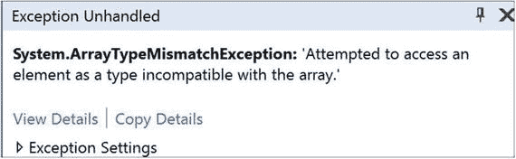

### 委托/方法组方差中的协方差

从 C# 2.0 开始，委托就支持协变和逆变。对泛型类型参数、泛型接口和泛型委托的支持始于 C#4.0。到目前为止，我还没有讨论过泛型类型。所以，这一节处理非泛型委托，从协方差开始。

## 演示 4

```cs
using System;

namespace CovarianceWithDelegatesEx1
{
    class Vehicle
    {
        public Vehicle ShowVehicle()
        {
            Vehicle myVehicle = new Vehicle();
            Console.WriteLine(" A Vehicle created");
            return myVehicle;
        }
    }
    class Bus:Vehicle
    {
        public Bus ShowBus()
        {
            Bus myBus = new Bus();
            Console.WriteLine(" A Bus created");
            return myBus;
        }
    }

    class Program
    {
        public delegate Vehicle  ShowVehicleTypeDelegate();
        static void Main(string[] args)
        {
            Vehicle vehicle1 = new Vehicle();
            Bus bus1 = new Bus();
            Console.WriteLine("***Covariance in delegates(C# 2.0 onwards)***");
            ShowVehicleTypeDelegate del1 = vehicle1.ShowVehicle;
            del1();
            //Note that it is expecting a Vehicle(i.e. a basetype) but received a Bus(subtype)
            //Still this is allowed through Covariance
            ShowVehicleTypeDelegate del2 = bus1.ShowBus;
            del2();
            Console.ReadKey();
        }
    }
}

```

### 输出

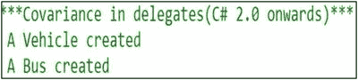

### 分析

在前面的程序中，我们可以看到编译器没有抱怨这一行:

```cs
ShowVehicleTypeDelegate del2 = bus1.ShowBus;

```

尽管我们的委托返回类型是 Vehicle，但是它的 del2 对象接收了一个派生类型“Bus”对象。

### 委托的矛盾

逆变与参数有关。假设委托可以指向接受派生类型参数的方法。在 contravariance 的帮助下，我们可以使用同一个委托指向一个接受基类型参数的方法。

## 演示 5

```cs
using System;

namespace ContravariancewithDelegatesEx1
{
    class Vehicle
    {
        public void ShowVehicle(Vehicle myV)
        {
            Console.WriteLine(" Vehicle.ShowVehicle");
        }
    }
    class Bus : Vehicle
    {
        public void ShowBus(Bus myB)
        {
            Console.WriteLine("Bus.ShowBus");
        }
    }

    class Program
    {
        public delegate void TakingDerivedTypeParameterDelegate(Bus v);
        static void Main(string[] args)
        {
            Vehicle vehicle1 = new Vehicle();//ok
            Bus bus1 = new Bus();//ok
            Console.WriteLine("***Exploring Contravariance
with C# delegates***");
            //General case
            TakingDerivedTypeParameterDelegate del1 = bus1.ShowBus;
            del1(bus1);
            //Special case:
            //Contravariance
:
            /*Note that the delegate expected a method that accepts a bus(derived) object parameter but still it can point to the method that accepts vehicle(base) object parameter*/
            TakingDerivedTypeParameterDelegate del2 = vehicle1.ShowVehicle;
            del2(bus1);
            //Additional note:you cannot pass vehicle object here
            //del2(vehicle1);//error
            Console.ReadKey();
        }
    }
}

```

### 输出


### 分析

浏览程序和支持的注释行，以便更好地理解代码。从前面的例子中我们可以看到，我们的委托`TakingDerivedTypeParameterDelegate`期望一个接受总线(派生的)对象参数的方法，然而它可以指向一个接受车辆作为(基本)对象参数的方法。

## 事件

老师说:事件是用来通知或表示一个物体的状态发生了变化。该信息对于该对象的客户端非常有用(例如，GUI 应用中的鼠标点击或按键是非常常见的事件示例)。

在现实世界中，考虑一个社交媒体平台，比如脸书。每当我们更新任何关于脸书的信息，我们的朋友都会立即得到通知。(这是一个非常常见的观察者设计模式的例子)。因此，您可以假设当您对脸书页面进行一些更改时，内部会触发一些事件，以便您的朋友可以获得这些更新。只有那些已经在我们的好友列表中的人(即，我们已经接受他们为我们的好友)才会收到这些更新。在编程术语中，我们说这些人注册在我们的好友列表中。如果有人不想获得更新，他/她可以简单地从好友列表中注销。因此，术语“注册和取消注册”与事件相关联。

在我们前进之前，我们必须记住以下几点:

*   事件与委托相关联。要理解事件，首先要学习委托。当一个事件发生时，它的客户给它的委托被调用。
*   英寸 NET 中，事件被实现为多播委托。
*   这里遵循发布者-订阅者模型。发布者(或广播者)发布通知(或信息),订户接收该通知。但是用户可以自由决定何时开始监听，何时停止监听(用编程术语来说，就是何时注册，何时注销)。
*   Publisher 是包含委托的类型。订阅者通过在发布者的委托上使用+=来注册自己，并通过在该委托上使用-=来注销自己。因此，当我们将+=或-=应用于一个事件时，它们具有特殊的含义(换句话说，在这些情况下，它们不是赋值的快捷方式)。
*   用户之间不说话。实际上，这些是支持事件架构的关键目标:
    *   订户不能相互通信。
    *   我们可以构建一个松散耦合的系统。
*   如果我们使用 Visual Studio IDE，当我们处理事件时，它使我们的生活变得极其简单。但是我相信这些概念是 C# 的核心，所以最好从基础开始学习。
*   那个。NET framework 提供了一个支持标准事件设计模式的泛型委托，如下所示:

```cs
public delegate void EventHandler<TEventArgs>(object sendersource, TEventArgs e) where TEventArgs : EventArgs;

```

直到现在，你还没有学习 C# 泛型。为了支持向后兼容性，中的大多数事件。NET framework 遵循我们在这里使用的非泛型自定义委托模式。

### 在 C# 中实现简单事件的步骤

(这里我们将尝试遵循最广泛接受的命名约定。)

步骤 1:创建发布者类

*   #1.1.创建代理人。(首先，为您的活动选择一个名称，比如说 JobDone。然后创建一个名为 JobDoneEventHandler 的委托。
*   #1.2.基于委托创建事件(使用 event 关键字)。
*   #1.3.引发事件。(标准模式要求该方法应该用 protected virtual 标记。此外，该名称必须与事件名称相匹配，并以 On 为前缀)。

步骤 2:创建订户类。

*   #2.1 .编写事件处理程序方法。按照约定，事件处理程序方法的名称以 On 开头。

让我们看一下这个程序。

## 演示 6

```cs
using System;

namespace EventEx1
{
    //Step1-Create a publisher
    class Publisher
    {
        //Step1.1-Create a delegate.Delegate name should be //"yourEventName"+EventHandler
        public delegate void JobDoneEventHandler(object sender, EventArgs args);
        //Step1.2-Create the event based on the delgate
        public event JobDoneEventHandler JobDone;
        public void ProcessOneJob()
        {
            Console.WriteLine("Publisher:One Job is processed");
            //Step1.3-Raise the event
            OnJobDone();
        }
        /*The standard pattern requires that the method should be tagged with protected
virtual. Also the name must match name of the event and it will be prefixed with "On".*/
        protected
virtual void OnJobDone()
        {
            if (JobDone != null)
                JobDone(this, EventArgs.Empty);
        }

    }
    //Step2-Create a subscriber
    class Subscriber
    {
        //Handling the event
        public void OnJobDoneEventHandler(object sender, EventArgs args)
        {
            Console.WriteLine("Subscriber is notified");
        }
    }
    class Program
    {
       static void Main(string[] args)
        {
            Console.WriteLine("***A simple event demo***");
            Publisher sender = new Publisher();
            Subscriber receiver = new Subscriber();
            sender.JobDone += receiver.OnJobDoneEventHandler;
            sender.ProcessOneJob();

            Console.ReadKey();
        }
    }
}

```

### 输出


学生问:

先生，我们可以为一个事件订阅多个事件处理程序吗？

老师说:是的。在 C# 中，事件被实现为多播委托，因此我们可以将多个事件处理程序关联到一个事件。假设我们有两个订阅者:Subscriber1 和 Subscriber2，他们都希望从发布者那里获得通知。以下代码将正常工作:

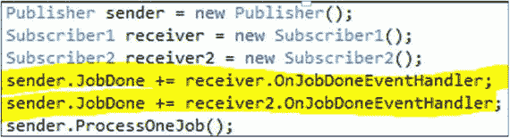

Points to Remember

在现实世界的编码中，您必须小心这些订阅(例如，在您的应用中，您只通过事件进行注册，然后在一段时间后，您会观察到内存泄漏这一副作用。因此，您的应用会很慢(可能会崩溃)。如果您没有将取消订阅操作放在适当的位置，垃圾收集器将无法回忆起这些记忆。

## 传递带有事件参数的数据

如果你再看一下前面的程序，你会发现我们没有用事件参数传递任何特定的东西。

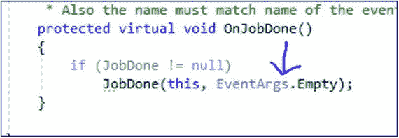

在现实编程中，我们需要传递比 EventArgs 更多的信息。空(或 null)。在这些情况下，我们需要遵循以下步骤:

1.  创建 System.EventArgs 的子类。
2.  用事件封装预期数据。在下面的例子中，我们使用了一个属性。
3.  创建此类的一个实例，并将其与事件一起传递。

为了更好地演示，我稍微修改了前面的程序。

## 演示 7

```cs
using System;

namespace EventEx2
{
    //Step-a. Create a subclass of System.EventArgs
    public class JobNoEventArgs : EventArgs
    {
        //Step-b.Encapsulate your intended data with the event. In the below example, we have used a property.
        private int jobNo;
        public int JobNo
        {
            get
            {
                return jobNo;
            }
            set
            {
                JobNo = value;
            }
        }
        public JobNoEventArgs(int jobNo)
        {
            this.jobNo = jobNo;
        }
    }
    //Step1-Create a publisher
    class Publisher
    {
        //Step1.1-Create a delegate.Delegate name should be "yourEventName"+EventHandler
        //public delegate void JobDoneEventHandler(object sender, EventArgs args);
        public delegate void JobDoneEventHandler(object sender, JobNoEventArgs args);
        //Step1.2-Create the event based on the delgate
        public event JobDoneEventHandler JobDone;
        public void ProcessOneJob()
        {
            Console.WriteLine("Publisher:One Job is processed");
            //Step1.3-Raise the event
            OnJobDone();
        }
        /*The standard pattern requires that the method should be tagged with protected
virtual.
        Also the name must match name of the event and it will be prefixed with "On".*/
        protected
virtual void OnJobDone()
        {
            if (JobDone != null)
                //Step-c. Lastly create an instance of the event generator class and pass it with the event.
                JobDone(this,new JobNoEventArgs(1));
        }
    }
    //Step2-Create a subscriber
    class Subscriber
    {
        //Handling the event
        public void OnJobDoneEventHandler(object sender, JobNoEventArgs args)
        {
            Console.WriteLine("Subscriber is notified.Number of job processed is :{0}",args.JobNo);
        }
    }

    class Program
    {
        static void Main(string[] args)
        {
            Console.WriteLine("*** Event example 2:Passing data with events***");
            Publisher sender = new Publisher();
            Subscriber receiver = new Subscriber();
            sender.JobDone += receiver.OnJobDoneEventHandler;
            sender.ProcessOneJob();
            Console.ReadKey();
        }
    }
}

```

### 输出

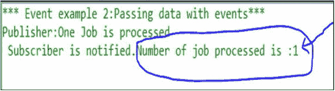

### 分析

现在我们可以看到，通过遵循前面的机制，我们可以在引发事件时获得额外的信息(处理的作业数)。

## 事件访问器

回到我们关于事件的第一个程序(EventEx1)，在这里我们将事件声明为

```cs
public event JobDoneEventHandler JobDone;

```

编译器使用私有委托字段对此进行转换，并提供两个事件访问器:add 和 remove。

以下代码将产生等效的行为:

```cs
//public event JobDoneEventHandler JobDone;
#region custom event accessors
private JobDoneEventHandler _JobDone;
public event JobDoneEventHandler JobDone
{
  add
  {
   _JobDone += value;
  }
 remove
  {
    _JobDone -= value;
  }
}
#endregion

```

如果你在这个程序中使用这些代码，你需要修改我们的`OnJobDone()`方法，就像这样:

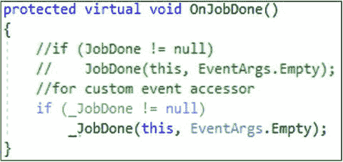

如果你想证实我们的说法，你可以简单地参考 IL 代码。

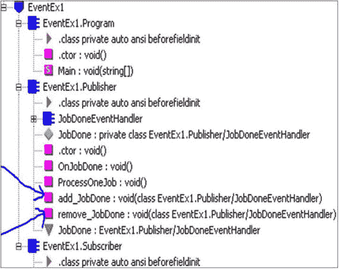

从 IL 代码中，我们可以看到 add 和 remove 部分被编译成`add_<EventName>`和`remove_<EventName>`。

如果编译器为我们做了所有的事情，那么我们为什么需要为这些细节而烦恼呢？简单的答案是

*   我们自己定义这些访问器来进行额外的控制(例如，我们可能想要进行一些特殊类型的验证，或者我们可能想要记录更多的信息，等等)。)
*   有时我们需要显式地实现一个接口，而这个接口可能包含一个或多个事件。

现在稍微修改一下我们的 EventEx2 程序。在这种情况下，我们使用自定义访问器并记录一些附加信息。让我们看看下面的程序和输出。

## 演示 8

```cs
using System;

namespace EventAccessorsEx1
{
    //Step-a. Create a subclass of System.EventArgs
    public class JobNoEventArgs : EventArgs
    {
        //Step-b.Encapsulate your intended data with the event. In the below example, we have used a property.
        private int jobNo;
        public int JobNo
        {
            get
            {
                return jobNo;
            }
            set
            {
                JobNo = value;
            }
        }
        public JobNoEventArgs(int jobNo)
        {
            this.jobNo = jobNo;
        }
    }
    //Step1-Create a publisher
    class Publisher
    {
        //Step1.1-Create a delegate.Delegate name should be "yourEventName"+EventHandler
        //public delegate void JobDoneEventHandler(object sender, EventArgs args);
        public delegate void JobDoneEventHandler(object sender, JobNoEventArgs args);
        //Step1.2-Create the event based on the delgate
        //public event JobDoneEventHandler JobDone;
        #region custom event accessors
        private JobDoneEventHandler _JobDone;
        public event JobDoneEventHandler JobDone
        {
            add
            {
                Console.WriteLine("Inside add accessor-Entry");
                _JobDone += value;
            }
            remove
            {
                _JobDone -= value;
                Console.WriteLine("Unregister completed-Exit from remove accessor");
            }
        }
        #endregion
        public void ProcessOneJob()
        {
            Console.WriteLine("Publisher:One Job is processed");
            //Step1.3-Raise the event
            OnJobDone();
        }
        /*The standard pattern requires that the method should be tagged with protected
virtual.
         * Also the name must match name of the event and it will be prefixed with "On".*/
        protected
virtual void OnJobDone()
        {
            if (_JobDone != null)
                //Step-c. Lastly create an instance of the event generator class and pass it with the event.
                _JobDone(this, new JobNoEventArgs(1));
        }
    }
    //Step2-Create a subscriber
    class Subscriber
    {
        //Handling the event
        public void OnJobDoneEventHandler(object sender, JobNoEventArgs args)
        {
            Console.WriteLine(" Subscriber is notified.Number of job processed is :{0}", args.JobNo);
        }
    }

    class Program
    {
        static void Main(string[] args)
        {
            Console.WriteLine("*** Testing custom event accessors***");
            Publisher sender = new Publisher();
            Subscriber receiver = new Subscriber();
            //Subscribe/Register
            sender.JobDone += receiver.OnJobDoneEventHandler;
            sender.ProcessOneJob();
            //Unsubscribe/Unregister
            sender.JobDone -= receiver.OnJobDoneEventHandler;
            Console.ReadKey();
        }
    }
}

```

### 输出

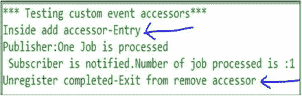

当您应用自定义事件访问器时，建议您也实现锁定机制；也就是说，我们可以这样写:

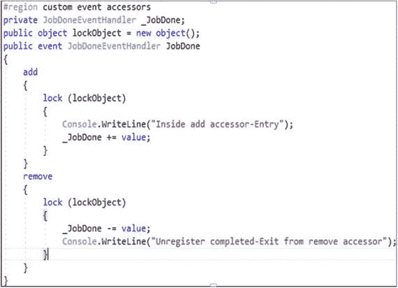

一般来说，锁定操作开销很大。为了使我们的例子简单，我在这里忽略了这个建议。

学生问:

先生，什么类型的修饰语被允许用于事件？

老师说:既然我们已经使用了虚拟关键字，你可以猜测覆盖事件是允许的。事件也可以是抽象的、密封的或静态的。

## 摘要

本章涵盖了

*   委托及其重要性
*   如何在我们的程序中使用委托
*   为什么委托是类型安全的
*   多播代理
*   如何使用委托实现协变和逆变
*   事件以及如何使用它们
*   如何传递带有事件参数的数据
*   事件访问器以及如何使用它们