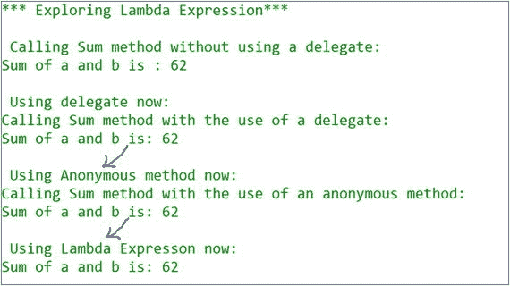
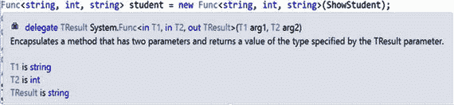
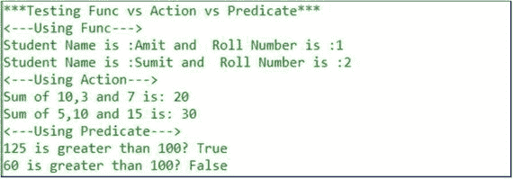

# 十一、匿名函数的灵活性

## 匿名方法和 Lamda 表达式

教师开始讨论:让我们回到我们的代表计划(DelegateEx1)。我在该程序中添加了几行代码来生成相同的输出。为了帮助你理解调用之间的差异，我保留了旧的东西。

注意额外的东西。这些额外的代码块可以帮助你更好地理解匿名方法和 lambda 表达式。C# 2.0 引入了匿名方法，C# 3.0 引入了 lambda 表达式。

顾名思义，没有名字的方法就是 C# 中的匿名方法。匿名方法的主要目标是快速完成一个动作，即使我们写的代码更少。它是一个可以用作委托参数的代码块。

类似地，lambda 表达式是一个没有名字的方法。它用于代替委托实例。编译器可以将这些表达式转换为委托实例或表达式树。(表达式树的讨论超出了本书的范围。)

在下面的演示中，添加了两个额外的代码块:一个用于匿名方法，一个用于 lambda 表达式。每一个都产生相同的输出。

## 演示 1

```cs
using System;

namespace LambdaExpressionEx1
{
    public delegate int Mydel(int x, int y);

    class Program
    {
        public static int Sum(int a, int b) { return a + b; }

        static void Main(string[] args)
        {
            Console.WriteLine("*** Exploring Lambda Expression***");
            //Without using delgates or lambda expression

            int a = 25, b = 37;
            Console.WriteLine("\n Calling Sum method without using a delegate:");
            Console.WriteLine("Sum of a and b is : {0}", Sum(a, b));

            //Using Delegate( Initialization with a named method)
            Mydel del = new Mydel(Sum);
            Console.WriteLine("\n Using delegate now:");
            Console.WriteLine("Calling Sum method with the use of a delegate:");
            Console.WriteLine("Sum of a and b is: {0}", del(a, b));

            //Using Anonymous method(C# 2.0 onwards)
            Mydel del2 = delegate (int x, int y) { return x + y; };
            Console.WriteLine("\n Using Anonymous method now:");
            Console.WriteLine("Calling Sum method with the use of an anonymous method
:");
            Console.WriteLine("Sum of a and b is: {0}", del2(a, b));

            //Using Lambda expression(C# 3.0 onwards)
            Console.WriteLine("\n Using Lambda Expresson now:");
            Mydel sumOfTwoIntegers = (x1, y1) => x1 + y1;
            Console.WriteLine("Sum of a and b is: {0}", sumOfTwoIntegers(a, b));
            Console.ReadKey();
        }
    }
}

```

### 输出



### 分析

以下是 lambda 表达式的主要特征:

*   它是一个匿名方法(或未命名的方法)，而不是委托实例。
*   它可以包含创建委托或表达式树的表达式或语句(LINQ 查询和表达式树超出了本书的范围)。

请注意，我们有以下委托:

```cs
public delegate int Mydel(int x, int y);

```

我们已经指定并调用了一个 lambda 表达式

```cs
(x1, y1) => x1 + y1

```

因此，您可以看到 lambda 表达式的每个参数对应于委托参数(本例中为 x1 到 x，y1 到 y ),表达式的类型(本例中 x+y 为 int)对应于返回委托的类型。

*   Lambda 运算符`=>`(读作 goes to)用于 lambda 表达式中。它具有正确的结合性，其优先级与赋值(`=`)运算符相同。
*   输入参数在 lambda 运算符的左侧指定，表达式或语句在 lambda 运算符的右侧指定。
*   如果我们的 lambda 表达式只有一个参数，我们可以省略括号；例如，我们可以这样写来计算一个数的平方:

```cs
x=>x*x

```

Points to Remember

*   C# 2.0 引入了匿名方法，C# 3.0 引入了 lambda 表达式，它们很相似，但是 lambda 表达式更简洁，专家建议如果你的应用是面向。NET Framework 版或更高版本，一般来说你应该更喜欢 lambda 表达式而不是匿名方法。这两个特性在 C# 中被称为匿名函数。
*   您应该避免在匿名方法体中使用不安全的代码和跳转语句，如 break、goto 和 continue。

学生问:

那么我们应该总是尝试使用匿名方法，因为它更快，代码更小。这是正确的吗？

老师说:不。看看与匿名方法相关的限制。此外，如果您需要多次编写类似的功能，您必须避免匿名方法。

## 函数、动作和谓词委托

作者注:现在我们将快速介绍三个重要的泛型委托。我把这个主题放在这里是因为它们很容易与 lambda 表达式和匿名方法联系起来。我们将很快讨论泛型。所以，如果你已经对泛型编程有了一个基本的概念，你可以继续；否则，一旦你对他们有了更多的了解，请回来。

### Func 代表

Func 委托有多种形式。它们可以接受 0 到 16 个输入参数，但总是有一个返回类型。考虑以下方法:

```cs
private static string ShowStudent(string name, int rollNo)
 {
  return string.Format("Student Name is :{0} and  Roll Number is :{1}", name, rollNo);
  }

```

要使用委托调用此方法，我们需要遵循以下步骤:

第一步。像这样定义委托:

```cs
public delegate string Mydel(string n, int r);

```

第二步。像这样用委托附加方法:

```cs
Mydel myDelOb = new Mydel (ShowStudent);

```

或者简而言之，

```cs
Mydel myDelOb = ShowStudent;

```

第三步。现在，您可以像这样调用该方法:

```cs
myDelOb.Invoke ("Jon", 5);

```

或者仅仅是

```cs
myDelOb ("Jon", 5);

```

但是在这种情况下，我们可以使用现成的/内置的委托函数使代码更简单、更短，如下所示:

```cs
Func<string, int, string> student = new Func<string, int, string>(ShowStudent);
Console.WriteLine(ShowStudent("Amit", 1));

```

因此，您可以预测这个 Func 委托很好地考虑了两种输入类型——string 和 int——以及返回类型 string。在 Visual Studio 中，如果您将光标移动到此处，可以看到最后一个参数被视为函数的返回类型，其他参数被视为输入类型。



学生问:

先生，我们有不同种类的方法，可以接受不同数量的输入参数。与前面的方法不同，我们如何在考虑多于或少于两个输入参数的函数中使用 Func？

老师说:Func 代表可以考虑 0 到 16 个输入参数。所以，我们可以使用这些形式中的任何一种:

```cs
Func<T, TResult>
Func<T1, T2, TResult>
Func<T1, T2, T3, TResult>
.....
Func<T1, T2, T3..., T15, T16, TResult>

```

### 动作代表

动作委托可以接受 1 到 16 个输入参数，但没有返回类型。因此，假设我们有一个`SumOfThreeNumbers`方法，它有三个输入参数，其返回类型是 void，如下所示:

```cs
private static void SumOfThreeNumbers(int i1, int i2, int i3)
        {
            int sum = i1 + i2 + i3;
            Console.WriteLine("Sum of {0},{1} and {2} is: {3}", i1, i2, i3, sum);
        }

```

我们可以使用动作委托来获得三个整数的和，如下所示:

```cs
Action<int, int, int> sum = new Action<int, int, int>(SumOfThreeNumbers);
            sum(10, 3, 7);

```

### 谓词委托

谓词委托用于评估某些东西。例如，一个方法定义了一些标准，我们需要检查一个对象是否满足这些标准。考虑以下方法:

```cs
private static bool GreaterThan100(int myInt)
        {
            return myInt > 100 ? true : false;
        }

```

我们可以看到这个方法评估一个输入是否大于 100。我们可以使用谓词委托来执行相同的测试，如下所示:

```cs
Predicate<int> isGreater = new Predicate<int>(GreaterThan100);
Console.WriteLine("125 is greater than 100? {0}", isGreater(125));
Console.WriteLine("60 is greater than 100? {0}", isGreater(60));

```

下面的程序用一个简单的程序演示了所有这些概念。

## 演示 2

```cs
using System;

namespace Test1_FuncVsActionVsPredicate
{
    class Program
    {
        static void Main(string[] args)
        {
            Console.WriteLine("***Testing Func vs Action vs Predicate***");
            //Func
            Console.WriteLine("<---Using Func--->");
            Func<string, int, string> student = new Func<string, int, string>(ShowStudent);
            Console.WriteLine(ShowStudent("Amit", 1));
            Console.WriteLine(ShowStudent("Sumit", 2));
            //Action
            Console.WriteLine("<---Using Action--->");
            Action<int, int, int> sum = new Action<int, int, int>(SumOfThreeNumbers);
            sum(10, 3, 7);
            sum(5, 10, 15);

            //Predicate
            Console.WriteLine("<---Using Predicate--->");
            Predicate<int> isGreater = new Predicate<int>(GreaterThan100);
            Console.WriteLine("125 is greater than 100? {0}", isGreater(125));
            Console.WriteLine("60 is greater than 100? {0}", isGreater(60));

            Console.ReadKey();
        }
        private static string ShowStudent(string name, int rollNo)
        {
            return string.Format("Student Name is :{0} and  Roll Number is :{1}", name, rollNo);
        }
        private static void SumOfThreeNumbers(int i1, int i2, int i3)
        {
            int sum = i1 + i2 + i3;
            Console.WriteLine("Sum of {0},{1} and {2} is: {3}", i1, i2, i3, sum);
        }
        private static bool GreaterThan100(int myInt)
        {
            return myInt > 100 ? true : false;
        }
    }
}

```

### 输出



## 摘要

本章讨论了以下内容:

*   匿名方法
*   λ表达式
*   函数、动作和谓词委托
*   如何在 C# 应用中有效地使用这些概念