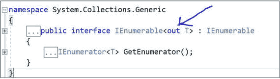

# 十二、泛型

## 泛型程序和非泛型程序的比较

教师开始讨论:泛型是 C# 的关键概念之一。它们出现在 C# 2.0 中，从那以后，它们扩展了新的特性。

为了理解泛型的强大，我们将从一个非泛型程序开始，然后编写一个泛型程序。稍后，我们将进行比较分析，然后我们将尝试发现泛型编程的优势。考虑下面的程序和输出。

## 演示 1:非泛型程序

```cs
using System;

namespace NonGenericEx
{
    class NonGenericEx
    {
        public int ShowInteger(int i)
        {
            return i;
        }
        public string ShowString(string s1)
        {
            return s1;
        }
    }
    class Program
    {
        static void Main(string[] args)
        {
            Console.WriteLine("***A non-generic program example***");
            NonGenericEx nonGenericOb = new NonGenericEx();
            Console.WriteLine("ShowInteger returns :{0}", nonGenericOb.ShowInteger(25));
            Console.WriteLine("ShowString returns :{0}", nonGenericOb.ShowString("Non Generic method called"));
            Console.ReadKey();
        }
    }
}

```

### 输出


现在让我们试着介绍一个泛型程序。在我们开始之前，这些是关键点:

*   尖括号`<>`用于创建通用类。
*   我们可以定义一个类，用占位符来表示它的方法、字段、参数等的类型。以及在泛型程序中；这些占位符将被特定的类型替换。
*   微软声明:“泛型类和方法结合了可重用性、类型安全性和效率，这是非泛型类和方法所不能做到的。泛型最常用于集合和对集合进行操作的方法。的 2.0 版。NET Framework 类库提供了一个新的命名空间 System。包含几个新的基于泛型的集合类。建议所有面向。NET Framework 2.0 和更高版本使用新的泛型集合类，而不是旧的非泛型集合类，如 ArrayList。(见 [`https://docs.microsoft.com/en-us/dotnet/csharp/programming-guide/generics/introduction-to-generics`](https://docs.microsoft.com/en-us/dotnet/csharp/programming-guide/generics/introduction-to-generics) )。)

让我们从下面的程序开始。

## 演示 2:泛型程序

```cs
using System;

namespace GenericProgrammingEx1
{
    class MyGenericClass<T>
    {
        public T Show(T value)
        {
            return value;
        }
    }
    class Program
    {
        static void Main(string[] args)
        {
            Console.WriteLine("***Introduction to Generics***");
            MyGenericClass<int> myGenericClassIntOb = new MyGenericClass<int>();
            Console.WriteLine("Show returns :{0}", myGenericClassIntOb.Show(100));
            MyGenericClass<string> myGenericClassStringOb = new MyGenericClass<string>();
            Console.WriteLine("Show returns :{0}", myGenericClassStringOb.Show("Generic method called"));
            MyGenericClass<double> myGenericClassDoubleOb = new MyGenericClass<double>();
            Console.WriteLine("Show returns :{0}", myGenericClassDoubleOb.Show(100.5));

            Console.ReadKey();
        }
    }
}

```

### 输出


### 分析

我们现在可以做一个演示 1 和演示 2 的对比分析。我们看到了以下特征:


*   对于非泛型方法，我们需要指定像`ShowInteger()`和`ShowString()`这样的方法来处理特定的数据类型。另一方面，对于通用版本，`Show()`就足够了。一般来说，通用版本的代码行更少(即代码更小)。
*   在演示 1 的`Main()`中，我们在第二行遇到了一个编译时错误，如下所示:

    ```cs
    Console.WriteLine("ShowDouble returns :{0}", nonGenericOb.ShowDouble(25.5));//error

    ```

原因是:在这个例子中，我们没有定义一个`'ShowDouble(double d)'`方法。因此，为了避免这个错误，我们需要在类中包含一个额外的方法 NonGenericEx，如下所示:


### 进一步分析

我们的`NonGenericEx`类的代码大小随着这一增加而增加。我们需要增加代码大小，因为我们现在试图处理不同的数据类型“double”

现在来看演示 2，我们在不修改 MyGenericClass 的情况下获得了 double 数据类型。因此，我们可以得出结论，通用版本更加灵活。

### 注意

一般来说，泛型编程比非泛型编程更灵活，并且需要更少的代码行。

考虑下面的程序。

## 演示 3

```cs
using System;
using System.Collections;

namespace GenericEx2
{
    class Program
    {
        static void Main(string[] args)
        {
            Console.WriteLine("***Use Generics to avoid runtime error***");
            ArrayList myList = new ArrayList();
            myList.Add(10);
            myList.Add(20);
            myList.Add("Invalid");//No compile time error but will cause
            //runtime error
            foreach (int myInt in myList)
            {
                Console.WriteLine((int)myInt); //downcasting

            }
            Console.ReadKey();
        }
    }

}

```

### 输出

该程序不会引发任何编译时错误。


但是在运行时，我们会遇到这个错误:


这是因为第三个元素(即我们的 ArrayList 中的 myList [2])不是整数(它是一个字符串)。在编译时，我们没有遇到任何问题，因为它是作为对象存储的。请注意取自 visual studio 的快照:


### 分析

在这种类型的编程中，由于装箱和向下转换，我们可能会面临性能开销。

现在考虑下面的程序。

## 演示 4

```cs
using System;
using System.Collections.Generic;

namespace GenericEx3
{
    class Program
    {
        static void Main(string[] args)
        {
            Console.WriteLine("***Use Generics to avoid runtime error***");
            List<int> myGenericList = new List<int>();
            myGenericList.Add(10);
            myGenericList.Add(20);
            myGenericList.Add("Invalid");// compile time error
            foreach (int myInt in myGenericList)
            {
                Console.WriteLine((int)myInt);//downcasting

            }
            Console.ReadKey();
        }
    }
}

```

### 输出


在这种情况下，我们不能在 myGenericList 中添加字符串，因为它只用于保存整数。该错误在编译时被捕获；我们不需要等到运行时才得到这个错误。

### 分析

通过比较演示 3 和演示 4，我们可以说

*   为了避免运行时错误，我们应该更喜欢泛型版本的代码，而不是非泛型版本。
*   如果我们使用泛型编程，我们可以避免装箱/拆箱带来的损失。
*   我们可以使用`List<string> myGenericList2 = new List<string>();`来创建一个包含字符串的列表。List <t>版本比非泛型版本 ArrayList 更加灵活和可用。</t>

## 演示 5:自引用泛型类型练习

让我们假设在您的雇员类中有雇员 id 和部门名称。写一个简单的程序来判断两个雇员是否相同。但是对您的约束是，您的类应该从定义该比较方法规范的通用接口派生。

下面的演示可以被视为需求的一个示例实现。

```cs
using System;

namespace GenericEx4
{
    interface ISameEmployee<T>
    {
        string CheckForIdenticalEmployee(T obj);
    }
    class Employee : ISameEmployee<Employee>
    {
        string deptName;
        int employeeID;
        public Employee(string deptName, int employeeId)
        {
            this.deptName = deptName;
            this.employeeID = employeeId; 

        }
        public string CheckForIdenticalEmployee(Employee obj)
        {
            if (obj == null)
            {
                return "Cannot Compare with a Null Object";
            }
            else
            {
                if (this.deptName == obj.deptName && this.employeeID == obj.employeeID)
                {
                    return "Same Employee";
                }
                else
                {
                    return "Different Employee";
                }
            }
        }
    }
    class Program
    {
        static void Main(string[] args)
        {
            Console.WriteLine("**Suppose, we have an  Employee class that contains deptName and employeeID***");
            Console.WriteLine("***We need to check whether 2 employee objects are same or not.***");
            Console.WriteLine();
            Employee emp1 = new Employee("Maths", 1);
            Employee emp2 = new Employee("Maths", 2);
            Employee emp3 = new Employee("Comp. Sc.", 1);
            Employee emp4 = new Employee("Maths", 2);
            Employee emp5=null; 

            Console.WriteLine("Comparing Emp1 and Emp3 :{0}", emp1.CheckForIdenticalEmployee(emp3));
            Console.WriteLine("Comparing Emp2 and Emp4 :{0}", emp2.CheckForIdenticalEmployee(emp4));
            Console.WriteLine("Comparing Emp3 and Emp5 :{0}", emp3.CheckForIdenticalEmployee(emp5));
            Console.ReadKey();
        }
    }

}

```

### 输出


### 分析

这是一个类型将自己命名为具体类型的示例(换句话说，这是一个自引用泛型类型的示例)。

## 一个特殊的关键字默认值

我们熟悉 switch 语句中 default 关键字的用法，其中 default 用于指代默认情况。在泛型的上下文中，它有特殊的含义。这里我们使用 default 用它们的默认值初始化泛型类型(例如，引用类型的默认值是 null，值类型的默认值是按位零)。

考虑下面的例子。

## 演示 6

```cs
using System; 

namespace CaseStudyWithDefault
{
    class Program
    {
        static void Main(string[] args)
        {
            Console.WriteLine("***Case study- default keyword***");
            Console.WriteLine("default(int) is {0}", default(int));//0

            bool b1 = (default(int) == null);//False
            Console.WriteLine("default(int) is null ?Answer: {0}", b1);
            Console.WriteLine("default(string) is {0}", default(string));//null
            bool b2 = (default(string) == null);//True
            Console.WriteLine("default(string) is  null ? Answer:{0}", b2);
            Console.ReadKey();
        }
    }

}

```

### 输出


### 分析

我们必须记住，`int`是值类型，`string`是引用类型。因此，您现在可以使用前面的程序和输出来检查它们的默认值。

## 演示 7:分配

让我们假设你有一个仓库，你可以存储多达三个对象。要存储这些对象，可以使用数组。编写一个泛型程序，通过它你可以在库中存储/检索不同的类型。使用 default 关键字的概念用数组各自的类型初始化数组。

下面的演示可以被视为需求的一个示例实现。

```cs
using System;

namespace Assignment
{
    public class MyStoreHouse<T>
    {
        T[] myStore = new T[3];
        int position = 0;
        public MyStoreHouse()
        {
            for (int i = 0; i < myStore.Length; i++)
            {
                myStore[i] = default(T);
            }
        }
        public void AddToStore(T value)
        {
            if (position < myStore.Length)
            {
                myStore[position] = value;
                position++;
            }
            else
            {
                Console.WriteLine("Store is full already");
            }
        }

        public void RetrieveFromStore()
        {
            foreach (T t in myStore)
            {
                Console.WriteLine(t);
            }
            //Or Use this block
            //for (int i = 0; i < myStore.Length; i++)
            //{
            //    Console.WriteLine(myStore[i]);
            //}

        }
    }
    class Program
    {
        static void Main(string[] args)
        {
            Console.WriteLine("***Use case-default keyword
in generic programming:***");
            Console.WriteLine("***\nCreating an Integer store:***");
            MyStoreHouse<int> intStore = new MyStoreHouse<int>();
            intStore.AddToStore(45);
            intStore.AddToStore(75);
            Console.WriteLine("***Integer store at this moment:***");
            intStore.RetrieveFromStore();

            Console.WriteLine("***\nCreating an String store:***");
            MyStoreHouse<string> strStore = new MyStoreHouse<string>();
            strStore.AddToStore("abc");
            strStore.AddToStore("def");
            strStore.AddToStore("ghi");
            strStore.AddToStore("jkl");//Store is full already
            Console.WriteLine("***String store at this moment:***");
            strStore.RetrieveFromStore();
            Console.ReadKey();
        }
    }

}

```

### 输出


## 通用约束

考虑下面的程序和输出，然后进行分析。

## 演示 8

```cs
using System;
using System.Collections.Generic;

namespace GenericConstraintEx
{
    interface IEmployee
    {
        string Position();
    }
    class Employee : IEmployee
    {
        public string Name;
        public int yearOfExp;
        public Employee(string name, int years)
        {
            this.Name = name;
            this.yearOfExp = years;
        }
        public string Position()
        {
            if (yearOfExp < 5)
            {
                return " A Junior Employee";
            }
            else
            {
                return " A Senior Employee";
            }
        }

    }
    class EmployeeStoreHouse<Employee> where Employee : IEmployee
    //class EmployeeStoreHouse<Employee>//error
    {
        private List<Employee> MyStore = new List<Employee>();
        public void AddToStore(Employee element)
        {
            MyStore.Add(element);
        }
        public void DisplaySore()
        {
            Console.WriteLine("The store contains:");
            foreach (Employee e in MyStore)
            {
                Console.WriteLine(e.Position());
            }
        }
    }

    namespace Generic.Constraint_1
    {
        class Program
        {
            static void Main(string[] args)
            {
                Console.WriteLine("***Example of Generic Constraints***");

                //Employees
                Employee e1 = new Employee("Amit", 2);
                Employee e2 = new Employee("Bob", 5);
                Employee e3 = new Employee("Jon", 7);

                //Employee StoreHouse
                EmployeeStoreHouse<Employee> myEmployeeStore = new EmployeeStoreHouse<Employee>();
                myEmployeeStore.AddToStore(e1);
                myEmployeeStore.AddToStore(e2);
                myEmployeeStore.AddToStore(e3);

                //Display the Employee Positions in Store
                myEmployeeStore.DisplaySore();
                Console.ReadKey();
            }
        }
    }

}

```

### 输出


### 注意

在这个例子中，我们检查了如何在应用中设置约束。如果不使用“where Employee:IEmployee”语句，我们会遇到以下问题:


上下文关键字'`where`'帮助我们在应用中设置约束。一般来说，我们可以有以下约束:

*   `where T` : `struct`表示类型 T 必须是值类型。(请记住，struct 是一种值类型。)
*   `where T: class`表示类型 T 必须是引用类型。(记住类是一个引用类型。)
*   `where T: IMyInter`表示类型 T 必须实现 IMyInter 接口。
*   `where T: new()`意味着类型 T 必须有一个默认的(无参数的)构造函数。(如果与其他约束一起使用，将其放在最后一个位置。)
*   `where T: S`意味着类型 T 必须从另一个泛型类型 s 派生。它有时被称为裸类型约束。

### 恶作剧

学生问:

我们能否编写一个更通用的 EmployeeStoreHouse 形式？

### 回答

老师说:是的，我们能。考虑下面的代码。

```cs
class EmployeeStoreHouse<T> where T : IEmployee
{
    private List<T> MyStore = new List<T>();
    public void AddToStore(T element)
    {
        MyStore.Add(element);
    }
    public void DisplaySore()
    {
        foreach (T e in MyStore)
        {
            Console.WriteLine(e.Position());
        }
    }
}

```

## 协方差和逆变

在第 [10](10.html) 章关于委托的讨论中，你了解到委托中的协变和逆变支持是从 C# 2.0 开始的。从 C# 4.0 开始，这些概念可以应用于泛型类型参数、泛型接口和泛型委托。第 [10 章](10.html)也探讨了非泛型委托的概念。

在本章中，我们将通过更多的案例继续探讨这些概念。

在继续之前，请记住以下几点:

*   协方差和逆变处理带有参数和返回类型的类型转换。
*   协方差和逆变已用于我们对不同类型的对象/数组等的编码。
*   。NET 4 支持泛型委托和泛型接口。(在早期版本中，我们会遇到泛型委托或泛型接口的编译错误)。
*   逆变通常被定义为调整或修改。当我们试图在编码世界中实现这些概念时，我们也试图接受以下真理(或类似的真理):
    *   所有的足球运动员都是运动员，但反过来就不一样了(因为有很多运动员打高尔夫、篮球、曲棍球等。)同样，我们可以说所有的公交车都是交通工具，但反过来就不成立。
    *   在编程术语中，所有的派生类都是基类，但反之则不然。例如，假设我们有一个名为 Rectangle 的类，它是从一个名为 Shape 的类派生而来的。那么我们可以说所有的矩形都是形状，但反过来就不成立了。
*   按照 MSDN 的说法，协方差和逆变的概念处理数组、委托和泛型类型的隐式引用转换。协方差保持赋值兼容性，逆变则相反。

学生问:

“任务兼容性”是什么意思？

老师说:这意味着你可以把一个更具体的类型分配给一个兼容的不太具体的类型。例如，整数变量的值可以存储在对象变量中，如下所示:

```cs
int i = 25;
object o = i;//ok: Assignment Compatible

```

让我们试着从数学的角度来理解协变、逆变和不变性的含义。

假设我们只考虑整数的定义域。

情况 1:我们定义我们的函数，f (x) = x + 2 对于所有的 x。

如果 x ≤ y，那么我们也可以说 f (x) ≤ f (y)对于所有的 x，投影(函数 f)是保持大小方向的。

情况 2:我们定义我们的 f(x)=–x(对于所有的 x 都属于整数)。

现在我们可以看到 10 ≤ 20 但是 f (10) ≥ f (20)(因为 f(10)=–10，f(20)=–20 和–10 >–20)。所以，我们的大小方向颠倒了。

情况 3:我们定义我们的函数，f (x) = x*x。

现在，我们可以看到–1≤0 且 f(–1)> f(0)，但 1 < 2 且 f (1) < f (2)。所以投影(函数 f)既不总是保持大小的方向，也不反转大小的方向。

在情况 1 中，函数 f 是协变的；在情况 2 中，函数 f 是逆变的；在情况 3 中，函数 f 是不变的。

Points to Remember

你可以随时参考微软在 [`https://docs.microsoft.com/en-us/dotnet/standard/generics/covariance`](https://docs.microsoft.com/en-us/dotnet/standard/generics/covariance) `-and-contravariance`的简单定义。

*   协方差我们可以使用比最初指定的更派生的类型。
*   我们可以使用一个比最初指定的更通用(更少派生)的类型。
*   不变性我们只允许使用最初指定的类型。

协方差和逆变统称为方差。

从。NET Framework 4 中，在 C# 中有关键字将接口和委托的泛型类型参数标记为协变或逆变。协变接口和委托用 out 关键字标记(表示值出来)。逆变接口和委托与 in 关键字相关联(指示值进入)。

让我们看一下我们的 C# 例子。记住 IEnumerable <t>在 T 上是协变的，Action <t>在 T 上是逆变的，让我们检查一下在 Visual Studio 中 IEnumerable <t>接口的定义。</t></t></t>



T8】

作者注:注意，我们可以看到“out”这个词与 IEnumerable 的定义相关联。所以，我们可以将 IEnumerable <derivedtype>赋给 IEnumerable <basetype>。这就是为什么我们可以将 IEnumerable <string>赋给 IEnumerable <object>。</object></string></basetype></derivedtype>

现在检查 Visual Studio 中 Action <t>委托的定义。我们将看到:</t>


或者，检查 Visual Studio 中的定义 IComparer <t>接口。我们将看到:</t>


Note

注意，我们可以看到 in 中的单词与 Acion <t>的定义相关联。因此，我们可以将动作<basetype>分配给动作<derivetype>。</derivetype></basetype></t>

底线是:由于 IEnumerable <t>在 T 上是协变的，我们可以从 IEnumerable <string>转换成 IEnumerable <object>。从这些情况中得出值(协方差)。</object></string></t>

另一方面，由于动作<t>在 T 上是逆变的，我们也可以将动作<object>转换成动作<string>。值进入这些对象(逆变)。</string></object></t>

为了测试这两种风格，我们将讨论泛型接口的协变性和泛型委托的逆变性。我建议您尝试实现剩下的两种情况:用泛型委托实现协方差，用泛型接口实现逆变。

## 演示 9:通用接口的协变性

```cs
using System;
using System.Collections.Generic;

namespace CovarianceWithGenericInterfaceEx
{
    class Parent
    {
        public virtual void ShowMe()
        {
            Console.WriteLine(" I am from Parent, my hash code is :" + GetHashCode());
        }
    }
    class Child : Parent
    {
        public override void ShowMe()
        {
            Console.WriteLine(" I am from Child, my hash code is:" + GetHashCode());
        }
    }

    class Program

    {
        static void Main(string[] args)
        {

            //Covariance Example

            Console.WriteLine("***Covariance with Generic Interface Example***\n");
            Console.WriteLine("***IEnumerable<T> is covariant");
            //Some Parent objects
            Parent pob1 = new Parent();
            Parent pob2 = new Parent();
            //Some Child objects
            Child cob1 = new Child();
            Child cob2 = new Child();
            //Creating a child List
            List<Child> childList = new List<Child>();
            childList.Add(cob1);
            childList.Add(cob2);
            IEnumerable<Child> childEnumerable = childList;
              /* An object which was instantiated with a more derived type argument (Child) is assigned to an object instantiated with a less derived type argument(Parent). Assignment compatibility is preserved here. */
            IEnumerable<Parent> parentEnumerable = childEnumerable;
            foreach (Parent p in parentEnumerable)
            {
                p.ShowMe();
            }
          Console.ReadKey();
        }
    }
}

```

### 输出


### 分析

仔细阅读程序中包含的注释，以便更好地理解。

## 演示 10:与泛型委托的对比

```cs
using System;

namespace ContravarianceWithGenericDelegatesEx
{
    //A generic delegate
    delegate void aDelegateMethod<in T>(T t);
    class Vehicle
    {
        public virtual void ShowMe()
        {
            Console.WriteLine(" Vehicle.ShowMe()");
        }
    }
    class Bus: Vehicle
    {
        public override void ShowMe()
        {
            Console.WriteLine(" Bus.ShowMe()");
        }
    }
    class Program
    {
        static void Main(string[] args)
        {
            Console.WriteLine("***Contra-variance with Generic Delegates
example ***");
            Vehicle obVehicle = new Vehicle();
            Bus obBus = new Bus();
            aDelegateMethod<Vehicle> delVehicle = ShowVehicleType;
            delVehicle(obVehicle);
            //Contravariance
with Delegate
            //Using less derived type to more derived type
            aDelegateMethod<Bus> delChild = ShowVehicleType;
            delChild(obBus);
            Console.ReadKey();
        }

        private static void ShowVehicleType(Vehicle p)
        {
            p.ShowMe();
        }
    }

}

```

### 输出


### 分析

像前一个例子一样，浏览这个程序中的注释以获得更好的理解。

学生问:

在前面的程序中，您使用了带有泛型委托的静态方法(ShowVehicleType (…))。你能在非静态方法中使用同样的概念吗？

老师说:显然，你可以。

## 摘要

本章讨论了以下内容:

*   C# 中的泛型
*   为什么泛型很重要
*   泛型编程相对于非泛型编程的优势
*   泛型上下文中的关键字 default
*   如何在泛型编程中施加约束
*   通用接口的协变
*   与泛型委托相反