# 十三、异常处理

## 关于异常处理的讨论

老师开始讨论:一般来说，当我们为一个应用编写代码时，我们期望它总是能够顺利执行。但是有时候，我们在执行那些程序的时候会遇到突然的惊喜。这些意外可能以各种方式出现，并通过一些粗心的错误(例如，试图实现错误的逻辑，或忽略程序代码路径中的一些漏洞等)出现。)然而，许多失败都超出了程序员的控制范围，这也是事实。我们经常把这些不想要的情况称为例外。当我们编写应用时，处理这些异常是必不可少的。

## 定义

我们可以将异常定义为一个事件，它打破了正常的执行/指令流。

当出现异常情况时，会创建一个异常对象并将其抛出到创建该异常的方法中。该方法可能会也可能不会处理异常。如果它不能处理异常，它将把责任传递给另一个方法。(类似于我们的日常生活，当情况超出我们的控制范围时，我们会向他人寻求建议)。如果没有负责处理特定异常的方法，则会出现一个错误对话框(指示未处理的异常)，并且程序的执行会停止。

Points to Remember

异常处理机制处理。如果处理不当，应用会过早死亡。因此，我们应该尝试编写能够以优雅的方式检测和处理意外情况的应用，并防止应用过早死亡。

让我们从一个简单的例子开始。下面的程序将成功编译，但它将在运行时引发一个异常，因为我们忽略了除数(b)是 0 的事实(即，我们将 100 除以 0)。

## 演示 1

```cs
using System;

namespace ExceptionEx1
{
    class Program
    {
        static void Main(string[] args)
        {
            Console.WriteLine("***Exploring Exceptions.***");
            int a=100, b=0;
            int c = a / b;
            Console.WriteLine(" So, the result of a/b is :{0}", c);
            Console.ReadKey();
        }
    }
}

```

### 输出

系统。DivideByZeroException:“试图除以零。”

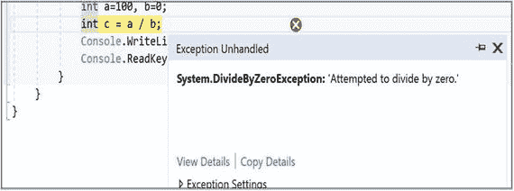

老师继续说:在继续之前，我将强调一些关于异常处理机制的要点。你必须反复检查这些要点。

*   中的所有例外。NET 是对象。
*   系统。Exception 是异常的基类。
*   应用中的任何方法都可能在应用运行时引发意外。如果出现这种情况，在编程术语中，我们说该方法抛出了一个异常。
*   我们使用以下关键字来处理 C# 异常:try、catch、throw、finally
*   我们试图用 try/catch 块来保护异常。可能引发异常的代码放在 try 块中，这种异常情况在 catch 块中处理。
*   我们可以将多个 catch 块与一个 try 块相关联。当一个特定的 catch 块处理突发事件时，我们说 catch 块已经捕获了异常。
*   finally 块中的代码必须执行。finally 块通常放在 try 块或 try/catch 块之后。
*   当 try 块中引发异常时，控件将跳转到相应的 catch 或 finally 块。try 块的剩余部分将不会被执行。
*   异常遵循继承层次结构。有时，如果我们将可以处理父类异常的 catch 块(例如，catch block1)放在只能处理派生类异常的 catch 块(例如，catch block2)之前，我们可能会遇到编译时错误。从编译器的角度来看，这是一个不可达代码的例子，因为在这种情况下，catch block1 已经能够处理 catch block2 可以处理的异常。因此，控制根本不需要到达 catch block2。我们将通过一个例子来研究这种情况。
*   我们可以使用任何组合:try/catch、try/catch/finally 或 try/finally。
*   finally 块中的代码必须执行。
*   如果我们不处理异常，CLR 将代表我们捕获它，我们的程序可能会过早死亡。

与 Java 有一个关键区别:这里所有的异常都是隐式未检查的。因此，C# 中没有 throws 关键字的概念。这是一个争论的热门话题。

老师继续说:现在让我们看看如何处理我们在前面的例子中遇到的异常。

## 演示 2

```cs
using System;

namespace ExceptionEx1Modified
{
    class Program
    {
        static void Main(string[] args)
        {
            Console.WriteLine("***Exploring Exceptions***");
            int a = 100, b = 0;
            try
            {
                int c = a / b;
                Console.WriteLine(" So, the result of a/b is :{0}", c);
            }
            catch (Exception ex)
            {
                Console.WriteLine("Encountered an exception :{0}", ex.Message);
            }
            finally

            {
                Console.WriteLine("I am in finally
.You cannot skip me!");
            }
            Console.ReadKey();
        }
    }
}

```

### 输出

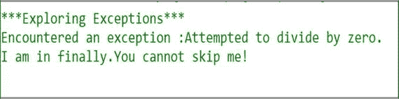

### 分析

我们可以从程序的输出中确认以下几点:

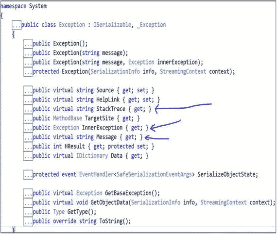

*   当 try 块中引发异常时，控件跳转到相应的 catch 块。try 块的剩余部分没有执行。
*   尽管我们遇到了异常，finally 块中的代码还是执行了。
*   我们使用了一个名为 Message 的公共属性。在系统中。例外，还有一些众所周知的属性。在 Visual Studio 中可以很容易地看到它们。

如箭头所示，在大多数情况下，您可能需要这三个属性:Message、StackTrace 和 InnerException。本章在各种示例中使用了 Message 和 StackTrace 属性。从截图中可以很容易地看出，这些都是只读属性(它们只有 get 属性)。为了便于您立即参考，我展开了这三个属性以显示它们的描述。

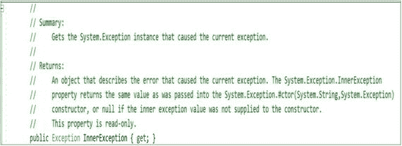

*   InnerException 属性:获取系统。导致当前异常的异常实例。

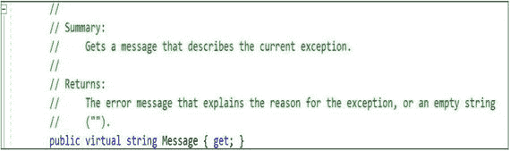

*   Message 属性:描述当前异常。

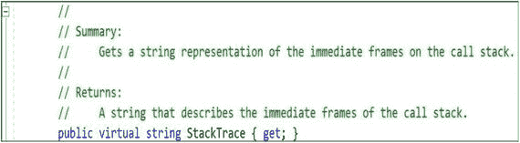

*   StackTrace 属性:使用该属性，我们可以获得导致异常的方法调用的层次结构。它为我们提供了调用堆栈上直接帧的字符串表示。

学生问:

先生，我们可以很容易地在除法运算之前放置一个 if 块，如 if(b==0 ),以避免除数为 0，在这种情况下，我们可以很容易地排除使用 try/catch 块。

老师澄清道:“你只是在考虑这个简单的例子，这就是为什么它会以这种方式出现在你面前。是的，在这种情况下，你的除数是固定的，你可以用那种方式保护你的代码。然而，考虑这样一种情况，b 的值也是在运行时计算的，并且您不能提前预测该值。此外，如果在所有可能的情况下都需要这样的保护，你的代码可能看起来很笨拙，很明显不可读。”

老师继续说:为了便于参考，下面是一些在语言规范中定义的异常类。

<colgroup><col align="left"> <col align="left"></colgroup> 
| 系统。算术异常 | 算术运算期间发生的异常的基类，如 System。DivideByZeroException 和 System.OverflowException。 |
| 系统。ArrayTypeMismatchException | 当由于存储元素的实际类型与数组的实际类型不兼容而导致数组存储失败时，将引发此异常。 |
| 系统。DivideByZeroException | 当试图将整数值除以零时会引发此异常。 |
| 系统。IndexOutOfRangeException | 当试图通过小于零或超出数组边界的索引对数组进行索引时，将引发此异常。 |
| 系统。异常 | 当在运行时从基类型或接口到派生类型的显式转换失败时，将引发此异常。 |
| 系统。空引用的异常 | 当使用空引用的方式导致需要被引用的对象时，将引发此异常。 |
| System.OutOfMemoryException | 当分配内存(通过 new)的尝试失败时抛出。 |
| 系统。堆栈溢出异常 | 当由于有太多挂起的方法调用而耗尽执行堆栈时，将引发此异常；通常表示非常深或无限的递归。 |
| 系统。TypeInitializationException | 当静态构造函数抛出异常，并且没有 catch 子句来捕获它时，将引发该异常。 |
| 系统。溢出异常 | 当检查的上下文中的算术运算溢出时，将引发此异常。 |

有关更详细的异常列表，可以在 Visual Studio 中按 Ctrl+Alt+E，然后展开公共语言运行时异常选项，如下面的屏幕截图所示。

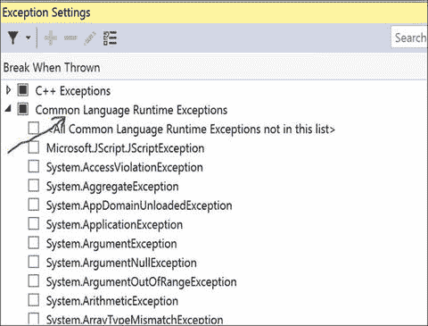

现在考虑下面的例子，看看如何在我们的程序中用多个 catch 块处理多个异常。

## 演示 3

```cs
using System;

namespace HandlingMultipleEx
{
    class Program
    {
        static void Main(string[] args)
        {
            Console.WriteLine("***Handling multiple Exceptions***");
            string b1;
            int input;
            Console.WriteLine("Enter your choice( 0 or 1)");
            b1 = Console.ReadLine();
            //Checking whether we can parse the string as an integer
            if (int.TryParse(b1, out input))
            {
                Console.WriteLine("You have entered {0}", input);
                switch (input)
                {
                    case 0:
                        int a = 100, b = 0;
                        try
                        {
                            int c = a / b;
                            Console.WriteLine(" So, the result of a/b is :{0}", c);
                        }
                        catch (DivideByZeroException ex)
                        {
                            Console.WriteLine("Encountered an exception with integers:{0}", ex.Message);
                            Console.WriteLine("Encountered an exception with integers:{0}", ex.StackTrace);
                        }
                        catch (Exception ex)
                        {
                            Console.WriteLine("In Choice0.Exception block ..{0}",ex.Message);
                        }
                        break;
                    case 1:
                        int[] myArray = { 1, 2, 3 };
                        try
                        {
                            Console.WriteLine(" myArray[0] :{0}", myArray[0]);
                            Console.WriteLine(" myArray[1] :{0}", myArray[1]);
                            Console.WriteLine(" myArray[2] :{0}", myArray[2]);
                            Console.WriteLine(" myArray[3] :{0}", myArray[3]);
                        }
                        catch (IndexOutOfRangeException ex)
                        {
                            Console.WriteLine("Encountered an exception with array
elements :{0}", ex.Message);
                            Console.WriteLine("Encountered an exception with array
elements :{0}", ex.StackTrace);
                        }
                        catch (Exception ex)
                        {
                            Console.WriteLine("In Choice1.Exception block ..{0}", ex.Message);
                        }

                        break;
                    default:
                        Console.WriteLine("You must enter either 0 or 1");
                        break;
                }
            }
            else
            {
                Console.WriteLine("You have not entered an integer!");
            }
            Console.ReadKey();
        }
    }
}

```

### 输出

案例 1:用户输入了 0。

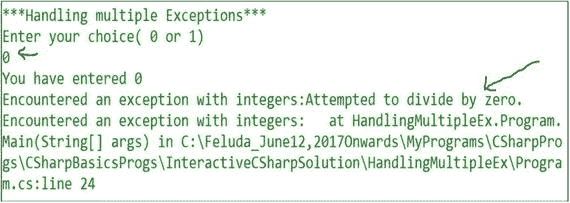

情况 2:用户输入了 1。

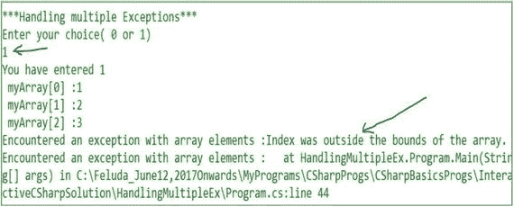

案例 3:用户输入了一个字符串。

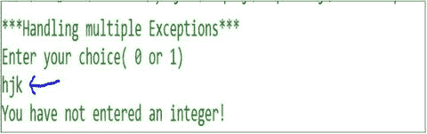

### 分析

我们可以从程序的输出中确认以下几点:

*   当引发异常时，只执行一个 catch 子句。例如，如果 block-catch(DivideByZeroException ex){..}可以处理异常，block- catch (Exception ex){..}不需要进入画面。
*   在前面的程序中，所有类型的异常(除了 DivideByZeroException 和 IndexOutOfRangeException)都在 block- catch (Exception ex)中捕获，并且该块必须作为最后一个 catch 块放置，因为 System。异常类是所有异常的基类。

### 恶作剧

你能预测产量吗？

## 演示 4

```cs
using System;
namespace Quiz1Exception
{
    class Program
    {
        static void Main(string[] args)
        {
            Console.WriteLine("***Exploring Exceptions***");
            int a = 100, b = 0;
            try
            {
                int c = a / b;
                Console.WriteLine(" So, the result of a/b is :{0}", c);
            }
            catch (ArithmeticException ex)
            {
                Console.WriteLine("Encountered an exception :{0}", ex.Message);
            }
            //Error:Exceptions follows the inheritance
hierarchy.
            //So, we need to place catch blocks properly.
            catch (DivideByZeroException ex)
            {
                Console.WriteLine("Encountered an DivideByZeoException :{0}", ex.Message);
            }
            Console.ReadKey();
        }
    }
}

```

### 输出

编译器错误。

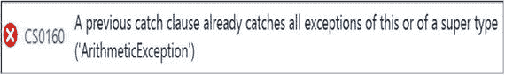

### 分析

异常遵循继承层次结构。因此，我们需要适当地放置 catch 块。在这种情况下，DivideByZeroException 是 ArithmeticException 的子类(而 arithmetic Exception 又是 Exception 的子类)。您可以在 Visual Studio 中轻松检查这一点。

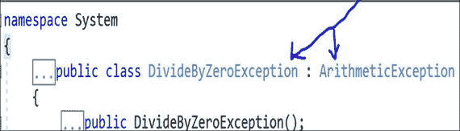

Points to Remember

因此，当您处理多个 catch 块时，您需要首先放置更具体的异常子句。

### catch 条款的其他变体

老师继续说:到目前为止，我们已经看到了不同的 catch 块。我们将注意到，您可以简单地使用 catch( <exceptionname>)或 catch{}，而不是 catch( <exceptionname><exceptionreference>)。因此，下面的代码块不会引发任何编译错误。这是 catch 子句的一种变体。</exceptionreference></exceptionname></exceptionname>

```cs
catch (Exception)
{
    Console.WriteLine("Encountered an Exception");
}

```

这个街区也可以。这是 catch 子句的另一种变体。

```cs
catch ()
  {
      Console.WriteLine("Encountered an Exception");
  }

```

但是，强烈建议您尽量避免这两种 catch 块。

### 恶作剧

代码会编译吗？

```cs
//some code before
catch (Exception)
{
 Console.WriteLine("Encountered an Exception");
}
catch { }
//some code after

```

### 回答

是的。但是，在 Visual Studio 2017 中，您会看到这条警告消息:

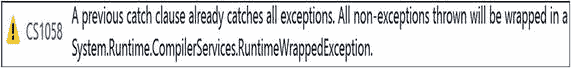

### 恶作剧

代码会编译吗？

```cs
//some code before
catch { }
catch (Exception)
{
 Console.WriteLine("Encountered an Exception");
}
//some code after

```

### 回答

不会。在 Visual Studio 2017 中，您会看到以下错误信息:

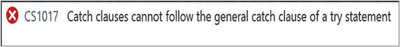

### 说明

按照语言规范，没有命名异常类的 catch 子句可以处理任何异常。此外，还有一些不是从 System.Exception 派生的异常，称为非 CLS 异常。一些。NET 语言(包括 C++/CLI)支持这些异常。在 Visual C# 中，我们不能抛出非 CLS 异常，但我们可以捕捉它们。默认情况下，Visual C# 程序集将非 CLS 异常捕获为包装异常(请参见上一个测验输出中的警告消息)。因此，我们也可以在 block-catch (Exception ex){..}.

专家建议，当您知道需要执行某些特定任务(例如，写入日志条目)来响应非 CLS 异常，但不需要访问异常信息时，可以使用 catch{}。关于这个话题的更多信息，可以去 [`https://docs.microsoft.com/en-us/dotnet/csharp/programming-guide/exceptions/how-to-catch-a-non-cls-exception`](https://docs.microsoft.com/en-us/dotnet/csharp/programming-guide/exceptions/how-to-catch-a-non-cls-exception) 。

老师继续说:我们有 catch 块的另一个变体，它是在 C# 6.0 中引入的。

下面是 catch 子句的第三种变体。

```cs
catch (WebException ex) when (ex.Status == WebExceptionStatus.Timeout)
 {
 //some code
 }

```

在这种情况下，when 子句就像一个过滤器。因此，在这种情况下，如果抛出了 WebException，但是布尔条件(后面跟有 when)不为真，这个 catch 块将不会处理该异常。因此，使用这种过滤器，我们可以再次捕获相同的异常，但在不同的 catch 块中处理它，如下所示:

```cs
catch (WebException ex) when (ex.Status == WebExceptionStatus.Pending)
 {
   //some code
 }

```

或者，

```cs
catch (WebException ex) when (ex.Status == WebExceptionStatus.ProtocolError)
 {
//some code
}

```

老师继续说:现在我们来看看一个方法如何抛出异常。方法可以用 throw 关键字抛出异常。在下面的例子中，当除数为 0 时，我们从 Divide 方法中抛出了 DivideByZeroException，然后在 catch 块中处理它。

## 演示 5

```cs
using System;

namespace ThrowingExceptionEx
{
    class Program
    {
        static int a = 100, b = 0, c;
        static void Divide(int a, int b)
        {
            if (b != 0)
            {
                int c = a / b;
            }
            else
            {
                throw new DivideByZeroException("b comes as Zero");
            }
        }
        static void Main(string[] args)
        {
            Console.WriteLine("***Exploring Exceptions:Throwing an Exception Example***");
            try
            {
                Divide(a, b);
                Console.WriteLine("Division operation completed");
            }
            catch (DivideByZeroException ex)
            {
                Console.WriteLine("Encountered an exception :{0}", ex.Message);
            }
            Console.ReadKey();
        }
    }
}

```

### 输出


学生问:

先生，有什么不同的方法来提出一个例外？

老师说:一般来说，有两种不同的方式可以提出异常。

方法 1:我们刚刚看到，任何方法都可以通过使用 throw 关键字来引发异常。该语句会立即引发异常，并且控制权不会转移到紧跟在 throw 语句之后的语句。

方法 2:当我们处理 C# 语句和异常时，我们可能会遇到由于错误的逻辑、漏洞等等导致的异常。

老师继续说:有时我们需要反复抛出(称为再抛出)一个异常。在某些情况下是必要的；例如，当我们想要写一个日志条目或者当我们想要发送一个新的更高级别的异常时。

以下是重新引发异常的格式:

```cs
try
{
  //some code
 }
catch(Exception ex)
{
 //some code e.g. log it now
 //Now rethrow it
 throw;
 }

```

Note

如果您使用`throw ex`而不是`throw;`，程序将不会有任何编译问题，但是如果您检查 StackTrace 属性，您会发现它与原始属性不同。因此，强烈建议您只有在真正想要重新抛出原始异常时才使用`throw;`。请参见演示 6 的输出来确认这一点。

## 演示 6

```cs
using System;

namespace RethrowingExceptionEx
{
    class Program
    {
        static int a = 100, b = 1, c;
        static void Divide(int a, int b)
        {
            try
            {
                b--;
                c = a / b;
                //some code
            }
            catch(Exception ex)
            {
                //some code e.g. log it now
                Console.WriteLine("a={0} b={1}", a,b);
                Console.WriteLine("Message: {0}", ex.Message);
                Console.WriteLine("StackTrace: {0}", ex.StackTrace);
                //Now rethrow it
                throw; //will throw the current exception
                //throw  new ArithmeticException();//throwing the parent class exception
            }
        }
        static void Main(string[] args)
        {
            Console.WriteLine("***Exploring Rethrowing an Exception Example***");
            try
            {
                Divide(a, b);
                Console.WriteLine(" Main.Divide() is completed");
            }
            catch (DivideByZeroException ex)
            {
                Console.WriteLine("\na={0} b={1}", a, b);
                Console.WriteLine("Message: {0}", ex.Message);
                Console.WriteLine("StackTrace: {0}", ex.StackTrace);
            }
            catch (Exception ex)
            {
                Console.WriteLine("\nIn catch(Exception ex)");
                Console.WriteLine("a={0} b={1}", a, b);
                Console.WriteLine("Message: {0}", ex.Message);
                Console.WriteLine("StackTrace: {0}", ex.StackTrace);
            }
            Console.ReadKey();
        }
    }
}

```

### 输出

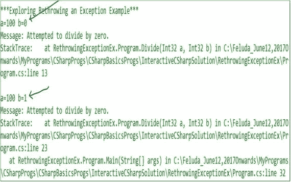

### 分析

现在您可以明白为什么第一个案例中的日志记录很重要了。一遇到异常，我们就记录下来，然后我们看到除数(b)在 Divide()方法中变成了 0。如果您没有记录它，那么当您看到最终的日志语句时，您可能会想，当 b 为 1 时，为什么会出现这个异常。

取消前面程序中`throw new ArithmeticException();`行的注释，如下所示:

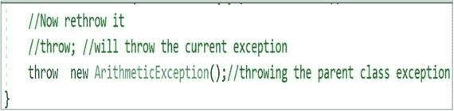

您将收到以下输出:

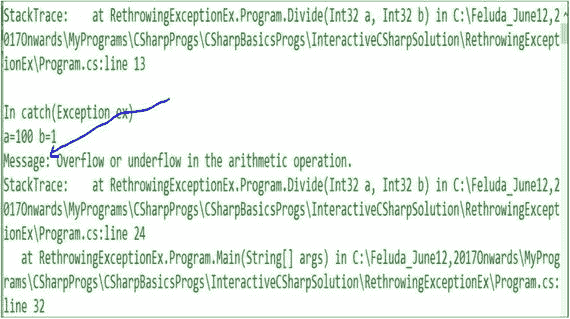

学生问:

先生，看来我们可以在这种情况下抛出任何例外。这是正确的吗？

老师说:是的，但是很明显，这是不被推荐的。但是，当您学习创建自己的异常时，您可以将这个原始异常与您的自定义异常消息结合起来，然后重新抛出它以获得更好的可读性。

## 创建自定义异常

老师继续说:有时我们想定义自己的异常来获得更有意义的信息。在我们继续之前，我们必须记住以下几点:

*   在异常层次结构中，我们注意到两种主要类型的异常类:SystemException 和 ApplicationException。SystemException 由运行时(CLR)抛出，ApplicationException 由用户程序抛出(到目前为止，我们一直使用 System Exception)。最初，有人建议用户定义的异常应该从 ApplicationException 类派生。然而，后来 MSDN 建议:“你应该从 Exception 类而不是 ApplicationException 类派生定制异常。您不应在代码中引发 ApplicationException 异常，也不应捕捉 ApplicationException 异常，除非您打算重新引发原始异常。(见 [`https://msdn.microsoft.com/en-us/library/system.applicationexception.aspx`](https://msdn.microsoft.com/en-us/library/system.applicationexception.aspx) )。)
*   当我们创建自己的异常时，类名应该以单词 exception 结尾。(见 [`https://docs.microsoft.com/en-us/dotnet/standard/exceptions/how-to-create-user-defined-exceptions`](https://docs.microsoft.com/en-us/dotnet/standard/exceptions/how-to-create-user-defined-exceptions) )。)
*   提供构造函数的三个重载版本(如演示 7 所述)。

当我们创建自己的例外时，我们将尝试遵循所有这些建议。

## 演示 7

```cs
using System;

namespace CustomExceptionEx1
{
    class ZeroDivisorException : Exception
    {
        public ZeroDivisorException() : base("Divisor is zero"){ }
        public ZeroDivisorException(string msg) : base(msg){ }
        public ZeroDivisorException(string msg, Exception inner) : base(msg, inner)
        { }
    }
    class TestCustomeException
    {
        int c;
        public int Divide(int a, int b)
        {
            if (b == 0)
            {
                //Ex.Message= "Divisor should not be Zero"
                throw new ZeroDivisorException("Divisor should not be Zero");
                //Ex.Message= "Divisor is Zero"
                //throw new ZeroDivisorException();
            }
            c = a / b;
            Console.WriteLine("Division completed");
            return c;
        }
    }
    class Program
    {
        static void Main(string[] args)
        {
            Console.WriteLine("***A Custom Exception Example***");
            int a = 10, b = 1, result;
            try
            {
                b--;
                TestCustomeException testOb = new TestCustomeException();
                result = testOb.Divide(a, b);
            }
            catch (ZeroDivisorException ex)
            {
                Console.WriteLine("Caught the custom exception
: {0}", ex.Message);
            }
            finally

            {
                Console.WriteLine("\nExample completed");
                Console.ReadKey();
            }
        }
    }
}

```

### 输出

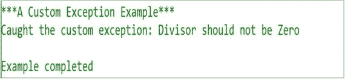

### 分析

我们使用了构造函数的第二个重载版本。如果您想使用默认的构造函数(前面已经注释过了)，会有一个不同的消息。

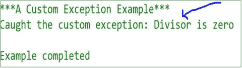

## 摘要

本章回答了以下问题。

*   什么是例外？
*   我们如何处理程序中的错误？
*   我们在 C# 中处理异常时常用的关键字有哪些？
*   我们应该如何在程序中放置 try、catch 和 block，目的是什么？
*   catch 子句有哪些不同的变体？
*   我们如何在程序中使用异常过滤器？
*   我们如何对异常进行分类？
*   我们如何定制例外？