# 十四、内存清理

教师开始讨论:管理内存是程序员关心的一个重要问题。酪 NET 试图让他们的生活变得更容易，负责清除那些在某个特定点之后没有用处的对象。在编程中，我们称之为脏对象或未引用对象。

垃圾收集器程序作为低优先级线程在后台运行，并跟踪脏对象。。NET 运行库可以定期调用此程序从内存中移除未引用的或脏的对象。

然而，有一个问题。一些对象需要特殊的拆卸代码来释放资源。一个非常常见的例子是当我们打开一个或多个文件，然后执行一些操作(例如，读、写等。)但忘记关闭文件。在其他情况下，也可能需要类似的注意，例如当我们处理程序中的非托管对象、锁定机制或操作系统句柄等时。程序员显然需要释放这些资源。

一般来说，当程序员努力清理(或释放)内存时，我们说他们试图释放对象，但当 CLR 自动处理释放资源时，我们说垃圾收集器正在执行其工作或垃圾收集正在进行。

Points to Remember

程序员可以通过显式释放对象来释放资源，或者 CLR 通过垃圾收集机制自动释放资源。

## 垃圾收集器如何工作

老师继续说:分代式垃圾收集器用于比长寿命对象更频繁地收集短寿命对象。我们这里有三代:0，1，2。短期对象存储在第 0 代中。生命周期较长的对象被推送到更高的层代—1 或 2。垃圾收集器在低代中比在高代中工作得更频繁。

一旦我们创建了一个对象，它就驻留在第 0 代中。当第 0 代填满时，垃圾收集器被调用。在第一代垃圾收集中幸存下来的对象被提升到下一个更高的代，即第 1 代。在第 1 代垃圾收集中幸存下来的对象进入最高的第 2 代。

Note

您可以记住 3-3 规则:垃圾收集工作在三个不同的阶段，通常，垃圾收集器在三种不同的情况下被调用。

### 垃圾收集的三个阶段

以下是垃圾收集的三个不同阶段:

*   阶段 1 是标记阶段，在该阶段中，活的物体被标记或识别。
*   阶段 2 是重定位阶段，在此阶段，它更新将在阶段 3 中压缩的对象的引用。
*   阶段 3 是压缩阶段，它从死的(或未被引用的)对象中回收内存，压缩操作在活动的对象上执行。它将活动对象(在此之前一直存在)移动到分段的旧末端。

### 调用垃圾收集器的三种情况

以下是调用垃圾收集器的三种常见情况:

*   在案例 1 中，我们的内存不足。
*   在情况 2 中，我们分配的对象(在托管堆中)超过了定义的阈值限制。
*   在第三种情况下，系统。调用 GC()方法。

我之前说过 GC。Collect()方法可用于强制垃圾收集机制。这个方法有许多重载版本。在下面的例子中，我们使用 GC。Collect(Int32)，强制从第 0 代到指定代立即进行垃圾回收。

为了理解这些概念，让我们检查下面的程序和输出。我们通过调用系统使垃圾收集器开始工作。GC()(案例三)。

## 演示 1

```cs
using System;

namespace GarbageCollectionEx4
{
    class MyClass
    {
        private int myInt;
        //private int myInt2;
        private double myDouble;

        public MyClass()
        {
            myInt = 25;
            //myInt2 = 100;
            myDouble = 100.5;
        }
        public void ShowMe()
        {
            Console.WriteLine("MyClass.ShowMe()");
        }
        public void Dispose()
        {
            GC.SuppressFinalize(this);
            Console.WriteLine("Dispose() is called");
            Console.WriteLine("Total Memory:" + GC.GetTotalMemory(false));
        }
        ~MyClass()
        {
            Console.WriteLine("Destructor is Called..");
            Console.WriteLine(" After this destruction total Memory:" + GC.GetTotalMemory(false));
            //To catch the output at end, we are putting some sleep
            System.Threading.Thread.Sleep(60000);
        }
    }

    class Program
    {
        public static void Main(string[] args)
        {
            Console.WriteLine("*** Exploring Garbage Collections.***");
            try
            {
                Console.WriteLine("Maximum Generations of GC:" + GC.MaxGeneration);
                Console.WriteLine("Total Memory:" + GC.GetTotalMemory(false));
                MyClass myOb = new MyClass();
                Console.WriteLine("myOb is in Generation : {0}", GC.GetGeneration(myOb));
                Console.WriteLine("Now Total Memory is:{0}", GC.GetTotalMemory(false));
                Console.WriteLine("Collection occured in 0th Generation:{0}", GC.CollectionCount(0));
                Console.WriteLine("Collection occured in 1th Generation:{0}", GC.CollectionCount(1));
                Console.WriteLine("Collection occured in 2th Generation:{0}", GC.CollectionCount(2));

                //myOb.Dispose();

                GC.Collect(0);//will call generation 0
                Console.WriteLine("\n After GC.Collect(0)");

                Console.WriteLine("Collection occured in 0th Generation:{0}", GC.CollectionCount(0));//1
                Console.WriteLine("Collection occured in 1th Generation:{0}", GC.CollectionCount(1));//0
                Console.WriteLine("Collection occured in 2th Generation:{0}", GC.CollectionCount(2));//0
                Console.WriteLine("myOb is in Generation : {0}", GC.GetGeneration(myOb));
                Console.WriteLine("Total Memory:" + GC.GetTotalMemory(false));

                GC.Collect(1);//will call generation 1 with 0
                Console.WriteLine("\n After GC.Collect(1)");

                Console.WriteLine("Collection occured in 0th Generation:{0}", GC.CollectionCount(0));//2
                Console.WriteLine("Collection occured in 1th Generation:{0}", GC.CollectionCount(1));//1
                Console.WriteLine("Collection ccured in 2th Generation:{0}", GC.CollectionCount(2));//0
                Console.WriteLine("myOb is in Generation : {0}", GC.GetGeneration(myOb));
                Console.WriteLine("Total Memory:" + GC.GetTotalMemory(false));

                GC.Collect(2);//will call generation 2 with 1 and 0
                Console.WriteLine("\n After GC.Collect(2)");

                Console.WriteLine("Collection occured in 0th Generation:{0}", GC.CollectionCount(0));//3
                Console.WriteLine("Collection occured in 1th Generation:{0}", GC.CollectionCount(1));//2
                Console.WriteLine("Collection ccured in 2th Generation:{0}", GC.CollectionCount(2));//1
                Console.WriteLine("myOb is in Generation : {0}", GC.GetGeneration(myOb));
                Console.WriteLine("Total Memory:" + GC.GetTotalMemory(false));

            }
            catch (Exception ex)
            {
                Console.WriteLine("Error:" + ex.Message);
            }

            Console.ReadKey();
        }
    }
}

```

### 输出

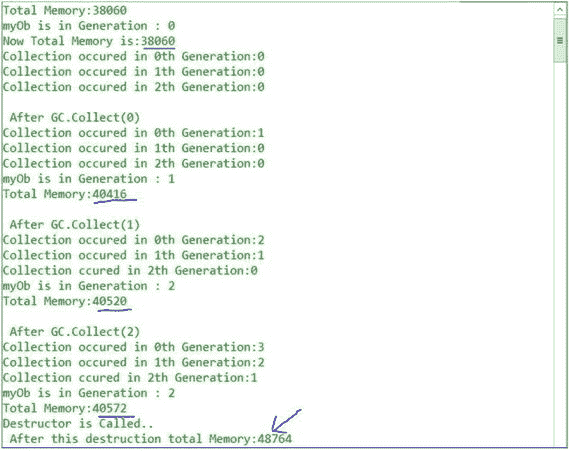

### 分析

再把理论过一遍，理解输出。然后尝试理解垃圾收集是如何发生的。我们可以看到，每当我们调用第 2 代时，其他代也会被调用。

您还可以看到，我们创建的对象最初放置在第 0 代中。

学生问:

先生，我们怎么能调用析构函数呢？

老师说:你不能调用析构函数。垃圾收集器负责这项工作。

学生问:

什么是托管堆？

老师说:当 CLR 初始化垃圾收集器时，它会分配一段内存来存储和管理对象。这种内存称为托管堆。

老师继续:一般来说，Finalize()(或者对象的析构函数)是被调用来清理内存的。因此，我们可以提供析构函数来释放我们的对象所拥有的一些未被引用的资源，在这种情况下，我们需要覆盖 Object 类的 Finalize()方法。

学生问:

垃圾收集器什么时候调用 Finalize()方法？

老师说:我们永远不知道。当发现没有引用的对象时，或者稍后当 CLR 需要回收一些内存时，它可能会立即调用。但是我们可以通过调用 System 来强制垃圾收集器在给定的点运行。GC.Collect()，它有很多重载版本。(我们已经通过调用 GC 看到了一个这样的用法。Collect(Int32))。

学生问:

为什么压缩是必要的？

老师继续说:当 GC 从堆中移除所有预期的对象(即那些没有引用的对象)时，堆中就包含了分散的对象。为了简单起见，你可以假设这是我们的堆。在垃圾收集器的清理操作之后，它可能如下所示(白色块表示空闲/可用块):

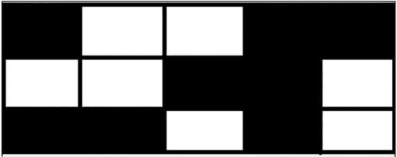

你可以看到，如果我们现在需要在我们的堆中分配五个连续的内存块，我们不能分配它们，尽管总的来说我们有足够的空间来容纳它们。为了处理这种情况，垃圾收集器需要应用压缩技术，将所有剩余的对象(活动对象)移动到一端，形成一个连续的内存块。因此，压缩后，它可能看起来像这样:


现在，我们可以轻松地在堆中分配五个连续的内存块。

这样，托管堆不同于旧的非托管堆。(这里我们不需要遍历地址链表来为新数据寻找空间。我们可以简单地使用堆指针；因此，实例化。网速更快)。压缩后，对象通常停留在相同的区域，因此访问它们也变得更容易和更快(因为页面交换更少)。这就是为什么微软也认为，虽然压缩操作的成本很高，但这种效果带来的总体收益更大。

学生问:

我们应该何时调用 GC。Collect()？

老师说:我已经提到过，调用 GC 通常是一个开销很大的操作。但是在一些特殊的场景中，我们绝对相信如果我们能够调用 GC，我们将会获得一些显著的好处。当我们在代码中取消引用大量对象时，可能会出现这样的例子。

另一个常见的例子是，当我们试图通过一些常见的操作来查找内存泄漏时(例如，重复执行测试来查找系统中的泄漏)。在每一次操作之后，我们可能会尝试收集不同的计数器来分析内存增长并获得正确的计数器。我们可能需要打电话给 GC。在每个操作开始时收集()。

我们将很快讨论内存泄漏分析。

学生问:

假设我们需要在应用运行的某个特定时间段回收一定量的内存。我们应该如何着手满足需求？

老师说。NET framework 提供了一个特殊的接口 IDisposable。

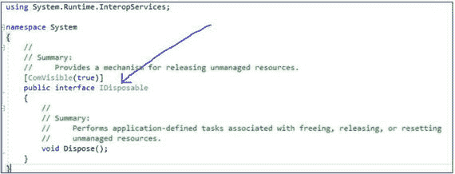

我们需要实现这个 IDisposable 接口，作为一个明显的动作，我们需要覆盖它的 Dispose()方法。当开发人员想要释放资源时，这是最佳实践。这种方法的另一个主要优点是，我们知道程序何时会释放未被引用的资源。

Points to Remember

当我们实现 IDisposable 接口时，我们假设程序员会正确地调用 Dispose()方法。一些专家仍然建议，作为预防措施，我们也应该实现一个析构函数。如果没有调用 Dispose()，这种方法可能会很有用。我同意这种双重实现在现实编程中更有意义。

C# 在这种情况下提供了特殊的支持。您可以使用“`using`语句”来减少代码大小，使其更具可读性。它被用作 try/finally 块的语法快捷方式。

## 内存泄漏分析

一般来说，当计算机程序运行了很长一段时间，但未能释放不再需要的内存资源时，我们可以感受到内存泄漏的影响(例如，随着时间的推移，机器变得很慢，或者在最糟糕的情况下，机器可能会崩溃)。有了这些信息，很明显“它多快引起我们的注意”取决于我们应用的泄漏率。

考虑一个非常简单的例子。假设我们有一个在线应用，用户需要填写一些数据，然后单击提交按钮。现在假设应用的开发人员错误地忘记了在用户按下提交按钮时释放一些不再需要的内存，由于这种错误判断，应用每次点击会泄漏 512 字节。在一些初始点击中，我们可能不会注意到任何性能下降。但是，如果成千上万的在线用户同时使用该应用，会发生什么呢？如果 10 万个用户点击提交按钮，我们最终将损失 48.8 MB 的内存，10 亿次点击将损失 4.76 GB 的内存，以此类推。

简而言之，即使我们的应用或程序每次执行都会泄漏非常少量的数据，很明显，在一段时间后，我们会看到某种故障；例如，我们可能会注意到我们的设备正在与一个系统崩溃。OutOfMemoryException，或者设备中的操作变得非常慢，以至于我们需要经常重启我们的应用。

在像 C++这样的非托管语言中，当预期的工作完成时，我们需要释放内存；否则，在一段时间内，内存泄漏的影响将是巨大的。在托管代码中，CLR 的垃圾回收器将我们从这些情况中解救出来。尽管如此，仍有一些情况需要我们小心处理；否则，我们可能会注意到内存泄漏的影响。

如果垃圾收集器工作正常，我们可以说，在给定的时间点，如果一个对象没有引用，垃圾收集器将找到该对象，它将假设不再需要该对象，因此，它可以回收该对象占用的内存。

那么，我们如何检测泄漏呢？windbg.exe 是在大型应用中查找内存泄漏的常用工具。除此之外，我们可以使用其他图形工具，如微软的 CLR Profiler、SciTech 的 Memory Profiler、Red Gate 的 ANTS Memory Profiler 等等，来查找我们系统中的漏洞。许多组织都有自己的内存泄漏工具来检测和分析泄漏。

在 Visual Studio 的最新版本中，有一个诊断工具可以检测和分析内存泄漏。它非常人性化，易于使用，你可以在不同的时间段拍摄不同的内存快照。工具中的标记表示垃圾收集器活动。这个工具的真正强大之处在于，您可以在调试会话处于活动状态时实时分析数据。图形中的尖峰可以立即吸引程序员的注意力。演示 2 包括执行以下程序后的快照示例。

## 演示 2

```cs
using System;
using System.Collections.Generic;

namespace AnalyzingLeaksWithSimpleEventEx1
{
    public delegate string MyDelegate(string str);

    class SimpleEventClass
    {
        public int ID { get; set; }

        public event MyDelegate SimpleEvent;

        public SimpleEventClass()
        {
            SimpleEvent += new MyDelegate(PrintText);
        }
        public string PrintText(string text)
        {
            return text;
        }

        static void Main(string[] args)
        {
            IDictionary<int, SimpleEventClass> col = new Dictionary<int, SimpleEventClass>();
            for (int objectNo = 0; objectNo < 500000; objectNo++)
            {
                col[objectNo] = new SimpleEventClass { ID = objectNo };
                string result = col[objectNo].SimpleEvent("Raising an event ");
                Console.WriteLine(objectNo);
            }
            Console.ReadKey();
        }
    }
}

```

### 来自诊断工具的快照

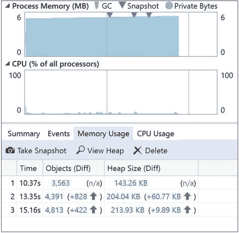

这是诊断工具窗口的屏幕截图；它包括三个不同的快照，用于分析给定时间点的内存使用情况。

我们可以看到堆的大小是如何随着时间的推移而增长的。如果你仔细观察，你会发现我们在代码中注册了一个事件

```cs
SimpleEvent += new MyDelegate(PrintText);

```

但从未注销过。

我还用微软的 CLR Profiler 展示了一个案例研究，来分析与程序相关的内存泄漏。这个工具是免费的，非常容易使用(尽管目前它已经失去了其他工具的普及)。您可以下载 CLR 探查器(用于。NET Framework 4)来自 [`https://www.microsoft.com/en-in/download/confirmation.aspx?id=16273`](https://www.microsoft.com/en-in/download/confirmation.aspx?id=16273) (注意:在撰写本文时，该链接工作正常，但将来可能会被更改/删除)。

让我们分析与不同程序相关的泄漏，但在这种情况下，我们将使用 CLR profiler。

考虑下面的程序(我在程序完成执行后拍摄了快照):

## 演示 3

```cs
using System;
using System.IO;//For FileStream

//Analysis of memory leak with an example of file handling

/* Special note: To use the CLR profiler:
   use the command: csc /t:exe /out:AnalyzingLeaksWithFileHandlingEx1.exe Program.cs to compile
   General Rule: csc /out:My.exe File.cs  <- compiles Files.cs and creates My.exe
   (you may need to set the PATH environment variable in your system)*/
namespace AnalyzingLeaksWithFileHandlingEx1
{
  class Program
        {
            class FileOps
            {
                public void readWrite()
                {

                    for (int i = 0; i < 1000; i++)
                    {
                        String fileName = "Myfile" + i + ".txt";
                        String path = @"c:\MyFile\" + fileName;
                        {
                            FileStream fileStreamName;
                            try
                            {
                                fileStreamName = new FileStream(path, FileMode.OpenOrCreate, FileAccess.ReadWrite);
                                //using (fileStreamName = new //FileStream(path, FileMode.OpenOrCreate, FileAccess.ReadWrite))
                                {
                                    Console.WriteLine("Created file no : {0}", i);
                                    //Forcefully throwing an exception, so that we cannot close //the file
                                    if (i < 1000)
                                    {
                                        throw new Exception("Forceful Exception");
                                    }
                                }
                               // FileStream not closed
                               // fileStreamName.Close();
                            }
                            catch (Exception e)
                            {
                                Console.WriteLine("Caught exception" + e);

                            }
                        }
                    }
                }
            }
            static void Main(string[] args)
            {
                FileOps filePtr = new FileOps();
                {
                    filePtr.readWrite();
                    Console.ReadKey();
                }
            }
        }
    }

```

### 来自 CLR 探查器的快照

CLR 探查器的示例报告可能如下所示:

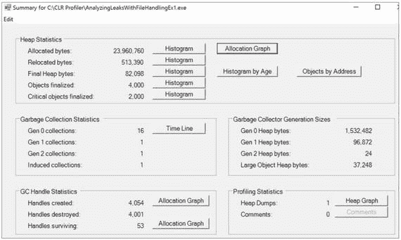

### 分析

从这个截图中，可以看到垃圾收集器需要清理不同代的次数。此外，如果您打开相应的直方图，您可以看到异常的问题与文件处理有关。为了供您参考，我在程序执行后打开了最终堆字节直方图、对象终结直方图和重定位对象直方图。

这是最终的堆字节直方图:

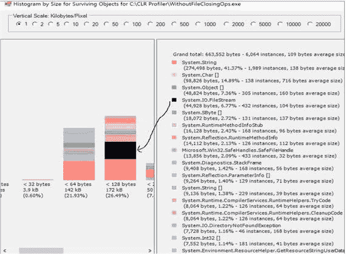

这是最终确定的对象直方图:

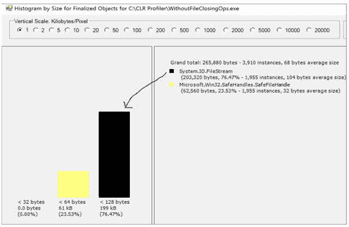

这是重新定位的对象直方图:

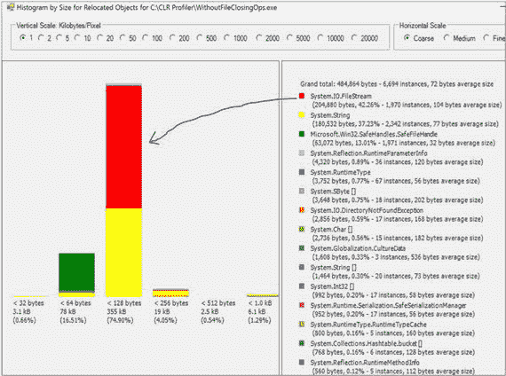

### 让我们修改程序

现在我们在前面的程序中启用了`using`语句，就像这样:

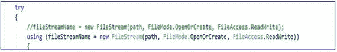

现在我们有了这份报告:

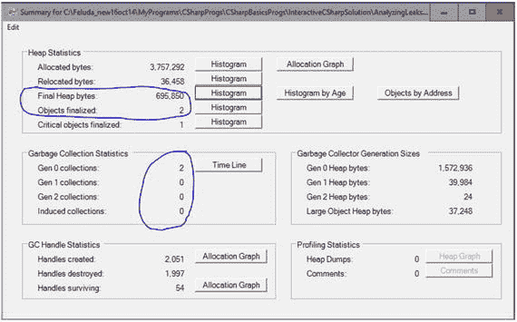

幸存对象的直方图如下:

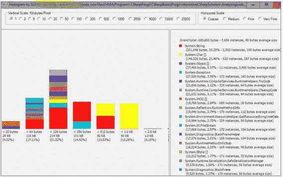

重定位对象的直方图如下:

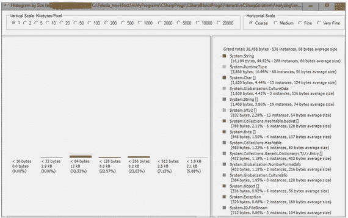

### 分析

现在我们可以看到不同之处:系统。FileStream 实例不再是一个问题。还要注意，垃圾收集器需要执行的任务比前一种情况少得多。

除此之外，您必须注意另一个重要的特征:如果我们分析 IL 代码，我们将看到一个 try/finally 块。

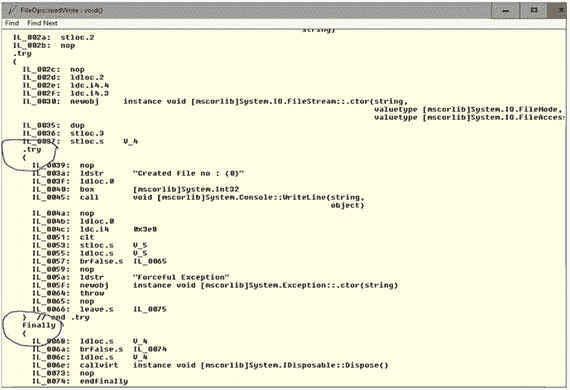

在这种情况下，编译器已经为我们创建了 try/finally 块，因为我们正在试验`using`语句。我已经提到过`using`语句充当 try/finally 块的语法快捷方式。

Points to Remember

根据微软的说法，`using`语句确保即使在调用对象上的方法时出现异常，Dispose()方法也会被调用。通过将对象放在 try 块中，然后在 finally 块中调用 Dispose()方法，可以获得相同的结果；实际上，编译器就是这样翻译`using`语句的。

所以，这一行代码:

```cs
using (FileStream fileStreamName = new FileStream(path, FileMode.OpenOrCreate, FileAccess.ReadWrite))
{
  //lines of codes
}

```

转换成这个:

```cs
FileStream fileStreamName = new FileStream(path, FileMode.OpenOrCreate, FileAccess.ReadWrite);
try
{
  //lines of codes
}
finally
{
if (fileStreamName != null) ((IDisposable) fileStreamName).Dispose();
}

```

老师继续说:让我们进入另一个讨论。在这种情况下，我们必须记住一个关键点:如果我们在 GC 中传递当前对象。SuppressFinalize()方法，则不会调用当前对象的 Finalize()方法(或析构函数)。

考虑以下三个程序及其输出，以理解我们如何在 C# 中回收内存。

## 演示 4

```cs
using System;

namespace GarbageCollectionEx1
{
    class MyClass : IDisposable
    {
        public int Sum(int a, int b)
        {
            return a + b;
        }
        public void Dispose()
        {
            GC.SuppressFinalize(this);
            Console.WriteLine("Dispose() is called");
        }
        ~MyClass()
        {
            Console.WriteLine("Destructor is Called..");
            System.Threading.Thread.Sleep(5000);
        }
    }
    class Program
    {
        static void Main(string[] args)
        {
            Console.WriteLine("*** Exploring Garbage Collections.Example-1***");
            MyClass myOb = new MyClass();
            int sumOfIntegers = myOb.Sum(10,20);
            Console.WriteLine("Sum of 10 and 20 is: " + sumOfIntegers);
            myOb.Dispose();
            Console.ReadKey();
        }
    }
}

```

### 输出

请注意，调用了 Dispose()方法，但没有调用对象的析构函数。

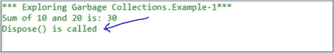

## 演示 5

现在我们已经注释掉了行`//GC.SuppressFinalize(this);`并且我们没有调用 Dispose()方法；也就是说，两行都被注释掉了。

```cs
using System;

namespace GarbageCollectionEx2
{
    class MyClass : IDisposable
    {
        public int Sum(int a, int b)
        {
            return a + b;
        }
        public void Dispose()
        {
            //GC.SuppressFinalize(this);
            Console.WriteLine("Dispose() is called");
        }
        ~MyClass()
        {
            Console.WriteLine("Destructor is Called..");
            //To catch the output at end, we are putting some sleep
            System.Threading.Thread.Sleep(15000);
        }
    }
    class Program
    {
        static void Main(string[] args)
        {
            Console.WriteLine("*** Exploring Garbage Collections.Example-2***");
            MyClass myOb = new MyClass();
            int sumOfIntegers = myOb.Sum(10, 20);
            Console.WriteLine("Sum of 10 and 20 is: " + sumOfIntegers);
            //myOb.Dispose();
            Console.ReadKey();
        }
    }
}

```

### 输出

在这种情况下调用了析构函数方法。

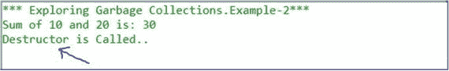

## 演示 6

现在我们注释掉前面程序中的行`//GC.SuppressFinalize(this);`，但是调用 Dispose()。

```cs
using System;

namespace GarbageCollectionEx3
{
    class MyClass : IDisposable
    {
        public int Sum(int a, int b)
        {
            return a + b;
        }
        public void Dispose()
        {
            //GC.SuppressFinalize(this);
            Console.WriteLine("Dispose() is called");
        }
        ~MyClass()
        {
            Console.WriteLine("Destructor is Called..");
            //To catch the output at end,we are putting some sleep
            System.Threading.Thread.Sleep(30000);
        }
    }
    class Program
    {
        static void Main(string[] args)
        {
            Console.WriteLine("*** Exploring Garbage Collections.Example-3***");
            MyClass myOb = new MyClass();
            int sumOfIntegers = myOb.Sum(10, 20);
            Console.WriteLine("Sum of 10 and 20 is: " + sumOfIntegers);
            myOb.Dispose();
            Console.ReadKey();
        }
    }
}

```

### 输出

Dispose()方法和析构函数现在都被调用。

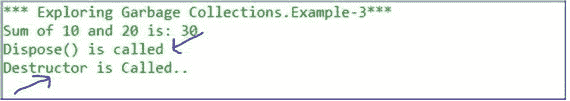

### 恶作剧

如果你理解我们到目前为止讨论的程序，预测这里的输出。

注意，我们的程序结构类似于 GarbageCollectionEx1 唯一的区别是一个类包含另一个类。

```cs
using System;

namespace GarbageCollectionEx1._1
{
    class MyClassA : IDisposable
    {
        MyClassB classBObject;
        class MyClassB : IDisposable
        {
            public int Diff(int a, int b)
            {
                return a - b;
            }
            public void Dispose()
            {
                GC.SuppressFinalize(this);
                Console.WriteLine("MyClass B:Dispose() is called");
            }
            ~MyClassB()
            {
                Console.WriteLine("MyClassB:Destructor is Called..");
                System.Threading.Thread.Sleep(5000);
            }
        }

        public int Sum(int  a, int b)
        {
            return a + b;
        }
        public int Diff(int a, int b)
        {
            classBObject = new MyClassB();
            return classBObject.Diff(a, b);
        }
        public void Dispose()
        {
            GC.SuppressFinalize(this);
            Console.WriteLine("MyClassA:Dispose() is called");
            classBObject.Dispose();
        }
        ~MyClassA()
        {
            Console.WriteLine("MyClassA:Destructor is Called..");
            System.Threading.Thread.Sleep(5000);
        }
    }

    class Program
    {
        static void Main(string[] args)
        {
            Console.WriteLine("*** Quiz:Exploring Garbage Collections.***");
            MyClassA obA = new MyClassA();
            int sumOfIntegers = obA.Sum(100, 20);
            int diffOfIntegers = obA.Diff(100, 20);
            Console.WriteLine("Sum of 10 and 20 is:{0}",sumOfIntegers);
            Console.WriteLine("Difference of 10 and 20 is:{0}",diffOfIntegers);
            obA.Dispose();
            Console.ReadKey();
        }
    }
}

```

### 输出

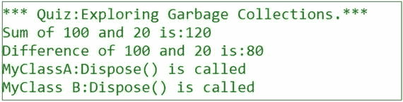

### 恶作剧

现在让我们注释掉前面程序中的代码，如下所示:

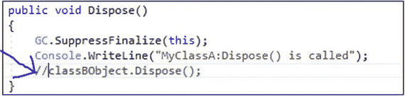

会输出什么？

### 回答

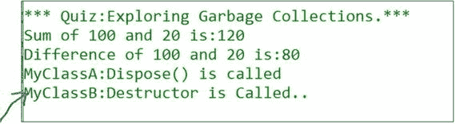

### 分析

注意，这次调用了 MyClassA 的 Dispose()和 MyClassB 的析构函数。

## 摘要

本章回答了以下问题:

*   什么是垃圾收集(GC)？在 C# 中是如何工作的？
*   有哪些不同的 GC 代？
*   调用垃圾收集器有哪些不同的方法？
*   怎么才能强制 GC？
*   什么是内存泄漏？
*   内存泄漏的可能原因是什么？
*   怎样才能有效的使用 Dispose()方法来收集内存？
*   我们如何将内存泄漏分析与 Visual Studio 的诊断工具和微软的 CLR Profiler 结合使用？