# 十五、设计模式介绍

## 介绍

教师开始讨论:在一段时间内，软件工程师在软件开发过程中面临一个共同的问题。没有标准来指导他们如何设计和进行。当一个新成员(有经验或没有经验无关紧要)加入团队，并且他/她被分配从头开始做一些事情或者修改现有架构中的一些东西时，这个问题变得很重要。由于没有标准，理解系统架构需要巨大的努力。设计模式解决了这个问题，并为所有开发人员提供了一个公共平台。请注意，这些模式将在面向对象的设计中应用和重用。

大约在 1995 年，四位作者——Erich Gamma、Richard Helm、Ralph Johnson 和 John Vlissides 提交了他们的书《设计模式:可重用面向对象软件的元素》( Addison-Wesley，1995 年)，他们在书中提出了软件开发中设计模式的概念。这些作者被称为“四人帮”。他们引入了 23 种设计模式，这些模式是基于软件开发人员长时间的经验开发出来的。现在，如果任何新成员加入开发团队，并且他知道新系统遵循一些特定的设计模式，他可以立即对该设计架构有所了解。因此，他可以在很短的时间内与其他团队成员一起积极参与开发过程。

现实生活中设计模式的第一个概念来自建筑建筑师克里斯托弗·亚历山大。他反复经历了一些常见的问题。因此，他试图以一种统一的方式用一个相关的解决方案(针对建筑设计)来解决这些问题。人们认为软件行业掌握了这个概念，因为软件工程师可以将他们的产品与构建应用联系起来。每个模式描述了一个在我们的环境中反复出现的问题，然后描述了该问题解决方案的核心，以这样一种方式，你可以使用这个解决方案一百万次，而不必以同样的方式做两次。—克里斯托弗·亚历山大

GoF 向我们保证，尽管模式是针对建筑和城镇描述的，但是相同的概念也可以应用于面向对象设计中的模式。我们可以用物体和界面来代替墙和门的原始概念。两者的共同点是，在核心上，两种类型的模式都试图在某些特定的上下文中找到一些解决方案。

1995 年，用 C++讨论了最初的概念。但是 C# 是 2000 年才出现的。在本书中，我们将尝试用 C# 来研究三种设计模式。如果你熟悉其他流行的编程语言，比如 Java、C++等等，那么你会很容易理解这些概念。我选择了简单且容易记忆的例子来帮助你发展这些概念。

## 要点

*   设计模式是针对常见问题的通用可重用解决方案。
*   我们的目标是制作一个如何解决问题的模板，可以在许多不同的情况下使用。
*   这些是对通信对象和类的描述，这些对象和类是为解决特定上下文中的一般设计问题而定制的。
*   “四人帮”讨论了 23 种设计模式，它们可以分为三大类。
    *   创建模式:这些模式抽象了实例化过程。我们试图创造一个独立于物体的构成、创造和表现的系统。以下五种模式属于这一类。
        *   单一模式
        *   原型模式
        *   工厂方法模式
        *   构建器模式
        *   抽象工厂模式
    *   结构模式:这里我们关注如何将类和对象组合成相对较大的结构。他们通常使用继承来组成接口或实现。以下七种模式属于这一类。
        *   代理模式
        *   轻量级模式
        *   复合模式
        *   桥接模式
        *   立面图案
        *   装饰图案
        *   适配器模式
    *   行为模式:这里我们关注的是算法和对象间的责任分配。我们也关注他们之间的交流过程。我们需要敏锐地观察这些物体相互联系的方式。以下 11 种模式属于这一类。
        *   观察者模式
        *   战略模式
        *   模板方法模式
        *   命令模式
        *   迭代器模式
        *   纪念品图案
        *   状态模式
        *   中介模式
        *   责任链模式
        *   访问者模式
        *   解释程序模式

这里我们只探索三种设计模式:每一类一种。我选择了最简单的例子，以便你能容易地理解它们。但是你必须反复思考它们中的每一个，练习，尝试将它们与其他问题联系起来，并最终继续编写代码。这个过程会帮助你掌握这门学科。

## 单一模式

### GoF 定义

确保一个类只有一个实例，并提供对它的全局访问点。

### 概念

一个特定的类应该只有一个实例。我们只会在需要的时候使用那个实例。

### 现实生活中的例子

假设你是一个运动队的成员。你的团队将在锦标赛中与另一个团队比赛。根据游戏规则，双方队长必须掷硬币来决定哪一方先开始游戏。所以，如果你的团队没有队长，你需要选一个人当队长。而且，你的队伍必须只有一个队长。

### 一个计算机世界的例子

在软件系统中，有时我们决定只使用一个文件系统。通常，我们用它来集中管理资源。

### 说明

在这个例子中，我们将构造函数设为私有，这样我们就不能以正常的方式实例化。当我们试图创建一个类的实例时，我们检查我们是否已经有一个可用的副本。如果我们没有这样的副本，我们将创建它；否则，我们将简单地重用现有的副本。

### 类图

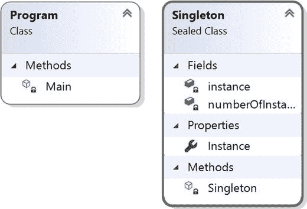

### 解决方案资源管理器视图

下面显示了程序各部分的高级结构。

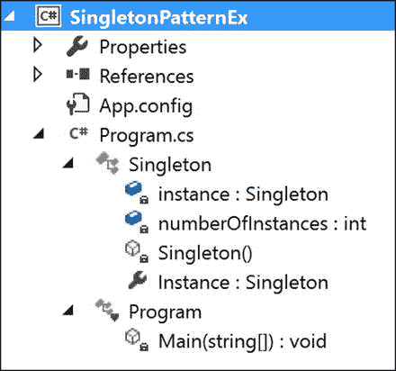

### 讨论

我们实现了一个非常简单的例子来说明单例模式的概念。这种方法被称为静态初始化。

最初，C++规范对于静态变量的初始化顺序有些模糊。但是。NET Framework 解决了这个问题。

这种方法的显著特点如下:

*   CLR(公共语言运行时)负责变量的初始化过程。
*   当引用类的任何成员时，我们将创建一个实例。
*   公共静态成员确保一个全局访问点。它确认实例化过程将不会开始，直到我们调用类的实例属性(即，它支持惰性实例化)。sealed 关键字防止类的进一步派生(这样它的子类就不能滥用它)，readonly 确保赋值过程将在静态初始化期间发生。
*   我们的构造函数是私有的。我们不能在外部实例化单例类。这有助于我们引用系统中可能存在的唯一实例。

### 履行

```cs
using System;

namespace SingletonPatternEx
{
    public sealed class Singleton
    {
        private static readonly Singleton instance=new Singleton();
        private int numberOfInstances = 0;
        //Private constructor is used to prevent
        //creation of instances with 'new' keyword outside this class
        private Singleton()
        {
         Console.WriteLine("Instantiating inside the private constructor.");
         numberOfInstances++;
         Console.WriteLine("Number of instances ={0}", numberOfInstances);
        }
        public static Singleton Instance
        {
            get
            {
                Console.WriteLine("We already have an instance now.Use it.");
               return instance;
            }
        }
        //public static int MyInt = 25;
    }
    class Program
    {
        static void Main(string[] args)
        {
            Console.WriteLine("***Singleton Pattern Demo***\n");
            //Console.WriteLine(Singleton.MyInt);
            // Private Constructor.So,we cannot use 'new' keyword.
            Console.WriteLine("Trying to create instance s1.");
            Singleton s1 = Singleton.Instance;
            Console.WriteLine("Trying to create instance s2.");
            Singleton s2 = Singleton.Instance;
            if (s1 == s2)
            {
                Console.WriteLine("Only one instance exists.");
            }
            else
            {
                Console.WriteLine("Different instances exist.");
            }
            Console.Read();
        }
    }

}

```

#### 输出

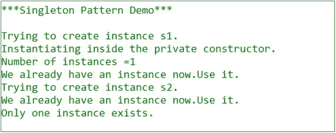

### 挑战

考虑下面的代码。假设我们在 Singleton 类中增加了一行代码，如下所示:

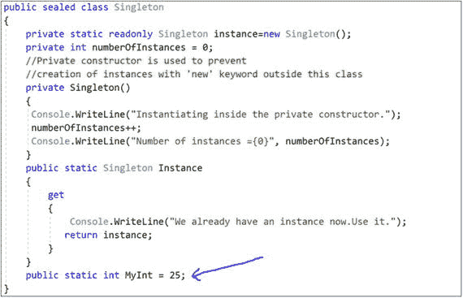

假设我们的 Main()方法如下所示:

```cs
class Program
    {
        static void Main(string[] args)
        {
            Console.WriteLine("***Singleton Pattern Demo***\n");
            Console.WriteLine(Singleton.MyInt);
            Console.Read();
        }
    }

```

现在，如果您执行该程序，您将看到以下输出:

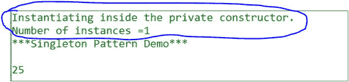

这是这种方法的缺点。在 Main()内部，您只尝试了 MyInt 静态变量，但是您的应用仍然创建了 Singleton 类的一个实例；也就是说，您对实例化过程的控制较少。每当您引用该类的任何成员时，实例化过程就会开始。

在大多数情况下，这种方法在. NET 中更受欢迎。

### 问答环节

问题 1:为什么我们要把事情复杂化？我们可以简单地编写我们的单例类，如下所示:

```cs
public class Singleton
    {
        private static Singleton instance;

        private Singleton() { }

        public static Singleton Instance
        {
            get
            {
                if (instance == null)
                {
                    instance = new Singleton();
                }
                return instance;
            }
        }
    }

```

答:这种方法可以在单线程环境中工作。但是考虑多线程环境。在多线程环境中，假设两个(或更多)线程试图对此进行评估:

```cs
if (instance == null)

```

如果他们发现实例还没有被创建，他们每个人都会尝试创建一个新的实例。因此，我们最终可能会得到该类的多个实例。

问题 2:有没有其他的方法来模拟单例设计模式？

答:方法有很多。他们每个人都有自己的优点和缺点。让我们讨论其中的一种，叫做双重检查锁定。MSDN 将这一方法概述如下:

```cs
//Double checked locking
    using System;

    public sealed class Singleton
    {
        /*We are using volatile to ensure that
          assignment to the instance variable finishes before it's   access*/
        private static volatile Singleton instance;
        private static object lockObject = new Object();

        private Singleton() { }

        public static Singleton Instance
        {
            get
            {
                if (instance == null)
                {
                    lock (lockObject)
                    {
                        if (instance == null)
                            instance = new Singleton();
                    }
                }
                return instance;
            }
        }
    }

```

这种方法可以帮助我们在真正需要的时候创建实例。但是一般来说，锁定机构是昂贵的。

问题 3:为什么我们将实例标记为 volatile？

答案:我们来看看 C# 规范告诉我们的:“volatile 关键字表示一个字段可能会被同时执行的多个线程修改。声明为 volatile 的字段不受假定由单个线程访问的编译器优化的影响。这可确保字段中始终显示最新的值。”

简单地说，volatile 关键字帮助我们提供了一种序列化访问机制；也就是说，所有线程将按照它们的执行顺序观察任何其他线程的改变。请记住，volatile 关键字适用于类(或结构)字段；我们不能将它们应用于局部变量。

如果你有兴趣了解更多关于单例模式的不同方法，你可以看看 Jon Skeets 的评论。在他的文章 [`http://csharpindepth.com/Articles/General/Singleton.aspx`](http://csharpindepth.com/Articles/General/Singleton.aspx) 中，他讨论了各种选择(及其优缺点)来建立一个单例模式的模型。

## 适配器模式

### GoF 定义

将一个类的接口转换成客户期望的另一个接口。适配器允许类一起工作，否则由于不兼容的接口而无法工作。

### 概念

下面给出的例子最好地描述了核心概念。

### 现实生活中的例子

这种类型最常见的例子是电源适配器。交流电源提供不同类型的插座，以适应所需的插座。考虑另一个例子。很多时候，我们需要通过总机用充电器给手机充电。但是，如果我们发现我们的移动充电器不能用于(或插入)特定的配电盘，我们需要使用适配器。在现实生活中，即使是翻译语言的译者也可以被认为遵循了这种模式。

因此，您可以这样想象:您的应用被插入到一个适配器(在本例中是 x 形的)中，该适配器使您能够使用预期的接口。没有适配器，您就不能连接应用和接口。

下图说明了使用适配器之前的情况:

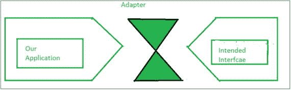

下图说明了使用适配器后的情况:


### 一个计算机世界的例子

下面的例子很好地描述了这种模式最常见的用法。

### 说明

在这个例子中，我们可以很容易地计算出一个矩形的面积。请注意 Calculator 类及其 GetArea()方法。我们需要在 GetArea()方法中提供一个矩形来获取矩形的面积。现在假设我们想计算一个三角形的面积，但是我们的约束是我们想通过计算器的 GetArea()得到它的面积。我们如何做到这一点？

为了满足需求，我们为三角形制作了一个适配器(示例中为 CalculatorAdapter ),并在它的 GetArea()方法中传递一个三角形。该方法将三角形视为矩形，然后调用 Calculator 类的 GetArea()来获取面积。

### 类图

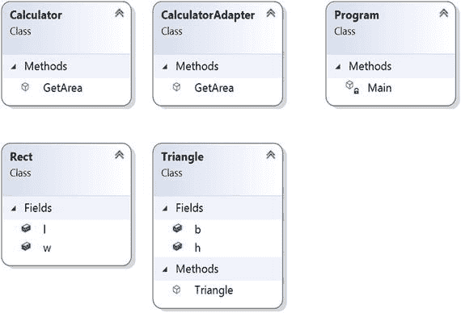

### 有向图文档

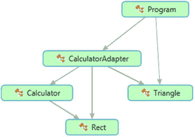

### 解决方案资源管理器视图

以下是该计划各部分的高级结构:

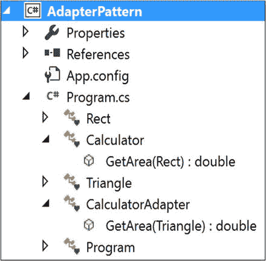

### 履行

```cs
using System;

namespace AdapterPattern
{
    class Rect
    {
        public double l;
        public double w;
    }
    class Calculator
    {
        public double GetArea(Rect r)
        {
            return r.l * r.w;
        }
    }
    //Calculate the area of triangle using Calculator and Rect type as input.Whether we have Triangle.
    class Triangle
    {
        public double b;//base
        public double h;//height
        public Triangle(int b, int h)
        {
            this.b = b;
            this.h = h;
        }
    }
    class CalculatorAdapter
    {

        public double GetArea(Triangle t)
        {
            Calculator c = new Calculator();
            Rect r = new Rect();
            //Area of Triangle=0.5*base*height
            r.l = t.b;
            r.w = 0.5*t.h;
            return c.getArea(r);
        }

    }

    class Program

    {
        static void Main(string[] args)
        {
            Console.WriteLine("***Adapter Pattern Demo***\n");
            CalculatorAdapter cal=new CalculatorAdapter();
            Triangle t = new Triangle(20,10);
            Console.WriteLine("Area of Triangle is " + cal.GetArea(t)+" Square unit");
            Console.ReadKey();
        }
    }
}

```

#### 输出

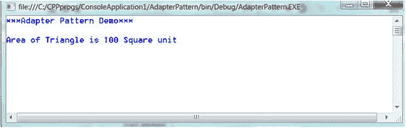

让我们修改插图。

我们已经看到了适配器设计模式的一个非常简单的例子。但是如果你想遵循面向对象的设计原则，你可能需要修改这个例子。一个主要原因是我们需要使用接口，而不是使用具体的类。因此，记住前面的目标，让我们修改我们的插图。

以下是新示例的主要特征:

*   Rect 类实现 RectInterface，CalculateAreaOfRectangle()方法帮助我们计算矩形对象的面积。
*   Triangle 类实现了 TriInterface，CalculateAreaOfTriangle()方法帮助我们计算三角形对象的面积。
*   您的约束是您需要使用 RectInterface 来计算三角形的面积。为了达到这个目的，我们制作了一个可以与 RectInterface 对话的适配器。
*   现在注意使用这种模式的好处:矩形和三角形代码都不需要改变。我们使用了一个适配器来帮助我们与 RectInterface 对话，在高层次上，似乎通过使用 RectInterface 方法，我们正在计算一个三角形的面积。
*   请注意，GetArea(RectInterface r)方法不知道通过 TriangleAdapter，它正在获取一个三角形对象，而不是一个矩形对象。
*   注意另一个重要的事实和用法。假设您没有很多矩形对象，但是您的需求很大。通过这种模式，您可以使用一些行为类似矩形对象的三角形对象。怎么做？嗯，如果你仔细注意，你会发现通过使用适配器(虽然我们调用的是 CalculateAreaOfRectangle())，它实际上是在调用 CalculateAreaOfTriangle()。因此，我们可以根据需要修改方法体；例如，我们可以将三角形面积乘以 2.0，得到 200 平方英尺的面积。单位(就像一个长 20 个单位，宽 10 个单位的矩形对象)。在您需要处理面积为 200 平方单位的对象的情况下，这可能会有所帮助。
*   为了更好的可读性，在这个例子中，我们没有遵循 C# 标准的接口命名约定(也就是说，我们没有以“I”作为接口的开头)。

### 解决方案资源管理器视图

以下是该计划各部分的高级结构:

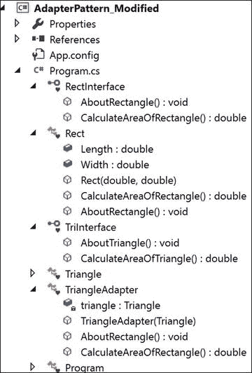

### 履行

```cs
using System;
namespace AdapterPattern_Modified
{
    interface RectInterface
    {
        void AboutRectangle();
        double CalculateAreaOfRectangle();
    }
    class Rect : RectInterface
    {
        public double Length;
        public double Width;
        public Rect(double l, double w)
        {
            this.Length = l;
            this.Width = w;
        }

     public double CalculateAreaOfRectangle()
     {
        return Length * Width;
     }

     public void AboutRectangle()
     {
      Console.WriteLine("Actually, I am a Rectangle");
     }
    }

    interface TriInterface
    {
        void AboutTriangle();
        double CalculateAreaOfTriangle();
    }
    class Triangle : TriInterface
    {
        public double BaseLength;//base
        public double Height;//height
        public Triangle(double b, double h)
        {
            this.BaseLength = b;
            this.Height = h;
        }

        public double CalculateAreaOfTriangle()
        {
            return 0.5 * BaseLength * Height;
        }
        public void AboutTriangle()
        {
            Console.WriteLine(" Actually, I am a Triangle");
        }
    }

    /*TriangleAdapter is implementing RectInterface

.
     So, it needs to implement all the methods defined
    in the target interface.*/
    class TriangleAdapter:RectInterface
    {
        Triangle triangle;
        public TriangleAdapter(Triangle t)
        {
            this.triangle = t;
        }

        public void AboutRectangle()
        {
            triangle.AboutTriangle();
        }

        public double CalculateAreaOfRectangle()
        {
            return triangle.CalculateAreaOfTriangle();
        }
    }

    class Program

    {
        static void Main(string[] args)
        {
            Console.WriteLine("***Adapter Pattern Modified Demo***\n");
            //CalculatorAdapter cal = new CalculatorAdapter();
            Rect r = new Rect(20, 10);
            Console.WriteLine("Area of Rectangle is :{0} Square unit", r.CalculateAreaOfRectangle());
            Triangle t = new Triangle(20, 10);
            Console.WriteLine("Area of Triangle is :{0} Square unit", t.CalculateAreaOfTriangle());
            RectInterface adapter = new TriangleAdapter(t);
            //Passing a Triangle instead of a Rectangle
            Console.WriteLine("Area of Triangle using the triangle adapter is :{0} Square unit", GetArea(adapter));
            Console.ReadKey();
        }
        /*GetArea(RectInterface r) method  does not know that through TriangleAdapter,it is getting a Triangle instead of a Rectangle*/
        static double GetArea(RectInterface r)
        {
            r.AboutRectangle();
            return r.CalculateAreaOfRectangle();
        }
    }
}

```

#### 输出

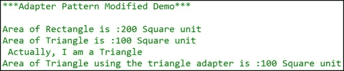

#### 注意

GoF 解释了两种适配器:类适配器和对象适配器。

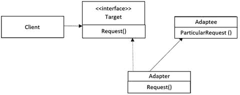

*   对象适配器通过对象组合来适应。我们讨论的适配器是对象适配器的一个例子。在许多地方，您会注意到这个对象适配器的典型类图。

在我们的例子中，TriangleAdapter 是实现 RectInterface(目标接口)的适配器，Triangle 是被适配器。您可以看到适配器保存了 adaptee 实例(即在本例中实现了对象组合)。

*   类适配器通过子类化来适应。他们是多重继承的支持者。但是我们知道在 C# 中，不支持通过类的多重继承。(我们需要接口来实现多重继承的概念)。

下面是支持多重继承的类适配器的典型类图:

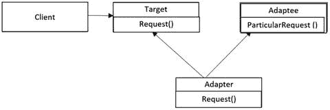

### 问答环节

问:如何在 C# 中实现类适配器设计模式？

答:我们可以子类化一个现有的类，并实现所需的接口。考虑下面的代码块。

```cs
class ClassAdapter : Triangle, RectInterface
    {
        public ClassAdapter(double b, double h) : base(b, h)
        {
        }

        public void AboutRectangle()
        {
            Console.WriteLine(" Actually, I am an Adapter");
        }

        public double CalculateAreaOfRectangle()
        {
            return 2.0 * base.CalculateAreaOfTriangle();
        }
    }

```

但是我们必须注意，这种方法可能并不适用于所有场景；例如，当我们需要修改 C# 接口中没有指定的方法时。在这些情况下，对象适配器是有用的。

## 访问者模式

### GoF 定义

表示要在对象结构的元素上执行的操作。Visitor 允许您定义一个新的操作，而不改变它所操作的元素的类。

### 概念

在这种模式中，我们可以将算法从它所操作的对象结构中分离出来。因此，我们可以向现有的对象结构添加新的操作，而无需修改那些结构。这样，我们就遵循了开放/封闭原则(允许扩展，但不允许修改实体，如类、函数、模块等)。).

### 现实生活中的例子

我们可以想象一个出租车预订的场景。当出租车到达我们家门口，我们进入出租车时，“来访”的出租车控制了交通。

### 一个计算机世界的例子

当我们插入公共 API 时，这种模式非常有用。然后，客户端可以使用访问类对某个类执行操作，而无需修改源代码。

### 说明

这里我们给出了一个简单的例子来描述访问者设计模式。你可以在这里看到两个类层次——最左边的一个代表原始的类层次。最右边的是我们创造的。IOriginalInterface 层次结构中的任何修改/更新操作都可以通过这个新的类层次结构来完成，而不会干扰原始代码。

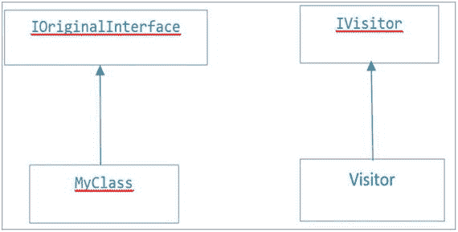

考虑一个简单的例子。假设，在这个例子中，我们想要修改 MyClass 中的初始整数值，但是我们的约束是我们不能改变现有层次结构中的代码。

为了满足这一要求，在下面的演示中，我们将功能实现(即算法)从原始的类层次结构中分离出来，并将所有逻辑放入 visitor 类层次结构中。

### 类图

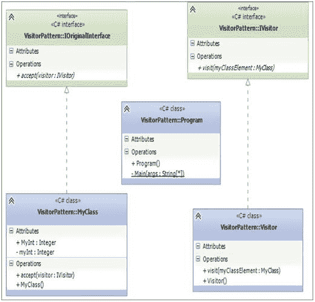

### 解决方案资源管理器视图

以下是该计划各部分的高级结构:

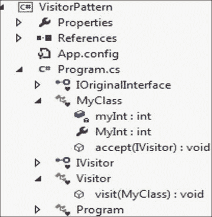

### 履行

```cs
using System;

namespace VisitorPattern
{
    interface IOriginalInterface
    {
        void accept(IVisitor visitor);
    }
     class MyClass : IOriginalInterface
    {
         private int myInt = 5;//Initial or default value

         public int MyInt
         {
             get
             {
                 return myInt;
             }
             set
             {
                 myInt = value;
             }
         }
        public void accept(IVisitor visitor)
        {
            Console.WriteLine("Initial value of the integer:{0}", myInt);
            visitor.visit(this);
            Console.WriteLine("\nValue of the integer now:{0}", myInt);
        }
    }

    interface IVisitor

    {
        void visit(MyClass myClassElement);
    }
    class Visitor : IVisitor
    {
        public void visit(MyClass myClassElement)
        {
            Console.WriteLine("Visitor is trying to change the integer value");
            myClassElement.MyInt = 100;
            Console.WriteLine("Exiting from Visitor- visit");
        }
    }
    class Program
    {
        static void Main(string[] args)
        {
            Console.WriteLine("***Visitor Pattern Demo***\n");
            IVisitor v = new Visitor();
            MyClass myClass = new MyClass();
            myClass.accept(v);
            Console.ReadLine();
        }
    }
}

```

#### 输出


### 问答环节

问题 1:什么时候我们应该考虑实现访问者设计模式？

答:当我们需要在不修改现有架构的情况下添加功能时。这是访问者模式的主要目标。对于这种模式，封装不是主要考虑的问题。

问题 2:这种模式有什么缺点吗？

答:这里封装不是它的主要关注点。因此，在许多情况下，我们可能会使用访问者来打破封装。如果我们经常需要向现有架构添加新的具体类，那么访问者层次结构将变得难以维护。例如，假设我们想在原来的层次结构中添加另一个具体的类。在这种情况下，我们需要相应地修改 visitor 类的层次结构。

## 摘要

本章介绍了

*   设计模式
*   三个四人组设计模式:单体模式、适配器模式和 C# 实现的访问者模式