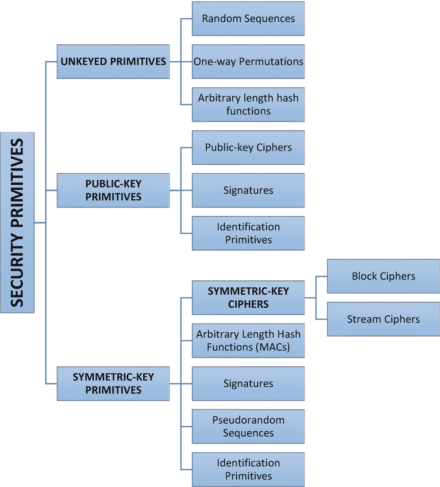
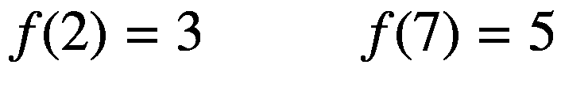
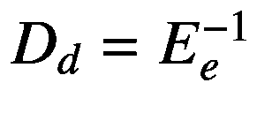

# 一、密码学基础

## 介绍

密码学的历史很长，也很有趣。完整的密码学非技术参考，推荐*破译者* [ [1](#Par147) ] *。*这本书介绍了从大约 4000 年前埃及人首次使用密码学到近代历史，当时密码学在两次世界大战的结局中发挥了至关重要的作用。这本书写于 **1963** 年，涵盖了对密码学发展意义重大的历史方面。密码学被视为一门艺术，它与外交服务、军事人员和政府有关。密码术已经被用作保护与国家安全相关的策略和不同秘密的工具。

密码学历史上最重要的发展是在 1976 年，当时迪菲和赫尔曼[[发表了题为“密码学的新方向”的工作论文这篇论文介绍了彻底改变了人们对密码学的看法的概念:公钥密码学。作者还介绍了一种新颖巧妙的密钥交换方法。该方法的安全性是基于离散对数问题的难解性。当时，作者们还没有公钥加密方案的实际实现，这个想法非常清晰，并开始在加密社区中产生巨大的兴趣。从 **1978** 开始，Rivest、Shamir 和 Adleman(现在称为 RSA [](#Par148) [3](#Par149) )提出了公钥加密和签名方案的第一个实现。RSA 方案基于分解大整数的困难性。如果我们在 RSA 的整数因式分解和 Shor 的算法之间进行比较，我们将观察到最后一个算法将在量子计算机的多项式时间内运行，这将对任何基于大整数因式分解困难假设的加密方法提出重大挑战[ [62](#Par208) ]。大整数因式分解的应用及其目的增加了因式分解方法的数量。在 **1980 年，**在这个领域有了重要的进步，但是没有一个进步表明 RSA 的安全性有任何改进。ElGamal[4](#Par150)于 1985 年 T12 发现并提出了一类非常重要的实用公钥方案。他的方案也是基于离散对数的问题。

数字签名代表了公钥加密提供的最重要和最有意义的贡献。在 **1991** 年，采用了 ISO/IEC 9796 数字签名国际标准 [5](#Par151) 。该标准基于 RSA 公钥方案。在 **1994** ，美国政府采用了数字签名标准，这是一个基于离散对数问题的强大方案。

如今，寻找新的公钥方案、改进当前的密码机制以及设计新的安全证明仍在进行，并继续带来显著的改进。

这本书的目标和目的是解释在实践中最重要的密码学方面的原理、技术、算法和实现的最新更新。重点是最实用和应用的方面。您将了解代表问题的方面，我们将指出文献中的参考资料和提供解决方案的最佳实践。由于涵盖了大量的材料，大多数结果将伴随着实施。这也有助于不模糊加密的真正本质。这本书为执行者和研究者提供了强有力的材料。这本书描述了算法和软件系统及其相互作用。

### 信息安全和密码学

在本书中，*信息*的术语和概念可以理解为*量。*为了通过算法和实现技术(如 C#)介绍密码学及其应用，您需要了解与信息安全相关的问题。参与某项交易的所有各方必须确信，与信息安全相关的特定目标已得到遵守。目标列于表 [1-1](#Tab1) 中。

表 1-1

安全目标

<colgroup><col class="tcol1 align-left"> <col class="tcol2 align-left"></colgroup> 
| 

安全目标

 | 

描述

 |
| --- | --- |
| 隐私/保密 | 对未经授权查看信息的人保密 |
| 签名 | 将签名绑定到实体(例如文档)的方法 |
| 批准 | 从一个实体发送到另一个实体，代表官方授权做某事或成为某事 |
| 消息认证 | 称为数据的认证来源；一些文本使用信息来源的确证作为定义 |
| 数据完整性 | 确保信息未被未授权人员或通过其他未知手段更改的过程 |
| 实体认证/识别 | 比较实体的身份(例如，计算机、个人、信用卡等。). |
| 确认 | 为授权提供及时性的一种方式，以便使用或操作信息或资源 |
| 证书 | 表示受信任实体对信息的确认 |
| 访问控制 | 将资源限制到特权实体的过程 |
| 证书 | 可信认证对信息的确认 |
| 时间戳 | 代表信息创建或存在时间的记录 |
| 见证 | 一种验证由不同于创建者的实体所表示的信息的创建存在的方法 |
| 收据 | 表示已收到信息的确认 |
| 所有权 | 向一个实体提供使用或转移特定资源给其他实体的合法权利的一种方式 |
| 确认 | 表示对服务提供是否成功的确认 |
| 取消 | 撤销认证或授权的过程 |
| 不可否认性 | 防止否定其他先前的承诺或行动的过程 |
| 匿名 | 特定过程中涉及的实体的身份的隐藏过程 |

已经创建了一组协议和机制来处理当通过物理文档发送信息时由信息安全引起的问题。信息安全的目标也可以通过数学算法和协议来实现，同时需要程序技术并通过实现预期结果来遵循法律。作为一个例子，让我们考虑信件的隐私，这是由合法的邮件服务提供的密封信封提供的。信封的物理安全性有其自身的局限性，并且法律是以这样的方式建立的，如果邮件被未被授权的人打开，他们可能会被指控犯有刑事罪。在有些情况下，这种安全性不仅是通过信息本身实现的，也是通过记录信息原始性的纸质文件实现的。作为一个例子，考虑纸币，它需要特殊的墨水和材料，以避免和防止伪造。

从概念上讲，信息存储、注册、解释和记录的方式没有太大变化。复制和修改信息的能力代表了操纵已被显著改变的信息的最重要的特征之一。

信息安全中使用的最重要的工具之一由 s *签名* *表示。*它代表了多种服务的构建模块，例如不可否认性、数据源认证、身份识别和见证。

在基于电子通信的社会中，实现信息安全意味着满足基于法律和技术技能的要求。同时，也不能保证信息安全的目标能够相应地实现。信息安全的技术部分由*密码术* *来保证。*

*密码学*代表研究与信息安全相关的数学技术的学科，如机密性、完整性(数据)、认证(实体)和认证的来源。密码学不仅仅包括提供信息安全，还包括一套特定的技术。

## 加密目标

从表 [1-1](#Tab1) 中列出的与信息安全相关的目标列表中，接下来的四个目标代表了一个框架的基础，这将有助于推导出其他目标:

*   隐私/保密性(定义 1.5 和 1.8)

*   数据完整性(定义 1.9)

*   认证(定义 1.7)

*   不可否认性(定义 1.6)

让我们分别考虑每个目标，看看它们各自的目标和目的:

*   *保密性*代表一种服务，用于保护信息内容，防止未经授权的人查看。有不同的方法来提供保密性，从数学算法到物理保护，以不可理解的方式扰乱数据。

*   *数据完整性*表示处理未经授权的数据更改的服务。为了确保数据的完整性，需要有能力检测未经授权方对数据的操纵。

*   *认证*代表在数据或应用的认证中起重要作用的服务，处理*识别* *。*该功能应用于处理信息的实体的两端。参与通信的双方有必要向对方展示他们的身份(参与方可以是一个人或一个系统)。通过通信信道传递和传输的信息应在来源、数据内容、发送时间等方面得到认证。基于这些原因，密码学的这一方面分为两大子领域:*实体认证*和*数据来源认证* *。**数据源认证*提供数据完整性。

*   不可否认性由一个帮助防止实体否认之前行为的服务来表示。

当一个实体否认采取了某些行动而导致冲突存在时，有一种必要的力量可以解决这种情况。

密码学的一个基本目标是确保上面列出的四个领域在理论和实践两方面都得到恰当的处理。

这本书将描述一些基本的*密码工具*，也被称为*原语*，用于提供信息安全。原语的示例被描述为加密方案(定义 1.5 和 1.8)、散列函数(定义 1.9)和数字签名方案(定义 1.6)。在图 [1-1](#Fig1) 中，我们提供了密码原语以及它们如何交叉和关联的示意图。本书涵盖了图 [1-1](#Fig1) 中描述的许多密码原语，并附有实际实现。这些图元应通过一个评估过程，评估标准如下:



图 1-1

密码原语分类法

*   *安全等级。*当我们必须量化安全级别时，它是相当困难的。它可以被看作是达到所提出的目标所需的操作次数。通常，安全级别是根据实现目标所需的工作量来定义的。

*   *功能。*为了满足不同的信息安全目标，需要对原语进行组合。

*   *操作方法。当原语以不同的方式应用于不同的输入时，通常会发展出不同的特征。一个原语能够根据操作模式提供非常不同的功能。*

*   *性能。*性能的概念是指原语在特定的操作模式下可以提供的效率。

*   *易于实施。*这个概念代表了一个过程，而不仅仅是在实际使用中实现原语的标准。

各种标准的重要性在很大程度上取决于可用的应用和资源。

密码学已经被许多从业者和专业人员视为一门艺术，他们已经构思了不同的专门技术，目标是满足重要的信息安全需求。在过去的二十年里，我们看到了一个从艺术到科学的学科过渡时期。目前，有几个非常重要的科学和实践国际会议完全致力于密码学。国际密码研究协会(IACR)旨在促进该领域的最佳研究成果。

这本书是关于密码学和密码分析，实现算法和机制的标准。

### 数学函数背景

这本书并不代表抽象数学的专著。熟悉一些基本和基本的数学概念是必要的，并且将被证明在实际实现中非常有用。密码学中一个非常重要的基础概念是基于数学意义上的 T2 函数 T3。一个*函数*也被称为*变换*或*映射* *。*

#### 功能–1-1，单向，单向活板门

我们将把一个基于不同对象的*集合*视为概念，这些不同对象被称为该特定集合的*元素*。让我们以集合 *A* 为例，它具有元素 *a* 、 *b* 、 *c* ，这被表示为 *A* = { *a* 、 *b* 、 *c* }。

**定义 1.1。** *密码学*代表对数学技术的研究，这些技术与信息安全的各个方面相关，如机密性、完整性(数据)、认证(实体)和数据来源的认证。

**定义 1.2。**两个集合， *A* 和 *B* ，以及一个规则， *f* ，定义了一个*函数。*规则 *f* 将为 *A* 中的每个元素分配一个 *B* 中的元素。集合 *A* 被称为特征功能的*域*，而 *B* 代表*域。*如果 *a* 表示 *A* 中的一个元素，记为 *a* ∈ *A* ，则 *a* 的*图像*借助规则 *f* 由 *B* 中的元素表示； *a* 的图像 *b* 标注为*b*=*f*(*a*)。从 set *A* 到 set *B* 的函数 *f* 的标准符号表示为*f*:*A*→*B*。如果 *b* ∈ *B* ，那么我们有一个 *b* 的前像，它是一个元素 *a* ∈ *A* 对于它*f*(*A*)=*B*。至少有一个原像的 *B* 中的整个元素集被称为 *f* 的*图像*，记为 *Im* ( *f* )。

**例 1.3。** *(函数)*把集合 *A* = { *a* ， *b* ， *c* }和 *B* = {1，2，3，4}，把规则 *f* 从 *A* 到 *B* 定义为 *f* ( *a* 图 [1-2](#Fig2) 显示了集合 *A* 、 *B* 和功能 *f* 的描述。元素 2 的原像是 *a* 。 *f* 的图像为{1，2，4}。


图 1-2

从三元构成的集合 *A* 到五行构成的集合 *B* 的函数 *f*

**例 1.4。** *(函数)*让我们考虑下面的一组 *A* = {1，2，3，…，10}并考虑 *f* 为规则对于每个 *a* ∈ *A* ，*f*(*A*)=*r**A*其中【T22





*f* 的图像用集合 *Y* = {1，3，4，5，9}表示。

根据图 [1-2](#Fig2) 中描述的方案(在文献中，它被称为*功能图*)来考虑功能，其中来自域 *A* 的每个元素恰好有一个源自它的箭头。对于共域 *B* 中的每个元素，我们可以有任意数量的附带箭头(也包括零线)。

**例 1.5。** *(函数)*让我们考虑下面定义为 *A* = {1，2，3，…，10 <sup>50</sup> 的集合并考虑 f 是规则*f*(*A*)=*r*<sub>*A*</sub>，其中 *r* <sub>*a*</sub> 表示余数在这种情况下，像我们在示例 1.4 中所做的那样明确地写下 *f* 是不可行的。也就是说，该函数完全由描述规则 *f* 的定义域和数学描述来定义。

##### 1-1(一对一)函数

**定义 1.6。**如果在共域 *B* 中找到的每个元素都被表示为域 *A* 中至多一个元素的图像，我们可以说函数或变换是 11(一对一)。

**定义 1.7。**我们可以说一个函数或变换是*到*的，如果在余域 *B* 中找到的每个元素都代表至少一个可以在该域中找到的元素的图像。同时，一个函数 *f* : *A* → *B* 被称为 on if*Im*(*f*)=*B*。

**定义 1.8。**如果函数 *f* : *A* → *B* 要考虑 11 和*Im*(*f*)=*B*，那么函数 *f* 就叫做*双射。*

**结论 1.9。**如果 *f* : *A* → *B* 被认为是 1-1，那么*f*:*A*→*Im*(*f*)表示双射。在特殊情况下，如果将*f*:*A*→*B*表示为 1-1，将 *A* 和 *B* 表示为大小相同的有限集，则 *f* 表示一个双射。

基于该方案及其表示，如果 *f* 表示一个双射，那么来自 *B* 的每个元素恰好有一条线伴随着它。示例 1.3 和 1.4 中所示和所述的函数不代表双射。正如您在示例 1.3 中看到的，元素 3 没有域中可以找到的任何其他元素的图像。在例 1.4 中，共域中的每个元素都用两个前像来标识。

**定义 1.10。**如果 *f* 是从 *A* 到 *B* 的双射，那么定义从 *B* 到 *A* 的双射 *g* 就相当简单了:对于每个 *b* ∈ *B* 我们将定义*g*(*B【T21)=*函数 *g* 由 *f* 得到，称为 *f* 的*反函数*，记为*g*=*f*<sup>1</sup>。**

**例 1.11。** *(反函数)*让我们考虑以下几组 *A* = { *a* ， *b* ， *c* ， *d* ， *e* }和 *Y* = {1，2，3，4，5}，并考虑由图[中的线给出并表示的规则 *f* *f* 代表一个双射，它的反义词 *g* 是通过反转箭头的方向而形成的。 *g* 的域用 *B* 表示，共域为 *A* 。](#Fig3)


图 1-3

双射的表示 *f* 及其逆，*g*=*f*<sup>—1</sup>

请记住，如果 *f* 表示双射词，*f*<sup>—1</sup>也是双射词。密码学中的双射被用作消息加密的工具，逆变换被用于解密。解密的基本条件是变换是双射的。

##### 单向函数

在密码学中，有某些类型的函数起着重要的作用。由于严格性，单向函数的定义如下。

**定义 1.12。**让我们考虑从集合 *A* 到集合 *B* 的函数 *f* ，如果 *f* ( *a* )被证明是简单的并且对于所有 *a* ∈ *A* 来说*容易计算*但是对于“基本上所有”元素 *b* 来说 以这种方式设法找到任何一个 *a* ∈ *A* 使得*f*(*A*)=*b*在计算上是不可行的。

**注 1.13。**本注释是对定义 1.12 中所用术语的一些附加注释和澄清

1.  对于术语*容易*和*计算上不可行*来说，一个严格的定义是必要的，但它会分散人们对正在达成一致的总体想法的注意力。对于本章的目标，简单直观的意义就足够了。

2.  短语“基本上全部”指的是这样一种想法，即有几个值 *b* ∈ *B* ，很容易找到一个 *a* ∈ *A* ，使得*B*=*f*(*A*)。作为一个例子，可以为少量的 *a* 值计算*b*=*f*(*a*),然后对于这些值，通过查表知道其倒数。描述单向函数这一性质的另一种方式如下:对于任意随机的*b*∈*Im*(*f*)，以这样的方式拥有并找到任意的 *a* ∈ *A* 在计算上是可行的，即*f*(*A*)=*b*。

以下示例显示了单向函数背后的概念。

**例 1.14。** *(单向函数)*考虑 *A* = {1，2，3，…，16}我们来定义一下*f*(*A*)=*r*<sub>*A*</sub>对于所有的元素 *a* ∈ *A* 其中*r*<sub>*A*</sub>

 *<colgroup><col class="tcol1 align-left"> <col class="tcol2 align-left"> <col class="tcol3 align-left"> <col class="tcol4 align-left"> <col class="tcol5 align-left"> <col class="tcol6 align-left"> <col class="tcol7 align-left"> <col class="tcol8 align-left"> <col class="tcol9 align-left"> <col class="tcol10 align-left"> <col class="tcol11 align-left"> <col class="tcol12 align-left"> <col class="tcol13 align-left"> <col class="tcol14 align-left"> <col class="tcol15 align-left"> <col class="tcol16 align-left"> <col class="tcol17 align-left"></colgroup> 
| 

*答*

 | 

one

 | 

Two

 | 

three

 | 

four

 | 

five

 | 

six

 | 

seven

 | 

eight

 | 

nine

 | 

Ten

 | 

Eleven

 | 

Twelve

 | 

Thirteen

 | 

Fourteen

 | 

Fifteen

 | 

Sixteen

 |
| --- | --- | --- | --- | --- | --- | --- | --- | --- | --- | --- | --- | --- | --- | --- | --- | --- |
| ***f***(***a*** | three | nine | Ten | Thirteen | five | Fifteen | Eleven | Sixteen | Fourteen | eight | seven | four | Twelve | Two | six | one |

有一个介于 1 和 16 之间的数字，很容易在 *f* 下找到它的图像。例如，如果你面前没有桌子，对于 7，很难找到 *a* ，因为 *f* ( *a* ) = 7。如果给你的数字是 3，那么很容易看出 *a* = 1 是你实际需要的。

请记住，这是一个基于非常小的数字的示例。这里重要的方面是计算 *f* ( *a* )的工作量和给定 *f* ( *a* )求 *a* 的工作量是有区别的。此外，对于大数， *f* ( *a* )可以使用平方乘算法[ [20](#Par166) ]来有效地计算，而从 *f* ( *a* )中找到 *a* 的过程更难找到。

**例 1.15。** *(单向函数)**素数*代表大于 1 的正整数，其正整数因子为 1 和自身。选择以下素数 p = 50633， *q* = 58411，compute*n*=*pq*= 50633 58411 = 2957524163，我们来考虑一下 *A* = {1，2，3，…，*n*—1 }。我们通过*f*(*A*)=*r*<sub>*A*</sub>为每个 *a* ∈ *A* 定义一个 *A* 上的函数 *f* ，其中 *r* <sub>*a*</sub> 表示当*x*时的余数比如我们考虑 *f* (2489991 = 1981394214 既然 2489991<sup>3</sup>= 5881949859*n*+1981394214。计算 *f* ( *a* )表示要做的一件简单的事情，但是颠倒程序是相当困难的。

##### 陷门单向函数

**定义 1.16。**一个*陷门单向函数*被定义为一个具有附加属性的单向函数 *f* : *A* → *B* ，通过具有额外的信息(被称为*陷门信息)*将变得可行，以找到并识别任何给定的*B*∈*Im*(*f*)，用 *a*

在例 1.15 中，我们展示了单向活板门函数的概念。有了关于因子 *n* = 2957524163 的额外信息，反转该函数将变得容易得多。2957524163 的因数很大，手工计算很难找到。在任何计算机软件的帮助下，我们都能很快找到这些因素。例如，如果我们有非常大的不同的质数(每个数大约有 200 个十进制数字)， *p* 和 *q* ，利用今天的技术，即使是最强大的计算机也很难从 *n* 中找到 *p* 和 *q* 。这是众所周知的问题，名为*整数因式分解问题，对于量子计算机来说，这不是问题。*

单向函数和陷门单向函数是公钥加密的基础。这些概念非常重要，当它们在加密技术中的应用被实现和讨论时，它们将变得更加清晰。记住本节中的这些抽象概念是非常重要的，因为它们是具体的方法，也是本书后面将要实现的加密算法的主要基础。

#### 排列

置换表示密码结构中的函数。

**定义 1.17。**考虑 *S* 是由元素组成的有限集。 *S* 上的*置换 p* 表示定义 1.8 中定义的双射。双射从 *S* 到自身表示为*p*:*S*→*S*。

**例 1.18。**这个例子代表一个排列的例子。我们来考虑以下排列: *S* = {1，2，3，4，5}。排列 *p* : *S* → *S* 定义如下:


排列可以用不同的方式来描述。它可以像上面那样编写，也可以像


其中数组的顶行由域表示，底行由映射的 *p* 下的图像表示。

因为排列是双射的，所以它们有逆。如果将排列写成 away(第二种形式)，通过交换数组中的行并从新的顶行和底行重新排序元素，将很容易找到它的逆。在这种情况下， *p* 的倒数定义如下:


**例 1.19。**这个例子代表一个排列的例子。让我们考虑一下 *A* 是整数{0，1，2，…，*p*T6】q1 }的集合，其中 *p* 和 *q* 代表两个不同的大素数。我们还需要假设，p*1 和 q*1 都不能被 3 整除。函数*p*(*a*)=*r*<sub>*a*</sub>，其中 *r* <sub>*a*</sub> 表示 *a* <sup>3</sup> 除以 *pq* 的余数，可以演示并表示为逆变换。现在的计算机计算逆序是不可行的，除非已知 *p* 和 *q* 。**

#### 对合

对合被认为是有自己逆的函数。

**定义 1.20。**让我们考虑定义为双射体 *S* 到 *S* 的有限集合 *S* 和 *f* ，记为*f*:*S*→*S*。在这种情况下，如果*f*=*f*<sup>-1</sup>，功能 *f* 将记为*渐开线*。另一种定义方式是*f*(*f*(*a*)=*a*对于任何 *a* ∈ *S* 。

**例 1.21。**这个例子代表一种对合情况。在图 [1-4](#Fig4) 中，我们描绘了一个对合的例子。在图 [1-4](#Fig4) 中，注意如果 *j* 代表 *i* 的图像，那么 *i* 代表 *j* 的图像。


图 1-4

具有五个元素的集合*的对合的表示*

### 概念和基本术语

当我们处理密码学学科的科学研究时，我们看到它是建立在从基本概念产生的硬的和抽象的定义上的。在本节中，我们将列出本书中使用的最重要的术语和关键概念。

#### 用于加密的域和共域

*   被表示为一个有限集合，称为定义的*字母表。让我们考虑一个例子，，这是二进制字母表，这是一个经常使用的定义。*

*   表示被称为*消息空间*的集合。消息空间包含字母表中的符号串，。例如，可能包含二进制字符串、英语文本、法语文本等。

*   代表称为*密文空间*的集合。包含来自字母表的符号串，该字母表不同于为定义的字母表。来自的一个元素叫做*密文* *。*

#### 加密和解密转换

*   是一组被称为*的密钥空间*。中的一个元素被称为*键。*

*   从 *、* 的每个元素定义了从到的唯一双射，记为 *E* <sub>* e *</sub> 。 *E* <sub>* e *</sub> 被称为*加密函数*或*加密变换*。请记住， *E* <sub>* e *</sub> 必须是双射的，如果过程相反，并且为每个不同的密文恢复唯一的明文消息。

*   对于每一个，我们都有 *D* <sub>* d *</sub> ，是从到的双射(例如)。 *D* <sub>* d *</sub> 被称为*解密函数*或*解密变换。*

*   当我们将变换*E*<sub>T3】ET5】应用于消息时，通常称为*加密 m* 或 m 的*加密*</sub>

*   当我们将变换 *D* <sub>*d*</sub> 应用于密文 *c* 时，我们称之为*解密 c* 或*解密 c*

*   *加密方案*基于代表加密变换的集合和相应的集合，它们是解密变换，具有对于每个都有唯一密钥的属性，使得；所以*D*<sub>*D*</sub>(*E*<sub>*E*</sub>(*m*)=*m*为所有。加密方案也被称为*密码。*

*   由 *e* 和 *d* 表示的密钥在以上定义中被称为*密钥对*，并且在一些文档中被标注为( *e* 、 *d* )。在某些情况下， *e* 和 *d* 可能相同。

*   为了*构造*一个加密方案，我们必须选择一个消息空间，一个密文，一个密钥空间，一组加密变换，以及一组相应的解密变换。

#### 沟通过程中的参与者

从图 [1-5](#Fig5) 开始，定义了以下术语:

*   一个*实体*或*方*代表发送、接收或操纵信息的某人或某物。在图 [1-5](#Fig5) 、*爱丽丝*和*鲍勃*被表示为实体或当事人、计算机等。

*   *发送方*代表双方通信中的实体。它代表了信息的合法传递者。在图 [1-5](#Fig5) 中，*发送方*由*爱丽丝*表示。

*   *接收者*代表双方通信中的实体。它代表信息的预期接收者。在图 [1-5](#Fig5) 中，*接收器*用*摆锤*表示。

*   一个*对手(攻击者，或者有时为了简化例子，它被称为 Oscar 或 Eve*<sup>[1](#Fn1)</sup>*)*代表两方通信中的一个实体。它既不是发送者，也不是接收者。对手试图破坏在发送者和接收者之间提供的信息安全服务。文献中发现的对手的其他名称有敌人、攻击者、对手、窃听者、入侵者和闯入者。通常，对手要么扮演合法发送者的角色，要么扮演合法接收者的角色。


图 1-5

使用加密的双方通信过程

### 数字签名

在本书中，我们也将讨论数字签名。*数字签名*代表一种加密原语，它是认证、授权和不可否认性过程中的基础。数字签名的目标是为实体提供一种将其身份与一条信息进行映射的方法。*签名的过程意味着*将消息和由实体持有的被称为秘密信息的部分转换成被称为*签名的*标签*。*

大致描述如下:

*   表示有可能被签名的消息集合。

*   代表称为*签名的元素集合。*签名可以是固定长度的二进制字符串。

*   被定义为从消息集到签名集的转换，称为实体 *A* (Alice)的*签名转换*。由 *A* 存储为秘密，并用于为来自的消息创建签名。

*   *V*<sub>T3A</sub>表示从集合到集合{ *真*，*假* }的变换。由所有对( *m* ， *s* )组成，其中和，称为和的笛卡尔积。 *V*

**签名程序**

我们将使用一个实体 *A* ，我们将其命名为签名者。我们将通过应用以下消息为特定消息创建一个签名:

*   算出*S*=*S*<sub>T5】A</sub>(*m*)。

*   发送一对( *m* ， *s* )，其中 *s* 代表消息 *m* 的签名。

**验证程序**

为了验证消息 *m* 的签名 *s* 是由 *A* 创建的，扮演验证者角色的另一个实体 *B* (称为 Bob)执行以下步骤:

*   获得对*V*<sub>T3A</sub>的 *A* 的验证功能。

*   计算*u*=*V*<sub>T5</sub>(*m*， *s* )。

*   如果 *u* = *为真*，则同意由 *A* 创建的签名，如果 *u* = *为假*，则拒绝该签名。

### 公钥密码学

公钥密码学在 .NET 以及我们需要实现相关算法的时候。有几个重要的商业库为开发者实现了公钥加密解决方案，比如[ [21](#Par167) - [30](#Par176) 。

为了更好地理解公钥加密的工作原理，让我们考虑一组定义为的加密转换和一组定义为的匹配解密转换，其中代表密钥空间。考虑下面的加密/解密变换对关联( *E* <sub>* e *</sub> ， *D* <sub>* d *</sub> )，并且让我们假设每个对都具有知道 *E* <sub>* e *</sub> 的属性，这在计算上是不可实现的，具有随机密文来管理以这样的方式识别消息*E*定义的性质包括对于任何给定的 *e* 来说，确定相应的解密密钥 *d* 是不现实的。

有了上面的假设，让我们考虑如图 [1-6](#Fig6) 所示的 Alice 和 Bob 之间的双方通信。


图 1-6

使用公开密钥机制的加密过程

*   鲍勃将选择一个密钥对( *e* ， *d* )。

*   鲍勃将通过任何信道将被称为公钥的加密密钥 *e* 发送给爱丽丝，并将保持被称为私钥的解密密钥 *d* 的安全和秘密。

*   之后，爱丽丝将通过应用由鲍勃的公钥计算和确定的加密变换来发送消息 *m* 给鲍勃，以便得到*c*=*E*<sub>*E*</sub>(*m*)。鲍勃将使用由 *d* 唯一确定的逆变换 *D* <sub>*d*</sub> 对密文 *c* 进行解密。

加密密钥 *e* 不需要保密。可能会公之于众。任何实体都可以向 Bob 发送加密的消息，只有 Bob 有能力解密这些消息。图 [1-7](#Fig7) 说明了其中 *A* <sub>1</sub> 、 *A* <sub>2</sub> 、 *A* <sub>3</sub> 代表不同实体的想法。记住如果 *A* <sub>1</sub> 在将消息 *m* <sub>1</sub> 加密到 *c* <sub>1</sub> 后将其销毁，那么即使 *A* <sub>1</sub> 在无法从 *c* <sub>1</sub> 中恢复 *m* <sub>1</sub> 的位置发现。


图 1-7

如何使用公钥加密

为了清楚起见，让我们以一个盒子为例，盒子的盖子被一把带有特定密码的锁锁住。鲍勃是唯一知道密码的人。如果锁由于任何原因保持未锁状态，并且因此是公开可用的，任何人都可以进入盒子内部并在里面留下消息并锁上锁。

### 哈希函数

 .NET 提供了`HashAlgorithm`类，它是名称空间`System.Security.Cryptography` [ [19](#Par165) 的一部分。类表示当加密哈希算法的所有实现都必须派生时需要使用的基类。

作为一个例子(参见图 [1-8](#Fig8) 和清单 [1-1](#PC2) )，下面的 C# 代码示例将计算特定数组的`SHA1CryptoServiceProvider`散列。这个例子是基于我们已经有了一个预定义的字节数组`dataArray[]` *的假设。* `SHA1CryptoServiceProvider`代表一个从`HashAlgorithm`派生出来的类:


图 1-8

SHA256 实现示例

```cs
HashAlgorithm sha = new SHA1CryptoServiceProvider();
byte[] result = sha.ComputeHash(dataArray);

```

哈希函数代表了现代密码学中最重要的原语之一。哈希函数也称为单向哈希函数。散列函数表示一种计算效率高的函数，它将任意长度的二进制串映射到固定长度的二进制串，称为*散列值。*

```cs
using System;
using System.IO;
using System.Security.Cryptography;

public class Program
{
    public static void Main(String[] args)
    {
        ApplyingHashOverADirectory obj = new ApplyingHashOverADirectory();
        obj.Compute();
    }

}

public class ApplyingHashOverADirectory
{
    public void Compute()
    {
        //if (args.Length < 1)
        //{
        //    Console.WriteLine("There is no directory selected to hash.");
        //    return;
        //}

        Console.Write("Enter the directory path: ");

        //string directory = args[0]; //D:\Apps C#\Chapter 1 - Cryptography Fundamentals
        string directory = Console.ReadLine();
        if (Directory.Exists(directory))
        {
            //** creating an object as DirectoryInfo
            //** which will represent the
            //** directory selected for hash
            var directories = new DirectoryInfo(directory);

            //** Obtaing the informations of the files from
            //** the directory select as FileInfo objects
            FileInfo[] files_from_directory = directories.GetFiles();

            //** create and SHA256 object and initialize it
            using (SHA256 mySHA256Object = SHA256.Create())
            {
                //** find the hash value for each
                //** of the file from the directory
                foreach (FileInfo file_information in files_from_directory)
                {
                    try
                    {
                        //** for each of the file
                        //** create a file stram
                        FileStream file_stream = file_information.Open(FileMode.Open);

                        //** put the position at
                        //** the beginning of the stream
                        file_stream.Position = 0;

                        //** find the hash of the
                        //** fileStream object
                        byte[] hash_value = mySHA256Object.ComputeHash(file_stream);

                        //** show the name and hash
                        //** value of the file in the console
                        Console.Write($"{file_information.Name}: ");
                        PrintByteArray(hash_value);

                        //** make sure that you close the file
                        file_stream.Close();
                    }
                    catch (IOException e)
                    {
                        Console.WriteLine($$"I/O Exception: { e.Message}");
                    }
                    catch (UnauthorizedAccessException e)
                    {
                        Console.WriteLine($"There is an error with accessing the file: { e.Message}");
                    }
                }
            }
        }
        else
        {
            Console.WriteLine("The directory selected couldn't be located or found. Please, select another one.");
        }
    }

    //** Show the byte array for the
    //** user under a readable structure
    public static void PrintByteArray(byte[] array)
    {
        for (int i = 0; i < array.Length; i++)
        {
            Console.Write($"{array[i]:X2}");
            if ((i % 4) == 3) Console.Write(" ");
        }
        Console.WriteLine();
    }
}

Listing 1-1C# Implementation of SHA256 for Files

```

哈希函数广泛用于数字签名和数据完整性。当我们处理数字签名时，长消息通常被散列，并且只有散列值被签名。然后，将接收消息的一方将对接收到的消息进行散列，并且他们将验证接收到的签名对于该散列值是正确的。这将通过直接对消息进行签名来节省时间和空间，直接签名包括将消息分割成适当大小的块并单独对每个块进行签名。

表 [1-2](#Tab2) 提供了带密钥的加密哈希函数的分类，表 [1-3](#Tab3) 提供了不带密钥的加密哈希函数。大多数功能已经在中实现 .NET 中的名称空间和类。

表 1-3

未加密的加密哈希函数

<colgroup><col class="tcol1 align-left"> <col class="tcol2 align-left"> <col class="tcol3 align-left"> <col class="tcol4 align-left"></colgroup> 
| 

名字

 | 

长度

 | 

类型

 | 

文献学

 |
| --- | --- | --- | --- |
| 布莱克-256 | 256 位 | 海法结构[ [41](#Par187) | [ [40](#Par186) |
| 布莱克-512 | 512 位 | 海法结构[ [41](#Par187) | [ [40](#Par186) |
| 幽灵 | 256 位 | 混杂 | [ [43](#Par189) |
| MD2 | 128 位 | 混杂 |   |
| MD4 | 128 位 | 混杂 | [ [44](#Par190) |
| 讯息摘要 5 | 128 位 | Merkel-damgard 建筑[ [36](#Par182) | [ [45](#Par191) |
| MD6 | 高达 512 位 | 梅克尔树 NLFSR | [ [37](#Par183) |
| 重复一遍 | 128 位 | 混杂 | [ [46](#Par192) |
| ripd-128 战斗机 RIPEMD-256 战斗机 ripd-160 战斗机 ripd-320 战斗机 | 128 位-160 位 320 位 | 混杂混杂混杂混杂 | [[46](#Par192)][[47](#Par193)][[48](#Par194) |
| SHA-1 | 160 位 | Merkel-damgard 建筑[ [36](#Par182) | [ [61](#Par207) |
| SHA-256SHA-384SHA-512 | 256 位 384 位 512 位 | 默克-达姆加德建筑公司 | [[50](#Par196)][[51](#Par197)][[54](#Par200)[ [52](#Par198) ][ [54](#Par200)[ [53](#Par199) ][ [54](#Par200) |
| 沙-224 | 224 位 | 默克-达姆加德建筑公司 | [ [55](#Par201) |
| 沙-3 | 武断的 | 海绵功能[ [50](#Par196) | [ [56](#Par202) ][ [57](#Par203) |
| 漩涡 | 512 位 | 混杂 | [[58](#Par204)][[59](#Par205)][[60](#Par206) |

表 1-2

键控加密散列函数

<colgroup><col class="tcol1 align-left"> <col class="tcol2 align-left"> <col class="tcol3 align-left"> <col class="tcol4 align-left"></colgroup> 
| 

名字

 | 

标签的长度

 | 

类型

 | 

文献学

 |
| --- | --- | --- | --- |
| BLAKE2 | 武断的 | 带前缀的键控哈希函数-MAC | [ [31](#Par177) ][ [42](#Par188) |
| BLAKE3 | 武断的 | 带有提供的初始化向量的键控散列函数(IV) | [ [32](#Par178) |
| HMAC | - | - | [ [33](#Par179) |
| 断续器 | 武断的 | 基于凯克克 | [ [34](#Par180) ][ [35](#Par181) |
| MD6 | 512 位 | 具有 NLFSR 的 Merkle 树 | [ [37](#Par183) |
| 醋酸苯汞 | - | - | [ [38](#Par184) |
| 一个 | - | - | [ [39](#Par185) |

### 个案研究

#### 凯撒密码的 C# 实现

在这一节中，我们将给出一个凯撒密码的 C# 实现。本节的目的是说明上面列出的数学基础如何在实施过程中发挥作用，以及理解算法背后的基本数学机制的优势。在本书中，我们不会关注算法的数学背景。如果想深入了解数学背景，建议参考以下参考文献[ [6](#Par152) - [18](#Par164) ]。

凯撒密码使用的加密过程可以表示为模运算，首先将字母转换为数字。为此，我们将使用下面的*字母* ，使得 *A* = 0， *B* = 1，…， *Z* = 25。字母 *x* 的加密通过移位 *n* 完成，数学上可以描述为


解密以类似的方式完成:


让我们开始算法的实现。在解决方案资源管理器中，我们只有一个单独的文件，`StartCaesar.cs`(见图 [1-9](#Fig9) ) *。*


图 1-9

凯撒密码工程的结构(主窗体，Program.cs)

该应用(见图 [1-10](#Fig10) 和清单 [1-2](#PC3) )非常简单，易于交互。


图 1-10

凯撒密码(编码和解码)

```cs
using System;
using System.Collections.Generic;
using System.Linq;
using System.Text;
using System.Threading.Tasks;

namespace ConsoleCaesarCipher
{
    class Program
    {
        static void Main(string[] args)
        {
            Console.WriteLine("Enter the plaintext/ciphertext: \n");
            string text = Convert.ToString(Console.ReadLine());

            Console.WriteLine("\nChoose a cryptographic method:");
            Console.WriteLine("\t\t 1 -> Encrypt");
            Console.WriteLine("\t\t 2 -> Decrypt\n\n");
            int option = Convert.ToInt32(Console.ReadLine());

            if (option == 1)
            {
                Console.WriteLine("\nEnter the key: ");
                int key = Convert.ToInt32(Console.ReadLine());
                Console.WriteLine("The encryption of text is {0}. ", Encode(text, key));
            }
            if (option == 2)
            {
                Console.WriteLine("\nEnter the key: ");
                int key = Convert.ToInt32(Console.ReadLine());
                Console.WriteLine("The decryption of the ciphertext is {0}. ", Decode(text, key));
            }

            Console.ReadKey();
        }

        private static string Encode(string plaintext, int key)
        {
            string alphabets = "ABCDEFGHIJKLMNOPQRSTUVWXYZ";
            string final = "";

            int indexOfChar = 0;
            char encryptedChar;

            //Convert/encrypt each and every character of the text
            foreach (char c in plaintext)
            {
                //Get the index of the character from alphabets variable
                indexOfChar = alphabets.IndexOf(c);

                //if encounters an white space
                if (c == ' ')
                {
                    final = final + c;
                }

                //if encounters a new line
                else if (c == '\n')
                {
                    final += c;
                }

                //if the character is at the end of the string "alphabets"
                else if ((indexOfChar + key) > 25)
                {
                    //encrypt the character
                    encryptedChar = alphabets[(indexOfChar + key) - 26];

                    //add the encrypted character to a string every time to get an encrypted string
                    final += encryptedChar;
                }
                else
                {
                    //encrypt the character
                    //add the encrypted character to a string every time to get an encrypted string
                    encryptedChar = alphabets[indexOfChar + key];
                    final += encryptedChar;
                }
            }

            return final;
        }

        private static string Decode(string ciphertext, int key)
        {
            string alphabets = "ABCDEFGHIJKLMNOPQRSTUVWXYZ";
            string final = "";

            int indexOfChar = 0;
            char decryptedChar;

            //Convert/decrypt each and every character of the text
            foreach (char c in ciphertext)
            {
                //Get the index of the character from alphabets variable
                indexOfChar = alphabets.IndexOf(c);

                //if encounters a white space
                if (c == ' ')
                {
                    final = final + c;
                }

                //if encounters a new line
                else if (c == '\n')
                {
                    final = final + c;
                }

                //if the character is at the start of the string "alphabets"
                else if ((indexOfChar - key) < 0)
                {
                    //decrypt the character
                    //add the decrypted character to a string every time to get a decrypted string
                    decryptedChar = alphabets[(indexOfChar - key) + 26];
                    final = final + decryptedChar;
                }
                else
                {
                    //decrypt the character
                    //add the decrypted character to a string every time to get a decrypted string
                    decryptedChar = alphabets[indexOfChar - key];
                    final = final + decryptedChar;
                }
            }

            //Display decrypted text
            return final;
        }
    }
}

Listing 1-2Caesar Cipher Implementation

```

#### 用 C# 实现 Vigenére 密码

Vigenére 密码(见图 [1-11](#Fig11) 和清单 [1-3](#PC4) )代表了一种经典的加密字母文本的方法，它使用一系列不同的基于关键字字母的凯撒密码。一些文献显示它是一种多字母替换的形式。


图 1-11

Vigenére 密码、加密和解密操作

该密码的简短代数描述如下。这些数字将作为数字( *A* = 0， *B* = 1，*等*)并且加法运算被执行为*模* 26。使用 *K* 作为密钥的 Vigenére 加密 *E* 可以写成


并且使用密钥 *K* 作为解密 *D*


其中*M*=*M*<sub>1</sub>…*M*<sub>*n*</sub>为消息，*C*=*C*<sub>1</sub>…*C*<sub>*n*</sub>代表密文， *K* = *K*

我们的实现有两个重要的文件*。*文件`Program.cs`包含加密和解密操作的函数。参见图 [1-12](#Fig12) 。


图 1-12

Vigenére 密码项目的结构

清单 [1-3](#PC4) 中显示了`Program.cs`的源代码。

```cs
using System;
using System.Collections.Generic;
using System.Linq;
using System.Text;
using System.Threading.Tasks;

namespace ConsoleVigenereCipher
{
    class Program
    {
        static void Main(string[] args)
        {
            VigenereCipher vigenere_engine = new VigenereCipher();

            //the key used for encryption or decryption
            string key = "apress";

            //the text that will encrypted
            //encrypted value is "WTCGGEEIFEHJEHJ"
            string text_for_encryption = "WELCOMETOAPRESS";
            string ciphertext = "WTCGGEEIFEHJEHJ";

            //You can use also Decrypt
            Console.WriteLine("The text that will be encrypted is: {0}", text_for_encryption);
            Console.WriteLine("The key used is: {0}", key);
            Console.WriteLine("The encryption is {0}. ", vigenere_engine.Encrypt(key, text_for_encryption));
            Console.WriteLine("The decryption is {0}. ", vigenere_engine.Decrypt(key, ciphertext));
            Console.ReadKey();
        }
    }
    class VigenereCipher
    {
        Dictionary<sbyte, char> TheAlphabet = new Dictionary<sbyte, char>();

        public VigenereCipher()
        {
            //Me from the future: wtf lol
            TheAlphabet.Add(0, 'A');
            TheAlphabet.Add(1, 'B');
            TheAlphabet.Add(2, 'C');
            TheAlphabet.Add(3, 'D');
            TheAlphabet.Add(4, 'E');
            TheAlphabet.Add(5, 'F');
            TheAlphabet.Add(6, 'G');
            TheAlphabet.Add(7, 'H');
            TheAlphabet.Add(8, 'I');
            TheAlphabet.Add(9, 'J');
            TheAlphabet.Add(10, 'K');
            TheAlphabet.Add(11, 'L');
            TheAlphabet.Add(12, 'M');
            TheAlphabet.Add(13, 'N');
            TheAlphabet.Add(14, 'O');
            TheAlphabet.Add(15, 'P');
            TheAlphabet.Add(16, 'Q');
            TheAlphabet.Add(17, 'R');
            TheAlphabet.Add(18, 'S');
            TheAlphabet.Add(19, 'T');
            TheAlphabet.Add(20, 'U');
            TheAlphabet.Add(21, 'V');
            TheAlphabet.Add(22, 'W');
            TheAlphabet.Add(23, 'X');
            TheAlphabet.Add(24, 'Y');
            TheAlphabet.Add(25, 'Z');
        }

        private bool CheckIfEmptyString(string Key, string Text)
        {
            if (string.IsNullOrEmpty(Key)
                || string.IsNullOrWhiteSpace(Key))
            {
                return true;
            }
            if (string.IsNullOrEmpty(Text)
                || string.IsNullOrWhiteSpace(Text))
            {
                return true;
            }
            return false;
        }

        public string Encrypt(string Key, string Text)
        {
            try
            {
                Key = Key.ToUpper();
                Text = Text.ToUpper();

                if (CheckIfEmptyString(Key, Text))
                    { return "Enter a valid string"; }

                string ciphertext = "";

                int i = 0;

                foreach (char element in Text)
                {
                    //** if we are having a character
                    //** that is not in the alphabet
                    if (!Char.IsLetter(element))
                        { ciphertext += element; }
                    else
                    {
                        //Obtain from the dictionary TKey by the TValue
                        sbyte T_Order = TheAlphabet.FirstOrDefault
                            (x => x.Value == element).Key;
                        sbyte K_Order = TheAlphabet.FirstOrDefault
                            (x => x.Value == Key[i]).Key;

                        sbyte Final = (sbyte)(T_Order + K_Order);
                        if (Final > 25) { Final -= 26; }
                        ciphertext += TheAlphabet[Final];
                        i++;
                    }
                    if (i == Key.Length) { i = 0; }
                }

                return ciphertext;
            }
            catch (Exception E)
            {
                return "Error: " + E.Message;
            }
        }

        public string Decrypt(string Key, string Text)
        {
            try
            {
                Key = Key.ToUpper();
                Text = Text.ToUpper();

                if (CheckIfEmptyString(Key, Text)) { return "Enter a valid string value!"; }

                string plaintext = "";

                int i = 0;

                foreach (char element in Text)
                {
                    //if the character is not an alphabetical value
                    if (!Char.IsLetter(element)) { plaintext += element; }
                    else
                    {
                        sbyte TOrder = TheAlphabet.FirstOrDefault
                            (x => x.Value == element).Key;
                        sbyte KOrder = TheAlphabet.FirstOrDefault
                            (x => x.Value == Key[i]).Key;
                        sbyte Final = (sbyte)(TOrder - KOrder);
                        if (Final < 0) { Final += 26; }
                        plaintext += TheAlphabet[Final];
                        i++;
                    }
                    if (i == Key.Length) { i = 0; }
                }

                return plaintext;
            }
            catch (Exception E)
            {
                return "Error: " + E.Message;
            }
        }
    }
}

Listing 1-3Vigenére Implementation

```

我们将继续进行源代码分析，如下所示。让我们检查来自`Program.cs`的源代码，更准确地说，是代表主操作`Encrypt`和`Decrypt`T3】的两个操作背后的源代码。

清单 [1-4](#PC5) 中显示了`Encrypt`方法的源代码。

```cs
public string Encrypt(string Key, string Text)
    {
        try
        {
            Key = Key.ToUpper();
            Text = Text.ToUpper();

            if (CheckIfEmptyString(Key, Text))
                { return "Enter a valid string"; }

            string ciphertext = "";

            int i = 0;

            foreach (char element in Text)
            {
                //** if we are having a character
                //** that is not in the alphabet
                if (!Char.IsLetter(element))
                    { ciphertext += element; }
                else
                {
                    //Obtain from the dictionary TKey by the TValue
                    sbyte T_Order = TheAlphabet.FirstOrDefault
                        (x => x.Value == element).Key;
                    sbyte K_Order = TheAlphabet.FirstOrDefault
                        (x => x.Value == Key[i]).Key;

                    sbyte Final = (sbyte)(T_Order + K_Order);
                    if (Final > 25) { Final -= 26; }
                    ciphertext += TheAlphabet[Final];
                    i++;
                }
                if (i == Key.Length) { i = 0; }
            }

            return ciphertext;
        }
        catch (Exception E)
        {
            return "Error: " + E.Message;
        }
    }

Listing 1-4Source Code for the Encryption Method

```

清单 [1-5](#PC6) 中显示了`Decrypt`方法的源代码。

```cs
public string Decrypt(string Key, string Text)
        {
            try
            {
                Key = Key.ToUpper();
                Text = Text.ToUpper();

                if (CheckIfEmptyString(Key, Text)) { return "Enter a valid string value!"; }

                string plaintext = "";

                int i = 0;

                foreach (char element in Text)
                {
                    //if the character is not an alphabetical value
                    if (!Char.IsLetter(element)) { plaintext += element; }
                    else
                    {
                        sbyte TOrder = TheAlphabet.FirstOrDefault
                            (x => x.Value == element).Key;
                        sbyte KOrder = TheAlphabet.FirstOrDefault
                            (x => x.Value == Key[i]).Key;
                        sbyte Final = (sbyte)(TOrder - KOrder);
                        if (Final < 0) { Final += 26; }
                        plaintext += TheAlphabet[Final];
                        i++;
                    }
                    if (i == Key.Length) { i = 0; }
                }

                return plaintext;
            }
            catch (Exception E)
            {
                return "Error: " + E.Message;
            }
        }

Listing 1-5Souce Code for the Decryption Method

```

### 结论

在这一章中，我们简要介绍了加密原语和机制的基础知识。本章包括以下内容:

*   安全和信息安全目标

*   1-1、单向和陷门单向函数在设计和实现密码函数中的重要性

*   数字签名及其工作原理

*   公钥加密及其对开发应用的影响

*   哈希函数

*   案例研究，说明读者在学习高级加密概念之前需要了解的基本概念

在下一章，我们将学习概率论、信息论、数论和有限域的基础知识。我们将讨论它们的重要性，以及它们在已经存在的实现中是如何关联的 .NET 以及它们如何对开发人员有用。

### 文献学

1.  卡恩大卫。《解密者:秘密写作的故事》，1967 年。

2.  W.《密码学的新方向》IEEE Trans。信息论。22，6(2006 年 9 月)，第 644-654 页。土井:[T0](https://doi.org/10.1109/TIT.1976.1055638)。

3.  R.L. Rivest、A. Shamir 和 L. Adleman，“获取数字签名和公钥密码系统的方法”，《通信 ACM》，第 21 卷，第 2 期，第 120-126 页，1978 年。

4.  T.基于离散对数的公钥密码系统和签名方案。在:布莱克里 G.R .，乔姆 d .(编辑)*密码学进展*。密码 1984。计算机科学讲义，第 196 卷。斯普林格，柏林，海德堡。

5.  ISO/IEC 9796-2:2010–信息技术–安全技术–提供消息恢复的数字签名方案。可用: [`www.iso.org/standard/54788.html`](http://www.iso.org/standard/54788.html) 。

6.  Bruce Schneier 和 Phil Sutherland，*应用密码学:C 语言中的协议、算法和源代码(第二版)*，ISBN: 978-0-471-12845-8。美国约翰·威利&儿子公司。1995.

7.  加密和网络安全:原理和实践。新泽西州上马鞍河:普伦蒂斯霍尔出版社，1999 年。

8.  密码学:理论与实践(第一版。)，ISBN: 978-0-8493-8521-6，美国 CRC 出版社。1995

9.  Neal Koblitz，*数论和密码学课程*。纽约:施普林格出版社，1994 年。

10.  Neal Koblitz 和 A J. Menezes，*密码学的代数方面*，1999 年。

11.  Oded Goldreich，*密码学基础:基本工具*。剑桥:剑桥大学出版社，2001。打印。

12.  现代密码学，概率证明和伪随机性。柏林:施普林格，1999 年。打印。

13.  Michael G. Luby，*伪随机性和密码应用*。新泽西州普林斯顿:普林斯顿大学出版社，1996 年。打印。

14.  Bruce Schneier，*秘密与谎言:网络世界的数字安全*。纽约:约翰·威利出版社，2000 年。

15.  彼得·索斯坦森和阿伦·加内什。*网络安全与密码学*。普伦蒂斯霍尔专业技术参考，2003 年。

16.  Adrian Atanasiu，*cryptografie(密码术)–第 1 卷*，InfoData，2007，ISBN: 978-973-1803-29-6，978-973-1803-16-6。有罗马尼亚语版本。

17.  Adrian Atanasiu，*protocol de Securitate(安全协议)–第 2 卷，* InfoData，2007，ISBN: 978-973-1803-29-6，978-973-1803-16-6。有罗马尼亚语版本。

18.  Alfred J. Menezes，Scott A. Vanstone 和 Paul C. Van Oorschot，*应用密码学手册(第一版)*。美国 CRC 出版社，ISBN: 978-0-8493-8523-0。1996.

19.  命名空间系统。安全.密码学， [`https://docs.microsoft.com/en-us/dotnet/api/system.security.cryptography?view=netframework-4.8`](https://docs.microsoft.com/en-us/dotnet/api/system.security.cryptography%253Fview%253Dnetframework-4.8) 。

20.  亨利·科恩、格哈德·弗雷、罗伯托·阿万齐、克里斯托夫·多切、坦贾·朗格、阮金和弗雷德里克·维考特伦，《椭圆和超椭圆曲线密码手册》，第二版(第二版)。查普曼&霍尔/CRC。2012.

21.  OpenPGP 库 for .NET .可用: [`www.didisoft.com/net-openpgp/`](http://www.didisoft.com/net-openpgp/) 。

22.  充气城堡. NET .可用: [`www.bouncycastle.org/csharp/`](http://www.bouncycastle.org/csharp/) 。

23.  尼瑟姆。雪崩: [`https://github.com/Nethereum`](https://github.com/Nethereum) 。

24.  博坦。可用: [`https://botan.randombit.net/`](https://botan.randombit.net/) 。

25.  Cryptlib。可用: [`www.cs.auckland.ac.nz/~pgut001/cryptlib/`](http://www.cs.auckland.ac.nz/%257Epgut001/cryptlib/) 。

26.  Crypto++。可用: [`www.cryptopp.com/`](http://www.cryptopp.com/) 。

27.  Libgcrypt。可用: [`https://gnupg.org/software/libgcrypt/`](https://gnupg.org/software/libgcrypt/) 。

28.  利布钠。可用: [`https://nacl.cr.yp.to/`](https://nacl.cr.yp.to/) 。

29.  荨麻。可用:[www . lysator . Liu . se/~ nisse/nettle/](http://www.lysator.liu.se/%257Enisse/nettle/)。

30.  OpenSSL。可用: [`www.openssl.org/`](http://www.openssl.org/) 。

31.  J.郭，P. Karpman，I. Nikoli，L. Wang，S. Wu，BLAKE 的分析 2。摘自:Benaloh J. (eds)“密码学主题–CT-RSA 2014。”CT-RSA 2014。计算机科学讲义，第 8366 卷。施普林格，查姆。

32.  Blake3。可用: [`https://github.com/BLAKE3-team/BLAKE3/`](https://github.com/BLAKE3-team/BLAKE3/) 。

33.  H.科劳兹克，m .贝拉里，r .卡内蒂，“HMAC:信息认证的密钥散列法”，RFC 2104，1997。

34.  API KMAC。可用: [`www.cryptosys.net/manapi/api_kmac.html`](http://www.cryptosys.net/manapi/api_kmac.html) 。

35.  John Kelsey，Shu-jen Chang，Ray Perlner， *SHA-3 衍生函数:cSHAKE，KMAC，TupleHash 和 ParallelHash* ，NIST 特刊 800-185，美国国家标准与技术研究所，2016 年 12 月。

36.  I.B. Damgard，“哈希函数的设计原则”，LNCS 435 (1990)，页 516-527。

37.  Ronal L. Rivest，“MD6 哈希函数。向 NIST 提交的 SHA-3 建议可用: [`http://groups.csail.mit.edu/cis/md6/submitted-2008-10-27/Supporting_Documentation/md6_report.pdf`](http://groups.csail.mit.edu/cis/md6/submitted-2008-10-27/Supporting_Documentation/md6_report.pdf) 。

38.  PMAC。可用: [`https://web.cs.ucdavis.edu/~rogaway/ocb/pmac.htm`](https://web.cs.ucdavis.edu/%257Erogaway/ocb/pmac.htm) 。

39.  UMAC。可用: [`http://fastcrypto.org/umac/`](http://fastcrypto.org/umac/) 。

40.  布雷克-256。可用: [`https://docs.decred.org/research/blake-256-hash-function/`](https://docs.decred.org/research/blake-256-hash-function/) 。

41.  Eli Biham 和 Orr Dunkelman，“迭代哈希函数的框架——HAIFA”第二届 NIST 密码散列研讨会-通过密码学 ePrint 档案:报告 2007/278。24.2006.

42.  BLAKE2 正式实现。可用: [`https://github.com/BLAKE2/BLAKE2`](https://github.com/BLAKE2/BLAKE2) 。

43.  GOST。可用: [`https://tools.ietf.org/html/rfc5830`](https://tools.ietf.org/html/rfc5830) 。

44.  Roland L. Rivest，“MD4 报文摘要算法”，LNCS，537，1991 年，第 303-311 页。

45.  Roland L. Rivest，“MD5 消息摘要算法”，RFC 1321，1992 年。

46.  RIPEMD-128。可用: [`https://homes.esat.kuleuven.be/~bosselae/ripemd/rmd128.txt`](https://homes.esat.kuleuven.be/%257Ebosselae/ripemd/rmd128.txt) 。

47.  RIPEMD-160。可用: [`https://homes.esat.kuleuven.be/~bosselae/ripemd160.html`](https://homes.esat.kuleuven.be/%257Ebosselae/ripemd160.html) 。

48.  RIPEMD-160。可用: [`https://ehash.iaik.tugraz.at/wiki/RIPEMD-160`](https://ehash.iaik.tugraz.at/wiki/RIPEMD-160) 。

49.  海绵和双层结构。可用: [`https://keccak.team/sponge_duplex.html`](https://keccak.team/sponge_duplex.html) 。

50.  亨利·吉尔伯特，海伦娜·汉初。" SHA-256 姐妹的安全分析."2003 年密码学的选定领域:第 175-193 页。

51.  SHA256 .NET 类。可用: [`https://docs.microsoft.com/en-us/dotnet/api/system.security.cryptography.sha256?view=netframework-4.8`](https://docs.microsoft.com/en-us/dotnet/api/system.security.cryptography.sha256%253Fview%253Dnetframework-4.8) 。

52.  SHA384 .NET 类。可用: [`https://docs.microsoft.com/en-us/dotnet/api/system.security.cryptography.sha384?view=netframework-4.8`](https://docs.microsoft.com/en-us/dotnet/api/system.security.cryptography.sha384%253Fview%253Dnetframework-4.8) 。

53.  SHA512 .NET 类。可用: [`https://docs.microsoft.com/en-us/dotnet/api/system.security.cryptography.sha512?view=netframework-4.8`](https://docs.microsoft.com/en-us/dotnet/api/system.security.cryptography.sha512%253Fview%253Dnetframework-4.8) 。

54.  对 SHA-256、SHA-384 和 SHA-512 的描述。可用: [`www.iwar.org.uk/comsec/resources/cipher/sha256-384-512.pdf`](http://www.iwar.org.uk/comsec/resources/cipher/sha256-384-512.pdf) 。

55.  一个 224 位的单向散列函数:SHA 224。可用: [`www.iwar.org.uk/comsec/resources/cipher/sha256-384-512.pdf`](http://www.iwar.org.uk/comsec/resources/cipher/sha256-384-512.pdf) 。

56.  Paul Hernandez，“NIST 发布 SHA-3 加密哈希标准”，2015 年。

57.  Morris J. Dworkin，“SHA-3 标准:基于排列的散列和可扩展输出函数”。联邦 Inf。流程。性病。(NIST FIPS)-202。2015.

58.  保罗. S. L. M .巴雷托《漩涡散列函数》。2008.2017-11-29 从[原件](http://www.larc.usp.br/%257Epbarreto/WhirlpoolPage.html)存档。检索到 2018-08-09。

59.  保罗. S. L. M .巴雷托和文森特.里门，《漩涡散列函数》。2003.存档自[原](http://www.larc.usp.br/%257Epbarreto/whirlpool.zip)(ZIP)2017-10-26。检索到 2018-08-09。

60.  惠而浦 C# 实现。可用: [`http://csharptest.net/browse/src/Library/Crypto/WhirlpoolManaged.cs`](http://csharptest.net/browse/src/Library/Crypto/WhirlpoolManaged.cs) 。

61.  王晓云，尹依群，和，在完全中寻找碰撞，密码 2005。

62.  肖尔算法。网上有: [`https://en.wikipedia.org/wiki/Shor%27s_algorithm`](https://en.wikipedia.org/wiki/Shor%2527s_algorithm) 。

<aside aria-label="Footnotes" class="FootnoteSection" epub:type="footnotes">Footnotes [1](#Fn1_source)

[`https://en.wikipedia.org/wiki/Alice_and_Bob`](https://en.wikipedia.org/wiki/Alice_and_Bob) 爱丽丝和鲍勃

 </aside>*