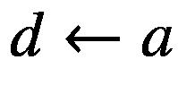
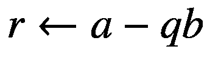
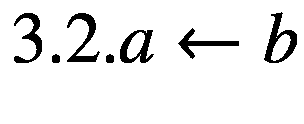
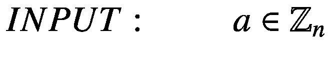
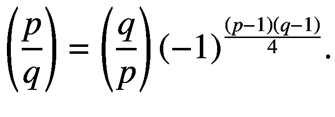

# 二、数学背景及其在密码学中的应用

## 概率论

### 基础

本章将讨论*实验、概率分布、事件、互补事件、*和*互斥的概念。*这些概念将帮助读者理解密码和密码分析机制的基本概念，以及它们是如何根据概率设计的[ [1](#Par158) ]。

**定义 2.1** 。一个*实验*代表产生一组给定结果之一的过程。结果因人而异。可能的事件被称为*简单事件*。所有可能的结果被称为*样本空间。*

在这一章中，我们将讨论离散样本空间，即可能结果有限的样本空间。我们将一个样本空间的简单事件表示为 *G* 标记为 *g* <sub>1</sub> ， *g* <sub>2</sub> ，…， *g* <sub>*n*</sub> 。

**定义 2.2** 。在 *G* 上的一个概率分布 *O* 由一系列非负且和等于 1 的数字 *o* <sub>1</sub> 、 *o* <sub>2</sub> 、…、 *o* <sub>*n*</sub> 表示。数字 *o* <sub>*i*</sub> 有一种解释为 *g* <sub>*i*</sub> 的*概率*，代表实验的结果。

**定义 2.3** 。一个*事件 E* 代表样本空间 *G* 的一个子集。在这种情况下，事件 *E* 将发生的*概率*，记为 *P* ( *E* )，代表属于 *E* 的所有简单事件 *g* <sub>*i*</sub> 的概率 *o* <sub>*i*</sub> 之和。如果*g*<sub>*I*</sub>∈*S*，*P*({*S*<sub>*I*</sub>})简称为*P*(*S**I*)。

**定义 2.4** 。假设 *E* 是一个事件，那么*互补事件*代表不属于 *E* 的简单事件集合，记为。

**演示 2.1** 。如果 *E* ⊆ *S* 代表一个事件，考虑以下情况:

*   0 ≤ *P* ( *E* ) ≤ 1。另外， *P* ( *S* ) = 1， *P* ( *ϕ* ) = 0，其中 *ϕ* 代表空集。

*   。

*   如果在 *S* 的结果也是一样的可能性，我们可以考虑。

**定义 2.5** 。让我们考虑两个*互斥*事件，*E*T6】1 和*E*T10】2。如果下面的表达式等于 0，*p*(*e*<sub>1</sub>⋂*e*<sub>2</sub>)= 0，则它们是互斥的。一两个事件的出现将排除其他事件发生的可能性。

定义 2.6。让我们考虑以下两个事件， *E* <sub>1</sub> 和*E*T6】2。

*   *p*(*e*<sub>1</sub>)≤T6【p】(*e**将成为*

**   *P*(*E*<sub>1</sub>∩*E*<sub>2</sub>)+*P*(*E*<sub>1</sub>∩*E*<sub>2</sub>)=*P*(*E*<sub>1</sub>)+*P 相应地，如果 *E* <sub>1</sub> 和 *E* <sub>2</sub> 被认为是互斥的，则出现以下表达式:*P*(*E*<sub>1</sub>∩*E*<sub>2</sub>=*P*(*E*<sub>1</sub>** 

 *### 条件概率

**定义 2.7** 。我们将考虑以下两个事件， *E* <sub>1</sub> 和 *E* <sub>2</sub> ，其中*P*(*E*<sub>2</sub>)>0。*条件概率*对于 *E* <sub>1</sub> 给 *E* <sub>2</sub> 写成*P*(*E*<sub>1</sub>|*E*<sub>2</sub>)并表示为


*P*(*E*<sub>1</sub>|*E*<sub>2</sub>)衡量事件 *E* <sub>1</sub> 发生的概率，假设 *E* <sub>2</sub> 已经发生。

**定义 2.8** 。让我们考虑以下两个事件， *E* <sub>1</sub> 和*E*T8】2。说他们是*独立*如果*p*(*e*1⋂*e*e<sub>2</sub>)=*p*(*e*t24】1)*p*(*e*t30】2)。

**定义 2.9** *。(贝叶斯定理)*如果我们有两个事件， *E* <sub>1</sub> 和 *E* <sub>2</sub> ，用*P*(*E*<sub>2</sub>)>0，那么


### 随机变量

让我们开始用分布概率 *P* 定义一个样本空间 *S* 。

**定义 2.10** 。让我们考虑一下 *X* 、*随机变量、*与应用于 *S* 上的函数的实数集合。对于每个事件，*S*<sub>*I*</sub>∈*S*， *X* 会分配一个实数*X*(*S*<sub>*I*</sub>)。

**定义 2.11** 。设 *X* 为 *S* 上的随机变量。*表示 *X* 的*或*期望值*为


关于平均值或期望值的 C# 实现，请参考案例研究 3:计算概率分布的平均值。

**演示 2.12** 。考虑一下 *X* 在 *S* 上的随机变量。在这种情况下，


**演示 2.13** 。我们来考虑一下 *S* 上的以下随机变量: *X* <sub>1</sub> ， *X* <sub>2</sub> ，…， *X* <sub>*m*</sub> 。以下为实数: *a* <sub>1</sub> ， *a* <sub>2</sub> ，…， *a* <sub>*m*</sub> 。然后我们会有


**定义 2.14** 。让我们考虑随机变量 *X* 。均值 *μ* 的 *X* 的*方差*由


定义的非负数表示

关于平均值或期望值的 C# 实现，请参考*案例研究 4:计算方差*。

*X* 的*标准差*用 *Var* ( *X* )的非负平方根表示。

关于平均值或期望值的 C# 实现，请参考*案例研究 5:计算标准偏差*。

### 生日问题

**定义 2.15.1** 。我们来考虑两个正整数 *a* 、 *b* 带 *a* ≥ *b* ，其中数字*m*<sup>(*n*)</sup>定义如下:


**定义 2.15.2** 。我们来考虑两个非负整数 *a* 、 *b* 带 *a* ≥ *b* 。第二类的*斯特林数，记为，为*

**

的情况被认为是例外。

**演示 2.16** 。我们将通过一个骨灰盒的例子来检验经典的占用问题，这个骨灰盒有从 1 到 m 的球*和*。让我们假设 *b* 球从骨灰盒中一次取出一个，然后放回原处，并列出它们的编号。 *l* 不同的球被抽中的概率是


生日问题代表了占用问题的一个最特殊的情况。

**演示 2.17** 。让我们考虑一下生日问题，我们有一个骨灰盒，里面有从 1 到 T4 到 T5 的球。假设从瓮中一次取出一个特定数量的球 *h* ，然后放回原处，并列出它们的号码。

**案例 2.17.1** 。我们至少有一个巧合的概率，例如一个球至少被从瓮中抽出两次，就是


**案例 2.17.2** 。让我们考虑一下 *h* 从骨灰盒中取出的球的具体数量。如果和*一个* → ∞，那么


提供的演示将解释为什么概率分布被称为*生日惊喜*或*生日悖论* *。*一个 23 人的房间里至少有 2 个人生日相同的概率是*P*T8】2(365，23) ≈ 0.507，大得惊人。数量 *P* <sub>2</sub> (365， *h* )的增加与 *h* 的增加一样快。举个例子，*P*T20】2(365，30) ≈ 0.706。

关于生日悖论的 C# 实现，请参考*案例研究 4:生日悖论。*

## 信息论

### 熵

让我们考虑 *X* 一个随机变量，它取一组有限的值 *x* <sub>1</sub> ， *x* <sub>2</sub> ，…， *x* <sub>*n*</sub> ，其概率为*P*(*X*=*X*<sub>*I*</sub>=) 其中 0≤*p*<sub>*I*</sub>≤1 对于每个 *i* ，1 ≤ *i* ≤ *n* ，其中


同样，让我们考虑随机变量 *Y* 和 *Z* ，它们将取一组有限的值[ [1](#Par158) ]。

*X* 的熵代表一个观测值 *x* 提供的信息量的数学度量。

**定义 2.18** 。让我们把 *X* 看作一个随机变量，把*熵*或 *X* 的不确定性定义为


根据惯例，

如果 *p* <sub> * i * </sub> = 0。

**定义 2.19** [ [1](#Par158) ][ [5](#Par162) 。我们来考虑 *X* 和 *Y* ，两个随机变量。将*联合熵*定义为


其中 *x* 和 *y* 的范围是随机变量的所有值， *X* 和 *Y* 。

**定义 2.20** 。先考虑随机变量 *X* 和 *Y* ，再考虑 *X* 的*条件熵*给定 *Y* = *y* 为


其中 *x* 将在随机变量 *X* 的所有值范围内。在这种情况下， *X* 的*条件熵*给定 *Y* ，也叫 *Y* 的关于 *X* ，为


其中索引 *y* 将覆盖 *Y* 的所有值。

## 数论

### 整数

我们将从一组整数{…，3，2，1，0，1，2，3，…}用符号ℤ.来表示的想法开始

**定义 2.21** 。让我们考虑两个整数， *a* 和 *b* 。假设有一个整数 *c* 存在，那么 *a 除以 b* 使得*b*=*a*T14】c。如果我们处于 *a* 除以 *b* 的情况，那么我们可以说 *a* ∣ *b* 。

**定义 2.22** ( **整数的除法算法)**。让我们考虑两个整数， *a* 和 *b* ，其中 *b* ≥ 1，然后我们将 *a* 除以 *b* 得到整数 *q* ( *商*)和 *r* ( *余数*，这样

*a*=*q**b*+*r*，其中 0≤*r*<T10】b

**定义 2.23** 。让我们把 *c* 看作整数。 *a* 和 *b* 的公约数*如果 *c* ∣ *a* 和 *c* ∣ *b* 。*

**定义 2.24** 。我们将考虑一个非负整数 *d* ，称为整数 *a* 和 *b* 的*最大公约数(gcd)* 。我们将它记为 *d* = gcd ( *a* ， *b* )，如果

1.  *d* 是公约数 *a* 和 *b*

2.  *c* ∣ *a* 和 *c* ∣ *b* ，然后是 *c* ∣ *d*

**定义 2.25** 。我们将考虑一个非负整数 *d* ，整数 *a* 和 *b* 的*最小公倍数(lcm)* ，表示为*d*=*LCM*(*a*， *b* ，如果

1.  *a* ∣ *d* 和 *b* ∣ *d*

2.  *a* ∣ *c* 和 *b* ∣ *c* ，然后是 *d* ∣ *c*

### ℤ的算法

我们将考虑两个非负整数， *a* 和 *b* ，每个小于 *n* 或等于 *n* 。请记住， *n* 的二进制表示中的位数是⌊ *lg n* ⌋ + 1，这个数字将由 lg *n* 来近似表示。表 [2-1](#Tab1) 总结了使用经典算法对整数进行四种基本运算所涉及的位操作数。

表 2-1

ℤ基本运算的位复杂度

<colgroup><col class="tcol1 align-left"> <col class="tcol2 align-left"></colgroup> 
| 

操作

 | 

比特复杂度

 |
| --- | --- |
| 加法 *a* + *b* | *或*(*LGA*+*【lgb】*=*或*(*【lgn】* |
| 减法*a*—*b* | *或*(*LGA*+*【lgb】*=*或*(*【lgn】* |
| 乘〔t0〕a〔t1〕T2〕b〔T3〕 | *O*((*LGA*)(*lgb*)=*O*((*lgn*)<sup>2</sup>) |
| 师*a*=*q**b*+*r* | *O*((*lgq*)(*lgb*)=*O*((*lgn*)<sup>2</sup>) |

**演示 2.26。**整数 *a* 和 *b* 都是正数带 *a* > *b* ，那么我们就有了 gcd( *a* ， *b* ) = gcd ( *b* ， *a mod b* )。

**算法 2.27**[**1**](#Par158)**。欧几里德算法用于计算*****【gcd】*****两个整数**


欧几里德算法具有被扩展的可能性，使得它不仅将产生两个整数 *a* 和 *b* 的 gcd *d* ，还将产生整数 *x* 和 *y* ，这将满足*ax*+*by*=*d*。

**算法 2.28**[**1**](#Par158)**。扩展的欧几里德算法**


1.  *If b* = 0, *then set*

    

    

    

    

2.  *集 x*<sub><sub>；；*<sub>；【0，*和*</sub>【2】；【0，】*</sub></sub>

**   *While b* > 0 *then*

    

    

    

    

    

    

    

    

    

    

     *   *Set d* ← *a*, *x* ← *x*<sub>2</sub>, *y* ← *y*<sub>2</sub>

    

     *

 *在案例研究 7 的*部分:(扩展)欧几里德算法*，欧几里德和扩展欧几里德算法这两种类型都有一个 C# 实现。

**例 2.29** 。扩展欧几里德算法的例子。在表 [2-2](#Tab2) 中，我们展示了上述算法的步骤(算法 2.28)。至于输入，我们有如下: *a* = 4864 和 *b* = 3458。因为 gcd(4864，3458) = 38 且(4864)(32)+(3458)(45)= 38。

表 2-2

扩展欧几里德算法

<colgroup><col class="tcol1 align-left"> <col class="tcol2 align-left"> <col class="tcol3 align-left"> <col class="tcol4 align-left"> <col class="tcol5 align-left"> <col class="tcol6 align-left"> <col class="tcol7 align-left"> <col class="tcol8 align-left"> <col class="tcol9 align-left"> <col class="tcol10 align-left"></colgroup> 
| *问* | *r* | *x* | *y* | *答* | *b* | *x*T2】2 | *x*T2 1 | *y*T2】2 | *y*T2 1 |
| *N* / *A* | *N* / *A* | *N* / *A* | *N* / *A* | Four thousand eight hundred and sixty-four | Three thousand four hundred and fifty-eight | one | Zero | Zero | one |
| one | One thousand four hundred and six | one | -1 | Three thousand four hundred and fifty-eight | One thousand four hundred and six | Zero | one | one | -1 |
| Two | Six hundred and forty-six | -2 | three | One thousand four hundred and six | Six hundred and forty-six | one | -2 | -1 | three |
| Two | One hundred and fourteen | five | -7 | Six hundred and forty-six | One hundred and fourteen | -2 | five | three | -7 |
| five | Seventy-six | -27 | Thirty-eight | One hundred and fourteen | Seventy-six | five | -27 | -7 | Thirty-eight |
| one | Thirty-eight | Thirty-two | -45 | Seventy-six | Thirty-eight | -27 | Thirty-two | Thirty-eight | -45 |
| Two | Zero | -91 | One hundred and twenty-eight | Thirty-eight | Zero | Thirty-two | -91 | -45 | One hundred and twenty-eight |

### 整数模 ***n***

我们将认为 *p* 是一个正整数。

**定义 2.30** 。让我们把 *x* 和 *y* 看作两个整数。我们说 *x 全等于 y 模 p* 。使用的符号是

*x*≦*y*(*mod p*)，如果 *p* 会除(*x*—*y*)

这个 *p* 叫做同余的*模*。

**定义 2.31** 。我们来考虑一下*m*∈*ℤ*<sub>*p*</sub>。 *m* 模 *p* 的*乘逆*的定义是一个整数*y*∈*ℤ*<sub>*p*</sub>这样 *m y* ≡ 1 ( *mod p* )。如果我们有这样的 *m* 存在，那么这个 *m* 是唯一的，并且 *m* 被称为*可逆*或*单元。*m*的倒数*记为*m*T42】1。

参考*案例分析 8:计算模 m f* 下的乘法逆或者模 *m* 下的乘法逆的 C# 实现。

**定义 2.32。****【中国剩余定理】。我们来考虑以下几个整数 *n* <sub>1</sub> ， *n* <sub>2</sub> ，…， *n* <sub>*k*</sub> ，一个两两相对的素数。于是我们有了下面的同余系统**

****

****

****

****

 **那有模的唯一解，*n*=*n*<sub>1</sub>*n*<sub>2</sub>⋯*n*<sub>*k*</sub>。

模 *m* 下乘法逆运算的 C# 实现参见*案例分析 9:中国剩余定理*。

**定义 2.33。** **高斯算法** **。**在中国剩余定理中，同余式的解法 *x* 可以计算为其中*N*<sub>*I*</sub>=*N*/*N*<sub>*I*</sub>和。所列操作可以在*O*((*lgn*)<sup>2</sup>)位操作中完成。

### 算法ℤ <sub>*n*</sub>

让我们考虑一个正整数 *n* 。正如我们观察到的，元素ℤ <sub>*n*</sub> ，然后是


**算法 2.34**[**1**](#Par158)**。计算乘法逆运算**<sub>***n***</sub>




**算法 2.35**[**1**](#Par158)**。ℤ**<sub>***n***</sub>


中反复求幂的平方乘算法

1.  *设置 b* ← 1。*如果 k* = 0，*则返回* ( *b* )

2.  *设一个* ← *设一个*。

3.  *如果 k* <sub>0</sub> = 1，*则设置 b* ← *a* ，

4.  *对于 I 从* 1 *到 t* ，*做如下*:
    1.  4.1 .*设置 a**【a】*<sup>【2】</sup>*修改 n* 。

    2.  *若 k* <sub>*i*</sub> = 1，*则设置 b* ← *A* *b mod n* 。

5.  *返回* ( *b* )。

### 勒让德和雅可比符号

勒让德符号是监控一个整数 *a* 是否是一个素数的二次剩余模的最有用的工具之一。

**定义 2.36** [ [1](#Par158) 。让我们把 *p* 看作一个奇数质数，把*看作一个整数。*勒让德符号*记为，定义如下:*

**

**属性 2.37。勒让德符号的属性[**[**1**](#Par158)**。让我们考虑以下性质，称为勒让德符号的性质。我们认为 p 是一个奇素数。两个整数 *a* ， *b* ∈ ℤ.在这种情况下，将考虑 Legendre 符号的以下属性:**

 **1.  在这种特殊情况下，和自 1∈*Q*<sub>*p*</sub>if*p*≡1(*mod*4)和if*p*≡3(*mod*4)。

2.  既然如果，那么

3.  如果*a*≦*b*(*mod p*)，那么

4.  自 if * p * ≡ 1 或 7 ( * mod * 8)，if * p * ≡ 3 或 5 ( * mod * 8)。

5.  If *q* represent an odd prime distinct from *p*, we have

    

Jacoby 符号代表 Legendre 符号对于非奇数且不一定是质数的整数 *n* 的推广。

**定义 2.38。雅可比定义[**[**1**](#Par158)**。考虑一个整数 *n* ≥ 3 是奇数，一个质因数分解为**

****

 **雅可比符号定义如下:


请注意，如果 *n* 是质数，则雅可比符号就是勒让德符号。

**属性 2.39。属性为雅各比符号[**[**1**](#Par158)**。认为 *m* ≥ 3、 *n* ≥ 3 为奇数，认为 *a* 、 *b* ∈ ℤ.雅可比符号具有以下属性:**

 **1.  。不止于此，当且仅当 gcd( *a* ， *n* ) ≠ 1。

2.  。因此如果那么。

3.  

4.  如果*a*≦*b*(*mod n*)，那么

5.  

6.  因此 if * n * ≡ 1 ( * mod * 4)，if * n * ≡ (3 * mod * 4)。

7.  因此 if * n * ≡ 1 或 7 ( * mod * 8)，if * n * ≡ 3 或 5 ( * mod * 8)。

8.  换句话说，除非 *m* 和 *n* 都同余于 3 模 4，在这种情况下。

**算法 2.40。雅可比符号(和勒让德符号)计算[**[**1**](#Par158)

****

****

****

 **1.  *如果* = 0，*则返回* 0。

2.  *如果一个* = 1，*则返回* 1。

3.  *写一个* = 2 <sup>*e*</sup> *一个*<sub>1</sub>*其中一个* <sub>1</sub> *为奇数*。

4.  *如果 e 是偶数*，*那么设置 s* ← 1。*否则设置 s* ← 1 *如果 n* ≡ 1 *或* 7 ( *mod* 8)，*或者设置 s*←1*如果 n* ≡ 3 *或* 5 ( *mod* 8)。

5.  *如果 n* ≡ 3 ( *mod* 4) *和 a*<sub>1</sub>≡3(*mod*4)*，则设置 s*↓↓s。

6.  *集 n*<sub>【1】</sub>*【n 修改 a】*。

7.  *如果一个* <sub>1</sub> = 1，*则返回*(*s*)；*else return*(*s*T12】雅可比(*n*T16】1，*a*T20】1)。

## 有限域

### 基础

**定义 2.41** 。让我们考虑 *F* 是一个包含有限个元素的*有限域*。F 的*阶表示 F*中的元素个数*。*

**定义 2.42** 。有限域的存在唯一性。

1.  我们假设如果 *F* 是有限域，那么 *F* 将有 *p* <sup>*m*</sup> 个元素为素数 *p* 和整数 *m* ≥ 1。

2.  对于每一个素数幂阶 *p* <sup>*m*</sup> ，我们都有一个唯一的有限阶域 *p* <sup>*m*</sup> 。该字段被标注为或在其他一些参考文献中被标注为*GF*(*p*<sup>*m*</sup>)。

**定义 2.43** 。假设一个*F*<sub>T5】q</sub>表示一个有限阶域*q*=*p*<sup>*m*</sup>， *p* 是素数，那么的特征是 *p* 。不止如此，还会有一个ℤ <sub>* p *</sub> 的副本作为子字段，因为可以看作是程度 *m* 的ℤ <sub>* p *</sub> 的扩展字段。

### 多项式和欧几里德算法

以下两个算法对于理解我们如何获得两个多项式的 *gcd* ， *g* ( *x* )和 *h* ( *x* )，两者都在ℤ<sub>*p*</sub>[*x*]是必要的:

**算法 2.43。** **欧几里得算法** **为ℤ**<sub>***p***</sub>***x*****[**1**](#Par158)**

****![$$ INPUT:\kern2.75em Two\  polynomials\ g(x),h(x)\in {\mathbb{Z}}_p\left[x\right] $$](img/493660_1_En_2_Chapter_TeX_Eqube.png)****

********

 ****1.  *而 h* ( *x* ) ≠ 0，*则*
    1.  *设置 r*(*x*)；*g*(*x*)*修改 h* ( *x* )，

**   *返回 g* ( *x* )。

     *

 ***算法 2.44。扩展的欧几里德算法为ℤ**<sub>***p***</sub>***x*****[**1**](#Par158)**

****![$$ INPUT:\kern2.25em Two\  polynomials\ g(x),h(x)\in {\mathbb{Z}}_p\left[x\right] $$](img/493660_1_En_2_Chapter_TeX_Equbg.png)****

****![$$ OUTPUT:\kern1.25em d(x)=\gcd \left(g(x),h(x)\right)\  and\ polynomials\ s(x),t(x)\in {\mathbb{Z}}_p\left[x\right] which\ will\ satisfy\ s(x)g(x)+t(x)h(x)=d(x). $$](img/493660_1_En_2_Chapter_TeX_Equbh.png)****

 ****1.  如果 *h* ( *x* ) = 0，*然后设置*(*x*)；*g*(*x*)，【如果
    1.  *返回* ( *d* ( *x* )， *s* ( *x* )， *t* ( *x* ))。

2.  set*s*<sub><sub>(*x*)←1，*s*<sub>*)；←0，*</sub></sub></sub>

**   而 *h* ( *x* ) ≠ 0，*则*
    1.  *g*(*x*)；*g*(*x*)*div h*(*x*)，

    **   *s*(*x*)；*s**(*x*)】q(*

        ***   *g*(*x*)；*h*(*x*)；*h*(*x*)；

        **   *s*<sub>【2】(*x*)</sub>*<sub>*)，*【s】**</sub>***** ***   set*d*(*x*)；*g*(*x*)；*s*(*x*)；

     *   返回 *d* ( *x* )， *s* ( *x* )， *t* ( *x* )。

     ***

 **## 案例研究 1:通过大量试验计算事件发生的概率

下面的应用处理计算某一事件在一定数量的试验中发生的概率。下面的应用解释了这样一个事实，即一个事件在每次试验中都有发生的概率，在经过 *N* 次试验后，我们得到一次试验导致该事件发生的概率为 1(1*P*)<sup>T5】N</sup>。见图 [2-1](#Fig1) 和清单 [2-1](#PC1) 。


图 2-1

计算概率申请表

```cs
using System;
using System.Collections.Generic;
using System.Linq;
using System.Text;
using System.Threading.Tasks;

namespace CompProb
{
    class Program
    {
        static void Main(string[] args)
        {
            string consoleInput;
            Console.Write("Enter the event probability: ");
            consoleInput = Console.ReadLine();
            ComputeTheProbability(consoleInput);
            Console.ReadKey();
        }

        private static void ComputeTheProbability(string eventProbability)

        {
            // See if the probability contains a % sign.
            bool percent = eventProbability.Contains("%");

            // Get the event probability.
            double event_prob =
                double.Parse(eventProbability.Replace("%", ""));

            // If we're using percents, divide by 100.
            if (percent) event_prob /= 100.0;

            // Get the probability of the event not happening.
            double non_prob = 1.0 - event_prob;

            for (int i = 0; i <= 100; i++)
            {
                double prob = 1.0 - Math.Pow(non_prob, i);

                if (percent)
                {
                    prob *= 100.0;
                    Console.WriteLine(i.ToString() + ": " + prob.ToString("0.0000") + "%");
                }
                else
                {
                    Console.WriteLine(i.ToString() + ": " + prob.ToString("0.0000"));
                }
            }
        }
    }
}

Listing 2-1Code for Computing the Probability of an Event

```


图 2-2

概率分布申请表

## 案例研究 2:计算概率分布

在这一节中，我们将展示如何计算概率分布。代码如清单 [2-2](#PC2) 所示，结果如图 [2-2](#Fig2) 所示。

```cs
using System;
using System.Collections.Generic;
using System.Linq;
using System.Text;
using System.Threading.Tasks;

namespace ProbDistribution
{
    class Program
    {
        static List<Distribution> values = new List<Distribution>();
        static void Main(string[] args)
        {
            Console.WriteLine("Press ESC key to exit the process...");

            string X, pOfX;
            Console.Write("X = ");
            X = Console.ReadLine();
            Console.Write("P(X) = ");
            pOfX = Console.ReadLine();
            AddValues(X, pOfX);

            while (Console.ReadKey().Key != ConsoleKey.Escape)
            {
                Console.Write("X = ");
                X = Console.ReadLine();
                Console.Write("P(X) = ");
                pOfX = Console.ReadLine();
                AddValues(X, pOfX);
            }
        }

        static void AddValues(string txtX, string txtPOfTheX)
        {
            int x = 0;
            double p = 0.00, sum = 0.00;
            Distribution dist = null;

            // Check that the user entered a value for x
            if (txtX.Length == 0)
            {
                Console.WriteLine("You must enter the x value.",
                                "Probability Distribution");
                Console.WriteLine();
                return;
            }

            // Test that the user entered a value for P(x)
            if (txtPOfTheX.Length == 0)
            {
                Console.WriteLine("You must enter the P(x) value.",
                                "Probability Distribution");
                Console.WriteLine();
                return;
            }

            // Get the value for x
            try
            {
                x = int.Parse(txtX);
            }
            catch (FormatException)
            {
                Console.WriteLine("The value you entered is invalid.",
                                "Probability Distribution");
                Console.WriteLine();
            }

            // Get the value for P(x)
            try
            {
                p = double.Parse(txtPOfTheX);
            }
            catch (FormatException)
            {
                Console.WriteLine("The value you entered is invalid.",
                                "Probability Distribution");
                Console.WriteLine();
            }

            // Create a Distribution value
            dist = new Distribution(x, p);
            // Add the value to the list
            values.Add(dist);

            ShowValues();

            // Calculate the sum of the P(x) values
            foreach (Distribution d in values)
                sum += d.PofX;
            Console.WriteLine("The sum is: " + sum.ToString("F"));

            // Test the first requirement
            if (sum != 1) // The first rule is not respected
            {
                Console.WriteLine("The first rule is not respected",
                                "Probability Distribution");
                Console.WriteLine("Press ENTER to continue or ESC to exit the process..." + "\n");
                return;
            }

            // Test the second requirement
            foreach (Distribution d in values)
            {
                if ((d.PofX < 0.00) || (d.PofX > 1)) // The second rule is not respected
                {
                    Console.WriteLine("The second rule is not respected",
                                    "Probability Distribution");
                    Console.WriteLine("Press ENTER to continue or ESC to exit the process..." + "\n");
                    return;
                }
            }
        }

        static void ShowValues()
        {
            double sum = 0.00;

            foreach (Distribution dist in values)
            {
                Console.WriteLine("X=" + dist.X.ToString() + "\t" + "P(X)=" + dist.PofX.ToString());
            }

            // Calculate the sum of the P(x) values
            foreach (Distribution d in values)
                sum += d.PofX;

            Console.WriteLine("No. of values: " + values.Count.ToString() + "\t" + "Sum of P(X): " + sum.ToString());
        }
    }

    public class Distribution
    {
        public int X { get; set; }
        public double PofX { get; set; }

        public Distribution(int x, double p)
        {
            X = x;
            PofX = p;
        }
    }
}

Listing 2-2Code for Probability Distribution

```

## 案例研究 3:计算概率分布的平均值

在这一节中，我们将展示如何计算概率分布的平均值。代码如清单 [2-3](#PC3) 所示，结果如图 [2-3](#Fig3) 所示。

```cs
using System;
using System.Collections.Generic;
using System.Linq;
using System.Text;
using System.Threading.Tasks;

namespace CalcMeanProbDistrib
{
    class Program
    {
        static List<Distribution> values = new List<Distribution>();
        static void Main(string[] args)
        {
            Console.WriteLine("Press ESC key to exit the process...");

            string X, pOfX;
            Console.Write("X = ");
            X = Console.ReadLine();
            Console.Write("P(X) = ");
            pOfX = Console.ReadLine();
            AddValues(X, pOfX);

            while (Console.ReadKey().Key != ConsoleKey.Escape)
            {
                Console.Write("X = ");
                X = Console.ReadLine();
                Console.Write("P(X) = ");
                pOfX = Console.ReadLine();
                AddValues(X, pOfX);
            }
        }

        static void ShowValues()
        {
            double sum = 0.00;
            double mean = 0.00;

            foreach (Distribution dist in values)
            {
                mean += dist.X * dist.PofX;
                Console.WriteLine(dist.X.ToString() + " * " +
                                      dist.PofX.ToString() + " = " +
                                      mean.ToString());
            }

            foreach (Distribution d in values)
                sum += d.PofX;

            Console.WriteLine("Number of values: " + values.Count.ToString() + "\t" + "Sum of P(X): " + sum.ToString() + "\t" + "Mean of probability distribution: " + mean.ToString());
        }

        static void AddValues(string txtValueOfX, string txtValueOfPX)
        {
            int x = 0;
            double p = 0.00, sum = 0.00;
            Distribution dist = null;

            // Check that the user entered a value for x
            if (txtValueOfX.Length == 0)
            {
                Console.WriteLine("You must enter the x value.",
                                "Probability Distribution");
                return;
            }

            // Test that the user entered a value for P(x)
            if (txtValueOfPX.Length == 0)
            {
                Console.WriteLine("You must enter the P(x) value.",
                                "Probability Distribution");
                return;
            }

            // Get the value for x
            try
            {
                x = int.Parse(txtValueOfX);
            }
            catch (FormatException)
            {
                Console.WriteLine("The value you entered is invalid.",
                                "Probability Distribution");
            }

            // Get the value for P(x)
            try
            {
                p = double.Parse(txtValueOfPX);
            }
            catch (FormatException)
            {
                Console.WriteLine("The value you entered is invalid.",
                                "Probability Distribution");
            }

            // Create a Distribution value
            dist = new Distribution(x, p);
            // Add the value to the list
            values.Add(dist);

            ShowValues();

            // Calculate the sum of the P(x) values
            foreach (Distribution d in values)
                sum += d.PofX;
            Console.WriteLine("Sum of P(X): " + sum.ToString("F"));

            // Test the first requirement
            if (sum != 1) // The first rule is not respected
            {
                Console.WriteLine("The first rule is not respected",
                                "Probability Distribution");
                Console.WriteLine("Press ENTER to continue or ESC to exit the process..." + "\n");
                return;
            }

            // Test the second requirement
            foreach (Distribution d in values)
            {
                if ((d.PofX < 0.00) || (d.PofX > 1)) // The second rule is not respected
                {
                    Console.WriteLine("The second rule is not respected",
                                    "Probability Distribution");
                    Console.WriteLine("Press ENTER to continue or ESC to exit the process..." + "\n");
                    return;
                }
            }
        }
    }

    public class Distribution
    {
        public int X { get; set; }
        public double PofX { get; set; }

        public Distribution(int x, double p)
        {
            X = x;
            PofX = p;
        }
    }
}

Listing 2-3Code for Computing the Mean of the Probability

```


图 2-3

计算概率分布的平均值

## 案例研究 4:计算方差

在这一节中，我们将展示如何计算方差。代码如清单 [2-4](#PC4) 所示，结果如图 [2-4](#Fig4) 所示。

```cs
using System;
using System.Collections.Generic;
using System.Linq;
using System.Text;
using System.Threading.Tasks;

namespace ConsoleComputingVariance
{
    class Program
    {
        static void Main(string[] args)
        {
            List<double> dataValues =
                new List<double> { 1, 2, 3, 4, 5, 6 };

            double variance =
                dataValues.ComputingVariance();

            Console.WriteLine("Variance is = {0}",
                    variance);

            Console.ReadKey();
        }
    }

    public static class MyListExtensions
    {
        public static double ComputingMean(this List<double> values)
        {
            return values.Count == 0 ? 0 : values.ComputingMean(0, values.Count);
        }

        public static double ComputingMean(this List<double> values, int start, int end)
        {
            double s = 0;

            for (int i = start; i < end; i++)
            {
                s += values[i];
            }

            return s / (end - start);
        }

        public static double ComputingVariance(this List<double> values)
        {
            return values.ComputingVariance(values.ComputingMean(), 0, values.Count);
        }

        public static double ComputingVariance(this List<double> values, double mean)
        {
            return values.ComputingVariance(mean, 0, values.Count);
        }

        public static double ComputingVariance(this List<double> values, double mean, int start, int end)
        {
            double variance = 0;

            for (int i = start; i < end; i++)
            {
                variance += Math.Pow((values[i] - mean), 2);
            }

            int n = end - start;
            if (start > 0) n -= 1;

            return variance / (n);
        }

    }
}

Listing 2-4Code for Computing the Variance

```


图 2-4

计算方差

## 案例研究 5:计算标准偏差

在本节中，我们将展示如何计算标准偏差。代码如清单 [2-5](#PC5) 所示，结果如图 [2-5](#Fig5) 所示。

```cs
using System;
using System.Collections.Generic;
using System.Linq;
using System.Text;
using System.Threading.Tasks;

namespace ConsoleComputingVariance
{

    class Program
    {
        static void Main(string[] args)
        {
            List<double> dataValues =
                new List<double> { 1, 2, 3, 4, 5, 6 };

            double mean = dataValues.ComputingMean();
            double variance = dataValues.ComputingVariance();
            double standard_deviation =
                dataValues.ComputingStandardDeviation();

            Console.WriteLine("Mean is = {0}," +
                "Variance is = {1}, " +
                "Standard Deviation is = {2}",
                    mean,
                    variance,
                    standard_deviation);

            Console.ReadKey();
        }
    }

    public static class MyListExtensions
    {
        public static double ComputingMean(this List<double> values)
        {
            return values.Count == 0 ? 0 : values.ComputingMean(0, values.Count);
        }

        public static double ComputingMean(this List<double> values, int start, int end)
        {
            double s = 0;

            for (int i = start; i < end; i++)
            {
                s += values[i];
            }

            return s / (end - start);
        }

        public static double ComputingVariance(this List<double> values)
        {
            return values.ComputingVariance(values.ComputingMean(), 0, values.Count);
        }

        public static double ComputingVariance(this List<double> values, double mean)
        {
            return values.ComputingVariance(mean, 0, values.Count);
        }

        public static double ComputingVariance(this List<double> values, double mean, int start, int end)
        {
            double variance = 0;

            for (int i = start; i < end; i++)
            {
                variance += Math.Pow((values[i] - mean), 2);
            }

            int n = end - start;
            if (start > 0) n -= 1;

            return variance / (n);
        }

        public static double ComputingStandardDeviation(this List<double> values)
        {
            return values.Count == 0 ? 0 : values.ComputingStandardDeviation(0, values.Count);
        }

        public static double ComputingStandardDeviation(this List<double> values, int start, int end)
        {
            double mean = values.ComputingMean(start, end);
            double variance = values.ComputingVariance(mean, start, end);

            return Math.Sqrt(variance);
        }
    }
}

Listing 2-5Code for Computing Standard Deviation

```


图 2-5

计算标准偏差

## 案例研究 6:生日悖论

在这一节中，我们将展示如何对给定数量的人应用生日悖论。代码如清单 [2-6](#PC6) 所示，结果如图 [2-6](#Fig6) 所示。

```cs
using System;
using System.Collections.Generic;
using System.Linq;
using System.Text;
using System.Threading.Tasks;

namespace ConsoleBirthdayParadox
{
    class Program
    {
        static void Main(string[] args)
        {
            Console.WriteLine("Enter the number of people: ");
            int people_number = Convert.ToInt32(Console.ReadLine());

            const double number_of_trials = 100000.0;

            int number_of_birthday_matches = 0;
            double sum_of_unique_birthday = 0;

            List<int> personBirthdays;
            Random rnd = new Random();

            for (int trial_number = 1; trial_number <= number_of_trials; trial_number++)
            {
                //** we will generate birthdays
                personBirthdays = new List<int>(people_number);
                for (int personNum = 1; personNum <= people_number; personNum++)
                    personBirthdays.Add(rnd.Next(1, 366));

                if (personBirthdays.Count != personBirthdays.Distinct().Count())
                    number_of_birthday_matches++;

                sum_of_unique_birthday += personBirthdays.Distinct().Count();
            }

            double percentage_matched =
                number_of_birthday_matches / number_of_trials * 100.0;

            double uniqueness_per_trial = sum_of_unique_birthday / number_of_trials;

            Console.WriteLine("There are {0} people. " +
                "There is at least one matching birthday {1}% " +
                "of the time. Average number of " +
                "unique birthdays is {2}.",
                    people_number.ToString(),
                    percentage_matched.ToString(),
                    uniqueness_per_trial.ToString());

            Console.ReadKey();
        }
    }
}

Listing 2-6Code for Birthday Paradox Application

```


图 2-6

生日悖论应用

## 案例研究 7:(扩展的)欧几里德算法

欧几里德算法有两个版本，*普通版*(见图 [2-7](#Fig7) 和清单 [2-7](#PC7) )和*扩展版*(见图 [2-8](#Fig8) 和清单 [2-8](#PC8) ) *。*两个版本的欧几里德算法的区别在于，常规版本基于连续的减法运算来计算两个数字之间的 GCD，而扩展版本应用于多项式(参见算法 2.43 和算法 2.44)。


图 2-7

欧几里德算法应用表格

```cs
using System;
using System.Collections.Generic;
using System.Linq;
using System.Text;
using System.Threading.Tasks;

namespace ConsoleExtendedEuclidean
{
    class Program
    {
        static void Main(string[] args)
        {
            Console.WriteLine("a = ");
            int a = Convert.ToInt32(Console.ReadLine());

            Console.WriteLine("b = ");
            int b = Convert.ToInt32(Console.ReadLine());

            Console.WriteLine("X = ");
            int x = Convert.ToInt32(Console.ReadLine());

            Console.WriteLine("Y = ");
            int y = Convert.ToInt32(Console.ReadLine());

            int g;

            g = gcdExtended(a, b, x, y);

            Console.WriteLine("Extended Euclidean Algorithm = {0}.", g.ToString());
            Console.ReadKey();
        }

        public static int gcdExtended(int a, int b, int x, int y)
        {
            // Base Case
            if (a == 0)
            {
                x = 0;
                y = 1;
                return b;
            }

            // To store results of
            // recursive call
            int x1 = 1, y1 = 1;
            int gcd = gcdExtended(b % a, a, x1, y1);

            // Update x and y using
            // results of recursive call
            x = y1 - (b / a) * x1;
            y = x1;

            return gcd;
        }
    }
}

Listing 2-8Code for Extended Euclidean Algorithm

```

```cs
using System;
using System.Collections.Generic;
using System.Linq;
using System.Text;
using System.Threading.Tasks;

namespace ConsoleEuclideanAlgorithm
{
    class Program
    {
        static void Main(string[] args)
        {
            Console.WriteLine("a = ");
            int a = Convert.ToInt32(Console.ReadLine());

            Console.WriteLine("b = ");
            int b = Convert.ToInt32(Console.ReadLine());

            int g = gcd(a, b);

            Console.WriteLine("GCD = {0}", g.ToString());
            Console.ReadKey();
        }

        public static int gcd(int x, int y)
        {
            if (x == 0)
                return y;
            return gcd(y % x, x);
        }
    }
}

Listing 2-7Code for Computing the Euclidean Algorithm

```


图 2-8

扩展欧几里德算法应用表格

## 案例研究 8:计算模 m 下的乘法逆运算


图 2-9

模乘逆应用

```cs
using System;
using System.Collections.Generic;
using System.Linq;
using System.Text;
using System.Threading.Tasks;

namespace ConsoleMultiInverse
{
    class Program
    {
        static void Main(string[] args)
        {
            Console.WriteLine("number = ");
            int n = Convert.ToInt32(Console.ReadLine());

            Console.WriteLine("modulo = ");
            int m = Convert.ToInt32(Console.ReadLine());

            Console.WriteLine("Multiplicative Inverse of n={0} " +
                "under modulo m={1} is {2}",
                n, m, Convert.ToString(modInverse(n, m)));

            Console.ReadKey();
        }
        static int modInverse(int a, int m)
        {
            a = a % m;
            for (int x = 1; x < m; x++)
                if ((a * x) % m == 1)
                    return x;
            return 1;
        }
    }
}

Listing 2-9Code for Computing the Modular Multiplicative Inverse

```

## 案例研究 9:中国剩余定理

在这一节中，我们将展示如何应用中国剩余定理。代码如清单 [2-10](#PC10) 所示，结果如图 [2-10](#Fig10) 所示。

```cs
using System;
using System.Collections.Generic;
using System.Linq;
using System.Text;
using System.Threading.Tasks;

namespace ConsoleChineseRemainder
{
    class Program
    {
        static void Main(string[] args)
        {
            int[] num = { 3, 4, 5 };
            int[] rem = { 2, 3, 1 };
            int k = num.Length;

            Console.WriteLine("numbers = {0}",
                "{ " + num[0].ToString() + ", " +
                       num[1].ToString() + ", " +
                       num[2].ToString() + " }");

            Console.WriteLine("remainders = {0}",
                 "{ " + rem[0].ToString() + ", " +
                        rem[1].ToString() + ", " +
                        rem[2].ToString() + " }");

            Console.WriteLine("Applying Chinese Remainder " +
                "Theorem is = {0}",
                findMinX(num, rem, k).ToString());

            Console.ReadKey();
        }

        static int inv(int a, int m)
        {
            int m0 = m, t, q;
            int x0 = 0, x1 = 1;

            if (m == 1)
                return 0;

            // Apply extended
            // Euclid Algorithm
            while (a > 1)
            {
                // q is quotient
                q = a / m;

                t = m;

                // m is remainder now,
                // process same as
                // euclid's algo
                m = a % m; a = t;

                t = x0;

                x0 = x1 - q * x0;

                x1 = t;
            }

            // Make x1 positive
            if (x1 < 0)
                x1 += m0;

            return x1;
        }

        static int findMinX(int[] num, int[] rem, int k)
        {
            // Compute product of all numbers
            int prod = 1;
            for (int i = 0; i < k; i++)
                prod *= num[i];

            // Initialize result
            int result = 0;

            // Apply above formula
            for (int i = 0; i < k; i++)
            {
                int pp = prod / num[i];
                result += rem[i] *
                          inv(pp, num[i]) * pp;
            }

            return result % prod;
        }
    }
}

Listing 2-10Code for the Chinese Remainder Theorem

```


图 2-10

中国剩余定理的应用

## 案例研究 10:勒让德符号

在本节中，我们将展示如何计算勒让德符号。代码如清单 [2-11](#PC11) 所示，结果如图 [2-11](#Fig11) 所示。

```cs
using System;
using System.Collections.Generic;
using System.Linq;
using System.Text;
using System.Threading.Tasks;

namespace ConsoleLegendreSymbol
{
    class Program
    {
        static void Main(string[] args)
        {
            Console.WriteLine("a = ");
            int a = Convert.ToInt32(Console.ReadLine());

            Console.WriteLine("b = ");
            int b = Convert.ToInt32(Console.ReadLine());

            int result = Legendre(a, b);

            Console.WriteLine("Legendre Symbol is = {0}", result.ToString());
            Console.ReadKey();
        }

        public static int Legendre(int a, int p)
        {
            if (p < 2)  // prime test is expensive.
                throw new ArgumentOutOfRangeException("p", "p must not be < 2");
            if (a == 0)
            {
                return 0;
            }
            if (a == 1)
            {
                return 1;
            }
            int result;
            if (a % 2 == 0)
            {
                result = Legendre(a / 2, p);
                if (((p * p - 1) & 8) != 0) // instead of dividing by 8, shift the mask bit
                {
                    result = -result;
                }
            }
            else

            {
                result = Legendre(p % a, a);
                if (((a - 1) * (p - 1) & 4) != 0) // instead of dividing by 4, shift the mask bit
                {
                    result = -result;
                }
            }
            return result;
        }
    }
}

Listing 2-11Code for Computing the Legendre Symbol

```


图 2-11

勒让德符号的计算

## 结论

在本章中，我们讨论了在大多数现代加密算法中使用的数学工具的重要性，以及如何实现它们。我们讨论了数学基础的四个重要方面，它们在加密算法的实现过程中会有所帮助:概率论、信息论、数论和有限域。

对于每个数学基础，我们提出了必要的方程和数学表达式，用于算法的实施。每个方程或数学表达式都通过用 C# 实现的代码进行了演示，标题为案例研究。每个案例研究都展示和演示了读者开发安全可靠的代码所需的技能和知识。案例研究从 1 数到 10。在本章结束时，读者应该有大量的知识，包括理论和实践，并且应该学会如何在很短的时间内从理论到实践。

## 文献学

1.  阿尔弗雷德·j·梅内塞斯，保罗·范·奥尔肖特，斯科特·a·范斯通。*应用密码学手册*。[华润出版社](https://en.wikipedia.org/wiki/CRC_Press)。1996. [ISBN](https://en.wikipedia.org/wiki/International_Standard_Book_Number) 0-8493-8523-7。

2.  R.密码学家代数，第一版。纽约州纽约市:斯普林格，2016 年。

3.  J.霍夫斯坦、j .皮弗和 J. H .西尔弗曼，《数学密码学导论》，第二版。纽约:施普林格，2014 年。

4.  南《密码学》，第一版。纽约州纽约市:施普林格，2018 年。

5.  W.Stallings *，密码学与网络安全:原理与实践，第 6 版*。美国:普伦蒂斯霍尔出版社，2013 年。

6.  K.学院，*密码学:数据与应用安全*。独立出版，2017。

7.  C.T. Rivers，*密码学:解码密码学！从远古时代到新时代时代*。JR Kindle 出版社，2014。

8.  D.Stinson，*密码学:理论与实践，第二版*。CRC/C & H，2002 年。

9.  H.Delfs 和 H. Knebl，*密码学导论:原理与应用，第三版*。纽约州纽约市:斯普林格，2015 年。

10.  J.Katz 和 Y. Lindell，*现代密码学导论，第二版*。博卡拉顿:查普曼和霍尔/儿童权利委员会，2014 年。

11.  X.王，徐国光，王明军，孟，*公钥密码学的数学基础，第一版*。博卡拉顿:CRC 出版社，2015 年。

12.  T.现代密码学和椭圆曲线。罗德岛普罗维登斯:美国数学学会，2017 年。

13.  南闫玉英，公钥密码学中的素性*测试与整数因式分解*，*第一版*。斯普林格，2013 年。

14.  长度 M. Batten，*公钥加密:应用和攻击*。新泽西州霍博肯:威利-布莱克威尔，2013 年。

15.  J.——p·奥马森，*严肃密码学*。旧金山:没有淀粉出版社，2017。

16.  南密码世界:包括密码系统、密码、公钥加密、数据集成、消息认证、数字签名。

17.  阿德里安·阿塔纳修。Informației 安全(信息安全)-密码加密(密码学)-第 1 卷，信息数据出版社，2007 年。ISBN: 978-973-1803-29-6，978-973-1803-16-6。[罗马尼亚语]

18.  阿德里安·阿塔纳修。Informației(信息安全)-安全协议(安全协议)-第 2 卷，信息数据出版社，2007 年。ISBN: 978-973-1803-29-6，978-973-1803-18-0。[罗马尼亚语]

19.  瓦西里·普雷达，埃米尔·西米恩，阿德里安·波佩斯库。 *密码分析。数学结果和技术（密码分析。结果与数学技术）*，布加勒斯特大学出版社，2004 年。国际标准书号：973-575-975-6。[英语]***********************