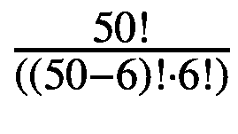
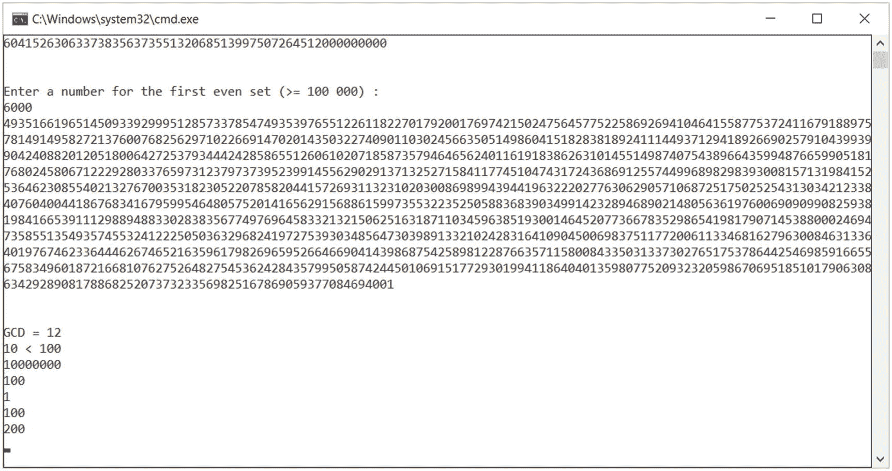

# 三、大整数运算

在复杂密码算法的复杂实现中，基于大整数的运算是难以实现的任务。大多数限制是由硬件设备(例如处理器、RAM 存储器)或编程语言造成的。

在 C# 中，整数值表示为 32 位。在这 32 位中，只有 31 位用于表示正整数运算。在密码学中，建议我们处理 20 亿的数字，2 ^ 10<sup>9</sup>。

大多数编译器，比如 GCC，都提供了`long long type`。这提供了拥有大约 9 万亿分之一，9 ^ 10<sup>18</sup>的整数的能力。

以下示例显示了 RSA (Rivest-Shamir-Adleman)公钥加密密码系统，它需要大约 300 位数字。当处理真实事件及其概率时，在大多数情况下，计算将涉及非常大的数字。对于 C# 来说，获得主要结果可能是准确的，但是与其他困难的计算相比，我们将拥有非常大的数量。

考虑下面这个众所周知的例子:计算只有一张彩票的彩票中头奖的几率。组合数是 50 取 6 一次，“50 选 6”是。计算过程得到的数字是 15.890.700，所以在这种情况下，获胜的几率是 1/15，890，700。如果我们用 C# 编程语言来实现，15890700 这个数字可以非常容易地表示出来。这可能会很棘手，然后我们可能会在实施 50 的过程中陷入幼稚！(使用 Windows 中的计算器计算)，即 3.041409320171e+64 或

30,414,093,201,713,378,043,612,608,166,064,768,844,377,641,568,960,512,000,000,000,000

用 C # 来表示这个数字几乎是不可能的，即使我们使用的是 64 位平台。

在接下来的几节中，我们将讨论一些可用于大整数算术运算的算法。请注意，由于我们使用的是加密算法和认证协议，这可能很难实现，因为我们处理的是大整数。下面我们将展示如何处理大数的一步一步的方法。

图 [3-1](#Fig1) 和清单 [3-1](#PC1) 显示了大整数功能的完整实现。



图 3-1

计算 GCD 的 BigInteger 示例

```cs
using System;
using System.Collections.Generic;
using System.Linq;
using System.Text;
using System.Numerics;

namespace BigIntExample
{
    class Program
    {
        static void Main(string[] args)
        {
            //** compute bigger factorials
            Console.Write("Enter a factorial to be computed (>100) :  ");
            int factorial = Convert.ToInt32(Console.ReadLine());
            ComputeBigFactorial(factorial);

            Console.WriteLine(Environment.NewLine);

            //** compute sum of the first
            //** even number to get Fibonacci Series
            Console.WriteLine("Enter a number for the " +
                "first even set (>= 100 000) : ");
            int evenNumberFib = Convert.ToInt32(Console.ReadLine());
            SumOfFirstOneLacEvenFibonacciSeries(evenNumberFib);
            Console.WriteLine(Environment.NewLine);

            //** computing greatest common divisor
            Console.WriteLine("GCD = " +
                    BigInteger.GreatestCommonDivisor(12, 24));

            //** comparing purpose

            BigInteger value1 = 10;
            BigInteger value2 = 100;

            switch (BigInteger.Compare(value1, value2))
            {
                case -1:
                    Console.WriteLine("{0} < {1}", value1, value2);
                    break;
                case 0:
                    Console.WriteLine("{0} = {1}", value1, value2);
                    break;
                case 1:
                    Console.WriteLine("{0} > {1}", value1, value2);
                    break;
            }

            //** parsing
            Console.WriteLine(BigInteger.Parse("10000000"));

            //** obtaining negation
            Console.WriteLine(BigInteger.Negate(-100));

            //** returning the sign
            Console.WriteLine(BigInteger.Negate(-1).Sign);

            //** returning conversion (int to BigInterger)
            int i = 100;
            BigInteger bI = (BigInteger)i;
            Console.WriteLine(bI);

            //** returning conversion (BigInteger to int)
            BigInteger BI = 200;
            int j = (int)BI;
            Console.WriteLine(j);
            Console.Read();
        }

        //** computing the factorials

        private static void ComputeBigFactorial(int factorial)
        {
            BigInteger number = factorial;
            BigInteger fact = 1;
            for (; number-- > 0; ) fact *= number+1;
            Console.WriteLine(fact);
        }

        //** computing the first even fibonacci series
        private static void SumOfFirstOneLacEvenFibonacciSeries(
                        int evenNumberFib)
        {
            int limit = evenNumberFib;

            BigInteger value1 = 1;
            BigInteger value2 = 2;
            BigInteger theSum = 0;
            BigInteger even_sum = value1 + value2;

            for (int i = 2; i < limit; i++)
            {
                theSum = value1 + value2;
                if (theSum % 2 == 0) even_sum += theSum;
                value1 = value2;
                value2 = theSum;
            }

            Console.WriteLine(even_sum);
        }
    }
}

Listing 3-1BigInteger Implementation

```

首先，我们需要在一个大整数中使用不同的计算来转换一个标准整数。为了做到这一点，我们编写了一个名为`transformIntToBigInt(A, 123)`的函数。该功能的目的是将 *A* 初始化为`A[0]=3`、`A[1]=2`、`A[2]=1`，并将剩余位置归零为`A[3,...N-1]`。清单 [3-2](#PC2) 展示了如何通过使用一个简单的 C# 实现来完成上面的语句。在这个例子中，*基址*代表位符号。

```cs
public void TransformIntToBigInt(int BigNo[], int number)
{
      Int   k;

      //** start indexing with 0 position
      k = 0;

      // if we still have something left
      // within the number, continue
      while (number) {
            // insert the digit that is least significant
            // into BigNo[k] number
            BigNo[k++] = number % bitSign;

            // we don't need the least significant bit
            number /= BASE;
      }

      // complete the remain of the array with zeroes
      while (k < N)
            BigNo[k++] = 0;
}

Listing 3-2Transforming a Standard Integer Using Different Computations in a Big Integer

```

来自清单 [3-2](#PC2) 的算法有 *O* ( *N* )空间和时间。

让我们继续我们的旅程，看看给一个大 int 加 1 的可能性。这个过程非常有用，在密码学中经常使用。清单 [3-3](#PC3) 中的函数比总加法简单得多。

```cs
public void increment (int BigNo [])
{
      Int i;

      // start indexing with least significant digit
      i = 0;
      while (i < N)
      {

            // increment the digit
            BigNo[i]++;

            // if it overflows
            if (BigNo[i] == BASE)
            {

                  // make it zero and move the index to next
                  BigNo[i] = 0;
                  i++;
            }
            else
                  // else, we are done!
                  break;
      }
}

Listing 3-3Adding One to a Big Int

```

清单 [3-2](#PC2) 中描述的算法对于可能的最坏情况有 *O* ( *n* )(想象一下类似于 99999999999999999999…)和ω(1)表示最佳情况。最好的情况发生在最低有效位没有溢出的时候。

继续，让我们仔细看看两个大整数相加的方法。在这种情况下，我们希望在两个不同的数组中添加两个大整数，BigNo1[0，…，N-1]和 BigNo2[0，…，N-1]。结果将保存在另一个数组 BigNo3[0，…，N-1]中。算法很基础，没什么花哨的。参见清单 [3-4](#PC4) 。

```cs
public void addition(int BigNo1[], int BigNo2[], int BigNo3[])
{
      Int j, overflowCarry, sum;

      //** there is no necessary to carry at this moment
      carry = 0;

      //** move from the least to the most significant digit
      for (j=0; j<N; j++)
      {
            // the digit placed on j'th position of BigNo3[]
            // is the sum of j'th digits of
            // BigNo1[] and BigNo2[] and including the
            // overvflow carry
            sum = BigNo1[j] + BigNo2[j] + overflowCarry;

            // if the sum will go out of the base then
            // we will find ourself in an overflow situation
            if (sum >= BASE)
            {
                  carry = 1;

                  //** making adjustment in such way that
                  //** the sum will fit within a digit
                  sum -= BASE;
            }
            else
                  //otherwise no carryOverflow
                  carry = 0;

            // use the same sum variable to add the
            BigNo3[j] = sum;
      }

      // once we reached to the end
      // we can expect an overflow
      if (carry)
            printf ("There is an overflow in the addition!\n");
}

Listing 3-4Addition Algorithm

```

接下来，我们将重点讨论乘法。我们将使用一个基本的方法，将两个大数字相乘， *X* 和 *Y* ，将每个 *X* 数字与每个 *Y* 数字相乘，因此输出成为一个组成元素。每个新数字的绩效结果向左移动。我们实现的函数，`multiplyingOneDigit,`将把一个整数和一个数字相乘。结果将被放入一个新的大整数中。我们还将展示另一个函数，`left_shifting,`,它将数字向左移动一定数量的空格。用 *b* <sup>*i*</sup> 相乘，其中 *b* 为基数， *i* 表示空格数。清单 3-5 展示了乘法算法。

```cs
public void multiply (int BigInt1[], int BigInt2[],
                                   int BigInt3[])
{
      Int x, y, P[integer_length];

      // BigInt3 will store the sum of
      // partial products.  The value is set to 0.
      buildInteger (BigInt3, 0);

      // for each digit in BigInt1
      for (x=0; x<length_of_integer; x++)
      {
           // multiply BigInt2 with digit [x]
           multiplyOneDigit(BigInt2, P, BigInt1[x]);

           // left shifting the partial product with i bytes
           leftShifting(P, x);

           // add the output result to the current sum
           addResult(BigInt3, P, BigInt3);
      }
}

Listing 3-5Multiplication Algorithim

```

在清单 [3-6](#PC6) 中，我们将检查一个乘以一位数的函数。

```cs
public void multiplyUsingOneDigit (int BigOne1[], int
                                       BigOne2[], int number)
{
      Int k, carryOverflow;

      // we don't need extraflow for the moment
      carryOverflow = 0;

      // for each digit, starting with least significant...
      for (k=0; k<N; k++)
      {
           // multiply the digit with the number,
           // save the result in BigOne2
           BigOne2[k] = number * BigOne1[k];

           // set extra overflow that is taking
           // place starting with the last digit
           BigOne2[k] += carryOverflow;

           // product is too big to fit in a digit
           if (BigOne2[k] >= BASE)
           {
                  //** handle the overflow
                  carryOverflow = B[k] / BASE;
                  BigOne2[k] %= BASE;
           }
           else
                  // no overflow
                  carryOverflow = 0;
      }
      if (carryOverflow)
            printf ("During the multiplication
                            we experienced an overflow!\n");
}

Listing 3-6Multiplying Using a Single Digit

```

清单 [3-7](#PC7) 显示了一个将向左移动特定数量空格的函数操作。

```cs
public void leftShifting (int BigInt1[], int number) {
      int i;

      //start from left to right,
      // everything with left n spaces
      for (i=N-1; i>= number; i--)
           BigInt1[i] = BigInt1[i- number];

      // complete the last n digits with zeros
      while (i >= 0) BigInt1[i--] = 0;
}

Listing 3-7Shifting to Left a Specific Number of Spaces

```

## 在 C# 中使用大整数

 .NET Framework 4.0 提供了`System.Numerics.BigInteger`类，该类基于`Microsoft.SolverFoundation.Common.BigInteger`。

在设计和开发加密算法时，使用`BigInteger`非常有用。`BigInteger`表示不可变类型，用于没有上限或下限的大数。特征`BigInteger`类的成员是`Byte`、`Int`(所有三种表示:16、32 和 64)、`SByte`和`UInt` (16、32 和 64)类型。

### 如何使用 BigInteger 类

创建`BigInteger`对象有几种方法:

*   使用`new`关键字并将任何浮点值作为参数提供给类的构造函数。参见清单 [3-8](#PC8) 。

*   通过声明一个赋值的`BigInteger`变量。参见清单 [3-9](#PC9) 。

```cs
BigInteger publicCryptographyKeyFromDouble
                              = new BigInteger(131312.3454354353);
Console.WriteLine(publicCryptographyKeyFromDouble);

BigInteger publicCryptographyKeyFromInt64
                              = new BigInteger(7587643562354635);
Console.WriteLine(publicCryptographyKeyFromInt64);

Listing 3-8Using the new Keyword with BigInteger

```

*   通过给一个`BigInteger`对象分配一个十进制或浮点值。在赋值发生之前，首先需要将值转换为`BigInteger`。见清单 [3-10](#PC10) 。

```cs
long publicCryptographyKey = 87432541632312;
BigInteger cryptoPubKey = publicCryptographyKey;
Console.WriteLine(cryptoPubKey);

Listing 3-9Using a Variable with a Value Assigned

```

```cs
BigInteger publicCryptographyKeyFromDoubleValue
                                 = (BigInteger) 423412.3423;
Console.WriteLine(publicCryptographyKeyFromDoubleValue);

BigInteger publicCryptographyFromDecimal
                                 = (BigInteger) 23452.34m;
Console.WriteLine(publicCryptographyFromDecimal);

Listing 3-10Casting to BigIntegers

```

## 的大整数库。网

当我们在密码学中处理大整数时，64 位对于数字来说是不够的。这一节将介绍一个名为 RSA 的复杂密码系统的例子，我们将展示一些关于 .NET `BigInteger`类和其他。网络图书馆。

如上节所示，`System.Numerics.BigIntegers`是从开始引入的 .NET Framework 4.0，清单 [3-11](#PC11) 中的简单示例展示了如何以不同于上面的其他示例的方式使用它。

```cs
var publicCryptoKey = BigInteger.Parse("5845829436572843562734865972843659784564");

var privateCryptoKey = BigInteger.Parse("245245452345252342435543527362524323455");

Listing 3-11Using System.Numerics.BigIntegers

```

任何运算(加、乘、除、差等。)使用`publicCryptoKey`和`privateCryptoKey`是可能的。

### 良好操作规范

GMP [ [2](#Par42) 是一个命名空间，也称为 Emil，以 Emil Stefanov 命名。它结合了 F# 中 BigInt 的强大功能。这个库的缺点是它只能在 32 位系统上实现。C# 中的例子看起来与使用`BigInteger`的例子非常相似。参见清单 [3-12](#PC12) 。

```cs
var publicCryptoKey = BigInt ("5845829436572843562734865972843659784564");

var privateCryptoKey = BigInt ("245245452345252342435543527362524323455");

Listing 3-12Using GMP

```

### MPIR

MPIR [ [3](#Par43) 可以看做是 GMP [ [2](#Par42) 的一个分叉。MPIR 的目的是给 Windows 上的编译过程一个任何专业开发人员都想在他们的工具包中拥有的有味道和无痛的过程。

为了在美国使用 MPIR .NET 中，一些包装器是必要的，比如`DLLImports`或`GetProcAddress`赋值。一个非常好的可以使用的包装器是 X-MPIR，由来自阿尔吉利布[ [4](#Par44) ]的 Sergey Bochkanov 提出并开发。

清单 [3-13](#PC13) 中的代码展示了如何使用 MPIR 开发复杂的密码系统。

```cs
var publicKey = mpir.mpz_init_set_str("4657334563546345", 10);
var sessionKey = mpir.mpz_init_set_str("784567354634564", 10);
var exampleOfOperation = mpir.mpz_init();

//** random operations
mpir.mpz_mul(exampleOfOperation, publicKey, sessionKey);

//** Implement the cryptosystem operations as you like **//

//** it is recommended to invoke clear
//** method in order to avoid any memory leakage
mpir.mpz_clear(publicKey);
mpir.mpz_clear(sessionKey);
mpir.mpz_clear(exampleOfOperation);

Listing 3-13Using MPIR

```

## 结论

在这一章中，我们介绍了表示大整数的最重要的方面，以及它们是如何设计和实现的。

*   我们分析了处理大数的基本方法的实现的技术方面。

*   我们展示了来自 .NET Framework 4.0 并展示了如何使用`BigInteger`对象。

*   我们包括了其他处理大整数的库，比如 GMP 和 MPIR。

## 文献学

1.  `BigInteger`阶级。网上有: [`https://docs.microsoft.com/en-us/dotnet/api/system.numerics.biginteger?redirectedfrom=MSDN&view=netcore-3.1`](https://docs.microsoft.com/en-us/dotnet/api/system.numerics.biginteger%253Fredirectedfrom%253DMSDN%2526view%253Dnetcore-3.1) 。

2.  没有限制的 GMP 算法。网上有: [`https://gm.plib.org` /](https://gm.plib.org/) 。

3.  Mpir.NET。网上有: [`http://wezeku.github.io/Mpir.NET/`](http://wezeku.github.io/Mpir.NET/) 。

4.  阿尔格里卜。网上有: [`www.alglib.net/`](http://www.alglib.net/) 。