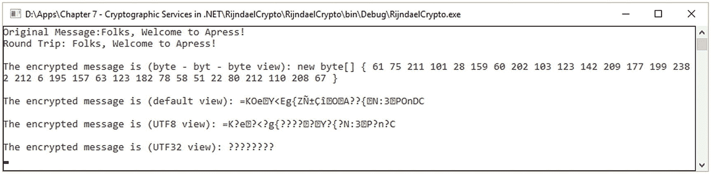

# 七、.NET 加密服务

在本章中，我们将讨论主要的服务和加密原语 .NET 框架和。提供给专业人士的核心网。了解开发技术必须提供哪些服务和加密原语非常重要，尤其是如果您不想从头开始开发加密算法和安全方案的话。

将涵盖以下主题:

*   密码原语

*   使用秘密密钥加密

*   使用公钥加密

*   数字签名

*   哈希值

*   随机数生成

*   支持套件 B

*   下一代加密技术(CHG)类别

通过互联网的通信本身并不安全，在这种情况下，需要使用加密来保证这种通信的安全性。这些网络实体之间的通信很可能被未授权的第三方读取，甚至被更改。正如您之前所看到的，加密的目的是保护数据不被未经授权的人查看或修改。在的帮助下。在. NET 框架中，我们有被设计用于`System.Security.Cryptography`(见第 [9 章](09.html))的加密类，一个处理加密函数及其操作的命名空间。此外，我们正在处理非托管 CryptoAPI(微软加密 API)的包装器。与此同时，其他的都得到了充分的实施和相应的测试。好的一面是，一旦我们创建了一个特定加密算法类的新实例，密钥就会自动生成，以便尽可能容易地使用，并使用非常安全的默认属性。

也就是说，在下面几节中，我们将简要介绍支持的最重要的加密算法 .NET Framework (ClickOnce、Suite B 和 CNG)，从 .NET 框架 3.5。

## 使用秘密密钥加密

基于密钥的加密算法在加密和解密过程中使用单个密钥。保证密钥的安全性以防止未经授权的方或服务是非常重要的。任何有权使用该密钥的未授权方都可以使用它来解密数据或加密其他数据，声称并冒充真正的授权方。

使用秘密密钥的加密也被称为对称加密，因为相同的密钥用于两个过程:加密和解密操作(见图 [7-1](#Fig1) )。与基于公钥的算法相比，基于秘密密钥的加密算法非常快。同时，它们最适合对大型数据流进行加密编码。另一方面，我们有基于非对称加密的算法，如 RSA，它们的数学限制是基于需要加密多少数据。


图 7-1

对称加密

那个 .NET Framework 包含以下类，用于帮助专业人员使用相同的密钥实现加密和解密操作:


图 7-2

AES 执行

*   `AesManaged` [ [38](#Par138) ](始于 .NET 框架 3.5)。参见清单 [7-1](#PC1) 和图 [7-2](#Fig2) 中的实现。

*   `RijndaelManaged`[41](#Par141)。参见清单 [7-2](#PC2) 中的实现。

*   `DESCryptoServiceProvider` [ [39](#Par139) 。参见清单 [7-3](#PC3) 中的实现。

*   `RC2CryptoServiceProvider`[40](#Par140)。实现与清单 [7-3](#PC3) 中的类似。

*   `TripleDESCryptoServiceProvider`[42](#Par142)。

```cs
using System;
using System.IO;
using System.Security.Cryptography;

namespace AESExampleOfImplementation
{
    class AESExampleOfImplementation
    {
        public static void Main()
        {
            string genuineMessage = "Welcome to Apress!";

            //** Declare a new instance
            //** of the class AESManaged.
            //** With its help a new key
            //** and initialization vector is generated
            using (AesManaged aes_encryption =
new AesManaged())
            {
                //** the string is encrypted and
                //** stored as an array of bytes
                byte[] message_encrypted =
EncryptStringToBytes_Aes(genuineMessage,
aes_encryption.Key,
aes_encryption.IV);

                //** the decryption will take place as
                //** decrypting the bytes into a string
                string tripRound =
DecryptStringFromBytes_Aes(
message_encrypted,
aes_encryption.Key,
aes_encryption.IV);

                //** Shows in the console the original
                //** message and the data decrypted
Console.WriteLine("The original message is:
{0}", genuineMessage);

Console.WriteLine("The trip round is: {0}",
tripRound);

Console.WriteLine("The encrypted message is
(byte-by-byte view): {0}", PrintByteArray(message_encrypted));

                Console.WriteLine("The encrypted message is
(default view): {0}", Encoding.Default.GetString
(message_encrypted));

                Console.WriteLine("The encrypted message is
(UTF8 view): {0}", Encoding.UTF8.GetString(message_encrypted));

                Console.WriteLine("The encrypted message is
(UTF32 view): {0}",
Encoding.UTF32.GetString
(message_encrypted));
                Console.ReadKey();

            }
        }

       //** processing byte values to display them
     static string PrintByteArray(byte[] encrypted_message)
        {
            var build_string =
new StringBuilder("new byte[] { ");
            foreach (var each_byte in encrypted_message)
            {
                build_string.Append(each_byte + " ");
            }
            build_string.Append("}");
            return build_string.ToString();
        }

        static byte[] EncryptStringToBytes_Aes
(string genuineText,
 byte[] crypto_key,
 byte[] initializationVector)
        {
            //** verify the arguments
            if (genuineText == null ||
genuineText.Length <= 0)
               throw new ArgumentNullException("genuineText");

            if (crypto_key == null || crypto_key.Length <= 0)
                throw new ArgumentNullException("crypto_key");

 if (initializationVector == null ||
initializationVector.Length <= 0)
                throw new ArgumentNullException("IV");

            byte[] encryptionRepresentation;

            //** declare an AesManaged instance
            //** Create an AesManaged object
           //** the declaration should include the specified
           //** key and initialization vector.
            using (Aes aes_algorithm = Aes.Create())
            {
                aes_algorithm.Key = crypto_key;
                aes_algorithm.IV = initializationVector;

                //** do the stream transformation
               //** for this declare an ecnryptor
              //** using ICryptoTransform
                ICryptoTransform crypto_transformation =
aes_algorithm.CreateEncryptor
(aes_algorithm.Key, aes_algorithm.IV);

                //** use the streams and work with the
                //** encryption Create the streams
                //** used for encryption
                using (MemoryStream memoryStreamForEncryption
= new MemoryStream())
                {
                    using (CryptoStream cryptoStreamEncryption
 = new CryptoStream(memoryStreamForEncryption,
 crypto_transformation, CryptoStreamMode.Write))
                {
                        using (StreamWriter
  streamWriterForEncryption = new
                        StreamWriter(cryptoStreamEncryption))
                        {
                            //** write the entire volume of
                           //** data with the stream
streamWriterForEncryption.
Write(genuineText);
                        }
                        encryptionRepresentation =
    memoryStreamForEncryption.ToArray();
                    }
                }
            }

            //** Return the encrypted bytes from
 //** the memory stream.
            return encryptionRepresentation;
        }

        static string DecryptStringToBytes_Aes
(byte[] encryptedText,
 byte[] encryption_key,
 byte[] initialization_vector)
        {
            //** verify the arguments
            if (encryptedText == null ||
encryptedText.Length <= 0)
              throw new
ArgumentNullException("encryptedText");

            if (encryption_key == null ||
encryption_key.Length <= 0)
                throw new ArgumentNullException("Key");

 if (initialization_vector == null ||
initialization_vector.Length <= 0)
                throw new ArgumentNullException("IV");

            //** the string used to store
            //** the original decrypted text
            string original_text = null;

            //** declare an AesManaged instance
            //** using the encryption key
            //** and initialization vector
            using (Aes aes_algorithm = Aes.Create())
            {
                aes_algorithm.Key = encryption_key;
                aes_algorithm.IV = initialization_vector;

                //** do the stream transformation
               //** for this declare an
               //** encryptor using ICryptoTransform
                ICryptoTransform decrypt_transformation =
aes_algorithm.CreateDecryptor(
aes_algorithm.Key,
aes_algorithm.IV);

                //** use the streams and work
                //** with the encryption
                //** Create the streams used for encryption
                using (MemoryStream memoryStreamDecryption =
                       new MemoryStream(encryptedText))
                {
                    using (CryptoStream cryptoStreamDecryption
= new CryptoStream(
memoryStreamDecryption,
decrypt_transformation,   CryptoStreamMode.Read))
                    {
                        using (StreamReader
streamReaderDecryption =
                         new StreamReader(
cryptoStreamDecryption))
                        {
                  //** read the decrypted bytes from
                  //** the stream reader
                  //** and save it in
                 //** original_text variable
                           original_text =
streamReaderDecryption.
ReadToEnd();
                        }
                    }
                }
            }
            return original_text;
        }
    }
}

Listing 7-1

AES Implementation Using AesManaged

```

在清单 [7-2](#PC2) 和图 [7-3](#Fig3) 中，您可以观察 Rijndael 是如何实现的。



图 7-3

RijndaelManaged 示例

```cs
using System;
using System.IO;
using System.Security.Cryptography;
using System.Text;

namespace RijndaelManagedImplementationExample
{
    class RijndaelManagedImplementationExample
    {
        public static void Main()
        {
            try
            {
                string genuineMessage = "Folks, Welcome to Apress!";

                //** declare a new instance of the
                //** RijndaelManaged class with this
                //** instance a new key and
                //** initialization vector (IV)
                using (RijndaelManaged rijndeal_crypto = new RijndaelManaged())
                {
                    rijndeal_crypto.GenerateKey();
                    rijndeal_crypto.GenerateIV();

                    //** encrypt the message (string)
                    //** and store the content to an
                    //** array of bytes
                    byte[] encrypted = EncryptStringToBytes(genuineMessage, rijndeal_crypto.Key, rijndeal_crypto.IV);

                    //** Decrypt the bytes to a string
                    string tripRound = DecryptStringFromBytes(encrypted, rijndeal_crypto.Key, rijndeal_crypto.IV);

                    //** Display the original data
                    //** and the decrypted data
                    Console.WriteLine("Original Message:{0}", genuineMessage);
                    Console.WriteLine("Round Trip: {0}",tripRound);

                    Console.WriteLine("\nThe encrypted message is (byte - byt - byte view): {0}", PrintByteArray(encrypted));
                    Console.WriteLine("\nThe encrypted message is (default view): {0}", Encoding.Default.GetString(encrypted));
                    Console.WriteLine("\nThe encrypted message is (UTF8 view): {0}", Encoding.UTF8.GetString(encrypted));
                    Console.WriteLine("\nThe encrypted message is (UTF32 view): {0}", Encoding.UTF32.GetString(encrypted));

                    Console.ReadKey();
                }
            }
            catch (Exception e)
            {
                Console.WriteLine("There is an error:{0}", e.Message);
            }
        }

        //** processing byte values to display them
        static string PrintByteArray(byte[] encrypted_message)
        {
            var build_string = new StringBuilder("new byte[] { ");
            foreach (var each_byte in encrypted_message)
            {
                build_string.Append(each_byte + " ");
            }
            build_string.Append("}");
            return build_string.ToString();
        }

        static byte[] EncryptStringToBytes(string genuineText, byte[] encryption_key, byte[] initialization_vector)
        {
            //** verify the arguments
            if (genuineText == null ||
            genuineText.Length <= 0)
                throw new ArgumentNullException("genuineText");

            if (encryption_key == null ||
                encryption_key.Length <= 0)
                throw new ArgumentNullException("encryption_key");

            if (initialization_vector == null ||
                initialization_vector.Length <= 0)
                throw new ArgumentNullException("IV");

            byte[] encryption_content;

            //** Create an RijndaelManaged object
            //**  with the specified key and IV.
            using (RijndaelManaged rijndaelAlgorithm = new RijndaelManaged())
            {

                rijndaelAlgorithm.Key = encryption_key;

                rijndaelAlgorithm.IV = initialization_vector;

                //** Create an encryptor to perform
                //** the stream transform.
                ICryptoTransform encryptorTransformation = rijndaelAlgorithm.CreateEncryptor(rijndaelAlgorithm.Key, rijndaelAlgorithm.IV);

                //** Create the streams used for encryption
                using (MemoryStream memoryStreamEncrypt = new MemoryStream())
                {
                    using (CryptoStream cryptoStreamEncrypt = new CryptoStream(memoryStreamEncrypt, encryptorTransformation, CryptoStreamMode.Write))
                    {
                        using (StreamWriter streamWriterEncrypt = new StreamWriter(cryptoStreamEncrypt))
                        {

                            //** write the entire volume of
                            //** data to the stream
                            streamWriterEncrypt.Write(genuineText);
                        }
                        encryption_content = memoryStreamEncrypt.ToArray();
                    }
                }
            }

            //** get the encrypted bytes
            //** from the memory stream.
            return encryption_content;
        }

        static string DecryptStringFromBytes(byte[] encrypted_text, byte[] encryption_key, byte[] initialization_vector)
        {
            //** verify the arguments
            if (encrypted_text == null ||
                encrypted_text.Length <= 0)
                throw new ArgumentNullException("encrypted_text");

            if (encryption_key == null ||
                encryption_key.Length <= 0)
                throw new ArgumentNullException("encryption_key");

            if (initialization_vector == null ||
                initialization_vector.Length <= 0)
                throw new ArgumentNullException("initialization_vector");

            //** Declare the string used to hold
            //** the decrypted text.
            string original_text = null;

            //** Create an RijndaelManaged object
            //** with the specified key and IV.
            using (RijndaelManaged rijndael_algorithm = new RijndaelManaged())
            {
                rijndael_algorithm.Key = encryption_key;

                rijndael_algorithm.IV = initialization_vector;

                //** Create a decryptor to
                //** perform the stream transform.
                ICryptoTransform decryptionTransformation = rijndael_algorithm.CreateDecryptor(rijndael_algorithm.Key, rijndael_algorithm.IV);

                //** Create the streams used for decryption.
                using (MemoryStream memoryStreamDecryption = new MemoryStream(encrypted_text))
                {
                    using (CryptoStream cryptoStreamDecrypt = new CryptoStream(memoryStreamDecryption, decryptionTransformation, CryptoStreamMode.Read))
                    {
                        using (StreamReader streamReaderDecryption = new StreamReader(cryptoStreamDecrypt))
                        {
                            //** Read the decrypted bytes
                            //** from the decrypting stream
                            //** and place them in a string.
                            original_text = streamReaderDecryption.ReadToEnd();
                        }
                    }
                }
            }

            return original_text;
        }
    }
}

Listing 7-2

RijndaelManaged Implementation

```


图 7-6

存储器中的 DES 加密和解密


图 7-5

DES 加密结果


图 7-4

文件加密/解密的 DES 算法

*   在下面的例子中，我们将实现 DES 算法的两种情况。尽管这个事实被克服了，但它是一个很好的例子，说明了加密算法和原语应该如何被实际对待。这两个实现与实际中存在的其余实现的不同之处在于，第一个示例(参见图 [7-4](#Fig4) 、图 [7-5](#Fig5) 和清单 [7-3](#PC3) )在文件内进行加密/解密，第二个示例(参见图 [7-6](#Fig6) 和清单 [7-4](#PC4) )在内存中进行加密/解密。当我们处理使用文件的复杂系统时(例如 Hadoop 系统或大数据环境的 clear JSON 文件)，解决方案之一是以这样的方式设计加密原语，即我们正确地对文件或内存进行加密/解密，而不暴露可能影响业务的东西。

```cs
using System;
using System.Security.Cryptography;
using System.Text;
using System.IO;

class DESSample
{
    static void Main()
    {
        try
        {
            //** instance of the DES algorithm and
            //** with help of Create() method
            //** an initialization vector is generated
            DES des_algorithm = DES.Create();

            //** declare a string for being encrypted
            string plaintext = "Welcome to Apress. Enjoy reading.";
            string file_name = "encrypted_file.txt";

            //** do the encryption to the file based on
            //** the file name, key, and initialization vector
            DesEncryptionToFile(plaintext, file_name, des_algorithm.Key, des_algorithm.IV);

            //** Decrypt the text from a file using the file name, key, and IV.
            string ciphertext = DesDecryptionFromFile(file_name, des_algorithm.Key, des_algorithm.IV);

            //** Show in the console the results
            Console.WriteLine("The message for encryption is: {0}", plaintext);
            Console.WriteLine("The message has been encrypted with success.");
            Console.WriteLine("\tCheck your file \"{0}\" at the following location: {1}", file_name, Path.GetFullPath("encrypted_file.txt"));
            Console.ReadKey();
        }
        catch (Exception exception)
        {
            Console.WriteLine(exception.Message);
        }
    }

    public static void DesEncryptionToFile(String text_to_encrypt, String file_name, byte[] encryption_key, byte[] initialization_vector)
    {
        try
        {
            //** create the file or open the file if exist
            FileStream file_stream = File.Open(file_name, FileMode.OpenOrCreate);

            //** declare a DES object
            DES des_algorithm = DES.Create();

            //** use the key and initialization vector.
            //** pass them to the CryptoStream together with the file stream
            CryptoStream crypto_stream = new CryptoStream(file_stream,
                des_algorithm.CreateEncryptor(encryption_key, initialization_vector),
                CryptoStreamMode.Write);

            //** based on a crypto_stream create an instance of stream writer
            StreamWriter stream_writer = new StreamWriter(crypto_stream);

            //** take data and write it within the stream writer
            stream_writer.WriteLine(text_to_encrypt);

            //** make sure that the file stream, crypto stream and stream writer are closed
            stream_writer.Close();
            crypto_stream.Close();
            file_stream.Close();
        }
        catch (CryptographicException exception){
            Console.WriteLine("There is an error regarding your encryption cryptographic process: {0}", exception.Message);
        }
        catch (UnauthorizedAccessException exception){
            Console.WriteLine("There is an error regarding creating/accessing the file: {0}", exception.Message);
        }
    }

    public static string DesDecryptionFromFile(String file_name, byte[] decryption_key, byte[] initialization_vector)
    {
        try
        {
            //** create the file or open the file if exist
            FileStream file_stream = File.Open(file_name, FileMode.OpenOrCreate);

            //** declare a DES object
            DES des_algorithm = DES.Create();

            //** use the key and initialization vector.
            //** pass them to the CryptoStream together with the file stream
            CryptoStream crypto_stream = new CryptoStream(file_stream,
                des_algorithm.CreateDecryptor(decryption_key, initialization_vector),
                CryptoStreamMode.Read);

            //** based on a crypto_stream create an instance of stream reader
            StreamReader stream_reader = new StreamReader(crypto_stream);

            //** before decryption take place
            //** we need to read the data from the stream
            string val = stream_reader.ReadLine();

            //** make sure that the file stream, crypto stream and stream writer are closed
            stream_reader.Close();
            crypto_stream.Close();
            file_stream.Close();

            //** return the decryption value
            return val;
        }
        catch (CryptographicException cryptoException)
        {
            Console.WriteLine("There was a cryptographic error. Please see: {0}. Correct the error and try again.", cryptoException.Message);
            return null;
        }
        catch (UnauthorizedAccessException unauthorizedException)
        {
            Console.WriteLine("There was an error with the file (unauthorized/existance). Please, check: {0}", unauthorizedException.Message);
            return null;
        }
    }
}

Listing 7-3Example of Implementation of the DES Algorithm Using DESCryptoServiceProvider

```

```cs
using System;
using System.Security.Cryptography;
using System.Text;
using System.IO;

class DESMemoryImplementationExample
{
    static void Main()
    {
        try
        {
            //** declare a DES instance and with Create()
            //** generate the key and initialization vector
            DES des_algorithm = DES.Create();

            //** declare a variable that contains the string to encrypt
            string data_to_encrypt = "Welcome to Apress. Enjoy your adventure.";

            //** use a memory buffer and proceed encrypting the text
            byte[] encrypted_data = EncryptionOfTextInMemory(data_to_encrypt, des_algorithm.Key, des_algorithm.IV);

            //** use the buffer and proceed with decryption and obtain the plaintext
            string decrypted_data = DecryptionOfTheTextFromMemory(encrypted_data, des_algorithm.Key, des_algorithm.IV);

            //** show in the console the encrypted and decrypted values
            Console.WriteLine("The original message is: {0}", data_to_encrypt);
            Console.WriteLine("\nThe encrypted message is (byte-by-byte view): {0}", PrintByteArray(encrypted_data));
            Console.WriteLine("\nThe encrypted message is (default view): {0}", Encoding.Default.GetString(encrypted_data));
            Console.WriteLine("\nThe encrypted message is (UTF8 view): {0}", Encoding.UTF8.GetString(encrypted_data));
            Console.WriteLine("\nThe encrypted message is (UTF32 view): {0}", Encoding.UTF32.GetString(encrypted_data));
            Console.WriteLine("\nThe original text is: {0}.", decrypted_data);

            Console.ReadKey();
        }
        catch (Exception general_exception)
        {
            Console.WriteLine(general_exception.Message);
        }
    }

    static string PrintByteArray(byte[] encrypted_message)
    {
        var build_string = new StringBuilder("new byte[] { ");
        foreach (var each_byte in encrypted_message)
        {
            build_string.Append(each_byte + " ");
        }
        build_string.Append("}");
        return build_string.ToString();
    }

    public static byte[] EncryptionOfTextInMemory(string data_to_encrypt, byte[] key_for_encryption, byte[] initialization_vector)
    {
        try
        {
            //** declare an instance for the memory buffer
            MemoryStream memory_stream = new MemoryStream();

            //** declare an instance of DES
            DES DESalg = DES.Create();

            //** declare an crypto stream instance and use
            //** the key used for encryption and the initialization vector
            CryptoStream crypto_stream = new CryptoStream(memory_stream,
                DESalg.CreateEncryptor(key_for_encryption, initialization_vector),
                CryptoStreamMode.Write);

            //** the string that has been passed will be converted to a byte array
            byte[] for_encryption = new ASCIIEncoding().GetBytes(data_to_encrypt);

            //** take the byte array and write it in the crypto stream
            crypto_stream.Write(for_encryption, 0, for_encryption.Length);

            //** don't forget to flush it
            crypto_stream.FlushFinalBlock();

            //** take the memory stream and write
            //** it as an array of bytes and store it accordingly
            byte[] stream_content_byteArray = memory_stream.ToArray();

            //** make sure to have the streams closed
            crypto_stream.Close();
            memory_stream.Close();

            //** the buffer with the encrypted content
            return stream_content_byteArray;
        }
        catch (CryptographicException cryptoException)
        {
            Console.WriteLine("There was an cryptographic error expected. Please see: {0}", cryptoException.Message);
            return null;
        }
    }

    public static string DecryptionOfTheTextFromMemory(byte[] data_for_decryption, byte[] decryption_key, byte[] initialization_vector)
    {
        try
        {
            //** declare an memory stream instance used for decryption
            //** and as parameter pass the encrypted data
            MemoryStream memory_stream_decryption = new MemoryStream(data_for_decryption);

            //** create an instance of DES object
            DES DESalg = DES.Create();

            //** declare an crypto stream instance based on
            //** the memory stream instance and pass as
            //** parameters the decryption and initialization vector
            CryptoStream crypto_stream_decryption = new CryptoStream(memory_stream_decryption,
                DESalg.CreateDecryptor(decryption_key, initialization_vector),
                CryptoStreamMode.Read);

            //** declare a buffer and we will use it
            //** to store the decrypted data
            byte[] from_encryption = new byte[data_for_decryption.Length];

            //** proceed reading the decrypted data from the crypto stream
            //** and store its content in a temporary buffer
            crypto_stream_decryption.Read(from_encryption, 0, from_encryption.Length);

            //** do the conversion of the buffer in a string
            //** and return its value
            return new ASCIIEncoding().GetString(from_encryption);
        }
        catch (CryptographicException cryptoException)
        {
            Console.WriteLine("There was an cryptographic error. Please see: {0}", cryptoException.Message);
            return null;
        }
    }
}

Listing 7-4Implementation of DES Encryption and Decryption in Memory

```

## 使用公钥加密

公钥加密使用私钥，私钥必须以未经授权方或恶意用户无法访问的方式秘密存储。此外，它使用一个任何人都可以使用的公钥。*公钥*和*私钥*之间的关系是基于数学的。使用公钥加密的数据只能使用私钥解密。在这种情况下，已经使用私钥签名的数据可以仅使用公钥来验证。

让我们考虑两方(经典的称为 Alice 和 Bob，如图 [7-7](#Fig7) 所示)将使用所述的公钥加密:Alice 将生成一个由公钥和私钥组成的对。当 Bob 决定向 Alice 发送加密消息时，他将需要 Alice 的公钥，因此他会向 Alice 索要公钥。Alice 将通过不安全的网络通信信道向 Bob 发送她的公钥。鲍勃会用它来加密信息。Bob 将把加密的消息发送给 Alice，Alice 将使用她的私钥解密它。


图 7-7

公钥加密

以下列表显示了公钥和私钥算法之间的比较:

*   基于公钥的算法使用固定的缓冲区大小。值得一提的是，密钥和基于它的算法使用一个表示为变量的缓冲区，其大小是可变的。

*   关于数据链，公钥算法和对称密钥算法是有区别的。对称密钥算法将数据链接成流，而公钥算法没有这种能力。非对称操作和对称操作的流模型不同。

*   使用公钥的加密使用更大的空间来表示密钥。与公钥加密相比，对称密钥加密使用的空间要小得多。

*   公钥非常容易分发，因为不需要有安全机制。如有必要，有验证和检查发送者身份的机制。

*   为了创建数字签名以验证和检查发送者的身份，可以成功地使用 RSA 和 DSA 等公钥算法。

*   关于速度，如果我们与对称算法相比，公钥算法是非常慢的。它们被设计成不能加密大量数据。因此，只建议对少量数据使用公钥算法。

那个 .NET Framework 包含以下类，这些类已经包含了公钥加密算法和操作的实现:


图 7-8

RSA 示例加密

*   `DSACryptoServiceProvider` [ [1](#Par101) 。实现是相似的，它们可以用与清单 [7-1](#PC1) 、 [7-2](#PC2) 或 [7-3](#PC3) 相同的方式来完成。

*   `RSACryptoServiceProvider`[2](#Par102)。有关实施的示例，请参见清单 [7-5](#PC5) 和图 [7-8](#Fig8) 。

*   `ECDiffieHellman`[3](#Par103)。实现是相似的，它们可以用与清单 [7-1](#PC1) 、 [7-2](#PC2) 或 [7-3](#PC3) 相同的方式来完成。

*   `ECDiffieHellmanCng`[4](#Par104)。实现是相似的，它们可以用与清单 [7-1](#PC1) 、 [7-2](#PC2) 或 [7-3](#PC3) 相同的方式来完成。

*   `ECDiffieHellamnCngPublicKey`[5](#Par105)。实现是相似的，它们可以用与清单 [7-1](#PC1) 、 [7-2](#PC2) 或 [7-3](#PC3) 相同的方式来完成。

*   `ECDiffieHellmanKeyDerivationFunction`[6](#Par106)。实现是相似的，它们可以用与清单 [7-1](#PC1) 、 [7-2](#PC2) 或 [7-3](#PC3) 相同的方式来完成。

*   `ECDsaCng`[7](#Par107)。有关 ECDSA(椭圆曲线数字签名算法)的实现示例，请参见清单 [7-5](#PC5) 。

```cs
using System;
using System.ComponentModel;
using System.Security.Cryptography;
using System.Text;

class RSAExampleOfImplementation
{
    static void Main()
    {
        try
        {
            //** the object will be used for
            //** conversion between the bytes
            //** of the array and string
            UnicodeEncoding byte_converter = new UnicodeEncoding();

            //** Create byte arrays to hold original,
            //** encrypted, and decrypted data.
            string plaintext = "Hi, Apress!";
            byte[] data_to_be_encrypted = byte_converter.GetBytes(plaintext);
            byte[] encrypted_data;
            byte[] decrypted_data;

            //** declare a new object of
            //** RSACryptoServiceProvider
            //** to generate the public
            //** and private key data.
            using (RSACryptoServiceProvider rsa_algorithm = new RSACryptoServiceProvider())
            {
                //** the data to be encrypted
                //** will be passed
                //** to EncryptionWithRSA along with the
                //** informations related to public key
                encrypted_data = EncryptionWithRSA(data_to_be_encrypted, rsa_algorithm.ExportParameters(false), false);
                //** the data to be encrypted
                //** will be passed to DecryptionWithRSA
                //** along with the informations related //** to public key
                decrypted_data = DecryptionWithRSA(encrypted_data, rsa_algorithm.ExportParameters(true), false);

                //** shows in the console the
                //** decryption of the plaintext
                Console.WriteLine("The plaintext for encryption is: {0}", plaintext);
                Console.WriteLine("\nPlaintext for encryption is: {0}", PrintByteArray(data_to_be_encrypted));
                Console.WriteLine("\nDecrypted plaintext: {0}", byte_converter.GetString(decrypted_data));

                Console.ReadKey();
            }
        }
        catch (ArgumentNullException)
        {
            //** in case that something is going wrong with
            //** the encryption, catch the exception
            Console.WriteLine("Encryption has failed.");
        }
    }

    static string PrintByteArray(byte[] encrypted_message)
    {
        var build_string = new StringBuilder("new byte[] { ");
        foreach (var each_byte in encrypted_message)
        {
            build_string.Append(each_byte + " ");
        }
        build_string.Append("}");
        return build_string.ToString();
    }

    public static byte[] EncryptionWithRSA(byte[] data_to_be_encrypted, RSAParameters rsa_key_info, bool oaep_padding)
    {
        try
        {
            byte[] encrypted_data;

            //** declare a new instance of
            //** RSACryptoServiceProvider.
            using (RSACryptoServiceProvider rsa_csp = new RSACryptoServiceProvider())
            {
                //** do the import for RSA Key information
                rsa_csp.ImportParameters(rsa_key_info);

                //** the byte passed array
                //** will be encrypted
                //** and mention OAEP padding
                encrypted_data = rsa_csp.Encrypt(data_to_be_encrypted, oaep_padding);
            }
            return encrypted_data;
        }

        //** in case that something is going wrong with
        //** the encryption, catch the exception
        catch (CryptographicException exception)
        {
            Console.WriteLine(exception.Message);

            return null;
        }
    }

    public static byte[] DecryptionWithRSA(
        byte[] data_to_be_decrypted,
        RSAParameters rsa_key_info,
        bool oaep_padding)
    {
        try
        {
            byte[] decrypted_data;

            //** declare a new instance of
            //** RSACryptoServiceProvider.
            using (RSACryptoServiceProvider rsa_csp = new RSACryptoServiceProvider())
            {
                //** do the import for RSA Key information
                rsa_csp.ImportParameters(rsa_key_info);

                //** the byte passed array will be decrypted
                //** and mention OAEP padding
                decrypted_data = rsa_csp.Decrypt(data_to_be_decrypted,     oaep_padding);
            }
            return decrypted_data;
        }

        //** in case that something is going wrong with
        //** the encryption, catch the exception
        catch (CryptographicException exception)
        {
            Console.WriteLine(exception.ToString());

            return null;
        }
    }
}

Listing 7-5Implementation of RSA Using RSACryptoServiceProvider

```

## 数字签名

公钥算法用于形成数字签名。数字签名的作用是验证发送者的真实身份，并提供有关数据完整性的保护。数字签名路径见图 [7-9](#Fig9) 。


图 7-9

ECDsaCng 示例

 .NET Framework 为实现数字签名算法提供了以下类:


图 7-10

数字签名

*   `DSACryptoServiceProvider` [ [8](#Par108)

*   `RSACryptoServiceProvider` [ [9](#Par109)

*   `ECDsa`[10](#Par110)。实施细节见清单 [7-6](#PC6) 和图 [7-10](#Fig10) 。

*   ECDsaCng [ [11](#Par111) ]。具体实施见清单 [7-6](#PC6) 和图 [7-10](#Fig10) 。

```cs
using System;
using System.IO;
using System.Security.Cryptography;
using System.Text;

class AliceUser
{
    public static void Main(string[] args)
    {
        BobUser bob = new BobUser();
        using (ECDsaCng dsaAlgorithm = new ECDsaCng())
        {
            dsaAlgorithm.HashAlgorithm = CngAlgorithm.Sha256;
            bob.theKey = dsaAlgorithm.Key.Export(CngKeyBlobFormat.EccPublicBlob);

            byte[] dataStructure = new byte[] { 21, 5, 8, 12, 207 };

            byte[] the_signature = dsaAlgorithm.SignData(dataStructure);

            bob.Receive(dataStructure, the_signature);
        }
    }
}

public class BobUser
{
    public byte[] theKey;

    public void Receive(byte[] data, byte[] the_signature)
    {
        using (ECDsaCng ecsdKey = new ECDsaCng(CngKey.Import(theKey, CngKeyBlobFormat.EccPublicBlob)))
        {
            if (ecsdKey.VerifyData(data, the_signature))
                Console.WriteLine("Data is good");
            else
                Console.WriteLine("Data is bad");
        }
    }
}

Listing 7-6Implementation of ECDsaCng

```

## 哈希值

哈希算法的目的是将表示为具有任意长度的二进制值映射到具有固定长度的较小二进制值。哈希值表示为代表特定数据的数值。

那个 .NET Framework 已经实现了以下类，这有助于我们快速实现哈希算法:

*   `HMACSHA1` [ [12](#Par112)

*   `MACTripleDES` [ [13](#Par113)

*   `MD5CryptoServiceProvider` [ [14](#Par114)

*   `RIPEMD160` [ [15](#Par115)

*   `SHA1Managed` [ [16](#Par116)

*   `SHA256Managed` [ [17](#Par117)

*   `SHA384Managed` [ [18](#Par118)

*   `SHA512Managed` [ [19](#Par119)

实现的例子，我们来看看`RIPEMD160`(见清单 [7-7](#PC7) 和图 [7-11](#Fig11) )和`SHA256Managed`(见清单 [7-8](#PC8) 和图 [7-12](#Fig12) )。


图 7-12

SHA256 实施示例


图 7-11

带有*哈希值的 RIPEMD160 示例。iso 文件

```cs
using System;
using System.IO;
using System.Security.Cryptography;
using System.Windows.Forms;

public class RIPEMD160Example
{

    [STAThreadAttribute]
    public static void Main(String[] args)
    {
        string directory_path = "";
        if (args.Length < 1)
        {
            FolderBrowserDialog folder_browser_dialog = new FolderBrowserDialog();
            DialogResult dialog_result = folder_browser_dialog.ShowDialog();
            if (dialog_result == DialogResult.OK)
            {
                directory_path = folder_browser_dialog.SelectedPath;
            }
            else
            {
                Console.WriteLine("There is no directory selected.");
                return;
            }
        }
        else
        {
            directory_path = args[0];
        }

        try
        {
            //** store the selected directory
            DirectoryInfo directoryInfo = new DirectoryInfo(directory_path);

            //** select the informations of
            //** each file from the folder
            FileInfo[] files = directoryInfo.GetFiles();

            //** declare a RIPEMD160 object
            RIPEMD160 myRIPEMD160 = RIPEMD160Managed.Create();
            byte[] hash_value;

            //** get the hash value of each file
            //** from the selected directory
            foreach (FileInfo infoOfTheFile in files)
            {
                //** declare a file stream for the file
                FileStream stream_file = infoOfTheFile.Open(FileMode.Open);

                //** put its position at the
                //** beginning of the stream

                stream_file.Position = 0;

                //** for the declared stream
                //** calculate the hash value
                hash_value = myRIPEMD160.ComputeHash(stream_file);

                //** show the name of the value in the console
                Console.Write(infoOfTheFile.Name + ": ");

                //** show the hash value in the console
                ShowReadableByteArray(hash_value);

                //** make sure that the file will
                //** closed properly
                stream_file.Close();
            }
            return;
            Console.ReadKey();
        }
        catch (DirectoryNotFoundException)
        {
            Console.WriteLine("Error: The selected directory could not be found.Try again!.");
        }

        catch (IOException)
        {
            Console.WriteLine("Error: There is a problem with the access of the file.");
        }

    }

    //** show the byte array in a possible readable format
    public static void ShowReadableByteArray(byte[] byteArray)
    {
        for (int k = 0; k < byteArray.Length; k++)
        {
            Console.Write(String.Format("{0:X2}",byteArray[k]));
            if ((k % 4) == 3)
                Console.Write(" ");
        }
        Console.WriteLine();
    }
}

Listing 7-7RIPEMD160 Implementation

```

```cs
using System;
using System.IO;
using System.Security.Cryptography;

public class HASH256ManagedImplementation
{
    public static void Main(String[] args)
    {
        string path_to_folder = @"D:\SHA256FileExample";
        //if (args.Length < 1)
        //{
        //    Console.WriteLine("There is no directory selected.");
        //    return;
        //}

        string directoryPathSelected = path_to_folder;
        if (Directory.Exists(directoryPathSelected))
        {
            //** the directory that has been selected
            var theDirectory = new DirectoryInfo(directoryPathSelected);

            //** get details about every file
            //**in the directory
            FileInfo[] theFiles = theDirectory.GetFiles();

            //** declare an instance of SHA256
            using (SHA256 theSha256 = SHA256.Create())
            {
                //** calculate the hash value
                //** of each of the files
                foreach (FileInfo informationOfTheFile in theFiles)
                {
                    try
                    {
                        //** declare a stream for the file

                        FileStream file_stream = informationOfTheFile.Open(FileMode.Open);

                        //** set the cursor at the
                        //** beginning of the stream
                        file_stream.Position = 0;

                        //** get the hash of the stream
                        byte[] the_hash_value =
                        theSha256.ComputeHash(file_stream);

                        //** show in the console the
                        //** name and hash of the file
                        Console.Write($"{informationOfTheFile.Name}: ");

                        ShowReadableByteArray(the_hash_value);

                        //** make sure that once is
                        //** done the file is closed
                        file_stream.Close();
                    }
                    catch (IOException e)
                    {
                        Console.WriteLine($"There is an Input / Output Exception:{ e.Message}");
                    }
                    catch (UnauthorizedAccessException e)
                    {
                        Console.WriteLine($"There is an error with the access: { e.Message}");
                    }
                }
            }

        }
        else
        {
            Console.WriteLine("The directory cannot be found. Select another one.");
        }

    }

    //** show the byte array in a
    //** possible readable format
    public static void ShowReadableByteArray(byte[] byteArray)
{
    for (int k = 0; k < byteArray.Length; k++)
    {
        Console.Write($"{byteArray[k]:X2}");
        if ((k % 4) == 3) Console.Write(" ");
    }
    Console.WriteLine();
}
}

Listing 7-8SHA256Managed Implementation

```

## 随机数生成

许多加密操作都是基于随机数的生成。作为一个例子，让我们考虑要求尽可能随机的密钥，这样就不可能复制它们。

`RNGCryptoServiceProvider`类[ [20](#Par120) ]基于加密服务提供商(CSP)提供的实现，提供了加密随机数生成(RNG)的专业实现。

## ClickOnce 清单

ClickOnce [ [21](#Par121) ]是一种部署技术，它提供了创建自我更新的基于 windows 的应用的能力。它提供了最少的用户交互，并且尽可能易于使用。

ClickOnce 技术仍然在中小型企业中使用。由于签名的安全性和签名的收集存在挑战。消费者应用主要在 UWP 或 Win32 中开发，并在部署过程中使用不同的技术。如今，一些内部业务应用使用不同的部署技术。

 .NET Framework 3.5 提供了加密类，允许专业人员获取并验证分配给已部署的 ClickOnce 清单的签名信息。这些类别如下:

*   `ManifestSignatureInformation`班[ [22](#Par122) ]。用于获取与清单签名相关的信息。这可以借助于`VerifyMethod`方法来实现。清单 [7-9](#PC9) 给出了一个验证清单签名的示例方法。

*   `ManifestKinds`枚举[ [23](#Par123) ]。此枚举用于指出应该检查哪些清单。检查过程的输出由`SignatureVerificationResult`枚举类型[ [24](#Par124) ]内的枚举值表示。

*   `ManifestSignatureInformationCollection`班[ [25](#Par125) ]。该类提供了与用于验证签名的`ManifestSignatureInformation`类[ [26](#Par126) ]的对象的只读集合相关的指导。

```cs
public static System.Security.Cryptography.
      ManifestSignatureInformationCollection
      VerifyingTheSignature
           (ActivationContext nameOfApplication,
           System.Security.ManifestKinds listOfManifests,
           System.Security.Cryptography.X509Certificates.
                      X509RevocationFlag theRevocationFlag,
           System.Security.Cryptography.X509Certificates.
                      X509RevocationMode theRevocationMode);

Listing 7-9Verifying the Signature with X509

```

以下类提供了有关签名的信息:

*   `StrongNameSignatureInformation`班 [27](#Par127) 。该类保存签名的(强)名称及其特定清单的信息。

*   `AuthenticodeSignatureInformation`级 [28](#Par128) 。表示一种特殊类型的签名，称为 authenticode，它与特定清单的签名信息包含在一起。

*   `TimestampInformation`级 [29](#Par129) 。获取 authenticode 签名上的时间戳。

*   `TrustStatus`枚举。检查验证码签名是否可信。

## 套件 B 支持

 .NET Framework 3.5 提供了对 Suite B 的支持，Suite B 是美国国家安全局(NSA)发布的一组重要的加密算法。2018 年，NSA 用商用的国家安全算法套件(CNSA) [ [31](#Par131) ]替换了套件 B。

以下是一些被包含和认可的算法:

*   高级加密标准(AES)算法。支持密钥大小 128、192 和 256。

*   安全散列算法 SHA-1、SHA-256、SHA-384 和 SHA-512

*   椭圆曲线数字签名算法。支持 256 位、384 位和 521 位曲线。

*   椭圆曲线迪菲-赫尔曼(ECDH)算法。支持 256 位、384 位和 521 位曲线。这用于密钥交换和秘密协议。

## 下一代密码学课程

CNG 类为与本地 CNG 操作和函数相关的托管包装器提供支持。值得一提的是，CNG 是 CryptoAPI 的替代品。所有类的名称中都包含“CNG”。主类或 CNG 包装器是`CngKey` [ [32](#Par132) ]，它是一个容器类，包含存储和 CNG 密钥使用方式的抽象。

在这个类的帮助下，我们可以以一种安全的方式存储一个公钥或密钥对，并且有可能基于一个字符串名称来引用它。与椭圆曲线相关的类，比如用于签名的`ECDsaCng`，用于加密运算的`ECDiffieHellmanCng` [ [33](#Par133) ，可以使用`CngKey`实例[ [34](#Par134) ]。

 .NET Framework 3.5 支持不同的 CNG 类，例如

*   `CngProvider`级 [35](#Par135) 。与密钥存储提供商进行交易。

*   `CngAlgorithm`班[ [36](#Par136) ]。处理 CNG 算法。

*   `CngProperty`类 [37](#Par137) 。包含经常使用的关键属性。

### 结论

本章介绍了中最重要的加密服务 .NET 框架，从 3.5 版开始。专业人员可以执行不同加密算法和提供商的复杂实现任务。

本章就如何实现中可用的加密服务和提供程序提供了简短而全面的指南 .NET，而不必从头开始实现它们。涵盖的加密服务和提供者有

*   对称加密密钥算法

*   非对称加密密钥算法

*   数字签名

*   哈希算法及其值的使用

*   随机数生成

*   ClickOnce 清单和用于检查其身份的解决方案

*   套件 B 支持及其主要作用

### 文献学

1.  `DSACryptoServiceProvider`阶级。网上有: [`https://docs.microsoft.com/en-us/dotnet/api/system.security.cryptography.dsacryptoserviceprovider?view=netcore-3.1`](https://docs.microsoft.com/en-us/dotnet/api/system.security.cryptography.dsacryptoserviceprovider%253Fview%253Dnetcore-3.1) 。

2.  `RSACryptoServiceProvider`阶级。网上有: [`https://docs.microsoft.com/en-us/dotnet/api/system.security.cryptography.rsacryptoserviceprovider?view=netcore-3.1`](https://docs.microsoft.com/en-us/dotnet/api/system.security.cryptography.rsacryptoserviceprovider%253Fview%253Dnetcore-3.1) 。

3.  `ECDiffieHellman`阶级。网上有: [`https://docs.microsoft.com/en-us/dotnet/api/system.security.cryptography.ecdiffiehellman?view=netcore-3.1`](https://docs.microsoft.com/en-us/dotnet/api/system.security.cryptography.ecdiffiehellman%253Fview%253Dnetcore-3.1) 。

4.  `ECDiffieHellmanCng`阶级。网上有: [`https://docs.microsoft.com/en-us/dotnet/api/system.security.cryptography.ecdiffiehellmancng?view=dotnet-plat-ext-3.1`](https://docs.microsoft.com/en-us/dotnet/api/system.security.cryptography.ecdiffiehellmancng%253Fview%253Ddotnet-plat-ext-3.1) 。

5.  `ECDiffieHellmanCngPublicKey`阶级。网上有: [`https://docs.microsoft.com/en-us/dotnet/api/system.security.cryptography.ecdiffiehellmancngpublickey?view=dotnet-plat-ext-3.1`](https://docs.microsoft.com/en-us/dotnet/api/system.security.cryptography.ecdiffiehellmancngpublickey%253Fview%253Ddotnet-plat-ext-3.1) 。

6.  `ECDiffieHellmanKeyDerivation`函数枚举。网上有: [`https://docs.microsoft.com/en-us/dotnet/api/system.security.cryptography.ecdiffiehellmankeyderivationfunction?view=dotnet-plat-ext-3.1`](https://docs.microsoft.com/en-us/dotnet/api/system.security.cryptography.ecdiffiehellmankeyderivationfunction%253Fview%253Ddotnet-plat-ext-3.1) 。

7.  `ECDsaCng`阶级。网上有: [`https://docs.microsoft.com/en-us/dotnet/api/system.security.cryptography.ecdsacng?view=dotnet-plat-ext-3.1`](https://docs.microsoft.com/en-us/dotnet/api/system.security.cryptography.ecdsacng%253Fview%253Ddotnet-plat-ext-3.1) 。

8.  `DSACryptoServiceProvider`阶级。网上有: [`https://docs.microsoft.com/en-us/dotnet/api/system.security.cryptography.dsacryptoserviceprovider?view=netcore-3.1`](https://docs.microsoft.com/en-us/dotnet/api/system.security.cryptography.dsacryptoserviceprovider%253Fview%253Dnetcore-3.1) 。

9.  `RSACryptoServiceProvider`阶级。网上有: [`https://docs.microsoft.com/en-us/dotnet/api/system.security.cryptography.rsacryptoserviceprovider?view=netcore-3.1`](https://docs.microsoft.com/en-us/dotnet/api/system.security.cryptography.rsacryptoserviceprovider%253Fview%253Dnetcore-3.1) 。

10.  `ECDsa`阶级。网上有: [`https://docs.microsoft.com/en-us/dotnet/api/system.security.cryptography.ecdsa?view=netcore-3.1`](https://docs.microsoft.com/en-us/dotnet/api/system.security.cryptography.ecdsa%253Fview%253Dnetcore-3.1) 。

11.  `ECDsaCng`阶级。网上有: [`https://docs.microsoft.com/en-us/dotnet/api/system.security.cryptography.ecdsacng?view=dotnet-plat-ext-3.1`](https://docs.microsoft.com/en-us/dotnet/api/system.security.cryptography.ecdsacng%253Fview%253Ddotnet-plat-ext-3.1) 。

12.  `HMACSHA1`阶级。网上有: [`https://docs.microsoft.com/en-us/dotnet/api/system.security.cryptography.hmacsha1?view=netcore-3.1`](https://docs.microsoft.com/en-us/dotnet/api/system.security.cryptography.hmacsha1%253Fview%253Dnetcore-3.1) 。

13.  `MACTripleDES`阶级。网上有: [`https://docs.microsoft.com/en-us/dotnet/api/system.security.cryptography.mactripledes?view=netframework-4.8`](https://docs.microsoft.com/en-us/dotnet/api/system.security.cryptography.mactripledes%253Fview%253Dnetframework-4.8) 。

14.  `MD5CryptoServiceProvider`阶级。网上有: [`https://docs.microsoft.com/en-us/dotnet/api/system.security.cryptography.md5cryptoserviceprovider?view=netcore-3.1`](https://docs.microsoft.com/en-us/dotnet/api/system.security.cryptography.md5cryptoserviceprovider%253Fview%253Dnetcore-3.1) 。

15.  `RIPEMD160`阶级。网上有: [`https://docs.microsoft.com/en-us/dotnet/api/system.security.cryptography.ripemd160?view=netframework-4.8`](https://docs.microsoft.com/en-us/dotnet/api/system.security.cryptography.ripemd160%253Fview%253Dnetframework-4.8) 。

16.  `SHA1Managed`阶级。网上有: [`https://docs.microsoft.com/en-us/dotnet/api/system.security.cryptography.sha1managed?view=netcore-3.1`](https://docs.microsoft.com/en-us/dotnet/api/system.security.cryptography.sha1managed%253Fview%253Dnetcore-3.1) 。

17.  `SHA256ManagedClass`。网上有: [`https://docs.microsoft.com/en-us/dotnet/api/system.security.cryptography.sha256managed?view=netcore-3.1`](https://docs.microsoft.com/en-us/dotnet/api/system.security.cryptography.sha256managed%253Fview%253Dnetcore-3.1) 。

18.  `SHA384Managed`阶级。网上有: [`https://docs.microsoft.com/en-us/dotnet/api/system.security.cryptography.sha384managed?view=netcore-3.1`](https://docs.microsoft.com/en-us/dotnet/api/system.security.cryptography.sha384managed%253Fview%253Dnetcore-3.1) 。

19.  `SHA512Managed`阶级。网上有: [`https://docs.microsoft.com/en-us/dotnet/api/system.security.cryptography.sha512managed?view=netcore-3.1`](https://docs.microsoft.com/en-us/dotnet/api/system.security.cryptography.sha512managed%253Fview%253Dnetcore-3.1) 。

20.  `RNGCryptoServiceProvider`阶级。网上有: [`https://docs.microsoft.com/en-us/dotnet/api/system.security.cryptography.rngcryptoserviceprovider?view=netcore-3.1`](https://docs.microsoft.com/en-us/dotnet/api/system.security.cryptography.rngcryptoserviceprovider%253Fview%253Dnetcore-3.1) 。

21.  ClickOnce 安全和部署。网上有: [`https://docs.microsoft.com/en-us/visualstudio/deployment/clickonce-security-and-deployment?view=vs-2019`](https://docs.microsoft.com/en-us/visualstudio/deployment/clickonce-security-and-deployment%253Fview%253Dvs-2019) 。

22.  `ManifestSignatureInformation`阶级。网上有: [`https://docs.microsoft.com/en-us/dotnet/api/system.security.cryptography.manifestsignatureinformation?view=netframework-4.8`](https://docs.microsoft.com/en-us/dotnet/api/system.security.cryptography.manifestsignatureinformation%253Fview%253Dnetframework-4.8) 。

23.  `ManifestKinds`枚举。网上有: [`https://docs.microsoft.com/en-us/dotnet/api/system.security.manifestkinds?view=netframework-4.8`](https://docs.microsoft.com/en-us/dotnet/api/system.security.manifestkinds%253Fview%253Dnetframework-4.8) 。

24.  `SignatureVerificationResult`枚举。网上有: [`https://docs.microsoft.com/en-us/dotnet/api/system.security.cryptography.signatureverificationresult?view=netframework-4.8`](https://docs.microsoft.com/en-us/dotnet/api/system.security.cryptography.signatureverificationresult%253Fview%253Dnetframework-4.8) 。

25.  `ManifestSignatureInformationCollection`阶级。网上有: [`https://docs.microsoft.com/en-us/dotnet/api/system.security.cryptography.manifestsignatureinformationcollection?view=netframework-4.8`](https://docs.microsoft.com/en-us/dotnet/api/system.security.cryptography.manifestsignatureinformationcollection%253Fview%253Dnetframework-4.8) 。

26.  `ManifestSignatureInformation`阶级。网上有: [`https://docs.microsoft.com/en-us/dotnet/api/system.security.cryptography.manifestsignatureinformation?view=netframework-4.8`](https://docs.microsoft.com/en-us/dotnet/api/system.security.cryptography.manifestsignatureinformation%253Fview%253Dnetframework-4.8) 。

27.  `StrongNameSignaureInformation`阶级。网上有: [`https://docs.microsoft.com/en-us/dotnet/api/system.security.cryptography.strongnamesignatureinformation?view=netframework-4.8`](https://docs.microsoft.com/en-us/dotnet/api/system.security.cryptography.strongnamesignatureinformation%253Fview%253Dnetframework-4.8) 。

28.  `AuthenticodeSignatureInformation`阶级。网上有: [`https://docs.microsoft.com/en-us/dotnet/api/system.security.cryptography.x509certificates.authenticodesignatureinformation?view=netframework-4.8`](https://docs.microsoft.com/en-us/dotnet/api/system.security.cryptography.x509certificates.authenticodesignatureinformation%253Fview%253Dnetframework-4.8) 。

29.  `TimestampInformation`阶级。网上有: [`https://docs.microsoft.com/en-us/dotnet/api/system.security.cryptography.x509certificates.timestampinformation?view=netframework-4.8`](https://docs.microsoft.com/en-us/dotnet/api/system.security.cryptography.x509certificates.timestampinformation%253Fview%253Dnetframework-4.8) 。

30.  `TrustStatus`枚举。网上有: [`https://docs.microsoft.com/en-us/dotnet/api/system.security.cryptography.x509certificates.truststatus?view=netframework-4.8`](https://docs.microsoft.com/en-us/dotnet/api/system.security.cryptography.x509certificates.truststatus%253Fview%253Dnetframework-4.8) 。

31.  商业国家安全算法。网上有: [`https://apps.nsa.gov/iaarchive/programs/iad-initiatives/cnsa-suite.cfm`](https://apps.nsa.gov/iaarchive/programs/iad-initiatives/cnsa-suite.cfm) 。

32.  `CngKey`阶级。网上有: [`https://docs.microsoft.com/en-us/dotnet/api/system.security.cryptography.cngkey?view=dotnet-plat-ext-3.1`](https://docs.microsoft.com/en-us/dotnet/api/system.security.cryptography.cngkey%253Fview%253Ddotnet-plat-ext-3.1) 。

33.  `ECDiffieHellmanCng`阶级。网上有: [`https://docs.microsoft.com/en-us/dotnet/api/system.security.cryptography.ecdiffiehellmancng?view=dotnet-plat-ext-3.1`](https://docs.microsoft.com/en-us/dotnet/api/system.security.cryptography.ecdiffiehellmancng%253Fview%253Ddotnet-plat-ext-3.1) 。

34.  `CngKey`阶级。网上有: [`https://docs.microsoft.com/en-us/dotnet/api/system.security.cryptography.cngkey?view=dotnet-plat-ext-3.1`](https://docs.microsoft.com/en-us/dotnet/api/system.security.cryptography.cngkey%253Fview%253Ddotnet-plat-ext-3.1) 。

35.  `CngProvider`阶级。网上有: [`https://docs.microsoft.com/en-us/dotnet/api/system.security.cryptography.cngprovider?view=dotnet-plat-ext-3.1`](https://docs.microsoft.com/en-us/dotnet/api/system.security.cryptography.cngprovider%253Fview%253Ddotnet-plat-ext-3.1) 。

36.  `CngAlgorithm`阶级。网上有: [`https://docs.microsoft.com/en-us/dotnet/api/system.security.cryptography.cngalgorithm?view=dotnet-plat-ext-3.1`](https://docs.microsoft.com/en-us/dotnet/api/system.security.cryptography.cngalgorithm%253Fview%253Ddotnet-plat-ext-3.1) 。

37.  `CngProperty`结构。网上有: [`https://docs.microsoft.com/en-us/dotnet/api/system.security.cryptography.cngproperty?view=dotnet-plat-ext-3.1`](https://docs.microsoft.com/en-us/dotnet/api/system.security.cryptography.cngproperty%253Fview%253Ddotnet-plat-ext-3.1) 。

38.  `AesManaged`阶级。网上有: [`https://docs.microsoft.com/en-us/dotnet/api/system.security.cryptography.aesmanaged?view=netcore-3.1`](https://docs.microsoft.com/en-us/dotnet/api/system.security.cryptography.aesmanaged%253Fview%253Dnetcore-3.1) 。

39.  `DesCryptoServiceProvider`阶级。网上有: [`https://docs.microsoft.com/en-us/dotnet/api/system.security.cryptography.aesmanaged?view=netcore-3.1`](https://docs.microsoft.com/en-us/dotnet/api/system.security.cryptography.aesmanaged%253Fview%253Dnetcore-3.1) 。

40.  `RC2CryptoServiceProvider`阶级。网上有: [`https://docs.microsoft.com/en-us/dotnet/api/system.security.cryptography.aesmanaged?view=netcore-3.1`](https://docs.microsoft.com/en-us/dotnet/api/system.security.cryptography.aesmanaged%253Fview%253Dnetcore-3.1) 。

41.  `RijndelManaged`阶级。网上有: [`https://docs.microsoft.com/en-us/dotnet/api/system.security.cryptography.rijndaelmanaged?view=netcore-3.1`](https://docs.microsoft.com/en-us/dotnet/api/system.security.cryptography.rijndaelmanaged%253Fview%253Dnetcore-3.1) 。

42.  `TripleDESCryptoService`提供者类别。网上有: [`https://docs.microsoft.com/en-us/dotnet/api/system.security.cryptography.tripledescryptoserviceprovider?view=netcore-3.1`](https://docs.microsoft.com/en-us/dotnet/api/system.security.cryptography.tripledescryptoserviceprovider%253Fview%253Dnetcore-3.1) 。