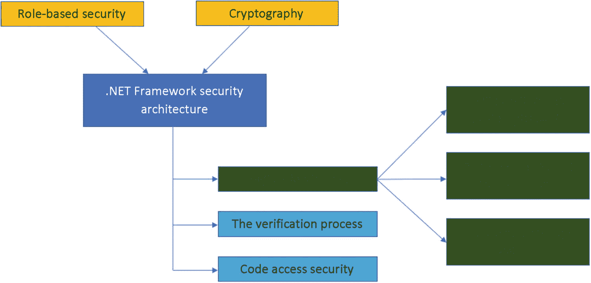

# 八、`Security.Cryptography`命名空间概述

本章简要概述了`System.Security.Cryptography`名称空间的主要类、结构和枚举，包括加密服务、数据的安全编程和解码过程以及许多其他操作，如哈希、随机数生成和消息认证。关于密码服务及其实现的更多细节可以在*章节* [*7*](07.html) *中看到。*

本章的目标是为专业人员提供一个全面的路线图，清晰地概述 the.NET 框架中的加密服务。

## 班级

表 [8-1](#Tab1) 列出了处理加密算法的实现和封装过程的主要类，在下一代密码学(CNG)中。

表 8-1

系统。Security.Cryptography 命名空间

<colgroup><col class="tcol1 align-left"> <col class="tcol2 align-left"></colgroup> 
| 

班级

 | 

描述

 |
| --- | --- |
| `AesCng` | 实现对高级加密(AES)算法的 CNG 支持 |
| `CngAlgorithm` | 封装加密算法的名称 |
| `CngAlgorithmGroup` | 与 cngal 算法相同，但封装是针对一组加密算法完成的 |
| `CngKey` | 定义 CNG 使用的加密密钥的功能 |
| `CngKeyBlobFormat` | 该密钥被声明为 BLOB 格式，用于 CNG 对象。 |
| `CngKeyCreationParameters` | 对有关密钥创建的属性的高级支持 |
| `CngPropertyCollection` | 为与 CNG 属性相关的类型化集合提供强有力的支持 |
| `CngProvider` | 密钥存储提供者(KSP)的名称被封装，以便进一步用于 CNG 对象。 |
| `CngUIPolicy` | 用户界面(UI) CNG 的可选配置参数在访问受保护的密钥时显示。它还为配置提供封装。 |
| `DSACng` | 支持数字签名算法(DSA)的 CNG 实现 |
| `DSAOpenSsl` | 利用 OpenSSL 支持实现 DSA |
| `ECDiffieHellmanCng` | 为椭圆曲线 Diffie-Hellman (ECDH)算法的 CNG 实现提供支持。该类的目的是执行加密操作。 |
| `ECDiffieHellmanCngPublicKey` | 为 ECDH 创建一个公钥，它可以与`ECDiffieHellmanCng`类一起使用 |
| `ECDiffieHellmanOpenSsl` | 为 OpenSSL 支持的椭圆曲线 Diffie-Hellman (ECDH)算法的实现提供支持 |
| `ECDsaCng` | 为 ECDSA 提供 CNG 支持和实施 |
| `ECDsaOpenSsl` | 为基于 OpenSSL 的椭圆曲线数字签名算法(ECDSA)的实现提供支持 |
| `ProtectedData` | 提供加密和解密数据的方法。该类不能被继承。 |
| `RSACng` | 为 RSA 算法提供 CNG 支持和实施 |
| `RSAOpenSsl` | 通过 openssl 支持为 rsa 提供支持和实施 |
| `SafeEvpPKeyHandle` | 代表 OpenSSL 的特殊指针(`EVP_PKEY*`) |
| `TripleDESCng` | 为三重数据加密标准(3DES)算法提供 CNG 支持和实施 |

## 结构

表 [8-2](#Tab2) 显示了处理 CNG 密钥提供者属性封装的最重要的结构之一。

表 8-2

系统中的结构。Security.Cryptography 命名空间

<colgroup><col class="tcol1 align-left"> <col class="tcol2 align-left"></colgroup> 
| 

结构体

 | 

描述

 |
| --- | --- |
| `CngProperty` | 它为 CNG 密钥或提供者的属性提供封装。 |

## 枚举数

 .NET Framework 从 3.5 开始，与加密和安全机制相关，它有一组枚举，为处理策略、密钥创建和加密操作提供了重要的选项。表 [8-3](#Tab3) 提到了可以在`System.Security.Cryptography namespace`中找到的主要重要枚举。

表 8-3

系统中的枚举。Security.Cryptography 命名空间

<colgroup><col class="tcol1 align-left"> <col class="tcol2 align-left"></colgroup> 
| 

列举型别

 | 

描述

 |
| --- | --- |
| `CngExportPolicies` | 加密密钥的密钥导出策略 |
| `CngKeyCreationOptions` | 关键创意的选择 |
| `CngKeyHandleOpenOptions` | 打开钥匙把手的选项 |
| `CngKeyOpenOptions` | 打开钥匙的选项 |
| `CngKeyUsages` | 与其一起使用的 CNG 密钥的加密操作 |
| `CngPropertyOptions` | CNG 关键属性选项 |
| `CngUIProtectionLevels` | 与用户界面及其场景中使用的密钥相关的保护级别 |
| `DataProtectionScope` | 使用`Protect(Byte[], Byte[], DataProtectionScope)`方法获取可应用的数据保护范围 |
| `ECKeyXmlFormat` | 定义并支持椭圆曲线密钥的 XML 序列化格式 |

## 中的安全模型 .NET 框架

图 [8-1](#Fig1) 显示了一个通用的安全模型，该模型提供了基于角色的安全如何在认证过程中发挥重要作用的快速概述。由于安全架构中最重要组件的分布，如*应用域*、*验证流程*和*代码访问安全性*，认证流程扮演着至关重要的角色。


图 8-1

。具有基于角色的安全性的. NET Framework 安全体系结构

看看在实现加密机制的过程中构成安全体系结构的组件，理解每个组件的定义和边界是很重要的。*应用域*提供了一定程度的隔离进程，对于确保应用中运行的代码不受对手影响是必要的。基于这个方面，应用域中的隔离边界为安全性、可靠性和版本控制提供了隔离边界。大多数应用域都是在运行时宿主期间创建的。

在图 [8-2](#Fig2) 中，您可以看到基于角色的安全所关注的主要组件，如*认证、*授权、*主体和身份。*


图 8-2

。具有基于角色的安全性的. NET Framework 安全体系结构

在图 [8-3](#Fig3) 中，*应用域*的组件应该在实现过程中以最大责任来对待。在实现过程中，有一个布尔属性叫做`IsFullyTrusted`。



图 8-3

。具有应用域组件的. NET Framework 安全体系结构

实现第一个组件的目标，*完全信任*和*部分信任*，列表 [8-1](#PC1) 展示了这样一个过程如何在一个真实案例中实现和转置。同样的方法和过程可以用来证明是*异构、同构*还是*应用域沙箱化。*输出见图 [8-4](#Fig4) 。


图 8-4

应用域的输出

```cs
using System;
using System.Collections.Generic;
using System.Linq;
using System.Text;
using System.Threading.Tasks;

namespace FullyOrPartiallyTrustedExample
{
    class Program
    {
        public class InstanceWorker : MarshalByRefObject
        {
            static void Main()
            {
                InstanceWorker iw = new InstanceWorker();
                iw.RunningTestIfItIsFullyTrusted();

                AppDomain adSandbox = GetInternetSandbox();
                iw = (InstanceWorker)
                        adSandbox.CreateInstanceAndUnwrap(
                        typeof(InstanceWorker).Assembly.FullName,
                        typeof(InstanceWorker).FullName);
                iw.RunningTestIfItIsFullyTrusted();
            }

            public void RunningTestIfItIsFullyTrusted()
            {
                AppDomain app_domain = AppDomain.CurrentDomain;
                Console.WriteLine("\r\nApplication domain '{0}': IsFullyTrusted = {1}", app_domain.FriendlyName, app_domain.IsFullyTrusted);

                Console.WriteLine("IsFullyTrusted = {0} for the current assembly", typeof(InstanceWorker).Assembly.IsFullyTrusted);

                Console.WriteLine("IsFullyTrusted = {0} for mscorlib", typeof(int).Assembly.IsFullyTrusted);
            }

            static AppDomain GetInternetSandbox()
            {
                System.Security.Policy.Evidence theEvidenceOfHost = new System.Security.Policy.Evidence();

                theEvidenceOfHost.AddHostEvidence(new System.Security.Policy.Zone(System.Security.SecurityZone.Internet));

                System.Security.PermissionSet thePermissionSet = System.Security.SecurityManager.GetStandardSandbox(theEvidenceOfHost);

                AppDomainSetup appDomainSetup = new AppDomainSetup
                {
                    ApplicationBase = System.IO.Directory.GetCurrentDirectory()
                };

                return AppDomain.CreateDomain("Sandbox", theEvidenceOfHost, appDomainSetup, thePermissionSet, null);
            }
        }
    }
}

Listing 8-1Fully Trusted or Partially Trusted Example

```

在图 [8-5](#Fig5) 中，您可以看到哪些组件和模块涉及验证过程。你可以看到验证过程看起来像一个步骤的集合， *C# 编译，JIT 编译，原生映像生成器*和 *PEVerify 工具。*在接下来的章节中，我们将分析上面列出的最重要的组件。


图 8-5

 .NET 框架安全体系结构与验证过程组件

*JIT 编译*(见图 [8-6](#Fig6) )是一个复杂的过程，其中的关键点可以被用来访问应用的不同部分。JIT 编译的目标是加速代码的执行，并为多个平台提供支持。这种支持是棘手的，因为它会暴露和破坏系统的安全。


图 8-6

JIT 编译过程

许多安全专家和专业人员认为这是确保应用安全性的过程中的一个缺口，因为攻击者可以利用多个点，例如使用适当的工具来反汇编`.exe`或`.dll`文件，并继续进行软件混淆攻击。

一旦 JIT 过程完成，我们可以进一步移动到*本地生成器映像(NGEN)* *。* NGEN 是提高托管应用性能的强大工具。NGEN(可以通过`Ngen.exe,`找到)创建(编译)本机映像(例如，ISO 文件)，其中包含以特定于处理器的方式编译为机器代码的文件，并将它们部署在最终用户本地计算机的本机映像缓存中。这是一个危险的点，因为我们永远不知道谁和什么用户会在他们的计算机上，如果一个恶意用户正在等待适当的时机来利用，以找到他们的漏洞点。

最后一步是基于 PE 验证工具或`Peverify.exe. It's a`非常有用的工具，它为正在生成微软中间语言(MSIL)的开发人员(如编译器编写者)提供了大量的帮助，目的是确定他们的 MSIL 代码是否符合安全要求。

图 [8-7](#Fig7) 显示我们在的最后一个组件上 .NET 框架安全架构，名为*代码访问安全。*它的所有组件都很重要，每个专业开发人员都应该将它们纳入开发过程中的应用以及安全分析和设计中。


图 8-7

那个 .NET 框架安全体系结构与代码访问安全组件

*策略* *、* *权限* *、*和*实施*应该被视为一个整体单元，作为运行在同一应用中的不同代码上的每个信任级别的“心脏”。

熟悉以下代码访问安全概念和机制将为专业人员提供关于代码访问安全(CAS)内部机制的深厚知识背景。也就是说，为了编写以公共语言运行时为目标的有效应用，我们有以下几点:

*   类型安全代码:一种特殊类型的代码，只访问那些定义明确的类型

*   **命令式和声明式语法**:面向公共语言运行时的代码能够与安全系统进行交互。交互是请求权限并覆盖某些安全设置。

*   安全类库(Secure class libraries):类库有安全需求的用法，它们的主要目标是确保那些使用和调用类库的人有适当的权限访问类库及其资源。

*   **透明码**:带 .NET Framework 4 专业人员有能力确定代码是否能够以安全透明的方式运行。此外，确定权限是需要通过确定透明许可来完成的任务之一。

### 声明性安全

声明性安全所使用的语法基于用于在专业开发人员编写的代码的元数据中插入安全信息的属性。

要使用声明性安全调用，第一步是初始化权限对象中的数据状态。清单 8-2 展示了一个声明性语法的例子。这个例子很有启发性，如果你有一个名为`UserPermission.`的许可，你可以提供代码调用者

```cs
using System.Security.Permissions;
[UserPermission(SecurityAction.Demand, Unrestricted = true)]
public class Example
{
   public Example()
   {
      //** is beging protected by the security call
   }

   public void SomeMethodForUserA()
   {
      //** is beging protected by the security call
   }

   public void SomeOtherMethodForUserB()
   {
      //** is beging protected by the security call
   }
}

Listing 8-2Example of Declarative Security

```

`SecurityAction.Demand`指定调用程序需要运行代码的权限。

### 必要的安全

命令式安全性提供的语法调用安全性调用来创建持有权限的对象的新实例。强制安全性可用于调用要求和重写。不要做任何请求，这一点非常重要。这在绝对安全的情况下是不可能实现的。

清单 [8-3](#PC3) 展示了命令式语法如何请求代码的调用者拥有某个名为`UserPermission`的权限。

```cs
public class Example
{
   public Example()
   {
       //** the constructor of the class
   }

   public void SomeMethodForUserA()
   {
       //** UserPermission has been demanded
       //** to use imperative syntax.
       UserPermission user_permission = new UserPermission();
       user_permission.Demand();
       //** here is being protected by the security call
   }

   public void SomeOtherMethodForUserB()
   {
      //** is not being protected by the security call
   }
}

Listing 8-3Example of Imperative Security

```

## 结论

在这一章中，我们讨论了`System.Security.Cryptography`名称空间，并通过指出它们的主要名称给出了它的类、结构和枚举的概述。我们继续我们的旅程，解释为什么专业人士应该根据 .NET Framework 安全模型，尊重它们的组件并遵循工作流作为必要的准则。

在本章结束时，您将拥有

*   `System.Security.Cryptography`名称空间的概貌

*   理解类、结构和枚举的主要名称

*   了解内部安全模型的要点。这可能会导致安全灾难

*   主要组件如何工作和通信的清晰图像，例如应用域、验证过程和代码访问安全性

*   对 JIT 编译及其过程的深入理解

*   了解验证过程如何暴露安全漏洞

*   了解如何、何时以及为什么使用声明性和命令性安全性，并概述它们在实现过程中的重要性

## 文献学

1.  讽刺瓦斯卡兰。交互式 C#:基础、核心概念和模式。Apress，2018。

2.  安德鲁·特罗尔森和菲利普·贾皮克塞。Pro C# 7 与 .NET 和。网芯。Apress，2017。

3.  乔希·比平。*从 C# 开始 XML 7:面向 C# 开发人员的 XML 处理和数据访问*。Apress，2017。