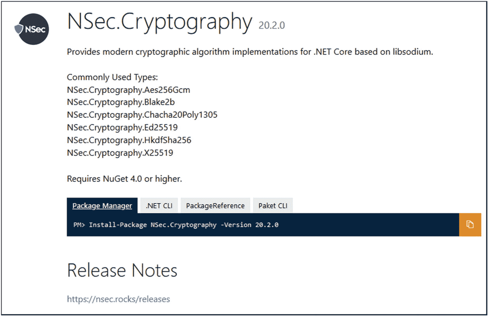

# 九、C# 和 .NET

在这一章中，我们将介绍一些可以在中使用的最重要的加密库 .NET 和 C# 应用。选择一个加密库，尤其是开源的加密库，与 .NET 框架本身。你需要确定你在做什么，并且知道你在使用什么样的数据。如果开源项目中存在可被攻击者利用的漏洞，那么在安全方面依赖开源项目可能会导致重大的安全事故。

在接下来的章节中，我们将介绍这些库:NSec [ [1](#Par107) ]、弹力城堡[ [2](#Par108) ]、地狱[ [3](#Par109) ]和 SecureBlackbox [ [4](#Par110) 。

## 毫微秒或纳秒(nanosecond 或 nanoseconds)

NSec [ [1](#Par107) ]是最现代、最易于使用的加密库之一 .NET 核心。该库基于 lib 钠[ [5](#Par111) ]。

NSec 的一些特点如下:

*   **现代方法**。libna 提供了一小组加密算法和原语。与其他库相比，NSec 和 lib 钠的优点是支持 X25519、Ed25519 和 ChaCha-Poly1305 等特性。NSec 内的性能和功能实现方式基于现代。基于类型`Span<T>`和`ReadOnlySpan<T>.`开发的. NET API

*   **极其好用**。这是非常有用和易于使用的。NSec 的优雅和可靠性意味着它易于实施。它提供了对类型数据模型的支持，这种模型是基于专用类而不是空字节数组来设计的，考虑到了键和共享秘密。这有助于开发人员避免在错误的算法中使用密钥。

*   **安全**。NSec 的任务是使密码原语尽可能简单。

*   **快**。NSec 和 libna 在加密过程中速度非常快。堆没有分配内存。NSec 旨在避免任何类型的内存分配或无用的副本。

*   **敏捷**。NSec 中实现的大多数算法都是从一小组基类中派生出来的。目的是提供一种针对算法接口而不是特定算法编写代码的高效方法。

在下面的例子中，您将看到 NSec 是如何工作的，以及它是多么容易使用。NSec 成功地使用了 C# 8.0 的一些特性，它们非常容易识别和理解。

清单 [9-1](#PC1) 展示了如何使用 Ed25519 签名算法和签名消息。图 [9-1](#Fig1) 显示了输出。


图 9-1

NSec 输出

```cs
using System;
using System.Collections.Generic;
using System.Linq;
using System.Text;
using System.Threading.Tasks;
using NSec.Cryptography;

namespace NSecLibrary
{
    class Program
    {
        static void Main(string[] args)
        {
            Console.WriteLine("NSec Library");

            //** select the Ed25519 signature algorithm
            var algorithm = SignatureAlgorithm.Ed25519;

            //** create a new key pair
            var key = Key.Create(algorithm);

            //** generate some data to be signed
            var data = Encoding.UTF8.GetBytes("Use the Force, Luke!");

            //** sign the data using the private key
            var signature = algorithm.Sign(key, data);

            //** verify the data using the signature and the public key
            if (algorithm.Verify(key.PublicKey, data, signature))
            {
                Console.WriteLine("The message ");

                for (int i = 0; i < data.Length; i++)
                {
                    Console.Write(data[i].ToString() + " ");
                }

                Console.WriteLine("\n has been verified with success.");
            }
            else

            {
                Console.WriteLine("The message: {0} has not been verified.", data.ToString());
            }
        }
    }
}

Listing 9–1Ed25519 Signature

```

### NSec 安装

可以使用 NuGet 包[ [6](#Par112) ]找到并安装 NSec，它包含安装过程所需的所有细节(见图 [9-2](#Fig2) )。



图 9-2

NSec。加密 NuGet 包

还可以通过以下不同方式将 NSec 添加到项目中:

*   使用**点网命令行界面**:

*   使用 **Visual Studio** :

```cs
$ dotnet add package NSec.Cryptography –-version XX.X.X

```

*   使用 ***中的引用。csproj 文件**:

```cs
PM> Install-Package NSec.Cryptography -Version XX.X.X

```

```cs
<PackageReference Include="NSec.Cryptography" Version="XX.X.X"/>

```

## 大型充气城堡型玩具

充气城堡是最重要和最著名的图书馆之一。它包含加密算法和协议的 C# 实现。

它有很多有用的特性。最重要的特性列表如下所示:

*   “支持解析和生成 PKCS-12 文件” [7](#Par113) 。

*   **"X.509** :支持 V1 和 V3 证书(生成和解析)。此外，V2 CRL 和证书基于属性“ [7](#Par113) ”。

*   **“性能支持的 PBE 算法**”[[7](#Par113)。

*   **“签名者支持的签名算法**”[[7](#Par113)。

*   **“对称密钥算法** : AES，Blowfish，Camellia，CAST5，CAST6，ChaCha，DES，DESede，GOST28147，HC-128，HC-256，IDEA，ISAAC，Noekeon，RC2，RC4，RC5-32，RC5-64，RC6，Rijndael，Salsa20，SEED，Serpent，Skipjack，TEA/XTEA，Threefish，Tnepres，Twofish，VMPC 和 xsalsa 20”[7](#Par113)

*   **“对称密钥模式** : CBC、CFB、CTS、GOFB、OFB、OpenPGPCFB、SIC(或 CTR)”[[7](#Par113)。

*   **“对称密钥填充**:PKCS ISO10126d2、ISO7816d4-5/7、TBC、X.923、零字节” [7](#Par113) 。

*   **“非对称密钥算法** : ElGamal，DSA，ECDSA，NaccacheStern，RSA(带盲)”[ [7](#Par113) 。

*   **“非对称密钥填充/编码**s:OAEP、PKCS 和 ISO9796d1-1”[7](#Par113)。

*   **“AEAD 分组密码模式** : CCM、EAX、GCM、OCB”[7](#Par113)。

*   **“摘要** : GOST3411，Keccak，MD2，MD4，MD5，RIPEMD128，RIPEMD160，RIPEMD256，RIPEMD320，SHA-1，SHA-224，SHA-256，SHA-384，SHA-512，SHA3，老虎，漩涡” [7](#Par113) 。

*   **" XOFs**:SHAKE "[7](#Par113)。

*   **“签名人机制** : DSA，ECDSA，ECGOST3410，ECNR，GOST3410，ISO9796d2，PSS，RSA，x 9.31-1998”[7](#Par113)。

*   **“密钥协议**:迪菲-海尔曼，EC-DH，EC-MQV，J-帕克，SRP-6a”[7](#Par113)。

*   **MAC**:cbcbl lock cipher、CFBBlockCipher、CMAC、GMAC、GOST28147、HMac、ISO9797 Alg。3、聚 1305、SipHash、SkeinMac、vmpcm AC "[[7](#Par113)。

*   **“PBE 发电机** : PKCS-12，PKCS-5——方案一和方案二” [7](#Par113) 。

*   open PGP(RFC 4880)[[7]t1。](#Par113)

*   “加密消息语法(CMS，RFC 3852)，包括流式 API”[7](#Par113)。

*   “在线证书状态协议(OCSP，RFC 2560)”[[7](#Par113)。

*   “时间戳协议(TSP，RFC 3161)”[[7](#Par113)。

*   “TLS/DTLS 客户端/服务器版本 1.2，支持最常用的密码套件和扩展，以及许多不常用的密码套件和扩展。可用的非阻塞 API "[7](#Par113)。

*   **椭圆曲线密码**。

### 充气城堡示例

清单 [9-2](#PC5) 展示了一个使用 Bouncy Castle 生成密钥的例子。在图 [9-3](#Fig3) 中，您可以看到密钥大小设置为 256 的输出。


图 9-3

使用 BouncyCastle 生成加密密钥

```cs
using System;
using System.Collections.Generic;
using System.IO;
using System.Linq;
using System.Text;
using System.Threading.Tasks;
using Org.BouncyCastle.Crypto;
using Org.BouncyCastle.Crypto.Generators;
using Org.BouncyCastle.Crypto.Parameters;
using Org.BouncyCastle.OpenSsl;
using Org.BouncyCastle.Security;

namespace BouncyCastleLibrary
{
    class Program
    {
        public static string Xvalue;
        public static string Yvalue;
        public static int Dvalue;

        static void Main(string[] args)
        {
            Console.WriteLine("Using BouncyCastle Library to show how we can generate cryptography keys (private and public).\n");
            Console.WriteLine("Please, choose the size of the keys (128 or 256)");
            int key_size = Convert.ToInt32(Console.ReadLine());

            if (key_size == 128)
                KeyGeneration(128);
            else if (key_size == 256)
                KeyGeneration(256);
        }

        public static AsymmetricCipherKeyPair GenerateKeys(int keySize)
        {
            //** choosing ECDSA for key generation
            var key_generation = new ECKeyPairGenerator("ECDSA");

            //** for creating randomly values
            var randomly_secure_value = new SecureRandom();

            //** generating the parameters based on the random value and size of the key
            var key_generation_parameters = new KeyGenerationParameters(randomly_secure_value, keySize);

            //** proceed with the initialization of the generation algorithm with parameters
            key_generation.Init(key_generation_parameters);

            //** the key pair generation
            return key_generation.GenerateKeyPair();
        }

        public static void KeyGeneration(int key_size)

        {
            //** generating process
            var key_pair = GenerateKeys(key_size);
            TextWriter text_writer = new StringWriter();
            PemWriter pem_writer = new PemWriter(text_writer);

            pem_writer.WriteObject(key_pair.Private);
            pem_writer.Writer.Flush();

            string privateKey = text_writer.ToString();
            Console.WriteLine("The private key is: {0}", privateKey);

            ECPrivateKeyParameters privateKeyParam = (ECPrivateKeyParameters)key_pair.Private;
            Console.WriteLine("D value is: {0}", privateKeyParam.D.ToString());
            text_writer = new StringWriter();
            pem_writer = new PemWriter(text_writer);
            pem_writer.WriteObject(key_pair.Public);
            pem_writer.Writer.Flush();

            ECPublicKeyParameters publicKeyParam = (ECPublicKeyParameters)key_pair.Public;
            string publickey = text_writer.ToString();
            Console.WriteLine("The public key is: {0}", publickey);
            Console.ReadKey();

            Xvalue = publicKeyParam.Q.XCoord.ToBigInteger().ToString();
            Yvalue = publicKeyParam.Q.YCoord.ToBigInteger().ToString();
        }
    }
}

Listing 9-2AES – Encryption with CBC Mode and PKCS5/7 Padding

```

接下来的三个例子(见清单 [9-3](#PC6) 、清单 [9-4](#PC7) 和清单 [9-5](#PC8) )展示了如何处理密钥协商和交换算法。

如果您正在处理一个基本协议(参见清单 [9-3](#PC6) )，该协议使用了一个具有约定值的余因子，下面的例子应该很能说明问题。

```cs
public byte[] AgreementOnAgreedValue
                      (AsymmetricECPrivateKey privateKey,
                      AsymmetricECPublicKey otherEncKey)
{
      IAgreementCalculatorService createService =
            CryptoServicesRegistrar.CreateService(privateKey);

      IAgreementCalculator<FipsEC.AgreementParameters>
          contract_agreement =
          createService.CreateAgreementCalculator(FipsEC.Cdh);

      return contract_agreement.Calculate(otherEncKey);
}

Listing 9-3Basic Agreement with an Agreed Value

```

在清单 [9-4](#PC7) 中，您可以看到如何使用 SHA256 函数和 PRF(伪随机函数)函数来计算商定的值。

```cs
public byte[] AgreementOnAgreedValueWithPrf
              (AsymmetricECPrivateKey privateKey,
               AsymmetricECPublicKey otherEncKey,
               byte[] paddingSalt)
{
       IAgreementCalculatorService createService =
            CryptoServicesRegistrar.CreateService(privateKey);

       IAgreementCalculator<FipsEC.AgreementParameters>
            contract_agreement = dhFact.CreateAgreementCalculator
            (FipsEC.Cdh.WithKeyMaterialGenerator
            (new FipsPrfKmg
                         (FipsPrfAlgorithm.Sha256HMac,
     paddingSalt));

      return contract_agreement.Calculate(otherEncKey);
}

Listing 9-4Agreement Using PRF

```

清单 [9-5](#PC8) 显示了与 X9.63 KDF(密钥派生函数)的另一种协议。

```cs
public byte[] AgreementWithCofactorAndKdf
      (AsymmetricECPrivateKey privateKey,
       AsymmetricECPublicKey otherEncKey,
       byte[] paddingSalt)
{
     IAgreementCalculatorService createService =
           CryptoServicesRegistrar.CreateService(privateKey);

     IAgreementCalculator<FipsEC.AgreementParameters>
         contract_agreement =
              dhFact.CreateAgreementCalculator
              (FipsEC.Cdh.WithKeyMaterialGenerator
              (new FipsKdfKmg(FipsKdf.X963,
                     paddingSalt, 32));

     return agreement.Calculate(otherEncKey);
}

Listing 9-5Working with an Agreement Based on X9.63 KDF

```

### 充气城堡装置

充气城堡可以使用 NuGet 包[ [8](#Par114) ]找到并安装，它包含了安装过程所需的所有细节(见图 [9-4](#Fig4) )。


图 9-4

充气城堡 NuGet 套餐

弹力城堡也可以通过以下方式添加到项目中:

*   使用**点网命令行界面**:

*   使用 **Visual Studio** :

```cs
$ dotnet add package BouncyCastle –-version XX.X.X

```

*   使用 ***中的引用。csproj 文件**:

```cs
PM> Install-Package BouncyCastle -Version XX.X.X

```

```cs
<PackageReference Include="BouncyCastle" Version="XX.X.X"/>

```

## 地狱

Inferno 是另一个有趣的加密库 .NET 使用 C# 开发。它在编写代码时提供了一种独特的优雅，在处理代码时获得的性能非常有前途。

以下列表代表了 Inferno 的特性[ [9](#Par115) :

*   "[random]: CryptoRandom( .NET Random done right)" [ [9](#Par115)

*   "[密码]:仅 AES-256(快速、恒定时间、抗旁路 AES-NI)" [ [9](#Par115) ]

*   "[高级]: AEAD (AES-CTR-HMAC)。流式 AEAD (EtM 转换)"[ [9](#Par115)

*   "[ciphers-misc]: AES-CTR 实现(密码转换)"[ [9](#Par115) ]

*   "[ciphers-misc]:AEAD(AES-CBC-HMAC)"[[9](#Par115)]

*   "[哈希]: SHA2 哈希工厂(256，384，512)。推荐 SHA-384(默认)"[ [9](#Par115) ]

*   "[hash]: SHA1 哈希工厂(主要用于遗留集成)"[ [9](#Par115) ]

*   “[mac]: HMAC2( .NET HMAC 做得对)[ [9](#Par115)

*   "[mac]: HMAC-SHA1，HMAC-SHA2 工厂"[9](#Par115)

*   “[kdf]: HKDF，PBKDF2，SP800_108_Ctr。支持任何 HMAC 工厂" [9](#Par115)

*   [OTP]:totp[9](#Par115)

*   "[助手]" [ [9](#Par115) ]
    *   “常量时间字节和字符串比较”[9](#Par115)

    *   “安全的 UTF8”[9](#Par115)

    *   “快速 64 位字节数组异或”[9](#Par115)

### 地狱的例子

以下示例展示了如何使用该库的案例研究。在清单 [9-6](#PC12) 中，您可以看到处理加密、解密和认证的函数的基本声明。注意函数的灵活性和提示性声明。

```cs
//** The namespace that has to be used when working with
//** Inferno is: SecurityDrive.Inferno
//** If SecurityDrive.Inferno is not visible it means that is
//** not properly installed and it is necessary to check the
//** section "Inferno Installation"

public static class BasicOperations
{
    public static byte[] Encrypt(byte[] master_crypto_key,
         ArraySegment<byte> clearText,
         ArraySegment<byte>? saltPadding = null);

    public static byte[] Decrypt(byte[] master_crypto_key,
         ArraySegment<byte> cryptotext,
         ArraySegment<byte>? saltPadding = null);

    public static bool Authenticate(byte[] master_crypto_key,
         ArraySegment<byte> cryptotext,
         ArraySegment<byte>? saltPadding = null);
}

Listing 9-6Encryption, Decryption, and Authentication Functions

```

使用散列函数(见清单 [9-7](#PC13) )非常有趣和简单。一旦你到达流程和应用的末尾，调用`dispose`是非常重要的。

```cs
public static Func<SHA384> HashFactory

Listing 9-7Working with Hash

```

清单 [9-8](#PC14) 展示了如何使用 HMAC。

```cs
var dataForHmac = Utils.SafeUTF8.GetBytes("Welcome To Apress!");

//** this is for HMACSHA384
using (var theHmac = SuiteB.HmacFactory())
{
      theHmac.Key = new byte[] { 6, 5, 4, 3, 2 };
      theHmac.ComputeHash(dataForHmac).ToBase16().Dump();
}

Listing 9-8Using HMAC

```

清单 [9-9](#PC15) 显示了 DSA(数字签名算法)的使用情况。图 [9-5](#Fig5) 显示了输出。


图 9-5

输出

```cs
using SecurityDriven.Inferno.Extensions;
using System;
using System.Collections.Generic;
using System.Linq;
using System.Security.Cryptography;
using System.Text;
using System.Threading.Tasks;

namespace InfernoLibrary
{
    class Program
    {
        static void Main(string[] args)
        {
            //** generate the DSA keys
            CngKey thePrivateKey = CngKeyExtensions.CreateNewDsaKey();

            //** generate the cryptographic keys
            //** that will be used with DSA
            byte[] dsa_private_key_blob = thePrivateKey.GetPrivateBlob();

            //** convert and store private key as bytes
            byte[] dsa_public_key_blob = thePrivateKey.GetPublicBlob();

            //** convert and store public key as bytes
            CngKey dsa_public_key = dsa_public_key_blob.ToPublicKeyFromBlob();

            //** some data (sample)
            byte[] data_sample = Guid.NewGuid().ToByteArray();
            byte[] theSignature = null;

            //** using the private key, generate the
            //** DSA signature and store it properly
            using (var ecdsaAlgorithm = new ECDsaCng(thePrivateKey) { HashAlgorithm = CngAlgorithm.Sha384 })
            {
                theSignature = ecdsaAlgorithm.SignData(data_sample);
            }

            //** play with the data
            data_sample[5] ^= 1;

            Console.WriteLine("Private key is: {0}", BitConverter.ToString(dsa_private_key_blob));
            Console.WriteLine("\nPublic key is: {0}", BitConverter.ToString(dsa_public_key_blob));
            Console.WriteLine("\nSample data: {0}", BitConverter.ToString(data_sample));
            Console.WriteLine("\nThe signature is: {0}", BitConverter.ToString(theSignature));

            //** using the public key, verify the DSA signature
            using (var ecdsaAlgorithm = new ECDsaCng(dsa_public_key){ HashAlgorithm = CngAlgorithm.Sha384})
            {
                if (ecdsaAlgorithm.VerifyData(data_sample, theSignature))
                {
                    Console.WriteLine("\nOups! Something went wrong. Signature was unable to be verified properly.");
                }
                else
                {
                    Console.WriteLine("\nThe signature has been verified with success.");
                }

                Console.ReadKey();
            }
        }
    }
}

Listing 9-9Dealing with a DSA

```

### 地狱装置

使用 NuGet 包[ [10](#Par116) ]可以找到并安装 Inferno，它包含了安装过程所需的所有细节(参见图 [9-6](#Fig6) )。


图 9-6

Inferno NuGet 包

Inferno 也可以通过以下方式添加到项目中:

*   使用**点网命令行界面**:

*   使用 **Visual Studio** :

```cs
$ dotnet add package Inferno –-version XX.X.X

```

*   使用 ***中的引用。csproj 文件**:

```cs
PM> Install-Package Inferno -Version XX.X.X

```

```cs
<PackageReference Include="Inferno" Version="XX.X.X"/>

```

## 安全黑盒

SecureBlackbox 是处理数字安全和网络安全的最全面的工具和类集之一。

开发安全解决方案的方式与 NSec 或 Inferno 相同。方法和功能类似于 NSec 和 Inferno 的方法和功能。差异非常小，并且是特定于缓冲区数组的分配。

图书馆不是免费的。要运行清单 [9-10](#PC19) 中的示例，您需要一个许可证。一旦运行该应用，将显示来自图 [9-7](#Fig7) 的消息。


图 9-7

运行该示例所需的许可证

出于测试目的，对于清单 [9-10](#PC19) 中的示例，可以联系库的所有者，他们会向您提供一个临时许可证密钥。

一旦收到许可证(通常是一个文本文件，如`LicenseKey.txt`)，就可以调用两个函数，并将许可证作为它们的关键参数。这两个功能是`void SetLicenseKey(ByteArray key)`和`void SetLicenseKey(string key).`

如果您同时需要更多的密钥许可，只需使用不同的文件名多次调用该函数。每个许可证应该有不同的名称。

```cs
using SBSymmetricCrypto;
using System;
using System.Collections.Generic;
using System.Linq;
using System.Security.Cryptography;
using System.Text;
using System.Threading.Tasks;

namespace SecureBlackBoxLibrary
{
    class Program
    {
        static void Main(string[] args)
        {
            var key = "b14ca5898a4e4133bbce2ea2315a1916";
            byte[] encryptionKeyBuffer;
            byte[] initializationBuffer = new byte[16];

            using (Aes aes = Aes.Create())
            {
                aes.Key = Encoding.UTF8.GetBytes(key);
                aes.IV = initializationBuffer;

                encryptionKeyBuffer = aes.Key;
                initializationBuffer = aes.IV;
            }

            //** create a crypto factory instances
            //** used for symmetric encryption
            TElSymmetricCryptoFactory symmetric_factory_container = new TElSymmetricCryptoFactory();

            //** use the factory container to
            //** declare an appropriate algorithm
            TElSymmetricCrypto symmetric_encryption = symmetric_factory_container.CreateInstance (SBConstants.Unit.SB_ALGORITHM_CNT_AES256, TSBSymmetricCryptoMode.cmDefault);

            //** declare a key and assign the proper
            //** value for the secret key and the initialization vector
            TElSymmetricKeyMaterial km = new TElSymmetricKeyMaterial(null);
            km.Key = encryptionKeyBuffer;
            km.IV = initializationBuffer;

            //** assign the key container to the cryptographic
            //** object using the property KeyMaterial
            symmetric_encryption.KeyMaterial = km;

            //** proceed further with the encryption
            byte[] input_buffer = Encoding.UTF8.GetBytes("Welcome to Apress!");

            //** declare the output_buffer and output_size and initialize //** them with 0\. In this way we will point out that the first //** invoked is getting the call.
            byte[] output_buffer = null;
            int output_size = 0;

            //** Finding out about the output
            //** length - this may be approximate
            symmetric_encryption.Encrypt(input_buffer, 0, input_buffer.Length, ref output_buffer, 0, ref output_size);

            //** create an allocation as an array for the output data
            output_buffer = new byte[output_size];

            //** do the encryption
            symmetric_encryption.Encrypt(input_buffer, 0, input_buffer.Length, ref output_buffer, 0, ref output_size);

            //**copy the data that has been encrypted to a dedicate buffer
            output_buffer = SBUtils.Unit.CloneArray(output_buffer, 0, output_size);

            //** before continue with the encryption
            //** invoke InitializeEncryption method
            //** within the cryptographic object
            symmetric_encryption.InitializeEncryption();

            //** as much as it is required, pass the data as necessary
            //** using invokations of EncryptUpdate()
            symmetric_encryption.EncryptUpdate(input_buffer, 0, input_buffer.Length, ref output_buffer, 0,ref output_size);
            output_buffer = SBUtils.Unit.CloneArray(output_buffer, 0, output_size);

            //** Once we reach at the end of EncryptUpdate(),
            //** we need to endup the encryption
            //** by invoking FinalizeEncryption() method
            symmetric_encryption.FinalizeEncryption(ref output_buffer, 0, ref output_size);
            output_buffer = SBUtils.Unit.CloneArray(output_buffer, 0, output_size);

            Console.WriteLine("The encryption key is: {0}", key);

            Console.WriteLine("\nThe buffer for encryption key is: {0}", BitConverter.ToString(encryptionKeyBuffer));
            Console.WriteLine("\nThe initialization buffer is: {0}", BitConverter.ToString(initializationBuffer));
            Console.WriteLine("\nThe encryption is: {0}", symmetric_encryption.ToString());
            Console.ReadKey();
        }
    }
}

Listing 9-10Example of Symmetric Encryption with SecureBlackbox

```

### SecureBlackbox 安装

可以使用 NuGet 包[ [10](#Par116) ]找到并安装 SecureBlackbox，它包含安装过程所需的所有细节(参见图 [9-8](#Fig8) )。


图 9-8

SecureBlackbox NuGet 包

还可以通过以下方式将 SecureBlackbox 添加到项目中:

*   使用**点网命令行界面**:

*   使用 **Visual Studio** :

```cs
$ dotnet add package SecureBlackbox –-version XX.X.X

```

*   使用 ***中的引用。csproj 文件**:

```cs
PM> Install-Package SecureBlackbox -Version XX.X.X

```

```cs
<PackageReference Include=" SecureBlackbox" Version="XX.X.X"/>

```

## 结论

在本章中，我们介绍了最重要的加密库(NSec、Bouncy Castle、Inferno 和 SecureBlackbox ),它们可以作为指南、额外的库和工具，用于在专业人员开发的应用中实现数据的机密性、完整性和真实性。用于选择这些库的标准是它们被该领域的其他专业人员认可以及 FIPS 和 NIST 标准。

这些库可以与`System.Security.Cryptography`名称空间并行使用，提供了更全面的加密原语。

## 文献学

1.  NSec。在线可用: [`https://nsec.rocks/`](https://nsec.rocks/) `.`

2.  充气城堡。在线可用: [`https://cryptobook.nakov.com/crypto-libraries-for-developers/c-crypto-libraries`](https://cryptobook.nakov.com/crypto-libraries-for-developers/c-crypto-libraries) `.`

3.  地狱。网上有: [`https://nugetmusthaves.com/Package/Inferno`](https://nugetmusthaves.com/Package/Inferno) 。

4.  SecureBlackbox。在线可用: [`https://nugetmusthaves.com/Package/SecureBlackbox`](https://nugetmusthaves.com/Package/SecureBlackbox) `.`

5.  libna for . net .在线可用: [`https://nugetmusthaves.com/Package/libsodium-net`](https://nugetmusthaves.com/Package/libsodium-net) `.`

6.  NSec.Cryptography .可在线获得: [`www.nuget.org/packages/NSec.Cryptography/20.2.0`](http://www.nuget.org/packages/NSec.Cryptography/20.2.0) `.`

7.  充气城堡特色。网上有: [`www.bouncycastle.org/csharp/index.html`](http://www.bouncycastle.org/csharp/index.html) 。

8.  充气城堡 NuGet 套餐。网上有: [`www.nuget.org/packages/BouncyCastle/`](http://www.nuget.org/packages/BouncyCastle/) 。

9.  地狱的特点和项目。网上有: [`https://securitydriven.net/inferno/`](https://securitydriven.net/inferno/) 。

10.  地狱 NuGet 包。网上有: [`www.nuget.org/packages/Inferno/`](http://www.nuget.org/packages/Inferno/) 。

11.  SecureBlackbox NuGet 包。网上有: [`www.nuget.org/packages/SecureBlackbox/`](http://www.nuget.org/packages/SecureBlackbox/) 。