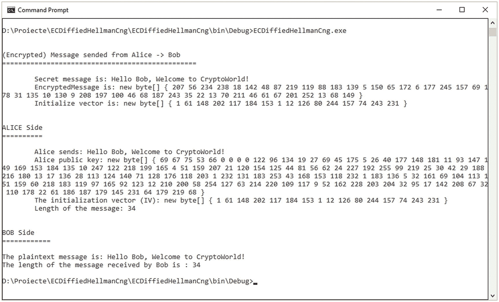
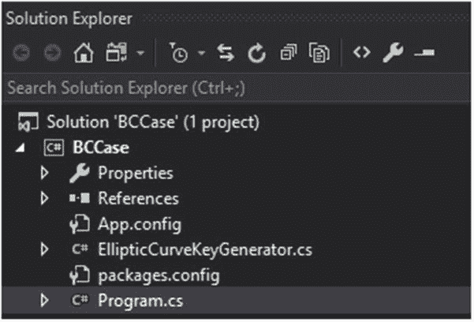
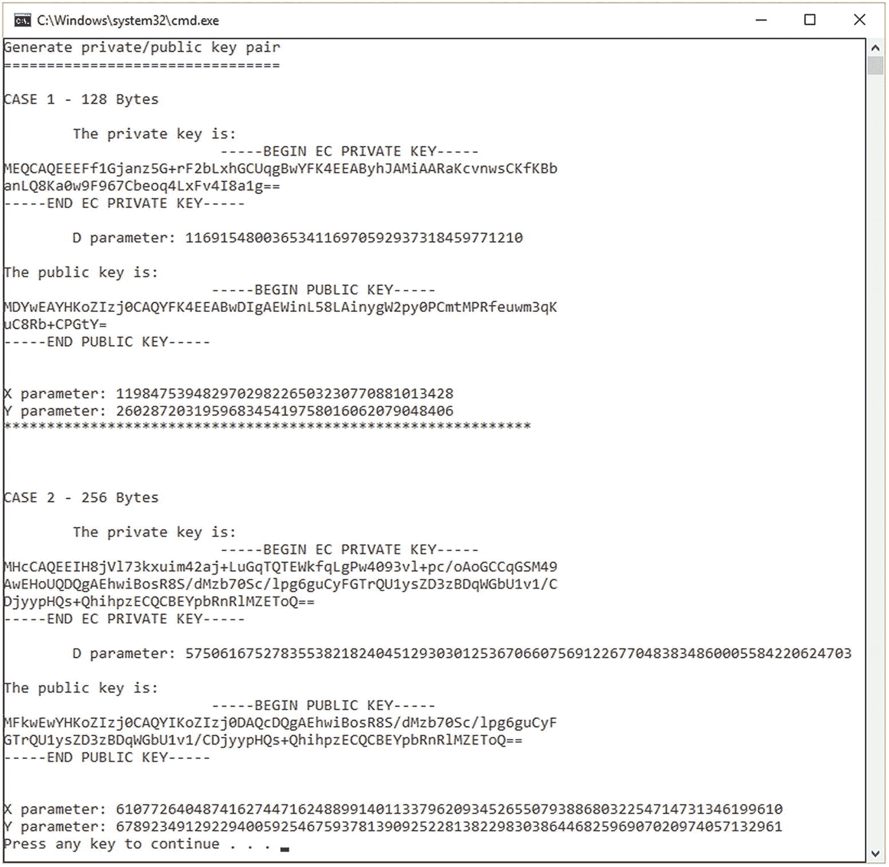
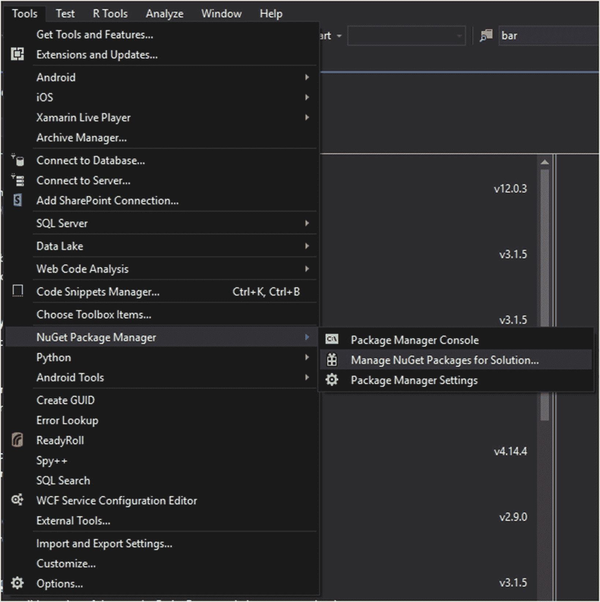
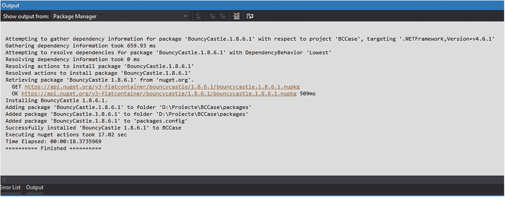
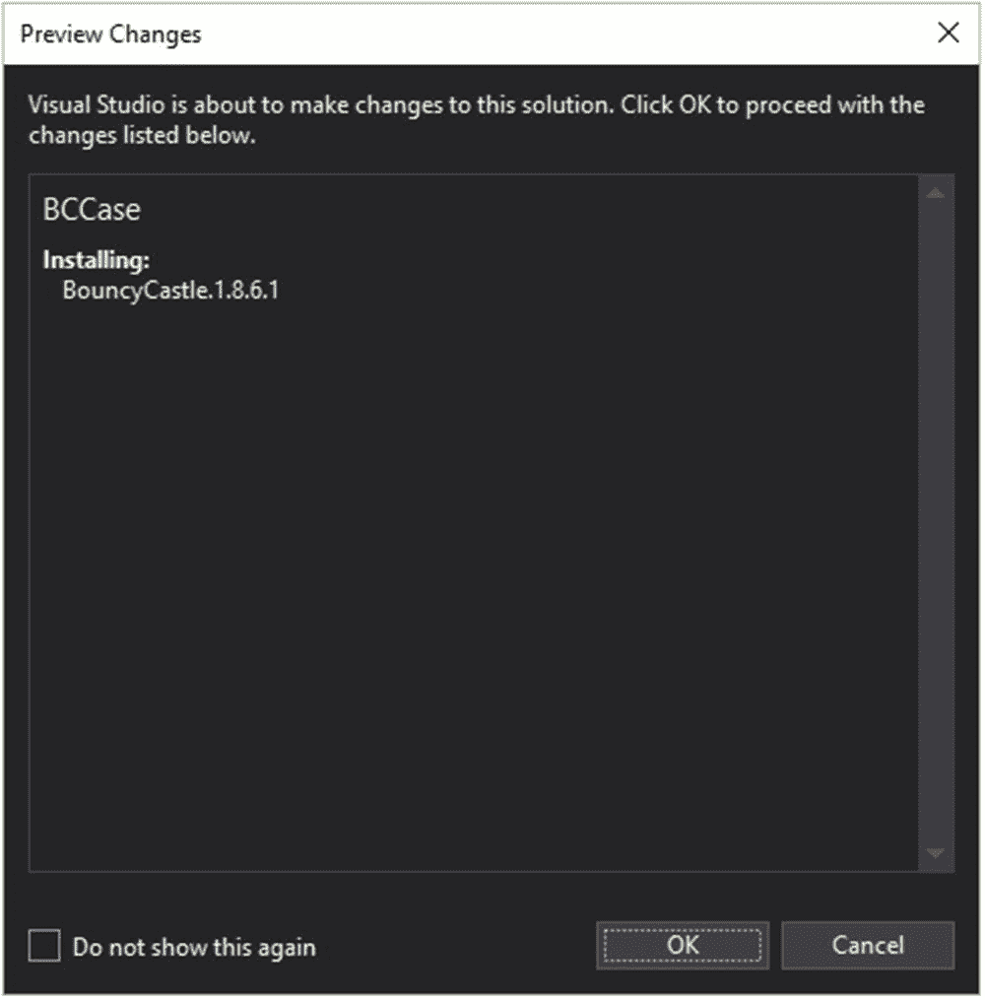

# 十、椭圆曲线密码术

椭圆曲线加密(ECC)是一种基于有限域上椭圆曲线的代数结构的公钥加密方法。ECC 可用于密码学应用和原语，如*密钥协议、数字签名、*和*伪随机发生器。*它们可用于加密等操作，这种操作通过密钥协议与对称加密方案的组合来实现。在基于椭圆曲线(EC)的整数因式分解算法的几次尝试中可以看到一些其他有趣的用法，在密码学中的应用，例如伦斯特拉椭圆曲线因式分解(L-ECC) [ [1](#Par32) ]。

微软 .NET 通过对椭圆曲线 Diffie-Hellman (ECDH)算法的下一代加密(CNG)实现，为 ECC 提供了强有力的支持。

对于密码分析使用的扩展功能，很少有开放源代码库可用于 C# 中的 ECC。使用最多的一个是 Bouncy Castle，支持 P-128 曲线，并计划将支持扩展到 P-256 曲线。

在这一章中，我们将提供两个例子。第一个例子(清单 [10-1](#PC1) )使用了微软的`ECDiffieHellmanCng`类。第二个例子(清单 [10-2](#PC2) )使用 Bouncy Castle 库来说明这些功能。

## ecdiffiehellmancng class

清单 [10-1](#PC1) 展示了如何使用`ECDiffieHellmanCng`类来设置密钥交换。我们将解释密钥如何进一步用于通过公共信道发送并由接收者解密的消息加密(见图 [10-1](#Fig1) )。



图 10-1

使用 ECDiffieHellmanCng 的加密输出

下面，我们来仔细看看实现。

```cs
using System;
using System.Collections.Generic;
using System.Linq;
using System.Text;
using System.Threading.Tasks;
using System.IO;
using System.Security.Cryptography;

namespace ECDiffiedHellmanCng
{
    class Program
    {
        //** Alice User
        class UserA
        {
            //** represents the public key of alice
            public static byte[] pk_alice;

            public static void Main(string[] args)
            {
                string message_send_by_alice = "Hello Bob,
                                        Welcome to CryptoWorld!";

                using (ECDiffieHellmanCng user_alice = new
                                        ECDiffieHellmanCng())
                {
                    user_alice.KeyDerivationFunction =
                    ECDiffieHellmanKeyDerivationFunction.Hash;

                       user_alice.HashAlgorithm =
                          CngAlgorithm.Sha256;
                    pk_alice =
                               user_alice.PublicKey.ToByteArray();

                    //** we send to Bob
                    UserB user_bob = new UserB();
                    CngKey k = CngKey.Import(user_bob.pk_bob,
                                        CngKeyBlobFormat.EccPublicBlob);

                    byte[] alice_key =
                               user_alice.DeriveKeyMaterial(CngKey
                             .Import(user_bob.pk_bob,
                                  CngKeyBlobFormat.EccPublicBlob));

                    byte[] encryptionOfMessage = null;
                    byte[] initialize_vector = null;

                    //** sending the message
                    SendMessage(alice_key,
                                message_send_by_alice,
                                out encryptionOfMessage,
                                out initialize_vector);

                    Console.WriteLine("\n\nALICE Side");
                    Console.WriteLine("==========\n");
                    Console.WriteLine("\tAlice sends: {0}",
                                       message_send_by_alice);
                   Console.WriteLine("\tAlice public key:{0}",
                       PrintByteArray(pk_alice).ToString());

                   Console.WriteLine("\tThe initialization
                         vector (IV): {0} ",
                    PrintByteArray(initialize_vector).
                                                  ToString());

             Console.WriteLine("\tLength of the message: {0}”,
                        message_send_by_alice.Length.ToString());

             //** receiving message
             user_bob.ReceivingMessage(encryptionOfMessage,
                                           initialize_vector);
                }
            }

            //** the function will help us
            //** to convert a byte to string.
            public static StringBuilder PrintByteArray(byte[] bytes)
            {
                var string_builder = new StringBuilder("new byte[] { ");

                foreach (var theByte in bytes)
                {
                    string_builder.Append(theByte + " ");
                }

                string_builder.Append("}");
                return string_builder;
            }

            private static void SendMessage(byte[] key,
                                string theSecretMessage,
                                out byte[] encryption_message,
                                out byte[] initialize_vector)
            {
                //** we will use AES cryptography
                //** algorithm for encryption
           using (Aes aes_crypto_alg = new
                                   AesCryptoServiceProvider())
                {
                    aes_crypto_alg.Key = key;
                    initialize_vector = aes_crypto_alg.IV;

                    //** we encrypt the message using AES
                    using (MemoryStream encrypted_text = new
                              MemoryStream())
                    using (CryptoStream crypto_stream = new
                           CryptoStream(encrypted_text,
                           aes_crypto_alg.CreateEncryptor(),
                           CryptoStreamMode.Write))
                    {
                        byte[] clear_text =
                            Encoding.UTF8.GetBytes(theSecretMessage);
                        crypto_stream.Write(clear_text,
                                               0, clear_text.Length);

                  //** close the stream!
                        crypto_stream.Close();
                        encryption_message =
                        encrypted_text.ToArray();
                    }

                    Console.WriteLine("\n\n(Encrypted) Message
                               sent from Alice -> Bob");

                    Console.WriteLine("\tSecret message is: {0}", theSecretMessage.ToString());

                    Console.WriteLine("\tEncryptedMessage is: {0}", PrintByteArray(encryption_message).ToString());

                    Console.WriteLine("\tInitialize vector is: {0}", PrintByteArray(initialize_vector).ToString());
                }
            }
        }

        //** User Bob
        public class UserB
        {
            //** the public key of bon
            public byte[] pk_bob;
            private byte[] bob_key;

            public UserB()
            {
                using (ECDiffieHellmanCng user_bob = new
                ECDiffieHellmanCng())
                {
                    user_bob.KeyDerivationFunction =
                    ECDiffieHellmanKeyDerivationFunction.Hash;

                    user_bob.HashAlgorithm =
                                       CngAlgorithm.Sha256;

                    pk_bob = user_bob.PublicKey.ToByteArray();
                    bob_key =
                       user_bob.DeriveKeyMaterial(CngKey.Import
                        (UserA.pk_alice, CngKeyBlobFormat.EccPublicBlob));
                }
            }

            public void ReceivingMessage(
                           byte[] message_encrypted,
                           byte[] initialize_vector)
            {
                using (Aes aes = new
                            AesCryptoServiceProvider())
                {
                    aes.Key = bob_key;
                    aes.IV = initialize_vector;

                    //** let's decrypt the message
                    using (MemoryStream plaintext = new
                                          MemoryStream())
                    {
                        using (CryptoStream crypto_stream =
                           new CryptoStream(plaintext,
                           aes.CreateDecryptor(),
                           CryptoStreamMode.Write))
                        {
                           crypto_stream.Write(
                                   message_encrypted,
                                    0,
                                     message_encrypted.Length);

                            crypto_stream.Close();
                            string message = Encoding.UTF8.GetString(plaintext.ToArray());

Console.WriteLine("\n\nBOB Side");
Console.WriteLine("The plaintext message is: {0}", message);
Console.WriteLine("The length of the message received by Bob is : {0}",
message.Length.ToString());
Console.ReadKey();
                        }
                   }
               }
           }
       }
    }
}

Listing 10-1Implementation of ECDiffieHellmanCng

```

## 将 ECC 用于弹力城堡库

Bouncy Castle 库[ [2](#Par33) ]代表了一个可以在密码学中使用的 API 集合。对于这个例子，我们将使用 P-128 曲线支持，我们将为选定的曲线生成关键点，并且我们将在控制台中输出结果。

下面的例子由两个类组成，代表项目主类的`Program`类和`EllipticCurveKeyGenerator`类。项目结构的快速概述见图 [10-2](#Fig2) 。在运行项目之前，请从 Microsoft Visual Studio 或使用 PowerShell 安装 Bouncy 库。在“Bouncy Castle 安装”一节中，有一个关于如何使用 Microsoft Visual Studio 执行安装的指南。



图 10-2

充气城堡项目结构

`The Program`类(见清单 [10-2](#PC2) )代表项目的主类，包含三个功能:`Main`、`GeneratePKeys()`和`AsymmetricCipherKeyPair GenerateKeys()`。每个功能及其用途的描述如下:

*   `Main`函数:首先执行的主函数。包含一般的输出消息，并针对两种类型的大小(128 和 256 字节)调用`GeneratePKeys()`函数。

*   `GeneratePKeys(int intSize)`函数:该函数根据在`Main`函数中作为参数发送的大小生成一对密钥。`TextWriter`类帮助我们按顺序书写字符。它是一个抽象类。`PemWriter`类代表一个通用类，帮助我们处理 OpenSSL PEM 对象。`ECPrivateKeyParameters`类用于指定椭圆曲线的私钥参数，与`ECPublicKeyParameters`类的方式相同。

*   `AsymmetricCipherKeyPair GenerateKeys(int keySize)`函数:该函数使用 ECDSA 生成密码的密钥。为了生成参数，我们将使用`KeyGenerationParameters`构造函数类，我们将发送两个参数，随机安全值(`secureRandom`)和密钥大小(`keySize`)。使用`Init() function`，我们将初始化 ECDSA 算法，并使用`GenerateKeyPair()`函数生成密钥对。

`EllipticCurveKeyGenerator`类(参见清单 [10-3](#PC3) )覆盖了来自`IAsymmetricCipherKeyPairGenerator`接口的函数和方法。这个类有两个构造函数，`EllipticCurveKeyGenerator()`和`EllipticCurveKeyGenerator(string choose_algorithm)`。注意，第一个在我们的例子中从未使用过。其余的功能及其目标如下:

*   `Init(KeyGenerationParameters)`函数:该函数的目标是初始化用于生成密钥的参数。

*   `AsymmetricCipherKeyPair GenerateKeyPair()`函数:顾名思义，该函数用于生成一对密钥。

*   `ECMultiplier CreateBasePointMulitplier()`函数:该函数返回一个定点乘数。

*   `X9ECParameters IdentifyEllipticCurveByObjectIdentifier (DerObjectIdentifier object_identifier)`函数:基于对象标识符，该函数返回符合 X9 格式的椭圆曲线的参数。

*   `ECPublicKeyParameters GetCorrespondingPublicKey(ECPrivateKeyParameters private_key)`函数:该函数是一个内部静态函数，其目的是根据作为私有参数为椭圆曲线设置的私钥，获得相应的公钥。

```cs
using System;
using System.Collections.Generic;
using System.IO;
using System.Linq;
using System.Text;
using System.Threading.Tasks;
using Org.BouncyCastle.Crypto;
using Org.BouncyCastle.Crypto.Parameters;
using Org.BouncyCastle.Security;
using Org;
namespace BCCase
{
    class Program
    {
        static void Main(string[] args)
        {
            Console.WriteLine("Generate private
                               /public key pair");

            //** 1st case when the key size is 128 b
            Console.WriteLine("CASE 1 - 128 Bytes\n");
            GeneratePKeys(128);

            //** 2nd case when the key size is 256 b
            Console.WriteLine("\n\n\nCASE 2 - 256 Bytes\n");
            GeneratePKeys(256);

        }

        public static void GeneratePKeys(int intSize)
        {
            //Generating p-128 keys 128 specifies strength
            var keyPair = GenerateKeys(intSize);
            TextWriter textWriter = new StringWriter();

            Org.BouncyCastle.OpenSsl.PemWriter pemWriter = new
               Org.BouncyCastle.OpenSsl.PemWriter(textWriter);

            pemWriter.WriteObject(keyPair.Private);
            pemWriter.Writer.Flush();

             string privateKey = textWriter.ToString();

            Console.WriteLine("\tThe private key is:");
            Console.WriteLine("\t\t\t {0}", privateKey.ToString());

            ECPrivateKeyParameters privateKeyParam =
                                 (ECPrivateKeyParameters)keyPair.Private;

            Console.WriteLine("\tD parameter: {0}",
                                 privateKeyParam.D.ToString());

            textWriter = new StringWriter();

            pemWriter = new
                   Org.BouncyCastle.OpenSsl.PemWriter(textWriter);

            pemWriter.WriteObject(keyPair.Public);
            pemWriter.Writer.Flush();

                 ECPublicKeyParameters publicKeyParam =
                            (ECPublicKeyParameters)keyPair.Public;

            string publickey = textWriter.ToString();

            Console.WriteLine("\nThe public key is:");
            Console.WriteLine("\t\t\t{0}", publickey.ToString());

             Console.WriteLine("\nX parameter: {0}",
               publicKeyParam.Q.XCoord.ToBigInteger().ToString());

             Console.WriteLine("Y parameter: {0}",
               publicKeyParam.Q.YCoord.ToBigInteger().ToString());
        }

          public static AsymmetricCipherKeyPair GenerateKeys(int keySize)
        {
            //** we will choose ECDSA for generating the keys
            var gen = new
                          Org.BouncyCastle.Crypto.Generators.
                             EllipticCurveKeyGenerator("ECDSA");

            //** randomly generation
            var secureRandom = new SecureRandom();

            //Parameters creation using the random and keysize
            var keyGenParam = new
                                KeyGenerationParameters(secureRandom,
                                          keySize);

            //** send the parameters for generating
            gen.Init(keyGenParam);

            //** generate the key pair
            return gen.GenerateKeyPair();
        }
    }
}

Listing 10-2Generating Cryptographic Keys Using Bouncy Castle

```

```cs
using System;
using System.Collections.Generic;
using System.Linq;
using System.Text;
using System.Threading.Tasks;
using Org.BouncyCastle.Asn1;
using Org.BouncyCastle.Asn1.Nist;
using Org.BouncyCastle.Asn1.Sec;
using Org.BouncyCastle.Asn1.TeleTrust;
using Org.BouncyCastle.Asn1.X9;
using Org.BouncyCastle.Crypto;
using Org.BouncyCastle.Crypto.EC;
using Org.BouncyCastle.Crypto.Parameters;
using Org.BouncyCastle.Math;
using Org.BouncyCastle.Math.EC;
using Org.BouncyCastle.Math.EC.Multiplier;
using Org.BouncyCastle.Security;
using Org.BouncyCastle.Utilities;

namespace Org.BouncyCastle.Crypto.Generators
{
    class EllipticCurveKeyGenerator : IAsymmetricCipherKeyPairGenerator
    {
        private readonly string theAlgorithm;

        private ECDomainParameters theParameters;
        private DerObjectIdentifier publicKeyParamSet;
        private SecureRandom random;

        //** first constructor
        public EllipticCurveKeyGenerator()
            : this("EC")
        {
        }

        //** second constructor
        public EllipticCurveKeyGenerator(
            string choosen_algorithm)
        {
            this.theAlgorithm = choosen_algorithm ??
                throw new ArgumentNullException("algorithm");
        }

        public void Init(KeyGenerationParameters theParams)
        {
            if (theParams is ECKeyGenerationParameters
                                           elliptic_curve_parameters)
            {
                this.publicKeyParamSet =
                  elliptic_curve_parameters.PublicKeyParamSet;
                this.theParameters =
                   elliptic_curve_parameters.DomainParameters;
            }
            else
            {
                DerObjectIdentifier oid;
                switch (theParams.Strength)
                {
                    case 192:
                        oid = X9ObjectIdentifiers.Prime192v1;
                        break;
                    case 224:
                        oid = SecObjectIdentifiers.SecP224r1;
                        break;
                    case 128:
                        oid = SecObjectIdentifiers.SecP128r1;
                        break;
                    case 239:
                        oid = X9ObjectIdentifiers.Prime239v1;
                        break;
                    case 256:
                        oid = X9ObjectIdentifiers.Prime256v1;
                        break;
                    case 384:
                        oid = SecObjectIdentifiers.SecP384r1;
                        break;
                    case 521:
                        oid = SecObjectIdentifiers.SecP521r1;
                        break;
                    default:
                        throw new
                              InvalidParameterException("The key
                              size is not
                            defined or it is unknown.");
                }

                X9ECParameters ecps = IdentifyEllipticCurveByObjectIdentifier (oid);

                this.publicKeyParamSet = oid;
                this.theParameters = new ECDomainParameters(
                    ecps.Curve,
                    ecps.G,
                    ecps.N,
                    ecps.H,
                    ecps.GetSeed());
            }

            this.random = theParams.Random;

            if (this.random == null)
            {
                this.random = new SecureRandom();
            }
        }

        public AsymmetricCipherKeyPair GenerateKeyPair()
        {
            BigInteger n = theParameters.N;
            BigInteger d;
            int minWeight = n.BitLength >> 2;

            for (; ; )
            {
                d = new BigInteger(n.BitLength, random);

                if (d.CompareTo(BigInteger.Two) < 0 ||
                                              d.CompareTo(n) >= 0)
                    continue;

                if (WNafUtilities.GetNafWeight(d) < minWeight)
                    continue;

                break;
            }

            ECPoint ellipticCurvePoint =
                       CreateBasePointMultiplier().
                        Multiply(theParameters.G, d);

            if (publicKeyParamSet != null)
            {
                return new AsymmetricCipherKeyPair(
                          new ECPublicKeyParameters(theAlgorithm, ellipticCurvePoint, publicKeyParamSet),
                      new ECPrivateKeyParameters(theAlgorithm,
                                        d,
                                        publicKeyParamSet));
            }

            return new AsymmetricCipherKeyPair(
                new ECPublicKeyParameters(theAlgorithm,
                                           ellipticCurvePoint,
                                           theParameters),
                new ECPrivateKeyParameters(theAlgorithm,
                                                      d,
                                                      theParameters));
        }

        protected virtual ECMultiplier
                                     CreateBasePointMultiplier()
        {
            return new FixedPointCombMultiplier();
        }

        internal static X9ECParameters
                     IdentifyEllipticCurveByObjectIdentifier
                    (DerObjectIdentifier
                             object_identifier)
        {
            X9ECParameters x9_elliptic_curve_parameters =
                     CustomNamedCurves.GetByOid(object_identifier);
            if (x9_elliptic_curve_parameters == null)
            {
                x9_elliptic_curve_parameters =
                            ECNamedCurveTable.GetByOid(
                                                    object_identifier);
            }
            return x9_elliptic_curve_parameters;
        }

        internal static ECPublicKeyParameters
                 GetCorrespondingPublicKey(
            ECPrivateKeyParameters private_key)
        {
            ECDomainParameters ellipticCurve_DomainParameters
                                  = private_key.Parameters;

            ECPoint ellipticCurvePoint =
                    new FixedPointCombMultiplier().

               Multiply(ellipticCurve_DomainParameters.
                    G, private_key.D);

            if (private_key.PublicKeyParamSet != null)
            {
                return new
                   ECPublicKeyParameters(
                       private_key.AlgorithmName,
                       ellipticCurvePoint,
                       private_key.PublicKeyParamSet);
            }

            return new
                     ECPublicKeyParameters(
                              private_key.AlgorithmName,
                      ellipticCurvePoint,
                               ellipticCurve_DomainParameters);
        }
    }
}

Listing 10-3The Generating of Elliptic Curve Keys

```

输出如图 [10-3](#Fig3) 所示。



图 10-3

钥匙

### 充气城堡装置

为了运行代码，您必须确保 Bouncy Castle 已正确安装在您的计算机上。为了实现这一点，首先你需要进入微软 Visual Studio ➤工具➤ NuGet 包经理➤管理 NuGet 包的解决方案，如图 [10-4](#Fig4) 所示。



图 10-4

充气城堡的安装

接下来的步骤是选择弹力城堡库，点击安装(见图 [10-5](#Fig5) ，点击确定同意将要进行的更改(见图 [10-6](#Fig6) )。图 [10-7](#Fig7) 显示了安装的确认。



图 10-7

安装确认



图 10-6

安装前预览更改


图 10-5

从列表中选择充气城堡进行安装

## 结论

在本章中，我们讨论了如何使用椭圆曲线加密技术，以及如何实现生成密钥和加密消息的实用解决方案。

在本章结束时，您现在已经了解了以下内容:

*   微软的区别 .NET 椭圆曲线支持和开源库，如弹力城堡

*   如何使用`ECDiffieHellmanCng`类加密消息和生成密钥

*   如何使用 Bouncy Castle 库生成加密密钥对

在微软使用 ECC .NET 可能非常棘手，如果您不完全了解框架/库，代码的性能和质量可能会下降一大步。

## 文献学

1.  伦斯特拉椭圆曲线密码。网上有: [`https://en.wikipedia.org/wiki/Lenstra_elliptic-curve_factorization`](https://en.wikipedia.org/wiki/Lenstra_elliptic-curve_factorization) 。

2.  充气城堡。网上有: [`www.bouncycastle.org/`](http://www.bouncycastle.org/) 。