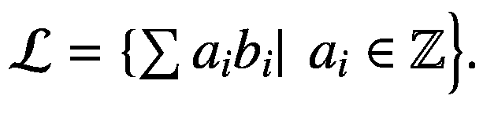
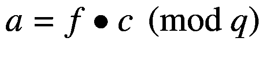
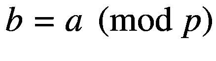
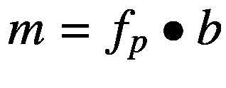
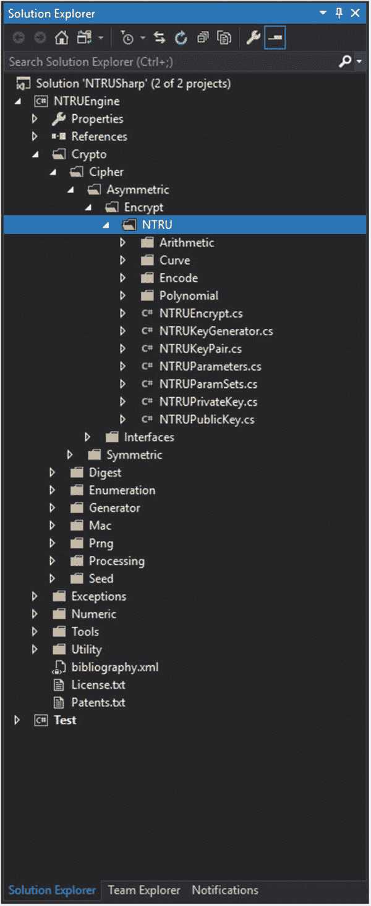
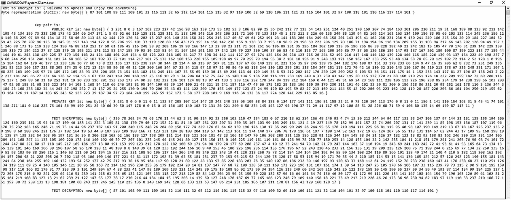

# 十一、基于格的密码学

在这一章中，我们将讨论基于格的密码学，它在密码学领域的重要性及其未来的挑战，以及我们如何设计和开发适合密码学应用的实用解决方案。

随着我们进入一个量子时代，量子密码原语的数量越来越多，基于格的密码的重要性是至关重要的。目前，基于格的构造是后量子密码术的重要候选。根据理论家的观点，RSA、Diffie-Hellman 或椭圆曲线密码系统等密码系统很容易被量子计算机攻击。一些基于格的密码构造在抵抗经典计算机和量子计算机攻击方面取得了很好的效果。

在实践中应用格作为一种加密解决方案并不是一件容易实现的任务，因为数学背景是复杂的，涉及到理解不同的抽象概念。在这一章中，我们将使用 NTRU-夏普库[ [1](#Par26) ]，这是一个免费/开源库，包含公钥密码系统[ [2](#Par27) ]的 NTRU 实现。

## 数学背景

在这一节中，我们将提供一个基本概念和方法的快速概述，这些概念和方法构成了你应该知道的晶格数学背景的最小理论知识。

让我们考虑一下空间 *ℝ* <sup>*n*</sup> 和它的一个基础为( *b* <sub>1</sub> ，…， *b* <sub>*n*</sub> ， *b* <sub>1</sub> ，…，*b*<sub>*n*</sub>∈*【ℝ】一个格表示与基构成线性组合的所有整数的集合，即格的一个例子是 *ℤ* <sup>* n *</sup> ，它是通过经典基 *ℝ* 生成的。在密码学中，来自格装置的一个常见的困难假设是最短向量问题(SVP)。SVP 要求我们估计非零点阵向量的欧几里德距离的最小值。*

使用格的密码系统之一是 NTRU [ [2](#Par27) ]，它可以抵抗使用 Schor 算法的攻击。NTRU 的 SVP 硬度假设包括将特定多项式分解成两个系数极低的多项式。注意，需要分解的特定多项式应该从截断的多项式环中定义。此外，以下是 NTRU 的密钥生成、加密和解密算法:

*   **密钥生成**。选择 *n* ∈ *ℕ* 和两个多项式 *f* 和 *g* ，它们的最大次数为*n*1，系数来自集合{ 1，0，1}。多项式 f 应该有一个附加的性质，即*f*<sub>*p*</sub>*f*<sub>*q*</sub>应该存在其中*f*∙*f*<sub>*p*</sub>= 1(*mod p*)和 *f* ∙ *私钥是*k*<sub>*priv*</sub>=(*f*， *f* <sub>*p*</sub> ， *g* )公钥是*k*<sub>*pub*</sub>=*p*∙*

**   **加密**。需要加密的消息是多项式 *m* ，其系数在{ 1，0，1}中。随机选择一个低系数的多项式 *r* ，由加密消息的发送者保密。 *m* 的加密计算为*c*=*r*∙*h*+*m*(*mod q*)。

    *   **Decryption** . To decrypt the message, the following computations need to be made:

    * 

 *



## 实际实施

如上所述，为了实现和说明加密/解密的基本操作，我们使用了 NTRU-夏普库。该库的供应商做出了惊人的努力，并根据自由软件基金会发布的 GNU 通用公共许可证(许可证的第 3 版)的条款免费提供该库。NTRU-夏普是一个非常复杂的库(见图 [11-1](#Fig1) ),包含了对密码学原语和基于格的原语的重要贡献。



图 11-1

NTRU 图书馆结构

实际实现的目的是展示如何使用该库来提供消息的加密和解密。要实现这一点，你需要熟悉`NTRUEngine`项目。为此，一旦项目加载到您喜欢的 IDE(集成开发环境)中，您需要导航到`NTRU`文件夹(参见图 [11-1](#Fig1) )。在这里，您可以找到您需要的所有类、结构和方法/函数，例如`NTRUParameters`、`NTRUParamSets`、`NTRUKeyPair`、`NTRUKeyGenerator`、`NTRUEncrypt`和`NTRUDecrypt`。我们将仔细查看它们，并提供一些细节(见表 [11-1](#Tab1) 和表 [11-2](#Tab2) )以便您快速了解这些类的用途及其功能/方法。

表 11-2

NTRU 方法

<colgroup><col class="tcol1 align-left"> <col class="tcol2 align-left"> <col class="tcol3 align-left"></colgroup> 
| 

字段、属性、构造函数、方法、函数名

 | 

描述

 | 

类型

 |
| --- | --- | --- |
| `NTRUParamSets.``APR2011743FAST` | 该参数集提供 256 位安全性，但使用乘积形式多项式和 f=1+pF。 | 田 |
| `NTRUKeyGenerator(new NTRUParameters())` | 用一组加密参数构造一个新实例 | 构造器 |
| `GenerateKeyPair()` | NTRU 密钥对容器 | 方法 |
| `Initialize()` | 初始化加密的密码。这个`Initialize()`方法只是为了加密。 | 方法 |
| `Encrypt(byte[] Input)` | 要加密的消息 | 方法 |
| `Decrypt(byte[] Input)` | 要解密的消息 | 方法 |

表 11-1

你上过课吗

<colgroup><col class="tcol1 align-left"> <col class="tcol2 align-left"></colgroup> 
| 

类别名

 | 

描述

 |
| --- | --- |
| `NTRUParameters` | 创建、读取和写入`NTRUEncrypt`的参数设置 |
| `NTRUParamSets` | 一组预定义的 EES 加密参数集 |
| `NTRUKeyPair` | NTRU 密钥对容器 |
| `NTRUKeyGenerator` | 这个类实现了 NTRU 公钥加密系统的密钥对生成 |
| `NTRUEncrypt` | 一种 NTRU 非对称密码的实现 |

现在让我们看一下这个例子，了解它是如何工作的。例如，我们选择了一个简单的消息进行加密，如图 [11-2](#Fig2) 所示。



图 11-2

基于 NTRU 格的密码术加密实例

清单 [11-1](#PC1) 包含了用于加密和解密的主要函数。请注意，要运行此示例，您应该做以下事情:

*   从 [`https://github.com/Steppenwolfe65/NTRU-NET`](https://github.com/Steppenwolfe65/NTRU-NET) [ [1](#Par26) 下载库。

*   转到名为 Test 的项目，通过复制并粘贴清单 [11-1](#PC1) 中的代码来修改名为`Program.cs`的文件。

*   作为第二种选择，使用本书提供的 GitHub 库。

```cs
using System;
using Test.Tests.Arith;
using Test.Tests.Encode;
using Test.Tests.Encrypt;
using Test.Tests.Polynomial;
using System.Runtime.InteropServices;
using System.Diagnostics;

//** NTRU Engine libraries
using VTDev.Libraries.CEXEngine.
                      Crypto.Cipher.Asymmetric.Interfaces;
using VTDev.Libraries.CEXEngine.
                      Crypto.Cipher.Asymmetric.Encrypt.NTRU;
using VTDev.Libraries.CEXEngine.Tools;
using VTDev.Libraries.CEXEngine.Crypto.Prng;
using VTDev.Libraries.CEXEngine.Crypto;

//** The test project
using Test.Tests;

using System.Text;
using System.ComponentModel;

namespace Test

{
    static class Program
    {
        static void Main(string[] args)

        {
            //** we will use as an example the
            //** following example
            //** "Welcome to Apress and Enjoy the adventure"
            byte[] data = new byte[41] { 87, 101, 108, 99,
                                  111, 109, 101, 32, 116, 111,
                                  32, 65, 112, 114, 101, 115,
                                  115, 32, 97, 110, 100, 32,
                                  69, 110, 106, 111, 121, 32,
                                  116, 104, 101, 32, 97, 100,
                                  118, 101, 110, 116, 117, 114,
                                  101 };
            Console.WriteLine("Text to encrypt is:
                               { Welcome to Apress
                                  and Enjoy the adventure}");

            Console.WriteLine("Byte representation (ASCII):
                              {0}\n\n", PrintByteArray(data));

              //** Enc() function will do the
              //** encryption and decryption
            Enc();

            Console.ReadKey();
        }

        private static void Enc()
        {
            //** the predefines parameters
            NTRUParameters prm = NTRUParamSets.APR2011743FAST;
            NTRUKeyPair keyPair;
            byte[] enc, dec;
            byte[] data = { 87, 101, 108, 99, 111, 109, 101,
                            32, 116, 111, 32, 65, 112, 114,
                            101, 115, 115, 32, 97, 110, 100,
                            32, 69, 110, 106, 111, 121, 32,
                            116, 104, 101, 32, 97, 100, 118,
                            101, 110, 116, 117, 114, 101 };

            //** generate and display the key pair

            using (NTRUKeyGenerator gen = new
                                          NTRUKeyGenerator(prm))
            {
                keyPair = (NTRUKeyPair)gen.GenerateKeyPair();
                Console.WriteLine("\t\tKey pair is:");

                Console.WriteLine("\t\t\tPUBLIC KEY is: {0}",
                   PrintByteArray(keyPair.PublicKey.ToBytes()));

                 Console.WriteLine("\n\t\t\tPRIVATE KEY is:
                    {0}",
                   PrintByteArray(keyPair.PrivateKey.ToBytes()));
            }

            // encrypt a message
            using (NTRUEncrypt ntru = new NTRUEncrypt(prm))
            {
                // initialize with public key for encryption
                ntru.Initialize(keyPair.PublicKey);
                // encrypt using public key
                enc = ntru.Encrypt(data);
                Console.WriteLine("\n\n\t\t\tTEXT ENCRYPTED:
                               {0}", PrintByteArray(enc));
            }

            // decrypt a message
            using (NTRUEncrypt ntru = new NTRUEncrypt(prm))
            {
                // initialize with both keys for decryption
                ntru.Initialize(keyPair);
                // decrypt using key pair
                dec = ntru.Decrypt(enc);

                Console.WriteLine("\n\t\t\tTEXT DECRYPTED:
                         {0}", PrintByteArray(dec));
            }
        }

        //** conversion of ascii to text
        private static string ConvertASCII_To_Text(byte[] val)
        {
            //** Instantiate an ASCII encoding object
            ASCIIEncoding ascii = new ASCIIEncoding();

            foreach (var value in val)
                Console.Write(value);
            Console.WriteLine();

            //** Decode the bytes and display
            //** the resulting Unicode string.
            String decoded = ascii.GetString(val);

            return decoded.ToString();
        }

        //** perform parsing of the byte values byte by byte
        public static string PrintByteArray(byte[] bytes)
        {
            var string_builder = new StringBuilder
                                           ("new byte[] { ");
            foreach (var theByte in bytes)
            {
                string_builder.Append(theByte + " ");
            }
            string_builder.Append("}");
            return string_builder.ToString();
        }
    }
}

Listing 11-1Encryption/Decryption Operation

Using NTRU-Sharp

```

## 结论

在这一章中，我们讨论了基于格的密码学及其重要性。在本章结束时，您现在已经了解了以下内容:

*   基于格的密码学的重要性及其对密码学未来的影响

*   如何应用 NTRU-夏普商业软件库

*   如何实现与网格相关的实用功能和方法

*   如何在复杂流程中使用`byte`类型

## 文献学

1.  NTRU 夏普。网上有: [`https://github.com/Steppenwolfe65/NTRU-NET`](https://github.com/Steppenwolfe65/NTRU-NET) 。

2.  J.霍夫斯坦，j .皮弗和 J.H .西尔弗曼，“NTRU:一个基于环的公钥密码系统。”在 J. P .布勒(编)*算法数论中。蚂蚁 1998。计算机科学讲义，第 1423 卷*。斯普林格，柏林，海德堡。1998.

3.  D.铜匠和 a .沙米尔，《晶格对 NTRU 的攻击》在 W. Fumy (ed) *密码学进展— EUROCRYPT '97。欧洲墓穴 1997。计算机科学讲义，第 1233 卷。*施普林格，柏林，海德堡。1997.

4.  C.Gentry 和 M. Szydlo，“修改的 NTRU 签名方案的密码分析”密码学的进展——欧洲密码 2002 年。欧洲密码 2002。计算机科学讲义，第 2332 卷。斯普林格，柏林，海德堡。2002.*