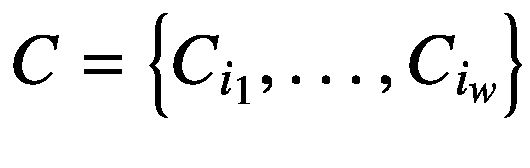
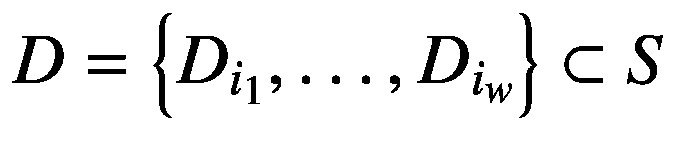
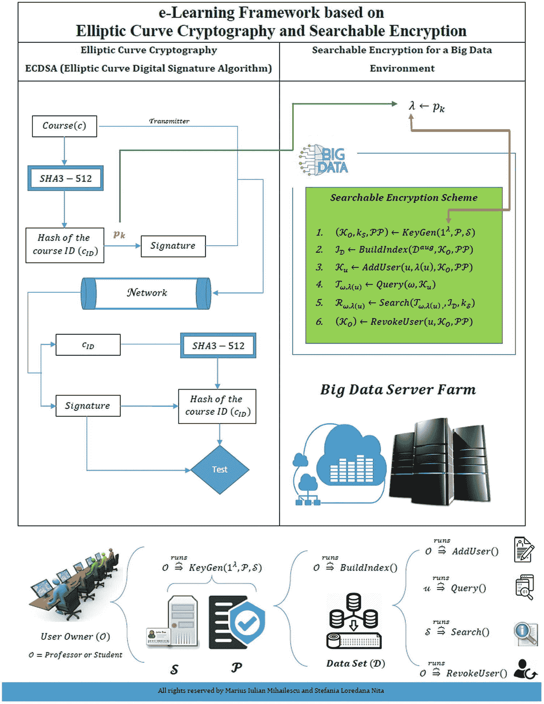

# 十二、可搜索加密

可搜索加密(SE)允许将加密数据外包给可能不可信的第三方服务提供商，同时让用户能够以安全可靠的方式直接搜索加密数据。可搜索加密是同态加密的一个特例，这将在第 [13](13.html) 章中讨论。

考虑以下情况。数据所有者 A 想要将一些文档存储在服务器上，但是同时接收者 B 需要能够访问和搜索这些数据。为了实现数据的这一属性，A 选择使用 B 的公钥加密文档，然后 A 将它们存储在服务器上。当 B 想要搜索包含特定关键字的文档时，比如说“programming”，他们使用“programming”关键字和他们的私钥生成一个名为 trapdoor 的值。然后，B 将陷门提交给服务器，服务器将根据算法执行搜索，并将符合标准的文档发送给 B。

下面是一个更实际的场景:一家公司正在开发一个软件解决方案，其中包括从客户那里获得的社会安全号(SSN)。规则和良好实践表明，SSN 在不参与数据处理时必须加密。另一方面，当员工需要搜索用户帐户时，他们使用 SSN。如果员工在工作时没有“看到”社会保障网络，该怎么办？使用可搜索的加密方案将使这成为可能。

有了这些例子，我们可以说可搜索加密是一种技术，通过这种技术，用户可以在加密的内容中搜索特定的数据。它可以应用于多个领域，例如医疗保健、医生处理患者的医疗文件、教育等等。

## 成分

可搜索加密方案有两种类型的组件:可搜索加密过程中涉及的实体和方案的算法。接下来我们将介绍这些组件。

### 实体

当一个软件解决方案被实现时，更多的方面应该在实现之前被澄清。谁将使用该应用？谁来维护？数据有哪些类型，谁可以访问它们？数据将存储在哪里？等等。从可搜索加密的角度来看，整个过程涉及以下实体:

*   **数据所有者**。数据所有者拥有一套由关键字描述的 *n* 文档 *D* = { *D* <sub>1</sub> ，…， *D* <sub>*n*</sub> 】。文档和关键词都将被外包出去，比如放在云服务器上。在将文档存储在服务器上之前，数据所有者将使用特定的加密方案对它们进行加密。数据所有者被认为是可信的实体。

*   **数据用户**。这是可以触发搜索过程的授权用户。该用户根据需要在加密内容中搜索的关键字生成陷门值。此外，如果资料使用者拥有私人密码匙，他们可将收到的文件解密。

*   **服务器**。服务器存储加密数据，并根据从数据用户处收到的陷门值执行搜索算法。服务器被认为是半可信的或诚实但好奇的，这意味着它按照指示执行搜索算法，但可以对提供给它的数据执行额外的分析。

注意，从上面的描述中，数据所有者可以是数据用户。

### 类型

可搜索加密方案可以根据密码类型分为两类:*对称可搜索加密* (SSE)方案和*带关键字搜索的公开加密* (PEKS)方案。在对称可搜索加密方案中，只有一个密钥用于加密或解密内容，在其他特定算法中也是如此，这一点您将在本节后面看到。具有关键字搜索的公共加密方案使用两种类型的密钥，即用于加密的公共密钥和用于解密的私有(秘密)密钥。

SSE 方案的算法是[ [1](#Par57)

*   `KeyGeneration`。密钥生成算法由数据所有者运行。为了调用它，数据所有者需要一个安全参数 *λ* 作为输入，基于这个参数，算法将输出一种类型的密钥，即秘密密钥 *SK* 。

*   `BuildIndex`。构建索引结构的算法由数据所有者运行。该算法需要密钥 *SK* 和文档集 *D* 作为输入，输出是索引结构 *I* 。更确切地说，该算法从一个空的索引结构开始，然后它获取集合中的每个文档，并且对于每个文档，该算法向索引结构添加一些描述该文档的关键字。注意，在添加到索引结构之前，关键字是加密的(使用秘密密钥 *SK* )。

*   `Trapdoor`。数据用户运行这个算法。为了生成陷门值，该算法将搜索所基于的所需关键字 *kw* 和密钥 *SK* 作为输入，输出是陷门值 *T* <sub>*kw*</sub> 。请注意，陷门算法不只是对 *kw* 进行简单的加密。相反，它会添加一个噪波值或使用某种控制。

*   `Search`。服务器执行搜索算法。输入是之前生成的陷门值*T*<sub>T5】kw</sub>，索引结构 *I* 由`BuildIndex`算法产生。注意，搜索算法并不做 *I* 中*T*<sub>*kw*</sub>的简单匹配。搜索算法要知道如何处理或者如何处理特殊值*T*<sub>*kw*</sub>(别忘了*T*<sub>*kw*</sub>不是简单的加密)。

如果服务器找到一份或多份符合标准的文件，它将把它们发送给数据用户；否则，它会发送一个消息。注意，上面没有提到加密和解密算法。数据所有者可以为文档本身和可搜索的加密方案选择不同的加密方案。这是因为文档不与可搜索加密方案的任何组件直接交互。上述所有算法仅适用于关键字和/或加密关键字的索引结构。

此外，PEKS 方案的算法是[ [2](#Par58)

*   `KeyGeneration`。与 SSE 的密钥生成类似，数据所有者也运行这个算法。输入是安全参数 *λ* ，输出是一对密钥，公钥和私钥( *PK* 、 *SK* )。

*   `Encryption`。加密算法由数据所有者运行，输入是公钥 *PK* 和一个关键字 *KW* 。输出为 *KW* 的加密 *SW* 。

*   `Trapdoor`。这个算法类似于 SSE 的算法。数据用户使用他们的密钥 *SK* 和关键字 *KW* 作为输入来生成陷门值，以触发搜索。输出为陷门值 *T* <sub>*KW*</sub> 。

*   `Test`。服务器执行测试算法，将公钥 PK、加密文本 *C* (加密文本*KW*<sup>’</sup>)和陷门值 *T* <sub>*KW*</sub> 作为输入。如果*<sup>'</sup>=*KW*，测试算法的输出为 1，否则为 0。*

 *对于陷门算法和测试算法也出现了相同的观察结果；它们不仅仅分别是常规加密和常规匹配。然而，上述 SSE 和 PEKS 方案的算法是在本领域的早期工作中介绍的，分别在[ [1](#Par57) 和[ [2](#Par58) 中介绍。随着时间的推移，随着更多类型的搜索可能性被探索，它们经历了转变。例如，一些作品允许多个关键字搜索，另一些作品允许基于关键字[ [3](#Par59) ， [4](#Par60) ]的模糊搜索(允许小的错别字或格式不一致)，还有一些作品允许语义搜索(在这里，数据用户从查询关键字的语义字段接收包含关键字的文档)[ [5](#Par61) ]等。其他工作以文档为中心，即直接在服务器上更新的文档，而不需要从服务器上检索、解密、更新、加密并再次存储在服务器上或直接在服务器上更新的索引结构[ [6](#Par62) ]。然而，在任何可搜索的加密方案中存在的算法是陷门和搜索/测试算法，当然还有加密和解密。

### 安全特征

可搜索加密需要保护的两件事情是搜索模式和访问模式。搜索模式是可以从两个搜索结果来自相同查询关键词的事实中获知的信息。访问模式是针对给定关键字 *KW* 返回的一组文档。此外，可搜索加密方案也应该满足关于搜索查询的安全要求。根据[ [7](#Par63) ]，SE 方案应该提供受控搜索(只有授权用户可以提交搜索查询)、加密查询(查询搜索本身需要在被发送到服务器之前被加密)和查询隔离(服务器从它接收的查询中什么也不知道)。

SSE 方案应该确保索引结构不被破坏，因此应该抵抗 IND1-CKA 和/或 IND2-CKA(为索引选择的关键字攻击)。在 IND1-CKA 中，为所有文档选择相同数量的关键词，而在 IND2-CKA 中，文档可以由不同数量的关键词来描述。类似地，PEKS 方案应该抵抗选择关键字攻击(由攻击者和管理 PEKS 方案的结构之间的挑战组成)。

最近的安全需求是所谓的动态 SE 方案的前向*前向*和后向*隐私*，该方案支持直接在服务器上以加密格式插入、更新或删除一组文档或关键字的操作。向后和向前隐私涉及在插入/删除/更新过程中获知的信息。后向隐私处理当搜索基于在当前搜索之前被删除的文档中存在的关键字时获得的信息，而在前向隐私中，当前更新操作与先前操作无关。

## 简单的例子

然而，即使可搜索加密有很大的潜力，由于其抽象性，在常规应用中从零开始实现一个方案是非常困难的(错误的实现导致错误的加密，因此导致更少/没有安全性，并且可能消耗更多的资源)。Crypteron <sup>[1](#Fn1)</sup> 开发了为数不多的提供可搜索加密工具的库之一。在他们的网站上，他们解释如何安装他们的库并把它们包含在项目中。在安装了所需的库之后，开发人员需要做的就是在允许基于关键字的搜索查询的类的字段上放置一个标志。受他们的例子的启发，清单 [12-1](#PC1) 展示了如何将它应用到一个名为`Student`的类，并基于他们的个人代码进行搜索(参见清单 [12-1](#PC1) )。

```cs
public class Student
{
    public int StudentId {get; set;}

    [Secure]
    public string StudentName {get; set;}

    [Secure(Opt.Search)]
    public string StudentPersonalCode {get; set;}
}

var queryKeywod =
    SecureSearch.GetPrefix("123456789");

var resultStudent = myDatabase.Students.Where(p =>
    p.StudentPersonalCode.StartsWith(searchPrefix))

Listing 12-1A Simple Example Framework for Searchable Encryption Implemention

```

在本例中，请注意为`StudentPersonalCode`字段启用可搜索属性的`Opt.Search`选项。在搜索之前，查询关键字由`SecureSearch.GetPrefix`处理。

## 复杂的例子

在下一个示例[ [18](#Par74) ]中，您将看到可搜索加密代表了一种高级且非常强大的加密技术，它为用户在加密文档中搜索关键字提供了优势。了解系统中的参与者非常重要。为此，我们对他们进行了如下分类:*数据用户*，他拥有一组文档 *S* = { *D* <sub>1</sub> ，…，*D*<sub>*n*</sub>}，通过生成密钥、加密密钥并将其存储在云服务器上，使系统准备就绪；*数据所有者*，他有在云服务器上提交搜索查询的可能性和优势；以及*云服务器*，存储加密文档并调用搜索算法。典型的 SE 技术包含以下随机化算法:

*   **密钥生成**(**λ**)**→**(**K**<sub>**p**</sub>， **K** <sub>**s**</sub> ):密钥的生成基于安全参数。基于安全参数 *λ* ，生成一对公钥和私钥组成的集合，分别为(*K*<sub>*p*</sub>)(*K*<sub>*s*</sub>)。

*   **加密**(**D**<sub>T5】I</sub>，**K**<sub>**p**</sub>)**→C**<sub>**I**</sub>:算法会根据取公钥*K*<sub><sub>的加密，输出加密后的文件 *C* <sub>*i*</sub></sub></sub>

*   **build index**(**D**<sub>T5】I</sub>， **w** ，**K**<sub>**p**</sub>)**→I**:一个构建索引算法有以下参数作为输入:文档 *D* <sub>*i*</sub> ，与文档关联的关键字 w，以及公钥*K*输出由基于文档和关键字之间的关联的索引结构表示。**

*   **陷门** ( **w** 、**K**<sub>**s**</sub>)**→t**<sub>**w**</sub>:陷门算法有两个参数作为输入:进行搜索的关键字和密钥。输出是一个陷门值 *t* <sub>*w*</sub> 。

*   **搜索**(**t**<sub>T5】w</sub>， **K** <sub>**p**</sub> ， **I** ) **→ C** :搜索算法有以下参数:陷门值和公钥。输出表示带有关键字的加密文档。

*   **D** ( **C** 、**K**<sub>**s**</sub>)**→D**:解密算法将加密文件的 *C* 和密钥 *K* <sub>*s*</sub> 作为输入参数。输出由解密文档的集合表示。

如今，椭圆曲线(见第 [10 章](10.html))被用于区块链([ [14](#Par70) 、[ [15](#Par71) )或物联网([ [16](#Par72) 、[ [17](#Par73) )等重要课题。

在图 [12-1](#Fig1) [ [18](#Par74) ]中，你可以看到一个结合椭圆曲线加密和大数据环境的可搜索加密方案的真实例子(参见第 [16 章](16.html))。我们使用椭圆曲线数字签名算法(ECDSA)来保护通过电子学习平台向学生提供的课程。来自 ECDSA 算法的私钥被传递给可搜索的加密方案，并被用作安全参数( *λ* )。



图 12-1

一个实用的可搜索加密方案的例子[ [18](#Par74)

没有可搜索加密的实现 .NET 或开源。我们深入研究了最近的研究，目前我们找不到任何作为库、模块或框架的真正实现。为了实现可搜索的加密方案，在执行实现之前应该考虑一些基本准则。指导方针如下:

*   软件应用的架构(服务器、数据库、服务等)。)

*   硬件设备以及如何为当前使用安全和加密机制的应用构建硬件设备

*   设计架构时，将可搜索的加密步骤表示为独立的算法，并且可以在整个网络基础架构的最终用户之间正确部署

如果你看一个可搜索的加密方案(见图 [12-1](#Fig1) )，你可以看到它被分为多个步骤。每一步都有一个算法，可以作为可搜索加密方案的一个独立实例。这些实例可以表示为软件模块、软件服务，甚至物联网设备(例如英特尔 NUC 电脑或 Raspberry PI 设备)。软件模块或服务可以在分布式网络的用户之间分布和部署，例如云计算或用于中小型企业架构的普通网络基础设施。

以下算法[ [18](#Par74) 描述了图右侧标题为 *大数据环境* *的*的图 [12-1](#Fig1) 中的步骤。*为了实现适当的实施，有必要且要求对作为单独和独立算法的步骤有清晰的印象。这些步骤是*

1.  ( **K** <sub>**O**</sub> ， **K** <sub>**s**</sub> ，**PP**)**←key generation**(**1**<sup>**λ**</sup>， **P** ， **S** )。这表示由数据 *O* 的所有者运行的概率算法，该算法将采用安全参数 *λ* ，策略 *P* ，以及服务器 *S* 的身份，并且基于这些参数将输出所有者的秘密密钥 *K* <sub>*O*</sub> ，服务器密钥 *K* <sub>*s*</sub>

2.  **I**<sub>**D**</sub>**←build index**(**D**<sup>**aug**</sup>， **K** <sub>**O**</sub> ， **PP** )。这表示由所有者调用的概率算法。它将获取数据集*D*<sup>*aug*</sup>的描述和所有者的密钥( *K* <sub>*O*</sub> )并输出一个索引 *I* <sub>*D*</sub> 。

3.  **K**<sub>**U**</sub>**(**U**， **λ** ( **u** )， **K** <sub>**O**</sub> ， **PP** )。这是一种概率算法，由所有者*或*调用，用于在电子学习平台系统中注册新用户。该算法将获取用户的新身份和用户的访问级别，以及所有者的 *O* 密钥，并为新用户输出秘密。**

***   **陷门** <sub>( **ω** ，**λ**(**u**)</sub>**←查询** ( **ω** ， **K** <sub>**u**</sub> )。这是一种确定性算法，由具有适当权限 *λ* ( *u* )的用户调用，以生成搜索查询。该算法将把关键字*ω*∈δ(其中δ表示关键字的字典)和用户的密钥作为输入，并输出查询令牌*陷门*T28】(*ω*，*λ*(*u*)。

     *   **R** <sub>( **ω** ，**λ**(**u**)</sub>**←搜索** ( **陷门** <sub>( **ω** ，**λ**(**u**)</sub>， **I** <sub>**D**</sub> 确定性算法由服务器( *S* )运行，以在索引中搜索包含关键字 *ω* 的数据项。它将接受搜索查询和索引，并将搜索结果返回为***R***<sub>(***ω***， ***λ** ，*(**)**</sub>**，包括一组数据项的标识符 *d* <sub>*j*</sub> *λ* ( *u* ) 其中包含 *ω* 使得*λ*(*d*<sub>*j*</sub>)≤*λ*(*u*)，其中 *λ* ( *u* )**

    ***   (**K**<sub>T3】OT5)**←revoke user**(**u**， **K** <sub>**O**</sub> ， **PP** )。概率算法由所有者*或*运行，以从系统中撤销特定用户。它将获取用户的 id 以及数据所有者和服务器的密钥，并为所有者和服务器输出新的密钥。</sub>

     ****

 ****如果对于所有的 *k* ∈ *ℕ* ，对于所有的 *K* <sub>*O*</sub> ， *K* <sub>*S*</sub> 由*key gen*(1<sup>*λ*</sup>， *P* ，对于所有的*d *对于 *BuildIndex* 输出的所有*I*<sub>*D*</sub>(*D*<sup>*aug*</sup>， *K* <sub>*O*</sub> )，对于所有*ω*∈δ，对于所有*U*∈*U **λ* ( *u* )， *PP* )，*搜索*(*I*<sub>*D*</sub>， *T* <sub>*ω* ， *λ* ( *u* )</sub> )****

清单 [12-2](#PC2) 中的例子是使用 LINQ 到 SQL 开发的，是实现图 [12-1](#Fig1) 中提出的可搜索加密方案的实用方法。必须提到的是，实现纯粹是指示性的，因为实现(框架、库等。)不存在。

```cs
public class KeyGeneration
{
   //** Step 1
   //** the algorithm from KeyGeneration step (algorithm)
   //** are runned and invoked by the data owner

   //** global variables
   public string securityParameter = string.Empty();
   public string ownerID = string.Empty();
   public string policyContent = string.Empty();
   public string serverIdentity = string.Empty();

   //** the function will return the policy,
   //** as a content or file
   public string GetPolicy(IServiceCollection policyService)
   {
      policyService.AddAuthorization(policyChoices =>
      {
        policyChoices.AddPolicy("Policy content", policy
                          =>policy.Requirements.Add(new
                           UserPolicy()));
    });

    policyContent = policyChoices.ToString();
    }
    //** getting server identity can be tricky and it has
    //** different meanings, such as the name of computer,
    //** IP, active directory reference name etc...
    //** For the current example we will use the hardware ID
    public string GetServerIdentity()
    {
        ManagementObject hardwareID = new
        ManagementObject(@"win32_logicaldisk.
        deviceid=""c:""");
        hardwareID.Get();
        string idOfTheHardware = hardwareID
        ["VolumeSerialNumber"].ToString();

        serverIdentity = ifOfTheHardware;

        return serverIdentity;
}

    //** class constructor
    public KeyGeneration(){}

    //** let's generate the secret key, server key
    //** and public parameters
    //** "#" represents the separator
    public string ReturnParameters()
    {
         StringBuilder sbParameters = new StringBuilder();

         sbParameters.Append(ownerSecretKey + "#" +
         serverKey + "#" +);
    publicParameters);
    }
}

public class BuildIndex
{
    //** Step 2
    //** the algorithm from BuildIndex step (algorithm)
    //** are runned and invoked by the data owner

    //** constructor of the class
    public void BuildIndex(){}

    //** the function centralize the build index parameters
    //** after their initialization and processing
    public void UseBuildIndexParameters()
    {
          LinkedList descriptionDataSet =
          new LinkedList();
          string ownerPrivateKey = string.Empty();
          string outputIndex = string.Empty();
    }

    //** simulation of getting the data set and their
    //** descriptions
    public LinkedList GetDataSet()
    {
        for(int i=0; i<dataSet.Length; i++)
        {
            LinkedList ll = new LinkedList();
            ll.Items.Add(dataSet[i],description[i]);
       }
    }

    //** getting the private of the owner
    public string ownerPrivateKey()
    {
        string privateKey = string.Empty();

        //** get the private key and work with it arround

        return privateKey;
    }

    //** get the index
    public string Index()
    {
         string index = string.Empy();

         //** implement the query for getting
         //** or generating the index

         return index;
    }
}

public class AddUser
{
    //** Step 3
    //** the algorithm from AddUser step (algorithm)
    //** are runned and invoked by the data owner
    //** constructor of the class AddUser
    public string AddUser() {}

    //** property for getting the identity of the user
    //** see below the Class Student
    public string IdentityOfTheUser()

        string identity = string.Empty();

        //** implement the way of getting
        //** the identity of the user

       return identity;
    }

    //** property for getting the owners key
    public string OwnerSecretKey()
    {
         string secretKey = string.Empty();

         //** implement the way of querying
         //** for secret key

         return secretKey;
    }

public void AssignSecretKeyToUser()
{
    Student stud = new
    Student(OwnerSecretKey.ToString());
}
}

public class Query
{
    //** Step 4
    //** the algorithm from Query step (algorithm)
    //** are runned and invoked by the user

    //** constructor of the class Query
    public void Query() {}

    //** function for getting the keywords
    public string Keyword()
    {
        string kw = string.Empty();

        //** query for the keywords;

        Return kw;
    }

    //** function for getting the secret key of the users
    public string UserSecretKey()
    {
        string secretKey = string.Empty();

        //** implement the way of querying
        //** for secret key

        return secretKey;
    }

    //** the generation of the output as query
    //** token for the trapdoor
    public string QueryToken()
    {
         string query_token = string.Empty();

        //** generate and build
        //** the query token for trapdoor

        return query_token
    }
}

public class Search
{
     //** Step 5
     //** the algorithm from Search step (algorithm)
     //** are runned and invoked by the server

     //** the constructor of the Search class
     public void Search() {}

     public string SearchQuery()
     {
         string query = string.Empty();

         //** take the search query

         return query;
    }

    public string Index()
    {
        string index = string.Empty();

        //** take the search query

        return index;
    }

    public string ReturnResult()
    {
        string result = string.Empty();
        string setOfIdentifiers = string.Empty();

        //** based on the search query and index,
        //** get the set identifiers of the data items
        setOfIdentifier = "query for identifiers";

        //** build the result. "#" is the separator for
        //** illustration purpose only
        result = SearchQuery + "#" + Index;

        return result;
    }
}

public class RevokeUser
{
    //** Step 6
    //** the algorithm from Search step (algorithm)
    //** are runned and invoked by the data owner

    //** constructor of RevokeUser class
    public void RevokeUser(){}

    //** second constructor of the class
    //** this can be implemented as a
    //** solution for revoking a user
    public void RevokeUser(string userID,
                           string secretKeyDataOwner,
                           string secretKeyServer)
    {
         //** implement the revoking process

        //** output the new key for data owner

       //** output the new key for server
    }
}

public class Course
{
     //** the db_panel represents an instance of the generated
     //** DBML file which contains classes for each of tables
     //** from the database
     DatabaseDBPanel db_panel = new DatabaseDBPanel();

     //** Class Courses it is a generated class and assigned
     //** to the table Courses from the database
     Courses c = new Courses();

     //** student ID
     string demoStudentID = "435663";

     //** select the course ID based on the student
     public string GetCourse()
     {
          //** select the courses for a
          //** specific user (student)
          var c = (from x in db_panel.Courses
          where x.StudentID ==
                   demoStudentID.ToString()).Single();

          return c.ToString();
     }

}

public class Student
{
    public string secretKey {get; set;}
    public int StudentId {get; set;}
    public string CourseID {get; set;}

    [Secure]
    public string StudentName {get; set;}

    [Secure]
    public string StudentIdentity {get; set;}

    [Secure(Opt.Search)]
    public string StudentPersonalCode {get; set;}

     //** constructor of the class
     public void Student(string secret_key)
     {
          secretKey = secret_key;
     }

}

var queryKeywod =
    SecureSearch.GetPrefix("123456789");

var resultStudent = myDatabase.Students.Where(p =>
    p.StudentPersonalCode.StartsWith(searchPrefix))

Listing 12-2Implementation of Searchable Encryption Scheme

```

## 摘要

在本章中，描述了可搜索加密方案，并提供了一个支持可搜索加密的库的简单示例。

可搜索加密是同态加密的一个特例，在许多活动领域都有很大的潜力。如果您对可搜索加密的更多理论方面感兴趣，任何参考资料都提供了对 SE 的更深入的了解。有关伪代码的一些最新示例，请参考[ [11](#Par67) 或[ [12](#Par68) 。

## 文献学

1.  E.J. Goh，“安全索引”IACR 密码学 ePrint 档案，2003，216。

2.  D.Boneh，G. Di Crescenzo，R. Ostrovsky 和 G. Persiano，“使用关键字搜索的公钥加密”在*国际密码技术理论与应用会议*(第 506-522 页)。2004.斯普林格，柏林，海德堡。

3.  J.李，王，王，曹，任，楼伟，“云计算中加密数据的模糊关键词搜索”。在 2010 年 IEEE INFOCOM 会议录(第 1-5 页)。2010.IEEE。

4.  J.《容错可搜索加密》在 *2009 IEEE 国际通信会议*(第 1-6 页)。IEEE。2009.

5.  J.赖，周，邓瑞宏，李彦宏，陈国光，“加密数据的表现性搜索”。*第八届 ACM SIGSAC 信息、计算机和通信安全研讨会会议录*(第 243-252 页)。2013.

6.  R.Bost，“∑ oφoς:转发安全可搜索加密。”在*2016 年 ACM SIGSAC 计算机与通信安全会议论文集*(第 1143-1154 页)。2016.

7.  D.X. Song、D. Wagner 和 A. Perrig，“加密数据搜索的实用技术”在 2000 年 IEEE 安全和隐私研讨会上。S & P 2000(第 44-55 页)。IEEE。2000.

8.  J.Ghareh Chamani、D. Papadopoulos、C. Papamanthou 和 R. Jalili，“前向和后向私有对称可搜索加密的新构造”在*2018 ACM SIGSAC 计算机与通信安全会议论文集*(第 1038-1055 页)。2018.

9.  C.左，孙，刘，邵，皮普日克，“动态可搜索对称加密的前向和强后向保密性。”在*欧洲计算机安全研究研讨会*(第 283-303 页)。施普林格，查姆。2019.

10.  加密文档， [`www.crypteron.com/docs/`](http://www.crypteron.com/docs/)

11.  C.马，谷耀辉，李。"实用的可搜索对称加密支持合取查询，没有关键字对结果模式泄漏."

12.  南支持加密云数据逻辑查询的隐私保护模糊搜索方案。在*移动网络和应用*中，1-12。2010.

13.  丹·博纳等人，《使用关键字搜索的公钥加密》密码技术理论与应用国际会议。施普林格，柏林，海德堡，2004。

14.  欧内斯特·博纳和朱·石光，“区块链边缘计算环境中的隐私增强方案(PES)”(2019 年 10 月)IEEE 接入 2020。

15.  Mohammad Shahriar Rahman 等人，“在宽松的信任假设下使用区块链进行可问责的跨境数据共享”2020 年 *IEEE 工程管理汇刊*。

16.  C.Bö sch，P. Hartel，W. Jonker 和 A. Peter，“可证明安全的可搜索加密的调查”，载于 ACM Comput。调查，第 47 卷，第 2 期，第 1–51 页，2014 年。

17.  Prabhat Kumar Panda 和 Sudipta Chattopadhyay。“物联网环境的安全相互认证协议”，载于*可靠智能环境杂志*(第 1-16 页)，2020 年。

18.  Mihailescu Marius Iulian、Nita Stefania Loredana 和 Pau Valentin Corneliu。"使用椭圆曲线加密和可搜索加密的电子学习系统框架."《电子学习和教育软件国际科学会议论文集》第 1 卷(第 545-552 页)，2020 年。DOI: 10.12753/2066-026X-20-071。

<aside aria-label="Footnotes" class="FootnoteSection" epub:type="footnotes">Footnotes [1](#Fn1_source)

[T2`www.crypteron.com/`](http://www.crypteron.com/)

 </aside>*****