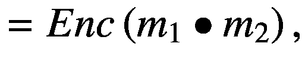

# 十三、同态加密

同态加密(HE)代表一种支持对加密数据进行计算的加密技术，在计算时不需要解密。对明文数据应用的计算结果必须与通过对加密数据应用反映对明文数据应用的相应计算而获得的结果的解密结果相同。这些类型的加密方案有很大的潜力，因为第三方可以在加密数据上计算函数(并因此应用算法)，而无需访问明文数据。因此，数据得到处理，同时其隐私和安全得到保证。例如，您正在旅行，想要搜索附近的餐馆。这个简单的搜索可能会透露您的信息，例如您在哪个城镇以及您搜索的时间。如果搜索引擎使用同态加密方案，那么其他人就看不到你的任何信息，你收到的搜索结果也是如此。可能使用同态加密的重要领域包括金融/商业部门、医疗保健和其他使用敏感数据的领域。

如果一个函数 *f* : *A* → *B* 满足以下性质，则称它在运算“*”上是*同态的:*


除了密钥生成、加密和解密，同态加密方案还有一个算法`Eval (`，称为*评估*，它将加密数据作为输入，并输出加密数据。在`Eval`算法中，函数`f`应用于加密数据*c*T7】1 和*c*T11】2，而不访问普通数据*m*T15】1 和*m*T19】2，具有以下属性:


在同态加密中，同态被认为仅用于加法和乘法这两种数学运算，因为对应于函数的任何电路都可以使用对应于这两种运算的门来表示。同态加密在`Unpadded RSA`算法中遇到的第一个观察，同态运算是乘法，




其中 *m* <sub>1</sub> ， *m* <sub>2</sub> 是两个普通消息， *Enc* 代表加密功能。

有三种同态加密方案:

*   **部分同态加密(PHE)** 。接受单个操作的次数不限。代表其他加密方案基础的重要 PHE 方案是 RSA [ [1](#Par66) ]、Goldwasser-Micali [ [2](#Par67) ]和 El-Gamal [ [3](#Par68) ]。

*   **有点同态加密(SWHE)** 。接受有限次数的多重操作。一个 SWHE 方案的例子是[ [4](#Par69) ]。

*   **全同态加密(FHE)** 。接受多次操作，次数不限。FHE 被称为“密码学的圣杯”或“密码学的瑞士军刀” [5](#Par70) 因为它可以对加密数据应用任意次数的函数。第一个 FHE 方案是在 2009 年提出的，它基于理想晶格[ [6](#Par71) ]。虽然这个计划有很大的潜力，并为 FHE 开辟了道路，但它也有一些缺点，比如它的复杂性和抽象性，这使得它在最初的形式下不切实际。此外，许多研究使用[ [6](#Par71) 中提出的 FHE 通用框架来创建或改进完全同态方案。

## 全同态加密

深入了解 FHE 是值得的，因为它是一项伟大的技术，有可能解决(几乎)所有的安全、隐私和保密问题。

第一个 FHE 方案是在 2009 年提出的，基于理想格[ [6](#Par71) ]和*理想陪集问题*硬度假设，随后又有许多其他方案提出，为第一代 FHE 方案开辟了道路。紧随其后的工作是[ [7](#Par72) ]，其中作者提出了一个更简单的基于整数运算的 FHE 方案。然而，这两种方案的缺点是快速的噪声增长，这对实际实现和安全性有很大的影响，并且限制了同态能力。此外，噪音的增长在某种程度上也使得解密变得不可能。

第二代开始采用更有效地控制噪声的方案[ [8](#Par73) ，[ [9](#Par74) ]，这在某些条件下带来了更好的性能和更强的安全性(称为*硬度假设*)。这一代产生了支持给定多项式深度的电路评估的*分级方案*，以及能够产生 FHE 方案的*自举方案*。如果加密方案可以评估它自己的解密电路以及一个与非门，则该加密方案称为可自举的。

第三代从[ [10](#Par75) 开始，引入了全新的噪点处理方式。第二代方案比第三代方案提供了更好的效率，但第三代方案的硬度假设可能较弱。从第三代开始的很多方案都是基于非对称乘法，也就是说，对于两个密文 *c* <sub>1</sub> ， *c* <sub>2</sub> ，*c*<sub>1</sub>∏*c*<sub>2</sub>的乘积不同于*c*<sub>2【T21∙*c*</sub>

FHE 在密码学方面有更多的应用:

*   **外包**。存储和计算可以外包，而不会泄露私人信息。例如，一家小公司希望将其数据存储在云中，但它应该对数据进行加密，以防止云提供商访问这些数据。FHE 在这方面会有所帮助，因为云提供商可能会以加密格式处理公司的数据，而无法访问明文数据。此外，云提供商还会将计算结果以加密格式发送给数据所有者，只有私钥持有者才能解密。

*   **私人信息检索** (PIR) **或** **私人查询**。这些在数据库查询或搜索引擎中是很重要的，例如，当客户机想要向存储在服务器上的大型数据库提交查询时，但是客户机不希望服务器了解关于查询的任何信息。因此，客户端对查询进行加密，并发送给服务器；然后，服务器对加密数据应用加密查询，并用加密结果进行响应。

*   **两个实体之间的一般计算**(双方计算)。让我们假设有两方，每一方都拥有一个私有输入，`A`方的`x`和`B`方的`y`，以及一个双方都知道的约定函数`F`。当第`A`方想要计算拥有的输入的函数时，它将带来`x`并计算`r = F(x, y)`，并且它将学习结果`r`，但是将不会学习关于`y`的任何东西。另一方面，`B`方将不会了解到关于`x`和`r`的任何信息。在一个半诚实的模型中，这将等同于`B`计算`F` <sub>`y`</sub> `(x)`，其中`A`加密`x`并发送给`B`，因为语义安全保证了这样一个事实，即`B`不会了解到与`x`相对应的普通值。如果在这里使用同态加密来评估函数，`A`将只学习`F(x,y)`的结果，而不学习其他任何东西。

*   **零知识**。零知识证明协议可以使用同态加密来在 NP(非确定性多项式时间)中对每种语言 L 应用它。

## 微软海豹突击队公司实施的 FHE 方案

BFV [ [11](#Par76) 和 CKKS [ [12](#Par77) 加密方案在微软的 FHE 库中实现，分别叫做`SEAL` [ [13](#Par78) ， [14](#Par79) 。

在[ [11](#Par76) ]中，加密函数定义在次数最大的多项式集合`n`上，系数以 t 为模计算。该集合表示为*r*<sub>*t*</sub>=*ℤ*<sub>*t*</sub>[*x*]/(*x*<sup>*n*</sup>+另一方面，密文位于 *R* <sub>*q*</sub> 集合中，其中多项式的系数取模`q`。该方案中的同态运算是加法和乘法，保留了 *R* <sub>*t*</sub> 的环结构。要加密一个普通值，应该首先使其成为结构 *R* <sub>*t*</sub> 接受的多项式形式。在 [11](#Par76) 中提出的方案的算法是`SecretKeyGen`(基于安全参数生成密钥)、`PublicKeyGen`(基于密钥生成公钥)、`EvaluationKeyGen`(基于密钥生成评估密钥)、`Encrypt`(使用公钥加密普通值)、`Decrypt`(使用密钥解密加密值)、`Add`(执行两个加密值的加法)和`Multiply`(执行两个加密值之间的乘法)。注意加法和乘法的结果必须落在同一个结构 *R* <sub>*q*</sub> 。更多细节和理论方面的内容请咨询[ [11](#Par76) ]。

虽然[ [11](#Par76) 提供了一种对整数应用模运算的方法，但在[ [12](#Par77) 中，作者也提供了对实数和复数应用模运算的方法。无论如何，在[ [12](#Par77) 中，结果是近似的，但这些技术是以加密格式对实数求和、对加密数据应用机器学习算法或计算加密位置之间距离的最佳技术之一。

## 海豹突击队图书馆

`SEAL`的名字来源于*简单加密算法库* [ [15](#Par80) ]，写在`C++`中。`SEAL`的最新稳定版本是 3.5(2020 年 5 月发布)，它支持 .NET 标准包装器，使得使用公共 API 更容易，也更容易被非密码学专家使用。该库有一个 GitHub 页面[ [16](#Par81) ]，可以从那里下载。

`SEAL`库是独立的，它不像其他 FHE 方案实现那样需要外部库。这使事情变得更容易，因为它包含自动选择加密方案参数的模块和噪声估计模块。在[ [17](#Par82) 中，证明了海豹突击队 v2.0 在双重格攻击下是安全的。

安装海豹突击队库最简单的方法是使用 Visual Studio 中的 NuGet 包管理器控制台(本章我们将使用 Windows 10 Education x64 上的 Visual Studio 2019 社区)。

在 Visual Studio 中创建新项目(我们创建了一个名为`SEALDemo`的项目，其类型为`ConsoleApp(.NET Core)`)然后打开选择`Tools` > `NuGet Package Manager` > `Package Manager Console`，并键入

```cs
PM> Install-Package Microsoft.Research.SEALNet -Version 3.5.6

```

如果安装成功，控制台上会显示类似图 [13-1](#Fig1) 的信息。


图 13-1

使用软件包管理器控制台安装海豹突击队

在继续之前，我们重复海豹突击队的 GitHub 页面上的警告:

> *“如果不阅读所有示例或简单地重复使用示例中的代码，就不可能正确使用微软海豹突击队。任何试图这样做的开发人员都不可避免地会产生易受攻击、故障或极其缓慢的代码。”*
> 
> ——[`https://github.com/microsoft/SEAL/blob/master/README.md#getting-started`](https://github.com/microsoft/SEAL/blob/master/README.md%2523getting-started)

在新创建的项目中，添加一个名为`Example`的新类，并在这个类中添加`static void`方法`EasyExample()`。代码应该如清单 [13-1](#PC2) 所示。

```cs
using System;
using System.Collections.Generic;
using System.Text;

namespace SEALDemo
{
    class Example
    {
        public static void EasyExample()
        {
        }
    }
}

Listing 13-1The Initial Structure

```

请注意，当您创建一个新类时，库`System`、`System.Collections.Generic`和`System.Text`会自动添加。对于 Visual Studio 的其他版本，这些库可能会有所不同，或者根本不会出现。删除上面的三条指令，用`Microsoft.Research.SEAL;`代替。这样，你就可以在你的类中使用海豹突击队库中的方法。

此外，让我们使用 BFV 加密方案将代码添加到`EasyExample()`方法中，并添加来自`SEAL`库的功能。首先，您需要指定加密参数。它们是多项式模数的次数(`n`)、密文的系数模数(`q`)和明文的模数(`t`)。为了告诉应用您想要定义 BFV 方案的参数，您在`EasyExample()`中添加清单 [13-2](#PC3) 中的以下代码行。

```cs
EncryptionParameters parameters = new EncryptionParameters(SchemeType.BFV);

Listing 13-2Defining the BFV Parameters

```

接下来，您需要为每个参数提供值。*多项式模次数*的值代表`2`的一次幂，实际上就是一个分圆多项式<sup>T5】1T7】的次数。这个度数的推荐范围是`{1024, 2048, 4096, 8192, 16384, 32768}`。该值越高，对加密数据的计算就越困难，但速度会变得更慢。中间值是 4096，这允许合理的计算次数，所以为您的应用选择这个值。下一个参数是*密文系数模数*，代表一个大整数。它应该表示为素数的乘积，其位数应该是其素数因子的位数之和。该值越高，支持的加密计算越多。总之，在多项式模次数和系数模的最大比特长度之间存在一种关系。例如，多项式模次数的值 4096 对应于系数模的比特大小的值 109。最后一个参数是明文的模数，通常是一个正整数。在本例中，您将使用 2 的幂对其进行初始化。在其他情况下，模数应该是一个质数。该值的目的是给出普通数据的位大小，并设置乘法运算的消耗限制。有关加密参数的更多信息可在[ [13](#Par78) 和[ [14](#Par79) 中找到。</sup>

我们需要解释的另一个概念是**噪声预算*，用位数表示。简而言之，**初始噪声预算*由加密参数给出，并且在同态运算(加法和乘法)期间消耗噪声的速率也由加密参数给出。系数模的值对初始噪声预算有重要影响；系数模数值越高，初始噪声预算值越高。如果加密值的噪声预算达到值 0，则密文不能再被解密，因为噪声量太高。**

 **回到示例，在`EasyExample()`方法中添加清单 [13-3](#PC4) 中的以下初始化:

```cs
parameters.PolyModulusDegree = 4096;
parameters.CoeffModulus = CoeffModulus.BFVDefault(4096);
parameters.PlainModulus = new Modulus(1024);

Listing 13-3Initialization

```

使用海豹突击队上下文检查加密参数的正确性:

```cs
SEALContext SEALctx = new SEALContext(parameters);

```

接下来的步骤更容易。您需要实例化提供 BFV 加密方案算法的类，如清单 [13-4](#PC6) 所示。

```cs
KeyGenerator keyGenerator = new KeyGenerator(SEALctx);
PublicKey pK = keyGenerator.PublicKey;
SecretKey sK = keyGenerator.SecretKey;
Encryptor encrypt = new Encryptor(SEALctx, pK);
Evaluator evaluate = new Evaluator(SEALctx);
Decryptor decrypt = new Decryptor(SEALctx, sK);

Listing 13-4Instantiate the Classes for BFV

```

举个简单的例子，我们对多项式*p*(*x*)= 3*x*T6】4+6*x*<sup>3</sup>+9*x*T14】2+12*x*+6 求值 *x* = 3。

为了检查加密和解密是否有效，让我们加密值 *x* = 3，然后解密结果。同时，您检查一些度量标准(清单 [13-5](#PC7) )。

```cs
int value = 3;
Plaintext plainValue = new Plaintext(value.ToString());
Console.WriteLine($"The value = {value} is expressed as a plaintext polynomial 0x{plainValue}.");
Console.WriteLine();
Ciphertext encryptedValue = new Ciphertext();
encrypt.Encrypt(plainValue, encryptedValue);
Console.WriteLine($"- the size of the freshly encrypted value is: {encryptedValue.Size}");
Console.WriteLine("- the initial noise budget of the encrypted value: {0} bits",
      decrypt.InvariantNoiseBudget(encryptedValue));
Plaintext decryptedValue = new Plaintext();
Console.Write("- the decryption of encrypted value: ");
decrypt.Decrypt(encryptedValue, decryptedValue);
Console.WriteLine($"0x{decryptedValue}");

Listing 13-5Encryption of x=3 and Metrics Checking

```

现在您应该运行应用了。为此，您需要转到您的解决方案中的`Program`类(清单 [13-6](#PC8) ，并调用`EasyExample()`方法:

```cs
public class Program
{
   static void Main(string[] args)
   {
      Example.EasyExample();
      GC.Collect();
   }
}

Listing 13-6The Main Method

```

清单 [13-6](#PC8) 中需要`GC.Collect`，因为它准确地显示了内存池的使用情况。运行该应用，您将获得如清单 [13-7](#PC9) 和图 [13-2](#Fig2) 所示的输出。


图 13-2

运行应用的结果

```cs
The value = 3 is expressed as a plaintext polynomial 0x3.

- the size of the freshly encrypted value is: 2
- the initial noise budget of the encrypted value: 55 bits
- the decryption of encrypted value: 0x3

Listing 13-7The Result of Running the Application

```

让我们回到加密/解密验证。通过`Plaintext`构造函数，普通值被转换成比模数多项式阶数更低的多项式，其系数被表示为十六进制值。使用海豹突击队库得到的密文被表示为两个或更多的多项式，这些多项式的系数被计算为整数模来自`CoeffModulus`的素数相乘的结果。您用对象`encryptedValue`实例化了`Ciphertext`类，其中您放置了`plainValue`的加密。您可以使用`encrypt`对象的`Encrypt`方法来实现。很容易观察到，`Encrypt`方法在这里有两个参数:表示明文值的源的参数(`plainValue`)和表示源明文值的加密目的地的第二个参数(`encryptedValue`)。密文的大小由多项式的个数给出，新加密的密文的大小总是 2。该值由`encryptedValue`对象的`Size`方法返回。此外，`decrypt`对象的`InvariantNoiseBudget`方法为我们计算了普通值`3`加密的初始噪声预算。`InvariantNoiseBudget`被实现到`Decryptor`类中，因为它显示了解密是否会在你的计算中的某一点起作用。要解密结果，使用由`decrypt`对象调用的`Decrypt`方法。最后，解密确实有效，因为十六进制表示中的值`0x3`表示`3`。

为了优化工作，建议采用乘法运算较少的多项式形式，因为乘法运算成本较高，可以更快地降低噪声预算。因此， *p* ( *x* )可能被因式分解为*p*(*x*)= 3(*x*<sup>2</sup>+2)(*x*+1)<sup>2</sup>，也就是说你会先求值( *x* <sup>2</sup> + 2)，再求值( *x* + 1)

要计算( *x* <sup>2</sup> + 2)，如清单 [13-8](#PC10) 所示进行。

```cs
Console.WriteLine("Compute squareValuePlusTwo (x^2+2).");
Ciphertext squareValuePlusTwo = new Ciphertext();
evaluate.Square(encryptedValue, squareValuePlusTwo);
Plaintext plainTextTwo = new Plaintext("2");
evaluate.AddPlainInplace(squareValuePlusTwo, plainTextTwo);

Console.WriteLine($"- the size of squareValuePlusTwo:
      {squareValuePlusTwo.Size}");
Console.WriteLine("- the noise budget in plainTextTwo: {0} bits",
      decrypt.InvariantNoiseBudget(squareValuePlusTwo));

Plaintext decryptedResult = new Plaintext();
Console.Write("- the decryption of squareValuePlusTwo: ");
decrypt.Decrypt(squareValuePlusTwo, decryptedResult);
Console.WriteLine($"0x{decryptedResult}");

Listing 13-8Computing (x2 + 2) 

```

清单 [13-9](#PC11) 和图 [13-3](#Fig3) 显示了运行应用后的输出。


图 13-3

计算的结果(*x*T2】2+2)

```cs
Compute squareValuePlusTwo (x^2+2).
- the size of squareValuePlusTwo: 3
- the noise budget in squareValuePlusTwo: 33 bits
- the decryption of squareValuePlusTwo: 0xB

Listing 13-9The Result of Computing (x2 + 2)

```

确实，如果计算 3 <sup>2</sup> + 2，得到`11`，其十六进制表示为`0xB`；噪声预算大于 0，所以解密仍然有效。请注意，`evaluate`对象允许您直接对加密数据进行操作。本例中的收集器变量是`squareValuePlusTwo`。首先，你用`Square`的方法将`2`幂的加密值，即*x*2 放入这个变量。接下来，您添加一个明文值`2`，使用方法`AddPlainInplace`，导致 *x* <sup>2</sup> + 1。注意，在这个例子中， *x* = 3。此外，`Square`和`AddPlainInplace`方法有两个参数，一个源和一个目的。

类似地，您计算( *x* + 1) <sup>2</sup> ，使用作为收集器变量`valuePlusOneSquare`，如清单 [13-10](#PC12) 所示。

```cs
Console.WriteLine("Compute valuePlusOneSquare ((x+1)^2).");
Plaintext plainTextOne = new Plaintext("1");
Ciphertext valuePlusOneSquare = new Ciphertext();
evaluate.AddPlain(encryptedValue, plainTextOne,
       valuePlusOneSquare);
evaluate.SquareInplace(valuePlusOneSquare);
Console.WriteLine($"- the size of valuePlusOneSquare:
       {valuePlusOneSquare.Size}");
Console.WriteLine("- the noise budget in valuePlusOneSquare:
       {0} bits", decrypt.InvariantNoiseBudget(valuePlusOneSquare));
Console.Write("- decryption of valuePlusOneSquare: ");
decrypt.Decrypt(valuePlusOneSquare, decryptedResult);
Console.WriteLine($"0x{decryptedResult}");

Listing 13-10Computing (x + 1)2 

```

清单 [13-11](#PC13) 和图 [13-4](#Fig4) 显示了运行应用的结果。


图 13-4

计算的结果( *x* + 1) <sup>2</sup>

```cs
Compute valuePlusOneSquare ((x+1)^2).
- the size of valuePlusOneSquare: 3
- the noise budget in valuePlusOneSquare: 33 bits
- decryption of valuePlusOneSquare: 0x10

Listing 13-11The Result of Computing (x + 1)2

```

确实，如果计算(3 + 1) <sup>2</sup> ，得到`10`，其十六进制表示为`0x10`；噪声预算大于 0，所以解密仍然有效。

3(*x*T3】2+2)(*x*+1)<sup>2</sup>的最终结果被收集到`encryptedOutcome`变量中，如清单 [13-12](#PC14) 所示。

```cs
Console.WriteLine("Compute encryptedOutcome 3(x^2 + 2)(x + 1)^2 .");
Ciphertext encryptedOutcome = new Ciphertext();
Plaintext plainTextThree = new Plaintext("3");
evaluate.MultiplyPlainInplace(squareValuePlusTwo, plainTextThree);
evaluate.Multiply(squareValuePlusTwo, valuePlusOneSquare, encryptedOutcome);
Console.WriteLine($"- size of encryptedOutcome:
      {encryptedOutcome.Size}");
Console.WriteLine("- the noise budget in encryptedOutcome:
      {0} bits", decrypt.InvariantNoiseBudget(encryptedOutcome));
decrypt.Decrypt(encryptedOutcome, decryptedResult);
Console.WriteLine("- decryption of 3(x^2+2)(x+1)^2 = 0x{0}",
decryptedResult);

Listing 13-12Computing 3(x2 + 2)(x + 1)2

```

清单 [13-13](#PC15) 和图 [13-5](#Fig5) 显示了结果。


图 13-5

计算 3 的输出(*x*<sup>2</sup>+2)(*x*+1)<sup>2</sup>

```cs
Compute encryptedOutcome 3(x^2 + 2)(x + 1)^2 .
- size of encryptedOutcome: 5
- the noise budget in encryptedOutcome: 2 bits
- decryption of 3(x^2+2)(x+1)^2 = 0x210

Listing 13-13The Output of Computing 3(x2 + 2)(x + 1)2

```

的确，如果你计算 3(3 <sup>2</sup> + 2)(3 + 1) <sup>2</sup> ，我们得到`528`。别忘了明文模数是`1024`，所以`528 mod 1024 = 528`，它有`0x210`的十六进制表示。噪声预算大于 0，这允许您解密最终的加密结果。

清单 [13-14](#PC16) 将所有这些放在一起。

```cs
class Example
{
  public static void EasyExample()
  {
    EncryptionParameters parameters = new
    EncryptionParameters(SchemeType.BFV);

    parameters.PolyModulusDegree = 4096;
    parameters.CoeffModulus = CoeffModulus.BFVDefault(4096);
    parameters.PlainModulus = new Modulus(1024);

    SEALContext SEALctx = new SEALContext(parameters);

    KeyGenerator keyGenerator = new KeyGenerator(SEALctx);
    PublicKey pK = keyGenerator.PublicKey;
       SecretKey sK = keyGenerator.SecretKey;
       Encryptor encrypt = new Encryptor(SEALctx, pK);
       Evaluator evaluate = new Evaluator(SEALctx);
       Decryptor decrypt = new Decryptor(SEALctx, sK);

       Console.WriteLine("Evaluation of 3(x^2 + 2)(x + 1)^2");
       Console.WriteLine();
       int value = 3;
       Plaintext plainValue = new Plaintext(value.ToString());
       Console.WriteLine($"The value = {value} is expressed as
             a plaintext polynomial 0x{plainValue}.");
       Console.WriteLine();
       Ciphertext encryptedValue = new Ciphertext();
       encrypt.Encrypt(plainValue, encryptedValue);

       Console.WriteLine($"- the size of the freshly encrypted
             value is: {encryptedValue.Size}");
       Console.WriteLine("- the initial noise budget of the
             encrypted value: {0} bits",
       decrypt.InvariantNoiseBudget(encryptedValue));

       Plaintext decryptedValue = new Plaintext();
       Console.Write("- the decryption of encrypted value: ");
       decrypt.Decrypt(encryptedValue, decryptedValue);
       Console.WriteLine($"0x{decryptedValue}");

       /* Compute (x^2 + 2).*/
       Console.WriteLine("Compute squareValuePlusTwo (x^2+2).");
       Ciphertext squareValuePlusTwo = new Ciphertext();
       evaluate.Square(encryptedValue, squareValuePlusTwo);
       Plaintext plainTextTwo = new Plaintext("2");
       evaluate.AddPlainInplace(squareValuePlusTwo, plainTextTwo);

       Console.WriteLine($"- the size of squareValuePlusTwo:
           {squareValuePlusTwo.Size}");
       Console.WriteLine("- the noise budget in
           squareValuePlusTwo: {0} bits",

       decrypt.InvariantNoiseBudget(squareValuePlusTwo));

    Plaintext decryptedResult = new Plaintext();
    Console.Write("- the decryption of squareValuePlusTwo: ");
    decrypt.Decrypt(squareValuePlusTwo, decryptedResult);
    Console.WriteLine($"0x{decryptedResult}");

    /*Compute (x + 1)^2.*/
    Console.WriteLine("Compute valuePlusOneSquare ((x+1)^2).");
    Plaintext plainTextOne = new Plaintext("1");
    Ciphertext valuePlusOneSquare = new Ciphertext();
    evaluate.AddPlain(encryptedValue, plainTextOne,
         valuePlusOneSquare);
    evaluate.SquareInplace(valuePlusOneSquare);
    Console.WriteLine($"- the size of valuePlusOneSquare:
         {valuePlusOneSquare.Size}");
    Console.WriteLine("- the noise budget in
         valuePlusOneSquare: {0} bits",

    decrypt.InvariantNoiseBudget(valuePlusOneSquare));
    Console.Write("- decryption of valuePlusOneSquare: ");
    decrypt.Decrypt(valuePlusOneSquare, decryptedResult);
    Console.WriteLine($"0x{decryptedResult}");

    /* Multiply (x^2 + 2) * (x + 1)^2 * 3\. */

    Console.WriteLine("Compute encryptedOutcome
      3(x^2 + 2)(x + 1)^2 .");
    Ciphertext encryptedOutcome = new Ciphertext();
    Plaintext plainTextThree = new Plaintext("3");
    evaluate.MultiplyPlainInplace(squareValuePlusTwo,
        plainTextThree);
    evaluate.Multiply(squareValuePlusTwo, valuePlusOneSquare,
         encryptedOutcome);
    Console.WriteLine($"- size of encryptedOutcome:
             {encryptedOutcome.Size}");
    Console.WriteLine("- the noise budget in encryptedOutcome:
          {0} bits", decrypt.InvariantNoiseBudget(encryptedOutcome));
    decrypt.Decrypt(encryptedOutcome, decryptedResult);
    Console.WriteLine("- decryption of 3(x^2+2)(x+1)^2 =
             0x{0}", decryptedResult);
      }
}

Listing 13-14The Entire Code

```

整个输出如图 [13-6](#Fig6) 所示。


图 13-6

全部输出

这个多项式求值代表了如何使用海豹突击队库的一个简单例子。当然，在实际应用中，您将需要处理更复杂的函数或算法。甚至这个简单的例子也可以通过使用*重新线性化技术*进行显著优化，该技术将加密文本的大小重置为初始值 2。简而言之，应该在每次乘法之后应用重新线性化。这种技术在海豹突击队库中可用，它在`RelinearizeInplace`下的`Evaluator`类中实现，它有两个参数:需要重新线性化的加密文本和重新线性化密钥。上述示例可以修改如下:首先，定义重新线性化关键字:

```cs
RelinKeys relinearizationKeys = keyGenerator.RelinKeys();

```

然后，在每次乘法之后，进行重新线性化。例如，重新线性化`squareValuePlusTwo`变量:

```cs
evaluate.RelinearizeInplace(squareValuePlusTwo, relinearizationKeys);

```

请注意，您需要重新线性化`valuePlusOneSquare`和`encryptedOutcome`变量，以实现最大优化。

正如您在这个简单的例子中看到的，`SEAL`库非常强大，一个很大的优点是它独立于其他外部库。当应用处理整数的精确值时，在`SEAL`库中实现的`BFV`加密方案非常棒。如果应用需要处理实数或复数，那么`CKKS`加密方案是最好的选择，它也在`SEAL`库中实现。

## 结论

在本章中:

*   您已经了解了什么是同态加密以及同态加密的类型。

*   您对全同态加密有了更深入的了解，并且看到了它如此重要的原因。

*   在一个简单的例子中，您使用了微软的`SEAL`库，它实现了`BFV`加密方案，并进行多项式求值。

## 文献学

1.  阿迪·萨莫尔·罗纳德·L·李维斯特和伦纳德·阿德曼，“获取数字签名和公钥密码系统的方法”《化学文摘》第 21.2 节的来文(1978 年):第 120-126 页。

2.  沙菲·戈德瓦瑟和希尔维奥·米卡利，“概率加密和如何玩心理扑克保密所有部分信息。”第十四届美国计算机学会计算理论年会会议录。1982.

3.  基于离散对数的公钥密码系统和签名方案。信息理论汇刊 31.4 (1985): 469-472。

4.  Dan Boneh、Eu-Jin Goh 和 Kobbi Nissim，“评估密文上的 2-DNF 公式”密码学理论会议。施普林格，柏林，海德堡，2005。

5.  B.巴拉克和 z .布拉克斯基。《密码学的瑞士军刀》， [`http://windowsontheory.org/2012/05/01/the-swiss-army-knife-of-cryptography/`](http://windowsontheory.org/2012/05/01/the-swiss-army-knife-of-cryptography/) ，2012 年。

6.  使用理想格的全同态加密。第 41 届美国计算机学会计算理论年会会议录。2009.

7.  Marten Van Dijk 等人，“整数上的全同态加密”密码技术理论与应用国际年会。施普林格，柏林，海德堡，2010。

8.  Zvika Brakerski 和 Vinod Vaikuntanathan，“来自(标准)LWE 的高效全同态加密”SIAM 计算期刊 43.2 (2014): 831-871。

9.  Craig Gentry、Z. Brakerski 和 V. Vaikuntanathan，“无引导的全同态加密”安全 111.111 (2011): 1-12。

10.  Craig Gentry，Amit Sahai 和 Brent Waters，“从错误中学习的同态加密:概念上更简单，渐近更快，基于属性”年度密码学会议。施普林格，柏林，海德堡，2013。

11.  范俊峰和弗雷德里克·维考特伦，“有点实用的全同态加密”IACR 密码学 ePrint 档案 2012 (2012): 144。

12.  Jung Hee Cheon 等人，“近似值算术的同态加密”密码学与信息安全理论及应用国际会议。施普林格，查姆，2017。

13.  陈皓、金·莱恩和瑞秋·普莱耶，“简单加密算法库-海豹突击队 2.1 版”，金融加密和数据安全国际会议。施普林格，查姆，2017。

14.  Kim Laine，《简单加密算法库 2.3》。1."微软研究院， [`www.microsoft.com/en-us/research/uploads/prod/2017/11/sealmanual-2-3-1.pdf`](http://www.microsoft.com/en-us/research/uploads/prod/2017/11/sealmanual-2-3-1.pdf) (2017)。

15.  微软海豹突击队， [`www.microsoft.com/en-us/research/project/microsoft-seal/`](http://www.microsoft.com/en-us/research/project/microsoft-seal/)

16.  微软/海豹突击队， [`https://github.com/Microsoft/SEAL`](https://github.com/Microsoft/SEAL)

17.  对小秘密 LWE 的双重格攻击和在赫里布和海豹突击队的参数选择密码技术理论与应用国际年会。施普林格，查姆，2017。

<aside aria-label="Footnotes" class="FootnoteSection" epub:type="footnotes">Footnotes [1](#Fn1_source)

[T2`https://en.wikipedia.org/wiki/Cyclotomic_polynomial`](https://en.wikipedia.org/wiki/Cyclotomic_polynomial)

 </aside>**