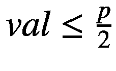
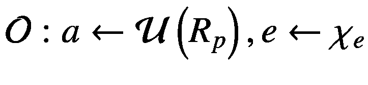

# 十四、带错误的环学习密码术

在这一章中，我们将讨论带错误的环学习密码术(RLWE ),它是开发专业和复杂的应用和系统的最强大和最具挑战性的方法之一。

2005 年，Oded Regev 引入了带错误的学习(LWE) [ [4](#Par57) ]问题，它被证明是密码学未来的一个惊人的通用基础，并提供了复杂的密码构造。如果你想了解更多关于 LWE 和相关问题的信息，我们列出了一些关于基于格的密码学的最佳调查[ [5](#Par58) 、 [6](#Par59) 、 [7](#Par60) 、 [8](#Par61) ]。

LWE 代表一个计算问题，其主要目的是用作新的密码算法的基础，并构建新的、实用的密码构造。一个例子是 *NewHope* [ [9](#Par62) ，一种后量子密钥封装。NewHope 旨在提供针对量子计算机发起的密码分析攻击的保护，同时也是同态加密的基础。

R-LWE 代表了基于有限域上的特殊多项式环的更大的 LWE 问题。基于即使使用量子计算机也难以解决 RLWE 问题的假设，RLWE 密码被视为未来公钥密码的根本基础(见图 [14-2](#Fig2) 和清单 [14-2](#PC2) 的示例)。

RLWE 密码术相对于 LWE 的重要优势在于公钥和私钥的大小。RLWE 生成的密钥代表从 LWE 获得的密钥的平方根。为了便于讨论，让我们考虑下面的例子:我们使用 128 位的安全级别，RLWE 加密算法将使用 7000 位的公钥。

有三类 RLWE 加密算法:

*   **密钥交换(RLWE-柯)**:2011 年，丁金泰在辛辛那提大学提出了和进行密钥交换的设想。他的基本思想[ [10](#Par63) 诞生于矩阵乘法的结合律。这种情况下的错误用于提供安全性。论文发表于 2012 年，专利填写于同年。2014 年，Chris Peikert 根据丁的想法[ [11](#Par64) ]推出了一个关键运输方案。

*   **RLWE 签名(RLWE-S)**:2011 年，柳巴舍夫斯基提出了格非、菲亚特、沙米尔[ [12](#Par65) ]提出的身份认证协议的改进版本，将其转换为数字签名[ [13](#Par66) ]。2012 年，GLP (Gunesyu，Lyubashevsky 和 Popplemann)延长了签名。

*   **RLWE 同态加密(RLWE-何)**:同态加密的主要目标是允许对敏感数据进行计算。2011 年，Brakeersky 和 Vaikuntanathan 提出了一个使用 RLWE 的全同态加密方案，并使用密钥相关消息实现安全性[ [15](#Par68) ]。

在接下来的部分中，我们将通过一个简短的数学背景来展示在进一步实现之前你所知道的最基本的必要理论信息。

## 数学背景

### 带着错误学习

随着量子计算机的发展，许多现有的公钥密码系统将很容易被破解。所以抗量子计算机的加密方案有必要的硬度假设。其中一种方法是带着错误学习。通俗地说，LWE 问题是基于发现解决以下等式的值的难度:


在上面的等式中， *a* 和 *b* 是公钥， *s* 代表密钥， *e* 代表误差值(或噪声)。

LWE 问题在密码学的许多领域都有应用。例如，它用于使公钥加密安全地抵御选择明文攻击或选择密文攻击、不经意传输、基于身份的加密和完全同态加密。

在论文[ [1](#Par54) ]中，上面的等式应用于线性方程组，变成*b*=*A*×*s*+*e*，其中(1) *A* 是二维矩阵，如果 *s* 是一维矩阵或(2)

 *使用 LWE 的简单加密方案可以定义如下，考虑质数 *p* ∈ *ℤ* :

*   **密钥生成**:随机选择一个向量，选择一个矩阵 *A* ，其中 *m* 行代表来自均匀分布的 *m* 个独立向量，从 *ℤ* 上定义的误差分布中随机选择向量*e*=(*e*<sub>1</sub>，…*e*<sub>*m*</sub>将 *b* = *计算为* + *e* 。公钥是对( *A* ， *b* )，私钥是 *s* 。

*   **加密**:给定矩阵、 *A* 和 *b* 以及需要加密的消息 *m* ∈ {0，1},对 *A* 和 *b* 进行随机采样，得到*v*<sub>*A*=∈*A*<sub>*I*</sub> *m* 的加密是一对( *u* 、 *v* )。</sub>

*   **解密**:计算值*val*=*v*<sub>*b*</sub>——SV<sub>*A*</sub>(*mod p*)。如果，则消息为*m*= 0；否则，消息是 *m* = 1。

上面的例子只是一个非常简单的加密方案，用来演示 LWE 问题是如何工作的。基于 LWE 问题的重要公钥加密方案是 Regev [ [2](#Par55) ]和林德纳-佩克特加密方案。

有两种类型的 LWE 问题:LWE 搜索和 LWE 决策。在下文中，我们提供了 LWE 问题的这些变体的正式定义:

**定义 LWE** **搜索**。给定定义在整数集合 *ℤ* 上的值 *m* ， *n* ， *p* ∈ *ℤ* 和分布 *χ* <sub>*s*</sub> 和 *χ* <sub>*e*</sub> ，选择和并计算的值 *s*〉+*e*<sub>*I*</sub>*mod p*，其中 *i* = 1，…， *m* 。 *带错误学习搜索*变量问题的元组( *n* ， *m* ， *p* ， *χ* <sub>* s *</sub> ， *χ* <sub>* e *</sub> )在于确定 *s 【T75*

注意，在上面的定义中， *s* 是具有 *n* 值的列向量， *a* <sub>*i*</sub> 是具有来自 *ℤ* <sub>*p*</sub> 的 *n* 值的行向量， *b* 是具有来自 *ℤ* <sub>的 *m* 元素的列向量</sub>

**LWE 决定的定义。**给定整数集合 *ℤ* 上定义的值 *n* 、 *p* ∈ *ℤ* 和分布 *χ* <sub>*s*</sub> 和 *χ* <sub>*e*</sub> ，选择并建立两个预言如下:

*   ；输出( *a* ，〈 *a* ， *s* 〉 + *e mod p* )

*   ；输出( *a* ， *u* )

*带错误学习决策*代表元组( *n* ， *p* ， *χ* <sub>*s*</sub> ， *χ* <sub>*e*</sub> )的一个变体问题，其目的是区分和 *U* 。

### 带错误的环形学习

LWE 问题可以应用于系数来自有限域的多项式环。在这种情况下，LWE 问题被称为*带错误的环学习* (RLWE)。在密码学中，RLWE 用于密钥交换、签名或同态加密等主题。原理类似于简单 LWE 的原理，在第一等式中 *a* 、 *b* 、 *s* 、 *e* 都是多项式。LWE 问题的两种变体变成了

**定义(RLWE 搜索)**。给定值 *n* ，*p*∈*ℤ*with*n*= 2<sup>*k*</sup>，设 *R* 为![$$ R=\frac{\mathbb{Z}\left[X\right]}{\left\langle {X}^n+1\right\rangle } $$](img/493660_1_En_14_Chapter_TeX_IEq11.png)和以及分布*χ*<sub>t21】s</sub>和 *χ* <sub> * e * *e*⟵*χ*<sub>*e*</sub>和并计算 *b* ≔ *的值为* + *e* 。 带错误的*环学习搜索*元组的变体问题( *n* ， *p* ， *χ* <sub>* s *</sub> ， *χ* <sub>* e *</sub> )在于确定 *s* 知道(</sub>

注意，在上面的定义中，![$$ {R}_p=\frac{{\mathbb{Z}}_p\left[X\right]}{\left\langle {X}^n+1\right\rangle } $$](img/493660_1_En_14_Chapter_TeX_IEq14.png)。

**定义(RLWE 决定)。**给定值 *n* ， *p* ∈ *ℤ* <sub>+</sub> 以及环上定义的分布 *χ* <sub>*s*</sub> 和*χ*<sub>*e*</sub>r<sub>*p*</sub>，选择 *s*

*   ；输出( *a* ，*为* + *e* )

*   ；输出( *a* ， *u* )

元组( *n* ， *p* ， *χ* <sub>*s*</sub> ， *χ* <sub>*e*</sub> )的*环学习带错误决策*变式问题是为了区分和 *U* 。

为了使基于(R)LWE 的加密方案安全，需要任何多项式时间算法(称为攻击者)解决(R)LWE 问题的优势是可忽略的函数。

## 实际实施

LWE 代表了一种量子加密的健壮方法。当您决定转向 LWE 的实用方面，实现一个处理 LWEs 的简单方法时，您需要记住，您需要创建一个密钥值( *sk* )和另一个值( *random* _ *value* )。下一步非常简单，因为您将需要一组值(*set*_*of*_*values*[])并在稍后计算`p[]=t[]` × `sk + e.`， *p* []和*set*_*of*_*values*[])将成为公钥。

我们将展示的第一个例子(见图 [14-1](#Fig1) )代表了 Oded Regev 在[ [4](#Par57) ]中定义的一种加密方法，称为带错误学习。算法的工作流程很简单:*消息*(见图 [14-1](#Fig1) 第一行)的每一位都是按照 Oded Regev from[4](#Par57)的方案加密的。代码如清单 [14-1](#PC1) 所示。


图 14-1

Oded Regev 使用的加密方法

```cs
using System;
using System.Collections.Generic;
using System.Linq;
using System.Text;
using System.Threading.Tasks;

namespace LWECase1
{
    class Program
    {
        public static int[] public_key = new int[200];
        public static int[] values = new int[]
                                 { 5, 8, 12, 16, 2, 6, 11, 3, 7, 10 };
        public static int s = 5;
        public static int e = 12;
        public static int message = 1;
        public static int val = 0;
        public static int sum = 0;
        public static int remainder = 0;

        static void Main(string[] args)
        {
            Random randValue = new Random();
            int[] res = new int[200];
            int k = 0;

            //**
            for (int x=0; x<values.Length; x++)
            {
                public_key[k] = values[x] * s + e;
                k++;
            }

            for(int i=0; i< public_key.Length; i++)
            {
                res[i] = randValue.Next(public_key[i],
                                    public_key.Length / 2);
            }

            for(int j=0; j<res.Length; j++)
            {
                sum += res[j];
            }

            Console.WriteLine("The message to be send: {0}", message);
            Console.WriteLine("The random values:");
            PrintValues(values);
            Console.WriteLine("The public key is: ");
            PrintValues(public_key);
            Console.WriteLine("The selected values are:");
            PrintValues(res);

            //** compute the sum
            if (message == 1)
                sum += 1;

            Console.WriteLine("The sum is: {0}", sum);

            Console.WriteLine("The encrypted message is: {0}", sum);
           //** compute the remainder
            remainder = sum % s;

            if(remainder % 2 == 0)
                Console.WriteLine("The message received is 0");
            else
                Console.WriteLine("The message received is 1");

            Console.ReadKey();
        }

        //** dealing with arrays
        public static void PrintValues(Object[] myArr)
        {
            foreach (Object i in myArr)
            {
                Console.Write("\t{0}", i);
            }
            Console.WriteLine();
        }

        //** dealing with arrays
        public static void PrintValues(int[] myArr)
        {
            foreach (int i in myArr)
            {
                Console.Write("\t{0}", i);
            }
            Console.WriteLine();
        }
    }
}

Listing 14-1Implementation of LWE Encryption Method by Oded Regev

```

在清单 [14-2](#PC2) 中，我们将提供一个基于 LWE 的公钥加密的例子。我们将从创建一个秘密值( *s* )开始，它将代表私钥。下一步是创建由随机数的值形成的公钥( *A* )。我们将根据 *A* 、 *s* 和随机误差 *e* 生成另一组数字( *B* )。这个例子是针对单个位完成的，与清单 [14-1](#PC1) 中的前一个例子一样。

这个例子的简单工作流程是

*   Between 0 and 100, we will select a random set of 20 values which represent the public key (*A*). Let’s assume that those 20 values are

    ![$$ A=\left[80,86,19,62,2,83,25,47,20,58,45,15,30,68,4,13,8,6,42,92\right] $$](img/493660_1_En_14_Chapter_TeX_Equb.png)

*   Next, we will define a list (*B*) and each element will be as *B*<sub>*i*</sub> = *A*<sub>*i*</sub> × *s* + *e*<sub>*i*</sub>(*mod q*), where *s* represents the secret key and *e* represents a list of small random values, called *the errors values.* As an example of the statement made, let’s consider a prime number (*q*) equal with 97, and the error vector (*e*) *as*

    ![$$ e=\left[3,3,4,1,3,3,4,4,1,4,3,3,2,2,3,2,4,4,1,3\right] $$](img/493660_1_En_14_Chapter_TeX_Equc.png)

*   *A* and *B* lists are considered the public key and *s* represents the secret key. At this point, we are able to distribute *A* and *B* to everybody who wishes to proceed with an encryption of a message (with the condition to keep *s* secret). In order to proceed with the encryption, we need to use the samples from *A* and B. Moving forward, based on those sample we take a bit from the message (*M*) and compute the following two values:

    

T2】

*   At this point, we say that the encrypted message is (*u*, *v*). To proceed with the decryption, we need to compute

    

*   如果消息等于 0，否则为 1。

上面描述的程序是从 Oded Regev 的论文[ [5](#Par58) ]中总结出来的，以便于理解和清楚地理解如何在现实中转换 LWE 的复杂性。接下来，让我们看看清单 [14-2](#PC2) ，看看这个实现会是什么样子。输出如图 [14-2](#Fig2) 所示。


图 14-2

使用 LWE 输出公钥加密的例子

```cs
using System;
using System.Collections.Generic;
using System.Linq;
using System.Text;
using System.Threading.Tasks;

namespace PublicKeyEncLWE_Case2
{
    class Program
    {
        public static int[] A = new int[30];
        public static int[] B = new int[30];
        public static int[] e = new int[30];
        public static int s = 20;
        public static int message = 1;
        public static int q = 15;
        public static int nvals = 20;

        static void Main(string[] args)
        {
            Random randomSample = new Random();
            IEnumerable<int> q_values = Enumerable.
                                      Range(0, q);
            IEnumerable<int> n_values = Enumerable.Range(
                                     nvals - 1, nvals / 4);
            double u = 0;
            double v = 0;
            int sample = 0;

            foreach (int q_value in q_values)
            {
                for (int i = 0; i < q; i++)
                {
                    A[i] = randomSample.Next(q_value, nvals);
                }
            }
            for (int x = 0; x < A.Length; x++)
            {
                e[x] = randomSample.Next(1, 4);
                B[x] = (A[x] * s + e[x]) % 2;
            }

            Console.WriteLine("PARAMETERS SECTION\n");
            Console.WriteLine("\tMessage to be send: {0}", message);
            Console.WriteLine("\tThe public key (A):");
            PrintValues(A);
            Console.WriteLine("\tThe public key (B):");
            PrintValues(B);
            Console.WriteLine("\tThe errors (e) are: ");
            PrintValues(e);
            Console.WriteLine("\tThe secret key is: {0}", s);
            Console.WriteLine("\tPrime number is: {0}", q);

            foreach(int n_value in n_values)
            {
                sample = randomSample.Next(nvals - 1, n_value);
                Console.WriteLine("The sample is {0}", sample);
            }

            IEnumerable<int> samples = Enumerable.Range(0, sample);
            string errors = string.Empty;

            for (int x = 0; x < samples.Count(); x++)
            {
                errors = "[" + A[x] + ", " + B[x] + ", ], end
                                                = " + u + A[x];
            }

            Console.WriteLine(errors);

            double flooring = q / 2;

            v += Math.Floor(flooring) * message;

            u = v % q;
            v = u % q;

            Console.WriteLine("u = {0}", u);
            Console.WriteLine("v = {0}", v);

            double res = (v - s * u) % q;
            Console.WriteLine("The result is: {0}", res);
            if (res > q / 2)
                Console.WriteLine("Message is 1");
            else
                Console.WriteLine("Message is 0");

            Console.ReadKey();
        }

        public static void PrintValues(Object[] myArr)
        {
            foreach (Object i in myArr)
            {
                Console.Write("\t{0}", i);
            }
            Console.WriteLine();
        }

        public static void PrintValues(int[] myArr)
        {
            foreach (int i in myArr)
            {
                Console.Write("\t{0}", i);
            }
            Console.WriteLine();
        }
    }
}

Listing 14-2Implementation of Public Key Encryption Example Using LWE

```

## 结论

在本章中，您使用 C# 编程语言尝试了第一种实用的带错误的环学习加密方法。它可以为专业人士提供多种挑战的空间，也是对这种加密原语做出重大贡献的起点。

在本章结束时，您现在有以下内容:

*   R-LWE 所基于的主要概念和定义的坚实但简短的数学背景，如果没有它，实际实现将有许多空白需要填补

*   体验 RLWE 的数学概念及其在实践中的转换带来的挑战

## 文献学

1.  Oded Regev，《学习与错误问题》， [`https://cims.nyu.edu/~regev/papers/lwesurvey.pdf`](https://cims.nyu.edu/%257Eregev/papers/lwesurvey.pdf) 。

2.  O.格子上，错误学习，随机线性码和密码术。在*《美国计算机学会杂志(JACM)】*，第 56 卷第 6 期，第 1-40 页。2009.

3.  R.林德纳和 c .佩克特，“基于 LWE 的加密的更好的密钥大小(和攻击)”在*RSA 会议上的密码学家跟踪*(第 319-339 页)。斯普林格，柏林，海德堡。2011.

4.  O.Regev，“带错误的学习问题(邀请调查)”，载于 *2010 IEEE 第 25 届计算复杂性年会*(第 191-204 页)。马萨诸塞州剑桥市 doi: 10.1109/CCC.2010.26\. 2010。

5.  D.Micciancio 和 O. Regev，“基于格的密码学”在 D. J. Bernstein 和 J. Buchmann (eds)，*后量子密码术*。斯普林格，2008 年。

6.  C.佩克特。“基于格的密码学的一些最新进展。”TCC’09，2009 特邀教程幻灯片。

7.  D.米西安西奥。“最坏情况复杂性假设的加密函数。”载于:P. Q. Nguyen 和 b . Vall ee(编辑)，*《LLL 算法:调查和应用，信息安全和密码学》*，第 427-452 页。斯普林格，2008 年。预赛。LLL25 版本，2007。

8.  O.雷格夫。"基于格的密码术。"In *CRYPTO* (第 131–141 页)。2006.

9.  新希望——后量子密钥封装。网上有: [`https://newhopecrypto.org/`](https://newhopecrypto.org/) 。

10.  丁金泰，谢翔和林小东，“一个简单的基于错误学习问题的可证明安全的密钥交换方案”在线可用: [`https://eprint.iacr.org/2012/688`](https://eprint.iacr.org/2012/688) *。* 2012 年。

11.  C.Peikert，“互联网的格子密码术”在 M. Mosca (ed) *后量子密码术中。PQCrypto 2014。计算机科学讲义，第 8772 卷*。施普林格，查姆。2014.

12.  Y.“菲亚特-沙米尔识别协议和格非-菲亚特-沙米尔签名方案”在 H.C.A. van Tilborg 和 S. Jajodia(编辑)*的《密码学与安全百科全书*。马萨诸塞州波士顿斯普林格。2011.

13.  动词 （verb 的缩写）柳巴舍夫斯基，“没有陷门的格子签名”在 D. Pointcheval 和 T. Johansson (eds *)的《密码学进展——EUROCRYPT 2012》中。欧洲密码 2012。计算机科学讲义，第 7237 卷*。斯普林格，柏林，海德堡。2012.

14.  Tim Güneysu、Vadim Lyubashevsky 和 Thomas Pö ppelmann，“实用的基于格的加密:嵌入式系统的签名方案”在伊曼纽尔普鲁夫和帕特里克绍蒙特(编辑。)*计算机科学讲义，*(第 530–547 页)。斯普林格·柏林·海德堡。doi:10.1007/978-3-642-33027-8 _ 31。国际标准书号 978-3-642-33026-1。2012.

15.  兹维卡·布拉克斯基和维诺德·维昆塔纳森，“来自环 LWE 的全同态加密和密钥相关消息的安全性”在菲利普·罗加威(编辑。)*计算机科学讲义*(第 505–524 页)。斯普林格·柏林·海德堡。doi:10.1007/978-3-642-22792-9 _ 29。国际标准书号 978-3-642-22791-2。2011.*