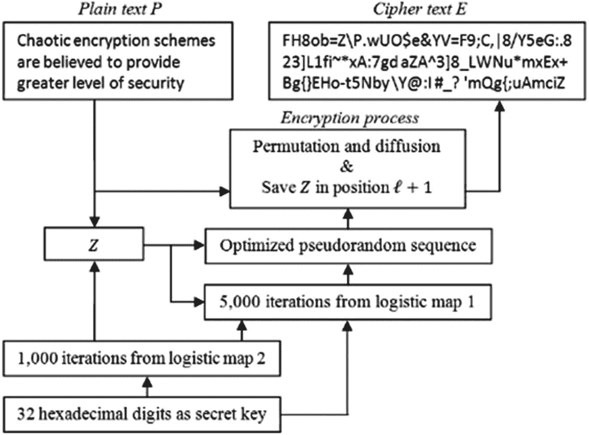

# 十五、基于混沌的密码学

基于混沌的密码学是应用混沌理论及其数学背景来创造新的独特的密码算法。1989 年，罗伯特·马修斯在[ [1](#Par58) ]首次对其进行了研究，并引起了人们极大的兴趣。

与我们每天使用的普通密码原语相比，为了以有效的方式使用混沌理论和系统，混沌映射必须在考虑混淆和扩散的情况下实现。在本章中，我们将使用*混沌系统*的概念来指代加密算法。

为了理解混沌系统和密码算法之间的区别和相似之处，让我们来看看表 [15-1](#Tab1) 中所示的以下关系，这些关系是由 L. Kocarev 在[ [2](#Par59) 中建立的。

表 15-1

混沌系统与密码算法的异同

<colgroup><col class="tcol1 align-left"> <col class="tcol2 align-left"></colgroup> 
| 

`Chaotic System`

 | 

`Cryptographic Algorithm`

 |
| --- | --- |
| `Phase space: subset of real numbers` | `Phase space: finite set of integers` |
| `Iterations` | `Rounds` |
| `Parameters` | `Key` |
| `Sensitivity to a change in initial conditions and parameters` | `Diffusion` |
| `?` | `Security and performance` |

为了展示表 [16-1](#Tab1) 中所示的相似性和差异，我们将把*换挡图* :


作为一个混沌系统的例子来考虑

其中相空间*x*=【0，1】表示单位区间， *a* > 1 表示整数。

不同的函数和离散时间系统已被提出用于密码学。一旦你看了它们，你会看到相空间代表一个有限的整数集合，参数等于整数。一个最常见的例子是由上面作为例子给出的移位映射的离散相空间版本表示:


其中 *a* > 1、 *N* 和 *p* 表示整数，*p*∈【0，1，…、*N*—1】。如果 *N* 与 *a* 互质，则换挡图的第二表示是可逆的。这意味着有限相空间动力系统内的所有轨迹都被特征为周期性的。在这种情况下，您可以看到正在引入的新概念，*周期函数 P* <sub>*N*</sub> 将特征图 *F* 的最小周期，即为其单位， *P* <sub>* N *</sub> 表示最小值，为系统大小 *N* 的函数。

当处理实际的混沌系统时，另一个非常重要的度量是由李亚普诺夫指数来特征的，它通常等于 0。这是因为轨道是周期性的，它会重复自己。

也就是说，我们将给出两个框图(文本加密和图像加密)来展示使用混沌方法的加密方案是什么样子。在图 [15-1](#Fig1) 和图 [15-2](#Fig2) 中，可以看到使用 logistic 映射对一个明文进行加密和解密的过程。对于图像加密和解密，图 [15-3](#Fig3) 给出了一个示例模型。


图 15-3

图像加密密码系统框图[ [15](#Par72)


图 15-2

使用逻辑映射[ [14](#Par71) ]进行文本加密的框图



图 15-1

使用逻辑映射[ [14](#Par71) ]进行文本加密的框图

基于作为示例提出的框图，您可以查看原始论文和本章末尾列出的其他论文，并看到加密模型和构建它们可以根据所使用的混沌映射而有所不同。在开始设计新的方法和混沌加密机制之前，理解特定的混沌映射是如何工作的是非常重要的。使用以下框图作为从理论到实践的实践指南是一个很好的起点，因为模型的创建考虑了表 [15-1](#Tab1) 中列出的相似性和差异性。

## 证券分析

本节将把安全分析称为发现密码系统的弱点和安全漏洞、获得全部或部分加密图像/明文或在不知道算法或解密密钥的情况下找到密钥的方法。

在[ [3](#Par60) 和[ [4](#Par61) 中可以找到一些有趣的对加密图像的攻击。当设计混沌系统或进行密码分析攻击时，考虑以下标准和分析是很重要的:

*   **关键空间分析**。该分析处理寻找解密密钥的尝试次数。这是通过在密码系统的密钥空间内尝试所有可能的密钥来实现的。值得注意的是，密钥空间随着密钥大小的增加而呈指数增长。

*   **关键敏感度分析**。为了有一个好的图像加密系统，密钥的敏感性是重要的，需要加以考虑。如果密钥中只有一位被更改，这将输出完全不同的图像(加密或解密)。

*   **统计分析**。执行这种类型的分析的目的是证明真实图像和加密图像之间的关系。

*   **相关系数分析**。直方图是一种重要的图形工具，用于研究由动态系统的轨迹产生的值的分布。除了直方图分析之外，用于研究普通图像和/或加密图像的相邻像素的相关性的另一个重要工具是基于垂直、水平和对角分布的两个像素的相关性。

*   **信息熵分析**。熵分析用于测试加密算法的鲁棒性。比较普通图像和加密图像的熵是非常重要的。通过这样做，我们能够看到加密图像的熵大约等于 8 位深度。这将有助于我们证明对抗熵攻击的加密技术。

*   **微分分析**。在差分分析的帮助下，我们将确定加密算法对算法中产生的任何微小变化的敏感性。有两个标准用于测试灵敏度。一个是 NPCR(像素数变化率)，第二个是 UACI(统一平均变化强度)。一旦计算出这两个标准，基于高值，我们可以看到在普通图像中发生的任何微小变化的迹象，这将在加密图像中产生显著变化。

## 用于明文和图像加密的混沌映射

在这一节中，我们将介绍基于加密目标(文本加密或图像加密)的混沌映射。

如上所述，表 [15-2](#Tab2) 中列出的大多数图像加密算法都由参考文献中提到的作者使用不同的安全性分析进行了测试。对性能进行验证和对密码系统的健壮性进行评估是非常有用的。根据他们的分析和测试，所有的参考文献都被检查和选择为好的参考文献。

表 15-2

用于图像加密的混沌映射(系统)

<colgroup><col class="tcol1 align-left"> <col class="tcol2 align-left"> <col class="tcol3 align-left"> <col class="tcol4 align-left"> <col class="tcol5 align-left"> <col class="tcol6 align-left"> <col class="tcol7 align-left"></colgroup> 
| 

混沌映射(系统)

 | 

韵律学

 | 

钥匙

 | 

文献学

 |
| --- | --- | --- | --- |
| 

熵

 | 

NPCR(美国国家广播公司)

 | 

阿兵哥

 | 

空间

 | 

敏感性

 |
| --- | --- | --- | --- | --- |
| 罗伦兹面包师 | 7.9973 | - | - | 2 <sup>128</sup> | 高的 | [ [5](#Par62) |
| 罗伦兹 | - | - | - | 大型 | 中等 | [ [6](#Par63) |
| 海农 地图 | 7.9904 | 0.0015% | 0.0005% | 2 <sup>128</sup> | 高的 | [ [7](#Par64) |
| 物流地图 | 7.9996 | 99.6231% | 33.4070% | 10 <sup>45</sup> | 高的 | [ [8](#Par65) |
| 三角地图 | - | 0.25% | 0.19% | 2 <sup>302</sup> | - | [ [9](#Par66) |
| 阿诺德 cat map | 7.9981 | 99.62% | 33.19% | 2 <sup>148</sup> | 高的 | [ [10](#Par67) |
| 切比雪夫地图 | 7.9902 | 99.609% | 33.464% | 2 <sup>167</sup> | 高的 | [ [11](#Par68) |
| 圆形地图 | 7.9902 | 99.63% | 33% | 2 <sup>256</sup> | 高的 | [ [12](#Par69) |
| 阿诺德地图 | - | 0.0015% | 0.004% | - | - | [ [13](#Par70) |

## 实际实施

混沌系统的大部分应用可以在*明文加密*和*图像加密*上看到。正如我们在本书中讨论的其他密码学领域一样，研究团体提供了大量的理论贡献。实际实施的缺乏给研究人员和专业人员带来了多重困难和挑战。

混沌系统加密的实际实现并不多，但是在[ [16](#Par73) ]中可以找到一些实用的方法(这里我们指的是伪代码算法)。该工作有一个非常深入的结构，并给出了一些关于如何通过提供伪代码来实现基于混沌理论的不同密码系统的想法。这项工作涵盖以下密码系统类型:

*   基于混沌的公钥密码

*   密码学中的伪随机数生成

*   高维混沌映射的形成及其在密码学中的应用

*   基于混沌的哈希函数

*   基于混沌的视频加密算法

*   混沌密码的密码分析

*   基于混沌的密码的硬件实现

*   混沌保密光通信系统的硬件实现

在[ [16](#Par73) ]中，从第 [2](02.html) 章开始，作者提出了一个有趣的公钥密码系统，它使用混沌方法，由三个步骤组成:密钥生成算法(见伪代码 15-1)、加密算法(见伪代码 15-2)和解密算法(见伪代码 15-3)。该场景是两个用户实体 Alice 和 Bob 之间的典型通信。让我们看看每个算法的结构，最后我们将提供一个简单的定向实现，作为专业人员未来的参考指南。

*伪代码 15-1。***[*16*](#Par73)**

 ****   必须生成一个大整数 *a* 。

*   根据选择为*p*∈[1，1]的随机数，计算*G*<sub>*a*</sub>(*p*)。

*   爱丽丝将她的公钥设为( *p* 、 *G* ( *p* ))，私钥设为 *a* 。

```cs
Start. Alice will need, before the communication, to generate the keys. For this, she will accomplish the following:

```

*伪代码 15-2。***[*16*](#Par73)**

 ****   获取爱丽丝的可信公钥( *p* ，*G*<sub>T5】a</sub>(*p*))。

*   计算并将消息表示为数字*M*∈[1，1]。

*   生成一个大整数 *r* 。

*   计算*<sub>【r】</sub>(*)，*【g9】*【r】****

***   取密文作为*C*=(*G*<sub>T5】r</sub>(*p*)， *X* )发给爱丽丝。** 

```cs
Start. Bob wants to encrypt a messsage. To achieve this, the following must be done:

```

*伪代码 15-3。* *解密算法**[*16*](#Par73)*

 ***   爱丽丝要用她的私钥 *a* 并计算*G*<sub>T5】a*t*</sub>=*G*<sub>*a*</sub>(*G*<sub>*r*</sub>(*p*)。

*   通过计算获得消息 *M* 。

```cs
Start. Alice wants to read the text and to do this she will have to recover M from the ciphertext C. To achieve this, the following steps are done:

```

基于上面列出的算法，我们将移动到一个实际的实现作为例子。清单 [15-1](#PC4) 展示了基于二维环面的自同构的加密和解密。应用有三个类:类`TorusAutomorphism`(见清单 [15-1](#PC4) )、类`GenerateChaosValues`(见清单 [15-2](#PC5) )和主`Program`类(见清单 [15-3](#PC6) )。该应用已经按照上面的伪代码清单进行了相应的修改。您可以在图 [15-4](#Fig4) 中看到输出。


图 15-4

混沌环面自同构的输出

每个类都有其用途，如下所示:

*   `TorusAutomorphism`类:该类包含处理整个字符串的`char encryption (object CharacterEncryption), char decryption (object CharacterDecryption)`、`main encryption (object[] Encryption)`和`decryption (object[] Decryption)`函数的函数和方法。

*   类:这个类处理自同构的结构函数，比如旋转操作和设置元素的索引。

*   类:类代表应用的主入口点。

```cs
using System;
using System.Collections;
using System.Collections.Generic;
using System.Diagnostics;
using System.IO;
using System.Linq;
using System.Text;
using System.Threading.Tasks;

namespace ChaosSystemCryptography
{
    class Program
    {
        public static void Main(string[] args)
        {
            bool logging = true;
            string key = "$6G";
            string input_value = string.Empty;
            Console.Write("What to you want to do? Encryption
                                          (e) or Decryption (d): ");
            string option = (Console.ReadLine() == "encrypt")
                                                    ? "e" : "d";

            int zero_location = Convert.ToInt32(key[0]);
            int one_location = Convert.ToInt32(key[1]);
            int two_location = Convert.ToInt32(key[2]);

            TorusAutomorphism torus_automorphism = new
                                         TorusAutomorphism();

            GenerateChaosValues generator0 = new
                        GenerateChaosValues((logging == true) ?
                        "generator0" : null);
            GenerateChaosValues generator1 = new
                        GenerateChaosValues((logging == true) ?
                        "generator1" : null);
            GenerateChaosValues generator2 = new
                        GenerateChaosValues((logging == true) ?
                        "generator2" : null);
            GenerateChaosValues[] generators = new
                        GenerateChaosValues[] { generator0,
                        generator1, generator2 };

            generator0.GeneratorRotation(zero_location);
            generator1.GeneratorRotation(one_location);
            generator2.GeneratorRotation(two_location);

            if (option == "e")

            {
                Console.Write("Enter the text for
                                              encryption: ");
                input_value = Console.ReadLine();

                if (logging == true)
                {
                    generator0.PrintInConsole(zero_location);
                    generator1.PrintInConsole(one_location);
                    generator2.PrintInConsole(two_location);
                }

                Console.WriteLine("");
                Console.WriteLine($"The input message:
                                          {input_value}");

                object[] finalValue =
                            torus_automorphism.Encryption(
                                input_value, generators, logging);

                Console.WriteLine("");
                Console.Write("\nThe output message: ");
                for (int j = 0; j < finalValue.Length; j++) {
                           Console.Write($"{finalValue[j]}"); }
            }
            else if (option == "d")
            {
                Console.Write("What is the ciphertext for
                                                decryption: ");
                string ciphertext_input = Console.ReadLine();
                if (logging == true)

                {
                    generator0.PrintInConsole(zero_location);
                    generator1.PrintInConsole(one_location);
                    generator2.PrintInConsole(two_location);
                }
                Console.WriteLine($"\nEncryption for input
                                      string: {ciphertext_input}");
                     object[] finalDecrypted =
                          torus_automorphism.Decryption(ciphertext
                            _input, generators, logging);
                Console.Write("\nThe decrypted text is: ");
                for (int j = 0; j < finalDecrypted.Length;
                                                          j++)
                       { Console.Write(finalDecrypted[j]); }
            }
            Console.WriteLine("\n Press any key to exit...");
            Console.ReadKey();
        }
    }
}

Listing 15-3Main Program

```

```cs
using System;
using System.Collections.Generic;
using System.Linq;
using System.Text;
using System.Threading.Tasks;

namespace ChaosSystemCryptography
{
    class GenerateChaosValues
    {
        private object[] items = new object[94];
        private char last_direction;
        private readonly string generator_ID;

        //** the property will return the index of the item
        //** for a specific value as character
        public int ItemIndex(char inputValue)
        {
            int locationElement;
            locationElement = Array.IndexOf(items,
                                        inputValue);
            return locationElement;
        }

        //** the property will return the index of the item
        //** for a specific value as integer
        public object ItemIndex(int inputValue)
        {
            object locationElement;
            locationElement = items.GetValue(inputValue);
            return locationElement;
        }

        //** constructor
        public GenerateChaosValues(
                        string generator_name = null)
        {
            generator_ID = generator_name;
            for (int i = 32; i <= 125; i++)
            {
                items[i - 32] = (char)i;
            }

        }

        public void GeneratorRotation(int rotation,
                                          char chosen_direction)
        {
            object[] rotation_done = new object[items.Length];
            int length = items.Length;
            int rotation_location = (rotation % length);

            //** the torus will have a right rotation
            if (chosen_direction == 'R')
            {
                for (int in_direction = 0; in_direction <
                                     length; in_direction++)
                {
                    if (rotation_location + in_direction
                                      >= length)
                    {
                        int suplimentary_rotation =
                             rotation_location - (length –
                                               in_direction);
                        rotation_done[suplimentary_rotation] =
                                           items[in_direction];
                    }
                    else
                    {
                        rotation_done[in_direction +
                                    rotation_location] =
                                   items[in_direction];
                    }
                }
                last_direction = 'R';
            }

            else
            {
                for (int in_direction = 0; in_direction <
                                        length; in_direction++)
                {
                    if (rotation_location + in_direction
                                         >= length)
                    {
                        int suplimentary_rotation =
                                  rotation_location - (length –
                                      in_direction);
                        rotation_done[in_direction] =
                                 items[suplimentary_rotation];
                    }
                    else
                    {
                        rotation_done[in_direction] =
                               items[in_direction +
                               rotation_location];
                    }
                }
                last_direction = 'L';
            }
            Array.Copy(rotation_done, items,
                             rotation_done.Length);

        }
        public void GeneratorRotation(int rotation)
        {
            object[] rotation_done = new object[items.Length];
            int length = items.Length;
            int rotation_location = (rotation % length);

            for (int in_direction = 0; in_direction < length;
                                              in_direction++)
            {
                if (rotation_location + in_direction
                                              >= length)
                {
                    int suplimentary_rotation =
                          rotation_location –
                                (length - in_direction);
                    rotation_done[suplimentary_rotation] =
                                        items[in_direction];
                }

                else
                {
                    rotation_done[in_direction +
                              rotation_location] =
                              items[in_direction];
                }
            }
            last_direction = 'R';
            Array.Copy(rotation_done, items,
                              rotation_done.Length);
        }
        public void PrintInConsole(int rotated = 0)
        {
            Console.Write($"{generator_ID} rotated {rotated}
            {((last_direction == 'L') ? "left" : "right")}: ");
            for (int i = 0; i < items.Length; i++)
            {
                Console.Write($"{items[i]}, ");
            }
            Console.WriteLine("");
        }
    }
}

Listing 15-2Generating Chaotic Values for Torus

```

```cs
using System;
using System.Collections.Generic;
using System.Linq;
using System.Text;
using System.Threading.Tasks;

namespace ChaosSystemCryptography
{
    class TorusAutomorphism
    {
        private object CharacterEncryption(char
                  input_characters, GenerateChaosValues[]
                  iterations, int generators, bool logging)
        {
            int spotted_difference;
            spotted_difference = iterations[(generators % 2 ==
                   0) ? 0 : 1].ItemIndex(input_characters);
            foreach (GenerateChaosValues iteration_generator
                                              in iterations)
            {
               iteration_generator.GeneratorRotation(
                             spotted_difference, 'L');
                if (logging == true) {
                       iteration_generator.PrintInConsole(
                            spotted_difference + generators); }
            }
            return iterations[2].ItemIndex(0);
        }

        public object[] Encryption(string input_locations,
                        GenerateChaosValues[]
                        generators_locations, bool logging)
        {
            object[] finalOutputObject = new
                             object[input_locations.Length];
            for (int i = 0; i < input_locations.Length; i++)
            {
                finalOutputObject[i] =
                        CharacterEncryption(input_locations[i],
                        generators_locations, i, logging);
            }
            return finalOutputObject;
        }

        private object CharacterDecryption(char
                        input_characterst, GenerateChaosValues[]
                        iterations, int generators, bool
                        logging)
        {
            int spotted_difference;
            spotted_difference =
                   iterations[2].ItemIndex(input_characterst);
            foreach (GenerateChaosValues
                   iteration_generator in iterations)
            {
                   iteration_generator.GeneratorRotation(
                        spotted_difference, 'L');
                if (logging == true) {
                    iteration_generator.PrintInConsole(
                        spotted_difference + generators); }
            }
            return iterations[(generators % 2 == 0) ?
                              0 : 1].ItemIndex(0);
        }

        public object[] Decryption(string
                              encryption_locations,
                              GenerateChaosValues[]
                              generators_locations, bool logging)
        {
            object[] finalOutputObject = new
                       object[encryption_locations.Length];
            for (int i = encryption_locations.Length - 1;
                                              i >= 0; i--)
            {
                finalOutputObject[i] =
                     CharacterDecryption(encryption_locations[i],
                            generators_locations, i, logging);
            }
            return finalOutputObject;
        }
    }
}

Listing 15-1Chaos Encryption/Decryption

Using Torus Automorphism

```

## 结论

在这一章中，我们讨论了一种有趣的加密方法，基于混沌的加密。新的密码算法正在使用混沌映射以不同于过去使用的方式生成新的密码原语。

在本章结束时，您现在已经了解了以下内容:

*   基于混沌的密码原语是如何构建的，以及它们与普通密码原语的不同之处

*   混沌系统如何设计用于文本加密和图像加密

*   如何用混沌系统和自同构环面实现一个密码系统

## 文献学

1.  罗伯特·马修斯，“关于‘混沌’加密算法的推导”，载于 *Cryptologia 13* ，第 1 期(1989): 29-42 页。

2.  长度 Kocarev，“基于混沌的密码学:概述”，IEEE 电路和系统杂志，第 1 卷，第 3 期，第 6-21 页，2001 年，doi: 10.1109/7384.963463。

3.  Ali Soleymani、Zulkarnain Md Ali 和 Md Jan 诺丁，“关于安全图像传输的主要方面的调查”，载于*世界科学、工程和技术学院，2012 年第 66 期*，第 247–254 页。

4.  D.Chattopadhyay、M. K. Mandal 和 D. Nandi，“使用圆映射的对称密钥混沌图像加密”，载于*印度科技期刊*，第 4 卷第 5 期(2011 年 5 月)ISSN: 0974- 6846，第 593-599 页。

5.  Anto Steffi 和 Dipesh Sharma，“使用混沌映射对图像进行加密和解密的改进算法”，载于*《国际科学与研究杂志(IJSR)】*，印度在线 ISSN: 2319-7064，第 2 卷第 2 期，2013 年 2 月。

6.  K.Sakthidasan Sankaran 和 B.V. Santhosh Krishna，“一种用于数字彩色图像加密和解密的新混沌算法”，载于*国际信息与教育技术期刊*，第 1 卷第 2 期，2011 年 6 月。

7.  Somaya Al-Maadeed、Afnan Al-Ali 和 Turki Abdalla，“一种新的基于混沌的图像加密和压缩算法”，载于*电气和计算机工程杂志*，2012 卷，文章 ID 179693，Hindawi 出版公司。

8.  Hazem Mohammad Al-Najjar 和 Asem Mohammad AL-Najjar，“基于逻辑映射和像素映射表的图像加密算法”

9.  索德伊夫·阿哈德普尔和亚塞尔·萨德拉，“使用混沌耦合映象格子的基于混沌的图像加密方案”

10.  Kamlesh Gupta 和 Sanjay Silakari，“使用混沌映射进行快速彩色图像加密的新方法”，载于*信息安全杂志*，2011 年 2 月 139-150 日。

11.  崇富，，，孟伟红，，杨勇，雅文，“一种基于混沌的改进扩散策略的数字图像加密方案”，美国光学学会，【2012 年 1 月 30 日，第 20 卷第 3 期，第 2363–2378 页。

12.  D.Chattopadhyay、M. K. Mandal 和 D. Nandi，“使用圆映射的对称密钥混沌图像加密”，载于*印度科技期刊*，第 4 卷第 5 期，2011 年 5 月，ISSN: 0974- 6846，第 593-599 页。

13.  Shima Ramesh Maniyath 和 Supriya M，“一种基于 DNA 序列的未压缩图像加密算法”，载于*计算机科学&信息技术(CS & IT)* ，CCSEA 2011，CS & IT 02，第 258–270 页。

14.  Miguel Murillo-Escobar，“基于逻辑映射的新型对称文本加密算法”，2014 年。

15.  K.Sakthidasan 和 B. V. Santhosh Krishna，“数字彩色图像的图像加密和解密的新协同算法”载于*《国际信息与教育技术杂志》*，第 1 卷，第 2 期，2011 年 6 月。网上有: [`http://www.ijiet.org/papers/23-E20098.pdf`](http://www.ijiet.org/papers/23-E20098.pdf) 。

16.  柳普科科卡列夫和连信国。*基于混沌的密码学——理论、算法和应用*。斯普林格，2011 年。**********