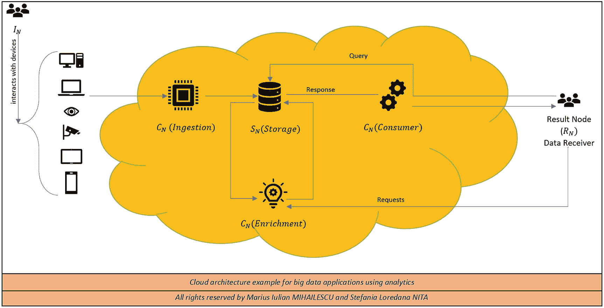
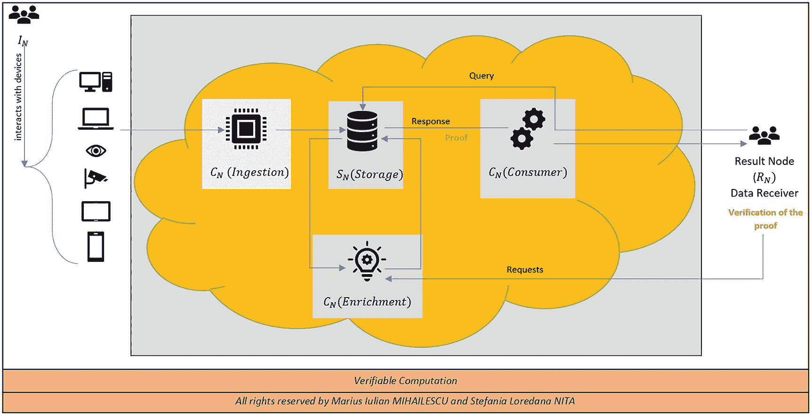
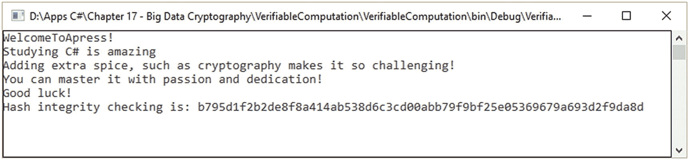
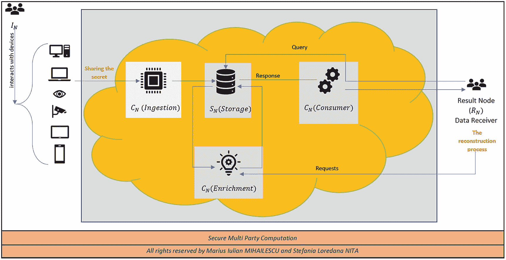
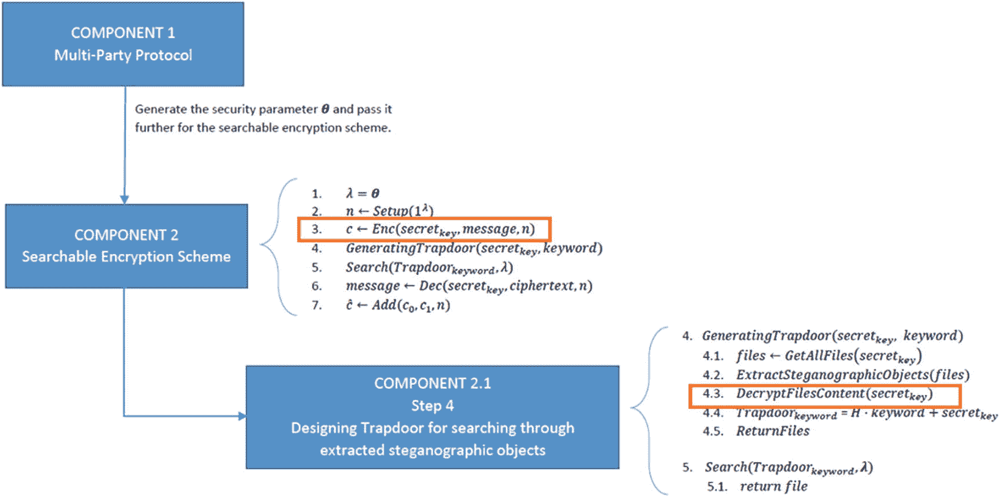
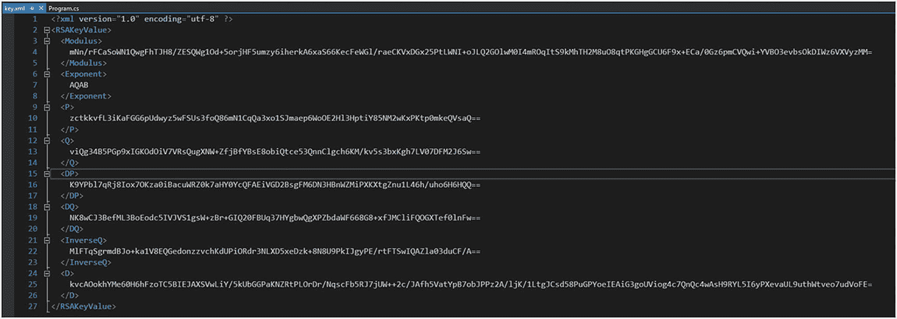
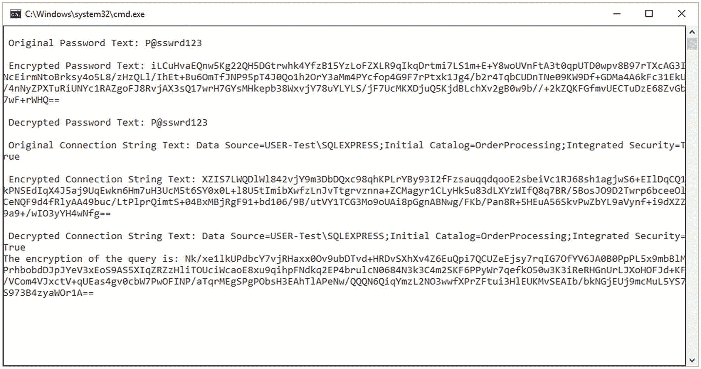

# 十六、大数据加密

*大数据*被定义为提取、操纵和分析无法正常处理的大规模数据集(例如 TB 或 Pb 的数据)的过程。

大数据加密处理确保数据的机密性、完整性和真实性。这是一个敏感的话题，需要小心对待，因为每个业务和架构环境的计算模型都是不同的。大数据加密不同于其他加密原语，因为在访问控制策略、云基础架构和存储机制方面，概念和方案的设计方式不同。

本章将从基于云环境的通用计算模型开始，这将允许并促进基于大数据分析的应用。我们将首先根据云计算节点在大数据分析中扮演的角色对其进行分类。我们的旅程基于[[3](#Par45)，我们将通过定义以下节点来稍微扩展符号:

*   *I* <sub>*N*</sub> 是用于正被使用的应用的原始数据的*输入节点*。这种节点用于前端用户输入的数据或来自读取或捕获传感器(如指纹读取器、全息签名、人脸识别等)的数据。).

*   *C* <sub>*N*</sub> 是*计算节点，*由于应用的计算过程而发挥重要作用。这种节点基于并包括摄取节点，在我们的例子中，我们称之为*消费节点*。他们的目标是扫描输入数据并对其进行提炼，以便为分析过程做好准备，并准备好传递给*富集节点*，目标是实际的分析处理*。*

*   *S* <sub>*N*</sub> 是*存储节点，*对于对数据应用加密机制非常重要。它的作用是存储在不同类别的用户或第三方之间发生的计算过程中发现的数据。理解*输入数据*和*输出数据*存储在该节点内非常重要。

*   *R* <sub>*N*</sub> 是*结果节点，*处理接收正在执行的一些计算过程的输出。它能够自动决定是使用上面的输出作为基础，还是将输出发送到特定的客户端。

图 [16-1](#Fig1) 显示了基于上述概念的大数据分析云架构示例。该模型可以被视为描述基于大数据的各种应用的模式。话虽如此，我们将注意到以下一组或多组类型为 *H* 的节点，如下所示*H*T6】+，其中*H*∈{*I*<sub>*N*</sub>， *C* <sub>*N*</sub> ， *S* <sub>*N*</sub>



图 16-1

具有大数据分析应用的云架构示例

在图 [16-1](#Fig1) 中，你可以看到一个通用的云模型，它是一个查询数据集的应用的例子。示例中的*I*<sub>T5】N</sub>表示启动收集参考数据集过程的工具。序列数据由输入节点发送到*C*<sub>*N*</sub>(*摄取*)节点。这里，计算过程是针对需要被解析的序列进行的，并且在过程结束时被组织到文件或数据库中。下一步是将文件和数据库发送到*S*<sub>*N*</sub>(*存储*)。有时，*C*<sub>*N*</sub>(*浓缩*)会对存储的数据执行额外的计算。这个过程大部分时间是离线完成的，方法是根据用户的需求更新相关的元数据。在我们的示例中，*R*<sub>*N*</sub>(*数据接收者*)代表将数据集与参考数据集关联的用户。

云计算对于在其实体之间传输的任何敏感数据都有一定的风险。为了实现云中加密技术提供的保护，我们将从三个最重要的安全目标来考虑安全性，即 CIA(机密性、完整性和可用性):

*   **机密性**:敏感数据，严格地说是指计算输入和输出，必须保持秘密，以防止不受信任的一方或其他潜在的对手。

*   **完整性**:必须尽快检测出任何未经授权更新敏感数据的修改。

*   **可用性**:数据所有者可以访问数据和计算资源。

让我们关注一下*可用性、*，因为它在当今大多数云环境中都没有任何加密手段。我们将需要在云计算的保密性和完整性以及如何存储数据上做出让步。如何部署云将决定如何实现机密性和完整性。从一开始就确定谁控制云的每个组件以及组件之间的信任度是非常重要的。基于此，我们将考虑以下场景:

*   **可信云**:这种类型的云由政府部署，它与任何外部网络和对手完全隔离。用户和客户可以存储他们的文件，而不用担心它们会被破坏或被盗。这并不意味着完全隔离将提供全面保护。一些节点是暴露的，它们很容易被恶意软件或内部人员破坏。

*   **半可信云**:这是一个有趣的场景，因为它是云资源的真实部署。在这种类型的云中，客户端不需要完全信任云，同时也没有指定/提到云是完全不可信的。相反，云的一些部分和组件处于控制之下，提供了在特定时间监控对手活动的解决方案。

*   **不受信任的云**:数据的所有者不信任云或任何云节点。在这种情况下，我们将无法保持和提供外包给云的数据或计算的一定程度的机密性或完整性。在这种情况下，客户需要有解决方案和保护措施，以确保机密性和完整性。这种模式被分配给公共云。

在我们经历了一些基本元素以形成云计算和大数据的基础之后，可以在这种环境中应用以确保大数据基础架构中数据安全性的*加密技术*非常复杂，如果没有专用的第三方软件库或经验丰富的专业人员，它们的适用性很难实现。

在本章中，我们将重点介绍三种加密技术，它们特别适用于实现部署在云中的大数据应用的安全性:

*   同形加密(HE)在第 [13 章](13.html)中介绍。

*   可验证计算(VC)代表了本章的第一个目标。

*   安全多方计算(MPC)是本章的第二个目标。

还有其他加密技术可以成功应用于实现云计算的安全性，例如

*   功能加密

*   基于身份的加密

*   基于属性的加密

此外，我们将专注于我们认为有前途并可应用于真实环境的技术。这并不是说 FE、IE 或 AE 等加密类型在真实环境中不具有适用性，而是此时此刻，许多作品都是基于理论假设，并且它们中的大多数是在没有考虑到商业和行业应用的要求和需求的情况下编写的。从理论到实践是一条漫长的道路，需要理论家和实践者携手同行。他们需要坐在圆桌旁，找到当今真正重要的问题的解决方案，以解决存在的问题和差距。

## 可验证的计算

可验证计算，或可验证计算，是一台或多台计算机将某些功能的计算量卸载给其他人(如具有不可信状态的客户端)的可能性，同时结果被连续验证。见图 [16-2](#Fig2) 。



图 16-2

可验证的计算场景。云的节点没有任何完整性保护的信任级别。

VC 在真实环境中一个非常有趣的应用是 Merkle 树，目的是验证数据的完整性。对于大数据环境，Merkle 树被定义为可用于验证项目、数据、行、数据集合等不同属性的完整性的数据结构。Merkle 树的好处是它可以处理大量的数据。将可验证的计算算法与 Merkle 树结合起来，在这个方向上已经取得了进展。

在清单 [16-1](#PC1) 中，我们将展示一个场景，其中 Merkle 树用于验证来自部署在大数据环境中的数据库的数据。这个例子只是一个模拟(见清单 [16-2](#PC2) 和图 [16-3](#Fig3) )。在真实的大数据环境中部署应用需要进行适当的调整。



图 16-3

哈希校验完整性

```cs
using System;
using System.Collections.Generic;
using System.Linq;
using System.Text;
using System.Threading.Tasks;

namespace VerifiableComputation
{
    class Program
    {
        static void Main(string[] args)
        {
            //** the following items can be seen as big data
            //** items from a database
            //** as being the result of a query
            List<string> bigdata_items = new List<string>
            {
                "WelcomeToApress!",
                "Studying C# is amazing",
                "Adding extra spice, such as cryptography
                   makes it so challenging!",
                "You can master it with passion and
                 dedication!",
                "Good luck!"
            };

            MerkleTreeImplementation tree = new
                      MerkleTreeImplementation(bigdata_items);

            foreach (string s in tree.BigDataOriginalItems)
            {
                Console.WriteLine(s);
            }
            Console.WriteLine("Hash integrity checking is:
                                        {0}", tree.GetRoot());
            Console.ReadKey();
        }
    }
}

Listing 16-2Simple Example of a Merkle Tree as Support for the Practibility of Verifiable Computation

```

```cs
using System;
using System.Collections.Generic;
using System.Linq;
using System.Security.Cryptography;
using System.Text;
using System.Threading.Tasks;

namespace VerifiableComputation
{
    class MerkleTreeImplementation
    {
        private List<string> bigDataItems;
        private List<string> bigDataOriginalItems;

        public List<string> BigDataOriginalItems
        {
            get => bigDataOriginalItems;
            private set
            {
                bigDataOriginalItems = value;
                bigDataItems = value;
            }
        }

        public MerkleTreeImplementation(List<string> BigData_OriginalItems)
        {
            BigDataOriginalItems = BigData_OriginalItems;
            CreateTree();
        }

        public string GetRoot()
        {
            return bigDataItems[0];
        }

        private void CreateTree()
        {
            var data_items = bigDataItems;
            var temporary_data_items = new List<string>();

            //** using 2 element go and parse
           //** the list for items
            for (int i = 0; i < data_items.Count; i += 2)
            {
                //** Take the left element
                string left_element = data_items[i];

                //** the element from right is empty
                string right_element = String.Empty;

                //** once we have the proper item we will need
                //** to replace the empty string from above
                //** with the proper one
                if (i + 1 != data_items.Count)
                    right_element = data_items[i + 1];

                //** compute the hash for the left value
                string leftHash = HashTheBigData(left_element);

                //** if we we have the item from
                //** right as being empty we will hash it
                string rightHash = String.Empty;
                if (right_element != String.Empty)
                    rightHash = HashTheBigData(right_element);

                //** if we have the hash for right empty, we
                //** will add the sum of the left with right
                //** into temporary_items
                if (right_element != String.Empty)
                    temporary_data_items.Add
                                      (leftHash + rightHash);
                //** contrary, we will add the left hash only
                else
                    temporary_data_items.Add(leftHash);
            }

            //** if the size of the list is different from 1
            if (data_items.Count != 1)
            {
                //** once we are here we will replace replace
                //** bigDataItems with temporary_data_items
                bigDataItems = temporary_data_items;

               //** call again the function
                CreateTree();
            }
            else
                //** once we get 1 item then we can say that
                //** we have the root for the tree.
                //** we will save it at bigDataItems
                bigDataItems = temporary_data_items;
        }
        private string HashTheBigData(string bigData)
        {
            using (var sha256 = SHA256.Create())
            {
                //** use some big data volume
                byte[] hasshed_bytes_of_bigdata =
                  sha256.ComputeHash(Encoding.UTF8.
                                     GetBytes(bigData));

                //** take the hash value
                //** and work with it accordingly
                string current_hash_bigdata_value =
                       BitConverter.ToString(hasshed_bytes_of_b
                       igdata).Replace("-", "").ToLower();
                return current_hash_bigdata_value;
            }
        }
    }
}

Listing 16-1Implementation of a Merkle Tree as a Solution for a Simple Case of Verifiable Computation

```

## 安全多方计算

多方计算(MPC)代表了密码学的一个子领域，其主要目标是为多方提供方法，以加入对其输入的函数的计算过程，并秘密存储这些输入。在[ [10](#Par52) ]中，作者将 MPC 与可搜索加密相结合，以便为在真实的复杂环境中应用 MPC(见图 [16-4](#Fig4) )提供一个实际的开端，如大数据和云计算。



图 16-4

安全多方计算

在[ [13](#Par55) ]中，Claudio Orlandi 讨论了一个关于 MPC 适用性的有趣问题和担忧。在将 MPC 作为一种独立的机制在真实环境中使用之前，需要填补多项技术空白。事实上，研究社区已经提供了大量与 MPC 相关的文章，但是 80%以上都是纯理论，没有任何正确应用它的方向或意义。作者在[ [6](#Par48) - [9](#Par51) ]和[ [11](#Par53) ]中对此方向做了其他贡献。

基于图 [16-4](#Fig4) 中描述的 MPC 场景，我们将考虑以下 MPC 场景，其组件来自图 [16-5](#Fig5) 。在[ [10](#Par52) 中提出了 MPC 场景，它代表了 MPC 与可搜索加密方案和隐写对象的组合，隐写对象用作唯一识别存储在云和大数据环境中的文件和数据的标识符。为了实现 MPC 协议中数据的安全性，我们将重点介绍*加密*(图 [16-4](#Fig4) 中的**步骤 3** )和*解密*(图 [16-5](#Fig5) 中的**步骤 4.3** )。下面提出的算法是针对大数据应用而设计的，并且已经在真实环境中进行了测试，用于天气预报和分析，如[ [10](#Par52) 中所述。加密和解密(参见清单 [16-3](#PC3) 和 [16-4](#PC4) )是通过 RSA 算法(参见图 [16-7](#Fig7) )实现的，该算法经过适当调整和设计，适用于大量数据。



图 16-5

大数据中的 MPC

它与普通 RSA 实现的不同之处在于私钥被表示为一个 XML 文件(见图 [16-6](#Fig6) )。您可以看到用于 RSA 初始化的所有必要参数。



图 16-6

RSA XML 私钥

```cs
using System;
using System.Security.Cryptography;
using System.Text;

namespace RSACryptography
{
   public static class CryptographyHelper
    {
       private static bool asymmetricEncryptionPadding = false;

       //** keys of 2048 bytes length
       private readonly static string public_key = "MjA0OCE8UlNBS2V5VmFsdWU+PE1vZHVsdXM+djFTTVVyYk5SZW50VDEya0FhWXNRMEh3Y2hjWG9nbnFUWGpYd1NXaGR5Qi9aaTQ5VnF4L0lFdWxSaGFhVjdHOUtENWRmY0I4eEZaZGgyNGJ0MHpZbGFNTlFyRVBNNnQzUEdvZXZmMXVCby9wVnhlcWFocEFkWkIwelNJcjhwTk5UOW52czV5WEN1Q00xRFo0UUR3Q3A3b2U2aXc2ZHZ4VEZNWFZJdW9rSkcrdmlFMWhORDhnbGg0dFVsMWVBdThKT3YyR0tyWmhvTmUxK2tnRzNNUmRueEFGTDQyRDl4eWF5NERvcmpGL2ZjYWNNc3dFYkM3MUo2bFNobnR2YnQ1RnY0elY1bkg0aDhqYzhnV1dQVDUvWG16TElLMmlJRDJ6L3NyeGgvbzdMRkRhWVhXMnVwbUt5VUJQR2k0OGJLUVZKT3JjZU9rd3owWE1nTDFJUk4yWnhRPT08L01vZHVsdXM+PEV4cG9uZW50PkFRQUI8L0V4cG9uZW50PjwvUlNBS2V5VmFsdWU+";
       private readonly static string private_key = "MjA0OCE8UlNBS2V5VmFsdWU+PE1vZHVsdXM+djFTTVVyYk5SZW50VDEya0FhWXNRMEh3Y2hjWG9nbnFUWGpYd1NXaGR5Qi9aaTQ5VnF4L0ldWxSaGFhVjdHOUtENWRmY0I4eEZaZGgyNGJ0MHpZbGFNTlFyRVBNNnQzUEdvZXZmMXVCby9wVnhlcWFocEFkWkIwelNJcjhwTk5UOW52czV5WEN1Q00xRFo0UUR3Q3A3b2U2aXc2ZHZ4VEZNWFZJdW9rSkcrdmlFMWhORDhnbGg0dFVsMWVBdThKT3YyR0tyWmhvTmUxK2tnRzNNUmRueEFGTDQyRDl4eWF5NERvcmpGL2ZjYWNNc3dFYkM3MUo2bFNobnR2YnQ1RnY0elY1bkg0aDhqYzhnV1dQVDUvWG16TElLMmlJRDJ6L3NyeGgvbzdMRkRhWVhXMnVwbUt5VUJQR2k0OGJLUVZKT3JjZU9rd3owWE1nTDFJUk4yWnhRPT08L01vZHVsdXM+PEV4cG9uZW50PkFRQUI8L0V4cG9uZW50PjxQPi8yY1VJS2RlMFB1b2RVaDJQQ3krbFU0aWFvVWtOZ0dOOVhHNmhvcll3c1ovbzdwdTJYZjZmS2E5M09OZ1R0NUpqaW5QL3grZG9ibmFiU1hNNFNwRGJlb3JVRGZBKzhYeDIxTHBCT0FtYUtUVWlkejNjMHlQRXBQZ3lOMlpVb3poUWhjejZlUk01cUdQSlgxU29WMjczM3ZUREFtTEVWS0N4eFRZOHVNSWI3OD08L1A+PFE+djhjYlBmcHh5aXZUelhsV2Q5L3hNK3pRUlJRSk4rTDFIYURiNHYxKzU3dExEb3VlcG03ajI0MkJFZ2U4dTNENmJEanZneWhBWFIxV3IwR09KSjBBb1ZPV2FLLzdvZ3NHZjBnM1dzNzVicWtWSmdNTHZETnFxSVVVd0ZqZml3TllONkJnN0dIdGl2S0VGdmJldTEzcGFxVERyTnFuV0ZQaWFQK1lkQ09xVjNzPTwvUT48RFA+eWVSVDF0UTNjWC9kMUlocFhud0lVOEltRm9vVTY5UWl3YWtiUjR1dWVabXNBR001aVJMOG9WaTFzVXpVTHNRczVRSk1kMklvbTFWdFF1YWtwRUZpZUJxcURvbGtOaUp0WTNDUTN0Zkp4T0szV0J1aVNEUjJ6THEwOEZPc0JjTnp0V2plRXIvendrUm9BYnlsZXdXN281Z2dadDJNWHk4WVRnTSsxQkYvODhVPTwvRFA+PERRPlRGOUxYd1JFbW9HWHFJVkF4UjVlblJJYTR0ZVcwRFhHN1pTbzNKMmRFMFhJSHpQRTYzelBxeGlRSlJFRnZSUEI5cVU1NU41N3UxazZzektGRzltV2JhaXZCbVBHN3dJN0JTZEtQQlNleXMzMUNSMC9hQ1NGdmpTNVRkeFdzYktVU0JyTFhuZWxOS2RkcVJPSkljN0ZiTjNPdXlDY2NoVjkzZGlqNnVSbEtzOD08L0RRPjxJbnZlcnNlUT5rSmYwVHZoNDZjTEQ4OElIVVZ0V3hYaDVsYlNUTWw2ZnB5cFhhUU9laUtpTy9XcnZic21waXdBVEhDQ0pERDhYdDFwbTc5K0hrc21sUjlrYktXR2U4WmNqZHJHdUZlZ3NDUGRpT3VGMVN0a283NWtnblJVY0ZTb1hxSzF1YVgvTWsxTEtDbVpZY3djQ0t2VC9OQUZrWVpVdVNqT3pPckVrRk9VNDdML3VDVE09PC9JbnZlcnNlUT48RD5HbTMyZUZLU0pvODYzZFRFbkFtMVlaRVJRdUZYdldWN1BUcHRLMXdrWXMxVmErc0ZSQnpON3Nza1NIdEUxTXBUbytTQmk2WjBWYmJNY3JIT0dGTUFOQ055Nkh5RzZnOU1pRWJzZWpndzQ2MHJnWUZlWkF1K1RiOG5zMUorR2FNcGNkZGNHa2FPUXMxa0JzaURjZlFZTmMwckNoUVQrMjI5bUVmL3VqUDN6Q1IzcUNzdkZjVTRuMkMwZzBYSWhLQ1dHYXRsbW5MOW9FMWN0MzY4aWZYK0JCUVljUExqSE05TTZaSU9pMWtmR3M2bXhaT0V3cm1BWFB0T0ZweW1tNlZjMUM4WGtVUENCVERtWUZTSFpiaHNaT09IZHpaVVlUa2lmN1VzRk40MjdTSDVrMTNpQTVGRGJTb053bW9kQ0ZrWitENGJNQ2JUZWgwVTNvell6M3FnM1E9PTwvRD48L1JTQUtleVZhbHVlPg==";

       public static string Encrypt(string clearText)
       {
           int size_of_the_key = 0;
           string xmlWithPublicKey = "";

           GetKeyFromEncryptionString(public_key, out size_of_the_key, out xmlWithPublicKey);

           var encrypted = Encrypt(Encoding.UTF8.GetBytes(clearText), size_of_the_key, xmlWithPublicKey);

           return Convert.ToBase64String(encrypted);
       }

       private static byte[] Encrypt(byte[] data, int keySize, string publicKeyXml)
       {
           if (data == null || data.Length == 0)
                throw new ArgumentException("There is empty data", "data");

           int maximum_length = GetMaxDataLength(keySize);

           if (data.Length > maximum_length)
                throw new ArgumentException(String.Format("The maximum length of data is {0}", maximum_length), "data");

           if (!IsKeySizeValid(keySize))
                throw new ArgumentException("The size of the key is not valid", "keySize");

            if (String.IsNullOrEmpty(publicKeyXml))
                throw new ArgumentException("The key is null or empty", "publicKeyXml");

           using (var provider = new RSACryptoServiceProvider(keySize))
           {
               provider.FromXmlString(publicKeyXml);
               return provider.Encrypt(data, asymmetricEncryptionPadding);
           }
       }

       public static string Decrypt(string encryptedText)
       {
           int keySize = 0;
           string publicAndPrivateKeyXml = "";

           GetKeyFromEncryptionString(private_key, out keySize, out publicAndPrivateKeyXml);

           var decrypted = Decrypt(Convert.FromBase64String(encryptedText), keySize, publicAndPrivateKeyXml);

           return Encoding.UTF8.GetString(decrypted);
       }

       private static byte[] Decrypt(byte[] data, int keySize, string publicAndPrivateKeyXml)
       {
           if (data == null || data.Length == 0)
                throw new ArgumentException("The data is empty", "data");

            if (!IsKeySizeValid(keySize))
                throw new ArgumentException("The size of the key is not valid", "keySize");

            if (String.IsNullOrEmpty(publicAndPrivateKeyXml))
                throw new ArgumentException("The key is null or empty", "publicAndPrivateKeyXml");

           using (var provider = new RSACryptoServiceProvider(keySize))
           {
               provider.FromXmlString(publicAndPrivateKeyXml);
               return provider.Decrypt(data, asymmetricEncryptionPadding);
           }
       }

       private static int GetMaxDataLength(int keySize)
       {
           if (asymmetricEncryptionPadding)
           {
               return ((keySize - 384) / 8) + 7;
           }
           return ((keySize - 384) / 8) + 37;
       }

       private static bool IsKeySizeValid(int keySize)
       {
           return keySize >= 384 && keySize <= 16384 && keySize % 8 == 0;
       }

       private static void GetKeyFromEncryptionString(string rawkey, out int keySize, out string xmlKey)
       {
           keySize = 0;
           xmlKey = "";

           if (rawkey != null && rawkey.Length > 0)
           {
               byte[] keyBytes = Convert.FromBase64String(rawkey);
               var stringKey = Encoding.UTF8.GetString(keyBytes);

               if (stringKey.Contains("!"))
               {
                   var splittedValues = stringKey.Split(new char[] { '!' }, 2);

                   try
                   {
                       keySize = int.Parse(splittedValues[0]);
                       xmlKey = splittedValues[1];
                   }
                   catch (Exception e) { }
               }
           }
       }
    }
}

Listing 16-4

CryptographyHelper Class

```

```cs
using System;

namespace RSACryptography
{
    class Program
    {
        public static void Main(string[] args)
        {
            // encryption and decryption a password example
            var password = "P@sswrd123";

            Console.WriteLine("\n Original Password Text: " +
                                          password);

            var textToBeEncrypted =
                              CryptographyHelper.Encrypt(password);
            Console.WriteLine("\n Encrypted Password Text: " +
                                     textToBeEncrypted);

            var textToBeDecrypted =
                  CryptographyHelper.Decrypt(textToBeEncrypted);
            Console.WriteLine("\n Decrypted Password Text: " +
                                       textToBeDecrypted);

            //** encryption and decryption for database
           //** connection string
            var connectionString = "Data Source=USER-
                        Test\\SQLEXPRESS;Initial
                        Catalog=OrderProcessing;Integrated
                        Security=True";

            Console.WriteLine("\n Original Connection String
                                     Text: " + connectionString);

            textToBeEncrypted =
                CryptographyHelper.Encrypt(connectionString);
            Console.WriteLine("\n Encrypted Connection String
                                   Text: " + textToBeEncrypted);
            textToBeDecrypted =
                CryptographyHelper.Decrypt(textToBeEncrypted);
            Console.WriteLine("\n Decrypted Connection String
                                 Text: " + textToBeDecrypted);

            //** encryption and decryption of a very long
            //** query result from DB
            var longTextForEncryption = "Literally, Blockchain is a chain of blocks which could be simply assumed as an immutable data structure. Immutability is one of the most prominent features of a blockchain, which leads us to build trust in completely unreliable environments

.";

           Console.WriteLine("The encryption of the query is:
                  {0}",
                  CryptographyHelper.Encrypt
                         (longTextForEncryption));

            Console.ReadKey();
        }
    }
}

Listing 16-3RSA

for Big Volumes of Data (Encryption and Decryption Operations)

```



图 16-7

大数据量和其他类型字符串的加密/解密输出。

对于类`CryptographyHelper`和`RSACryptographyKeyGenerator`，请参见 GitHub 资源库中的完整项目。

## 结论

在本章中，我们讨论了拥有大数据环境的重要性，以及如何通过不同的加密机制实现安全性，例如可验证计算和多方计算。

在本章结束时，您现在已经了解了以下内容:

*   云和大数据环境中的主要安全概念

*   如何实现复杂的密码原语和协议，如可验证计算和多方计算

## 文献学

1.  页（page 的缩写）Laud 和 A. Pankova，“诚实多数的多方协议中的可验证计算”，载于 S.S.M. Chow、J.K. Liu、L.C.K. Hui 和 S.M. Yiu (eds) *可证明的安全性。ProvSec 2014。计算机科学讲义，第 8782 卷*。施普林格，查姆。2014.

2.  D.安全多方计算的遗忘排序算法的实际分析。在 K. Bernsmed 和 S. Fischer-Hübner (eds) *安全信息技术系统。NordSec 2014。计算机科学讲义，第 8788 卷*。施普林格，查姆。2014.

3.  D.Bogdanov、L. Kamm、S. Laur 和 p . prulmann-Vengerfeldt，“安全多方数据分析:最终用户验证和实践实验”，2014 年。

4.  B.奥兹卡马克，a . özbi̇len，u .亚瓦诺格鲁，k . ci̇n，“大数据中的神经和量子密码术:综述”，2019 年 IEEE 大数据国际会议(大数据)，美国加利福尼亚州洛杉矶，2019 年，第 2413-2417 页，doi:10.1109/big data 47090 . 20193409

5.  南 Yakoubov，V. Gadepally，N. Schear，E. Shen 和 A. Yerukhimovich，“保护云中大数据分析的加密方法综述”，发表于 *2014 年 IEEE 高性能极限计算会议(HPEC)* ，马萨诸塞州沃尔瑟姆，2014 年，第 1-6 页，doi:10.1109/hpec . 2014 . 111191991

6.  基于椭圆曲线的可搜索加密方案。在 Barolli L .、Amato F .、Moscato F .、Enokido T .、Takizawa m .*编的《Web、人工智能和网络应用。怀娜 2020。智能系统和计算进展，第 1150 卷*。施普林格，查姆。2020.

7.  《云计算的混合可搜索加密方案》在 J.L. Lanet 和 C. Toma (eds) *创新的信息技术和通信安全解决方案。SECITC 2018。计算机科学讲义，第 11359 卷*。施普林格，查姆。2019.

8.  动词 （verb 的缩写）C. Pau 和 M. I. Mihailescu，“物联网及其在生物识别技术和电子学习应用中的作用”，载于 *2015 年第十三届现代电气系统工程国际会议(EMES)* ，(第 1-4 页)Oradea。doi:10.1109/emes . 2015.7158430 . 2015。

9.  南 L. Nita 和 M. I. Mihailescu，“论用于云计算安全的人工神经网络——一项调查”，载于 *2018 年第十届国际电子、计算机和人工智能会议(ECAI)* (第 1-6 页)。雅西，罗马尼亚，doi:10.1109/ecai . 2018.86770858866

10.  Marius Iulian Mihailescu、Stefania Loredana Nita 和 Ciprian Racuciu，“适用于地球科学的基于可搜索加密和多方计算的认证协议”，载于*海军学院科学通报，第二十三卷*(第 221-230 页)。doi:10.21279/1454-864 x-20-I1-0302020.

11.  Marius Iulian Mihailescu、Stefania Loredana Nita 和 Ciprian Racuciu，“使用可搜索对称加密的多级访问及其对地球科学的适用性”，载于*海军学院科学通报，第二十三卷*(第 221-230 页)，doi:10.21279/1454-864 x-20-I1-030。2020.

12.  Stefania Loredana Nita，Marius Iulian Mihailescu 和 Ciprian Racuciu，“使用 MapReduce 在云计算中进行安全文档搜索”，载于*海军学院科学通报，第二十三卷*(第 221-230 页)，doi:10.21279/1454-864 x-20-I1-030。2020.

13.  RSA 大数据分析扩展。网上有: [`www.rsa.com/en-us/company/news/rsa-extends-big-data-analytics-to-help-organizations-identify`](http://www.rsa.com/en-us/company/news/rsa-extends-big-data-analytics-to-help-organizations-identify) 。

14.  Claudio Orlandi，多方计算在实践中有用吗？网上有: [`www.cs.au.dk/~orlandi/icassp-draft.pdf`](http://www.cs.au.dk/%257Eorlandi/icassp-draft.pdf) 。