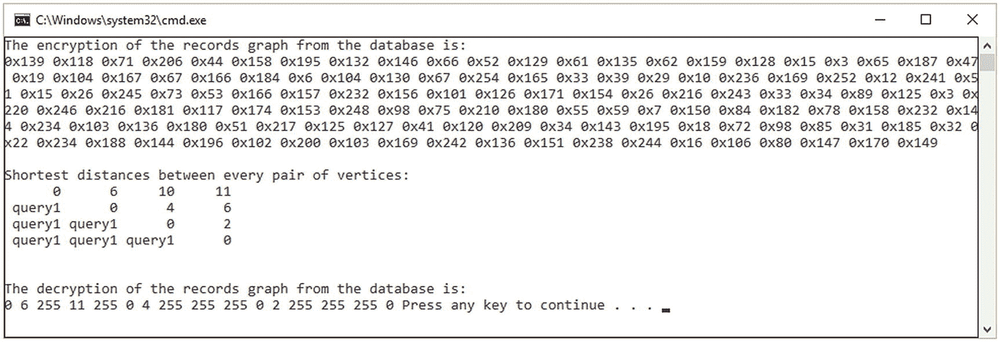
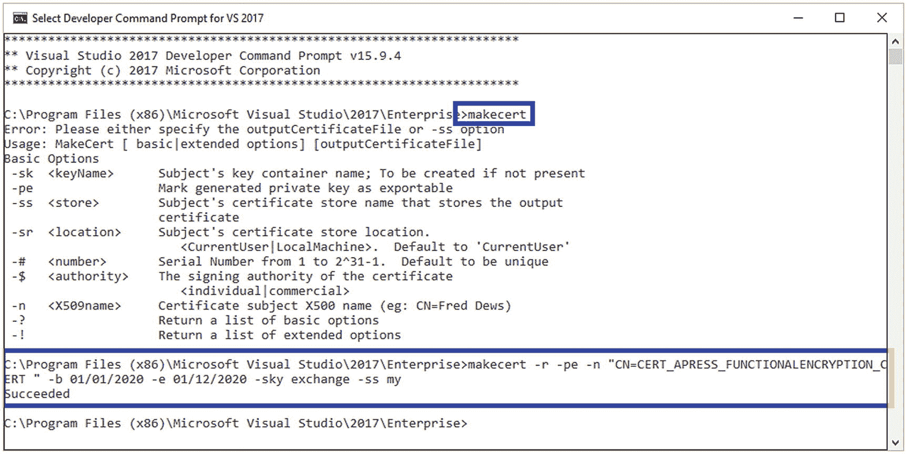
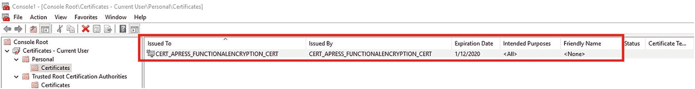
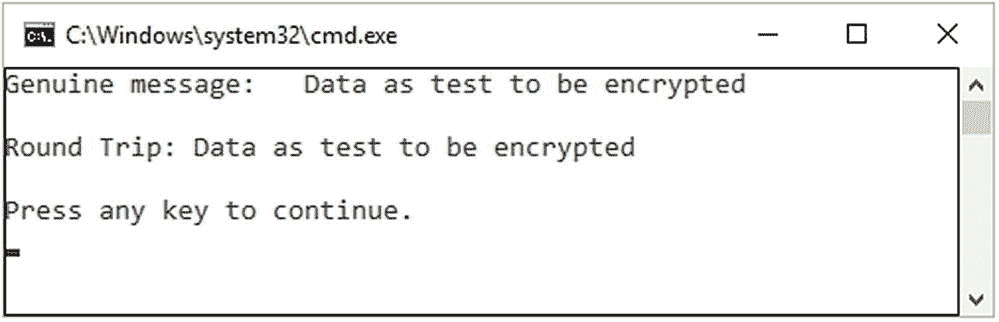
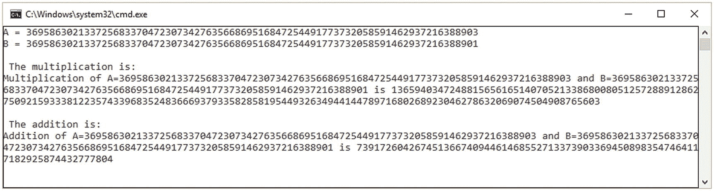

# 十七、云计算密码术

云计算中的密码学代表了为客户端和复杂网络环境设计和实现安全应用的一个热点。云中的加密技术采用复杂的加密技术，目的是保护将在云环境中存储和稍后使用的数据。

组织已经迅速采用云技术作为 IaaS(基础设施即服务)、PaaS(平台即服务)和 SaaS(软件即服务)。原因包括带来的好处，如效率和灵活性，最终将降低成本。

以下密码学原语和机制也受到了研究团体和行业的关注:

*   同态加密(参见第 [13 章](13.html)

*   可搜索加密(参见第 [12 章](12.html)

*   结构化加密(SE)

*   功能加密

*   私人信息检索

在本章中，我们将重点介绍结构化加密(STE)、函数加密、透明数据加密(TDE)和多方计算(MPC)。前两个原语，同态加密和可搜索加密，由于它们的重要性和发展，在章节中以相同的名称出现。

## 结构化加密

STE 方案的作用是为数据结构提供加密。STE 方案基于用于查询结构的某个令牌，该令牌能够给出查询的评估，并从结构或查询中了解最明确的泄漏。可搜索对称加密(SSE)(见第 [12 章](12.html))代表了 STE 的一个特例。快速提醒一下，SSE 将搜索结构加密为倒排索引或类似的搜索树。在实践中，SSE 为设计和实现搜索引擎提供了一个自然的解决方案(参见清单 [12-2](12.html#PC2) )

*   为数据集生成搜索结构并为其提供加密

*   搜索特定关键字 *w* 并基于 *w* 生成令牌并继续查询加密结构

在图加密中可以找到类似的 STE 方案，它为使用图结构的加密数据库的设计阶段提供了一个有趣的解决方案。加密图形数据库以在社交搜索环境中保护其隐私是一个非常好的例子，特别是因为我们正在云计算环境中处理复杂的大数据基础设施，如大数据分析和统计。

作为本节框架的一个例子，我们将考虑一个使用基于图的加密技术的数据库加密算法(参见伪代码 17-1 和清单 [17-1](#PC4) )。在清单 [17-2](#PC5) 中，你可以看到清单 [17-1](#PC4) 中提出的框架的工作版本。输出如图 [17-1](#Fig1) 所示。该算法接收将被加密的 n 个字符作为*的第一个输入，( *ch* <sub>1</sub> ， *ch* <sub>2</sub> ，*ch*<sub>*n*</sub>)。从数据库中接收字符作为记录。*第二输入*由路径的起点( *s* <sup>*p*</sup> )和终点( *e* <sup>*p*</sup> )表示。*第三个输入*由被分析路径的长度表示( *l* <sub>*p*</sub> )。*



图 17-1

使用图加密 SE

话虽如此，让我们看看清单 [17-1](#PC4) 中的伪代码。

*伪代码 17-1。算法的伪代码*


```cs
INPUT:
      ch1, ch2, ..., chn − characters as single records
      sp − the starting point of the vertex path
      ep − the ending point of the vertex path
      lp − length path

```

T2】

```cs
      temporary ← chi
      generate a next path for linking sp and ep
      for j = lp downto 1 do begin
            temporary ← temporary XOR kj
            temporary ← temporary ⋘ 1
            temporary ← Π(temporary)
      end
      encryptedch(i) ← temp
      return the encrypted character, encryptedch(i)

```

```cs
using System;
using System.Collections.Generic;
using System.Linq;
using System.Security.Cryptography;
using System.Text;
using System.Threading.Tasks;

namespace StructuredEncryptionUsingGraphEncryption
{
    class DBGraphEncrypt
    {
        //** this queries represents some constants which
       //** represents records from the database.
        public const int query1 = 255;
        //public const string query2 = "Address";
        //public const string query3 = "Phone number";

        public DBGraphEncrypt()
        {

        }

        static public byte[] Decryption(byte[] Data,
                    RSAParameters RSAKey, bool DoOAEPPadding)
        {
            try
            {
                byte[] decryptedData;
                using (RSACryptoServiceProvider RSA = new
                               RSACryptoServiceProvider())
                {
                    RSA.ImportParameters(RSAKey);
                    decryptedData = RSA.Decrypt(Data, DoOAEPPadding);
                }
                return decryptedData;
            }
            catch (CryptographicException e)
            {
                Console.WriteLine(e.ToString());
                return null;
            }
        }

        static public byte[] Encryption(byte[] Data,
                     RSAParameters RSAKey, bool DoOAEPPadding)
        {
            try
            {
                byte[] encryptedData;
                using (RSACryptoServiceProvider RSA = new
                                  RSACryptoServiceProvider())
                {
                    RSA.ImportParameters(RSAKey);
                    encryptedData = RSA.Encrypt(Data, DoOAEPPadding);
                }
                return encryptedData;
            }
            catch (CryptographicException e)
            {
                Console.WriteLine(e.Message);
                return null;
            }
        }

        private static void Print(int[,] distance, int verticesCount)
        {
            Console.WriteLine("Shortest distances between
                                        every pair of vertices:");

            for (int i = 0; i < verticesCount; ++i)
            {
                for (int j = 0; j < verticesCount; ++j)
                {
                    if (distance[i, j] == query1)
                        Console.Write("query1".PadLeft(7));
                    else
                        Console.Write(distance[i,
                                  j].ToString().PadLeft(7));
                }

                Console.WriteLine();
            }
        }

        public static void GraphSimulation(int[,] graph, int verticesCount)
        {
            int[,] distance = new int[verticesCount, verticesCount];

            for (int i = 0; i < verticesCount; ++i)
                for (int j = 0; j < verticesCount; ++j)
                    distance[i, j] = graph[i, j];

            for (int k = 0; k < verticesCount; ++k)
            {

                for (int i = 0; i < verticesCount; ++i)
                {
                    for (int j = 0; j < verticesCount; ++j)
                    {
                        if (distance[i, k] + distance[k, j] <
                                              distance[i, j])
                            distance[i, j] = distance[i, k] +
                                              distance[k, j];
                    }
                }
            }

            Print(distance, verticesCount);
        }

        static void Main(string[] args)
        {
            UnicodeEncoding ByteConverter = new UnicodeEncoding();
            RSACryptoServiceProvider RSA = new RSACryptoServiceProvider();

            int[,] databaseGraphRecords = {
                         { 0,   6,  query1, 11 },
                         { query1, 0,   4, query1 },
                         { query1, query1, 0,   2 },
                         { query1, query1, query1, 0 }
                           };

            byte[,] dataGraphForEncryption = new
                        byte[databaseGraphRecords.Length,
                        databaseGraphRecords.Length];
            byte[] dataForEncryption = new
                        byte[databaseGraphRecords.Length];
            string[] test = new
                        string[databaseGraphRecords.Length];

            int k = 0;
            for (int i = 0; i <
                    Math.Sqrt(databaseGraphRecords.Length); i++)
            {

                for (int j = 0; j <
                    Math.Sqrt(databaseGraphRecords.Length); j++)
                {
                    dataForEncryption[k] =
                          Convert.ToByte(databaseGraphRecords
                                                [i, j]);
                    k++;
                }
            }

            byte[] encryptions = Encryption(dataForEncryption,
                        RSA.ExportParameters(false), false);
            Console.WriteLine("The encryption of the records
                        graph from the database is:");
            for(int i = 0; i < encryptions.Length; i++)
            {
                Console.Write("0x" + encryptions[i].ToString()
                                                 + " ");
            }

            Console.WriteLine("\n");
            GraphSimulation(databaseGraphRecords, 4);

            Console.WriteLine("\n");
            byte[] decryptions = Decryption(encryptions,
                              RSA.ExportParameters(true), false);
            Console.WriteLine("The decryption of the records
                              graph from the database is:");
            for (int i = 0; i < decryptions.Length; i++)
            {
               Console.Write(decryptions[i].ToString() + " ");
            }
        }
    }
}

Listing 17-2Encryption of SE Using Graph

```

```cs
using System;

namespace GraphEncryptionDatabase
{
      class DBGraphEncrypt
      {
            //** starting point
            int sp;

            //** ending point;
            int ep;

            //** path length
            int lp;

            //** constructor
            public DBGraphEncrypt() {}

            public void GraphEncryption()
            {
                  //** let's declare an instance of the context
                  //** we will use Linq-to-Sql for this example

                  Apress_DBGraphEncExampleDataContext dbContext
                  = new Apress_DBGraphEncExampleDataContext();

                  //** create an instance of the class
                  //** generated for the table
                  EmployeeDetail emp_details = new
                                      EmployeeDetail();

                  //** select the record that
                  //** you want to encrypt
                  var query = (from emp in
                   dbContext.EmployeeDetails
                     select emp.Password).Single();

                  //** parse the record

                  string record = query.ToString();
                  for(int i=0; i<record.Length; i++)
                  {
                        char ch = record[i];
                        Encrypt(ch.ToString());
                  }
            }

            public string Encrypt(string ch)
            {
                  Encryption.useEncAlgorithm(new
                  Encryption(Encryption.ALGORITHM.GraphEnc));

                  string encryption_key;

                  Console.WriteLine("Enter the password :");
                       String password = encryption_key.readLine();

                  byte[] secret_key = GenerateKeys.keyGen(256,
                            password, "salt/salt", 100000);

                  Console.WriteLine("Return the records
                           (strings) that will be encrypted.");
                  String pathName = encryption_key.readLine();

                  ArrayList<string> listOfCharacters = new
                                          ArrayList<string>();
                  listOfCharacters.Add(ch);

                  //** parse the listOfCharacters
                  //** parameters of the graph vertex for the
                  //** size of the data set
                  //** change in such way that you will get a
                  //** better performance
                  int big_block = 700;
                  int small_block = 120;
                  int size_of_data = 12000;

                  while (true)
                  {
                        Console.WriteLine("Enter the keyword tosearch for:");
                        String keyword = Console.Read();
                        byte[][] token_encryption_key =
                          GraphEnc.token(secret_key , keyword);
                        Console.WriteLine(GraphEnc.resolve(CryptoPrimitives.
                generateGraphEnc(secret_key, 3 + new String()),
                generateGraphEnc.query(GraphEnc.GeneratePath(sp, ep, lp),
                   GraphEnc.generateListOfCharacters(),
                   GraphEnc.Encrypt())));
                  }
            }
      }
}

Listing 17-1The Implementation

```

```cs
OUTPUT:
      encryptedch(1), encryptedch(2), …, encryptedch(n)

```

## 功能加密

函数加密是公钥加密的推广。在这种类型的加密中，拥有秘密密钥允许人们了解正在加密的密文的功能。FE 是复杂的，它有几个子类，如谓词加密、基于身份的加密、基于属性的加密(ABE)、密文策略 ABE、隐藏向量加密和内积谓词。

函数加密方案表示由四种算法组成的元组，例如 setup、keygen、encryption 和 decryption。正确性需要满足一个条件，即 *k* ∈ *K* 和 *x* ∈ *X* :

*   *设置* (1 <sup>*λ*</sup> ) → ( *公共* <sub>*按键*</sub> ，*主* <sub>*按键*</sub> )

*   *键* <sub>*代*</sub> ( *主* <sub>*键*</sub> ，*键* ) → *秘* <sub>*键*</sub>

*   *加密* ( *公开*<sub>T5】密钥</sub> ，*消息* ) → *密文*

*   *解密* ( *秘密*<sub>T5】密钥</sub> ，*密文* ) → *y*

上面的步骤可以在下面的清单 [17-3](#PC6) 中调换，其中我们介绍了一个通用函数加密方法应该如何实现的通用框架。清单 [17-3](#PC6) 中的例子并不代表可以编译和执行的例子。由于其复杂性和应用，给出一个 FE 的实现可能是一个非常具有挑战性的任务。

```cs
//** generating master keys and FE key

//** length of input vectors
int input_vector_length = 2;

//** the upper limit for input vector coordinates
Random rand = new Random();
int bound = rand.Next();

//** length in bit of the prime modulus
int length_of_modulus = 2048;

trusted_entity = GenerateNewVector(input_vector_length,
                                     length_of_modulus, bound);
master_key = trusted_entity.GenerateMasterKey();
master_public_key = trusted_entity.GenerateMasterPublicKey();

int y = data. GenerateNewVector ([]*big.Int{big.NewInt(1),
                                     big.NewInt(2)});
functional_encryption_key =
           trusted_entity.KeyDerivation(master_secret_key, y);

//** create a simulation of encryptor
//** our encryption will hide the message (x) using
//** master public key by the trusted entity
Encryption = GenerateParameters(trusted_entity.Parameters);
message = GenerateNewVector([]*rand.Next{rand.Next(3) rand.Next(4)});,
cipher = encryption.Encrypt(message, master_public_key);

//** create simulation of the decryptor that decrypts the cipher
Decryption = GenerateParameters(trusted_entity.Parameters);

//** do the decryption in order to get the result
//** inner prod of x and y
//** we are expecting xy to be 11 (e.g. <[1,2],[3,4]>)
xy = Decrypt(cipher, functional_encryption_key, y) ;

Listing 17-3Simple Implementation and Startup for FE

```

在清单 [17-4](#PC8) 和图 [17-4](#Fig4) 中，我们提供了一个用于函数加密的公钥加密模块的实现示例。该示例设计用于包含敏感数据(如大量数据、查询结果等)的文件的云架构。).在从 GitHub 库运行清单 [17-4](#PC8) 的项目之前，确保您已经使用来自开发者命令提示符的`makecert`命令正确地创建了证书(参见图 [17-2](#Fig2) )。为此，您需要运行以下命令:



图 17-2

使用 makecert 创建证书

```cs
makecert -r -pe -n "CN=CERT_APRESS_FUNCTIONALENCRYPTION_CERT" -b 01/01/2020 -e 01/12/2020 -sky exchange -ss my

```

下一步是通过检查控制台窗口来验证证书是否被正确导入(参见图 [17-3](#Fig3) )。



图 17-3

导入证书

```cs
using System;
using System.Collections.Generic;
using System.IO;
using System.Linq;
using System.Security.Cryptography;
using System.Security.Cryptography.X509Certificates;
using System.Text;
using System.Threading.Tasks;

namespace FunctionalEncryption
{
    class Program
    {
        //** variables for different paths, such as encryption
        //** and decryption path for folder
     private static string encryption_folder = @"D:\Encrypt\";
     private static string decryption_folder = @"D:\Decrypt\";
     private static string genuine_file = "TestData.txt";
     private static string encrypted_file = "TestData.enc";

        static void Main(string[] args)
        {
            //** create a stream as input file
            //** for encrypting test data
            StreamWriter stream_writer =
                    File.CreateText(genuine_file);
            stream_writer.WriteLine("Data as test to be encrypted");
            stream_writer.Close();

            //** use the certificate for encrypting the key
            X509Certificate2 certificateUsedForEncryption =
                  ObtainTheCertificateFromTheStore("CN=CERT_APRE
                  SS_FUNCTIONALENCRYPTION_CERT");
            if (certificateUsedForEncryption == null)
            {
                Console.WriteLine("Certificate
                     'CN=CERT_APRESS_FUNCTIONALENCRYPTION_CERT'
                     was not found.");
                Console.ReadLine();
            }

            //**  Do the encryption of the file using the
            //** public key from the certificate
            FileEncryption(genuine_file,
             (RSA)certificateUsedForEncryption.PublicKey.Key);

            //** Do the decryption of the file based on the
            //** private key obtained from the certificate
            FileDecryption(encrypted_file,
             certificateUsedForEncryption.GetRSAPrivateKey());

            //** Show in the console the
            //** genuine data and the decrypted data
            Console.WriteLine("Genuine message:   {0}",
                             File.ReadAllText(genuine_file));
            Console.WriteLine("Round Trip: {0}",
                          File.ReadAllText(decryption_folder +
                   genuine_file));
            Console.WriteLine("Press any key to continue.");
            Console.ReadLine();
        }

        private static X509Certificate2
                  ObtainTheCertificateFromTheStore(string
                   certificate_name)
        {

            //** go to the certification store and make sure
            //** that you are under the current user
            X509Store certification_store = new
                    X509Store(StoreLocation.CurrentUser);
            try
            {
                certification_store.Open(OpenFlags.ReadOnly);

                //** entire collection of certificates should
                //** be added to X509Certificate2Collection object.
                X509Certificate2Collection
                            collection_of_certifications =
                            certification_store.Certificates;

                //** validate the certificate
                X509Certificate2Collection
                       current_certificates =
                       collection_of_certifications.Find(
                       X509FindType.FindByTimeValid,
                       DateTime.Now, false);
                       X509Certificate2Collection
                       signing_certificate =
                       current_certificates.Find(X509FindType.
                       FindBySubjectDistinguishedName, certificate_name, false);
                if (signing_certificate.Count == 0)
                    return null;

                //** get the first certificate
                //** from the collection
                return signing_certificate[0];
            }
            finally
            {
                certification_store.Close();
            }
        }

        //** based on the public key encrypt the file
        private static void FileEncryption(string input_file,
                                          RSA rsaPublicKey)
        {
            using (Aes aes_algorithm = Aes.Create())
            {
                // Create instance of Aes for
                // symetric encryption of the data.
                aes_algorithm.KeySize = 256;
                aes_algorithm.Mode = CipherMode.CBC;
                using (ICryptoTransform
                              transforming_operations =
                              aes_algorithm.CreateEncryptor())
                {
                    RSAPKCS1KeyExchangeFormatter
                              formatOfTheKey = new
                              RSAPKCS1KeyExchangeFormatter
                                          (rsaPublicKey);
                    byte[] encryption_of_the_key =
                      formatOfTheKey.CreateKeyExchange(
                            aes_algorithm.Key,
                               aes_algorithm.GetType());

                    // Create byte arrays to contain
                    // the length values of the key and IV.
                    byte[] key_length = new byte[4];
                    byte[] initializing_vector_length = new byte[4];

                    int length_of_the_key =
                           encryption_of_the_key.Length;
                    key_length =
                     BitConverter.GetBytes(length_of_the_key);
                    int length_of_initializing_vector =
                                       aes_algorithm.IV.Length;
                    initializing_vector_length =
                           BitConverter.GetBytes(
                               length_of_initializing_vector);

                    //** the following will written in the
                    //** encrypted file
                    //** - length of the key
                    //** - length of the initializing vector
                    //** - encrypted key
                    //** - the initializing vector
                    //** - the encryption of the cipher
                    //** content
                    int start_file_name =
                        input_file.LastIndexOf("\\") + 1;

                    //** change the file's extension to ".enc"
                    string output_file = encryption_folder +
                        input_file.Substring(start_file_name,
                        input_file.LastIndexOf(".") –
                        start_file_name) + ".enc";
         Directory.CreateDirectory(encryption_folder);

                    using (FileStream output_file_stream = new
                               FileStream(output_file,
                               FileMode.Create))
                    {

                        output_file_stream.Write(
                                    key_length, 0, 4);

                        output_file_stream.Write(
                           initializing_vector_length, 0, 4);

                        output_file_stream.Write(
                           encryption_of_the_key, 0,
                           length_of_the_key);

                        output_file_stream.Write(aes_algorithm.
                           IV, 0, length_of_initializing_vector);

                        //** proceed with writting the cipher
                        //** text based on the cryptostream
                        //** used for encryption
                        using (CryptoStream
                                ouput_stream_encrypted = new
                                CryptoStream(output_file_stream,
                                transforming_operations,
                                CryptoStreamMode.Write))
                        {
                        //** save memory by proceeding with encryption of
                        //** different chunks at a time
                            int count = 0;

                        //** size_bytes_of_block can
                        //** represent a randomly size
                            int size_bytes_of_block =
                                      aes_algorithm.BlockSize / 8;
                            byte[] data_block = new
                                      byte[size_bytes_of_block];
                            int bytesRead = 0;

                            using (FileStream
                                      input_file_stream = new
                                             FileStream(input_file,
                                             FileMode.Open))
                            {
                                do
                                {
                                    count =
                                           input_file_stream.Read(
                                         data_block, 0,
                                                size_bytes_of_block);

                                             ouput_stream_encrypted.
                                                   Write(data_block,
                                                   0, count);
                                    bytesRead += count;
                                }
                                while (count > 0);
                                input_file_stream.Close();
                            }

                                ouput_stream_encrypted.
                                      FlushFinalBlock();
                            ouput_stream_encrypted.Close();
                        }
                        output_file_stream.Close();
                    }
                }
            }
        }

        private static void FileDecryption(string inFile, RSA rsaPrivateKey)
        {
            //** create an object as AES for providing
            //** symmetric decryption for our data
            using (Aes aes_algorithm = Aes.Create())
            {
                aes_algorithm.KeySize = 256;
                aes_algorithm.Mode = CipherMode.CBC;

                //** declare byte arrays and obtain their
                //** length for the key encryption and
                //** initializing vector
                byte[] length_of_key = new byte[4];
             byte[] length_initializing_vector = new byte[4];

              //** generate the file name for decryption file
                string output_file = decryption_folder +
                          inFile.Substring(0,
                          inFile.LastIndexOf(".")) + ".txt";

                //** declare file stream objects for reading
                //** the encrypted file (input_file_stream)
                //** and save the decrypted file in
                //** output_file_stream
                using (FileStream input_file_stream = new
                          FileStream(encryption_folder + inFile,
                          FileMode.Open))
                {

                 input_file_stream.Seek(0, SeekOrigin.Begin);
                 input_file_stream.Seek(0, SeekOrigin.Begin);
                 input_file_stream.Read(length_of_key, 0, 3);
                 input_file_stream.Seek(4, SeekOrigin.Begin);

                 input_file_stream.Read(
                         length_initializing_vector, 0, 3);

                    //** do the conversion of
                    //** the lengths to integers
                    int key_length =
                          BitConverter.ToInt32(length_of_key, 0);
                    int initialzing_vector_length =
                          BitConverter.ToInt32(
                                length_initializing_vector, 0);

                    //** check and get the start position for
                    //** the cipher text (start_pos_cipher) and
                    //** the length of it (length_cipher)
                    int start_pos_cipher = key_length +
                                initialzing_vector_length + 8;
                    int length_cipher =
                                (int)input_file_stream.Length –
                                              start_pos_cipher;

                    //** declare byte arrays and use them for
                    //** encrypted AES key, initializing
                    //** vector, and the encrypted text
                    byte[] encryption_of_the_key = new byte[key_length];
                    byte[] initializing_vector = new
                                byte[initialzing_vector_length];

                    //** do the extraction of the keys and
                    //** initializing vector by starting from
                    //** index position 8
                    input_file_stream.Seek(8,
                             SeekOrigin.Begin);

                    input_file_stream.Read(
                             encryption_of_the_key, 0, key_length);
                    input_file_stream.Seek(8 + key_length,
                             SeekOrigin.Begin);

                    input_file_stream.Read(initializing_vector,
                                0, initialzing_vector_length);

                    Directory.CreateDirectory(decryption_folder);

                    //** we will use RSA to decrypt AES key
                    byte[] decryption_key =
                         rsaPrivateKey.Decrypt(
                               encryption_of_the_key,
                               RSAEncryptionPadding.Pkcs1);

                    //** do the decryption of the keys
                    using (ICryptoTransform transform =
                         aes_algorithm.CreateDecryptor(
                         decryption_key, initializing_vector))
                    {
                        //** do the decryption of the cipher
                        //** text from the file stream used
                        //** for encryption (input_file_stream) //** to the file stream used for
                        //** decryption (output_file_stream)
                      using (FileStream output_file_stream  new
                                FileStream(output_file,
                                FileMode.Create))
                        {
                            int count = 0;

                                 int blockSizeBytes =
                                      aes_algorithm.BlockSize / 8;
                            byte[] data = new
                                      byte[blockSizeBytes];

                            //** save memory
                            input_file_stream.Seek(
                                       start_pos_cipher,
                                       SeekOrigin.Begin);
                            using (CryptoStream
                                       outStreamDecrypted = new
                                   CryptoStream(output_file_stream,
                                       transform, CryptoStreamMode.Write))
                            {
                                do
                                {
                                    count =
                                             input_file_stream.Read(
                                             data, 0,
                                             blockSizeBytes);

                                             outStreamDecrypted.Write
                                             (data, 0, count);
                                }
                                while (count > 0);

                                             outStreamDecrypted.FlushFinal
                                             Block();
                                outStreamDecrypted.Close();
                            }
                            output_file_stream.Close();
                        }
                        input_file_stream.Close();
                    }
                }
            }
        }
    }
}

Listing 17-4Implementation of X509 Public Key Encryption as Part of Functional Encryption

```



图 17-4

使用 X509 证书进行加密和解密的功能加密

## 私人信息检索

私有信息检索是一种协议，允许客户端检索数据库的元素，而数据库的所有者不能确定选择了哪些元素。

下面，您将看到一个实施 PIR 的示例。以下示例无法编译，因为它们代表了可在现实环境中应用的框架的一般结构。它可以被视为一个应用，帮助最终用户(客户端)从云环境(服务器)与数据库进行交互。清单 [17-5](#PC11) 中的实现代表了用参与者的密钥加密参与者的一般方法(见图 [17-5](#Fig5) )，这些密钥需要在数据库查询过程中进行交换。使用简单的同态方法生成密钥(参见第 [13 章](13.html))。所提供的例子是为处理数据库记录而设计的，如伪代码 17-2 和 17-3 所示。

*伪代码 17-2。实施 PIR–客户端*

```cs
using System;

namespace PrivateInformationRetrieval
{
      public class PIRExample
      {
            protected PIRExample pir;
            protected PIRExampleServer srv;
            protected Object parameters;

            public PIRExample(PIRExample pir,
                              PIRExampleServer srv)
            {
                  this.pir = pir;
                  this.srv = srv;
                  this.parameters = pir.generateParameters();
            }

            //** i represents the index
            public Object get(int i)
            {
                  try
                  {
                        int size = srv.size();
                        if (i < 0 || i >= size)
                              return null;

                        int maximum_width = srv.width();
                        PIRExample.Query query =
                        pir.generateQuery(parameters,
                                            i, size, maximum_width);

                        Object the_response =
                                       srv.generateResponse(query);

                        Object result_output =
                                    pir.processResponse(parameters,
                                                        the_response,
                                                         i, size,
                                                         maximum_width);

                         return result_output;
                  }

                  catch (Exception e)
                  {
                        return null;
                  }
            }

            public int size() {
                  try
                   {
                       Console.WriteLine(srv.size().ToString());
                       return srv.size();
                  }
                  catch (Exception e)
                  {
                        return 0;
                  }
            }

            public int width() {
                  try
                   {
                       Console.WriteLine(srv.size().ToString());
                       return srv.size();
                  }
                  catch (Exception e)
                  {
                        return 0;
                  }
            }

            public PIRExample pir() {return pir;}

            public PIRExampleServer srv() {return srv;}
      }
}

```

*伪代码 17-3。实施 PIR*

```cs
using System;

namespace PrivateInformationRetrieval
{
      public interface PrivateInformationRetrieval
      {
            public class TheQuery
            {
                  public int maximum_width;
                  public Object query;

                  public TheQuery(int maximum_width, Object query)
                  {
                        this.maximum_width = maximum_width;
                        this.query = query;
                  }
            }

            public Object    generateParams();
            public TheQuery  generateQuery(Object parameters,
                                          int the_index,
                                          int the_size,
                                          int maximum_width);
            public Object generateResponse(List database,
                                                 int width,
                                                 TheQuery query);
      public BigInteger processResponse(Object parameters,
                                              Object the_response,
                                               int the_index,
                                               int the_size,
                                               int maximum_width);
      }
}

```

在清单 [17-5](#PC11) 中，我们介绍了一种实用的方法，展示了如何使用同态方法为私人信息检索生成密钥。

```cs
using System;
using System.Collections.Generic;
using System.ComponentModel;
using System.Data;
using System.Drawing;
using System.Linq;
using System.Numerics;
using System.Text;
using System.Threading.Tasks;

namespace PrivateInformationRetrieval
{
    class Program
    {
        static BigInteger PrivateKey;
        static BigInteger[] PublicKey;
        static readonly int val1 = 5;
        static readonly int val2 = 3;
        static string At = string.Empty;
        static string Bt = string.Empty;

        static void Main(string[] args)
        {

            Random rnd = new Random();
            byte[] rand = new byte[16];

            do
            {
                rnd.NextBytes(rand);
                PrivateKey = new BigInteger(rand);
                PrivateKey = BigInteger.Abs(PrivateKey);
            }
            while (BigInteger.GreatestCommonDivisor
                                (PrivateKey, 1000000) != 1);

            PublicKey = new BigInteger[100];

            for (int i = 0; i < 100; i++)
            {
                rnd.NextBytes(rand);
                PublicKey[i] = new BigInteger(rand);
                PublicKey[i] = (BigInteger.Abs(PublicKey[i]) *
                                PrivateKey) + (1000000 *
                                rnd.Next(10, 100));
            }
            Encryption();

            Console.WriteLine("\n The multiplication is:");
            multiplication();
            Console.WriteLine("\n The addition is:");
            addition();

            Console.ReadKey();
        }

        static void Encryption()
        {
           BigInteger A;
           BigInteger.TryParse(Convert.ToString(val1), out A);
           BigInteger B;
           BigInteger.TryParse(Convert.ToString(val2), out B);

            if (!(A < 1000000 && A >= 0) || !(B < 1000000 && B
                                                                >= 0))
            {
                Console.WriteLine("This values are not
                         avaialble. The numbers and the results
                         obtained has to be situated between 0
                         and 1000000\. These values cannot be
                         accepted");

            }
            else if (!(A * B < 1000000) && !(A + B < 1000000))
            {
                Console.WriteLine("These values are not valid
                         because neither multiplication nor sum
                         can be realized due to noise
                         accumulation. The numbers and results of
                         operations must range from zero to
                         999999  \nSuch values are unacceptable.
                         It is impossible to decrypt
                         multiplication and sum due to the NOISE
                         in ciphertext. Numbers and results of
                         operations have to be from zero to
                         999999");
            }
            BigInteger t = new BigInteger(0);

            //** Encryption for A
            Random rand = new Random();
            for (int i = 0; i < 100; i++)
            {
                if (rand.Next(2) == 1)
                    t = t + PublicKey[i];
            }
            At = (A + t).ToString();

            Console.WriteLine(At);

            t = 0;
            rand = new Random();

            //Encryuption for B
            for (int i = 0; i < 100; i++)
            {
                if (rand.Next(2) == 1)
                    t = t + PublicKey[i];
            }
            Bt = (B + t).ToString();
            Console.WriteLine(Bt);
        }

        public static void multiplication()
        {
            BigInteger A;
            BigInteger.TryParse(At, out A);
            BigInteger B;
            BigInteger.TryParse(Bt, out B);

            Console.WriteLine("Multiplication of A={0} and
                   B={1} is {2}", A, B, (A * B).ToString());
        }

        public static void addition()
        {
            BigInteger A;
            BigInteger.TryParse(At, out A);
            BigInteger B;
            BigInteger.TryParse(Bt, out B);

            Console.WriteLine("Addition of A={0} and B={1} is
                                 {2}", A, B, (A + B).ToString());
        }
    }
}

Listing 17-5Practical Approach for Generating Cryptographic Keys Using a Homomorphic Method for Private Information Retrieval

```



图 17-5

PIR 的同态加法

## 结论

本章讲述了云环境中最重要的加密原语。现在，您应该理解了高级概念和加密原语，以及它们的一般实现。

本章介绍的概念将为您提供坚实的实践基础，帮助您更深入地了解其他加密原语，如多方计算、透明数据加密或属性保持加密。

云计算密码学代表着强大的挑战，大量的文献提供了多种理论框架，但没有实践方向。这为专业人员和研究人员提供了强大的研究方向和目标，即开发新的想法来提高云环境中的安全性，但云解决方案提供商提供的标准安全策略除外。

## 文献学

1.  Rishav Chatterjee，Sharmistha Roy 和 Ug Scholar，“云计算中的密码学:确保云中安全性的基本方法”2017.

2.  名词（noun 的缩写）Jaber 和 Mohamad Fadli Bin Zolkipli，“密码学在云计算中的应用”，2013 年 IEEE 控制系统、计算和工程国际会议*(第 179-184 页)，Mindeb，2013 年，doi:10.1109/ic 欧安会。20137.888886866103*

3.  云计算中的安全问题和密码学的使用。" 2014.

4.  Melissa Chase 和 Seny Kamara，“结构化加密和受控披露”，载于*密码学进展-ASIACRYPT* (第 577-594 页)。10.1007/978-3-642-17373-8_33.2010.

5.  米（meter 的缩写））Brenner、J. Wiebelitz、G. V. Voigt 和 M. Smith，“应用同态加密的云中的秘密程序执行”，载于第 5 届 IEEE 数字生态系统和技术国际会议的*会议录(IEEE DEST 2011)。*