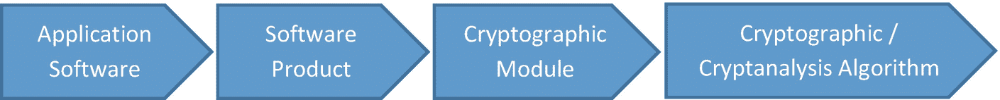

# 十九、密码分析攻击和技术

这一章致力于最重要和最有用的密码分析和密码分析标准、验证方法、分类和密码分析攻击的操作。密码分析学科非常复杂，关于它的写作需要数千个研究小时。以下部分包含对您在日常活动中使用至关重要的最重要元素的调查。

## 标准

标准的重要性至关重要，任何专业人员在进行密码分析攻击时都应该知道。大多数密码分析攻击仅仅是为了商业目的。政府使用和商业目的之外的任何密码分析活动都是不合法的，并且不应该为了个人利益而进行。

组织非常容易受到安全攻击，确保组织满足有关其数据安全性的必要要求非常重要。任何组织都可以雇佣安全专家来执行密码分析攻击，以便测试其安全性并找到以后可能被恶意用户/攻击者利用的漏洞。

这些标准是由机构和组织提供的。它们包含密码学和密码分析方法、框架和算法。这些机构和组织是

*   **IEFT 公钥基础设施(X.509)** :该组织致力于互联网上使用的基于公钥系统的协议的标准化。

*   **国家标准与技术研究所(NIST)** :该研究所专注于为美国政府制定 FIPS 标准。

*   美国国家标准协会(ANSI) :其目标是维护来自私营部门的标准。

*   互联网工程任务组(IEFT) :它代表了一个由网络、运营商、服务商和研究人员组成的国际社区。他们的主要目的是通过互联网架构的发展来体现的。

*   电气和电子工程研究所(IEEE) :其目标是设计不同领域的理论和先进技术，如电子学、计算机科学和信息学。

*   国际标准化组织(ISO) :它是一个非政府组织，包括 100 多个国家。其主要目标是鼓励标准化的发展，以帮助专业人士促进国际服务交流。

### FIPS 140 比 2，FIPS 140 比 3，ISO 15408

*[1](#Fn1)ISO 15408 是 IT 安全评估中最重要的标准之一，在国际上被用作参考系统标准。该标准包括 IT 领域的一系列规则和要求。目标是验证产品和加密系统的安全性。*

 **FIPS 140-2 和 140-3* 提供了需要遵守的指南，以完成一组具体的技术要求，这些技术要求分为四个级别。

在为特定应用或加密模块开发规范或标准时，您需要考虑 FIPS 140-2/FIPS 140-3 和 ISO 15408 这两个标准。

基于标准开发的产品需要进行测试。测试的目标是获得验证，并确认标准得到了正确的遵循和尊重。

## 密码系统的验证

如果业务需要在软件和通信系统中实施密码分析和密码操作，则需要密码和密码分析服务。这些服务由认证机构授权，它们包括诸如数字签名生成和验证、加密和解密、密钥生成、密钥分发、密钥交换等功能。

图 [19-1](#Fig1) 中的模型是基于密码和密码分析模块进行安全性测试的通用模型。

表 19-1

对加密算法的攻击

<colgroup><col class="tcol1 align-left"> <col class="tcol2 align-left"></colgroup> 
| 

对加密算法的攻击类型

 |
| --- |
| 

攻击标题

 | 

攻击描述

 |
| --- | --- |
| 已知明文攻击 | 密码分析者有一个加密的文本和对应的明文。这种攻击的目的是让密码分析人员从数据中分离出加密密钥。 |
| 选择文本攻击 | 密码分析者可以选择指出要加密的明文。通过使用这种类型的攻击，密码分析者可能试图从加密密钥中分离出文本信息，并有可能通过不同的方法访问加密算法或密钥。 |
| 密码-密文攻击 | 密码分析者保存相同的文本，该文本用明文及其对应的两个或更多不同的密钥加密。 |
| 分割和封锁攻击 | 密码分析者具有实现不同算法输入和输出之间的一组关联的能力，目的是分离不同的算法输入，这让他将问题分成两个或更多容易解决的问题。 |
| 线性综合征发作 | 密码分析方法包括设计和创建特定于伪随机发生器的线性方程组，并用加密文本验证该方程组，从而获得高概率明文。 |
| 一致性线性攻击 | 密码分析方法包括从模拟密钥开始创建特定于伪随机发生器的线性方程方案，并通过概率为 1 的伪随机发生器检查该方案，从而获得高概率明文。 |
| 随机攻击 | 这种攻击被称为预测攻击，如果生成器的输出是自相关的，并且密码分析者设法获得伪随机生成器的输出和加密文本作为输入数据，则这种攻击是可能的。这样就获得了明文。 |
| 信息线性攻击 | 也称为线性复杂度攻击，如果有任何机会使生成器与斐波那契算法相等，并且如果线性复杂度与低生成器相等，则攻击是可能的。利用这种类型的攻击，可以构造类似的算法和类似的密钥。 |
| 病毒攻击 | 如果应用加密，这种攻击是可能的算法并在易受攻击且未受保护的 PC 上运行。 |

图 19-1

验证和测试框架

对于充分的测试和验证过程，至少需要*密码模块*和*密码/密码分析算法* *。*对于开发的任何加密产品(或桌面/网络软件应用)，有必要执行测试并将产品提交给 CMVP [2](#Fn2) (加密模块验证程序)，以便根据 FIPS 140-2 [3](#Fn3) 和 FIPS 140-3 进行测试。 [4](#Fn4)

一个*密码模块*被表示为专用软件和硬件进程的组合。利用经验证的加密和密码分析模块的最重要的优势是

*   模块应满足最低要求。

*   应在标准范围内通知和指导授权人员和技术人员。该标准得到了普遍认可，并且经过了测试。

*   在开发加密模块之前，验证最终用户是否知道加密模块已经根据安全要求进行了验证和测试。

*   为了开发类似和特定的应用，需要实现高水平的安全性可靠性。

特征 FIPS 140-2 的安全要求具有 11 个可在加密模块的设计和实现过程中使用的度量和标准。加密模块必须满足并验证每个指标。在验证过程中，从 1 到 4 的标记被分配给加密模块，与所保证的安全级别成比例。

加密模块通过验证后，应包含一组信息，如制造商名称、地址、模块名称、模块版本、模块类型(软件或硬件)、验证日期、验证级别和模块描述。

## 密码分析操作

设计加密系统时，应遵循以下原则。这些原则很简单，应该构成任何密码分析程序的基础:

*   不应该低估对手。

*   密码系统可以由密码分析人员来评估。

*   在评估密码系统之前，对手对被评估的密码系统的了解被考虑在内。

*   密码系统的保密性依赖于密钥。

*   在加密系统评估过程中，必须考虑系统中的所有元素，如密钥分发、加密内容等。

Claude Shannon 认为，在进行密码系统评估时，必须考虑以下标准:

*   一旦消息被成功解密，密码分析者将获得一份奖品。

*   密钥长度和复杂性

*   加密-解密过程的复杂程度

*   根据文档大小的编码文本的大小

*   传播错误的方式

每个密码都有一个解决方案的基本操作如下:

*   找到并决定使用的词汇

*   决定加密系统

*   加密系统的单个密钥的重建或加密流系统的部分或完全重建

*   这种方案的重构或确定完全明文

## 密码分析攻击的分类

本节讨论针对密码算法、密钥、认证协议、系统本身的攻击类型，以及硬件攻击。

### 对密码算法的攻击

表 [19-2](#Tab2) 列出了对加密算法最常见的攻击。

表 19-2

对密钥的攻击

<colgroup><col class="tcol1 align-left"> <col class="tcol2 align-left"></colgroup> 
| 

对密钥的攻击类型

 |
| --- |
| 

攻击标题

 | 

攻击描述

 |
| --- | --- |
| 暴力攻击 | 这种攻击需要对密钥和密码进行严格的检查，如果加密密钥的大小和加密密钥的空间很小，这种攻击就有可能发生。 |
| 智能暴力攻击 | 加密密钥的随机性程度小(熵小)，这使得密码可以被识别，因为它接近于所使用的语言术语。 |
| 回溯攻击 | 这种攻击是基于实现一种回溯方法，这种方法包括在期望的方向上继续搜索的条件的存在。 |
| 贪婪攻击 | 攻击提供了最佳本地密钥(最佳全局密钥不能相同)。 |
| 字典攻击 | 这种攻击包括搜索密码或密钥，并使用字典来执行。 |
| 混合字典攻击 | 这种攻击是通过改变字典中的术语并借助字典中的单词通过暴力初始化攻击来实现的。 |
| 病毒攻击 | 如果密钥存储在未受保护的 PC 上，这种攻击是可能的。 |
| 密码哈希攻击/密钥 | 如果密码哈希设计不当或不正确，就会发生这种攻击。 |
| 替代攻击 | 原始密钥由第三方替换，并在网络中重复。这可以通过病毒来实现。 |
| 存储加密密钥 | 如果这是在没有任何物理保护措施或密码、软件或硬件的情况下以错误的方式(与加密数据一起)在明文中完成的，这可能导致对加密消息的攻击。 |
| 旧加密密钥的存储 | 该攻击将导致旧加密文档的受损版本。 |
| 关键妥协 | 如果对称密钥被泄露，那么只有分配给该键的文档将会受到威胁。如果可以发现存储在各种服务器上的公钥被泄露，那么攻击者就可以替换数据的合法所有者，从而在网络内造成不良的负面影响。 |
| 万能钥匙 | 密码系统代表不同的阶段。 |
| 密钥寿命 | 它是一个不可或缺的组成部分，排除了尚未检测到的成功攻击的可能性。 |

### 对密钥的攻击

表 [19-2](#Tab2) 列出了对密钥最常见的攻击。

### 对认证协议的攻击

认证协议受到各种形式的攻击。我们在表 [19-3](#Tab3) 中列出了最相关的，常用的。考虑到网络认证协议非常必要且至关重要，这一点非常重要。一旦遭到破坏，就有可能暴露至关重要的信息，攻击者可以获得大量信息。

表 19-3

对认证协议的攻击

<colgroup><col class="tcol1 align-left"> <col class="tcol2 align-left"></colgroup> 
| 

对认证协议的攻击类型

 |
| --- |
| 

攻击标题

 | 

攻击描述

 |
| --- | --- |
| 对公钥的攻击 | 协议内的攻击是为了签名而发生的。它仅适用于公钥方案。 |
| 对称算法的攻击 | 在认证协议内部，攻击必须发生在签名上。这只能通过使用对称密钥来实现。 |
| 被动攻击 | 入侵者可以拦截并跟踪接触在没有任何干扰的情况下。 |
| 使用第三人称攻击 | 两个伙伴在通信信道内的通信被第三方用户故意截取。 |
| 失败停止签名 | 这是一种加密协议，发送者可以提供他的签名是否是伪造的证据。 |

## 结论

这一章涵盖了适用于密码分析的最重要和最有用的指南和方法。要检查和验证加密和密码分析算法和方法的实现，您必须能够处理标准。你了解到了

*   密码分析攻击的分类

*   密码分析过程中涉及的操作

*   FIPS 140-2 和 FIPS 140-3 标准

*   ISO 15408 标准

*   加密系统验证过程

## 文献学

1.  Adrian Atanasiu， *密码学中的数学* 。美国出版社，编辑：科学宇宙，ISBN：978-973-1944-48-7。2015.

2.  Adrian Atanasiu， *Information Security vol 1* （ *Cryptography）* ， InfoData 出版社， ISBN： 978-973-1803-18-0.2007.

3.  Adrian Atanasiu， *Information Security vol 2 （Security Protocols）* ， InfoData 出版社， ISBN： 978-973-1803-18-0.2009.

4.  S.J. Knapskog，“安全通信协议的形式规范和验证”(第 58–73 页)。 [`https://link.springer.com/chapter/10.1007/BFb0030352`](https://link.springer.com/chapter/10.1007/BFb0030352) 。

5.  K.Koyama，“破解公钥密码系统能力的直接演示”(第 14-21 页)。 [`www.iacr.org/cryptodb/data/paper.php?pubkey=279`](http://www.iacr.org/cryptodb/data/paper.php%253Fpubkey%253D279) 。

6.  P.J. Lee *，“*公共网络的安全用户访问控制”(第 46–57 页)。 [`www.sciencedirect.com/science/article/pii/S0140366416300652`](http://www.sciencedirect.com/science/article/pii/S0140366416300652) 。

7.  R.Lidl 和 W.B. Muller，“关于强斐波那契伪素数的注记”(第 311–317 页)。 [`https://link.springer.com/article/10.1007/BF01810848`](https://link.springer.com/article/10.1007/BF01810848) 。

8.  阿尔弗雷德·j·梅内塞斯和斯科特·范斯通，“椭圆曲线密码系统的实现”(第 2-13 页)。 [`https://link.springer.com/article/10.1007/BF00203817`](https://link.springer.com/article/10.1007/BF00203817) 。

9.  M.J. Mihaljevi 和 J.D. Goli，“给定噪声输出序列时移位寄存器初始状态重建的快速迭代算法”(第 165–175 页)。密码学进展—AUSCRYPT '90，计算机科学讲义，第 453 卷，施普林格出版社，柏林，1990 年。

<aside aria-label="Footnotes" class="FootnoteSection" epub:type="footnotes">Footnotes [1](#Fn1_source)

ISO 15408 .链接: [`www.iso.org/standard/50341.html`](http://www.iso.org/standard/50341.html)

  [2](#Fn2_source)

CMVP， [`https://csrc.nist.gov/projects/cryptographic-module-validation-program`](https://csrc.nist.gov/projects/cryptographic-module-validation-program)

  [3](#Fn3_source)

FIPS 140-2、 [`https://csrc.nist.gov/publications/detail/fips/140/2/final`](https://csrc.nist.gov/publications/detail/fips/140/2/final)

  [4](#Fn4_source)

FIPS 140-3、 [`https://csrc.nist.gov/publications/detail/fips/140/3/final`](https://csrc.nist.gov/publications/detail/fips/140/3/final)

 </aside>*