# 二十、线性和差分密码分析

在本章中，我们将介绍两种重要的密码分析类型，*线性*和*差分密码分析，*介绍关于这两种密码分析如何进行和实现的基本和高级概念和技术。

关于线性和差分密码分析的研究文献在理论方法和机制方面是广泛和丰富的，但是只有少数方法可以在现实环境中实际应用。理论密码分析和应用密码分析之间的差异是巨大的，发表的许多观点(算法、方法、博弈论方面等。)在过去的 12 年里将研究人员和专业人士引入了歧途。对密码分析进行研究并增加其在实践和不同场景中应用的潜在价值需要时间、经验以及理论家和实践者之间的持续交叉合作，而这两种类型之间没有任何隔离。

它们的重要性在密码分析领域至关重要，为构造分组密码和流密码的密码分析攻击方案提供了必要的工具和机制。

## 差分密码分析

差分密码分析是由 E. Biham 和 A. Shamir 在 20 世纪 90 年代早期提出的。差分密码分析的目标是测试密钥中的某些位置是否比密码中的其他位置更容易被追踪到。这个测试可以在任何一级风险下进行。实际上，这个测试是一个更复杂的测试过程的二阶近似。

通过差分密码分析，我们可以暴露密码算法的弱点。下面的差分密码分析的例子是针对*流密码算法* *来说明的。*

该算法的伪代码如下:

1.  *α*←读取拒绝率

2.  Build n sets of perturbed keys starting from the key K.

    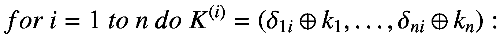

```cs
INPUT:    A base key is chosen as K = (k1, …, kn) with ki ∈ {0, 1}
OUTPUT:   The sensitive and weak points of the cryptography
          algorithm and the resistance decision for
          differential cryptanalysis

```

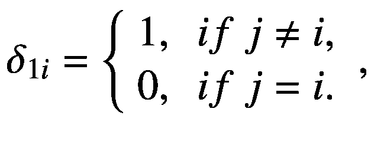T2】

对于 I，j=1，…，n，这样，第 I 个<sup>个</sup>密钥是通过改变第 I 个<sup>位</sup>的位从基密钥获得的。

1.  *建筑密码*。我们将从基本密钥、扰动密钥和明文 *M* 开始构建 *n* + 1 个密码。我们将用*C*T8】(*I*)， *i* = 1，…, *n* + 1 来标注这个密文。作为明文，我们可以在任何地方选择文本 0。

2.  *Building the correlation matrix.* In this step we will build the matrix (*n* + 1) × (*n* + 1) for the corellation values *C*:

    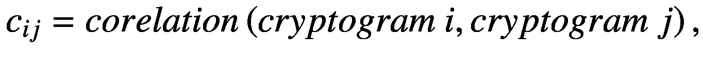

其中 correlation*c*<sub>*ij*</sub>表示应用于序列的统计测试的值(*密文 i* ⊕ *密文 j* )。矩阵 *C* 被表示为在主对角线上具有 1 的对称矩阵。

1.  *The computation of significant value.* It will count the values of significant correlation which are situated above the main diagonal. A value is called *significant* if

    ![$$ {c}_{i,j}\notin \left[{u}_{\frac{\alpha }{2}};{u}_{1-\frac{\alpha }{2}}\right]. $$](img/493660_1_En_20_Chapter_TeX_Equd.png)

考虑 *T* 代表共循环测试中剔除数量的有效值的数量。

1.  *Decision and result interpretation.* If

    ![$$ \frac{T-\alpha \cdotp \frac{n\left(n+1\right)}{2}\ }{\sqrt{\alpha \left(1-\alpha \right)\cdotp \frac{n\left(n+1\right)}{2}}}\notin \left[{u}_{\frac{\alpha }{2}};{u}_{1-\frac{\alpha }{2}}\right], $$](img/493660_1_En_20_Chapter_TeX_Eque.png)

一旦计算出来，我们就可以判定对差分密码分析的不抵抗性(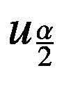和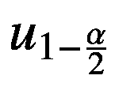分别代表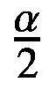和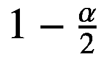阶正态分布的分位数，并将 *i* ， *j* 元素固定为*n*≥*I*>*j*≥1，其中*c*<sub>*ij*</sub>有意义)。这些元素代表了算法的弱点。否则，我们将无法提及任何关于抵抗这类攻击的东西。

清单 [20-1](#PC2) 中的 C# 源代码是上述伪代码的实现(输出见图 [20-1](#Fig1) )。

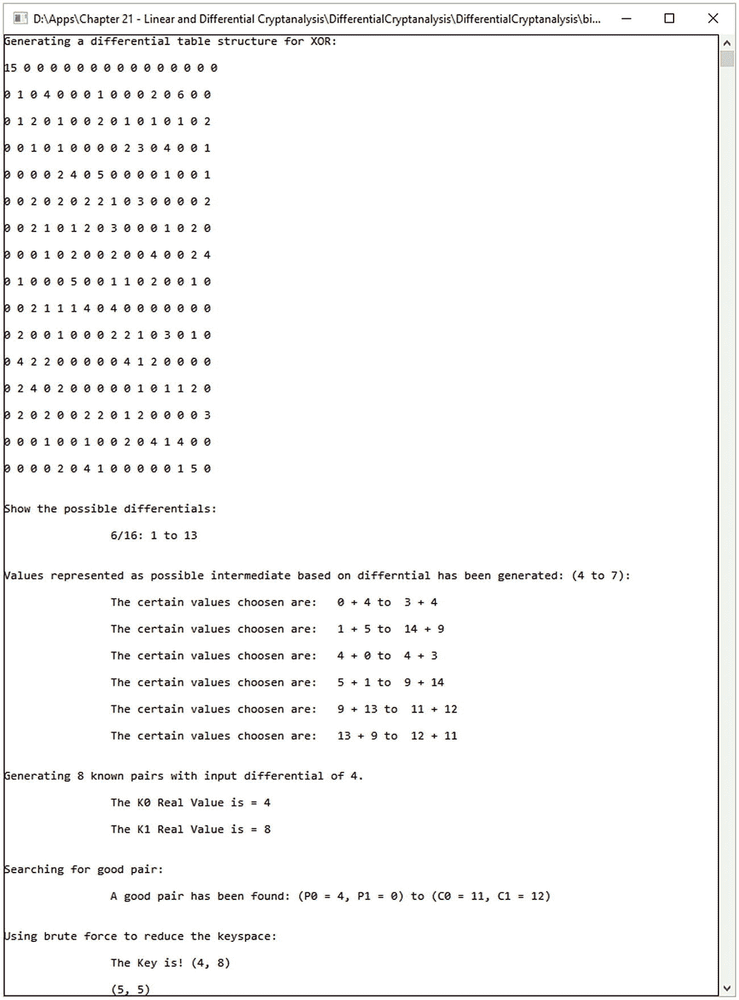

图 20-1

差异密码分析示例

```cs
using System;

namespace DifferentialCryptanalysis
{
    class ExampleOfDifferentialCryptanalysis
    {
        //** variables
        public static int[] Known_P0 = new int[10000];
        public static int[] Known_P1 = new int[10000];
        public static int[] Known_C0 = new int[10000];
        public static int[] Known_C1 = new int[10000];
        public static int Good_P0, Good_P1, Good_C0, Good_C1;
        public static int numbers_pairs;
        public static int[] characters_data0 = new int[16];
        public static int characters_data_max = 0;
        public static int[,] characters = new int[32, 32];

        public static int[] theSBOX = new int[16] { 3, 14, 1,
                10, 4, 9, 5, 6, 8, 11, 15, 2, 13, 12, 0, 7 };
        public static int[] sbox_reviwed = { 14, 2, 11, 0, 4,
                6, 7, 15, 8, 5, 3, 9, 13, 12, 1, 10 };

        public static int round_function(int theInputData, int theKey)
        {
            return theSBOX[theKey ^ theInputData];
        }

        public static int encryption(int theInputData, int k_0, int k_1)
        {
            int x_0 = round_function(theInputData, k_0);
            return x_0 ^ k_1;
        }

        public static void find_differences()
        {
            Console.WriteLine("\nGenerating a differential
                                table structure for XOR:\n");

            Random rnd = new Random();

            int x, y;

            for (x = 0; x < 16; x++)
            {
                for (y = 0; y < 16; y++)
                {
                    characters[x ^ y, theSBOX[x] ^ theSBOX[y]]
                                                    = rnd.Next(-1, 1);
                }
            }

            for (x = 0; x < 16; x++)
            {
                for (y = 0; y < 16; y++)
                {
                    characters[x^y, theSBOX[x] ^
                                                theSBOX[y]]++;
                }
            }

            for (x = 0; x < 16; x++)
            {
                for (y = 0; y < 16; y++)
                    Console.Write("{0}",
                                            characters[x, y] + " ");
                Console.WriteLine("\n");
            }

            Console.WriteLine("\nShow the possible differentials:\n”);

            for (x = 0; x < 16; x++)
                for (y = 0; y < 16; y++)
                    if (characters[x, y] == 6)
                        Console.WriteLine("\t\t6/16: {0} to
                                                    {1}\n", x, y);
        }

        public static void genCharData(int input_differences,
                                       int output_differences)
        {
            Console.WriteLine("\nValues represented as
                        possible intermediate based on
                        differntial has been generated: ({0} to
                        {1}):\n", input_differences,
                        output_differences);

            characters_data_max = 0;
            int p;

            for (p = 0; p < 16; p++)
            {
                int theComputation = p ^ input_differences;

                if ((theSBOX[p] ^ theSBOX[theComputation]) ==
                                                    output_differences)
                {
                    Console.WriteLine("\t\tThe certain values
                    choosen are:   {0} + {1} to  {2} +
                    {3}\n", p, theComputation, theSBOX[p],
                    theSBOX[theComputation]);

                    characters_data0[characters_data_max] = p;
                    characters_data_max++;
                }
            }
        }

        public static void genPairs(int input_differences)
        {
            Random randomNumber = new Random();

            Console.WriteLine("\nGenerating {0} known pairs
                          with input differential of {1}.\n",
                          numbers_pairs, input_differences);

            //** generate randomly subkey
            int Real_K0 = randomNumber.Next() % 16;

            //** generate randomly subkey
            int Real_K1 = randomNumber.Next() % 16;

            Console.WriteLine("\t\tThe K0 Real Value is =
                                                    {0}\n", Real_K0);
            Console.WriteLine("\t\tThe K1 Real Value is =
                                                    {0}\n", Real_K1);

            int b;

            //** Generate plaintexts pairs using different
            //** XORs based on the differences
            //** that are provided as input
            for (b = 0; b < numbers_pairs; b++)
            {
                Known_P0[b] = randomNumber.Next() % 16;
                Known_P1[b] = Known_P0[b] ^ input_differences;
                Known_C0[b] = encryption(Known_P0[b], Real_K0,
                                                      Real_K1);
                Known_C1[b] = encryption(Known_P1[b], Real_K0,
                                                      Real_K1);
            }
        }

        public static void findGoodPair(int
                                             output_differences)
        {
            Console.WriteLine("\nSearching for good pair:\n");

            int c;
            for (c = 0; c < numbers_pairs; c++)
                if ((Known_C0[c] ^ Known_C1[c]) ==
                                                    output_differences)
                {
                    Good_C0 = Known_C0[c];
                    Good_C1 = Known_C1[c];
                    Good_P0 = Known_P0[c];
                    Good_P1 = Known_P1[c];
                    Console.WriteLine("\t\tA good pair has
                                been found: (P0 = {0}, P1 = {1}) to
                                (C0 = {2}, C1 = {3})\n", Good_P0,
                                Good_P1, Good_C0, Good_C1);
                    return;
                }
            Console.WriteLine("There is no pair proper
                                                        found!\n");
        }

        public static int testKey(int Test_Key_0,
                                                  int Test_Key_1)
        {
            int c;
            int someCrappyValue = 0;
            for (c = 0; c < numbers_pairs; c++)
            {
                if ((encryption(Known_P0[c], Test_Key_0,
                          Test_Key_1) != Known_C0[c]) ||
                          (encryption(Known_P1[c], Test_Key_0,
                          Test_Key_1) != Known_C1[c]))
                {
                    someCrappyValue = 1;
                    break;
                }
            }

            if (someCrappyValue == 0)
                return 1;
            else
                return 0;
        }

        public static void crack()
        {
            Console.WriteLine("\nUsing brute force to reduce
                                                    the keyspace:\n");

            for (int g = 0; g < characters_data_max; g++)
            {
                int Test_K0 = characters_data0[g] ^ Good_P0;

                int Test_K1 =
                          theSBOX[characters_data0[g]] ^ Good_C0;

                if (testKey(Test_K0, Test_K1) == 1)
                    Console.WriteLine("\t\tThe Key is! ({0},
                                      {1})\n", Test_K0, Test_K1);
                else
                    Console.WriteLine("\t\t({0}, {1})\n",
                                             Test_K0, Test_K1);
            }
        }

        static void Main(String[] args)
        {
            Console.WriteLine("DIFFERENTIAL CRYPTANALYSIS\n");
            Random randomPerRunning = new Random();
            //** generating random values per each running
            randomPerRunning.Next();

            //** identify proper differentials
            //** within the SBoxes
            find_differences();

            //** defining a numerical
            //** value for known pairs
            numbers_pairs = 8;

            //** identify data inputs that will help
            //** to lead us to specific characteristic
            genCharData(4, 7);

            //** randomly, generate pairs of
            //** chosen-plaintext
            genPairs(4);

            //** based and using the characteristic,
            //** we will choose a known pair
            findGoodPair(7);

            //** use characteristic_data0 and within
            //** the proper pair we will find it
            crack();

            while (true) { }
            Console.ReadKey();
        }
    }
}

Listing 20-1Implementation of Differential Cryptanalysis Example

```

## 线性密码分析

线性密码分析作为 DES(数据加密系统)的理论框架于 1993 年被设计和引入。目前，线性密码分析被用于分组密码中，并且代表了设计和实施复杂攻击的一个非常好的起点。

我们可以将线性密码分析定义为在密钥、明文结构和密文结构之间建立的线性关系。明文的结构用字符或位来表示。有必要将其表示为一个以异或为特征的操作链，显示为

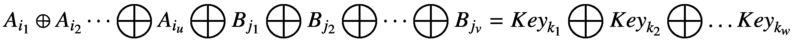

其中⨁表示异或运算(这是一种二进制运算)， *A* <sub>*i*</sub> 表示从 *i* <sup>*th*</sup> 位置开始输入的位结构*a*=*a*<sub>1</sub>， *A* <sub>2</sub> ，…】， *B* <sub>*j*</sub> 代表输出结构*B*=*B*<sub>1</sub>、 *B* <sub>2</sub> 、…】和*键* <sub>*k*</sub>

### 进行线性密码分析

在大多数情况下，我们从这样的想法出发，即除了私钥之外，我们知道加密算法。在分组密码上启动线性密码分析被表示为模型/框架，描述为

*   识别特征加密算法的非线性分量的线性近似(例如，S 盒)。

*   执行替换盒的线性近似之间的组合，其包括在加密算法内执行的操作。对于专业人员来说，关注线性近似是非常重要的，因为它代表了一个特殊的函数，该函数包含并处理明文和密文比特以及来自私钥的比特。

*   设计线性近似作为第一次使用的键的指南。这将非常有帮助，因为它为所有可能的键值节省了重要的计算资源。使用多重线性近似对于消除尝试所必需的关键数字是非常有用的。

在下一节中，我们将提供一些细节，以帮助确定在进行线性密码分析攻击时应该考虑哪些组件。如果不在理论层面理解以下概念，将很难实施任何攻击。

### s 盒

通过 S 盒，非线性与它的操作、异或和位移一起被引入，它们也在线性表示中被发现。

S-Box 的*目标是在具有特定输出的输入二进制序列之间创建一个映射。也就是说，我们将提供非线性，这将建立和呈现应用线性密码分析时获得的仿射近似。表 [20-1](#Tab1) 显示了一个 S-Box 的例子以及映射是如何工作的。它使用第 1 个*和第 4 个*位来查找列和中间位，第 3 个*和第 4 个*。基于此，以输入 1110 将是 0101 的方式确定行。*****

 **表 20-1

S-Box 的例子

<colgroup><col class="tcol1 align-left"> <col class="tcol2 align-left"> <col class="tcol3 align-left"> <col class="tcol4 align-left"> <col class="tcol5 align-left"></colgroup> 
|   | 

`11`

 | 

`10`

 | 

`01`

 | 

`00`

 |
| --- | --- | --- | --- | --- |
| `00` | `"0000"` | `"0001"` | `"0010"` | `"0011"` |
| `01` | `"1000"` | `"1001"` | `"1111"` | `"1011"` |
| `10` | `"1100"` | `"1101"` | `"1110"` | `"1010"` |
| `11` | `"0100"` | `"0101"` | `"0010"` | `"0111"` |

表 [20-2](#Tab2) 显示了作为输入的位和作为输出的位的例子之间的映射操作。

表 20-2

输入和输出之间的映射

<colgroup><col class="tcol1 align-left"> <col class="tcol2 align-left"></colgroup> 
| 

`The Input (J)`

 | 

`The Output (Q)`

 |
| --- | --- |
| `"0000"` | `"0011"` |
| `"0001"` | `"0010"` |
| `"0010"` | `"1011"` |
| `"0011"` | `"1111"` |
| `"0100"` | `"1010"` |
| `"0101"` | `"1110"` |
| `"0110"` | `"0111"` |
| `"0111"` | `"0010"` |
| `"1000"` | `"0001"` |
| `"1001"` | `"0000"` |
| `"1010"` | `"1001"` |
| `"1011"` | `"1000"` |
| `"1100"` | `"1101"` |
| `"1101"` | `"1100"` |
| `"1110"` | `"0101"` |
| `"1111"` | `"0100"` |

### S-Box 线性近似

我们将从我们想要近似上面提出的替换框的结构的想法开始。基于这些信息，我们得到了各种线性近似的精度，这是相当高的。我们包括具有以下形式的 256 个这样的线性近似:

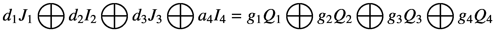

其中 *J* <sub>1</sub> 和 *Q* <sub>*i*</sub> 代表第*I*<sup>*th*</sup>位特征为输入( *J* )和输出( *Q* )对应于 *d* <sub>*i*</sub> 和 *g* <sub>举个例子，让我们用下面的线性近似法*j*<sub>2</sub>=*q*<sub>1</sub>⨁*q*<sub>4</sub>并由 *d* = 0100 <sub>2</sub> 和 *g* = 1001 <sub>2</sub> 给出。</sub>

### 线性逼近的串联

是时候进入下一步，为整个系统形成、设计和规划线性近似。为了实现这一点，我们需要两样东西:

*   首先，我们需要已经计算出构成系统的每个组分的线性近似。

*   第二，为了进行组合，我们简单地通过在不同的组合中使用异或来对整个方程组求和。这样，我们得到一个方程，它将消除中间变量。

### 组合两个变量

让我们考虑一下 *B* <sub>1</sub> 和 *B* <sub>2</sub> ，两个随机二元变量。它们之间的线性关系是*b*T10】1⨁*b*t14】2= 0。接下来，我们用 *l* 表示概率*B*T18】1= 0，用 *m* 表示概率*B*T24】2= 0。基于这两个随机自变量，我们有


继续向前，我们可以展示如下:

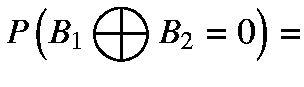

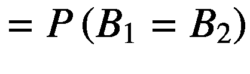

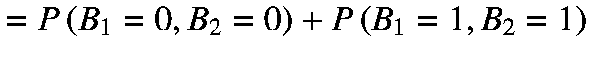

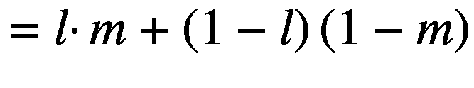

下一步通过计算*b*T2】1⨁*b*T6】2= 0 的偏差来表示。给出为*ζ*<sub>1</sub>*ζ*<sub>2</sub>。

现在是用 C# 实现线性密码分析(见图 [20-2](#Fig2) )的时候了(见清单 [20-2](#PC3) ),并展示如何在实践中使用上述概念。

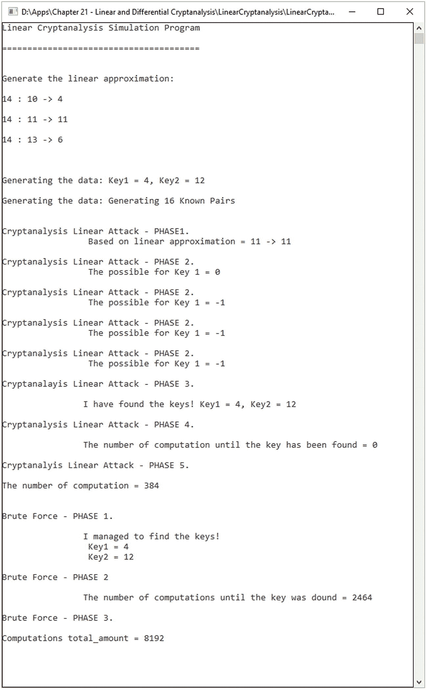

图 20-2

线性密码分析输出模拟程序

```cs
using System;

namespace LinearCryptanalysis
{
    class ExampleOfLinearCryptanalysis
    {
        #region Variables
        public static int[,] approximation_table =
        new int[16,16];
        public static int[] known_plaintext = new int[500];
        public static int[] known_ciphertext = new int[500];
        public static int number_known = 0;

        public static int[] theSBox =
               new int [16] {9, 11, 12, 4, 10, 1, 2, 6, 13,
                                 7, 3, 8, 15, 14, 0, 5};
        public static int[] revtheSBox = {14, 5, 6, 10, 3, 15,
                                 7, 9, 11, 0, 4, 1, 2, 8, 13, 12};
        #endregion

        //** the function will round
        //** the sbox values accordingly
        //** based on the value inputed and the sub key
        public static int RoundingFunction(int theInputValue,
                                                int theSubKey)
        {
            int index_position = theInputValue ^ theSubKey;
            return theSBox[index_position];
        }

        //** generatiing the keys
        //** and generating the known pairs
        public static void FillingTheKnowledgedOnces()
        {
            Random randomNumber = new Random();
            int theSubKey_1 = randomNumber.Next() % 16;
            int theSubKey_2 = randomNumber.Next() % 16;

            Console.WriteLine("Generating the data: Key1 =
                  {0}, Key2 = {1}\n", theSubKey_1, theSubKey_2);

            for (int h = 0; h < number_known; h++)
            {
                known_plaintext[h] = randomNumber.Next() % 16;
                known_ciphertext[h] =
                          RoundingFunction(RoundingFunction(
                          known_plaintext[h], theSubKey_1),
                                theSubKey_2);
            }

            Console.WriteLine("Generating the data: Generating
                              {0} Known Pairs\n\n", number_known);
        }

        //** show the the linear approximation
        //** note that the parameters
        //** a and b starts from 1
        public static void DisplayTheApproximation()
        {
            Console.WriteLine("Generate the linear
                                            approximation: \n");

            for (int a = 1; a < 16; a++)
            {
                for (int b = 1; b < 16; b++)
                {
                    if (approximation_table[a, b] == 14)
                        Console.WriteLine("{0} : {1} to
                                {2}\n", approximation_table[a, b],
                                a, b);
                }
            }
            Console.WriteLine("\n");
        }

        public static int ApplyingTheMask(int v, int m)
        {
            //** v - is the value
            //** m - is the mask
            int internal_value = v & m;
            int total_amount = 0;

            while (internal_value > 0)
            {
                int temporary = internal_value % 2;
                internal_value /= 2;

                if (temporary == 1)
                    total_amount = total_amount ^ 1;
            }
            return total_amount;
        }

        //** the function will validate and
        //** test the keys accordingly
        public static void ValidationAndTestingKeys(int key_1,
        int key_2)
        {
            for (int h = 0; h < number_known; h++)
            {
                if (RoundingFunction(RoundingFunction
                          (known_plaintext[h], key_1), key_2) !=
                          known_ciphertext[h])
                break;
            }
            Console.WriteLine("* ");
        }

        public static void FindingTheApproximation()
        {
            Random randomNumber = new Random();

            //** The output the mask
            for (int a = 1; a < 16; a++)
            {
                //** The input mask
                for (int b = 1; b < 16; b++)
                {
                    //** the input
                    for (int c = 0; c < 16; c++)
                    {
                        if (ApplyingTheMask(c, b) ==
                            ApplyingTheMask(theSBox[c], a))
                        {
                            approximation_table[b, a]++;
                        }
                    }
                }
            }
        }

        public static void Main(String[] args)
        {
            int[] key_score = new int[16];
            int[] theProperKeys = new int[16];
            int stateProgress = 0;
            int maximum_score = 0;
            int guessing_key_1, guessing_key_2;
            int x, y;

            Random randomNumber = new Random();

            Console.WriteLine("Linear Cryptanalysis
                                        Simulation Program\n");

            randomNumber.Next();

            FindingTheApproximation();
            DisplayTheApproximation();

            int approximationAsInput = 11;
            int approximationAsOutput = 11;

            number_known = 16;
            FillingTheKnowledgedOnces();

            Console.WriteLine("Cryptanalysis Linear Attack –
                          PHASE1\. \n\t\t Based on linear
                          approximation = {0} -> {1}\n",
                          approximationAsInput,
                          approximationAsOutput);

            for (x = 0; x < 16; x++)
            {
                key_score[x] = 0;

                for (y = 0; y < number_known; y++)
                {
                    stateProgress++;

                    //** Find Bi by guessing at K1
                    int middle_round =
                          RoundingFunction(known_plaintext[y], x);

                    if ((ApplyingTheMask(middle_round,
                              approximationAsInput) ==
                              ApplyingTheMask(known_ciphertext[y],
                              approximationAsOutput)))
                          key_score[x]++;
                    else
                        key_score[x]--;
                }
            }

            for (x = 0; x < 16; x++)
            {
                int theScore = key_score[x] * key_score[x];
                if (theScore > maximum_score)
                    maximum_score = theScore;
            }

            for (y = 0; y < 16; y++)
                theProperKeys[y] = -1;

            y = 0;

            for (x = 0; x < 16; x++)
                if ((key_score[x] * key_score[x]) ==
                                                    maximum_score)
                {
                    theProperKeys[y] = x;
                    Console.WriteLine("Cryptanalysis Linear
                                Attack - PHASE 2\. \n\t\t The
                                possible for Key 1 = {0}\n",
                                theProperKeys[x]);
                    y++;
                }

            for (y = 0; y < 16; y++)
            {
                if (theProperKeys[y] != -1)
                {
                    int testing_key_1 =
                                RoundingFunction(known_plaintext[0],
                                theProperKeys[y]) ^
                                revtheSBox[known_ciphertext[0]];

                    int g;
                    int wrong = 0;
                    for (g = 0; g < number_known; g++)
                    {
                        stateProgress += 2;
                        int testOut =
                                RoundingFunction(RoundingFunction(
                                known_plaintext[g], theProperKeys[y]), testing_key_1);

                        if (testOut != known_ciphertext[g])
                            wrong = 1;
                    }
                    if (wrong == 0)
                    {
                        Console.WriteLine("Cryptanalayis
                                      Linear Attack - PHASE 3.\n");
                        Console.WriteLine("\t\tI have found
                                      the keys! Key1 = {0}, Key2 =
                                      {1}\n", theProperKeys[y],
                                      testing_key_1);

                        guessing_key_1 = theProperKeys[y];
                        guessing_key_2 = testing_key_1;
                        Console.WriteLine("Cryptanalysis
                                      Linear Attack - PHASE 4.\n");
                        Console.WriteLine("\t\tThe number of
                                      computation until the key has
                                      been found = 0\n",
                                      stateProgress);

                        }
                }
            }

            Console.WriteLine("Cryptanalyis Linear Attack –
                                                   PHASE 5.\n");
            Console.WriteLine("The number of computation =
                                      {0}\n\n", stateProgress);

            stateProgress = 0;

            for (y = 0; y < 16; y++)
            {
                for (x = 0; x < 16; x++)
                {
                    int t;
                    int wrong = 0;
                    for (t = 0; t < number_known; t++)
                    {
                        stateProgress += 2;
                        int testOut =
                               RoundingFunction(RoundingFunction(
                                      known_plaintext[t], y), x);

                        if (testOut != known_ciphertext[t])
                            wrong = 1;
                    }
                    if (wrong == 0)
                    {
                        Console.WriteLine("Brute Force –
                                                         PHASE 1.\n");
                        Console.WriteLine("\t\tI managed to
                                      find the keys! \n\t\t
                                            Key1 = {0} \n\t\t Key2 =
                                            {1}\n", y, x);

                        Console.WriteLine("Brute Force –
                                                         PHASE 2\n");
                        Console.WriteLine("\t\tThe number of
                                      computations until the key
                                      was dound = {0}\n",
                                      stateProgress);
                    }
                }
            }

            Console.WriteLine("Brute Force - PHASE 3.\n");
            Console.WriteLine("Computations total_amount =
                                              {0}\n", stateProgress);

            while (true) { }
        }
    }
}

Listing 20-2Linear Cryptanalysis Simulation

```

## 结论

在本章中，我们讨论了差分和线性密码分析攻击，以及如何设计和实现这种攻击。我们介绍了在设计这种密码分析攻击之前必须了解的理论背景和主要基础。

在本章结束时，您现在可以

*   从理论上确定密码分析人员应该关注的主要部分

*   了解这些组件有多脆弱以及如何被利用

*   实现线性和差分密码分析攻击

## 文献学

1.  琼·代蒙、拉斯·努森和文森特·里门，《分组密码方阵》。快速软件加密(FSE)，”计算机科学*讲义第 1267 卷(第 149-165 页)，以色列海法:施普林格出版社。citeserx 10 . 1 . 1 . 55 . 6109。1997.*

2.  H.Heys，“线性和差分密码分析教程”，载于 *Cryptologia* ，第二十六卷，第 3 期(第 189-221 页)，2002 年。

3.  米（meter 的缩写））Matsui，“DES 密码的线性密码分析方法”，载于*密码学进展-EUROCRYPT’93*(第 386-397 页)，Springer-Verlag，1994 年。

4.  E.比哈姆，《论松井的线性密码分析》在 a .德森蒂斯峰(编)，*计算机科学讲座笔记*，第 950 卷，(第 341–355 页)。施普林格出版社，柏林，1995。

5.  A.Biryukov，C. De Cannière，M. Quisquater，“论多重线性近似”，M. Franklin(编辑)，*密码学进展，2004 年加密会议录，计算机科学讲义 3152* (第 1-22 页)。斯普林格出版社，2004 年。

6.  长度 Keliher，H. Meijer 和 S.E. Tavares，“SPN 最大平均线性外壳概率上限的新方法”在 b .普菲兹曼(编)， *LNCS* ，第 2045 卷(第 420—436 页)。施普林格出版社，柏林，2001。

7.  长度 R. Knudsen 和 J.E. Mathiassen，“对 DES 的选择明文线性攻击”。)，*计算机科学*讲义，1978 卷(第 262–272 页)。施普林格出版社，柏林，2001。

8.  米（meter 的缩写））FEAL 密码已知明文攻击的新方法在 R.A. Rueppel(编)，*计算机科学讲义*，第 658 卷(第 81-91 页)。施普林格出版社，柏林，1993。

9.  米（meter 的缩写））数据加密标准的首次实验性密码分析。在 Y.G. Desmedt (ed)，*计算机科学讲义*，第 839 卷(第 1-11 页)。施普林格出版社，柏林，1994。**